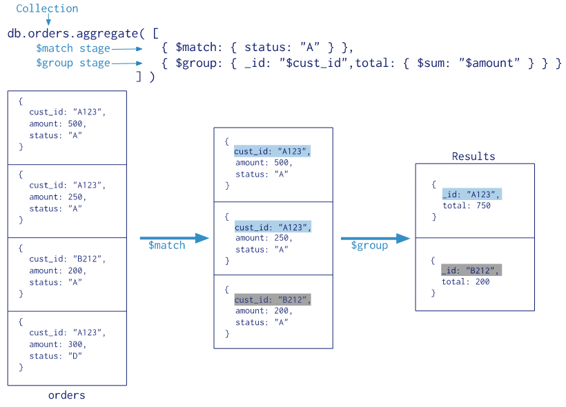
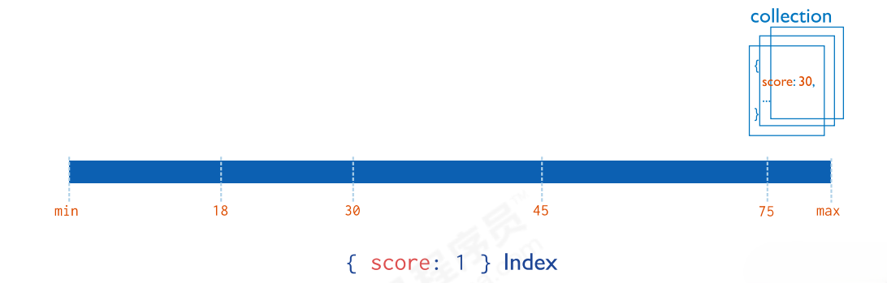
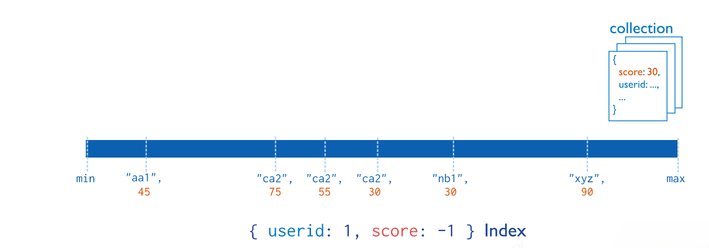

## 数据库操作

### 数据库名称

数据库名可以是满足以下条件的任意 UTF-8 字符串

1. 不能是空字符串（""）
2. 不得含有' '（空格）、.、$、/、\和\0（空字符）
3. 应全部小写
4. 最多 64 字节

有一些数据库名是保留的，可以直接访问这些有特殊作用的数据库

1. admin：从权限的角度来看，这是“root”数据库，将一个用户添加到这个数据库后，这个用户自动继承所有数据库的权限。一些特殊的服务器端命令也只能从这个数据库运行，如：列出所有的数据库或者关闭服务器
2. local：这个数据永远不会被复制，可以用来存储限于本地单台服务器的任意集合
3. config：当 Mongo 用于分片设置时，config 数据库在内部使用，用于保存分片的相关信息

### 常用指令

1. 查看所有数据库：show dbs 或 show databases

注意：要插入一条数据，否则 show dbs; 不显示

2. 查看当前正在使用的数据库：db 或者 db.getName()

注意：MongoDB 中默认的数据库为 test，如果没有选择数据库，集合将存放在 test 数据库中

3. 选择和创建数据库：use 数据库名称

如果数据库存在，则切换到指定的数据库；如果数据库不存在，则创建数据库

注意：在 MongoDB 中，集合只有在内容插入后才会创建，即创建集合（数据表）后要再插入一个文档（记录），集合才会真正创建

4. 删除当前数据库：db.dropDatabase()

主要用来删除已经持久化的数据库

### 其他指令

1. 查看当前数据库状态：db.stats()

2. 查看当前数据库连接机器：db.getMongo()

3. 查看当前数据版本：db.version()
4. 查看命令提示：help() 或 db.help() 或 db.集合名.help()

### 数据库连接

格式：`mongodb://[username:password@]host1[:port1][,host2[:port2],…[,hostN[:portN]]][/[database][?options]]`

1. username: password@（可选项）：如果设置，连接数据库服务后会尝试登录该数据库
2. database（可选项）：如果指定 username: password@ 连接验证指定数据库，不指定连接 test 数据库
3. options（连接选项）：如果不使用 database 前面需加上/，所有连接选项都是键值对 name = value，多个选项时，以&或; 分隔。

## 集合操作

### 集合名称

1. 集合名不能是空字符串
2. 集合名不能含有\0 字符（空字符），这个字符表示集合名的结尾
3. 集合名不能以“system.”开头，这是为系统集合保留的前缀
4. 用户创建的集合不能含有保留字符

### 常用指令

1. 创建集合

+ 显式创建：db.createCollection('集合名')

```shell
//创建固定集合
db.createCollection("yzyTest",{
	capped:true,
	size:6142800,
	max:1000
});

capped：如果为true，则创建固定集合。固定集合是指有着固定大小的集合，当达到最大值，会自动覆盖最早的文档，当值为true时，必须指定size参数。
size：为固定集合指定一个最大值，即字节数。
max：指定固定集合中包含文档的最大数量。
注:在插入文档时，mongoDB首先检查固定集合的size字段，然后检查max字段。
```

+ 隐式创建（集合不存在时则会自动创建集合）：db.集合名.insert(doc)

2. 显示数据库中所有集合：show collections
3. 删除集合：db.集合名.drop()
4. 集合重命名：db.集合名.renameCollection("集合名")
5. 获取当前 db 所有集合：db.getCollectionNames()
6. 获取当前 db 指定名称的集合：db.getCollection("集合名")

### 其他指令

1. 查询当前集合所在数据库：db.集合名.getDB()

2. 查询当前集合数量：db.集合名.count() 或 db.集合名.find().count()

3. 查询当前集合的数据空间大小：db.集合名.dataSize()

4. 查询当前集合总大小：db.集合名.totalSize()

5. 查询当前集合存储空间大小：db.集合名.storageSize()

## 文档操作

### 文档属性

1. mongo 中的数字，默认情况下是 double 类型，如果要存整型，必须使用函数 NumberInt（整型数字）
2. 插入当前日期使用 new Date()
3. 插入的数据没有指定_id，会自动生成主键值
4. 如果某字段没值，可以赋值为 null，或者不写该字段

注意：

1. 文档中的键值对是有序的
2. MongoDB 区分类型和大小写
3. MongoDB 的文档不能有重复的键

### 常用指令

1. 插入

+ db.集合名.insert()：向集合中插入一个或多个文档
+ db.集合名.insertOne()：向集合中插入一个文档
+ db.集合名.insertMany()：向集合中插入多个文档

```json
db.test1.insert({name:"test1"})
db.test1.insert([{name:"test1"},{name:"test2"}])
db.test1.insertOne({name:"test1"})
db.test1.insertOne({_id:"01",name:"yang",age:"12"})
db.test1.insertMany([{name:"test1"},{name:"test2"}])
db.test1.insertMany([{_id:"02",name:"yang",age:"12"},{_id:"03",name:"yang",age:"12"}])
```

注意：如果某条数据插入失败，将会终止插入，但是已经插入成功的数据不会回滚掉，可以使用 try catch 进行异常捕捉处理

```json
try{
  db.test1.insertMany([
	#插入的数据集合
  ]);
}catch(e){
  print(e);
}
```

2. 查询

+ db.集合名.find()：查询集合中的所有文档，返回的是一个数组
+ db.集合名.findOne()：查询集合中符合条件的第一个文档，返回的是一个对象
+ db.集合名.find().count()：查询集合中所有文档的数量
+ db.集合名.count({条件})：查询集合中符合条件的文档数量
+ db.集合名.find({属性: 值})：查询集合中属性是指定值的文档，若需要查询指定的属性，需要使用“查询操作符”来完成查询
+ db.集合名.find().limit(数字)：设置限制数据的上限
+ db.集合名.find().skip(数字)：设置跳过的数据个数
+ db.集合名.distinct("字段名")：去重查询

```json
db.test.find()
db.test.find({})
db.test.find().count()
db.test.count({name:"hello"})
db.test.find({name:"hello"})
db.test.find({name:"hello",age:12})
db.test.findOne()
db.test.findOne({name:"hello"})
db.test.find().limit(10)
db.test.find().skip(10)
db.test.find().skip(10).limit(10)
```

3. 高级查询

投影查询：如果要查询结果返回部分字段，则需要使用投影查询（不显示所有字段，只显示指定的字段）

```json
#查询结果只显示_id、name、nickname，其中默认_id会显示
db.test.find({name:"hello"},{name:1,nickname:1})
#查询结果只显示_id、name，其中默认_id会显示
db.test.find({name:"hello"},{name:1,nickname:0})
#查询结果只显示name
db.test.find({name:"hello"},{name:1,_id:0})
```

排序查询：sort()方法对数据进行排序，其中 1 为升序排序，-1 为降序排序

```json
db.test.find().sort({name:1})
db.test.find().sort({name:1,_id:-1})
```

比较查询：

+ 大于：$gt
+ 小于：$lt
+ 大于等于：$gte
+ 小于等于：$lte
+ 不等于：$ne

```json
db.test.find({age:{$gt:18}})
db.test.find({age:{$lt:18}})
db.test.find({age:{$gte:18}})
db.test.find({age:{$lte:18}})
db.test.find({age:{$ne:18}})
```

包含查询：包含使用 $in，不包含使用$ nin

```json
db.test.find({age:{$in:[12,23]}})
db.test.find({age:{$nin:[12,23]}})
```

条件连接查询：如果需要同时满足两个以上条件，需要使用 $and、$ or 进行关联

```json
db.test.find({$and:[{likenum:{$gte:NumberInt(700)}},{likenum:{$lt:NumberInt(2000)}}]})
db.test.find({$or:[{userId:"1003"},{likenum:{$lt:1000}}]})
```

```json
db.test.find({
  $or:[
    {"name":"hello world!!!"}, {"age":"27"}
  ]
})

相当于: key0=name0 and (key1=name1 or key2=name2)
db.test.find({
  "age":"27",
  $or:[
    {"name":"hello world!!!"}, {"age":"27"}
  ]
})
```

模糊查询：MongoDB 的模糊查询是通过正则表达式的方式实现的

```json
db.collection.find({field:/正则表达式/})

db.test.find({content:/hello/})
// 模糊查询-包含2
db.test.find({
  "age":/2/
});
// 模糊查询-以2开头
db.test.find({
  "age":/^2/
});
//模糊查询-小写kul
db.test.find({
  "yyy":/kul/
});
//模糊查询-忽略大小写
db.test.find({
  "yyy":/kul/i
});
```

$type 类型查询：基于 BSON 类型来检索集合中匹配的数据类型，并返回结果

```json
#查询age字段为String的数据
db.test.find({"age":{
	$type:'string'
}});

#查询age字段为int的数据
db.test.find({"age":{
	$type:'int'
}});
```

4. 修改

+ db.集合名.update({查询条件},{新对象})：默认情况会使用新对象覆盖旧对象，若需要修改指定的属性，需要使用“修改操作符”来完成修改
  - $set：修改文档中的指定属性
  - $unset：删除文档中的指定属性
  - $push/$ addToSet：向数组中添加一个新的元素（后者如果数组中已存在该元素，则不会添加）
  - $inc：进行自增操作
+ db.集合名.updateMany()：同时修改多个符合条件的文档
+ db.集合名.updateOne()：修改一个符合条件的文档
+ db.集合名.replaceOne()：替换一个文档

```json
#覆盖修改：每次修改都会覆盖原来的数据
db.test.update({name:'hello'},{name:'test'})
db.test.update({name:'hello'},{name:'dp',age:12})

#局部修改：每次修改只会修改部分的数据（默认只修改第一条数据）
db.test.update({name:'hello'},{$set:{name:'test'}})
db.test.update({name:'hello'},{$set:{name:'test',age:12}})

#批量修改：修改所有符合条件的数据
db.test.update({name:'hello'},{$set:{name:'test'}},{multi:true})
db.test.updateMany({age:"12"},{$set:{age:"13"}})

#列值增长的修改：对某列值在原有值的基础上进行增加或减少
db.test.update({name:'hello'},{$inc:{age:NumberInt(3)})
                               
db.test.updateOne({age:"12"},{$set:{age:"13"}});
```

5. 删除

+ db.集合名.remove(条件)：删除符合条件的所有文档（默认情况下会删除多个，但第二个参数传 true 时只会删除一个）
+ db.集合名.remove({})：删除集合中的所有文档
+ db.集合名.deleteOne()：删除符合条件的一个文档
+ db.集合名.deleteMany()：删除符合条件的多个文档

```json
db.test.deleteOne({age:"13"})
db.test.deleteMany({age:"13"})
```

### 其他指令

```json
db.test.find().forEach(
    function(item){
        if(item.age >= 12){
           db.test.updateOne({age:item.age},{$set:{age:"13"}});
        }
    }
)
```

### 聚合查询

聚合操作主要用于处理数据并返回计算结果。聚合操作将来自多个文档的值组合在一起，按条件分组后，再进行一系列操作（如求和、平均值、最大值、最小值）以返回单个结果。

在 MongoDB 中，有两种方式计算聚合：Pipeline 和 MapReduce。Pipeline 查询速度快于 MapReduce，但是 MapReduce 的强大之处在于能够在多台 Server 上并行执行复杂的聚合逻辑。MongoDB 不允许 Pipeline 的单个聚合操作占用过多的系统内存。

#### 聚合流程

聚合管道方法的流程参见下图



上图的聚合操作相当于 MySQL 中的以下语句：

```sql
select cust_id as _id, sum(amount) as total from orders where status like "%A%" group by cust_id;
```

#### 聚合语法

```sql
db.collection.aggregate(pipeline, options)
```

使用 db.collection.aggregate()直接查询会提示错误，但是传一个空数组如 db.collection.aggregate([])则不会报错，且会和 find 一样返回所有文档。

#### $count

返回包含输入到 stage 的文档的计数，理解为返回与表或视图的 find()查询匹配的文档的计数，db.collection.count()方法不执行 find()操作，而是计数并返回与查询匹配的结果数。

```sql
{ 
	$count: <string> 
}
```

$count阶段相当于下面$ group+$project 的序列：

```json
db.collection.aggregate([
    {
        "$group": {
            "_id": null,
            // 这里count自定义，相当于mysql的select count(*) as tables
            "count": {
                "$sum": 1
            }
        }
    },
    {
        // 返回不显示_id字段
        "$project": {
            "_id": 0
        }
    }
])
```

查询人数是 `100000` 以上的城市的数量

- $match：阶段排除 pop 小于等于 100000 的文档，将大于 100000 的文档传到下个阶段
- $count：阶段返回聚合管道中剩余文档的计数，并将该值分配给名为`count`的字段。

```json
db.zips.aggregate([
    {
        "$match": {
            "pop": {
                "$gt": 100000
            }
        }
    },
    {
        "$count": "count"
    }
])
```

#### $group

按指定的表达式对文档进行分组，并将每个不同分组的文档输出到下一个阶段。输出文档包含一个_id 字段，该字段按键包含不同的组。

输出文档还可以包含计算字段，该字段保存由 $group的_id字段分组的一些accumulator表达式的值。 $ group 不会输出具体的文档而只是统计信息。

```json
{ 
    $group: { 
        _id: <expression>, 
        <field1>: { 
        	<accumulator1> : <expression1> 
    	}, ... 
	} 
}
```

- `_id` 字段是必填的，但是可以指定_id 值为 null 来为整个输入文档计算累计值。
- 剩余的计算字段是可选的，并使用 `<accumulator>` 运算符进行计算。
- `_id` 和 `<accumulator>` 表达式可以接受任何有效的表达式。

accumulator 操作符

> $group阶段的内存限制为100M，默认情况下，如果stage超过此限制，$ group 将产生错误，但是，要允许处理大型数据集，请将 allowDiskUse 选项设置为 true 以启用$group 操作以写入临时文件。

**注意：**

- "$addToSet ": expr，如果当前数组中不包含 expr，那就将它添加到数组中。
- "$push ": expr，不管 expr 是什么值，都将它添加到数组中，返回包含所有值的数组。

按照 `state` 分组，并计算每一个 state 分组的总人数，平均人数以及每个分组的数量

```json
db.zips.aggregate([
    {
        "$group": {
            "_id": "$state",
            "totalPop": {
                "$sum": "$pop"
            },
            "avglPop": {
                "$avg": "$pop"
            },
            "count": {
                "$sum": 1
            }
        }
    }
])
```

查找不重复的所有的 `state` 的值

```json
db.zips.aggregate([
    {
        "$group": {
            "_id": "$state"
        }
    }
])
```

按照 `city` 分组，并且分组内的 `state` 字段列表加入到 `stateItem` 并显示

```json
db.zips.aggregate([
    {
        "$group": {
            "_id": "$city",
            "stateItem": {
                "$push": "$state"
            }
        }
    }
])
```

使用系统变量$$ROOT 按 item 对文档进行分组，生成的文档不得超过 BSON 文档大小限制

```json
db.zips.aggregate([
    {
        "$group": {
            "_id": "$city",
            "item": {
                "$push": "$$ROOT"
            }
        }
    }
]).pretty();
```

#### $match

过滤文档，仅将符合指定条件的文档传递到下一个管道阶段。$match 接受一个指定查询条件的文档，查询语法与读操作查询语法相同。

```json
{ 
    $match: { 
        <query> 
    } 
}
```

管道优化

$match用于对文档进行筛选，之后可以在得到的文档子集上做聚合，$ match 可以使用除了地理空间之外的所有常规查询操作符，在实际应用中尽可能将$match 放在管道的前面位置。这样有两个好处：

- 一是可以快速将不需要的文档过滤掉，以减少管道的工作量；
- 二是如果再投射和分组之前执行$match，查询可以使用索引。

使用限制

- 不能在 `$match` 查询中使用 `$` 作为聚合管道的一部分。
- 要在 `$match` 阶段使用 `$text`，`$match` 阶段必须是管道的第一阶段。
- 视图不支持文本搜索。

使用 $match 做简单的匹配查询，查询缩写是`NY`的城市数据

```json
db.zips.aggregate([
    {
        "$match": {
            "state": "NY"
        }
    }
]).pretty();
```

使用 $match管道选择要处理的文档，然后将结果输出到$ group 管道以计算文档的计数

```json
db.zips.aggregate([
    {
        "$match": {
            "state": "NY"
        }
    },
    {
        "$group": {
            "_id": null,
            "sum": {
                "$sum": "$pop"
            },
            "avg": {
                "$avg": "$pop"
            },
            "count": {
                "$sum": 1
            }
        }
    }
]).pretty();
```

#### $project

$project 可以从文档中选择想要的字段，和不想要的字段（指定的字段可以是来自输入文档或新计算字段的现有字段），也可以通过管道表达式进行一些复杂的操作，例如数学操作，日期操作，字符串操作，逻辑操作。

$project 管道符的作用是选择字段（指定字段，添加字段，不显示字段，_id：0，排除字段等），重命名字段，派生字段。

```json
{ 
    $project: { 
        <specification(s)> 
	} 
}
```

specifications 有以下形式：

- `<field>`: `<1 or true>` 是否包含该字段，field: 1/0，表示选择/不选择 field

- `_id`: `<0 or false>` 是否指定_id 字段

以下$project 阶段的输出文档中只包含_id，city 和 state 字段

```json
db.zips.aggregate([
    {
        "$project": {
            "_id": 1,
            "city": 1,
            "state": 1
        }
    }
]).pretty();
```

`_id` 字段默认包含在内。要从$ project 阶段的输出文档中排除`_id`字段，请在 project 文档中将`_id`字段设置为 0 来指定排除_id 字段。

```json
db.zips.aggregate([
    {
        "$project": {
            "_id": 0,
            "city": 1,
            "state": 1
        }
    }
]).pretty();
```

可以在聚合表达式中使用变量 REMOVE 来有条件地禁止一个字段，

```json
db.zips.aggregate([
    {
        "$project": {
            "_id": 1,
            "city": 1,
            "state": 1,
            "pop": 1,
            "loc": {
                "$cond": {
                    "if": {
                        "$gt": [
                            "$pop",
                            1000
                        ]
                    },
                    "then": "$$REMOVE",
                    "else": "$loc"
                }
            }
        }
    }
]).pretty();
```

将人数大于 1000 的城市坐标重置为 0

```json
db.zips.aggregate([
    {
        "$project": {
            "_id": 1,
            "city": 1,
            "state": 1,
            "pop": 1,
            "loc": {
                "$cond": {
                    "if": {
                        "$gt": [
                            "$pop",
                            1000
                        ]
                    },
                    "then": [
                        0,
                        0
                    ],
                    "else": "$loc"
                }
            }
        }
    }
]).pretty();
```

新增字段列

```json
db.zips.aggregate([
    {
        "$project": {
            "_id": 1,
            "city": 1,
            "state": 1,
            "pop": 1,
            "desc": {
                "$cond": {
                    "if": {
                        "$gt": [
                            "$pop",
                            1000
                        ]
                    },
                    "then": "人数过多",
                    "else": "人数过少"
                }
            },
            "loc": {
                "$cond": {
                    "if": {
                        "$gt": [
                            "$pop",
                            1000
                        ]
                    },
                    "then": [
                        0,
                        0
                    ],
                    "else": "$loc"
                }
            }
        }
    }
]).pretty();
```

#### $limit

限制传递到管道中下一阶段的文档数

```json
{ 
    $limit: <positive integer> 
}
```

此操作仅返回管道传递给它的前 5 个文档

```json
db.zips.aggregate({
    "$limit": 5
});
```

#### $skip

跳过进入 stage 的指定数量的文档，并将其余文档传递到管道中的下一个阶段

```json
{ 
    $skip: <positive integer> 
}
```

跳过管道传递给它的前 5 个文档

```json
db.zips.aggregate({
    "$skip": 5
});
```

#### $sort

对所有输入文档进行排序，并按排序顺序将它们返回到管道。

```json
{ 
    $sort: { 
        <field1>: <sort order>, 
        <field2>: <sort order> 
        ... 
    } 
}
```

$sort 指定要排序的字段和相应的排序顺序的文档。 `< sort order >`可以具有以下值之一：

- 1 指定升序。
- -1 指定降序。
- {$meta：“textScore”}按照降序排列计算出的 textScore 元数据。

对字段进行排序

```json
db.zips.aggregate([
    {
        "$sort": {
            "pop": -1,
            "city": 1
        }
    }
])
```

#### $sortByCount

根据指定表达式的值对传入文档分组，然后计算每个不同组中文档的数量。每个输出文档都包含两个字段：包含不同分组值的_id 字段和包含属于该分组或类别的文档数的计数字段，文件按降序排列。

```json
{ 
    $sortByCount:  <expression> 
}
```


## 索引操作

1. 如果没有索引，MongoDB 必须执行全集合扫描，即扫描集合中的每个文档，以选择与查询语句匹配的文档，这种扫描全集合的查询效率是非常低的
2. 索引是特殊的数据结构，它以易于遍历的形式存储集合数据集的一小部分，索引存储特定字段或一组字段的值，按字段值排序
3. MongoDB 索引使用 B 树存储

### 索引类型

1. 单字段索引

MongoDB 支持在文档的单个字段上创建用户定义的升序/降序索引，称为单字段索引。对于单个字段索引和排序操作，索引键的排序顺序（即升序或降序）并不重要，因为 MongoDB 可以在任何方向上遍历索引



2. 复合索引

MongoDB 支持多个字段的用户定义索引，即复合索引。复合索引中列出的字段顺序具有重要意义，例如：如果复合索引由{userid: 1, score:-1}组成，则索引首先按 userid 正序排序，然后在每个 userid 的值内，再按 score 倒序排序



3. 地理空间索引

为了支持对地理空间坐标数据的有效查询，MongoDB 提供了两种特殊的索引：返回结果时使用平面几何的二维索引和返回结果时使用球面几何的二维球面索引

4. 文本索引

MongoDB 提供了一种文本索引类型，支持在集合中搜索字符串内容，这些文本索引不存储特定于语言的停止词（例如：the、a、or），而将集合中的词作为词干，只存储根词

5. 哈希索引

为了支持基于散列的分片，MongoDB 提供了散列索引类型，它对字段值的散列进行索引，这些索引在其范围内的值分布更加随机，但只支持相等匹配，不支持基于范围的查询

### 常用指令

1. db.集合名.getIndexes()：查看索引

注意：MongoDB 在创建集合的过程中，在\_id 字段上创建一个唯一的索引，默认名字为 id，该索引可防止客户端插入两个具有相同值的文档，不能在_id 字段上删除此索引。该索引是唯一索引，因此值不能重复

2. db.集合名.createIndex()：在集合上创建索引
3. db.集合名.dropIndex(索引名)：删除指定索引
4. db.集合名.dropIndexes()：删除全部索引
5. db.集合名.find().explain()：查看集合中索引的执行计划
6. db.printCollectionStats()：查询当前 db 所有索引

```json
db.test.getIndexes()
db.test.createIndex({name:1})
db.test.createIndex({name:1,age:-1})
db.test.dropIndexes()
db.test.find({userid:"1001"}).explain()
```

```json
//创建普通索引
//db.集合.ensureIndex({字段名:1}) 1表示升序、-1表示降序 升序、降序对单索引没有影响，对复合索引有影响
db.test.ensureIndex({"name":1});

//创建复合索引
db.test.ensureIndex({"name":1,"age":1});

//创建唯一索引
db.test.ensureIndex({"age":1},{"unique":true});

//删除索引
db.test.dropIndex({"name":1});

//查询当前集合所有索引
db.test.getIndexes();
```

### 涵盖查询

当查询条件和查询的投影仅包含索引字段时，MongoDB 直接从索引返回结果，而不扫描任何文档或将文档带入内存


## 用户操作

### 添加用户

```json
db.createUser( {
	user: "sa",
	pwd: "sa",
	roles: [ { 
        role: "root", 
        db: "admin" 
    } ]
});
```

### 角色种类

1. 超级用户角色：root
2. 数据库用户角色：read、readWrite
3. 数据库管理角色：dbAdmin、userAdmin
4. 集群管理角色： clusterAdmin、clusterManager、clusterMonitor、hostManager
5. 备份恢复角色： backup、restore
6. 所有数据库角色： readAnyDatabase、readWriteAnyDatabase、userAdminAnyDatabase、dbAdminAnyDatabase

### 角色说明

1. root：只在 admin 数据库中可用。超级账号，超级权限；
2. read：允许用户读取指定数据库；
3. readWrite：允许用户读写指定数据库
