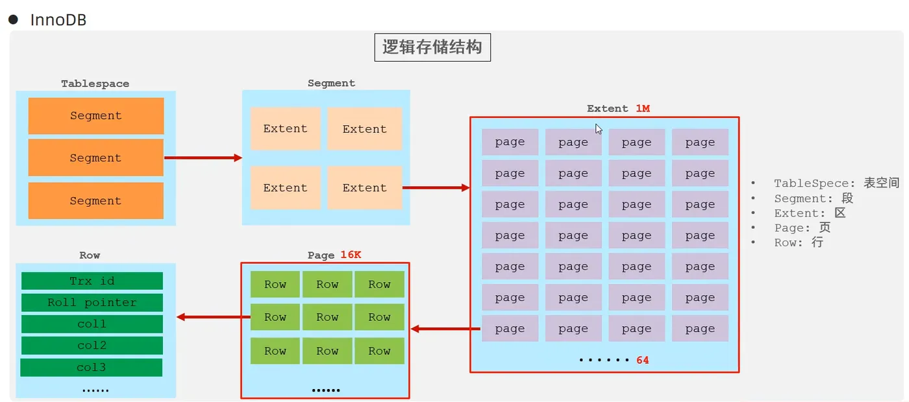

## 基本介绍

数据库存储引擎是数据库底层软件组件，数据库管理系统（DBMS）使用数据引擎进行创建、查询、更新和删除数据操作。不同的存储引擎提供不同的存储机制、索引技巧、锁定水平等功能，使用不同的存储引擎，还可以获得特定的功能。现在许多的数据库管理系统都支持多种不同的数据引擎。MySQL 的核心就是存储引擎。

MySQL 提供了多个不同的存储引擎，包括处理事务安全表的引擎和处理非事务安全表的引擎。在 MySQL 中，不需要在整个服务器中使用同一种存储引擎，针对具体的要求，可以对每一个表使用不同的存储引擎。MySQL5.7 支持的存储引擎有：InnoDB, MyISAM, Memory, Merge, Archive, Federate, CSV, BLACKHOLE 等。

可以使用 SHOW ENGINES 语句查看系统支持的引擎类型

```sql
create table my_myisam(
    id int,
    name varchar(10)
) engine = MyISAM;
```

## InnoDB 存储引擎

InnoDB 给 MySQL 的表提供了事务、回滚、崩溃修复能力和多版本并发控制的事务安全。MySQL 从 3.23.34a 开始就包含 InnoDB 存储引擎，InnoDB 是 MySQL 第一个提供外键约束的表引擎，而且 InnoDB 对事务处理的能力也是 MySQL 其他存储引擎所无法与之比的。

MySQL5.5.5 之后，InnoDB 作为默认的存储引擎，MySQL 8.0 版本在原先的基础上将系统数据库的存储引擎也改为了 InnoDB。

**主要特性**

1. 支持事务：支持完整的 ACID 事务特性，它还提供了事务的隔离级别，可以防止脏读、不可重复读、幻读等问题。
2. 灾难恢复性好：InnoDB 通过使用重做日志（Redo Logs） 和撤销日志（Undo Logs）来保证在系统崩溃时的数据恢复能力
3. 支持外键完整性约束：可以在表与表之间定义数据的依赖关系，并自动维护参照完整性
4. 支持行级锁定：适合高并发的写操作，锁冲突的概率较小
5. 使用聚簇索引：主键索引和数据存储在一起。每个表必须有一个主键，如果没有定义主键，InnoDB 会自动生成一个隐藏的主键
6. 为处理巨大数据量的最大性能设计
7. 实现了缓存管理，不仅能缓存索引也能缓存数据，并且会自动创建散列索引以加快数据的获取

InnoDB 存储引擎中支持自动增长列 AUTO_INCREMENT。自动增长列的值不能为空，且值必须唯一。MySQL 中规定自增列必须为主键。在插入值时，如果自动增长列不输入值，那么插入的值为自动增长后的值；如果输入的值为 0 或空（NULL），那么插入的值也为自动增长后的值；如果插入某个确定的值，且该值在前面没有出现过，那么可以直接插入。

InnoDB 存储引擎中支持外键（FOREIGN KEY）。外键所在的表为子表，外键所依赖的表为父表。父表中被子表外键关联的字段必须为主键。当删除、更新父表的某条信息时，子表也必须有相应的改变。

**优缺点**

1. 优点：提供了良好的事务管理、崩溃修复能力和并发控制；
2. 缺点：其读写效率稍差，占用的数据空间相对比较大。

**适用场景**

1. 银行交易系统：涉及到大量的插入、更新操作，并且需要保证事务的完整性和隔离性。
2. 电子商务平台：需要频繁的订单插入和库存更新，并保证数据一致性。

**工作机制**

1. 数据存储结构：InnoDB 将表存储在一个逻辑的表空间中，默认情况下使用共享表空间 `ibdata` 文件，也可以每个表单独存储在自己的 `.ibd` 文件中。
2. 缓冲池（Buffer Pool）：InnoDB 通过缓存数据页的方式，减少磁盘 I/O 操作。修改操作首先会被写入缓冲池，随后异步地刷新到磁盘。
3. 双写缓冲（Doublewrite Buffer）：为了防止在崩溃或断电时数据部分写入磁盘导致的损坏，InnoDB 将数据页写入两次，确保数据完整。



1. TableSpace 表空间 : InnoDB 存储引擎逻辑结构的最高层，ibd 文件其实就是表空间文件，在表空间中可以包含多个 Segment 段。
2. Segment 段 : 表空间是由各个段组成的， 常见的段有数据段、索引段、回滚段等。InnoDB 中对于段的管理，都是引擎自身完成，不需要人为对其控制，一个段中包含多个区。
3. Extent 区 : 区是表空间的单元结构，每个区的大小为 1M。 默认情况下， InnoDB 存储引擎页大小为 16K， 即一个区中一共有 64 个连续的页。
4. Page 页 : 页是组成区的最小单元，页也是 InnoDB 存储引擎磁盘管理的最小单元，每个页的大小默认为 16KB。为了保证页的连续性，InnoDB 存储引擎每次从磁盘申请 4-5 个区。
5. Row 行 : InnoDB 存储引擎是面向行的，也就是说数据是按行进行存放的，在每一行中除了定义表时所指定的字段以外，还包含两个隐藏字段(后面会详细介绍)。

## MyISAM 存储引擎

MyISAM 存储引擎是基于 ISAM 存储引擎发展起来的。MyISAM 拥有较高的插入、查询速度，但不支持事务。在 MySQL5.5.5 之前的版本中，MyISAM 是默认的存储引擎

**主要特性**

1. 不支持事务和外键，因此不能保证数据的完整性和一致性
2. 使用表级锁，并发性差
3. 主机宕机后，MyISAM 表易损坏，灾难恢复性不佳
4. 可以配合锁，实现操作系统下的复制备份、迁移
5. 只缓存索引，数据的缓存是利用操作系统缓冲区来实现的，可能引发过多的系统调用且效率不佳
6. 数据紧凑存储，因此可获得更小的索引和更快的全表扫描性能
7. 可以把数据文件和索引文件放在不同目录

**优缺点**

1. 优点：占用空间小，处理速度快；

2. 缺点：不支持事务的完整性和并发性。

**适用场景**

1. 只读数据库：用于静态数据存储，且更新频率低的场景。例如，数据仓库或日志存储系统。
2. 全文搜索：需要对文本进行快速全文搜索的场景。

**工作机制**

MyISAM 存储引擎的表存储成 3 个文件。文件的名字与表名相同，扩展名包括 frm、MYD 和 MYI。

* frm 为扩展名的文件存储表的结构；
* MYD 为扩展名的文件存储数据，是 MYData 的缩写；
* MYI 为扩展名的文件存储索引，是 MYIndex 的缩写。

基于 MyISAM 存储引擎的表支持 3 种存储格式，包括静态型、动态型和压缩型。其中，静态型为 MyISAM 存储引擎的默认存储格式，其字段是固定长度的；动态型包含变长字段，记录的长度不是固定的；压缩型需要使用 myiampack 工具创建，占用的磁盘空间较小。

## MEMORY 存储引擎

MEMORY 存储引擎是 MySQL 中一类特殊存储引擎。其使用存储在内存中的内容来创建表，而且所有数据也放在内存中。这些特性都与 InnoDB 存储引擎、MyISAM 存储引擎不同。

**主要特性**

1. 使用表级锁，虽然内存访问快，但如果频繁的读写，表级锁会成为瓶颈
2. 只支持固定大小的行。varchar 类型的字段会存储为固定长度的 char 类型，浪费空间
3. 不支持 TEXT、BLOB 字段。当有些查询需要使用到临时表（使用的也是 MEMORY 存储引擎）时，如果表中有 TEXT、BLOB 字段，那么会转换为基于磁盘的 MyISAM 表，严重降低性能
4. 由于内存资源成本昂贵，一般不建议设置过大的内存表，如果内存表满了，可通过清除数据或调整内存表参数来避免报错
5. 服务器重启后数据会丢失，复制维护时需要小心

**适用场景**

1. 临时数据处理：Memory 引擎适合用于临时数据处理、缓存数据等。例如，临时表或会话数据存储。
2. 快速查询结果存储：需要高效快速查询但不需要持久化的场景。

**工作机制**

每个基于 MEMORY 存储引擎的表实际对应一个磁盘文件，该文件的文件名与表名相同，类型为 frm 类型，该文件中只存储表的结构，而其数据文件都是存储在内存中的。这样有利于数据的快速处理，提供整个表的处理效率。值得注意的是，服务器需要有足够的内存来维持 MEMORY 存储引擎的表的使用。如果不需要使用了，可以释放这些内存，甚至可以删除不需要的表。

MEMORY 存储引擎默认使用哈希（HASH）索引，其速度要比使用 B 型树（BTREE）索引快。如果希望使用 B 型树索引，可以在创建索引时选择使用。

MEMORY 表的大小是受到限制的。表的大小主要取决于两个参数，分别是 max_rows 和 max_heap_table_size。其中，max_rows 可以在创建表时指定；max_heap_table_size 的大小默认为 16MB，可以按需要进行扩大。因此，其存在于内存中的特性，这类表的处理速度非常快。但是，其数据易丢失，生命周期短。基于这个缺陷，选择 MEMORY 存储引擎时需要特别小心。

## CSV 存储引擎

**主要特性**

1. 文本存储：CSV 引擎将数据存储为逗号分隔值的文本文件，类似于传统的 CSV 文件。
2. 简单结构：每张表的数据都会被存储在一个 `.csv` 文件中。
3. 不支持索引：CSV 引擎不支持索引，因此查询性能较差。
4. 便于导入和导出：由于其存储格式是标准的 CSV 文件，便于与外部系统进行数据交换

**适用场景**

1. 数据导入和导出：在需要与其他系统交换数据时，CSV 存储引擎是一个很好的选择。
2. 临时数据存储：对于需要简单格式且不需要索引的数据存储场景，可以使用 CSV。

## Archive 存储引擎

**主要特性**

1. 适合大规模数据存储：Archive 存储引擎专门设计用于高效地存储大量的历史数据或归档数据。
2. 支持插入和查询：Archive 只支持插入操作和查询操作，不支持更新和删除操作。
3. 数据压缩：Archive 引擎会将数据进行压缩存储，从而减少磁盘占用。
4. 表级锁定：Archive 使用表级锁定。

**适用场景**

日志系统：Archive 存储引擎非常适合存储日志数据，历史归档数据等，数据存储空间有限的场景。

## 总结

| 功能         | InnoDB | MyISAM | Memory |
| ------------ | ------ | ------ | ------ |
| 存储限制     | 64TB   | 256TB  | RAM    |
| 支持事务     | Yes    | No     | No     |
| 支持全文索引 | No     | Yes    | No     |
| 支持树索引   | Yes    | Yes    | Yes    |
| 支持哈希索引 | No     | No     | Yes    |
| 支持数据缓存 | Yes    | No     | N/A    |
| 支持外键     | Yes    | No     | No     |
| 锁机制       | 行锁   | 表锁   | 表锁   |
