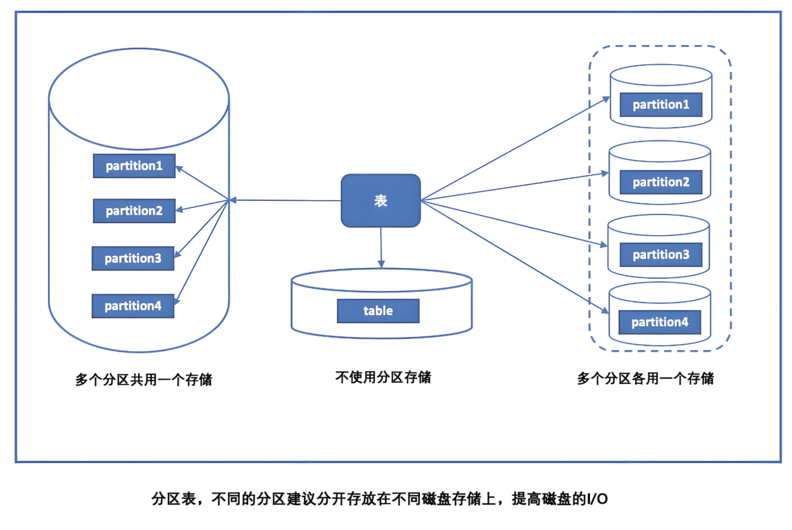
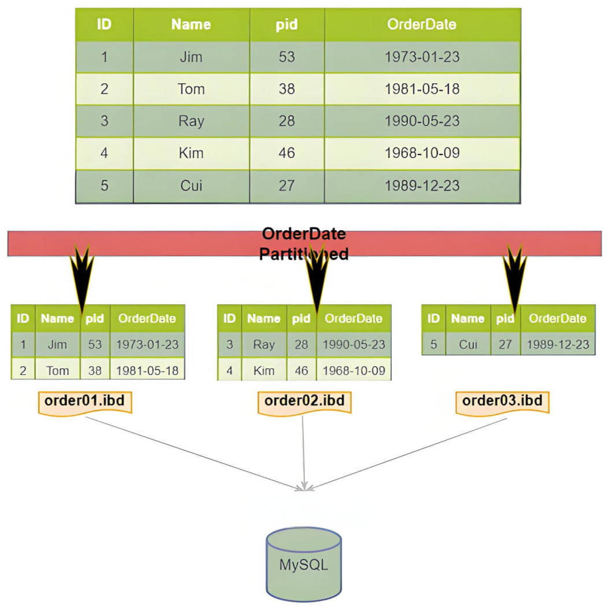

## 出现背景

**传统不分区数据库痛点**

mysql 数据库中的数据是以文件的形势存在磁盘上的，默认放在/mysql/data 下面（可以通过 my.cnf 中的 datadir 来查看）

在 MySQL 中，如果存储引擎是 MyISAM，那么在 data 目录下会看到 3 类文件：.frm、.myi、.myd，文件含义如下：

```tex
*.frm：这个是表定义，是描述表结构的文件。
*.myd：这个是数据信息文件，是表的数据文件。
*.myi：这个是索引信息文件。
```

如果存储引擎是 InnoDB, 那么在 data 目录下会看到两类文件：.frm、.ibd，文件含义如下：

```tex
*.frm：表结构文件。
*.ibd：表数据和索引的文件。
```

无论是哪种存储引擎，只要一张表的数据量过大，就会导致 .myd、.myi 以及 .ibd 文件过大，从而数据的查找就会变的很慢。

**数据库分区处理**

为了解决这个问题，我们可以利用 MySQL 的分区功能，在物理上将这一张表对应的文件，分割成许多小块，如此，当我们查找一条数据时，就不用在某一个文件中进行整个遍历了，我们只需要知道这条数据位于哪一个数据块，然后在那一个数据块上查找就行了。

另一方面，如果一张表的数据量太大，可能一个磁盘放不下，这个时候，通过表分区我们就可以把数据分配到不同的磁盘里面去。

通俗地讲表分区就是将一大表，根据条件分割成若干个小表。

## 基本概念

MySQL 分区是一种数据库优化的技术，它允许将一个大的表、索引或其子集分割成多个较小的、更易于管理的片段，这些片段称为“分区”。每个分区都可以独立于其他分区进行存储、备份、索引和其他操作。这种技术主要是为了改善大型数据库表的查询性能、维护的方便性以及数据管理效率。

1. 物理存储和逻辑分割
+ 物理上，每个分区可以存储在不同的文件或目录中，这取决于分区类型和配置
+ 逻辑上，表数据根据分区键的值被分割到不同的分区里
2. 查询性能提升
+ 当执行查询时，MySQL 能够确定哪些分区包含相关数据，并只在这些分区上进行搜索。这减少了需要搜索的数据量，从而提高了查询性能。
+ 对于范围查询或特定值的查询，分区可以显著减少扫描的数据量。
3. 数据管理与维护
+ 分区可以使得数据管理更加灵活。例如，可以独立地备份、恢复或优化某个分区，而无需对整个表进行操作。
+ 对于具有时效性的数据，可以通过删除或归档某个分区来快速释放存储空间
4. 扩展性与并行处理
+ 分区技术使得数据库表更容易扩展到更大的数据集。当表的大小超过单个存储设备的容量时，可以使用分区将数据分布到多个存储设备上。
+ 由于每个分区可以独立处理，因此可以并行执行查询和其他数据库操作，从而进一步提高性能。



## 使用约束

在 MySQL 中，当表存在主键（primary key）或唯一键（unique key）时，分区的列必须是这些键的一个

1. 数据完整性：主键和唯一键用于保证表中数据的唯一性。如果分区列不是这些键的一部分，那么在不同分区中可能存在具有相同主键或唯一键值的数据行，这将破坏数据的唯一性约束。
2. 查询性能：分区的主要目的是为了提高查询性能，特别是针对大数据量的表。如果分区列不是主键或唯一键的一部分，那么在进行基于主键或唯一键的查询时，MySQL 可能需要在所有分区中进行搜索，从而降低了查询性能。
3. 数据一致性：当表被分区时，每个分区实际上可以看作是一个独立的“子表”。如果分区列不是主键或唯一键的一部分，那么在执行更新或删除操作时，MySQL 需要确保跨所有分区的数据一致性，这会增加操作的复杂性和开销。
4. 分区策略：MySQL 的分区策略是基于分区列的值来将数据分配到不同的分区中。如果分区列不是主键或唯一键的一部分，那么分区策略可能会变得复杂且低效，因为系统需要额外处理主键或唯一键的约束。

## 适用场景

1. 大型表处理：当面对非常大的表时，分区表可以提高查询性能。通过将表分割为更小的分区，查询操作只需要处理特定的分区，从而减少扫描的数据量，提高查询效率。这在处理日志数据、历史数据或其他需要大量存储和高性能查询的场景中非常有用。
2. 时间范围查询：对于按时间排序的数据，分区表可以按照时间范围进行分区，每个分区包含特定时间段内的数据。这使得按时间范围进行查询变得更高效，例如在某个时间段内检索数据、生成报表或执行时间段的聚合操作。
3. 数据归档和数据保留：分区表可用于数据归档和数据保留的需求。旧数据可以归档到单独的分区中，并将其存储低成本的存储介质上。同时，可以保留较新数据在高性能的存储介质上，以便快速查询和操作。
4. 并行查询和负载均衡：通过哈希分区或键分区，可以将数据均匀地分布在多个分区中，从而实现并行查询和负载均衡。查询可以同时在多个分区上进行，并在最终合并结果，提高查询性能和系统吞吐量。
5. 数据删除和维护：使用分区表，可以更轻松地删除或清理不再需要的数据。通过删除整个分区，可以更快速地删除大量数据，而不会影响整个表的操作。此外，可以针对特定分区执行维护任务，如重新构建索引、备份和优化，以减少对整个表的影响。

分区表并非适用于所有情况。在选择使用分区表时，需要综合考虑数据量、查询模式、存储资源和硬件能力等因素，并评估分区对性能和管理的影响。

## 分区类型和原理

### InnoDB 存储结构


1. 表空间（tablespace）：是 InnoDB 数据的最高层容器，所有数据都逻辑地存储在这里。
2. 段（Segment）：是表空间的重要组成部分，根据用途可分为数据段、索引段和回滚段等。InnoDB 引擎负责管理这些段，确保数据的完整性和高效访问。
3. 区（Extent）：由连续的页组成，每个区默认大小为 1MB，不论页的大小如何变化。为保证页的连续性，InnoDB 会一次性从磁盘申请多个区。每个区包含 64 个连续的页，当默认页大小为 16KB 时。在段开始时，InnoDB 会先使用 32 个碎片页存储数据，在使用完这些页之后才是 64 个连续页的申请。这样做的目的是，对于一些小表或者是 undo 类的段，可以开始申请较小的空间，节约磁盘开销。
4. 页（Page）：是 InnoDB 磁盘管理的最小单元，也被称为块。其默认大小为 16KB，但可通过配置参数 innodb_page_size 进行调整。页的类型多样，包括数据页、undo 页、系统页等，每种页都有其特定的功能和结构。

### 分区原理
分区技术是将表中的记录分散到不同的物理文件中，即每个分区对应一个.idb 文件。这是 MySQL 5.1 及以后版本支持的一项高级功能，旨在提高大数据表的管理效率和查询性能。



1. 分区类型：MySQL 支持水平分区，即根据某些条件将表中的行分配到不同的分区中。这些分区在物理上是独立的，可以单独处理，也可以作为整体处理。
2. 性能和影响：虽然分区可以提高查询性能和管理效率，但如果不恰当使用，也可能对性能产生负面影响。因此，在使用分区时应谨慎评估其影响。
3. 索引与分区：在 MySQL 中，分区是局部的，意味着数据和索引都存储在各自的分区内。目前，MySQL 尚不支持全局分区索引。
4. 分区键与唯一索引：当表存在主键或唯一索引时，分区列必须是这些索引的一部分。这是为了确保分区的唯一性和查询效率。

### 分区类型
1. RANGE 分区：基于列的值范围将数据分配到不同的分区。例如，可以根据日期范围将数据分配到不同的月份或年份的分区中。当插入的数据不在一个分区中定义的值的时候，会抛异常。
2. LIST 分区：类似于 RANGE 分区，但 LIST 分区是基于列的离散值集合来分配数据的。可以指定一个枚举列表来定义每个分区的值。
3. HASH 分区：基于用户定义的表达式的哈希值来分配数据到不同的分区。这种分区方式适用于确保数据在各个分区之间均匀分布。
4. KEY 分区：类似于 HASH 分区，但 KEY 分区支持计算一列或多列的哈希值来分配数据。它支持多列作为分区键，并且提供了更好的数据分布和查询性能。

## 分区表操作
### 创建
1. RANGE 分区

```sql
CREATE TABLE sales_range (
    id INT NOT NULL,
    sale_date DATE NOT NULL,
    amount DECIMAL(10, 2) NOT NULL
) PARTITION BY RANGE (YEAR(sale_date)) (
    PARTITION p0 VALUES LESS THAN (2010),
    PARTITION p1 VALUES LESS THAN (2011),
    PARTITION p2 VALUES LESS THAN (2012),
    PARTITION p3 VALUES LESS THAN MAXVALUE
);
```

2. LIST 分区

```sql
CREATE TABLE tblist (
    id INT NOT NULL,
    store_id INT
)
PARTITION BY LIST(store_id) (
    PARTITION a VALUES IN (1,5,6),
    PARTITION b VALUES IN (2,7,8),
    PARTITION c VALUES IN (3,9,10),
    PARTITION d VALUES IN (4,11,12)
);
```

3. HASH 分区

```sql
CREATE TABLE sales_hash (
    id INT NOT NULL,
    sale_date DATE NOT NULL,
    amount DECIMAL(10, 2) NOT NULL
) PARTITION BY HASH(YEAR(sale_date)) PARTITIONS 4;
```

4. KEY 分区

```sql
CREATE TABLE sales_key (
    id INT NOT NULL,
    sale_date DATE NOT NULL,
    amount DECIMAL(10, 2) NOT NULL,
    PRIMARY KEY (id, sale_date)
) PARTITION BY KEY(id) PARTITIONS 4;
```

### 添加
1. 对于 RANGE 或 LIST 分区，可以使用 ALTER TABLE 语句添加分区

```sql
ALTER TABLE sales_range ADD PARTITION (
    -- RANGE 添加分区实例
    PARTITION p4 VALUES LESS THAN (2013)
);
```

2. 对于 HASH 或 KEY 分区，由于它们是基于哈希函数进行分区的，因此不能直接添加分区，但可以通过重新创建表或调整分区数量来间接实现

### 删除
```sql
ALTER TABLE sales_range DROP PARTITION p0;
-- 这将删除名为 p0 的分区及其包含的所有数据。

alter table sales_range remove partitioning;
-- 删除所有分区，但保留数据
```

```sql
-- 语法：数字代表减掉的分区数
ALTER TABLE tbl_name COALESCE PARTITION 1;
-- HASH 实例
ALTER TABLE tbl_users4 COALESCE PARTITION 1;
-- KEY 实例
ALTER TABLE tbl_users5 COALESCE PARTITION 1;
```

### 修改

1. 合并分区

分区合并限制：

+ 相邻分区合并：在 MySQL 中，通常只能合并相邻的分区。这意味着你不能随意选择两个不相邻的分区进行合并。
+ 分区类型和键的限制：与拆分操作类似，合并操作也受到分区类型和分区键的约束。不是所有类型的分区都可以轻松合并。
+ 数据迁移和重建：合并分区时，可能需要进行数据迁移和索引重建，这可能会影响数据库的性能和可用性

```sql
ALTER TABLE sales_range REORGANIZE PARTITION p1, p2 INTO (
    PARTITION p1_2 VALUES LESS THAN (2012)
);
-- 把 p1 和 p2 分区合并为一个名为 p1_2 的新分区。
-- 用于相邻的 RANGE 或 LIST 分区
```

2. 拆分分区

分区拆分限制：

+ 分区数量限制：MySQL 对单个表的分区数量有限制，通常最大分区数目不能超过 1024 个。这意味着在进行拆分操作时，需要注意新生成的分区数量是否会超过这个限制。
+ 分区键和分区类型的限制：拆分操作通常受到分区键和分区类型的约束。例如，在 RANGE 分区中，拆分点必须基于分区键的连续值。对于 LIST 分区，拆分需要基于离散的枚举值。HASH 和 KEY 分区由于其基于哈希函数的特性，不直接支持拆分操作。
+ 数据完整性：拆分分区时，需要确保数据的完整性。如果拆分操作导致数据丢失或损坏，那么这将是一个严重的问题。因此，在执行拆分操作之前，最好进行数据备份。
+ 性能考虑：拆分大分区可能会影响数据库性能，因为需要重建索引和移动大量数据。这种操作最好在数据库负载较低的时候进行。

```sql
ALTER TABLE 表名 REORGANIZE PARTITION 分区名 INTO (  
    PARTITION new_partition1 VALUES LESS THAN (value1),  
    PARTITION new_partition2 VALUES LESS THAN (value2)  
);
-- 用于 RANGE 分区
```

+ table_name：要修改的表名
+ partition_name：要拆分的分区名
+ new_partition1 和 new_partition2：新分区的名称
+ value1 和 value2：定义新分区键值范围的值
3. 重建分区

重建分区相当于先清除分区内的所有数据，并随后重新插入，这有助于整理分区内的碎片。

```sql
ALTER TABLE 表名 REBUILD PARTITION 分区名;

-- 重建分区实例
ALTER TABLE tbl_users REBUILD PARTITION p2,p3;
```

4. 优化分区

当从分区中删除了大量数据，或者对包含可变长度字段（如 VARCHAR 或 TEXT 类型列）的分区进行了多次修改后，优化分区可以回收未使用的空间并整理数据碎片

```sql
ALTER TABLE 表名 OPTIMIZE PARTITION 分区名;

-- 优化分区实例
ALTER TABLE tbl_users OPTIMIZE PARTITION p2,p3;
```

5. 修补分区

如果分区数据或索引受损，可以使用此操作进行修复。

```sql
ALTER TABLE 表名 REPAIR PARTITION 分区名;

-- 修补分区实例
ALTER TABLE tbl_users REPAIR PARTITION p2,p3;
```

### 查看
1. 分析分区

此操作会读取并保存分区的键分布统计信息，有助于查询优化器制定更有效的查询计划

```sql
ALTER TABLE 表名 ANALYZE PARTITION 分区名;

-- 分析分区实例
ALTER TABLE tbl_users ANALYZE PARTITION p2, p3;
```

2. 检查分区

此操作用于验证分区中的数据或索引是否完整无损。

```sql
ALTER TABLE 表名 CHECK PARTITION 分区名;
```

3. 查看分区信息

```sql
SELECT * FROM INFORMATION_SCHEMA.PARTITIONS WHERE TABLE_NAME = 表名;

-- 或者使用 SHOW CREATE TABLE 语句来查看表的创建语句，包括分区定义：
SHOW CREATE TABLE sales_range;
```

4. 查看分区上的数据

```sql
SELECT * FROM 表名 PARTITION(分区名);
```

5. 查看 select 语法执行的分区情况

```sql
-- 通过此语句来显示扫描哪些分区，及他们是如何使用的
explain partitions select语句
```

6. 查看表是不是分区表（看是否有 partitioned 相关属性）

```sql
show table status;
```

### 复合分区

复合分区是指在分区表中的每个分区再次进行分割，这种再次分割的子分区既可以使用 HASH 分区，也可以使用 KEY 分区。这种技术也被称为子分区。在复合分区中，常见的组合是 RANGE 或 LIST 与 HASH 或 KEY 的组合

使用场景：

1. 数据量巨大：当表中的数据量非常大时，单一分区可能无法满足性能需求。复合分区可以将数据更细致地划分，从而提高查询效率。
2. 多维度查询优化：如果查询经常涉及多个维度（如时间和地区），复合分区可以针对这些维度进行分区，从而优化查询性能。

```sql
CREATE TABLE user_activity_logs (
    log_id BIGINT NOT NULL AUTO_INCREMENT,
    user_id INT NOT NULL,
    activity_date DATE NOT NULL,
    activity_description VARCHAR(255) NOT NULL,
    PRIMARY KEY (log_id, user_id)
)
PARTITION BY RANGE COLUMNS(activity_date) (
    PARTITION p2022 VALUES LESS THAN ('2023-01-01') (
        SUBPARTITION sp2022 HASH(user_id) PARTITIONS 4
    ),
    PARTITION p2023 VALUES LESS THAN ('2024-01-01') (
        SUBPARTITION sp2023 HASH(user_id) PARTITIONS 4
    ),
    -- 可以根据需要继续添加更多的年份分区和 HASH 子分区
    PARTITION pfuture VALUES LESS THAN (MAXVALUE) (
        SUBPARTITION spfuture HASH(user_id) PARTITIONS 4
    )
);
```

## 分区和性能

数据库应用分为 2 类，一类是 OLTP（在线事务处理），一类是 OLAP（在线分析处理）。对于 OLAP 应用分区的确可以很好的提高查询性能，因为一般分析都需要返回大量的数据，如果按时间分区，比如一个月用户行为等数据，则只需扫描响应的分区即可。在 OLTP 应用中，分区更加要小心，通常不会获取一张大表的 10%的数据，大部分是通过索引返回几条数据即可。

比如一张表 1000w 数据量，如果一句 select 语句走辅助索引，但是没有走分区键。那么结果会很尴尬。如果 1000w 的 B+树的高度是 3，现在有 10 个分区。那么不是要(3+3)*10 次的逻辑 IO？（3 次聚集索引，3 次辅助索引，10 个分区）。所以在 OLTP 应用中请小心使用分区表。

在日常开发中，如果想查看 sql 语句的分区查询结果可以使用 explain partitions + select sql 来获取，partitions 标识走了哪几个分区。

**OLTP（联机事务处理）**

OLTP 是专为日常业务交易设计的，比如银行交易处理、销售记录更新等。它强调高吞吐量和实时处理，以确保数据的即时性和准确性。

主要特点包括：

1. 事务性：OLTP 涉及大量的短事务，这些事务通常包括增删改查操作（CRUD）。
2. 并发性：能够处理大量用户的并发访问，确保数据的一致性和隔离性。
3. 性能：OLTP 系统设计为高速度和高性能，响应时间通常以毫秒计。
4. 数据量：通常处理的是相对较小的数据集合，但要求快速响应。
5. 恢复能力：强化故障恢复能力，保证事务的可靠性。

**OLAP（联机分析处理）**

与 OLTP 相对的是 OLAP，这是一种专门为数据分析和决策支持系统设计的技术。OLAP 使用户能够从多个维度审视和理解数据。

主要特点包括：

1. 分析性：OLAP 专注于数据分析，提供复杂的查询功能，如聚合数据和预计算摘要。
2. 数据结构：使用特殊的数据结构存储数据，例如数据立方或多维数组，以优化分析查询。
3. 用户规模：面向的是少数需要进行数据分析的用户，而不是大众。
4. 灵活性：提供灵活的数据访问方式，支持用户进行探索性数据分析。
5. 批量处理：与 OLTP 的实时处理不同，OLAP 通常进行批量数据处理。

**主要区别**

1. 目的和应用：OLTP 主要用于日常业务处理，而 OLAP 用于数据分析和决策支持。
2. 数据处理：OLTP 处理的是当前的、详细的数据，而 OLAP 处理的是历史的、汇总的数据。
3. 用户群体：OLTP 面向的是广大的业务操作用户，而 OLAP 面向的是决策层的分析师或管理人员。
4. 数据视图：OLTP 看到的是数据的当前状态，而 OLAP 可以查看数据的历史变化和趋势。
5. 性能优化：OLTP 优化的是事务的吞吐量和响应时间，OLAP 优化的是数据查询的分析和报表生成速度。
6. 数据库设计：OLTP 的数据库设计遵循规范化原则，减少数据冗余，加快事务处理速度；而 OLAP 的设计则可能采用星型模式或雪花模式，优化查询性能。

## 注意事项

1. 最大分区数目不能操作 1024，一般建议对单表的分区数不要超过 150 个。

2. 如果含有唯一索引或者主键，则分区列必须包含在所有的唯一索引或者主键在内。

3. 不支持外键。

4. 不支持全文索引，对分区表的分区键创建索引，那么这个索引也将被分区。

5. 按日期进行分区很合适，因为很多日期函数可以用，但是对于字符串来说合适的分区函数不太多。

6. 只有 RANGE 和 LIST 分区能进行子分区，HASH 和 KEY 分区不能进行子分区。

7. 临时表不能被分区。

8. 分区表对于单条记录的查询没有优势。

9. 要注意选择分区的成本，每插入一行数据都需要按照表达式筛选插入的分区。

10. 分区字段尽量不要为 null。
