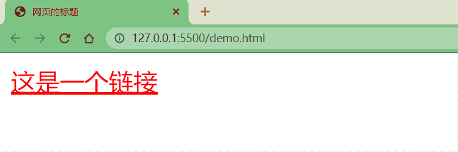

## 基本语法

### 注释
只能使用 `/*` 和 `*/` 包裹。即不管是单行注释，还是多行注释，都是以 `/*` 开头，以 `*/` 结尾

```css
/* css中的单行注释 */

/* 
css中的多行注释
css中的多行注释
css中的多行注释
*/
```

### 选择器
`选择器 { 声明块 }`

通过选择器可以选中页面中的指定元素，比如 `p` 的作用就是选中页面中所有的 `p` 元素

```css
p {
}
```

### 声明块
通过声明块来指定要为元素设置的样式

1.  声明块由一个一个的声明组成，声明是一个名值对结构 
2.  一个样式名对应一个样式值，名和值之间以 `:` 连接，以 `;` 结尾 

```css
h1 {
    color: green;
}
```

## 样式
### 内联样式（行内样式）
在标签内部通过 `style` 属性来设置元素的样式

```html
<p style="color:red;font-size:60px;">内联样式（行内样式）</p>
```

存在问题：使用内联样式，样式只能对一个标签生效。如果希望影响到多个元素，必须在每一个元素中都复制一遍；并且当样式发生变化时，我们必须要一个一个的修改，非常的不方便。

注意：开发时不要使用内联样式

### 内部样式
将样式编写到 `head` 中的 `style` 标签里，然后通过 CSS 的选择器来选中元素并为其设置各种样式，可以同时为多个标签设置样式，并且修改时只需要修改一处即可。相比于内联样式，内部样式表更加方便对样式进行复用

```html
<style>
  p	{
      color:green; 
      font-size:50px;
  }
</style>
```

存在问题：我们的内部样式表只能对一个网页起作用，它里边的样式不能跨页面进行复用

### 外部样式
可以将 CSS 样式编写到一个外部的 CSS 文件中，然后通过 `link` 标签来引入外部的 CSS 文件

```html
<link rel="stylesheet" href="./style.css">
```

外部样式表需要通过 `link` 标签进行引入，意味着只要想使用这些样式的网页都可以对其进行引用使样式，可以在不同页面之间进行复用

将样式编写到外部的 CSS 文件中，可以使用到浏览器的缓存机制，从而加快网页的加载速度，提高用户的体验。

## 选择器
### 优先级
优先级：`!important` > 内联样式 > ID 选择器 > 类选择器、属性选择器和伪类选择器 > 元素选择器和伪元素选择器 > 通配符选择器（`*`），关系选择器（如后代选择器、子选择器、相邻兄弟选择器等），以及从父元素继承的样式

1. 优先级高的样式会覆盖优先级低的样式。
2. 如果两个选择器具有相同的优先级，则后面的样式会覆盖前面的样式。
3. 使用 `!important` 声明可以覆盖所有其他优先级，但不推荐使用，因为后续调试困难。

### 常用选择器

#### 通配选择器
1. 作用：选中页面中的所有元素
2. 语法：`*{}`

```css
*{
    color: red;
}
```

#### 元素/标签选择器
1. 作用：根据标签名来选中指定的元素
2. 语法：`elementname{}`

```css
p{
    color: red; 
}

h1{
    color: green;
}
```

#### 类选择器
1. 作用：根据元素的 class 属性值选中一组元素
2. 语法：`.classname{}`

```css
.blue{
    color: blue;
}

.size{
    font-size: 20px;
}
```

**类选择器与 ID 选择器比较**

1. `class`  可以重复使用，`id`  只能使用一次 
2.  可以通过  `class`  属性来为元素分组
3.  可以同时为一个元素指定多个  `class`  属性 

```html
<p class="blue size"> 类选择器（Class selector）</p>
```

#### ID 选择器
1. 作用：根据元素的 `id` 属性值选中一个元素
2. 语法：`#idname{}`

```css
#red{
    color: red;
}
```

#### 属性选择器
1. 作用：根据元素的属性值选中一组元素
2. 语法
+ `[属性名]` 选择含有指定属性的元素
+ `[属性名=属性值]` 选择含有指定属性和属性值的元素
+ `[属性名^=属性值]` 选择属性值以指定值开头的元素
+ `[属性名$=属性值]` 选择属性值以指定值结尾的元素
+ `[属性名*=属性值]` 选择属性值中含有某值的元素
+ `[属性名~=属性值]` 选择属性值为以空格分隔的词列表且包含该值的元素
+ `[属性名|=属性值]` 选择属性值为该值或以“该值-”开头的元素（主要用于语言代码如 `en`、`en-US`）
```css
p[title]{
    color: orange;
}

p[title=e]{
    color: orange;
}

p[title^=e]{
    color: orange;
}

p[title$=e]{
    color: orange;
}

p[title*=e]{
    color: orange;
}
```

```html
<!DOCTYPE html>
<html lang="en">
<head>
<meta charset="UTF-8">
 
<style>
  /* 选择具有 "data-role" 属性的所有元素 */
  [data-role] {
    font-weight: bold;
  }
 
  /* 选择具有 "data-role" 属性且值为 "banner" 的元素 */
  [data-role="banner"] {
    background-color: #4CAF50;
    color: white;
    padding: 10px;
  }
 
  /* 选择属性值包含 "navigation" 的元素（词汇以空格分隔） */
  [data-role~="navigation"] {
    background-color: #333;
    color: white;
  }
 
  /* 选择属性值以 "profile-" 开头的元素 */
  [data-role|="profile-"] {
    border: 2px solid #009688;
    padding: 5px;
  }
 
  /* 选择属性值以 "info" 开头的元素 */
  [data-role^="info"] {
    background-color: #FFC107;
    color: black;
  }
 
  /* 选择属性值以 "-footer" 结尾的元素 */
  [data-role$="-footer"] {
    background-color: #607D8B;
    color: white;
    text-align: center;
  }
 
  /* 选择属性值包含 "side" 的元素 */
  [data-role*="side"] {
    float: left;
    width: 20%;
    background-color: #E91E63;
    color: white;
    padding: 15px;
  }
</style>
</head>
<body>
 
<div data-role="banner">具有 "data-role" 属性且值为 "banner"</div>
<nav data-role="navigation">属性值包含 "navigation"（词汇以空格分隔）</nav>
<section data-role="profile-user">属性值以 "profile-" 开头</section>
<article data-role="info-news">属性值以 "info" 开头</article>
<div data-role="side-nav">属性值包含 "side"</div>
<footer data-role="main-footer">属性值以 "-footer" 结尾</footer>
 
</body>
</html>
```

### 复合选择器

#### 交集选择器
1. 作用：选中同时符合多个条件的元素
2. 语法：`选择器1选择器2选择器3选择器n{}`
3. 注意点：
* 选择器之间没有任何的连接符号
* 交集选择器中如果有元素选择器，必须使用元素选择器开头

```css
div.red{
    font-size: 30px;
}

.a.b.c{
    color: blue;
}
```

#### 并集选择器
1. 作用：同时选择多个选择器对应的元素
2. 语法：`选择器1,选择器2,选择器3,选择器n{}`

```css
#b1,h1,span,div.red{
    color: green;
}
```

### 关系选择器
1. 父元素：直接包含子元素的元素叫做父元素
2. 子元素：直接被父元素包含的元素是子元素
3. 祖先元素：直接或间接包含后代元素的元素叫做祖先元素；一个元素的父元素也是它的祖先元素
4. 后代元素：直接或间接被祖先元素包含的元素叫做后代元素；子元素也是后代元素
5. 兄弟元素：拥有相同父元素的元素是兄弟元素

#### 子元素选择器
1. 作用：选中指定父元素的指定子元素
2. 语法：`父元素 > 子元素`
3. 例子：`A > B`

```css
div.box > p > span{
    color: orange;
}
```

#### 后代元素选择器
1. 作用：选中指定元素内的指定后代元素
2. 语法：`祖先 后代`
3. 例子：`A B`

```css
div span{
    color: skyblue;
}
```

#### 兄弟元素选择器
1. 作用：`+` 选择下一个兄弟，`~` 选择下一堆兄弟
2. 语法：`前一个 + 下一个` `前一个 ~ 下一组`
3. 例子：
+ `A1 + A2`（Adjacent sibling combinator）
+ `A1 ~ An`（General sibling combinator）

```css
p + span{
    color: red;
}

p ~ span{
    color: red;
}
```

### 伪类选择器
伪类（不存在的类，特殊的类）用来描述一个元素的特殊状态，比如：第一个子元素、被点击的元素、鼠标移入的元素.…

伪类一般情况下都是使用 `:` 开头

1. `:not(selector)` ：否定伪类，将符合条件的元素从选择器中去除
2. `:first-child` ：第一个子元素
3. `:last-child` ：最后一个子元素
4. `:nth-child(n)` ：选中第 n 个子元素 
5. `:nth-last-child(n)`：选中倒数第 n 个子元素
+ n：第 n 个，n 的范围 0 到正无穷
+ 2n 或 even：选中偶数位的元素
+ 2n+1 或 odd：选中奇数位的元素

以上这些伪类都是根据所有的子元素进行排序的

1. `:first-of-type` ：同类型中的第一个子元素
2. `:last-of-type` ：同类型中的最后一个子元素
3. `:nth-of-type(n)` ：选中同类型中的第 n 个子元素

这几个伪类的功能和上述的类似，不同点是他们是在同类型元素中进行排序的

```css
/* ul下所有li，黑色 */
ul>li {
    color: black;
}

/* ul下第偶数个li，黄色 */
ul>li:nth-child(2n) {
    color: yellow;
}

/* ul下第奇数个li，绿色 */
ul>li:nth-child(odd) {
    color: green;
}

/* ul下第一个li，红色 */
ul>li:first-child {
    color: red;
}

/* ul下最后一个li，黄色 */
ul>li:last-child {
    color: orange;
}
```

1. `:link` 未访问的链接
2. `:visited` 已访问的链接 
3. `:hover` 鼠标悬停的链接
4. `:active` 鼠标点击的链接
5. `:focus` 选择获得焦点的元素（如输入框）

```css
/* unvisited link */
a:link {
  color: red;
}

/* visited link */
a:visited {
  color: yellow;
}

/* mouse over link */
a:hover {
  color: green;
}

/* selected link */
a:active {
  color: blue;
}
```



```html
<!DOCTYPE html>
<html lang="en">
<head>
<meta charset="UTF-8">
 
<style>
  /* 选择未被访问的链接 */
  a:link {
    color: blue;
    text-decoration: none;
  }
 
  /* 选择已被访问的链接 */
  a:visited {
    color: purple;
  }
 
  /* 选择鼠标悬停的元素 */
  a:hover {
    text-decoration: underline;
  }
 
  /* 选择被激活的元素（如鼠标按下时的链接） */
  a:active {
    color: red;
  }
 
  /* 选择获得焦点的元素（如输入框） */
  input:focus {
    background-color: #FFFF99;
  }
 
  /* 选择其父元素的第一个子元素 */
  li:first-child {
    font-weight: bold;
  }
 
  /* 选择其父元素的最后一个子元素 */
  li:last-child {
    font-style: italic;
  }
 
  /* 选择其父元素的第2个子元素 */
  li:nth-child(2) {
    color: green;
  }
 
  /* 选择其父元素的倒数第2个子元素 */
  li:nth-last-child(2) {
    text-decoration: line-through;
  }
 
  /* 选择不符合指定选择器的元素 */
  :not(p) {
    margin: 0;
  }
</style>
</head>
<body>
 
<ul>
  <li>List item 1</li>
  <li>List item 2</li>
  <li>List item 3</li>
  <li>List item 4</li>
  <li>List item 5</li>
</ul>
 
<a href="https://csdn.com">这是一个链接</a>
<input type="text" placeholder="Focus on me">
<p>这段文字不会受到 :not(p) 选择器的影响。</p>
<div>这个div将会受到:not(p)选择器的影响。</div>
</body>
</html>
```

### 伪元素选择器

伪元素，表示页面中一些特殊的并不真实的存在的元素（特殊的位置）

伪元素使用  `::`  开头 

1. `::first-letter`  表示第一个字母 
2. `::first-line`  表示第一行 
3. `::selection`  表示选中的内容 
4. `::before`  元素的开始 
5. `::after`  元素的最后 

>注意：`::before`  和  `::after`  必须结合  `content`  属性来使用 

```css
/* 段落首字母设置大小为30px */
p::first-letter{
    font-size: 30px;
}

/* 段落第一行设置为黄色背景 */
p::first-line{
    background-color: yellow;
}

/* 段落选中的部分变绿色 */
p::selection{
    background-color: green;
}

/* div前加上内容 */
div::before{
    content: 'BEFORE';
    color: red;
}

/* div后加上内容 */
div::after{
    content: 'AFTER';
    color: blue;
}
```


