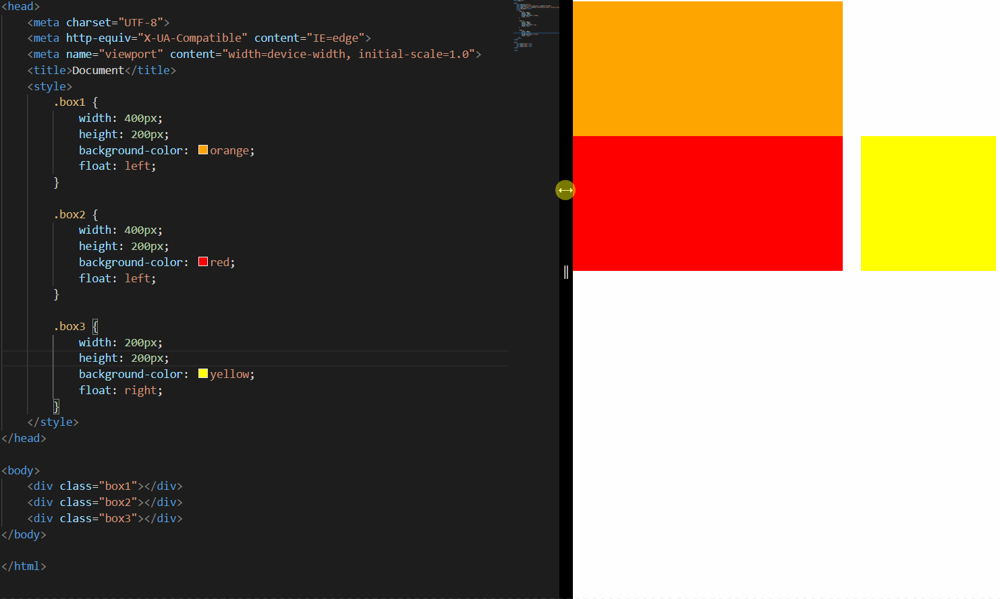

## 网页布局
通过盒子模型，清楚知道大部分 html 标签是一个盒子。

通过 CSS 浮动、定位可以让每个盒子排列成为网页。

一个完整的网页，是标准流、浮动、定位一起完成布局的，每个都有自己的专门用法。

1. 标准流：可以让盒子上下排列或者左右排列，垂直的块级盒子显示就用标准流布局。
2. 浮动：可以让多个块级元素一行显示或者左右对齐盒子，多个块级盒子水平显示就用浮动布局
3. 定位：定位最大的特点是有层叠的概念，就是可以让多个盒子前后叠压来显示。如果元素自由在某个盒子内移动就用定位布局。

## 元素的显隐
### display 显示
display 设置或检索对象是否及如何显示

| **属性**     | **效果**                                                     |
| ------------ | ------------------------------------------------------------ |
| none         | 元素不会显示，并且不会占据布局空间。它会被从渲染树中移除，不会影响布局。 |
| inline       | 元素会被显示为内联元素，它不会开始新的一行，宽度由内容决定，不能设置宽度和高度。 |
| list-item    | 元素会被显示为列表项，通常与 `<ul>`, `<ol>` 和 `<li>` 元素一起使用。 |
| table-cell   | 元素会被显示为表格单元格，可以用来对齐内容，就像在表格中一样。 |
| grid         | 元素会被显示为网格容器，子元素可以使用 CSS 网格布局进行布局。 |
| block        | 元素会被显示为块级元素，它会开始新的一行，并且占据可用的全部宽度。可以设置宽度和高度。 |
| inline-block | 元素会被显示为内联块级元素，它不会开始新的一行，但可以设置宽度和高度。可以在一行内与其他元素并列显示。常用于需要内联布局但需要控制尺寸的元素。 |
| table        | 元素会被显示为表格，表格布局可以用来创建复杂的多列布局。     |
| flex         | 元素会被显示为弹性容器，子元素可以使用弹性盒模型进行布局。   |
| inherit      | 元素继承其父元素的 `display` 值。                            |

```html
<!DOCTYPE html>
<html lang="en">
<head>
<meta charset="UTF-8">
 
<style>
  .block {
    display: block;
    width: 100px;
    height: 100px;
    background-color: red;
    margin-bottom: 10px;
  }
 
  .inline {
    display: inline;
    background-color: blue;
    padding: 10px;
  }
 
  .inline-block {
    display: inline-block;
    width: 100px;
    height: 100px;
    background-color: green;
    margin-right: 10px;
  }
 
  .flex-container {
    display: flex;
    background-color: purple;
    padding: 10px;
  }
 
  .flex-item {
    background-color: yellow;
    margin-right: 10px;
    padding: 10px;
  }
</style>
</head>
<body>
 
<div class="block">Block 块级元素</div>
 
<div class="inline">Inline 内联元素</div>
 
<div class="inline-block">Inline-Block 内联块级元素</div>
 
<div class="flex-container">
  <div class="flex-item">Flex Item 1</div>
  <div class="flex-item">Flex Item 2</div>
</div>
 
</body>
</html>
```

### visibility 可见性

visibility 属性用于指定一个元素应可见还是隐藏。

```css
visibility: visible; 　/*元素可视*/
visibility: hidden; 　  /*元素隐藏*/
```

特点：visibility 隐藏元素后，继续占有原来的位置。（停职留薪）

### overflow 溢出
overflow 属性指定了如果内容溢出一个元素的框（超过其指定高度及宽度） 时，会发生什么。

1. visible：不剪切内容也不添加滚动条
2. hidden：不显示超过对象尺寸的内容，超出的部分隐藏掉
3. scroll：不管超出内容否，总是显示滚动条
4. auto：超出自动显示滚动条，不超出不显示滚动条


```html
<!DOCTYPE html>
<html lang="en">
<head>
<meta charset="UTF-8">
 
<style>
	.box {
	  width: 200px;
	  height: 100px;
	  border: 1px solid #000;
	  margin-bottom: 20px;
	}
 
	.visible {
	  overflow: visible;
	}
 
	.hidden {
	  overflow: hidden;
	}
 
	.scroll {
	  overflow: scroll;
	}
 
	.auto {
	  overflow: auto;
	}
</style>
</head>
<body>
 
<div class="box visible">我是visible，内容会溢出框外。我是visible，内容会溢出框外。我是visible，内容会溢出框外。我是visible，内容会溢出框外。</div>
<div class="box hidden">我是hidden，内容溢出将被隐藏。我是hidden，内容溢出将被隐藏。我是hidden，内容溢出将被隐藏。我是hidden，内容溢出将被隐藏。</div>
<div class="box scroll">我是scroll，内容溢出时会有滚动条。我是scroll，内容溢出时会有滚动条。我是scroll，内容溢出时会有滚动条。我是scroll，内容溢出时会有滚动条。</div>
<div class="box auto">我是auto，内容溢出时会有滚动条，不溢出不显示。现在没溢出所以不显示滚动条</div>
<div class="box auto">我是auto，内容溢出时会有滚动条，不溢出不显示。现在溢出了，所以要显示。现在溢出了，所以要显示。现在溢出了，所以要显示。现在溢出了，所以要显示。</div>
 
</body>
</html>
```

## 浮动
### 简介
`float` 属性用于创建浮动框，通过浮动可以使一个元素向其父元素的左侧或右侧移动，直到左边缘或右边缘触及包含块或另一个浮动框的边缘

```css
选择器 { 
	float: 属性值; 
}
```

属性：

1. `none`：默认值，元素不浮动
2. `left` ：元素向左浮动
3. `right` ：元素向右浮动

注意：元素设置浮动以后，水平布局的等式便不需要强制成立。会完全从文档流中脱离，不再占用文档流的位置，所以元素下边的还在文档流中的元素会自动向上移动

```html
<!DOCTYPE html>
<html lang="en">
<head>
<meta charset="UTF-8">
<meta name="viewport" content="width=device-width, initial-scale=1.0">
<title>Float Property Example</title>
<style>
  .container {
    border: 1px solid #000;
    padding: 10px;
  }
 
  .float-left {
    float: left;
    width: 100px;
    height: 100px;
    background-color: red;
    margin-right: 10px;
  }
 
  .float-right {
    float: right;
    width: 100px;
    height: 100px;
    background-color: green;
    margin-left: 10px;
  }
 
  .clearfix::after {
    content: "";
    display: table;
    clear: both;
  }
</style>
</head>
<body>
 
<div class="container clearfix">
  <div class="float-left">左浮动</div>
  <div class="float-right">右浮动</div>
  <p>一段文字。一段文字。一段文字。一段文字。一段文字。一段文字。一段文字。一段文字。</p>
</div>
 
</body>
</html>
```

### 特点

1.  浮动元素会完全脱离文档流，不再占据文档流中的位置 


2.  设置浮动以后，元素会向父元素的左侧或右侧移动 


注意：浮动的元素是互相贴靠在一起的（不会有缝隙），如果父级宽度装不下这些浮动的盒子，多出的盒子会另起一行对齐。

3.  浮动元素默认不会从父元素中移出

```html
<style>
    .box1 {
        width: 100px;
        height: 100px;
        background-color: orange;
        float: left;
    }

    .box2 {
        width: 200px;
        height: 200px;
        background-color: red;
    }
</style>

<div class="box1"></div>
<div class="box2"></div>
```


4.  浮动元素向左或向右移动时，不会超过前边的浮动元素（先来后到的顺序） 

```html
<style>
    .box1 {
        width: 200px;
        height: 200px;
        background-color: orange;
        float: left;
    }

    .box2 {
        width: 200px;
        height: 200px;
        background-color: red;
        float: left;
    }

    .box3 {
        width: 200px;
        height: 200px;
        background-color: yellow;
        float: left;
    }
</style>

<div class="box1"></div>
<div class="box2"></div>
<div class="box3"></div>
```


5.  浮动元素不会超过上边的浮动的兄弟元素，最多就是和它一样高 

```html
<style>
    .box1 {
        width: 300px;
        height: 300px;
        background-color: orange;
        float: left;
    }

    .box2 {
        width: 400px;
        height: 400px;
        background-color: red;
        float: left;
    }

    .box3 {
        width: 300px;
        height: 300px;
        background-color: yellow;
        float: right;
    }
</style>

<div class="box1"></div>
<div class="box2"></div>
<div class="box3"></div>
```



6.  如果浮动元素的上边是一个没有浮动的块元素，则浮动元素无法上移 

```html
<style>
    .box1 {
        width: 200px;
        height: 200px;
        background-color: orange;
    }

    .box2 {
        width: 200px;
        height: 200px;
        background-color: red;
        float: left;
    }
</style>

<div class="box1"></div>
<div class="box2"></div>
```


7. 浮动元素不会盖住文字，文字会自动环绕在浮动元素的周围，所以我们可以利用浮动来设置文字环绕图片的效果


总结：

1. 浮动目前来讲它的主要作用就是让页面中的元素可以水平排列，通过浮动可以制作一些水平方向的布局
2. 元素设置浮动以后，将会从文档流中脱离，从文档流中脱离后，元素的一些特点也会发生变化

### 脱离文档流特点
1. 块元素：块元素不再独占页面的一行，脱离文档流以后，块元素的宽度和高度默认都被内容撑开

```html
<style>
    .box1 {
        background-color: orange;
        /* float: left; */
    }
</style>

<div class="box1">hello</div>
```


2. 行内元素：行内元素脱离文档流后特点和块元素一样

```html
<style>
    span {
        width: 200px;
        height: 200px;
        background-color: orange;
        float: left;
    }
</style>

<span>I am a Span</span>
```

 脱离文档流之后的特点很像行内块元素，不过存在一些差异（差异应该是换行的原因，并不是间距。把 span 写在一行就一样了)

```html
<style>
    span {
        width: 200px;
        height: 200px;
        background-color: orange;
        /* display: inline-block; */
        float: left;
    }
</style>

<span>I am a Span</span>
<span>I am a Span</span>
```


### 使用案例


```html
<!-- 页眉 -->
<header></header>
<!-- 主体 -->
<main>
    <!-- 左边栏 -->
    <nav></nav>
    <!-- 中心 -->
    <article>
        <!-- 内容上 -->
        <div class="top"></div>
        <!-- 内容下 -->
        <div class="bottom">
            <!-- 内容左 -->
            <div class="left"></div>
            <!-- 内容中 -->
            <div class="middle"></div>
            <!-- 内容右 -->
            <div class="right"></div>
        </div>
    </article>
    <!-- 右边栏 -->
    <aside></aside>
</main>
<!-- 页脚 -->
<footer></footer>
```

```css
/* 公共部分 */
header,
main,
footer {
    width: 1000px;
    margin: 10px auto;
}

main nav,
main article,
main aside {
    float: left;
    /* 虽然设置浮动了，但整体大小是被内容撑开的，所以设置一个高度 */
    height: 100%;
}

.bottom .left,
.bottom .middle,
.bottom .right {
    float: left;
    width: 220px;
    height: 100%;
}

/* ==========整体布局-上========== */
header {
    height: 100px;
    background-color: silver;
}

/* ==========整体布局-中========== */
main {
    height: 400px;
    background-color: #bfa;
}


/* ------左边栏------ */
main nav {
    width: 150px;
    background-color: red;
}

/* ------中心------ */
main article {
    width: 680px;
    background-color: green;
    margin: 0 10px;
}

/* ---上--- */
article .top {
    height: 190px;
    background-color: yellow;
    margin-bottom: 10px;
}

/* ---下--- */
article .bottom {
    height: 200px;
    background-color: orange;
}


/* 左 */
.bottom .left {
    background-color: lightblue;
}

/* 中 */
.bottom .middle {
    background-color: gray;
    margin: 0 10px;
}

/* 右 */
.bottom .right {
    background-color: wheat;
}

/* ------右边栏------ */
main aside {
    width: 150px;
    background-color: blue;
}

/* ==========整体布局-下========== */
footer {
    height: 100px;
    background-color: tomato;
}
```

### 清除浮动样式
```css
选择器 {
  clear: 属性值;
} 
```

| 属性  | 描述                                       |
| ----- | ------------------------------------------ |
| left  | 不允许左侧有浮动元素（清除左侧浮动的影响） |
| right | 不允许右侧有浮动元素（清除右侧浮动的影响） |
| both  | 同时清除左右两侧浮动的影响                 |

1. 额外标签法

额外标签法会在浮动元素末尾添加一个空的标签。

例如：`<div style="clear:both"> </div>`，或者其他标签（如`<br />`等）。

注意： 要求这个新的空标签必须是块级元素

2. 父级添加 overflow 属性

可以给父级添加 overflow 属性，将其属性值设置为 hidden、 auto 或 scroll ，可以触发 BFC（块级格式化上下文），从而包含浮动元素。

例如：`overflow: hidden | auto | scroll;`

3. 父级添加 after 伪元素

```css
 .clearfix:after {  
   content: ""; 
   display: block; 
   height: 0; 
   clear: both; 
   visibility: hidden;  
 } 
 .clearfix {  /* IE6、7 专有 */ 
   *zoom: 1;
 }   
```

4. 父级添加双伪元素

```css
.clearfix:before,

.clearfix:after {   
   content:"";   
   display:table;  
} 

.clearfix:after {   
  clear:both; 
} 

.clearfix {    
  *zoom:1; 
}   
```

| 方式                 | 优点               | 缺点                         |
| -------------------- | ------------------ | ---------------------------- |
| 额外标签法（隔墙法） | 通俗易懂，书写方便 | 添加许多无意义标签，结构化差 |
| 父级 overflow: hidden  | 书写方便           | 溢出隐藏等                   |
| 父级 after 伪元素      | 结构语义化正确     | IE6-7 不支持 after，兼容问题   |
| 父级双伪元素         | 结构语义化正确     | IE6-7 不支持 after，兼容问题   |

## 高度塌陷与 BFC
### 高度塌陷
在浮动布局中，父元素的高度默认是被子元素撑开的，当子元素浮动后，其会完全脱离文档流，子元素从文档流中脱离将会无法撑起父元素的高度，导致父元素的高度丢失。父元素高度丢失以后，其下的元素会自动上移，导致页面的布局混乱


### BFC
BFC（Block Formatting Context）块级格式化环境，BFC 是一个 CSS 中的一个隐含的属性，可以为一个元素开启 BFC，开启 BFC 该元素会变成一个独立的布局区域

元素开启 BFC 后的特点：

1. 不会被浮动元素覆盖
2. 父子元素外边距不会重叠
3. 可以包含浮动的元素

可以通过一些特殊方式来开启元素的 BFC：

1.  设置为浮动（不推荐）：很明显下方元素被覆盖了，总不能让所有元素都浮动吧


2. 设置为行内块元素（不推荐）：不再独占一行，宽度变了，同时与下方元素产生了一点空隙


3. 设置 `overflow` 为非 `visible` 值：既没有覆盖元素，也保持了独占一方的特性（保持了宽度），与下方元素也保持了最初的间隙

常用的方式为元素设置 `overflow:hidden`（`overflow:auto` 也是 ok 的） 开启其 BFC， 以使其可以包含浮动元素。`overflow:scroll` 会有滚动条，可能并不需要的，所以不太推荐


不过，这种方式也存在一定问题，如下，`overflow` 并没有完全清除 div2 布局上受到的影响


总结：

1. 可以通过变成浮动元素，来防止自身被浮动元素覆盖（有点“以毒攻毒”那味了）
2. 可以设置行内块，来防止自身及其他元素被浮动元素覆盖（如果说浮动是“独善其身”，那行内块就有点“兼济天下”的意思）
3. 可以设置 `overflow` 属性，包含浮动元素（既“独善其身”，又“兼济天下”，但仍有缺陷）

开启 BFC 的方式：

| 元素或属性 | 说明 |
| --- | --- |
| `<html >` | 文档根元素 |
| `float: left` <br />`float: right` | 浮动元素（float 不为 none） |
| `position: absolute` <br />`position: fixed` | 绝对/固定定位元素 |
| `display: inline-block` | 行内块元素 |
| `display: table-cell` | 表格单元，默认值 |
| `display: table-caption` | 表格标题，默认值 |
| `display: table` <br />`display: table-row`  <br /> `display: table-row-group` <br />`display: table-header-group`  <br />`display: table-footer-group` <br />`display: inline-table` | 表格/行/表体/表头/表脚/内联表格 |
| `overflow: hidden` <br />`overflow: scroll`  <br />`overflow: auto` | overflow 不为 `visible` 或 `clip` 的块级元素 |
| `display: flow-root` | 专门用于创建 BFC 的块容器 |
| `contain: layout`   <br />` contain: content`<br />`contain: paint` | |
| `display: flex`   <br />`display: inline-flex ` 的直接子元素 | Flex 项，如果它们本身既不是 flex，也不是 grid 或 table 容器 |
| `display: grid   `<br />`display: inline-grid` 的直接子元素 | Grid 项，如果它们本身既不是 flex，也不是 grid 或 table 容器 |
| `column-count` 不为 `auto`  <br />`column-width` 不为 `auto` | Multicol 容器，包含 column-count: 1 |
| `column-span: all` |应该总是创建一个新的格式化上下文，即使 `column-span: all` 元素不在 multicol 容器中|


### clear


由于 box1 的浮动，导致 box3 位置上移也就是 box3 受到了 box1 浮动的影响，位置发生了改变（注意，这里文字并没有被覆盖，“文字环绕”的问题）

如果我们不希望某个元素因为其他元素浮动的影响而改变位置，可以通过 `clear` 属性来清除浮动元素对当前元素所产生的影响

`clear` 作用：清除浮动元素对当前元素所产生的影响（本质是为元素添加一个 `margin-top` 属性，值由浏览器自动计算）

```css
选择器 {
	clear: 属性值;
} 
```

属性：

1. `left`： 清除左侧浮动元素对当前元素的影响
2. `right` ：清除右侧浮动元素对当前元素的影响
3. `both` ：清除两侧中影响较大一侧元素的影响（注意，这里不是同时清除两侧的影响）


### after
1.  通过 `overflow: hidden` 等可以为元素开启 BFC


2. 通过 `clear: both` 等可以清除浮动对元素产生的影响


3. 使用伪元素选择器 `::after`


为什么需要使用 `display: block` 呢？因为默认情况下，`::after` 伪元素是一个行内元素，如果不转为块元素，将仍然撑不起 box1 的高度。行内元素设置 margin-top 是不会影响布局的，也就是不会撑开，而 clear 的原理就是添加 margin-top，所以不能是行内元素

### clearfix
垂直布局中边距重叠的问题：相邻的垂直方向外边距会发生重叠现象


 因为 `inline-block` 兼顾行内元素和块元素的特点，既可以设置宽高也不独占一行

在没有设置宽高时，会存在一个默认高度，所以 `inline-block` 仍然行不通


### 总结

1. 高度塌陷问题，一般用 `::after`
2. 外边距重叠问题，一般用 `::before`

`clearfix` 这个样式就可以同时解决高度塌陷和外边距重叠的问题

+ `.clearfix::before` 是为了解决外边距重叠问题
+ `.clearfix::after` 是为了解决高度塌陷问题

```css
.clearfix::before,
.clearfix::after{
    content: '';
    display: table;
    clear: both;
}
```


