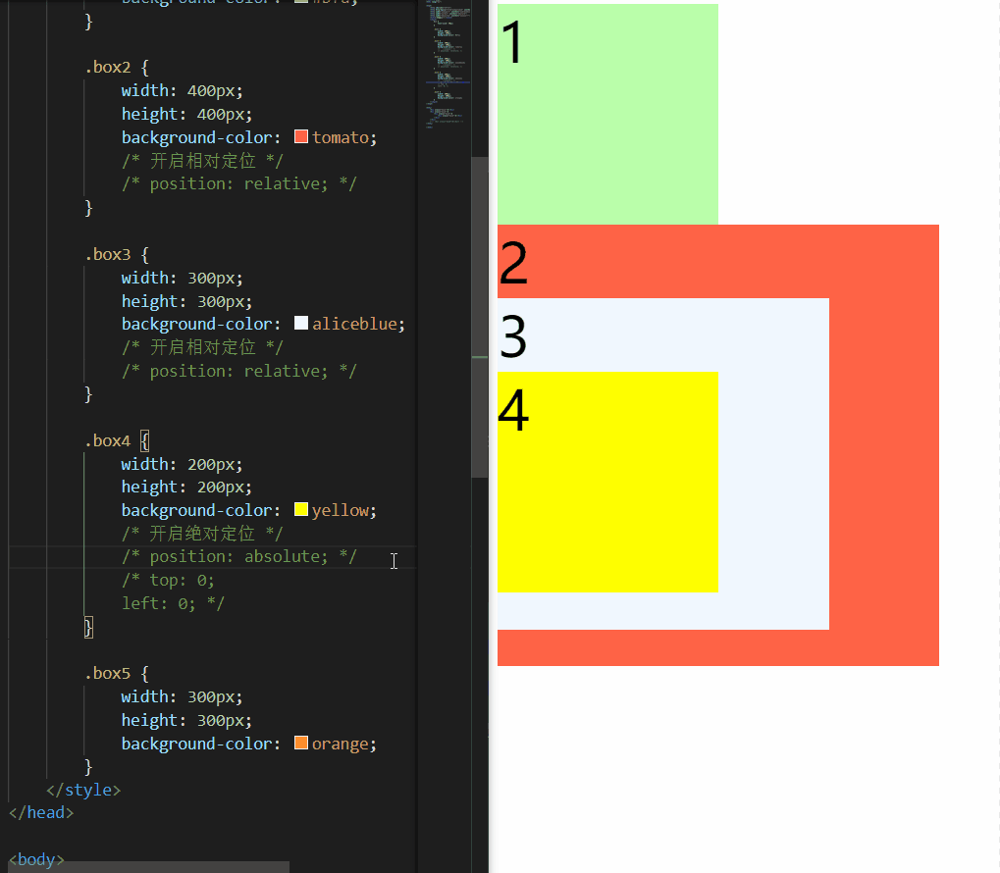

## 基本概念
### 简介


```css
.box2 {
    width: 200px;
    height: 200px;
    background-color: yellow;
    /* 左外边距、上外边距 */
    margin-left: 200px;
    margin-top: -200px;
}

.box3 {
    width: 200px;
    height: 200px;
    background-color: orange;
    /* 上外边距 */
    margin-top: 200px;
}
```


当然也可以使用浮动来解决上述问题，但稍微麻烦一点

不管怎样，问题也是显而易见。我们实际开发中，页面上的元素可能很多，这样改必然是牵一发而动全身

通过定位可以将元素摆放到页面的任意位置，使用 `position` 属性来设置定位

| 可选值 | 含义 |
| :--- | :--- |
| static | 不开启定位，元素是静止的，默认值 |
| relative | 开启元素的相对定位 |
| absolute | 开启元素的绝对定位 |
| fixed | 开启元素的固定定位 |
| sticky | 开启元素的粘滞定位 |


### 语法
```css
选择器 { 
    position: 属性值; 
}
```


### 定位对比
| 定位方式 | 是否不设置偏移量，元素不会发生改变 | 是否脱离文档流 | 是否改变元素性质 | 是否提升元素层级 | 参考系 |
| :--- | :---: | :---: | :---: | :---: | --- |
| relative（相对定位） | √ | × | × | √ | 参照于元素在文档流中的位置 |
| absolute（绝对定位） | × | √ | √ | √ | 参照于其包含块 |
| fixed（固定定位） | × | √ | √ | √ | 参照于浏览器的视口 |
| sticky（粘滞定位） | × | √ | √ | √ | 参照于浏览器的视口 |


## 相对定位
当元素的 position 属性值设置为 `relative` 时，则开启了元素的相对定位

### 偏移量（offset）
当元素开启相对定位以后，可以通过偏移量来设置元素的位置

| offset 属性 | 含义 |
| :--- | :--- |
| top | 定位元素和定位位置的上边距离 |
| bottom | 定位元素和定位位置的下边距离 |
| left | 定位元素和定位位置的左侧距离 |
| right | 定位元素和定位位置的右侧距离 |


1. 定位元素垂直方向的位置由 `top` 和 `bottom` 两个属性控制，通常情况下只会使用其中之一
+ `top` 值越大，定位元素越靠下
+ `bottom` 值越大，定位元素靠上
2. 定位元素水平方向的位置由 `left` 和 `right` 两个属性控制，通常情况下只会使用其中之一
+ `left` 越大，定位元素越靠右
+ `right` 越大，定位元素越靠左

```css
.box2 {
    width: 200px;
    height: 200px;
    background-color: yellow;
    /* 开启相对定位 */
    position: relative;
    top: -200px;
    left: 200px;
}
```


使用了相对定位后，只会移动自身的布局位置，而不会对已存在的其他元素产生任何影响

### 特点
1.  当元素开启相对定位以后，如果不设置偏移量元素，则元素不会发生任何变化（这里注意，不仅仅是位置） 
2.  相对定位是参照于元素在文档流中的位置进行定位的（可以理解为相对于自身原始位置） 
3.  相对定位会提升元素的层级（表现为可以覆盖其他元素） 
4.  相对定位不会改变元素的性质：块还是块，行内还是行内 


在页面文档流中，越靠下的元素开启相对定位后，其层级越高

### 浮动与相对定位区别
1. 参考系不同：浮动的参考系是其父元素；相对定位是相对于自身
2. 可移动方向不同：浮动只能左右移动；相对定位是上下左右移动
3. 影响不同：浮动会影响页面布局（包括下方元素位置影响和高度塌陷问题）；相对定位不对影响页面布局
4. 性质不同：浮动会改变元素的性质（不再独占一行，其宽高都会被内容撑开）；相对定位不会改变元素的性质
5. 文字环绕：浮动不会覆盖文字；相对定位可以覆盖文字

## 绝对定位
当元素的 `position` 属性值设置为 `absolute` 时，则开启了元素的绝对定位

### 特点
1. 开启绝对定位后，如果不设置偏移量，元素的位置不会发生变化
2. 开启绝对定位后，元素会从文档流中脱离
3. 绝对定位会改变元素的性质：行内变成块，块的宽高被内容撑开（与相对定位相反）
4. 绝对定位会使元素提升一个层级
5. 绝对定位元素是相对于其包含块进行定位的（与相对定位不同）


### 包含块
正常情况下：

1. 包含块就是离当前元素最近的开启了定位的祖先块元素
2. 如果所有的祖先元素都没有开启定位，则 `html（根元素、初始包含块）` 就是它的包含块

```html
<body>
    <!-- 如果box1开启定位，则box2的包含块是box1，否则就是body -->
    <div class="box1">
        <div class="box2"></div>
    </div>

    <!-- 如果box3开启定位，则em的包含块是box3，否则就是body -->
    <div class="box3">
        <span>
            <em>hello</em>
        </span>
    </div>
</body>
```

只要 `position` 不是 `static`（默认值），那么就满足了其成为包含块的必要条件

```html
<div class="box2">2
    <div class="box3">3
        <div class="box4">4</div>
    </div>
</div>
```



### 水平方向布局
水平方向的布局等式：`margin-left + border-left + padding-left + width + padding-right + border-right + margin-right = 其父元素的宽度`

当使用绝对定位时，需要添加 `left` 和 `right` 两个值（此时规则和之前一样，只是多添加了两个值）

`left + margin-left + border-left + padding-left + width + padding-right + border-right + margin-right + right = 其父元素的宽度`

当发生过度约束时

1. 如果 9 个值中没有 `auto`，则自动调整 `right` 值以使等式满足（之前 7 个值是 `margin-right`）
2. 如果 9 个值中有 `auto`，则自动调整 `auto` 的值以使等式满足

可设置 `auto` 的值：`margin-left`/`margin-right` /`width`/`left`/`right`

因为 `left` 和 `right` 的值默认是 `auto`，所以如果没有设置 `left` 和 `right`，当等式不满足时，则会自动调整这两个值

### 垂直方向布局
垂直方向布局的等式的也必须要满足：`top + margin-top + border-top + padding-top + height + padding-bottom + border-bottom + margin-bottom + top = 其父元素的高度`

### 居中
#### 水平居中
```html
<style>
    .box1 {
        width: 500px;
        height: 500px;
        background-color: #bfa;
        position: relative;
    }

    .box2 {
        width: 100px;
        height: 100px;
        background-color: orange;
        /* 左右外边距设置为auto */
        margin-left: auto;
        margin-right: auto;
        /* 绝对定位 */
        position: absolute;
        left: 0;
        right: 0;
    }
</style>

<div class="box1">
    <div class="box2"></div>
</div>
```


#### 垂直居中
```css
.box2 {
    width: 100px;
    height: 100px;
    background-color: orange;
    /* 左右外边距设置为auto */
    margin-top: auto;
    margin-bottom: auto;
    /* 绝对定位 */
    position: absolute;
    top: 0;
    bottom: 0;
}
```


#### 水平垂直居中
```css
.box2 {
    width: 100px;
    height: 100px;
    background-color: orange;
    /* 左右外边距设置为auto */
    margin: auto;
    /* 绝对定位 */
    position: absolute;
    top: 0;
    bottom: 0;
    left: 0;
    right: 0;
}
```


## 固定定位
将元素的 `position` 属性设置为 `fixed`，则开启了元素的固定定位

### 特点
固定定位也是一种绝对定位，所以固定定位的大部分特点都和绝对定位一样

唯一不同的是，固定定位永远参照于浏览器的视口（viewport，可视窗口）进行定位，不会随网页的滚动条滚动


## 粘滞定位
将元素的 `position` 属性设置为 `sticky`，则开启了元素的固定定位


### 特点
1. 粘滞定位和相对定位的特点基本一致
2. 不同的是粘滞定位可以在元素到达某个位置时将其固定

## 元素层级
对于开启了定位元素，可以通过 `z-index` 属性来指定元素的层级

1. `z-index` 需要一个整数作为参数，值越大元素的层级越高，元素的层级越高越优先显示
2. 如果元素的层级一样，则优先显示靠下的元素
3. 祖先的元素的层级再高，也不会盖住后代元素

```html
<style>
    div {
        font-size: 40px;
    }

    .box1 {
        width: 200px;
        height: 200px;
        background-color: #bfa;
        position: absolute;
        top: 0;
        left: 0;
    }

    .box2 {
        width: 200px;
        height: 200px;
        background-color: orange;
        position: absolute;
        top: 50px;
        left: 50px;
    }

    .box3 {
        width: 200px;
        height: 200px;
        background-color: salmon;
        position: absolute;
        top: 100px;
        left: 100px;
    }

    .box4 {
        width: 100px;
        height: 100px;
        background-color: skyblue;
        position: absolute;
        bottom: 0;
        left: 0;
    }
</style>

<div class="box1">1</div>
<div class="box2">2</div>
<div class="box3">3
    <div class="box4">4</div>
</div>
```


## 使用案例
```css
/* 整体居中 */
.box {
    width: 590px;
    height: 470px;
    /* 水平垂直双方向居中 */
    margin: auto;
    position: absolute;
    top: 0;
    bottom: 0;
    left: 0;
    right: 0;
}

/* ======轮播图Start====== */

.img_list li {
    /* 每个轮播图绝对定位，让其重叠 */
    position: absolute;
}

.img_list li:nth-child(1) {
    /* 目前还没有学习js，暂时做成静态切换层级 */
    z-index: 1;
}

/* 全局图像大小 */
.img_list img {
    /* 我这里之所以要设置宽高，是因为下载的图片大小不全是一样大的 */
    /* 但是一般情况下，这些图片都会裁剪成统一大小，所以可以不用设置 */
    width: 590px;
    height: 470px;
}

/* ======轮播图End====== */

/* ======轮播圆Start====== */

.circle_list {
    height: 20px;
    /* 开启绝对定位 */
    position: absolute;
    bottom: 20px;
    left: 30px;
    z-index: 2;
    /* 参考京东原网页，整体字体设置样式，这种设置方式还不太懂 */
    /* 其实也可以不设置，不过每个轮播圆之间的间距跟原来就不太一样了 */
    font-size: 0;
    text-align: center;
}

/* 轮播圆细节 */
.circle_list .circle {
    /* 这里设置display: inline-block; 也是一样的 */
    float: left;
    height: 8px;
    width: 8px;
    background-color: rgba(255, 255, 255, .4);
    margin-right: 4px;
    /* 画圆，这个按照课程中的画法，按照网页源代码调出来的有点问题 */
    background-clip: content-box;
    border: 3px transparent solid;
    border-radius: 50%;
}

/* 轮播圆悬浮效果 */
.circle_list .circle:hover,
.circle_list .circle:nth-child(1) {
    background-color: #fff;
    border: 3px rgba(0, 0, 0, .1) solid;
}

/* ======轮播圆End====== */
```

```html
<div class="box">
    <ul class="img_list">
        <li><a href="#"></a></li>
        <li><a href="#"></a></li>
        <li><a href="#"></a></li>
        <li><a href="#"></a></li>
        <li><a href="#"></a></li>
        <li><a href="#"></a></li>
        <li><a href="#"></a></li>
        <li><a href="#"></a></li>
    </ul>
    <!-- 我这里结构并没有完全按照课程中的结构来，但实现效果是一样的 -->
    <ul class="circle_list">
        <li class="circle"></li>
        <li class="circle"></li>
        <li class="circle"></li>
        <li class="circle"></li>
        <li class="circle"></li>
        <li class="circle"></li>
        <li class="circle"></li>
        <li class="circle"></li>
    </ul>
</div>
```


