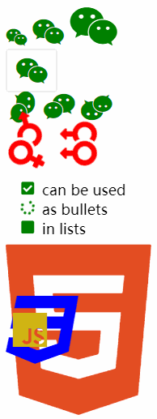
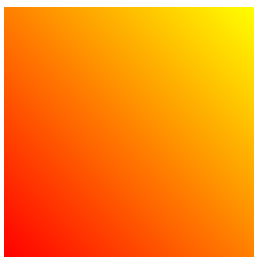
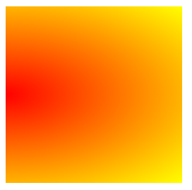
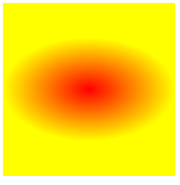
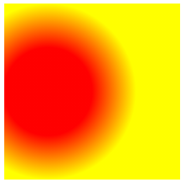
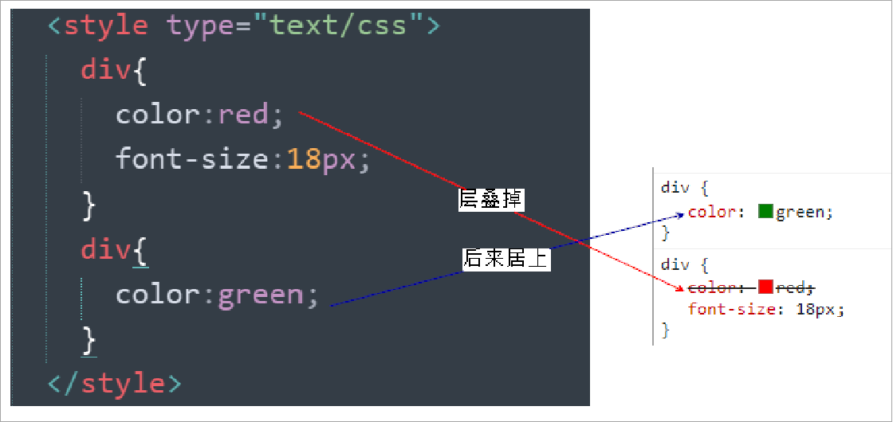

## 长度

### 像素

像素是指由图像的小方格组成的，这些小方块都有一个明确的位置和被分配的色彩数值，小方格颜色和位置就决定该图像所呈现出来的样子。

可以将像素视为整个图像中不可分割的单位或者是元素。不可分割的意思是它不能够再切割成更小单位抑或是元素，它是以一个单一颜色的小格存在。每一个点阵图像包含了一定量的像素，这些像素决定图像在屏幕上所呈现的大小。

`分辨率 = 水平方向像素 * 垂直方向像素`

#### 屏幕分辨率

例如，屏幕分辨率是 1920×1080，则该屏幕水平方向有 1920 个像素，垂直方向有 1080 个像素

不同屏幕的像素大小是不同的，也就是说像素大小不像我们现行的长度单位（如米/m）那样有着固定的国际标准，所以同样的像素大小在不同的设备上显示效果是不一样的，像素越小的屏幕显示的效果越清晰

#### 图像分辨率

例如，一张图片分辨率是 300x200，则该图片在屏幕上按 1:1 缩放时，水平方向有 300 个像素，垂直方向有 200 个像素点

1. 图片分辨率越高，1:1 缩放时面积越大
2. 图片分辨率越低，1:1 缩放时面积越小

同一台设备像素大小是不变的，那把图片放大超过 100%时占的像素点就多了，但是图像也会变得模糊，其实是设备通过算法对图像进行了像素补足；同理，把图片按小于 100%缩放时，也是通过算法将图片像素减少

### 百分比

也可以将属性值设置为相对于其父元素属性的百分比，可以使子元素跟随父元素（暂且先理解成父元素，后面会详细说）的改变而改变

#### em

em 是相对于元素的字体大小来计算的，`1em = <self>.font-size`，也就说 em 值会根据元素本身的字体大小的改变而改变

#### rem

rem 是相对于根元素的字体大小来计算，`1em = <root>.font-size`，也就说 em 值会根据根元素的字体大小的改变而改变

```html
<style>
    * {
        font-size: 24px;
    }
    
    .box1{
        width: 200px; 
        height: 200px;
        background-color: orange;
    }

    .box2{
        width: 50%; 
        height: 50%; 
        background-color: aqua;
    }
    
    .box3{
        font-size: 20px;
        width: 10em;
        height: 10em;
        background-color: greenyellow;
    }
    
    .box4 {
        font-size: 20px;
        width: 10rem; /*当时用rem时，不管怎么改本元素的font-size都是不会变的。需要定义root元素的font-size才可以 */
        height: 10rem;
        background-color: red;
    }
</style>

<div class="box1">
    <div class="box2"></div>
</div>

<div class="box3"></div>

<div class="box4"></div>
```


## 字体

### 字体大小
`font-size` 属性用于设置字号，该属性的值可以使用相对长度单位，也可以使用绝对长度单位。其中，相对长度单位比较常用，推荐使用像素单位 px，绝对长度单位使用较少


```css
p {
  font-size: 20px;
}
```

1. px（像素）大小是我们网页的最常用的单位，谷歌浏览器默认的文字大小为 16px
2. 不同浏览器可能默认显示的字号大小不一致，我们尽量给一个明确值大小，不要默认大小
3. 可以给 body 指定整个页面文字的大小

```html
<!DOCTYPE html>
<html lang="en">
<head>
<meta charset="UTF-8">
<style>
  body {
    font-size: 16px; /* 设置根元素的字体大小为16px */
  }
  .px-font-size {
    font-size: 16px; /* 使用像素单位 */
  }
  .em-font-size {
    font-size: 1.2em; /* 使用em单位，相对于父元素 */
  }
  .rem-font-size {
    font-size: 1rem; /* 使用rem单位，相对于根元素 */
  }
  .percent-font-size {
    font-size: 100%; /* 使用百分比单位，相对于父元素 */
  }
  .pt-font-size {
    font-size: 12pt; /* 使用点单位 */
  }
</style>
</head>
<body>
 
<p class="px-font-size">这是使用像素单位设置的字体大小：16px。</p>
<p class="em-font-size">这是使用em单位设置的字体大小：1.2em（依赖于父元素的字体大小）。</p>
<p class="rem-font-size">这是使用rem单位设置的字体大小：1rem（相对于根元素的字体大小）。</p>
<p class="percent-font-size">这是使用百分比单位设置的字体大小：100%（依赖于父元素的字体大小）。</p>
<p class="pt-font-size">这是使用点单位设置的字体大小：12pt。</p>
 
</body>
</html>
```

### 字体类型

`font-family` 指定字体的类别，浏览器会自动使用该类别下的字体 ，可以同时指定多个字体，多个字体间使用 `,` 隔开。字体生效时优先使用第一个，第一个无法使用则使用第二个，以此类推

```css
font-family: 'Courier New', Courier, monospace
```

1. `serif`： 衬线字体
2. `sans-serif` ：非衬线字体 
3. `monospace` ：等宽字体
4. `cursive`： 手写体
5. `fantasy` ：梦幻字体

### 字体样式
`font-style` 属性用于定义字体风格，如设置斜体、倾斜或正常字体，其可用属性值如下：

1. `normal`：默认值，浏览器会显示标准的字体样式。
2. `italic`：浏览器会显示斜体的字体样式。
3. `oblique`：浏览器会显示倾斜的字体样式。

```css
p {
	font-style: normal;
}
```

### 字体粗细
`font-weight` 属性用于定义字体的粗细

其可用属性值：normal、bold、bolder、lighter、100~900（100 的整数倍）。

```css
p {
  font-weight: bold;
}
```

| 属性值  | 描述                                                     |
| ------- | -------------------------------------------------------- |
| normal  | 默认值（不加粗的）                                       |
| bold    | 定义粗体（加粗的）                                       |
| 100~900 | 400 等同于 normal，700 等同于 bold，注意这个数字后面不跟单位 |

```html
<!DOCTYPE html>
<html>
<head>
<meta charset="utf-8">
 
<style>
h1 {
  font-weight: bold; /* 设置标题为粗体 */
}
 
p {
  font-weight: normal; /* 设置段落为正常粗细 */
}
 
strong {
  font-weight: 600; /* 设置强调文本为较粗的字体 */
}
 
</style>
</head>
 
<body>
 
<h1>嗨！我是标题</h1>
<p>我是一个段落。我为正常粗细</p>
<strong>我是一个段落。我是加粗过的</strong>
 
</body>
</html>
```

### 行高
文字占有的实际高度，可以通过 `line-height` 来设置行高

可以直接指定一个大小 `px`/`em`，也可以直接为行高设置一个小数（字体大小的倍数）

行高经常还用来设置文字的行间距：`行间距 = 行高 - 字体大小`

### 字体框
字体框就是字体存在的格子，设置 `font-size` 实际上就是在设置字体框的高度，行高会在字体框的上下平均分配


```css
border: 1px black solid;
font-size: 100px;
/* line-height: 100px; */
```

不指定行高时，`content` 高度 `131.556px`：说明 `line-height` 默认值大约是 `1.31` ~ `1.32`(倍数)

指定行高时，`content` 高度 `99.556px`：少了 `0.444px`，并且字母 `p` 下面溢出

### 简写属性
`font` 可以设置字体相关的所有属性，其中某些值可以不写，会用默认值

| 属性 | 默认值 | 其他常用值 |
| :--- | :--- | --- |
| `font-style` | `normal` | `italic` |
| `font-variant` | `normal` | `small-caps` |
| `font-weight` | `normal` | `bold` |
| `font-size` | `medium` | `small`、`large` |
| `line-height` | `normal` |  |
| `font-family` | 取决于浏览器 |  |


```css
body { 
  font: font-style font-weight font-size/line-height font-family;
}
```

### 字体位置
除了可以使用系统自带的字体样式外，还可以在服务器端自定义字体位置

`@font-face` 可以将服务器中的字体直接提供给用户去使用

```css
@font-face {
    /* 指定字体名字 */
    font-family: 'myFont1';
    /* 服务器中字体路径 */
    src: url('/font/ZCOOLKuaiLe-Regular.woff'),
        url('/font/ZCOOLKuaiLe-Regular.otf'),
        url('/font/ZCOOLKuaiLe-Regular.ttf') format('truetype');/* 指定字体格式，一般不写 */
}

p {
    font-size: 30px;
    color: salmon;
    font-family: myFont1;
}
```

### 图标字体（iconfont）
在网页中经常需要使用一些图标，可以通过图片来引入图标但是图片大小本身比较大，并且非常的不灵活

所以在使用图标时，我们还可以将图标直接设置为字体，然后通过 `@font-face` 的形式来对字体进行引入

这样我们就可以通过使用字体的形式来使用图标

#### fontawesome
```html
<link rel="stylesheet" href="/font/fontawesome/css/all.css">
<style>
    i {
        color: green;
    }

    .fa-venus-mars,
    .fa-mars-double {
        color: red;
    }

    .fa-html5 {
        color: #E34D22;
    }

    .fa-css3 {
        color: blue;
    }

    .fa-js {
        color: #D1B514;
    }
</style>

<!-- 大小 -->
<i class="fab fa-weixin fa-lg"></i>
<i class="fab fa-weixin fa-2x"></i>
<i class="fab fa-weixin fa-3x"></i>
<br>

<!-- 边框 -->
<i class="fab fa-weixin fa-2x fa-border"></i>
<br>

<!-- 旋转 -->
<i class="fab fa-weixin fa-2x  fa-rotate-90 "></i>
<!-- 水平对称 -->
<i class="fab fa-weixin fa-2x fa-flip-horizontal "></i>
<!-- 垂直对称 -->
<i class="fab fa-weixin fa-2x fa-flip-vertical "></i>
<br>

<!-- 动画 -->
<i class="fa fa-venus-mars fa-3x fa-spin"></i>
<i class="fa fa-mars-double  fa-3x fa-pulse"></i>
<br>

<!-- 列表 -->
<ul class="fa-ul">
    <li><i class="fa-li fa fa-check-square"></i>can be used</li>
    <li><i class="fa-li fa fa-spinner fa-spin"></i>as bullets</li>
    <li><i class="fa-li fa fa-square"></i>in lists</li>
</ul>
<br><br><br>

<!-- 组合 -->
<span class="fa-stack fa-lg">
    <i class="fab fa-html5 fa-stack-1x fa-10x"></i>
    <i class="fab fa-css3 fa-stack-1x fa-4x"></i>
    <i class="fab fa-js fa-stack-1x fa-2x"></i>
</span>
```




#### 伪元素设置
1. 找到要设置图标的元素通过 `::before` 或 `::after` 选中
2. 在 `content` 中设置字体的编码
3. 设置字体的样式 
+ `fab`：`font-family: 'Font Awesome 5 Brands';`
+ `fas`：`font-family: 'Font Awesome 5 Free'; font-weight：900;`

```html
<style>
    .poem {
        width: 200px;
        height: 300px;
        margin: auto;
    }

    li {
        list-style: none;
        margin-left: -40px;
    }

    li::before {
        content: '\f130';
        /* font-family: 'Font Awesome 5 Brands'; */
        font-family: 'Font Awesome 5 Free';
        font-weight: 900;
        margin-right: 10px;
        color: gray;
    }
</style>

<div class="poem">
    <h1>武陵春·春晚</h1>
    <p> [宋] 李清照</p>
    <ul>
        <li>风住尘香花已尽，</li>
        <li>日晚倦梳头。</li>
        <li>物是人非事事休，</li>
        <li>欲语泪先流。</li>
        <li>闻说双溪春尚好，</li>
        <li>也拟泛轻舟。</li>
        <li>只恐双溪舴艋舟，</li>
        <li>载不动、许多愁。</li>
    </ul>
</div>
```


#### 实体设置
通过实体来使用图标字体：`&#x图标编码;`

```html
<i class="fas">&#xf025;</i>
```


## 文本
### 文本颜色
color 属性用于定义文本的颜色。

```css
div {
  color: red;
}
```

### 水平对齐
| `text-align` 属性值 | 对齐方式说明 |
| :--- | :--- |
| `left` | 左侧对齐 |
| `right` | 右侧对齐 |
| `center` | 居中对齐 |
| `justify` | 两端对齐 |


```html
<!DOCTYPE html>
<html lang="en">
<head>
<meta charset="UTF-8">
 
<style>
  p {
    text-align: left; /* 文本左对齐 */
  }
 
  h1, h2 {
    text-align: right; /* 文本右对齐 */
  }
 
  .center {
    text-align: center; /* 文本居中对齐 */
  }
 
  .justify {
    text-align: justify; /* 文本两端对齐 */
  }
</style>
<title>Text Align Example</title>
</head>
<body>
 
<p>这是一个左对齐的段落。</p>
<h1>这是一个右对齐的标题</h1>
<p class="center">这是一个居中对齐的段落。</p>
<h2>这也是一个右对齐的标题</h2>
<p class="justify">这是一个两端对齐的段落。这是一个两端对齐的段落。这是一个两端对齐的段落。这是一个两端对齐的段落。这是一个两端对齐的段落。</p>
 
</body>
</html>
```

### 垂直对齐
| `vertical-align` 属性值 | 对齐方式说明 |
| :--- | :--- |
| `baseline` | 基线对齐 |
| `top` | 顶部对齐 |
| `bottom` | 底部对齐 |
| `middle` | 居中对齐 |


### 图片对齐问题
```html
<style>
    .imgDiv {
        border: 5px seagreen solid;
    }

    .imgDiv img {
        width: 400px;
        height: 300px;
    }
</style>

<div class="imgDiv">
    
</div>
```


明显默认情况下，图片底部有一定缝隙，我们稍作修改，给 img 元素添加 vertical-align 属性值

```css
/* 只要不是基线对齐，就能消除底部缝隙 */
vertical-align: top;
vertical-align: bottom;
vertical-align: middle;
```

  
为什么图片会有缝隙？图片属于替换元素，特点与文本一致，也有自己的基线，默认也是基线对齐。而基线位置不在最底部，所以会出现缝隙

### 修饰文本
```css
div {
  text-decoration：underline；
}
```

| 属性值       | 描述                                                         |
| ------------ | ------------------------------------------------------------ |
| none         | 默认值，表示没有装饰效果。文本将保持原样，不显示任何装饰。   |
| underline    | 表示在文本下方添加一条下划线。这是最常见的装饰效果之一，常用于链接。 |
| overline     | 表示在文本上方添加一条上划线。                               |
| line-through | 表示在文本中间添加一条删除线。这通常用于表示已删除或不再适用的文本。 |

### 文本缩进
`text-indent` 属性用于设置首行文本的缩进，其属性值可为不同单位的数值、em 字符宽度的倍数、或相对于浏览器窗口宽度的百分比%，允许使用负值， 建议使用 em 作为设置单位。

1em 就是一个字的宽度，如果是汉字的段落，1em 就是一个汉字的宽度

```css
div {
  text-indent：20px；
}
```

### 行间距
`line-height` 属性用于设置行间的距离（行高）。可以控制文字行与行之间的距离

行高的文本分为：上间距+文本高度+下间距 = 行间距

1. 正常值（normal）: 默认值，通常大约是 1.2 倍字体大小。
2. 数值（number）： 表示字体大小的倍数，例如，如果字体大小是 16px，设置 line-height: 1.5; 将得到 24px 的行高。
3. 长度（length）：具体的长度值，如 px, em, rem 等。
4. 百分比（%）：基于当前字体大小的百分比。

```html
<!DOCTYPE html>
<html lang="en">
<head>
<meta charset="UTF-8">
 
<title>Line Height Example</title>
<style>
  .normal-line-height {
    font-size: 16px;
    line-height: normal; /* 默认行高 */
  }
  
  .fixed-line-height {
    font-size: 16px;
    line-height: 80px; /* 固定行高80px */
  }
  
  .relative-line-height {
    font-size: 16px;
    line-height: 2; /* 相对于字体大小的1.5倍 */
  }
 
</style>
</head>
<body>
<p>...................</p>
<p class="normal-line-height">这段文字使用默认的行高(normal)，通常是字体大小的1.2倍。</p>
<p>...................</p>
<p class="fixed-line-height">这段文字使用固定的行高80px，不受字体大小影响。</p>
<p>...................</p>
<p class="relative-line-height">这段文字使用相对的行高2倍，行高会随着字体大小变化。</p>
<p>...................</p>
</body>
</html>
```

## 背景
### 背景颜色
`background-color` 设置背景颜色

### 背景图片
`background-image` 设置背景图片 

1. 如果背景图片大小小于元素，则背景图片会自动在元素中平铺将元素铺满
2. 如果背景图片大小大于元素，则背景图片一部分会无法完全显示
3. 如果背景图片大小等于元素，则背景图片会直接正常显示

 注意：背景图片后面的地址，千万不要忘记加 URL， 同时里面的路径不要加引号

### 背景平铺
`background-repeat` 设置背景图片的重复方式 

1. `repeat` ：默认值，背景图片沿着 x 轴和 y 轴双方向重复
2. `repeat-x` ：背景图片沿着 x 轴方向重复
3. `repeat-y` ：背景图片沿着 y 轴方向重复
4. `no-repeat` ：背景图片不重复
5. `round`：背景图像将以其原始比例在水平和垂直方向上重复，直到填满整个容器
6. `space`：背景图像将以其原始比例在水平和垂直方向上重复，但会保持一定的间距

### 背景图片位置
`background-position` 设置背景图片的位置 

`background-position: x y`：x 坐标和 y 坐标可以使用方位名词或精确单位

1. `length`：百分数 | 由浮点数字和单位标识符组成的长度值
2. `position`：top | center | bottom | left | center | right 方位名词

注意：

1. 参数是方位名词

如果指定的两个值都是方位名词，则两个值前后顺序无关，比如 `left top` 和 `top left` 效果一致

如果只指定了一个方位名词，另一个值省略，则第二个值默认居中对齐 `center`

2. 参数是精确单位

如果参数值是精确坐标，那么第一个肯定是 x 坐标，第二个一定是 y 坐标

如果只指定一个数值，那该数值一定是 x 坐标，另一个默认垂直居中

3. 参数是混合单位

如果指定的两个值是精确单位和方位名词混合使用，则第一个值是 x 坐标，第二个值是 y 坐标

### 背景图片固定
`background-attachment` 背景图片是否跟随元素移动 

1. `scroll` ：默认值，背景图片会跟随元素移动
2. `fixed` ：背景会固定在页面中，不会随元素移动

可以同时设置背景图片和背景颜色，这样背景颜色将会成为图片的背景色

### 背景范围
`background-clip` 设置背景的范围 

1. `border-box`： 默认值，背景会出现在边框的下边
2. `padding-box` ：背景不会出现在边框，只出现在内容区和内边距
3. `content-box` ：背景只会出现在内容区

### 背景图片偏移量
`background-origin` 背景图片的偏移量计算的原点 

1. `border-box` ：背景图片的变量从边框处开始计算
2. `padding-box` ：默认值，`background-position` 从内边距处开始计算
3. `content-box`： 背景图片的偏移量从内容区处计算

### 背景图片大小
`background-size` 设置背景图片的大小 

1. 第一个值表示宽度，第二个值表示高度；如果只写一个，则第二个值默认是 `auto`
2. `cover` ：图片的比例不变，将元素铺满
3. `contain` ：图片比例不变，将图片在元素中完整显示

```css
.box1 {
    height: 500px;
    width: 500px;
    overflow: auto;
    border: 20px red double;
    padding: 10px;
    /* 背景色 */
    background-color: darksalmon;
    /* 背景图 */
    background-image: url('/assets/背景.png');
    /* 背景图重复方式 */
    background-repeat: no-repeat;
    /* 背景图偏移位置 */
    background-position: 0 0;
    /* 背景图偏移量计算的原点 */
    background-origin: content-box;
    /* 背景范围 */
    background-clip: content-box;
    /* 背景图片大小 */
    background-size: contain;
}

.box2 {
    width: 100px;
    height: 1000px;
    background-color: orange;
    background-image: url("assets/背景2.jpg");
    background-repeat: no-repeat;
    background-position: 50px 50px;
    /* 背景图片是否跟随移动 */
    background-attachment: fixed;
}
```


`backgound` 背景相关的简写属性，所有背景相关的样式都可以通过该样式来设置并且该样式没有顺序要求，也没有哪个属性是必须写的

注意：

1. `background-size` 必须写在 `background-position` 的后边，并且使用/隔开 `background-position/background-size`
2. `background-origin background-clip` 两个样式，`orgin` 要在 `clip` 的前边

```css
.box1 {
    height: 500px;
    width: 500px;
    border: 10px red double;
    padding: 10px;
    background: #bfa url("assets/dlam.png") no-repeat 100px 100px/200px padding-box content-box;
}
```

## 颜色

在 css 中可以直接使用颜色名来设置颜色，比如：red、orange、yellow、blue、green 等等

### RGB 值

RGB 通过三原色的不同浓度来调配出不同的颜色

1. 语法：`RGB(red, green, blue)`
2. 范围：每一种颜色的范围在 0 ~ 255（0% ~ 100%）之间

### RGBA

就是在 rgb 的基础上增加了一个 a 表示不透明度

语法：`RGBA(red, green, blue, a)`

1. `1` 表示完全不透明
2. `0` 表示完全透明
3. `.5` 半透明

### 16 进制的 RGB 值

RGB 值的十六进制写法

1. 语法：`#RRGGBB`
2. 范围：每一种颜色的范围在 00 ~ ff 之间

如果颜色两位两位重复可以进行简写，如 `#aabbcc` => `#abc`

### 使用案例

```html
<!DOCTYPE html>
<html lang="en">
<head>
<meta charset="UTF-8">
<style>
  .named-color {
    color: red; /* 颜色名称表示红色 */
  }
  .hex-color {
    color: #ff0000; /* 十六进制表示红色 */
  }
  .rgb-color {
    color: rgb(255, 0, 0); /* RGB表示红色 */
  }
  .rgba-color {
    color: rgba(255, 0, 0, 0.5); /* RGBA表示半透明红色 */
  }
  .hsl-color {
    color: hsl(0, 100%, 50%); /* HSL表示红色 */
  }
  .hsla-color {
    color: hsla(0, 100%, 50%, 0.5); /* HSLA表示半透明红色 */
  }
 
</style>
</head>
<body>
 
<p class="hex-color">这是使用十六进制颜色值的红色文本。</p>
<p class="rgb-color">这是使用RGB颜色值的红色文本。</p>
<p class="rgba-color">这是使用RGBA颜色值的半透明红色文本。</p>
<p class="hsl-color">这是使用HSL颜色值的红色文本。</p>
<p class="hsla-color">这是使用HSLA颜色值的半透明红色文本。</p>
<p class="named-color">这是使用颜色名称的红色文本。</p>
 
</body>
</html>
```

## 雪碧图与渐变

### 雪碧图
解决图片闪烁的问题：可以将多个小图片统一保存到一个大图片中，然后通过调整 `background-position` 来显示响应的图片。这样图片会同时加载到网页中就可以有效的避免出现闪烁的问题

这个技术在网页中应用十分广泛，被称为 `CSS-Sprite`，这种图我们称为雪碧图

使用步骤：

1. 先确定要使用的图标
2. 测量图标的大小
3. 根据测量结果创建一个元素
4. 将雪碧图设置为元素的背景图片
5. 设置一个偏移量以显示正确的图片

雪碧图的特点：一次性将多个图片加载进页面，降低请求的次数，加快访问速度，提升用户的体验

```css
a:link {
    display: block;
    width: 93px;
    height: 29px;
    background: url("assets/背景/练习2-背景/btn.png");
    /* 默认值，可以不设置 */
    background-position: 0 0;
}

a:hover {
    /* 设置水平方向的一个偏移量；注意是向左移动，所以是负值 */
    background-position: -93px 0;
}

a:active {
    /* 设置水平方向的一个偏移量；注意是向左移动，所以是负值 */
    background-position: calc(-93px*2) 0;
}
```


我们对比以下之前练习中的效果，第一次加载进来的时候会有明显的闪烁


### 线性渐变
通过渐变可以设置一些复杂的背景颜色，可以实现从一个颜色向其他颜色过渡的效果

渐变是图片，需要通过 `background-image` 来设置

线性渐变，颜色沿着一条直线发生变化 `linear-gradient()`

```css
/*红色在开头，黄色在结尾，中间是过渡区域*/
background-image: linear-gradient(red, yellow);
```


线性渐变的开头，我们可以指定一个渐变的方向

+ `to left`
+ `to right`
+ `to bottom`
+ `to top`
+ `deg` deg 表示度数
+ `turn` 表示圈

```css
background-image: linear-gradient(to left, red, yellow);
background-image: linear-gradient(to right, red, yellow);
background-image: linear-gradient(to top, red, yellow);
background-image: linear-gradient(to bottom, red, yellow);
```

我们来看度数的渐变效果，会发现它是从左下角往右上角去进行渐变的

我们以原点作为起始点，有角度的那条边去做渐变，再把四象限的概念和矩形内部的四个角对应起来

线性渐变的边上的某一点为起点，以一定角度渐变的；渐变方向的颜色是线性变化的，而其垂线方向的颜色是一致的


```css
background-image: linear-gradient(45deg, red, yellow);
```



渐变可以同时指定多个颜色，多个颜色默认情况下平均分布，也可以手动指定渐变的分布情况

`repeating-linear-gradient()` 可以平铺的线性渐变

```css
background-image: repeating-linear-gradient(red, yellow);
```


默认情况下，跟 `linear-gradient(red, yellow)` <font style="color:rgb(38, 38, 38);"> 效果一样，我们稍作改动 </font>

```css
background-image: repeating-linear-gradient(red 0px, yellow 50px);
```


由于我们设置的 div 宽高为 200px，所以会有 4 次重复的渐变效果

所以默认情况下，下列几种写法是一致的，效果相同

```css
background-image: linear-gradient(red, yellow);
background-image: repeating-linear-gradient(red, yellow);
/* 因为我们设置的div盒子的宽高为200px，所以这里[height]=200px */
background-image: repeating-linear-gradient(red 0, yellow [height]);
```

### 径向渐变
`radial-gradient()` 径向渐变（放射性的效果）

```css
background-image: radial-gradient(red, yellow);
```

默认情况下，径向渐变的形状根据元素的形状来计算的

1. 正方形 --> 圆形


2. 长方形 --> 椭圆形


默认情况下，`circle` 和 `ellipse` 是自动适配盒子的，我们也可以手动指定径向渐变的形状

1. 形状：
+ `circle` 圆形
+ `ellipse` 椭圆

```css
background-image: radial-gradient(circle, red, yellow);
```


2. 位置：
+ `top`
+ `right`
+ `left`
+ `center`
+ `bottom`

```css
background-image: radial-gradient(at left, red, yellow);
```



3. 大小：
+ `closest-side` 近边
+ `farthest-side` 远边
+ `closest-corner` 近角
+ `farthest-corner` 远角

```css
background-image: radial-gradient(100px 60px, red, yellow);
```



同时对其形状/大小和位置进行指定

`radial-gradient(形状/大小 at 位置, 颜色 位置, 颜色 位置, 颜色 位置)`

```css
background-image: radial-gradient(circle at 50px 100px, red 50px, yellow 100px);
```



## 样式

### 层叠性

相同选择器给设置相同的样式，此时一个样式就会覆盖（层叠）另一个冲突的样式。层叠性主要解决样式冲突的问题

层叠性原则：

1. 样式冲突，遵循的原则是就近原则，哪个样式离结构近，就执行哪个样式
2. 样式不冲突，不会层叠



### 继承性

样式的继承，我们为一个元素设置的样式，同时也会应用到它的后代元素上，继承是发生在祖先后后代之间的，继承的设计是为了方便我们的开发

利用继承，我们可以将一些通用的样式，统一设置到共同的祖先元素上。这样只需设置一次即可让所有的元素都具有该样式

注意：并不是所有的样式都会被继承，比如背景相关的，布局相关等的这些样式都不会被继承。


### 优先级

当我们通过不同的选择器，选中相同的元素，并且为相同的样式设置不同的值时，此时就发生了样式的冲突。发生样式冲突时，应用哪个样式由选择器的权重（优先级）决定选择器的权重

注意：影响范围小的权重越大

| 选择器         | 权重       |
| :------------- | :--------- |
| 内联样式       | 1, 0, 0, 0 |
| ID 选择器      | 0, 1, 0, 0 |
| 类和伪类选择器 | 0, 0, 1, 0 |
| 元素选择器     | 0, 0, 0, 1 |
| 通配选择器     | 0, 0, 0, 0 |
| 继承的样式     | 没有优先级 |
| ! important    | 无穷大     |


比较优先级时，需要将所有的选择器的优先级进行相加计算，最后优先级越高，则越优先显示（分组选择器是单独计算的），选择器的累加不会超过其最大的数量级，类选择器再高也不会超过 ID 选择器。如果优先级计算后相同，此时则优先使用靠下的样式

可以在某一个样式的后边添加 `!important`，则此时该样式会获取到最高的优先级，甚至超过内联样式，注意：在开发中一定要慎用！

```html
<style>
    #box1{
        background-color: orange;
    }
    div{
        background-color: yellow;
    }
    .red{
        background-color: red;
    }
</style>

<div id="box1" class="red" style="background-color: skyblue;">选择器的权重</div>
```


### 浏览器的默认样式

通常情况，浏览器都会为元素设置一些默认样式。默认样式的存在会影响到页面的布局，通常情况下编写网页时必须要去除浏览器的默认样式（PC 端的页面）

在当今网页设计/开发实践中，使用 CSS 来为语义化的(X)HTML 标记添加样式风格是重要的关键。

当今流行的浏览器（如：Firefox、Opera、Internet Explorer、Chrome、Safari 等等）中，有一些都是以自己的方式去理解 CSS 规范，这就会导致有的浏览器对 CSS 的解释与设计师的 CSS 定义初衷相冲突，使得网页的样子在某些浏览器下能正确按照设计师的想法显示。而且有些浏览器却并没有按照设计师想要的样子显示出来，这就导致浏览器的兼容性问题。更糟的是，有的浏览器完全无视 CSS 的一些声明和属性

```html
<div class="box1"></div>
<p>我是一个段落</p>
<p>我是一个段落</p>
<p>我是一个段落</p>
<ul>
  <1i>列表项1</1i>
  <1i>列表项2</1i>
  <1i>列表项3</1i>
</ul>
```

```css
.box1{
    width: 100px;
    height: 100px; 
    border: 1px solid black;
}
```


1. F12 看盒子默认样式
2. 段落之间有 16px 的默认行距
3. 列表外有 16px 的上下外边距和 40px 的左内边距，而且每项列表前有一个小黑点

**去除默认样式**

1.  去除与浏览器的边缘间距 

```css
body {
    margin: 0;
}
```


2.  去除段落之间行距 

```css
p {
    margin: 0;
}
```


3. 去除列表的上下外边距和左内边距 

```css
ul {
    margin: 0;
    padding: 0;
}
```


黑点并没有自动清除，而只是“缩进”了浏览器的左侧 

4.  去除列表前的黑点 

```css
ul {
    margin: 0;
    padding: 0;
    margin-left: 16px;
    list-style: none;
}
```


去除浏览器的默认样式的需求是非常普遍的，我们难道每次都需要手动去除浏览器的默认样式？

正因为上述冲突和问题依然存在于这个”不完美的世界”，所以一些设计师想到了一种避免浏览器兼容性问题的方法，那就是 CSS Reset。我们可以把它叫做 CSS 重设，也有人叫做 CSS 复位、默认 CSS、CSS 重置等。

CSS 重设就是先定义好一些 CSS 样式，来让所有浏览器都按照同样的规则解释 CSS，这样就能避免发生这种问题

#### reset

```html
<link rel="stylesheet" href="assets/reset.css">
```


#### normalize

```html
<link rel="stylesheet" href="assets/normalize.css">
```


这里并没有去除所有样式，因为 normalize 的作用不同于 reset。reset 是将所有默认样式去除，而 normalize 是将所有默认样式统一，这样在不同的浏览器里显示效果也是统一的

