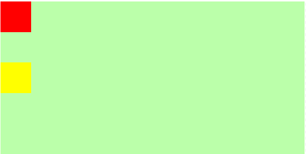
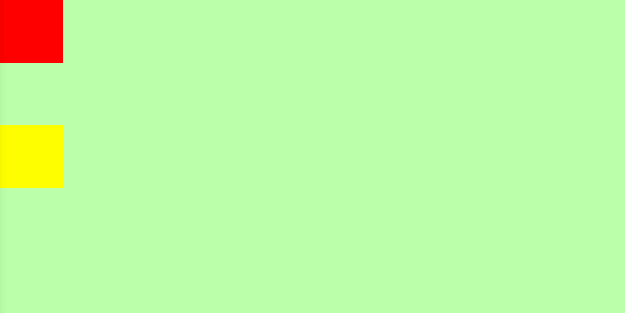
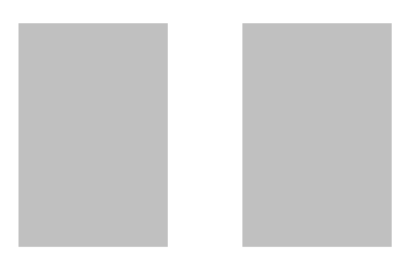
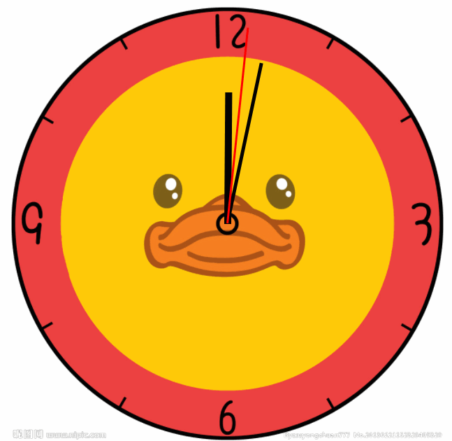
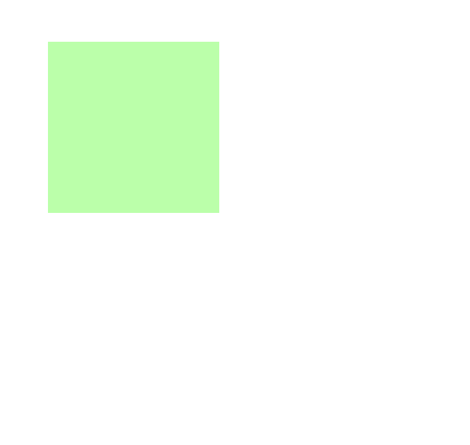

## 过渡
1. 通过过渡可以指定一个属性发生变化时的切换方式
2. 通过过渡可以创建一些非常好的效果，提升用户的体验

### 属性
1. `transition-property`：指定要执行过渡的属性
+ 多个属性间使用 `,` 隔开；
+ 如果所有属性都需要过渡，则使用 `all` 关键字；

注意：过渡时必须是从一个有效数值向另外一个有效数值进行过渡（不能是 auto）；

2. `transition-duration`：指定过渡效果的持续时间
+ 时间单位：s 和 ms（1s = 1000ms）
3. `transition-delay`：过渡效果的延迟，等待一段时间后在执行过渡
4. `transition-timing-function`：过渡的时序函数
+ `linear` ：匀速运动
+ `ease` ：默认值，慢速开始，先加速后减速
+ `ease-in` ：加速运动
+ `ease-out` ：减速运动
+ `ease-in-out` ：先加速后减速
+ `cubic-bezier()` ：指定时序函数
+ `steps()` ：分步执行过渡效果，可以设置第二个值： 
    - `end`：在时间结束时执行过渡（默认值）
    - `start`：在时间开始时执行过渡
5. `transition`：可以同时设置过渡相关的所有属性
+ 只有一个要求，如果要写延迟，则两个时间中第一个是持续时间，第二个是延迟时间

```css
/* transition: margin-left 2s 1s; */
transition-property: margin-left;
transition-duration: 2s;
transition-delay: 1s;
```



### 效果
1. `linear` ：匀速运动

```css
transition-timing-function: linear;
```


2. `ease`： 默认值，慢速开始，先加速后减速

```css
transition-timing-function: ease;
```


3. `ease-in` ：加速运动

```css
transition-timing-function: ease-in;
```


4. `ease-out` ：减速运动

```css
transition-timing-function: ease-out;
```


5. `ease-in-out` ：先加速后减速

```css
transition-timing-function: ease-in-out;
```



6. `cubic-bezier()` ：来指定时序函数

```css
transition-timing-function: cubic-bezier(.17, 1.79, .68, -0.69);
```


7. `steps()` ：分步执行过渡效果

```css
/* transition-timing-function: steps(2, end); */
transition-timing-function: steps(2);
```


```css
transition-timing-function: steps(2, start);
```


```css
.box {
    height: 271px;
    width: 132px;
    background-image: url("/assets/米兔/bigtap-mitu-queue-big.png");
    margin: 100px auto;
    transition: background-position 1s steps(4);
}

.box:hover {
    background-position: -528px 0;
}
```


## 动画
动画和过渡类似，都是可以实现一些动态的效果，不同的是

1. 过渡需要在某个属性发生变化时才会触发
2. 动画可以自动触发动态效果

### 属性
设置动画效果，必须先要设置一个关键帧，关键帧设置了动画执行每一个步骤

```css
@keyframes test {
    from {
        margin-left: 0;
    }

    to {
        margin-left: 900px;
    }
}
```

1. `animation-name` ：指定动画的关键帧名称
2. `animation-duration`：指定动画效果的持续时间
3. `animation-delay`：动画效果的延迟，等待一段时间后在执行动画
4. `animation-timing-function`：动画的时序函数
5. `animation-iteration-count` ：动画执行的次数
+ `infinite` ：无限执行
6. `animation-direction` ：指定动画运行的方向
+ `normal` ：从 `from` 向 `to` 运行，每次都是这样，默认值
+ `reverse` ：从 `to` 向 `from` 运行，每次都是这样
+ `alternate` ：从 `from` 向 `to` 运行，重复执行动画时反向执行
+ `alternate-reverse` ：从 `to` 向 `from` 运行，重复执行动画时反向执行
7. `animation-play-state` ：设置动画的执行状态
+ `running` ：动画执行，默认值
+ `paused` ：动画暂停
8. `animation-fill-mode` ：动画的填充模式
+ `none` ：动画执行完毕，元素回到原来位置，默认值
+ `forwards` ：动画执行完毕，元素会停止在动画结束的位置
+ `backwards` ：动画延时等待时，元素就会处于开始位置
+ `both` ：结合了 `forwards` 和 `backwards`

### 效果
```css
/* animation-name: test;
animation-duration: 2s;
animation-delay: 2s;
animation-timing-function: linear;
animation-iteration-count: infinite;
animation-direction: alternate;
animation-fill-mode: both; */

animation: test 2s 2s linear infinite alternate both;
```


```css
.box {
    height: 256px;
    width: calc(1536px/6);
    background-image: url("/assets/奔跑的少年/bg2.png");
    margin: 100px auto;
    animation: run 1s steps(6) infinite;

}

/* 关键帧 */
@keyframes run {
    from {
        background-position: 0 0;
    }

    to {
        background-position: -1536px 0;
    }
}
```


## 平移
### 属性
1. `translateX()` ：沿着 x 轴由方向平移
2. `translateY()`： 沿着 y 轴方向平移
3. `translateZ()` ：沿着 z 轴方向平移平移元素

注意：百分比是相对于自身计算的

1.  绝对定位的方式 

```css
/* 这种居中方式，只适用于元素的大小确定 */
position: absolute;
top: 0;
left: 0;
bottom: 0;
right: 0;
margin: auto;
```

2.  `table-cell` 的方式

```css
/* table-cell的方式具有一定局限性 */
display: table-cell;
vertical-align: middle;
text-align: center;
```

3. `transform` 的方式

```css
/* transform变形平移的方式 */
position: absolute;
left: 50%;
top: 50%;
transform: translateX(-50%) translateY(-50%);
```

### 浮出
```css
div {
    float: left;
    width: 200px;
    height: 300px;
    background-color: silver;
    margin: 100px 50px auto 50px;
    transition: all .3s;
}

div:hover {
    box-shadow: 0 0 10px rgba(0, 0, 0, .2);
    transform: translateY(-5px);
}
```



### 透视
```css
html {
    background-color: rgb(71, 44, 32);
    perspective: 800px;
}

.box {
    width: 200px;
    height: 300px;
    background-color: silver;
    margin: 100px auto;
    transition: all .3s;
}

.box:hover {
    box-shadow: 0 0 10px rgba(0, 0, 0, .2);
    transform: translateZ(200px);
}
```


## 旋转
通过旋转可以使元素沿着 x、y 或 z 旋转指定的角度

1. `rotateX()`
2. `rotateY()`
3. `rotateZ()`

```css
/* transform: rotateY(0.5turn); */
transform: rotateY(180deg);
```


```html
<div class="clock">
    <div class="hour-wrapper">
        <div class="hour"></div>
    </div>
    <div class="minute-wrapper">
        <div class="minute"></div>
    </div>
    <div class="second-wrapper">
        <div class="second"></div>
    </div>
</div>
```

```css
.clock {
    width: 500px;
    height: 500px;
    background-image: url("assets/鸭子表/clock.png");
    background-image: url("assets/鸭子表/clock_duck.jpg");
    background-size: cover;
    margin: 100px auto;
    position: relative;
}

.clock>div {
    position: absolute;
    top: 0;
    bottom: 0;
    left: 0;
    right: 0;
    margin: auto;
}

.clock>div>div {
    height: 50%;
    margin: 0 auto;
}

/* 时针 */
.hour-wrapper {
    height: 60%;
    width: 60%;
    animation: clock-run 720s infinite;
}

.hour {
    width: 8px;
    background-color: black;
}

/* 分针 */
.minute-wrapper {
    height: 75%;
    width: 75%;
    animation: clock-run 60s steps(60) infinite;
}

.minute {
    width: 4px;
    background-color: black;
}

/* 秒针 */
.second-wrapper {
    height: 90%;
    width: 90%;
    animation: clock-run 1s steps(60) infinite;
}

.second {
    width: 2px;
    background-color: red;
}

@keyframes clock-run {
    from {
        transform: rotateZ(0);
    }

    to {
        transform: rotateZ(360deg);
    }
}
```



```html
<div class="cube">
    <div class="surface1"></div>
    <div class="surface2"></div>
    <div class="surface3"></div>
    <div class="surface4"></div>
    <div class="surface5"></div>
    <div class="surface6"></div>
</div>
```

```css
html {
    perspective: 800px;
}

.cube {
    height: 200px;
    width: 200px;
    margin: 200px auto;
    position: relative;
    /* 设置3d变形效果 */
    transform-style: preserve-3d;
    animation: cube-rotate 12s infinite linear;
}

.cube div {
    height: 200px;
    width: 200px;
    background-size: cover;
    position: absolute;
    top: 0;
    left: 0;
    /* 为元素设置透明效果 */
    opacity: .85;
}

.surface1 {
    background-image: url("/assets/复仇者联盟/1.jpg");
    transform: translateX(-100px) rotateY(90deg);
}

.surface2 {
    background-image: url("/assets/复仇者联盟/2.jpg");
    transform: translateX(100px) rotateY(90deg);
}

.surface3 {
    background-image: url("/assets/复仇者联盟/3.jpg");
    transform: translateY(-100px) rotateX(90deg);
}

.surface4 {
    background-image: url("/assets/复仇者联盟/4.jpg");
    transform: translateY(100px) rotateX(90deg);
}

.surface5 {
    background-image: url("/assets/复仇者联盟/5.jpg");
    transform: translateZ(-100px);
}

.surface6 {
    background-image: url("/assets/复仇者联盟/6.jpg");
    transform: translateZ(100px);
}

@keyframes cube-rotate {
    from {
        transform: rotateX(0) rotateY(0) rotateZ(0);
    }

    to {
        transform: rotateX(1turn) rotateY(2turn) rotateZ(3turn);
    }
}
```


## 缩放
对元素进行缩放的函数

1. `scalex()` ：水平方向缩放
2. `scaleY()` ：垂直方向缩放
3. `scale()` ：双方向的缩放

```css
.box {
    height: 200px;
    width: 200px;
    background-color: #bfa;
    margin: 200px auto;
    transition: 2s;
}

.box:hover {
    /* transform: scaleX(2); */
    /* transform: scaleY(2); */
    transform: scale(2);
    /* 变形的原点 */
    transform-origin: 0 0;
}
```



