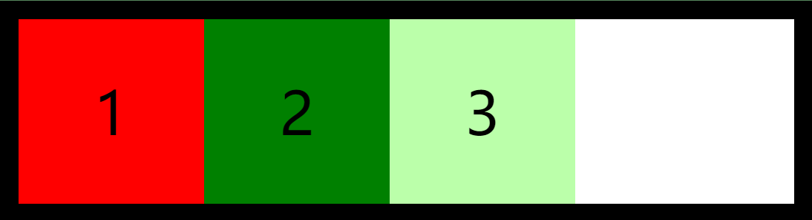
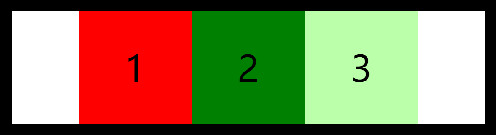
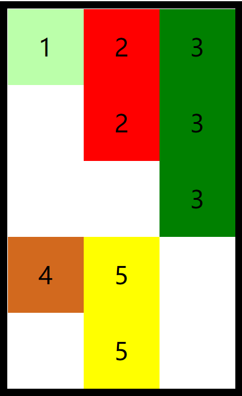

## 弹性盒
`flex`（弹性盒、伸缩盒）是 `css` 中的又一种布局手段，它主要用来代替浮动来完成页面的布局

`flex` 可以使元素具有弹性，让元素可以跟随页面的大小的改变而改变

## 弹性容器
要使用弹性盒，必须先将一个元素设置为弹性容器，我们通过 `display` 来设置弹性容器

1. `display:flex` ：设置为块级弹性容器
2. `display:inline-flex` ：设置为行内的弹性容器

```css
/* 设置弹性容器 */
display: flex;
```


**主轴与侧轴**

1. 主轴：弹性元素的排列方向称为主轴
2. 侧轴：与主轴垂直方向的称为侧轴

### 主轴属性
#### 排列方式
`flex-direction` 指定容器中弹性元素的排列方式

1. `row` ：默认值，弹性元素在容器中水平排列（自左向右）
2. `row-reverse` ：弹性元素在容器中反向水平排列（自右向左）
3. `column` ：弹性元素纵向排列（自上向下）
4. `column-reverse` ：弹性元素反向纵向排列（自下向上）

```css
/* 设置弹性元素排列方式 */
flex-direction: column;
```


#### 自动换行
`flex-wrap` 设置弹性元素是否在弹性容器中自动换行

1. `nowrap`： 默认值，元素不会自动换行
2. `wrap` ：元素沿着辅轴方向自动换行

```css
/* 设置弹性元素排列方式 */
flex-direction: row;
/* 设置自动换行 */
flex-wrap: wrap;
```


`flex-flow` 是 `wrap` 和 `direction` 的简写属性

```css
/* 简写属性 */
flex-flow: row wrap;
```


#### 空白空间
`justify-content` 如何分配主轴上的空白空间（主轴上的元素如何排列）

1.  `flex-start` ：元素沿着主轴起边排列



2.  `flex-end` ：元素沿着主轴终边排列


3.  `center` ：元素居中排列



4.  `space-around` ：空白分布到元素两侧


5.  `space-between`： 空白均匀分布到元素间


6.  `space-evenly` ：空白分布到元素的单侧


### 辅轴属性
#### 辅轴对齐
`align-items` 元素在辅轴上如何对齐

1.  `stretch` ：默认值，将元素的长度设置为相同的值


2.  `flex-start` ：元素不会拉伸，沿着辅轴起边对齐



3.  `flex-end` ：沿着辅轴的终边对齐


4.  `center` ：居中对齐


5.  `baseline` ：基线对齐


#### 空白空间
`align-content` 如何分配辅轴上的空白空间（辅轴上的元素如何排列）

1.  `flex-start`： 元素沿着辅轴起边排列


2.  `flex-end` ：元素沿着辅轴终边排列


3.  `center` ：元素居中排列


4.  `space-around` ：空白分布到元素两侧


5.  `space-between` ：空白均匀分布到元素间


6.  `space-evenly` ：空白分布到元素的单侧


### 弹性居中
利用弹性盒对元素进行水平垂直双方向居中

```css
justify-content: center;
align-items: center;
```


## 弹性元素
弹性容器的子元素是弹性元素（弹性项）。弹性元素可以同时是弹性容器

### 伸展系数
`flex-grow` 指定弹性元素的伸展系数，默认值为 0

1. 当父元素有多余空间的时，子元素如何伸展
2. 父元素的剩余空间，会按照比例进行分配

```css
li:nth-child(1) {
    background-color: #bfa;
    flex-grow: 1;
}

li:nth-child(2) {
    background-color: red;
    flex-grow: 2;
}

li:nth-child(3) {
    background-color: green;
    flex-grow: 3;
}
```


### 缩减系数
`flex-shrink` 指定弹性元素的收缩系数，默认值为 1

1. 当父元素中的空间不足以容纳所有的子元素时，如何对子元素进行收缩
2. 缩减系数的计算方式比较复杂，缩减多少是根据 _缩减系数_ 和 _元素大小_ 来计算

```css
li:nth-child(1) {
    background-color: #bfa;
    flex-shrink: 1;
}

li:nth-child(2) {
    background-color: red;
    flex-shrink: 2;
}

li:nth-child(3) {
    background-color: green;
    flex-shrink: 3;
}
```


### 基础长度
`flex-basis` 指定的是元素在主轴上的基础长度

1. 如果主轴是横向的，则该值指定的就是元素的宽度
2. 如果主轴是纵向的，则该值指定的就是元素的高度
3. 默认值是 `auto`，表示参考元素自身的高度或宽度
4. 如果传递了一个具体的数值，则以该值为准

```css
li:nth-child(1) {
    background-color: #bfa;
    flex-basis: 200px;
}
```


`flex` 可以设置弹性元素所有的三个样式，格式： `flex: 增长 缩减 基础`

1. `initial`：`flex: 0 1 auto`
2. `auto`：`flex: 1 1 auto`
3. `none`：`flex: 0 0 auto` 弹性元素没有弹性

### 排列顺序
`order` 决定弹性元素的排列顺序

```css
li:nth-child(1) {
    background-color: #bfa;
    order: 2;
}

li:nth-child(2) {
    background-color: red;
    order: 3;
}

li:nth-child(3) {
    background-color: green;
    order: 1;
}
```


### 覆盖辅轴
`align-self` 用来覆盖当前弹性元素上的 `align-items`

```css
li:nth-child(1) {
    background-color: #bfa;
    align-self: flex-end;
}
```


