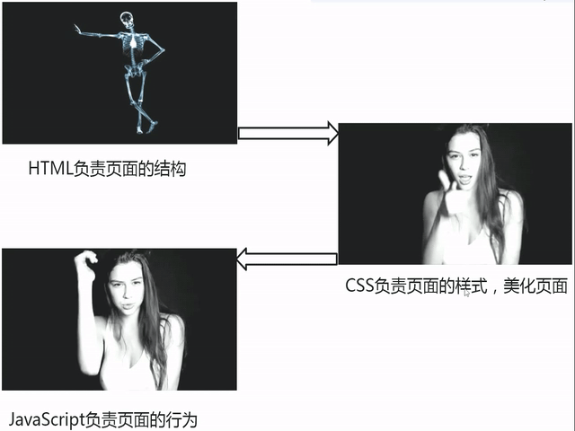

## 网页结构思想

根据 W3C 标准，一个网页主要由三部分组成：结构、表现还有行为。

1. 结构（骨架）：HTML 用于描述页面的结构
2. 表现（皮肤）：CSS 用于控制页面中元素的样式
3. 行为（交互）：JavaScript 用于响应用户操作




## 版本迭代

| 版本      | 发布时间 | 主要特点                                           |
| :-------- | :------- | :------------------------------------------------- |
| HTML2.0  | 1995     | 首个标准化版本                                     |
| HTML3.2  | 1997     | 添加表格、applet 和文本环绕图片等功能               |
| HTML4.01 | 1999     | 引入 CSS 支持，分离结构与表现                        |
| XHTML1.0 | 2000     | 基于 XML 的严格语法版本                              |
| HTML5     | 2014     | 新增语义元素、多媒体支持、本地存储、Canvas/WebGL 等 |
| HTML5.1   | 2016     | 小幅度更新                                         |
| HTML5.2   | 2017     | 新增 dialog 元素等                                   |
| HTML5.3   | 2021     | 工作草案，包含更多现代 Web 应用特性                  |

## 什么是 HTML？

HTML 指的是超文本标记语言（Hyper Text Markup Language）, 它是用来描述网页的一种语言。

HTML 不是一种编程语言，而是一种标记语言（markup language）， 标记语言是一套标记标签（markup tag）。

**超文本的含义**

它可以加入图片、声音、动画、多媒体等内容（超越文本限制），可以从一个文件跳转到另一个文件，于世界各地主机的文件连接（超级链接文本）

## HTML 基本骨架

```html
<!doctype html>
<html lang="zh-CN">
  <head>
    <meta charset="utf-8" />
    <meta name="viewport" content="width=device-width, initial-scale=1" />
    <title>示例页面</title>
    <meta name="description" content="页面的简要描述，有助于 SEO" />
  </head>
  <body>
    <header>头部</header>
    <main>主要内容</main>
    <footer>页脚</footer>
  </body>
</html>
```

## 常用浏览器及其内核

浏览器内核（渲染引擎）：负责读取网页内容，整理讯息，计算网页的显示方式并显示页面。

| 浏览器       | 内核    | 备注                          |
| ------------ | ------- | ----------------------------- |
| IE           | Trident | IE、猎豹安全、360、百度浏览器 |
| Firefox      | Gecko   | 火狐浏览器内核                |
| Safari       | WebKit  | 苹果浏览器内核                |
| Chrome/Opera | Blink   | Chrome/Opera 浏览器内核       |

## Web 标准

Web 标准是由 W3C 组织和其他标准化组织制定的一系列标准的集合。

**为什么需要 Web 标准？**

浏览器不同，它们显示的页面或者排版有些许差异，遵循 Web 标准除了可以让不同的开发人员写出的页面更标准、更统一外，还有以下优点：

1. 让 Web 标准发展前景更为广阔
2. 内容能被更广泛的设备访问
3. 更容易被搜索引擎搜索
4. 降低网站流量费用
5. 易于维护
6. 提高页面浏览速度
