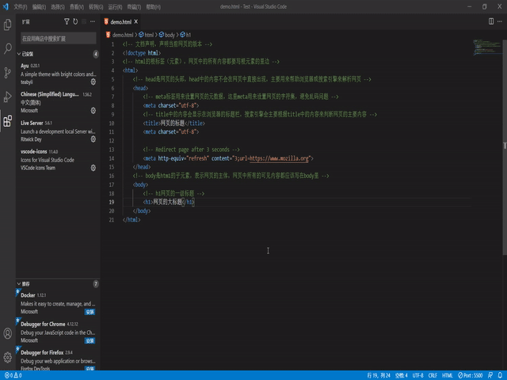
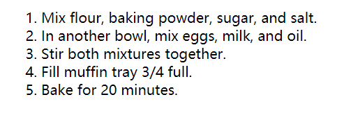
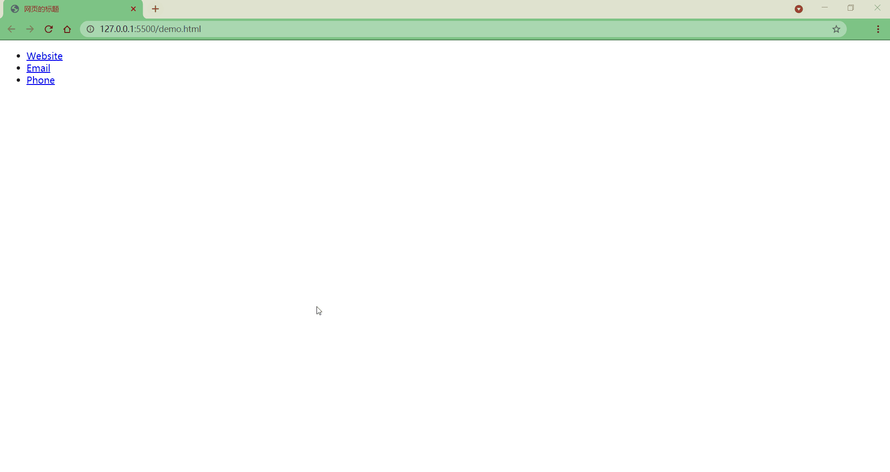
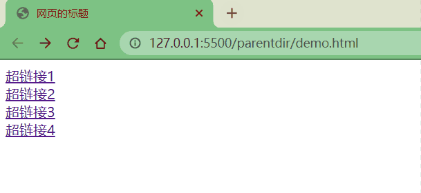
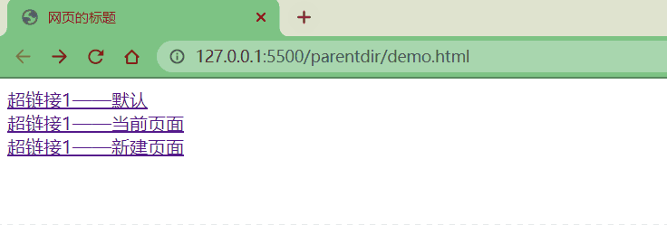

## HTML5 基本结构

```html
<!-- 文档声明，声明当前网页的版本 -->
<!doctype html>
<!-- html 的根标签（元素），网页中的所有内容都要写在根元素里边 -->
<html lang="zh-CN">
    <!-- head是网页的头部，head中的内容不会在网页中直接出现，主要用来帮助浏览器或搜索引擎来解析网页 -->
    <head>
        <!-- meta标签用来设置网页的元数据，这里meta用来设置网页的字符集，避免乱码问题 -->
        <meta charset="utf-8">
        <!-- title中的内容会显示在浏览器的标题栏，搜索引擎会主要根据title中的内容来判断网页的主要内容 -->
        <title>网页的标题</title>
    </head>
    <!-- body 是 html 的子元素，表示网页的主体，网页中所有的可见内容都应该写在 body 里 -->
    <body>
        <!-- h1网页的一级标题 -->
        <h1>网页的大标题</h1>
    </body>
</html>
```

### doctype 文档声明

文档声明用来告诉浏览器当前网页的版本

```html
<!-- html5的文档声明 -->
<!doctype html>
<!-- 或者（大小写不敏感） -->
<!DOCTYPE html>
```

历史演变：

1. HTML4.01 严格型：`<!DOCTYPE HTML PUBLIC "-//W3C//DTD HTML 4.01//EN">`
2. XHTML1.0：`<!DOCTYPE html PUBLIC "-//W3C//DTD XHTML 1.0 Strict//EN">`
3. HTML5 简化：`<!DOCTYPE html>`

### lang 语言种类

用来显示当前文档显示的语言。

```html
<html lang="zh-CN"></html>
<html lang="en"></html>

<html lang="zh-Hans"> <!-- 简体中文 -->
<html lang="zh-Hant"> <!-- 繁体中文 -->
<html lang="ja">      <!-- 日语 -->
<html lang="ko">      <!-- 韩语 -->
```

### meta 标签

```html
<meta charset="utf8" version='1'/>
<meta name="viewport" content="width=device-width, initial-scale=1.0, maximum-scale=1.0, user-scalable=yes"/>
<meta name="description" content="京东JD.COM-专业的综合网上购物商城,销售家电、数码通讯、电脑、家居百货、服装服饰、母婴、图书、食品等数万个品牌优质商品.便捷、诚信的服务，为您提供愉悦的网上购物体验!"/>
<meta name="Keywords" content="网上购物,网上商城,手机,笔记本,电脑,MP3,CD,VCD,DV,相机,数码,配件,手表,存储卡,京东"/>
```

```html
<!-- 移动端适配 -->
<meta name="viewport" content="width=device-width, initial-scale=1.0, maximum-scale=5.0">

<!-- 社交媒体优化 -->
<meta property="og:title" content="页面标题">
<meta property="og:image" content="https://example.com/logo.png">

<!-- 安全策略 -->
<meta http-equiv="Content-Security-Policy" content="default-src 'self'">
```

以京东网站为例，右键单击，选择“查看网页源代码”

meta 主要用于设置网页中的一些元数据，元数据并不是给用户看的

1. charset：指定网页的字符集 
2. name：指定的数据的名称 
+ viewport：移动端适配
+ keywords：表示网站的关键字，可以同时指定多个关键字，关键字间使用 `,` 隔开
+ description：表示网站的描述信息
3. content：指定的数据的内容，会作为搜索结果的超链接上的文字显示


4. http-equiv

如果设置了 `http-equiv` 属性，`<meta>` 元素就是一个 pragma 指令，提供的信息相当于一个类似名称的 HTTP 头所能提供的信息。

+ content-security-policy：允许页面作者为当前页面定义一个内容策略。内容策略主要指定允许的服务器来源和脚本端点，这有助于防范跨站脚本攻击。
+ content-type：声明文档的 MIME 类型和字符编码。如果指定，content 属性必须有 "`text/html; charset=utf-8` " 的值。这相当于一个指定了 charset 属性的 `<meta>` 元素，并对文档中的位置有同样的限制。注意：只能在使用 `text/html` 的文档中使用，不能在使用 `XML MIME` 类型的文档中使用。
+ default-style：设置默认的 CSS 样式表集的名称。
+ x-ua-compatible： 如果指定，内容属性必须有 "`IE=edge`" 的值。用户代理被要求忽略这个 pragma。
+ refresh：该指令指定页面重新加载及重定向的方式 
  - 直到页面应该被重新加载的秒数——只有当 content 属性包含一个正整数时。
  - 直到页面重定向到另一个页面的秒数——只有当内容属性包含一个正整数，后面跟着字符串 "`;url=`"，以及一个有效的 URL。

```html
<meta charset="utf-8">
<!-- Redirect page after 3 seconds -->
<meta http-equiv="refresh" content="3;url=https://www.mozilla.org">
```

对 `refresh` 进行测试，发现过了 3 秒钟之后自动跳转到了指定的网站



### 内容修正

浏览器在解析网页时，会自动对网页中不符合规范的内容进行修正，比如：

1. 标签写在了根元素的外部
2. `<p>` 元素中嵌套了块元素
3. 根元素中出现了除 `head` 和 `body` 以外的子元素

这个通过浏览器中的 `查看网页源代码` 并不能看到效果，但是使用 F12 进行 `开发者调试` 时是能够看到上述几种情况被修正的结果。

###  SEO 优化

SEO（Search Engine Optimization），即搜索引擎优化，是一种利用搜索引擎的规则提高网站在有关搜索引擎内自然排名的方式。

SEO 的目的是对网站进行深度优化，从而帮助网站获得免费流量，进而在搜索引擎上提升网站排名，提高网站知名度。

页面必须有三个标签用来进行 SEO 优化。

1. title：是搜索引擎了解网页的入口和对网页主题归属的最佳判断点。
2. description：description 作为网站的总体业务和主题概括
3. keyword：keywords 是页面关键词，是搜索引擎的关注点之一。keywords 最好限制为 6～8 个关键词，关键词之间用英文逗号隔开，采用关键词 1, 关键词 2 的形式。


## 常见标签

### 语义标签

| 标签                                                | 作用   | 描述                                                         |
| :-------------------------------------------------- | :----- | ------------------------------------------------------------ |
| `<h1>`   `<h2>`   `<h3>`   `<h4>`   `<h5>`   `<h6>` | 标题   | 一共有六级标题   从 `h1`~ `h6` 重要性递减，`h1` 最重要，`h6` 最不重要   h1 在网页中的重要性仅次于 `title` 标签   一般情况下一个页面中只会有一个 `h1`   一般情况下标题标签只会使用到 `h1`～ `h3`，`h4`～ `h6` 很少用 |
| `<hgroup>`                                          | 标题组 | 多层次的标题。它将一组 `<h1>`～ `<h6>` 元素分组              |
| `<p>`                                               | 段落   | 页面中的一个段落。由空行或第一行缩进将相邻的文本块分开       |
| `<blockquote>`                                      | 长引文 | 用缩进表示所包含文本。   可以用 `cite` 属性表示引文来源，用 `<cite>` 元素表示来源的文本表述 |
| `<q>`                                               | 短引文 | 用一个简短的内联引号包围文本。   大多数浏览器通过在文本周围加上引号来实现。   该元素用于不需要段落分隔的短引文； |
| `<br>`                                              | 换行   |                                                              |

### 文本格式化标签

在网页中，有时候需要为文字设置粗体、斜体或下划线等效果，需要使用 HTML 中的文本格式化标签，使文字以特殊方式显示。

| 语义    | 标签                           |
| ------- | ------------------------------ |
| 加粗    | `<strong></strong>` 或 `<b></b>` |
| 斜体    | `<em></em>` 或 `<i></i>`         |
| 删除线  | `<del></del>` 或 `<s><s/>`       |
| 下划线  | `<ins></ins>` 或 `<u></u>`       |

### 布局标签


| 标签    | 作用                                                   |
| ------- | ------------------------------------------------------ |
| header  | 表示网页的头部（页眉）                                 |
| main    | 表示网页的主体部分（一个页面中只会有一个 main）        |
| footer  | 表示网页的底部（页脚）                                 |
| nav     | 表示网页中的导航                                       |
| aside   | 和主体相关的其他内容（侧边栏）                         |
| article | 表示一个独立的文章                                     |
| section | 表示一个独立的区块，上边的标签都不能表示时使用 section |

### 列表标签

```html
<ul>, <ol>, <li>, <dl>, <dt>, <dd>
```

### 表格标签

```html
<table>, <tr>, <th>, <td>, <caption>, <thead>, <tbody>, <tfoot>
```

### 表单标签

```html
<form>, <input>, <textarea>, <select>, <option>, <button>, <label>, <fieldset>, <legend>
```

### 多媒体标签

```html
, <audio>, <video>, <source>, <canvas>, <svg>
```

### 超链接标签

```html
<a>, <link>
```

### HTML5 新特性

1. 语义化标签：

| 标签           | 作用                         | 描述                                                         |
| :------------- | :--------------------------- | ------------------------------------------------------------ |
| `<header>`     | 页眉                         | 介绍性的内容                                                 |
| `<footer>`     | 页脚                         | 通常包含有关作者的信息、版权或文件链接                       |
| `<nav>`        | 导航链接                     | 可以是当前文档内的，也可以是到其他文档的。常见例子是菜单、目录和索引 |
| `<main>`       | 文档主内容                   | 中心主题直接相关或扩展的内容                                 |
| `<article>`    | 文章                         | 自成一体，独立分发，可重复使用                               |
| `<section>`    | 文档中的节                   | 没有一个更具体的语义元素来代表                               |
| `<aside>`      | 页面内容以外的内容           | 其内容与文档的主要内容只有间接的关系。经常以边栏或呼出框的形式出现 |
| `<mark>`       | 重要或强调的文本             | 为参考或记事目的而被标记或突出的文本，表明其相关性和重要性   |
| `<summary>`    | `<details>` 标题             | 为 `<details>` 指定一个摘要、标题或图例。点击 `<summary>` 可以切换 `<details>` 打开和关闭 |
| `<details>`    | 用户能够查看或隐藏的额外细节 | 其中的信息只有被切换到 "打开 " 状态时才可见。必须使用 `<summary>` 提供一个摘要或标签 |
| `<figure>`     | 自包含内容                   | 独立的内容，用 `<figcaption>`<br/>元素指定一个可选的标题。比如图示、图表、照片、代码清单等 |
| `<figcaption>` | `<figure>` 的标题            | 描述其父元素                                                 |
| `<time>`       | 定义日期/时间                | 可能包括 `datetime` 属性，将日期翻译成机器可读的格式，以便获得更好的搜索引擎结果或自定义功能。如提醒 |

2. 多媒体支持：`<video>`, `<audio>`, `<canvas>`, `<svg>`

3. 表单增强：

* 新的输入类型：`email`，`url`，`number`，`range`，`date`，`color` 等
* 表单属性：`placeholder`，`required`，`autofocus`，`pattern`

4. API 支持：

* 本地存储：`localStorage`，`sessionStorage`
* 地理定位：Geolocation API
* 拖放：Drag and Drop API
* 离线应用：Application Cache
* 画布：Canvas API

## 列表

### 有序列表

使用 `ol` 标签来创建有序列表，使用 `li` 表示列表项 

```html
<ol>
    <li>Mix flour, baking powder, sugar, and salt.</li>
    <li>In another bowl, mix eggs, milk, and oil.</li>
    <li>Stir both mixtures together.</li>
    <li>Fill muffin tray 3/4 full.</li>
    <li>Bake for 20 minutes.</li>
</ol>
```



### 无序列表

使用 `ul` 标签来创建无序列表，使用 `li` 表示列表项 

| 值     | 描述             |
| :----- | :--------------- |
| disc   | 默认值。实心圆。 |
| circle | 空心圆。         |
| square | 实心方块。       |

```html
<ul>
    <li>Milk</li>
    <li>Cheese
        <ul>
            <li>Blue cheese
                <ul>
                    <li>Sweet blue cheese</li>
                    <li>Sour blue cheese</li>
                </ul>
            </li>
            <li>Feta</li>
        </ul>
    </li>
</ul>
```


### 定义列表

使用 `dl` 标签来创建定义列表，使用 `dt` 表示定义的内容，使用 `dd` 来对内容进行解释说明 

```html
<dl>
    <dt>Beast of Bodmin</dt>
    <dd>A large feline inhabiting Bodmin Moor.</dd>

    <dt>Morgawr</dt>
    <dd>A sea serpent.</dd>

    <dt>Owlman</dt>
    <dd>A giant owl-like creature.</dd>
</dl>
```


## 超链接

超链接可以让我们从一个页面跳转到其他页面，或者是当前页面的其他的位置

使用 `a` 标签来定义超链接，`href` 属性指定跳转的目标路径，值可以是一个外部网站的地址，也可以写一个内部页面的地址

超链接是一个行内元素，在 `a` 标签中可以嵌套除它自身外的任何元素

### 外部地址

```html
<ul>
  <li><a href="https://www.baidu.com">Website</a></li>
  <li><a href="mailto:example@outlook.com">Email</a></li>
  <li><a href="tel:+123456789">Phone</a></li>
</ul>
```



### 内部地址

当我们需要跳转一个服务器内部的页面时，一般我们都会使用相对路径，会以 `./` 或 `../` 开头

1. `./` 表示当前文件所在目录，可以省略不写
2. `../` 表示当前文件所在目录的上一级目录

```html
<a href="./test1.html">超链接1</a><br>
<a href="../test2.html">超链接2</a><br>
<a href="./test3/test3.html">超链接3</a><br>
<a href="../test4/test4.html">超链接4</a>
```



### 新建页面

`target` 属性用于指定超链接打开的位置，可选值：

1. _self：在当前页面中打开超链接（默认值）
2. _blank：在新建页面中打开超链接

```html
<a href="./test1.html">超链接1——默认</a><br>
<a href="./test1.html" target="_self">超链接1——当前页面</a><br>
<a href="./test1.html" target="_blank">超链接1——新建页面</a><br>
```



### 锚点跳转

1. 使用 `javascript:void(0)` 来作为 `href` 的属性值，此时点击这个超链接什么也不会发生
2. 直接将超链接的 `href` 属性设置为 `#` ，作为超链接的路径的占位符使用，这样点击超链接以后页面不会发生跳转，而是转到当前页面的顶部的位置
3. 跳转到页面的指定位置（锚点），只需将 `href` 属性设置 `#目标元素的id属性值`（唯一不重复）

```html
<p> 汉皇重色思倾国，御宇多年求不得。</p>
<p> 杨家有女初长成，养在深闺人未识。 </p>
<p> 天生丽质难自弃，一朝选在君王侧。 </p>
<p><a id="Anchor1" href="#Anchor2"> 回眸一笑百媚生，六宫粉黛无颜色。</a></p>
<p> 春寒赐浴华清池，温泉水滑洗凝脂。 </p>
<p> 侍儿扶起娇无力，始是新承恩泽时。 </p>
<p> 云鬓花颜金步摇，芙蓉帐暖度春宵。 </p>
<p> 春宵苦短日高起，从此君王不早朝。 </p>
<p> 承欢侍宴无闲暇，春从春游夜专夜。 </p>
<p><a id="Anchor2" href="#Anchor3"> 后宫佳丽三千人，三千宠爱在一身。</a></p>
<p> 金屋妆成娇侍夜，玉楼宴罢醉和春。 </p>
<p> 姊妹弟兄皆列土，可怜光彩生门户。 </p>
<p> 遂令天下父母心，不重生男重生女。 </p>
<p> 骊宫高处入青云，仙乐风飘处处闻。 </p>
<p> 缓歌慢舞凝丝竹，尽日君王看不足。 </p>
<p> 渔阳鼙鼓动地来，惊破霓裳羽衣曲。 </p>
<p> 九重城阙烟尘生，千乘万骑西南行。 </p>
<p> 翠华摇摇行复止，西出都门百余里。 </p>
<p> 六军不发无奈何，宛转蛾眉马前死。 </p>
<p> 花钿委地无人收，翠翘金雀玉搔头。 </p>
<p> 君王掩面救不得，回看血泪相和流。 </p>
<p> 黄埃散漫风萧索，云栈萦纡登剑阁。 </p>
<p> 峨嵋山下少人行，旌旗无光日色薄。 </p>
<p> 蜀江水碧蜀山青，圣主朝朝暮暮情。 </p>
<p> 行宫见月伤心色，夜雨闻铃肠断声。 </p>
<p> 天旋地转回龙驭，到此踌躇不能去。 </p>
<p> 马嵬坡下泥土中，不见玉颜空死处。 </p>
<p> 君臣相顾尽沾衣，东望都门信马归。 </p>
<p> 归来池苑皆依旧，太液芙蓉未央柳。 </p>
<p> 芙蓉如面柳如眉，对此如何不泪垂。 </p>
<p> 春风桃李花开夜，秋雨梧桐叶落时。 </p>
<p> 西宫南苑多秋草，落叶满阶红不扫。 </p>
<p> 梨园弟子白发新，椒房阿监青娥老。 </p>
<p> 夕殿萤飞思悄然，孤灯挑尽未成眠。 </p>
<p><a id="Anchor3" href="#Anchor4"> 迟迟钟鼓初长夜，耿耿星河欲曙天。 </a></p>
<p> 鸳鸯瓦冷霜华重，翡翠衾寒谁与共。 </p>
<p> 悠悠生死别经年，魂魄不曾来入梦。 </p>
<p> 临邛道士鸿都客，能以精诚致魂魄。 </p>
<p> 为感君王辗转思，遂教方士殷勤觅。 </p>
<p> 排空驭气奔如电，升天入地求之遍。 </p>
<p> 上穷碧落下黄泉，两处茫茫皆不见。 </p>
<p> 忽闻海上有仙山，山在虚无缥缈间。 </p>
<p> 楼阁玲珑五云起，其中绰约多仙子。 </p>
<p> 中有一人字太真，雪肤花貌参差是。 </p>
<p> 金阙西厢叩玉扃，转教小玉报双成。 </p>
<p> 闻道汉家天子使，九华帐里梦魂惊。 </p>
<p> 揽衣推枕起徘徊，珠箔银屏迤逦开。 </p>
<p> 云鬓半偏新睡觉，花冠不整下堂来。 </p>
<p><a id="Anchor4" href="#Anchor5"> 风吹仙袂飘飖举，犹似霓裳羽衣舞。 </a></p>
<p> 玉容寂寞泪阑干，梨花一枝春带雨。 </p>
<p> 含情凝睇谢君王，一别音容两渺茫。 </p>
<p> 昭阳殿里恩爱绝，蓬莱宫中日月长。 </p>
<p> 回头下望人寰处，不见长安见尘雾。 </p>
<p> 惟将旧物表深情，钿合金钗寄将去。 </p>
<p> 钗留一股合一扇，钗擘黄金合分钿。 </p>
<p> 但令心似金钿坚，天上人间会相见。 </p>
<p> 临别殷勤重寄词，词中有誓两心知。 </p>
<p> 七月七日长生殿，夜半无人私语时。 </p>
<p><a id="Anchor5" href="#Anchor6"> 在天愿作比翼鸟，在地愿为连理枝。 </a></p>
<p> 天长地久有时尽，此恨绵绵无绝期。 </p>

<!-- Heading to link to -->
<a href="#">回到顶部</a>
```

   

## 图片

图片标签用于向当前页面中引入一个外部图片

`img` 标签是一个自结束标签，这种元素属于替换元素（块和行内元素之间，具有两种元素的特点）

```html

```

### 属性

| 属性     | 属性值   | 说明                             |
| -------- | -------- | -------------------------------- |
| `src`    | 图片路径 | 必须属性                         |
| `alt`    | 文本     | 替换文本，当图片不显示时显示文字 |
| `title`  | 文本     | 提示文本。鼠标放到图像上显示文字 |
| `width`  | 像素     | 图像宽度                         |
| `height` | 像素     | 图像高度                         |
| `border` | 像素     | 图像边框粗细                     |

注意：

1. 宽度和高度中如果只修改了一个，则另一个会等比例缩放
2. 一般情况在 pc 端，不建议修改图片的大小，需要多大的图片就裁多大
3. 但是在移动端，经常需要对图片进行缩放（大图缩小）

### 格式

1. jpeg（jpg）

+ 支持的颜色比较丰富
+ 不支持透明效果
+ 不支持动图
+ 一般用来显示照片

2. gif

+ 支持的颜色比较单一
+ 支持简单透明
+ 支持动图

3. png

+ 支持的颜色丰富
+ 支持复杂透明
+ 不支持动图
+ 专为网页而生

4. webp

+ 这种格式是谷歌新推出的专门用来表示网页中的图片的一种格式
+ 具备其他图片格式的所有优点，而且文件还特别的小
+ 兼容性不好

5. base64

+ 将图片使用 base64 编码，这样可以将图片转换为字符，通过字符的形式来引入图片 
+ 图片效果一样的，选文件小的 
+ 图片效果不一样的，选图片效果好的 
+ 尽可能的兼顾和平衡图片效果和文件大小 

## 内联框架

内联框架 `iframe`，用于向当前页面中引入一个其他页面

| 属性              | 作用                        | 示例                                             |
| ----------------- | --------------------------- | ------------------------------------------------ |
| `src`             | 设置嵌入页面的 URL          | `<iframe src="https://example.com"></iframe>`    |
| `width`           | 宽度（默认 300px）          | `<iframe width="500"></iframe>`                  |
| `height`          | 高度（默认 150px）          | `<iframe height="300"></iframe>`                 |
| `frameborder`     | 是否显示边框（`0` 无边框）  | `<iframe frameborder="0"></iframe>`              |
| `scrolling`       | 滚动条（`yes`/`no`/`auto`） | `<iframe scrolling="no"></iframe>`               |
| `allowfullscreen` | 允许全屏模式                | `<iframe allowfullscreen></iframe>`              |
| `referrerpolicy`  | 控制引用信息                | `<iframe referrerpolicy="no-referrer"></iframe>` |

```html
<iframe src="https://www.qq.com" width="800" height="600" frameborder="0"></iframe>
```


## 表格

同样在网页中我们也需要使用表格，我们通过 `table` 标签来创建一个表格

1. 在 `table` 中使用 `tr` 表示表格中的一行，有几个 `tr` 就有几行
2. 在 `tr` 中使用 `td` 表示一个单元格，有几个 td `就有` 几个单元格

### 合并单元格

1. rowspan ：纵向的合并单元格
2. colspan ：横向的合并单元格

```html
<table border="1" width="50%" align=" center">
    <!--在table中使用tr表示表格中的一行，有几个tr就有几行-->
    <tr>
        <!--在tr中使用td表示一个单元格，有几个td就有几个单元格-->
        <td>A1</td>
        <td>B1</td>
        <td>C1</td>
        <td>D1</td>
    </tr>
    <tr>
        <td>A2</td>
        <td>B2</td>
        <td>C2</td>
        <!--rowspan 纵向的合并单元格-->
        <td rowspan="2">D2</td>
    </tr>
    <tr>
        <td>AB</td>
        <td>B3</td>
        <td>C3</td>
    </tr>
    <tr>
        <td>A4</td>
        <td>B4</td>
        <!-- colspan横向的合并单元格 -->
        <td colspan="2">C4</td>
    </tr>
</table>
```

### 长表格

可以将一个表格分成三个部分：

1. 头部 `thead`
2. 主体 `tbody`
3. 底部 `tfoot`

`th` 表示头部的单元格

```html
<table>
    <thead>
        <tr>
            <td>日期</td>
            <td>收入</td>
            <td>支出</td>
            <td>合计</td>
        </tr>
    </thead>
    <tbody>
        <tr>
            <td>2000.1.1</td>
            <td>500</td>
            <td>200</td>
            <td>300</td>
        </tr>
        <tr>
            <td>2000.1.1</td>
            <td>500</td>
            <td>200</td>
            <td>300</td>
        </tr>
        <tr>
            <td>2000.1.1</td>
            <td>500</td>
            <td>200</td>
            <td>300</td>
        </tr>
    </tbody>
    <tfoot>
        <tr>
            <td></td>
            <td></td>
            <td>合计</td>
            <td>1200</td>
        </tr>
    </tfoot>
</table>
```

## 其他

### 块和行内元素

**块元素（block element）**

1. 特点

- 独占一行，默认情况下会占满父容器的整个宽度。
- 可以包含块级元素和行内元素（但部分元素如 `<p>` 不能包含块级元素）。
- 默认情况下有宽度、高度、内边距和外边距。
- 适用于布局结构，如段落、容器、列表等。

2. 常见块级元素

- 结构性元素：`<div>`、`<section>`、`<article>`、`<header>`、`<footer>`、`<main>`、`<aside>`、`<nav>`
- 文本块：`<p>`、`<h1>` ~ `<h6>`、`<pre>`
- 列表：`<ul>`、`<ol>`、`<li>`、`<dl>`、`<dt>`、`<dd>`
- 表格：`<table>`、`<thead>`、`<tbody>`、`<tfoot>`、`<tr>`、`<td>`、`<th>`
- 其他：`<form>`、`<fieldset>`、`<legend>`、`<blockquote>`

**行内元素（inline element）**

1. 特点

- 不会独占一行，元素的宽度只取决于内容的大小。
- 只能包含文本或其他行内元素（不能直接包含块级元素）。
- 不能直接设置宽高（部分行内元素如 `` 例外）。
- 适用于文本内容的修饰、链接等。

2. 常见行内元素

- 文本格式化：`<span>`、`<strong>`、`<em>`、`<b>`、`<i>`、`<u>`、`<small>`、`<mark>`、`<sub>`、`<sup>`
- 链接和交互：`<a>`、`<button>`（可被 CSS 设置为块级）
- 输入相关：`<label>`、`<input>`、`<textarea>`、`<select>`、`<option>`、`<br>`（换行符）、`<wbr>`（可换行提示）
- 媒体：``、`<svg>`、`<video>`、`<audio>`（但默认 `video` 是块级）
- 其他：`<code>`、`<kbd>`、`<samp>`、`<abbr>`、`<cite>`

**行内块元素**

有些元素在默认情况下是行内元素，但可以通过 `display: inline-block;` 让其具备行内元素的排列特性，同时允许设置宽高。

1. 特点

- 像行内元素一样不会独占一行。
- 但可以像块级元素一样设置 `width` 和 `height`。

2. 常见行内块元素

- 默认即为 `inline-block` 的元素：``、`<input>`、`<button>`、`<select>`、`<textarea>`

**总结**

| 分类       | 主要特点                       | 例子                                        |
| ---------- | ------------------------------ | ------------------------------------------- |
| 块级元素   | 独占一行，可包含块级和行内元素 | `<div>`, `<p>`, `<h1>`, `<section>`, `<ul>` |
| 行内元素   | 不换行，仅占自身内容的大小     | `<span>`, `<a>`, `<b>`, `<i>`               |
| 行内块元素 | 行内显示，但可以设置宽高       | ``, `<input>`, `<button>`              |

### 字符实体

有些时候，在 HTML 中不能直接书写一些特殊符号，如：

1. 多个连续的空格（在网页中编写的多个空格默认情况会自动被浏览器解析为一个空格）
2. 比如字母两侧的大于小于号（可能会被认为是标签并解析）

如果我们需要在网页中书写这些特殊的符号，则需要使用 html 中的实体（转义字符）实体的语法：`&实体的名字;`，如：

| 实体名称   | 显示结果 | 描述     |
| :--------- | :------- | -------- |
| `&nbsp;`   | `   `    | 空格     |
| `&gt;`     | >        | 大于号   |
| `&lt;`     | <        | 小于号   |
| `&amp;`    | &        | 与       |
| `&copy;`   | ©        | 版权     |
| `&reg;`    | ®        | 注册商标 |
| `&trade;`  | ™        | 商标     |
| `&times;`  | ×        | 乘号     |
| `&divide;` | ÷        | 除号     |
| `&iquest;` | ¿        | 倒问号   |
