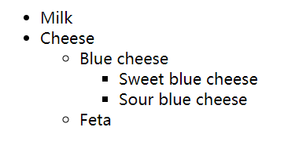

## 有序列表

使用 `ol` 标签来创建有序列表，使用 `li` 表示列表项。

常用属性：
- `start`：起始编号（整数）。
- `reversed`：是否倒序（无值布尔属性）。
- `type`：编号样式（1, a, A, i, I）。

```html
<ol>
    <li>Mix flour, baking powder, sugar, and salt.</li>
    <li>In another bowl, mix eggs, milk, and oil.</li>
    <li>Stir both mixtures together.</li>
    <li>Fill muffin tray 3/4 full.</li>
    <li>Bake for 20 minutes.</li>
</ol>
```


```html
<ol start="3" type="A">
    <li>准备干料</li>
    <li>混合湿料</li>
    <li>合并搅拌</li>
    <li>装盘至 3/4 满</li>
    <li>烘烤 20 分钟</li>
</ol>
```

## 无序列表

使用 `ul` 标签来创建无序列表，使用 `li` 表示列表项。

| 值     | 描述             |
| :----- | :--------------- |
| disc   | 默认值。实心圆。 |
| circle | 空心圆。         |
| square | 实心方块。       |

```html
<ul>
    <li>Milk</li>
    <li>Cheese
        <ul>
            <li>Blue cheese
                <ul>
                    <li>Sweet blue cheese</li>
                    <li>Sour blue cheese</li>
                </ul>
            </li>
            <li>Feta</li>
        </ul>
    </li>
</ul>
```



## 定义列表

使用 `dl` 标签来创建定义列表，使用 `dt` 表示定义的内容，使用 `dd` 来对内容进行解释说明 

```html
<dl>
    <dt>Beast of Bodmin</dt>
    <dd>A large feline inhabiting Bodmin Moor.</dd>

    <dt>Morgawr</dt>
    <dd>A sea serpent.</dd>

    <dt>Owlman</dt>
    <dd>A giant owl-like creature.</dd>
</dl>
```


