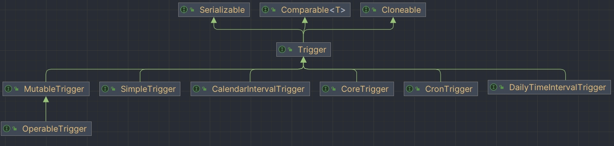

## Trigger

### 方法

1. 优先级（priority）

如果你的 trigger 很多（或者 Quartz 线程池的工作线程太少），Quartz 可能没有足够的资源同时触发所有的 trigger；这种情况下，你可能希望控制哪些 trigger 优先使用 Quartz 的工作线程，要达到该目的，可以在 trigger 上设置 priority 属性。

比如，你有 N 个 trigger 需要同时触发，但只有 Z 个工作线程，优先级最高的 Z 个 trigger 会被首先触发

2. 错过触发（misfire instructions）

如果 scheduler 关闭了，或者 Quartz 线程池中没有可用的线程来执行 job，此时持久性的 trigger 就会错过(miss)其触发时间，即错过触发(misfire)。当下次调度器启动或者有可以线程时，会检查处于 misfire 状态的 Trigger。而 misfire 的状态值决定了调度器如何处理这个 Trigger。

不同类型的 trigger，有不同的 misfire 机制。它们默认都使用“智能机制（smart policy）”，即根据 trigger 的类型和配置动态调整行为

### 分类



## SimpleTrigger
为需要在特定的日期/时间启动，且以一个可能的间隔时间重复执行 n 次的 job 所设计的

1. startNow()：Scheduler 开始执行时，触发器也即执行
2. startAt()：在指定的时间开始执行
3. endAt()：结束时间

执行间隔：

1. withInterval(TimeSpan timeSpan)：通用的间隔执行方法
2. withIntervalInHours(int hours)：以小时为间隔单位进行执行
3. withIntervalInMinutes(int minutes)：以分钟为间隔单位进行执行
4. withIntervalInSeconds(int seconds)：以秒为间隔单位进行执行

执行时间：

1. withRepeatCount(int repeatCount)：执行多少次以后结束
2. repeatForever()：永远执行
3. repeatMinutelyForever()：一分钟执行一次(永远执行)
4. repeatMinutelyForever(int minutes)：每隔几分钟执行一次(永远执行)
5. repeatMinutelyForTotalCount(int count, int minutes)：每隔几分钟执行一次(执行次数为 count)类似的还有秒、小时。

```java
public class Trigger1 {

    public static void main(String[] args) throws SchedulerException {
        //创建一个 JobDetail 的实例，将该实例与 HelloJob 绑定
        JobDetail jobDetail = JobBuilder.newJob(HelloJob.class)
                .withIdentity("testJob")
                .build();
        //开始时间 3 秒钟之后 （具体时间按实际业务编写）
        Date sData = new Date();
        sData.setTime(sData.getTime() + 3000);
        //结束时间 20 秒钟之后 （具体时间按实际业务编写）
        Date eData = new Date();
        eData.setTime(eData.getTime() + 20000);
        //创建一个 Trigger 实例，定义该 job3 秒之后执行，在 6 秒之后结束
        SimpleTrigger zhlTrigger = TriggerBuilder.newTrigger()
                    .withIdentity("test")
                    .startAt(sData) //设定开始时间
                    .endAt(eData)   //设定结束时间
                    .withSchedule(SimpleScheduleBuilder.simpleSchedule()
                            .withIntervalInSeconds(2) //每两秒打印一次
                            .withRepeatCount(2)) // 重复 2 次
                    .build();
        //创建 Scheduler 实例
        StdSchedulerFactory stdSchedulerFactory = new StdSchedulerFactory();
        Scheduler scheduler = stdSchedulerFactory.getScheduler();
        scheduler.start();
        scheduler.scheduleJob(jobDetail, zhlTrigger);
    }
}
```

```java
public class HelloJob implements Job{
    public void execute(JobExecutionContext jobExecutionContext) throws JobExecutionException {
        //打印当前的执行时间 例如 2017-11-22 00:00:00
        Date date = new Date();
        SimpleDateFormat sf = new SimpleDateFormat("yyyy-MM-dd HH:mm:ss");
        System.out.println("现在的时间是："+ sf.format(date));
        //具体的业务逻辑
        System.out.println("具体执行的业务...");
        JobKey key = jobExecutionContext.getJobDetail().getKey();
        Trigger trigger = jobExecutionContext.getTrigger();
        System.out.println("开始的时间："+sf.format(trigger.getStartTime()));
        System.out.println("结束的事件："+sf.format(trigger.getEndTime()));
    }
}
```

## CronTrigger

指定对应的 cron 表达式执行任务

```java
public class Trigger2 {

    public static void main(String[] args) throws SchedulerException {
        //创建一个 JobDetail 的实例，将该实例与 HelloJob 绑定
        JobDetail jobDetail = JobBuilder.newJob(HelloJob.class)
                .withIdentity("test")
                .build();
        //开始时间 3 秒钟之后 （具体时间按实际业务编写）
        Date sData = new Date();
        sData.setTime(sData.getTime() + 3000);
        //结束时间 20 秒钟之后 （具体时间按实际业务编写）
        Date eData = new Date();
        eData.setTime(eData.getTime() + 20000);
        //创建一个 Trigger 实例，定义该 job3 秒之后执行，在 6 秒之后结束
        CronTrigger trigger = TriggerBuilder.newTrigger()
                .withIdentity("testTrigger")
                .startAt(sData) //设定开始时间
                .endAt(eData)   //设定结束时间
                .withSchedule(CronScheduleBuilder.cronSchedule("0/3 * * * * ?"))
                .build();
        //创建 Scheduler 实例
        StdSchedulerFactory stdSchedulerFactory = new StdSchedulerFactory();
        Scheduler scheduler = stdSchedulerFactory.getScheduler();
        scheduler.start();
        scheduler.scheduleJob(jobDetail, trigger);
    }
}
```

## CalendarIntervalTrigger
用来触发基于定时重复的 JobDetail，Trigger 将会每隔 N 个 Calendar 在 Trigger 中定义的时间单元触发一次，这个 Trigger 不适合使用 SimpleTrigger 完成（例如由于每一个月的时间不是固定的描述），也不适用于 CronTrigger（例如每 5 个月）

相较于 SimpleTrigger 有两个优势：

1. 更方便，比如：每隔 1 小时执行，你不用自己去计算 1 小时等于多少毫秒。 
2. 支持不是固定长度的间隔，比如：间隔为月和年。但劣势是精度只能到秒。

参数：

1. interval：执行间隔
2. intervalUnit：执行间隔的单位（秒、分钟、小时、天、月、年、星期）

```java
public class Trigger4 {

    public static void main(String[] args) throws SchedulerException {
        //创建一个 JobDetail 的实例，将该实例与 HelloJob 绑定
        JobDetail jobDetail = JobBuilder.newJob(HelloJob.class)
                .withIdentity("test")
                .build();
        //开始时间 3 秒钟之后 （具体时间按实际业务编写）
        Date sData = new Date();
        sData.setTime(sData.getTime() + 3000);
        //结束时间 20 秒钟之后 （具体时间按实际业务编写）
        Date eData = new Date();
        eData.setTime(eData.getTime() + 20000);
        //创建一个 Trigger 实例，定义该 job3 秒之后执行，在 20 秒之后结束
        CalendarIntervalTrigger intervalTrigger = TriggerBuilder.newTrigger()
                .withIdentity("testTrigger")
                .startAt(sData) //设定开始时间
                .endAt(eData)   //设定结束时间
                .withSchedule(CalendarIntervalScheduleBuilder.calendarIntervalSchedule()
                        .withIntervalInSeconds(5))	// 每隔 5 秒执行一次
                .build();
        //创建 Scheduler 实例
        StdSchedulerFactory stdSchedulerFactory = new StdSchedulerFactory();
        Scheduler scheduler = stdSchedulerFactory.getScheduler();
        scheduler.start();
        scheduler.scheduleJob(jobDetail, intervalTrigger);
    }
}
```

## DailyTimeIntervalTrigger
指定每天的某个时间段内，以一定的时间间隔执行任务，并且可以支持星期的设置

适合的任务类似于：指定每天 9：00 至 18：00，每隔 10 秒执行一次，并且只要周一至周五执行

参数：

1. onEveryDay：每天
2. onMondayThroughFriday：周一至周五，即工作日
3. onSaturdayAndSunday：周六至周天，即休息日 e
4. onDaysOfTheWeek：用数组的形式单独来指定一周中的哪几天
5. startingDailyAt：表示开始于几点 （区别于前面的 StartAt）
6. endingDailyAt：表示结束于几点 （区别于前面的 EndAt）

```java
public class Trigger3 {

    public static void main(String[] args) throws SchedulerException {
        //创建一个 JobDetail 的实例，将该实例与 HelloJob 绑定
        JobDetail jobDetail = JobBuilder.newJob(HelloJob.class)
                .withIdentity("test")
                .build();
        //开始时间 3 秒钟之后 （具体时间按实际业务编写）
        Date sData = new Date();
        sData.setTime(sData.getTime() + 3000);
        //结束时间 20 秒钟之后 （具体时间按实际业务编写）
        Date eData = new Date();
        eData.setTime(eData.getTime() + 20000);
        //创建一个 Trigger 实例，定义该 job3 秒之后执行，在 20 秒之后结束
        DailyTimeIntervalTrigger trigger = TriggerBuilder.newTrigger()
                .withIdentity("testTrigger")
                .startAt(sData) //设定开始时间
                .endAt(eData)   //设定结束时间
                .withSchedule(DailyTimeIntervalScheduleBuilder.dailyTimeIntervalSchedule()
                        .withIntervalInSeconds(3)
                        .onEveryDay()) //每天每隔 3 秒执行一次
                .build();
        //创建 Scheduler 实例
        StdSchedulerFactory stdSchedulerFactory = new StdSchedulerFactory();
        Scheduler scheduler = stdSchedulerFactory.getScheduler();
        scheduler.start();
        scheduler.scheduleJob(jobDetail, trigger);
    }
}
```

## MutableTrigger

Trigger 只是定义了相关属性的 Get 方法，并没有 Set 方法，而 MutableTrigger 接口则定义了相关属性的 set 方法，如：setKey 方法。

## OperableTrigger

OperableTrigger 接口从字面上来说时可操作的 Trigger，也就是 Trigger 被 QuartzSchedulerThread 获取到之后，在不同情况下需要进行操作的接口。

1. computeFirstFireTime：计算第一次触发时间。
2. triggered：trigger 被触发时调用的方法。
3. updateAfterMisfire：对应触发器失火后调用的方法。
4. executionComplete：触发器本次触发完成时被调用的方法。
