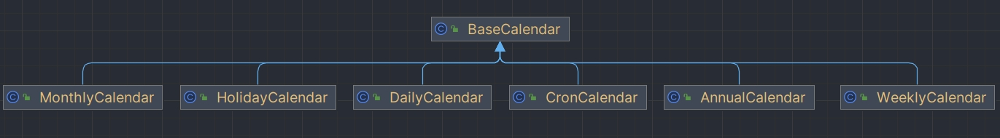

## BaseCalendar

专门用于屏蔽一个时间区间，使 Trigger 在这个区间中不被触发



### AnnualCalendar

排除每一年中指定的一天或多少天，精度是天

### CronCalendar

使用表达式排除某些时间段不执行，精度取决于 Cron 表达式，最大精度到秒

### DailyCalendar

指定的时间范围内的每一天不执行，指定每天的时间段，格式是 HH: MM [: SS[mmm]]，即最大精度可以到毫秒

### HolidayCalendar

排除节假日，精度到天

### MonthlyCalendar

排除月份中的数天，可选值为 1-31，精度是天

### WeeklyCalendar

排除星期中的一天或多天，可选值比如为：java.util.Calendar.SUNDAY，精度是天

### 基本使用

```java
public class CalendarSchedule {
    public static void main(String[] args) throws SchedulerException {
        //创建一个 JobDetail 的实例，将该实例与 HelloJob 绑定
        JobDetail jobDetail = JobBuilder.newJob(HelloJob.class)
                                .withIdentity("test")
                                .build();
        AnnualCalendar holidays = new AnnualCalendar();
        // 排除今天的时间 2017 年 11 月 27 日（月份是从 0～11 的）
        GregorianCalendar nationalDay = new GregorianCalendar(2017, 10, 27);  
        // 排除的日期，如果为 false 则为包含
        holidays.setDayExcluded(nationalDay,true); 

        Trigger simpleTrigger = TriggerBuilder.newTrigger()
                .withIdentity("testTrigger")
                .withSchedule(SimpleScheduleBuilder.simpleSchedule()
                              .withIntervalInSeconds(1)
                              .repeatForever()) //每一秒执行一次 job
                .modifiedByCalendar("holidays")   //将我们设置好的 Calander 与 trigger 绑定
                .build();
        
        //创建 Scheduler 实例
        StdSchedulerFactory stdSchedulerFactory = new StdSchedulerFactory();
        Scheduler scheduler = stdSchedulerFactory.getScheduler();
        //向 Scheduler 注册日历
        scheduler.addCalendar("holidays",holidays,false,false);
        //让 trigger 应用指定的日历规则
        scheduler.scheduleJob(jobDetail,simpleTrigger);
        scheduler.start();
    }
}
```

## 定时任务增删改查

**参考 Scheduler 源码中的方法**

通过配置文件定义每个任务的属性，项目启动后将每个任务加载到内存中，将其中一个任务用来监听配置文件的修改，当其修改后动态刷新任务

```yaml
#定时任务
quartz:
  jobs:
    - name: myName #（随便取任务名）
      group: collect
      cron: 0 0/5 * * * ? *
      jobClass: com.gamer.me.quartz.jobs.MyJob #（自己的定时任务的执行类，也就是你写业务代码的类）
      desc: 我的任务
```

```java
@Data
public class SchedulerJob {

    private String name;
    private String group;
    private String cron;
    private String jobClass;
    private String desc;
}
```

```java
@Data
@Component
@ConfigurationProperties(prefix = "quartz")
public class SchedulerJobs {

    private List<SchedulerJob> jobs;
}
```

```java
@Slf4j
@Component
public class SchedulerManager {

    @Autowired
    private Scheduler scheduler;

    /**
     * 激活任务
     * @param schedulerJob
     */
    public void activeJob(SchedulerJob schedulerJob){
        JobKey jobKey = JobKey.jobKey(schedulerJob.getName(), schedulerJob.getGroup());
        try {
            if (scheduler.checkExists(jobKey) && !MonitorCronJob.JOB_NAME.equals(schedulerJob.getName())) {
                updateJob(schedulerJob);
            }else {
                createJob(schedulerJob);
            }
        } catch (SchedulerException e) {
            logger.error("activeJob {}", e);
        }
    }

    /**
     * 创建任务并加入调度
     * @param schedulerJob
     */
    public void createJob(SchedulerJob schedulerJob){
        JobKey jobKey = JobKey.jobKey(schedulerJob.getName(), schedulerJob.getGroup());
        try {
            if (scheduler.checkExists(jobKey)) {
                return;
            }
            Class<?> clazz = Class.forName(schedulerJob.getJobClass());
            JobDetail jobDetail = getJobDetail(schedulerJob, (Class<Job>) clazz);
            Trigger cronTrigger = getCronTrigger(schedulerJob);
            //加入调度器
            scheduler.scheduleJob(jobDetail, cronTrigger);
        } catch (ClassNotFoundException | SchedulerException e) {
            logger.error("createJob {}", e);
        }
    }

    /**
     * 更新任务触发器
     * @param schedulerJob
     */
    public void updateJob(SchedulerJob schedulerJob){
        TriggerKey triggerKey = TriggerKey.triggerKey(schedulerJob.getName(), schedulerJob.getGroup());
        try {
            Trigger trigger = scheduler.getTrigger(triggerKey);
            if (trigger == null) {
                return;
            }
            JobKey jobKey = trigger.getJobKey();
            //查询 cron
            String oldCron = ((CronTrigger)trigger).getCronExpression();
            //没有变化则返回
            if (oldCron.equals(schedulerJob.getCron())){
                return;
            }
            Trigger cronTrigger = getCronTrigger(schedulerJob);
            //加入调度器
            scheduler.rescheduleJob(triggerKey, cronTrigger);
        } catch (SchedulerException e) {
            logger.error("updateJob {}", e);
        }
    }

    /**
     * 删除任务
     */
    public void deleteJobs(List<JobKey> jobKeys) {
        try {
            scheduler.deleteJobs(jobKeys);
        } catch (SchedulerException e) {
            logger.error("deleteJobs {}", e);
        }
    }

    /**
     * 创建任务
     * @param schedulerJob
     * @param clazz
     * @return
     */
    private JobDetail getJobDetail(SchedulerJob schedulerJob, Class<Job> clazz) {
        return JobBuilder.newJob()
                .ofType(clazz)
                .withIdentity(schedulerJob.getName(), schedulerJob.getGroup())
                .withDescription(schedulerJob.getDesc())
                .build();
    }

    /**
     * 创建触发器
     * @param schedulerJob
     * @return
     */
    private Trigger getCronTrigger(SchedulerJob schedulerJob) {
        CronScheduleBuilder cronScheduleBuilder = CronScheduleBuilder.cronSchedule(schedulerJob.getCron());
        if (!MonitorCronJob.JOB_NAME.equals(schedulerJob.getName())){
            //任务错过执行策略，以错过的第一个频率时间立刻开始执行，重做错过的所有频率周期后，当下一次触发频率发生时间大于当前时间后，再按照正常的 Cron 频率依次执行
            cronScheduleBuilder.withMisfireHandlingInstructionIgnoreMisfires();
        }
        return TriggerBuilder.newTrigger()
                .withIdentity(schedulerJob.getName(), schedulerJob.getGroup())
                .withDescription(schedulerJob.getDesc())
                .withSchedule(cronScheduleBuilder)
                .build();
    }
}
```

监控其他定时任务的总任务 MonitorCronJob（用于监控 cron 的更新）

```java
@Slf4j
public class MonitorCronJob implements Job {

    public static final String JOB_NAME = "monitor_cron";
    public static final String GROUP_NAME = "monitor";
    public static final String CRON = "0 0/10 * * * ?";
    public static final String DESC = "监控cron更新";

    @Autowired
    private SchedulerManager schedulerManager;
    @Autowired
    private SchedulerJobs schedulerJobs;
    @Autowired
    private ContextRefresher contextRefresher;

    @Override
    public void execute(JobExecutionContext jobExecutionContext) throws JobExecutionException {
        //重新加载配置
        contextRefresher.refresh();
        Set<JobKey> oldJobKeys = null;
        try {
            oldJobKeys = jobExecutionContext.getScheduler().getJobKeys(GroupMatcher.anyJobGroup());
        } catch (SchedulerException e) {
            logger.error("MonitorCronJob {}", e);
        }

        List<String> newJobKeys = new ArrayList<>();
        for (SchedulerJob job : schedulerJobs.getJobs()) {
            //过滤掉 monitor_cron 任务
            if (job.getName().equals(JOB_NAME)) {
                continue;
            }
            newJobKeys.add(job.getName());
            logger.info("job【{}】,cron【{}】", job.getName(), job.getCron());
            schedulerManager.activeJob(job);
        }
        if (oldJobKeys == null) {
            return;
        }
        //删除没有配置的任务
        List<JobKey> shouldDeleteJobKeys = oldJobKeys.stream()
                .filter(jobKey -> !JOB_NAME.equals(jobKey.getName()) && !newJobKeys.contains(jobKey.getName()))
                .collect(Collectors.toList());
        logger.info("delete jobs {}", shouldDeleteJobKeys);
        schedulerManager.deleteJobs(shouldDeleteJobKeys);
    }
}
```

```java
@Component
public class Initialization implements ApplicationRunner {

    @Autowired
    private SchedulerManager schedulerManager;

    @Override
    public void run(ApplicationArguments args) throws Exception {
        SchedulerJob schedulerJob = new SchedulerJob();
        schedulerJob.setName(MonitorCronJob.JOB_NAME);
        schedulerJob.setGroup(MonitorCronJob.GROUP_NAME);
        schedulerJob.setCron(MonitorCronJob.CRON);
        schedulerJob.setDesc(MonitorCronJob.DESC);
        schedulerJob.setJobClass(MonitorCronJob.class.getName());
        schedulerManager.activeJob(schedulerJob);
    }
}
```

## SchedulerRepository 详解

```java
/**
 * 保持对调度器实例的引用-确保唯一性，以及防止垃圾收集，并允许“全球”查找-所有在一个类加载器空间。
 * 调度程序库，采用单例模式存储任务调度 Schedule
 */
public class SchedulerRepository {

    private HashMap<String, Scheduler> schedulers;

    private static SchedulerRepository inst;

    private SchedulerRepository() {
        schedulers = new HashMap<String, Scheduler>();
    }

    public static synchronized SchedulerRepository getInstance() {
        if (inst == null) {
            inst = new SchedulerRepository();
        }
        return inst;
    }

    /**
     * 绑定新的任务调度器
     */
    public synchronized void bind(Scheduler sched) throws SchedulerException {
        if ((Scheduler) schedulers.get(sched.getSchedulerName()) != null) {
            throw new SchedulerException("Scheduler with name '"
                    + sched.getSchedulerName() + "' already exists.");
        }
        schedulers.put(sched.getSchedulerName(), sched);
    }

    /**
     * 移除新的任务调度器
     */
    public synchronized boolean remove(String schedName) {
        return (schedulers.remove(schedName) != null);
    }

    /**
     * 查询新的任务调度器
     */
    public synchronized Scheduler lookup(String schedName) {
        return schedulers.get(schedName);
    }

    /**
     * 查询所有任务调度器
     */
    public synchronized Collection<Scheduler> lookupAll() {
        return java.util.Collections.unmodifiableCollection(schedulers.values());
    }
}
```

## StdSchedulerFactory 详解

SchedulerFacotory 是一个接口，它有两个实现：

1. StdSchedulerFacotory 通过配置文件来设置 Scheduler 的各项参数
2. DirectSchedulerFactory 主要通过硬编码来设置 Scheduler 的各项参数

### 构造方法

```java
public StdSchedulerFactory() {
}

public StdSchedulerFactory(Properties props) throws SchedulerException {
    initialize(props);
}

public StdSchedulerFactory(String fileName) throws SchedulerException {
    initialize(fileName);
}
```

### getScheduler()

```java
/**
 * 加载 quartz.properties，初始化 StdScheduler
 */
public Scheduler getScheduler() throws SchedulerException {
	// 加载 quartz.properties
    if (cfg == null) {
        initialize();
    }
    // 单例的 SchedulerRepository 实例
    SchedulerRepository schedRep = SchedulerRepository.getInstance();
    // 从缓存中查询获取 Schedule 任务，任务名称从配置中获取，若无指定，则默认指定 QuartzScheduler
    Scheduler sched = schedRep.lookup(getSchedulerName());
	// 判断若存在且已停止运行，则从缓存中移除
    if (sched != null) {
        if (sched.isShutdown()) {
            schedRep.remove(getSchedulerName());
        } else {
            return sched;
        }
    }
    // 初始化 StdScheduler
    sched = instantiate();
    return sched;
}
```

getScheduler()会推迟实例化，当调用其方法时才会去初始化 Quartz 的配置

### initialize()

```java
/**
 * 根据配置文件初始化
 */
public void initialize() throws SchedulerException {
    // 如果已经存在，直接返回
    if (cfg != null) {
        return;
    }
    if (initException != null) {
        throw initException;
    }
    // 从环境变量 PROPERTIES_FILE = org.quartz.properties 是否存在指定读取的配置文件
    String requestedFile = System.getProperty(PROPERTIES_FILE);
    // 不主动设置，默认设置为 quartz.properties
    String propFileName = requestedFile != null ? requestedFile: "quartz.properties";
    File propFile = new File(propFileName);

    Properties props = new Properties();
    InputStream in = null;
    // 读取配置文件内容，如果都不存在依次读取 quartz.properties、/quartz.properties、org/quartz/quartz.properties
    try {
        if (propFile.exists()) {
            try {
                if (requestedFile != null) {
                    propSrc = "specified file: '" + requestedFile + "'";
                } else {
                    propSrc = "default file in current working dir: 'quartz.properties'";
                }

                in = new BufferedInputStream(new FileInputStream(propFileName));
                props.load(in);
            } catch (IOException ioe) {
                initException = new SchedulerException("Properties file: '"
                        + propFileName + "' could not be read.", ioe);
                throw initException;
            }
        } else if (requestedFile != null) {
            in = Thread.currentThread().getContextClassLoader().getResourceAsStream(requestedFile);
            if(in == null) {
                initException = new SchedulerException("Properties file: '"
                    + requestedFile + "' could not be found.");
                throw initException;
            }

            propSrc = "specified file: '" + requestedFile + "' in the class resource path.";
            in = new BufferedInputStream(in);
            try {
                props.load(in);
            } catch (IOException ioe) {
                initException = new SchedulerException("Properties file: '"
                        + requestedFile + "' could not be read.", ioe);
                throw initException;
            }
        } else {
            propSrc = "default resource file in Quartz package: 'quartz.properties'";

            ClassLoader cl = getClass().getClassLoader();
            if(cl == null)
                cl = findClassloader();
            if(cl == null)
                throw new SchedulerConfigException("Unable to find a class loader on the current thread or class.");

            in = cl.getResourceAsStream("quartz.properties");
            if (in == null) {
                in = cl.getResourceAsStream("/quartz.properties");
            }
            if (in == null) {
                in = cl.getResourceAsStream("org/quartz/quartz.properties");
            }
            if (in == null) {
                initException = new SchedulerException(
                        "Default quartz.properties not found in class path");
                throw initException;
            }
            try {
                props.load(in);
            } catch (IOException ioe) {
                initException = new SchedulerException(
                        "Resource properties file: 'org/quartz/quartz.properties' "
                                + "could not be read from the classpath.", ioe);
                throw initException;
            }
        }
    } finally {
        if(in != null) {
            try { in.close(); } catch(IOException ignore) { /* ignore */ }
        }
    }
    //赋值
    initialize(overrideWithSysProps(props));
}

/**
 * 添加系统配置，如果跟之前的配置相同则覆盖，以系统配置为主
 */
private Properties overrideWithSysProps(Properties props) {
    Properties sysProps = null;
    try {
        sysProps = System.getProperties();
    } catch (AccessControlException e) {
        getLog().warn(
            "Skipping overriding quartz properties with System properties " +
            "during initialization because of an AccessControlException.  " +
            "This is likely due to not having read/write access for " +
            "java.util.PropertyPermission as required by java.lang.System.getProperties().  " +
            "To resolve this warning, either add this permission to your policy file or " +
            "use a non-default version of initialize().",
            e);
    }
    if (sysProps != null) {
        props.putAll(sysProps);
    }
    return props;
}

public void initialize(Properties props) throws SchedulerException {
    if (propSrc == null) {
        propSrc = "an externally provided properties instance.";
    }
    this.cfg = new PropertiesParser(props);
}
```

通过查看源码可知，quartz 的配置文件加载流程如下：

1. 查看是否有系统变量指定了配置文件路径
2. 在当前项目下面查找名为 quartz.properties 的文件
3. 通过类加载器加载当前 classpath 路径下的 quartz.properties、/quartz.properties、org/quartz/quartz.properties 的资源文件

这里需要注意的是，一旦自己指定了 quartz.properties 文件，那么 quartz 默认提供的配置将不会被加载，因此也就不会生效

**Quartz 默认配置文件**

```properties
#实例名称
org.quartz.scheduler.instanceName: DefaultQuartzScheduler
#远程方法调用
org.quartz.scheduler.rmi.export: false
org.quartz.scheduler.rmi.proxy: false
#是否将任务放在事务中执行
org.quartz.scheduler.wrapJobExecutionInUserTransaction: false

#线程池
org.quartz.threadPool.class: org.quartz.simpl.SimpleThreadPool
#线程个数
org.quartz.threadPool.threadCount: 10
#线程优先级
org.quartz.threadPool.threadPriority: 5
org.quartz.threadPool.threadsInheritContextClassLoaderOfInitializingThread: true

#失火的阈值
org.quartz.jobStore.misfireThreshold: 60000
#使用内存方式存储
org.quartz.jobStore.class: org.quartz.simpl.RAMJobStore
```

### instantiate()

```java
public class StdSchedulerFactory implements SchedulerFactory {

    public static final String PROPERTIES_FILE = "org.quartz.properties";

    public static final String PROP_SCHED_INSTANCE_NAME = "org.quartz.scheduler.instanceName";

    public static final String PROP_SCHED_INSTANCE_ID = "org.quartz.scheduler.instanceId";

    public static final String PROP_SCHED_INSTANCE_ID_GENERATOR_PREFIX = "org.quartz.scheduler.instanceIdGenerator";

    public static final String PROP_SCHED_INSTANCE_ID_GENERATOR_CLASS =
        PROP_SCHED_INSTANCE_ID_GENERATOR_PREFIX + ".class";

    public static final String PROP_SCHED_THREAD_NAME = "org.quartz.scheduler.threadName";

    public static final String PROP_SCHED_BATCH_TIME_WINDOW = "org.quartz.scheduler.batchTriggerAcquisitionFireAheadTimeWindow";

    public static final String PROP_SCHED_MAX_BATCH_SIZE = "org.quartz.scheduler.batchTriggerAcquisitionMaxCount";

    public static final String PROP_SCHED_JMX_EXPORT = "org.quartz.scheduler.jmx.export";

    public static final String PROP_SCHED_JMX_OBJECT_NAME = "org.quartz.scheduler.jmx.objectName";

    public static final String PROP_SCHED_JMX_PROXY = "org.quartz.scheduler.jmx.proxy";

    public static final String PROP_SCHED_JMX_PROXY_CLASS = "org.quartz.scheduler.jmx.proxy.class";
    
    public static final String PROP_SCHED_RMI_EXPORT = "org.quartz.scheduler.rmi.export";

    public static final String PROP_SCHED_RMI_PROXY = "org.quartz.scheduler.rmi.proxy";

    public static final String PROP_SCHED_RMI_HOST = "org.quartz.scheduler.rmi.registryHost";

    public static final String PROP_SCHED_RMI_PORT = "org.quartz.scheduler.rmi.registryPort";

    public static final String PROP_SCHED_RMI_SERVER_PORT = "org.quartz.scheduler.rmi.serverPort";

    public static final String PROP_SCHED_RMI_CREATE_REGISTRY = "org.quartz.scheduler.rmi.createRegistry";

    public static final String PROP_SCHED_RMI_BIND_NAME = "org.quartz.scheduler.rmi.bindName";

    public static final String PROP_SCHED_WRAP_JOB_IN_USER_TX = "org.quartz.scheduler.wrapJobExecutionInUserTransaction";

    public static final String PROP_SCHED_USER_TX_URL = "org.quartz.scheduler.userTransactionURL";

    public static final String PROP_SCHED_IDLE_WAIT_TIME = "org.quartz.scheduler.idleWaitTime";

    public static final String PROP_SCHED_DB_FAILURE_RETRY_INTERVAL = "org.quartz.scheduler.dbFailureRetryInterval";

    public static final String PROP_SCHED_MAKE_SCHEDULER_THREAD_DAEMON = "org.quartz.scheduler.makeSchedulerThreadDaemon";

    public static final String PROP_SCHED_SCHEDULER_THREADS_INHERIT_CONTEXT_CLASS_LOADER_OF_INITIALIZING_THREAD = "org.quartz.scheduler.threadsInheritContextClassLoaderOfInitializer";

    public static final String PROP_SCHED_CLASS_LOAD_HELPER_CLASS = "org.quartz.scheduler.classLoadHelper.class";

    public static final String PROP_SCHED_JOB_FACTORY_CLASS = "org.quartz.scheduler.jobFactory.class";

    public static final String PROP_SCHED_JOB_FACTORY_PREFIX = "org.quartz.scheduler.jobFactory";

    public static final String PROP_SCHED_INTERRUPT_JOBS_ON_SHUTDOWN = "org.quartz.scheduler.interruptJobsOnShutdown";

    public static final String PROP_SCHED_INTERRUPT_JOBS_ON_SHUTDOWN_WITH_WAIT = "org.quartz.scheduler.interruptJobsOnShutdownWithWait";

    public static final String PROP_SCHED_CONTEXT_PREFIX = "org.quartz.context.key";

    public static final String PROP_THREAD_POOL_PREFIX = "org.quartz.threadPool";

    public static final String PROP_THREAD_POOL_CLASS = "org.quartz.threadPool.class";

    public static final String PROP_JOB_STORE_PREFIX = "org.quartz.jobStore";

    public static final String PROP_JOB_STORE_LOCK_HANDLER_PREFIX = PROP_JOB_STORE_PREFIX + ".lockHandler";

    public static final String PROP_JOB_STORE_LOCK_HANDLER_CLASS = PROP_JOB_STORE_LOCK_HANDLER_PREFIX + ".class";

    public static final String PROP_TABLE_PREFIX = "tablePrefix";

    public static final String PROP_SCHED_NAME = "schedName";

    public static final String PROP_JOB_STORE_CLASS = "org.quartz.jobStore.class";

    public static final String PROP_JOB_STORE_USE_PROP = "org.quartz.jobStore.useProperties";

    public static final String PROP_DATASOURCE_PREFIX = "org.quartz.dataSource";

    public static final String PROP_CONNECTION_PROVIDER_CLASS = "connectionProvider.class";

    /**
     * @deprecated Replaced with {@link PoolingConnectionProvider#DB_DRIVER}
     */
    @Deprecated
    public static final String PROP_DATASOURCE_DRIVER = "driver";

    /**
     * @deprecated Replaced with {@link PoolingConnectionProvider#DB_URL}
     */
    @Deprecated
    public static final String PROP_DATASOURCE_URL = "URL";

    /**
     * @deprecated Replaced with {@link PoolingConnectionProvider#DB_USER}
     */
    @Deprecated
    public static final String PROP_DATASOURCE_USER = "user";

    /**
     * @deprecated Replaced with {@link PoolingConnectionProvider#DB_PASSWORD}
     */
    @Deprecated
    public static final String PROP_DATASOURCE_PASSWORD = "password";

    /**
     * @deprecated Replaced with {@link PoolingConnectionProvider#DB_MAX_CONNECTIONS}
     */
    @Deprecated
    public static final String PROP_DATASOURCE_MAX_CONNECTIONS = "maxConnections";

    /**
     * @deprecated Replaced with {@link PoolingConnectionProvider#DB_VALIDATION_QUERY}
     */
    @Deprecated
    public static final String PROP_DATASOURCE_VALIDATION_QUERY = "validationQuery";

    public static final String PROP_DATASOURCE_JNDI_URL = "jndiURL";

    public static final String PROP_DATASOURCE_JNDI_ALWAYS_LOOKUP = "jndiAlwaysLookup";

    public static final String PROP_DATASOURCE_JNDI_INITIAL = "java.naming.factory.initial";

    public static final String PROP_DATASOURCE_JNDI_PROVDER = "java.naming.provider.url";

    public static final String PROP_DATASOURCE_JNDI_PRINCIPAL = "java.naming.security.principal";

    public static final String PROP_DATASOURCE_JNDI_CREDENTIALS = "java.naming.security.credentials";

    public static final String PROP_PLUGIN_PREFIX = "org.quartz.plugin";

    public static final String PROP_PLUGIN_CLASS = "class";

    public static final String PROP_JOB_LISTENER_PREFIX = "org.quartz.jobListener";

    public static final String PROP_TRIGGER_LISTENER_PREFIX = "org.quartz.triggerListener";

    public static final String PROP_LISTENER_CLASS = "class";

    public static final String DEFAULT_INSTANCE_ID = "NON_CLUSTERED";

    public static final String AUTO_GENERATE_INSTANCE_ID = "AUTO";

    public static final String PROP_THREAD_EXECUTOR = "org.quartz.threadExecutor";

    public static final String PROP_THREAD_EXECUTOR_CLASS = "org.quartz.threadExecutor.class";

    public static final String SYSTEM_PROPERTY_AS_INSTANCE_ID = "SYS_PROP";
    
    public static final String MANAGEMENT_REST_SERVICE_ENABLED = "org.quartz.managementRESTService.enabled";

    public static final String MANAGEMENT_REST_SERVICE_HOST_PORT = "org.quartz.managementRESTService.bind";
}
```

instantiate()方法主要就是根据之前加载好的配置文件来创建出 scheduler 需要用到的一些对象。

主要对象：

1. Job：业务逻辑类需要时间的接口
2. JobStore：主要用于存储 Job 和 Trigger
3. JobFactory：job 实例化工厂
4. ThreadPool：主要用于分配任务给具体的线程进行执行
5. QuartzSchedulerThread：管理者线程
6. WorkThread：工作者线程
7. DBConnectionManager：数据库连接管理器
8. ThreadExecutor：线程执行器
9. SchedulerPlugin：调度器插件
10. JobListener：任务监听器
11. Trigger：触发器
12. Schedule：时间表
13. TriggerListerne：触发器监听器
14. JobRunShellFactory：jobRunShell 的工厂
15. JobRunShell：实现了 Runnale 接口，会调用对应实例化的 job 的 execute 方法
