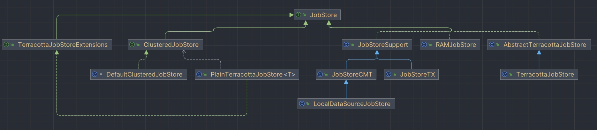

## JobStore

JobStore 是存放 Job 和 Trigger 的地方。当我们调用 Scheduler 对象的 scheduleJob 时就会将其存入 JobStore 中，然后供 quartzSchedulerThread 使用。

**为什么需要 JobStore？**

因为我们需要被 Scheduler 调用的任务大多数并不是一次性的任务，而是需要被定时触发，或者某个时间点才能被触发的，因此我们需要一个容器来存储 Job 和 Trigger 的相关内容。

其次，quartz 框架还有考虑到持久化存储的场景，比如说将对应的数据存放到数据库，这时候存放或者读取数据库里面的数据都需要有一个与之对应的容器。

### 方法

```java
public interface JobStore {
   
   //存储job和tigger
   void storeJobAndTrigger(JobDetail newJob, OperableTrigger newTrigger) 
        throws ObjectAlreadyExistsException, JobPersistenceException;
		
   //获取下一次需要进行触发的触发器
   List<OperableTrigger> acquireNextTriggers(long noLaterThan, int maxCount, long timeWindow)
        throws JobPersistenceException;
	
   //释放获取到的触发器
   void releaseAcquiredTrigger(OperableTrigger trigger);
   
   //触发器被触发
   List<TriggerFiredResult> triggersFired(List<OperableTrigger> triggers) throws JobPersistenceException;
   
   //触发器触发完成
   void triggeredJobComplete(OperableTrigger trigger, JobDetail jobDetail, CompletedExecutionInstruction triggerInstCode);
    
    .....
}
```

### 分类



### 基本配置

```properties
# Scheduler 实例名
org.quartz.scheduler.instanceName = MyScheduler
org.quartz.scheduler.instanceId = AUTO

# 集群配置
org.quartz.jobStore.isClustered = true
org.quartz.jobStore.clusterCheckinInterval = 20000
# 使用的 JobStore 类型
org.quartz.jobStore.class = org.quartz.impl.jdbcjobstore.JobStoreTX

# 数据源配置
org.quartz.jobStore.dataSource = quartzDataSource
org.quartz.jobStore.tablePrefix = QRTZ_
# 数据源详细信息
org.quartz.dataSource.quartzDataSource.driver = com.mysql.cj.jdbc.Driver
org.quartz.dataSource.quartzDataSource.URL = jdbc:mysql://localhost:3306/quartz
org.quartz.dataSource.quartzDataSource.user = root
org.quartz.dataSource.quartzDataSource.password = password
org.quartz.dataSource.quartzDataSource.maxConnections = 10
```

## RAMJobStore

在 quartz 的默认配置中使用的就是 RAMJobStore。顾名思义，RAMJobStore 是基于内存来存储的 Job 相关数据，也就是在程序重启之后，对应的数据就会消失，并且它不支持集群，也就是说它不可以把需要调度的任务分配到多台机器上面进行执行。

### 优缺点

1. 优点：使用内存存储调度数据，速度快，配置简单，适合轻量级或短生命周期的应用场景。
2. 缺点：数据仅存储在内存中，系统重启后数据会丢失，不支持多节点集群。

### 属性

```java
public class RAMJobStore implements JobStore {

    protected HashMap<JobKey, JobWrapper> jobsByKey = new HashMap<JobKey, JobWrapper>(1000);

    protected HashMap<TriggerKey, TriggerWrapper> triggersByKey = new HashMap<TriggerKey, TriggerWrapper>(1000);

    protected HashMap<String, HashMap<JobKey, JobWrapper>> jobsByGroup = new HashMap<String, HashMap<JobKey, JobWrapper>>(25);

    protected HashMap<String, HashMap<TriggerKey, TriggerWrapper>> triggersByGroup = new HashMap<String, HashMap<TriggerKey, TriggerWrapper>>(25);

    protected TreeSet<TriggerWrapper> timeTriggers = new TreeSet<TriggerWrapper>(new TriggerWrapperComparator());

    protected HashMap<String, Calendar> calendarsByName = new HashMap<String, Calendar>(25);

    protected Map<JobKey, List<TriggerWrapper>> triggersByJob = new HashMap<JobKey, List<TriggerWrapper>>(1000);

    protected final Object lock = new Object();

    protected HashSet<String> pausedTriggerGroups = new HashSet<String>();

    protected HashSet<String> pausedJobGroups = new HashSet<String>();

    protected HashSet<JobKey> blockedJobs = new HashSet<JobKey>();
    
    protected long misfireThreshold = 5000l;

    protected SchedulerSignaler signaler;
}
```

1. jobsByKey：按 jobKey 进行分组的 HashMap 集合
2. triggersByKey：按 jobKey 进行分组的 HashMap 集合
3. jobsByGroup：按 job 的分组名进行分组的 HashMap 集合
4. triggersByGroup：按 trigger 的分组名进行分组的 HashMap 集合
5. timeTriggers：具有下次触发时间的 trigger 集合
6. triggers：trigger 集合
7. lock：操作 RAMJobStore 时需要获取的锁
8. pausedTriggerGroups：被暂停的 trigger 分组名的 HashSet 集合
9. pausedJobGroups：被暂停的 job 分组名的 HashSet 集合
10. blockedJobs：被锁住的任务 key 的 HashSet 集合
11. misfireThreshold：失火阈值
12. signaler：SchedulerSignaler 信号器

## TerracottaJobStore
TerracottaJobStore 提供了一种无需数据库就可以进行缩放和健壮性的方法。这意味着您的数据库可以避免来自 Quartz 的负载，并且可以将所有的资源保存到您的应用程序的其他部分。

TerracottaJobStore 可以是集群的或非集群的，在这两种情况下，都为您的工作数据提供了一个存储介质，在应用程序重新启动之间是持久的，因为数据存储在 Terracotta 服务器中。它的性能比通过 JDBCJobStore(大约一个数量级更好) 使用数据库要好得多，但是比 RAMJobStore 慢得多。

要使用 TerracottaJobStore(假设您使用的是 StdSchedulerFactory)，只需指定类名称 org.quartz.jobStore.class = org.terracotta.quartz.TerracottaJobStore。作为您用来配置 quartz 的 JobStore 类属性，并添加一个额外的配置行来指定 Terracotta 服务器的位置：

```properties
org.quartz.jobStore.class = org.terracotta.quartz.TerracottaJobStore
org.quartz.jobStore.tcConfigUrl = localhost:9510
```

## JobStoreSupport

JobStoreSupport 是 Quartz 框架中 JDBCJobStore 的核心支持类，它提供了基于 JDBC 的任务存储的基础实现。通过扩展 JobStoreSupport，Quartz 实现了两种 JDBCJobStore：JobStoreTX 和 JobStoreCMT。

### 作用

1. 它定义了与数据库交互的通用逻辑，比如插入、更新、删除调度数据。
2. 提供了事务管理的基础功能，允许子类（如 JobStoreTX 和 JobStoreCMT）选择具体的事务管理方式。

### JobStoreTX

#### 特点

1. 使用独立的事务管理。
2. 每次数据库操作开启和提交一个新的事务。
3. 适合独立运行的 Quartz 应用。

#### 事务逻辑

1. 每个调度操作通过 JDBC 手动开启、提交或回滚事务。
2. 不依赖外部容器的事务管理器。

### JobStoreCMT

#### 特点

1. 使用容器管理的事务（CMT, Container-Managed Transaction）。
2. 适合运行在 J2EE 应用服务器中的 Quartz 应用。

#### 事务逻辑

1. 依赖应用服务器（如 WebLogic、JBoss）提供的事务管理器。
2. Quartz 不直接管理事务，而是将事务逻辑交由容器处理。
