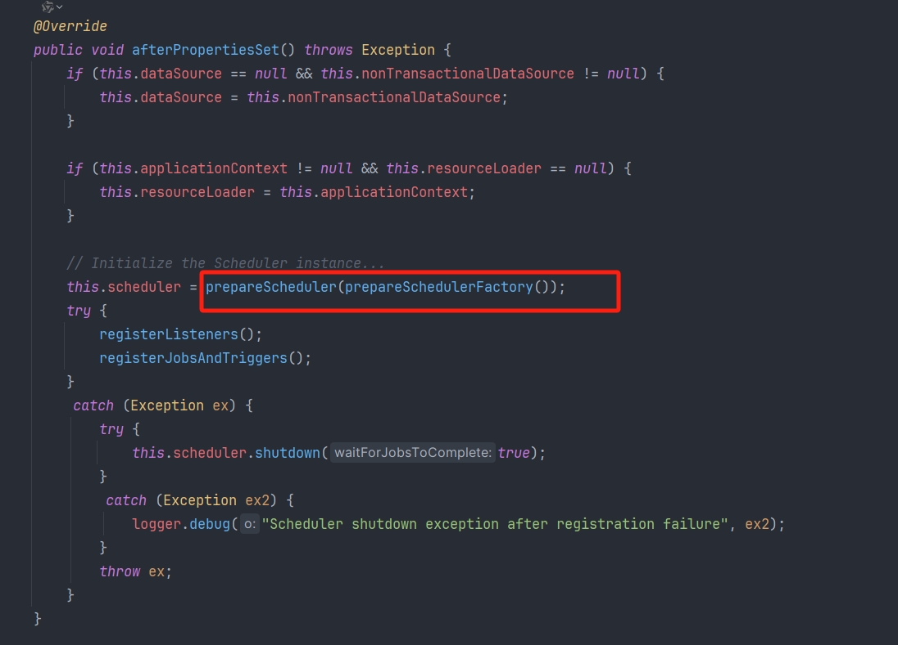
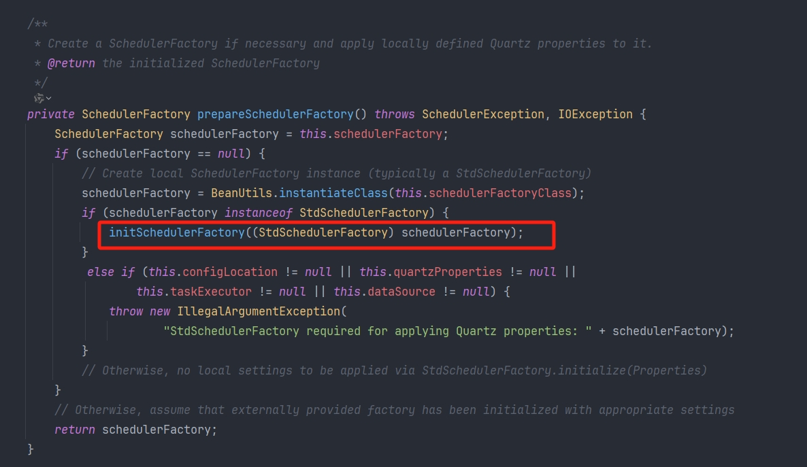
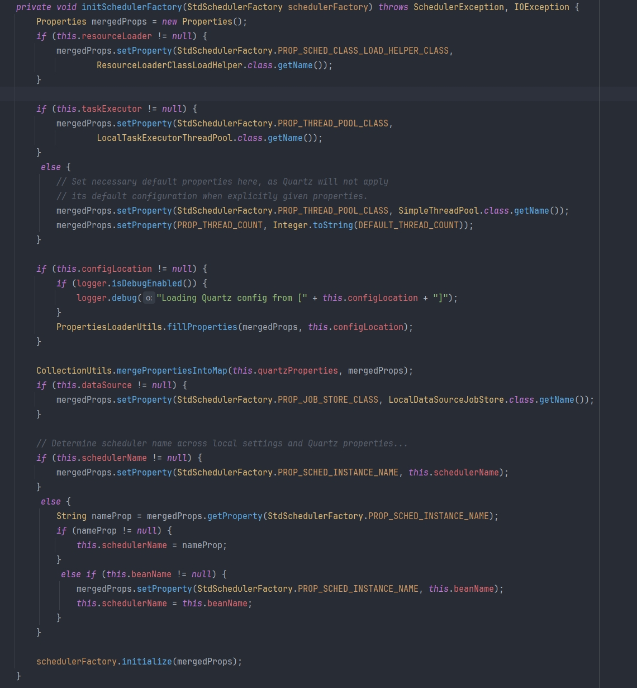
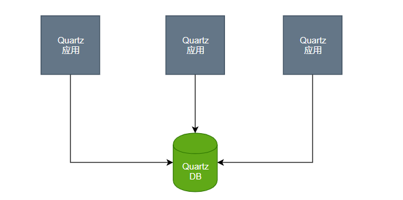
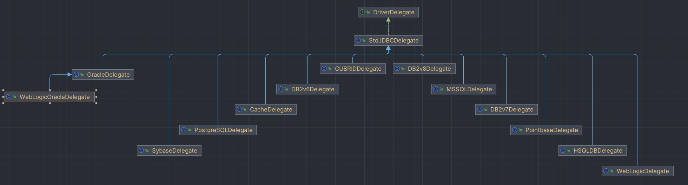

## Quartz 自动装配机制

```java
@ConfigurationProperties("spring.quartz")
public class QuartzProperties {

    private JobStoreType jobStoreType = JobStoreType.MEMORY;

    private String schedulerName;

    private boolean autoStartup = true;

    private Duration startupDelay = Duration.ofSeconds(0);

    private boolean waitForJobsToCompleteOnShutdown = false;

    private boolean overwriteExistingJobs = false;

    private final Map<String, String> properties = new HashMap<>();

    private final Jdbc jdbc = new Jdbc();


    public static class Jdbc {

        private static final String DEFAULT_SCHEMA_LOCATION = "classpath:org/quartz/impl/"
                + "jdbcjobstore/tables_@@platform@@.sql";

        private String schema = DEFAULT_SCHEMA_LOCATION;

        private DataSourceInitializationMode initializeSchema = DataSourceInitializationMode.EMBEDDED;

        private List<String> commentPrefix = new ArrayList<>(Arrays.asList("#", "--"));
    }
}
```

```java
@Configuration(proxyBeanMethods = false)
@ConditionalOnClass({ Scheduler.class, SchedulerFactoryBean.class, PlatformTransactionManager.class })
@EnableConfigurationProperties(QuartzProperties.class)
@AutoConfigureAfter({ DataSourceAutoConfiguration.class, HibernateJpaAutoConfiguration.class,
		LiquibaseAutoConfiguration.class, FlywayAutoConfiguration.class })
public class QuartzAutoConfiguration {

    @Bean
    @ConditionalOnMissingBean
    public SchedulerFactoryBean quartzScheduler(QuartzProperties properties,
            ObjectProvider<SchedulerFactoryBeanCustomizer> customizers, ObjectProvider<JobDetail> jobDetails,
            Map<String, Calendar> calendars, ObjectProvider<Trigger> triggers, ApplicationContext applicationContext) {
        SchedulerFactoryBean schedulerFactoryBean = new SchedulerFactoryBean();
        SpringBeanJobFactory jobFactory = new SpringBeanJobFactory();
        jobFactory.setApplicationContext(applicationContext);
        schedulerFactoryBean.setJobFactory(jobFactory);
        if (properties.getSchedulerName() != null) {
            schedulerFactoryBean.setSchedulerName(properties.getSchedulerName());
        }
        schedulerFactoryBean.setAutoStartup(properties.isAutoStartup());
        schedulerFactoryBean.setStartupDelay((int) properties.getStartupDelay().getSeconds());
        schedulerFactoryBean.setWaitForJobsToCompleteOnShutdown(properties.isWaitForJobsToCompleteOnShutdown());
        schedulerFactoryBean.setOverwriteExistingJobs(properties.isOverwriteExistingJobs());
        if (!properties.getProperties().isEmpty()) {
            schedulerFactoryBean.setQuartzProperties(asProperties(properties.getProperties()));
        }
        schedulerFactoryBean.setJobDetails(jobDetails.orderedStream().toArray(JobDetail[]::new));
        schedulerFactoryBean.setCalendars(calendars);
        schedulerFactoryBean.setTriggers(triggers.orderedStream().toArray(Trigger[]::new));
        customizers.orderedStream().forEach((customizer) -> customizer.customize(schedulerFactoryBean));
        return schedulerFactoryBean;
    }

    private Properties asProperties(Map<String, String> source) {
        Properties properties = new Properties();
        properties.putAll(source);
        return properties;
    }

    @Configuration(proxyBeanMethods = false)
    @ConditionalOnSingleCandidate(DataSource.class)
    @ConditionalOnProperty(prefix = "spring.quartz", name = "job-store-type", havingValue = "jdbc")
    protected static class JdbcStoreTypeConfiguration {

        @Bean
        @Order(0)
        public SchedulerFactoryBeanCustomizer dataSourceCustomizer(QuartzProperties properties, DataSource dataSource,
                @QuartzDataSource ObjectProvider<DataSource> quartzDataSource,
                ObjectProvider<PlatformTransactionManager> transactionManager) {
            return (schedulerFactoryBean) -> {
                DataSource dataSourceToUse = getDataSource(dataSource, quartzDataSource);
                schedulerFactoryBean.setDataSource(dataSourceToUse);
                PlatformTransactionManager txManager = transactionManager.getIfUnique();
                if (txManager != null) {
                    schedulerFactoryBean.setTransactionManager(txManager);
                }
            };
        }

        private DataSource getDataSource(DataSource dataSource, ObjectProvider<DataSource> quartzDataSource) {
            DataSource dataSourceIfAvailable = quartzDataSource.getIfAvailable();
            return (dataSourceIfAvailable != null) ? dataSourceIfAvailable : dataSource;
        }

        @Bean
        @ConditionalOnMissingBean
        public QuartzDataSourceInitializer quartzDataSourceInitializer(DataSource dataSource,
                @QuartzDataSource ObjectProvider<DataSource> quartzDataSource, ResourceLoader resourceLoader,
                QuartzProperties properties) {
            DataSource dataSourceToUse = getDataSource(dataSource, quartzDataSource);
            return new QuartzDataSourceInitializer(dataSourceToUse, resourceLoader, properties);
        }

        /**
         * Additional configuration to ensure that {@link SchedulerFactoryBean} and
         * {@link Scheduler} beans depend on any beans that perform data source
         * initialization.
         */
        @Configuration(proxyBeanMethods = false)
        static class QuartzSchedulerDependencyConfiguration {

            @Bean
            static SchedulerDependsOnBeanFactoryPostProcessor quartzSchedulerDataSourceInitializerDependsOnBeanFactoryPostProcessor() {
                return new SchedulerDependsOnBeanFactoryPostProcessor(QuartzDataSourceInitializer.class);
            }

            @Bean
            @ConditionalOnBean(FlywayMigrationInitializer.class)
            static SchedulerDependsOnBeanFactoryPostProcessor quartzSchedulerFlywayDependsOnBeanFactoryPostProcessor() {
                return new SchedulerDependsOnBeanFactoryPostProcessor(FlywayMigrationInitializer.class);
            }

            @Configuration(proxyBeanMethods = false)
            @ConditionalOnClass(SpringLiquibase.class)
            static class LiquibaseQuartzSchedulerDependencyConfiguration {

                @Bean
                @ConditionalOnBean(SpringLiquibase.class)
                static SchedulerDependsOnBeanFactoryPostProcessor quartzSchedulerLiquibaseDependsOnBeanFactoryPostProcessor() {
                    return new SchedulerDependsOnBeanFactoryPostProcessor(SpringLiquibase.class);
                }
            }
        }
    }

    /**
     * {@link AbstractDependsOnBeanFactoryPostProcessor} for Quartz {@link Scheduler} and
     * {@link SchedulerFactoryBean}.
     */
    private static class SchedulerDependsOnBeanFactoryPostProcessor extends AbstractDependsOnBeanFactoryPostProcessor {

        SchedulerDependsOnBeanFactoryPostProcessor(Class<?>... dependencyTypes) {
            super(Scheduler.class, SchedulerFactoryBean.class, dependencyTypes);
        }
    }
}
```

SpringBoot 整合 Quartz 后，通过 spring.quartz 前缀可以设置其对应的属性值，实例化 SchedulerFactoryBean 后，调用其 afterPropertiesSet()方法去初始化 Quartz 配置信息（详细查看 SchedulerFactoryBean 的 initialize()方法及 **Quartz（3-Scheduler）文章**）







## 单机版配置

### 依赖

```xml
<dependency>
    <groupId>org.springframework.boot</groupId>
    <artifactId>spring-boot-starter-web</artifactId>
    <version>2.3.12.RELEASE</version>
</dependency>
<dependency>
    <groupId>org.springframework.boot</groupId>
    <artifactId>spring-boot-starter-quartz</artifactId>
    <version>2.3.12.RELEASE</version>
</dependency>
```

### 任务创建

```java
/**
 * 定义任务
 */
public class TestJob extends QuartzJobBean {

    private static final Log logger = LogFactory.getLog(TestJob.class);

    @Override
    protected void executeInternal(JobExecutionContext context) throws JobExecutionException {
        logger.info("测试======");
    }
}
```

1. 可以实现 Job 接口，也可以继承 QuartzJobBean

```java
/**
 * 定义任务描述和具体的执行时间
 */
@Configuration
public class QuartzConfig {

    @Bean
    public JobDetail jobDetail() {
        //指定任务描述具体的实现类
        return JobBuilder.newJob(TestJob.class)
                // 指定任务的名称
                .withIdentity("testJob")
                // 任务描述
                .withDescription("testJob")
                // 每次任务执行后进行存储
                .storeDurably()
                .build();
    }

    @Bean
    public Trigger trigger() {
        //创建触发器
        return TriggerBuilder.newTrigger()
                // 绑定工作任务
                .forJob(jobDetail())
                // 每隔 5 秒执行一次 job
                .withSchedule(SimpleScheduleBuilder.repeatSecondlyForever(5))
                .build();
    }
}
```

2. 项目初始化手动创建任务

```java
@Component
public class JobInit implements ApplicationRunner {

    private static final String ID = "SUMMERDAY";

    @Autowired
    private Scheduler scheduler;

    @Override
    public void run(ApplicationArguments args) throws Exception {
        JobDetail jobDetail = JobBuilder.newJob(TestJob.class)
                .withIdentity(ID + " 01")
                .storeDurably()
                .build();
        CronScheduleBuilder scheduleBuilder =
                CronScheduleBuilder.cronSchedule("0/5 * * * * ? *");
        // 创建任务触发器
        Trigger trigger = TriggerBuilder.newTrigger()
                .forJob(jobDetail)
                .withIdentity(ID + " 01Trigger")
                .withSchedule(scheduleBuilder)
                .startNow() //立即執行一次任務
                .build();
        // 手动将触发器与任务绑定到调度器内
        scheduler.scheduleJob(jobDetail, trigger);
    }
}
```

### yaml 配置

```yaml
spring:
  # Quartz 的配置，对应 QuartzProperties 配置类
  quartz:
    job-store-type: memory # Job 存储器类型。默认为 memory 表示内存，可选 jdbc 使用数据库。
    auto-startup: true # Quartz 是否自动启动
    startup-delay: 0 # 延迟 N 秒启动
    wait-for-jobs-to-complete-on-shutdown: true # 应用关闭时，是否等待定时任务执行完成。默认为 false ，建议设置为 true
    overwrite-existing-jobs: false # 是否覆盖已有 Job 的配置
    properties: # 添加 Quartz Scheduler 附加属性
      org:
        quartz:
          threadPool:
            threadCount: 25 # 线程池大小。默认为 10 。
            threadPriority: 5 # 线程优先级
            class: org.quartz.simpl.SimpleThreadPool # 线程池类型
```

## 持久化配置

### 集群部署



一个 Quartz 集群中的每个节点是一个独立的 Quartz 应用，它又管理着其他的节点。这就意味着你必须对每个节点分别启动或停止。Quartz 集群中，独立的 Quartz 节点并不与另一其的节点或是管理节点通信，而是通过同一个数据库表来感知到另一 Quartz 应用的。因为 Quartz 集群依赖于数据库，所以必须首先创建 Quartz 数据库表，Quartz 发布包中包括了所有被支持的数据库平台的 SQL 脚本。

### 创建数据库表

针对不同的数据库，org.quartz.impl.jdbcjobstore 包下提供了不同建表脚本，数据库脚本放在 org\quartz-scheduler\quartz\2.3.2\quartz-2.3.2.jar! 包中的\org\quartz\impl\jdbcjobstore 路径下

| 表名                     | 描述                          |
| ------------------------ | ----------------------------- |
| qrtz_fired_triggers      | 存储已触发的 trigger 相关信息   |
| qrtz_paused_trigger_grps | 存储已暂停的 trigger 组信息     |
| qrtz_scheduler_state     | 存储 Scheduler 状态信息         |
| qrtz_locks               | 存储悲观锁的信息              |
| qrtz_simple_triggers     | 存储 Simple trigger 信息        |
| qrtz_simprop_triggers    | 存储其他几种 trigger 信息       |
| qrtz_cron_triggers       | 存储 cron trigger 信息          |
| qrtz_blob_triggers       | blog 类型存储 triggers          |
| qrtz_triggers            | 存储已配置的 trigger 信息       |
| qrtz_job_details         | 存储每一个已配置的 job details |
| qrtz_calendars           | 以 blog 类型存储 Calendar 信息    |

所有的表中都含有一个 SCHED_NAME 字段，对应我们配置的 scheduler-name，相同 Scheduler-name 的节点，形成一个 Quartz 集群

### 存储类型

Quartz 提供两种基本作业存储类型：RAMJobStore 和 JDBC 作业存储。在默认情况下 Quartz 将任务调度的运行信息保存在内存中，这种方法提供了最佳的性能，因为内存中数据访问最快。不足之处是缺乏数据的持久性，当程序路途停止或系统崩溃时，所有运行的信息都会丢失。

| 类型         | 优点                                                         | 缺点                                                         |
| ------------ | ------------------------------------------------------------ | ------------------------------------------------------------ |
| RAMJobStore  | 不要外部数据库，配置容易，运行速度快                         | 因为调度程序信息是存储在被分配给 JVM 的内存里面，所以，当应用程序停止运行时，所有调度信息将被丢失。另外因为存储到 JVM 内存里面，所以可以存储多少个 Job 和 Trigger 将会受到限制 |
| JDBC 作业存储 | 支持集群，因为所有的任务信息都会保存到数据库中，可以控制事物，还有就是如果应用服务器关闭或者重启，任务信息都不会丢失，并且可以恢复因服务器关闭或者重启而导致执行失败的任务 | 运行速度的快慢取决与连接数据库的快慢                         |

### 事务管理类型

| 类型        | 描述                                                         |
| ----------- | ------------------------------------------------------------ |
| JobStoreTX  | 如果不需要将调度命令（例如添加和删除 triggers）绑定到其他事务，那么可以通过使用 JobStoreTX 管理事务（这是最常见的选择） |
| JobStoreCMT | 如果需要 Quartz 与其他事务（即 J2EE 应用程序服务器）一起工作，那么应该使用 JobStoreCMT，这种情况下，Quartz 将让应用程序服务器容器管理事务 |

```properties
#需要使用哪一种事务类型，配置文件中就指定谁
#org.quartz.jobStore.class=org.quartz.impl.jdbcjobstore.JobStoreTX
org.quartz.jobStore.class=org.quartz.impl.jdbcjobstore.JobStoreCMT
```

### 数据库驱动代理
针对不同的数据库制作了不同的数据库的代理，其中使用最多的是 StdJDBCDelegate ，它是一个使用 JDBC 代码（和 SQL 语句）来执行其工作的委托。其他驱动代理可以在 "org.quartz.impl.jdbcjobstore" 包或其子包中找到。如 DB2v6Delegate（用于 DB2 版本 6 及更早版本），HSQLDBDelegate（HSQLDB），MSSQLDelegate（SQLServer），PostgreSQLDelegate（PostgreSQL），WeblogicDelegate（用于使用 Weblogic 创建的 JDBC 驱动程序）

```properties
org.quartz.jobStore.driverDelegateClass = org.quartz.impl.jdbcjobstore.StdJDBCDelegate
```



### 配置信息

```xml
<!-- 实现对 Quartz 的自动化配置 -->
<dependency>
    <groupId>org.springframework.boot</groupId>
    <artifactId>spring-boot-starter-quartz</artifactId>
    <version>2.3.12.RELEASE</version>
</dependency>
<dependency>
    <groupId>org.springframework.boot</groupId>
    <artifactId>spring-boot-starter-web</artifactId>
    <version>2.3.12.RELEASE</version>
</dependency>
<dependency>
    <groupId>com.baomidou</groupId>
    <artifactId>mybatis-plus-boot-starter</artifactId>
    <version>3.3.2</version>
</dependency>
<dependency>
    <groupId>mysql</groupId>
    <artifactId>mysql-connector-java</artifactId>
    <version>8.0.19</version>
</dependency>
```

1. yaml 配置（使用其自动装配机制）

```yaml
spring:
  datasource:
    driver-class-name: com.mysql.cj.jdbc.Driver
    url: jdbc:mysql://localhost:3306/quartz?serverTimezone=GMT%2B8
    username: root
    password: 123456
  quartz:
    # 使用数据库存储
    job-store-type: jdbc
    # 相同 Scheduler 名字的节点，形成一个 Quartz 集群
    scheduler-name: hyhScheduler
    # 应用关闭时，是否等待定时任务执行完成。默认为 false ，建议设置为 true
    wait-for-jobs-to-complete-on-shutdown: true
    jdbc:
      # 是否自动使用 SQL 初始化 Quartz 表结构。这里设置成 never ，我们手动创建表结构。
      initialize-schema: never
      # 用于初始化数据库架构的SQL文件的路径
      #schema: classpath:org/quartz/impl/jdbcjobstore/tables_@@platform@@.sql
    properties:
      org:
        quartz:
          #延时启动，要有足够长的时间让你的应用先启动完成后再让Scheduler启动（单位秒）
          startup-delay: 60
          #是否每次系统运行都会清空数据库中的Job信息，重新进行初始化
          overwrite-existing-jobs: false
          scheduler:
            # 默认主机名和时间戳生成实例ID,可以是任何字符串，但对于所有调度程序来说，必须是唯一的 对应qrtz_scheduler_state INSTANCE_NAME字段
            instanceId: AUTO
            instanceName: hyhScheduler
          # JobStore 相关配置
          jobStore:
            # 持久化配置
            # 此存储机制用于Quartz独立于应用容器的事务管理，如果是Tomcat容器管理的数据源，那我们定义的事务也不会传播给Quartz框架内部。
            # 通俗的讲就是不管我们的Service服务本身业务代码是否执行成功，只要代码中调用了Quartz API的数据库操作，那任务状态就永久持久化了，
            # 就算业务代码抛出运行时异常任务状态也不会回滚到之前的状态。与之相反的是JobStoreCMT。
            class: org.quartz.impl.jdbcjobstore.JobStoreTX
            # JDBC代理类，仅为数据库制作了特定于数据库的代理
            driverDelegateClass: org.quartz.impl.jdbcjobstore.StdJDBCDelegate
            # Quartz 表前缀
            tablePrefix: QRTZ_
            # 是集群模式
            isClustered: true
            # 设置此实例"检入"与群集的其他实例的频率（以毫秒为单位）。影响检测失败实例的速度。
            clusterCheckinInterval: 1000
            #让JDBCJobStore将JobDataMaps中的所有值都作为字符串，因此可以作为键值对存储而不是在BLOB列中以其序列化形式存储，从而避免序列化的版本问题
            useProperties: false
            #超过这个时间还未触发的trigger，就被认为发生了misfire，默认60s。job成功触发叫fire，misfire就是未成功触发。
            misfireThreshold: 60000
          # 线程池相关配置
          threadPool:
            # 线程池大小。默认为 10
            threadCount: 25
            # 线程优先级
            threadPriority: 5
            # 线程池类型
            class: org.quartz.simpl.SimpleThreadPool
```

注意：同一集群下，instanceName 必须相同，instanceId 可自动生成，isClustered 为 true，持久化存储，指定数据库类型对应的驱动类和数据源连接。

2. 自定义 properties 和配置类（使用 Quartz 的 initialize()方法去查找对应的 quartz.properties 文件）

**quartz.properties**

```properties
#调度标识名 集群中每一个实例都必须使用相同的名称
org.quartz.scheduler.instanceName = hyhScheduler
#ID设置为自动获取 每一个必须不同
org.quartz.scheduler.instanceId = AUTO
#数据保存方式为持久化
#springboot版本2.6.x请使用：org.springframework.scheduling.quartz.LocalDataSourceJobStore
#org.quartz.jobStore.class=org.quartz.impl.jdbcjobstore.JobStoreTX
org.quartz.jobStore.class=org.springframework.scheduling.quartz.JobStoreTX
#表的前缀
org.quartz.jobStore.tablePrefix = QRTZ_
#设置为TRUE不会出现序列化非字符串类到 BLOB 时产生的类版本问题
org.quartz.jobStore.useProperties = true
#加入集群
org.quartz.jobStore.isClustered = true
#ThreadPool 实现的类名
org.quartz.threadPool.class = org.quartz.simpl.SimpleThreadPool
#调度实例失效的检查时间间隔
org.quartz.jobStore.clusterCheckinInterval = 20000
#容许的最大作业延长时间
org.quartz.jobStore.misfireThreshold = 60000
#线程数量
org.quartz.threadPool.threadCount = 10
#线程优先级
org.quartz.threadPool.threadPriority = 5
#自创建父线程
org.quartz.threadPool.threadsInheritContextClassLoaderOfInitializingThread = true
#org.quartz.threadPool.threadNamePrefix=liftsail
```

**配置类（参考 QuartzAutoConfiguration）**

```java
@Component
public class JobFactory extends AdaptableJobFactory {

    @Resource
    private AutowireCapableBeanFactory capableBeanFactory;

    // Job 对象的实例化过程是在 Quartz 中进行的，注入的实体类是在 Spring 容器当中的 所以在 job 中无法注入 Spring 容器的实体类。
    // 将 Job Bean 也纳入到 Spring 容器的管理之中，Spring 容器自然能够为 Job Bean 自动装配好所需的依赖。
    @Override
    protected Object createJobInstance(TriggerFiredBundle bundle) throws Exception {
        // 调用父类的方法，来实现对 Job 的实例化。
        Object jobInstance = super.createJobInstance(bundle);
        // 进行注入，调用自身方法为创建好的 Job 实例进行属性自动装配并将其纳入到 Spring 容器的管理之中
        capableBeanFactory.autowireBean(jobInstance);
        return jobInstance;
    }
}
```

```java
@Configuration
public class JobConfig {

    @Resource
    private JobFactory jobFactory;
    @Resource
    private DataSource dataSource;

    @Bean
    public SchedulerFactoryBean schedulerFactoryBean() {
        SchedulerFactoryBean schedulerFactoryBean = new SchedulerFactoryBean();
        schedulerFactoryBean.setJobFactory(jobFactory);
        // 配置数据源
        schedulerFactoryBean.setDataSource(dataSource);
        // 用于 quartz 集群，QuartzScheduler 启动时更新己存在的 Job
        schedulerFactoryBean.setOverwriteExistingJobs(true);
        // 延时启动，应用启动 1 秒后
        schedulerFactoryBean.setStartupDelay(1);
        // 设置加载的配置文件
        schedulerFactoryBean.setConfigLocation(new ClassPathResource("quartz.properties"));
        return schedulerFactoryBean;
    }

    @Bean
    public Scheduler scheduler() {
        return schedulerFactoryBean().getScheduler();
    }
}
```

### 基本使用

```java
@Component
public class JobInit implements ApplicationRunner {

    private static final String ID = "SUMMERDAY";

    @Autowired
    private Scheduler scheduler;

    @Override
    public void run(ApplicationArguments args) throws Exception {
        JobDetail jobDetail = JobBuilder.newJob(SecondJob.class)
                .withIdentity(ID + " 02")
                .storeDurably()
                .build();
        CronScheduleBuilder scheduleBuilder =
                CronScheduleBuilder.cronSchedule("0/10 * * * * ? *");
        // 创建任务触发器
        Trigger trigger = TriggerBuilder.newTrigger()
                .forJob(jobDetail)
                .withIdentity(ID + " 02Trigger")
                .withSchedule(scheduleBuilder)
                .startNow() //立即執行一次任務
                .build();
        Set<Trigger> set = new HashSet<>();
        set.add(trigger);
        // boolean replace 表示启动时对数据库中的 quartz 的任务进行覆盖。
        scheduler.scheduleJob(jobDetail, set, true);
    }
}
```
