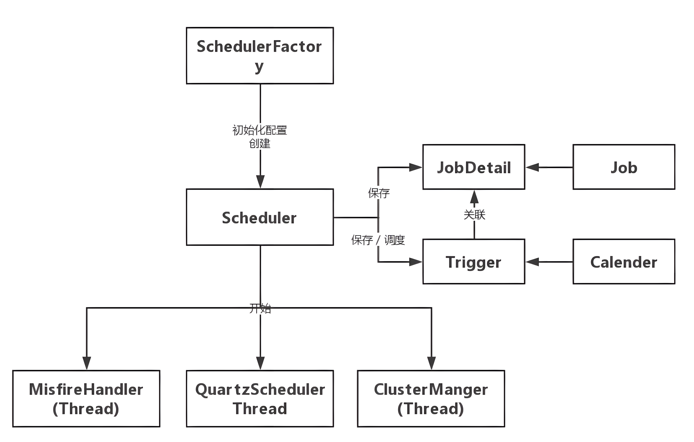

## 组件



### Job（任务）
可以实现该接口定义其运行任务，JobExecutionContext 类提供了调度上下文的各种信息，Job 运行时的信息保存在 JobDataMap 实例中

Job 有一个 StatefulJob 子接口，代表有状态的任务，该接口是一个没有方法的标签接口，其目的是让 Quartz 知道任务的类型，以便采用不同的执行方案。无状态任务在执行时拥有自己的 JobDataMap 拷贝，对 JobDataMap 的更改不会影响下次的执行；而有状态任务共享共享同一个 JobDataMap 实例，每次任务执行对 JobDataMap 所做的更改会保存下来，后面的执行可以看到这个更改，即每次执行任务后都会对后面的执行发生影响。

正因为这个原因，无状态的 Job 可以并发执行，而有状态的 StatefulJob 不能并发执行，这意味着如果前次的 StatefulJob 还没有执行完毕，下一次的任务将阻塞等待，直到前次任务执行完毕。有状态任务比无状态任务需要考虑更多的因素，程序往往拥有更高的复杂度，因此除非必要，应该尽量使用无状态的 Job。

如果 Quartz 使用了数据库持久化任务调度信息，无状态的 JobDataMap 仅会在 Scheduler 注册任务时保持一次，而有状态任务对应的 JobDataMap 在每次执行任务后都会进行保存。

### JobDetail（任务细节）
Quartz 在每次执行 Job 时都重新创建一个 Job 实例，所以它不直接接受一个 Job 的实例，而是接受一个 Job 实现类，以便运行时通过 newInstance()的反射机制实例化 Job，因此需要通过一个类来描述 Job 的实现类及其他相关的静态信息

### Trigger（触发器）
描述触发 Job 执行的时间触发规则

Trigger 自身也可以拥有一个 JobDataMap，其关联的 Job 可以通过 JobExecutionContext#getTrigger().getJobDataMap()获取 Trigger 中的 JobDataMap。不管是有状态还是无状态的任务，在任务执行期间对 Trigger 的 JobDataMap 所做的更改都不会进行持久，也即不会对下次的执行产生影响。

### Scheduler（调度器）
代表一个 Quartz 的独立运行容器，Trigger 和 JobDetail 可以注册到 Scheduler，两者在 Scheduler 中拥有各自的组及名称，组及名称是 Scheduler 查找定位容器中某一对象的依据，Trigger 的组及名称必须唯一，JobDetail 的组和名称也必须唯一（但可以和 Trigger 的组和名称相同，因为它们是不同类型的）

Scheduler 可以将 Trigger 绑定到某一 JobDetail 中，这样当 Trigger 触发时，对应的 Job 就被执行。

Scheduler 拥有一个 SchedulerContext，它类似于 ServletContext，保存着 Scheduler 上下文信息，Job 和 Trigger 都可以访问 SchedulerContext 内的信息。SchedulerContext 内部通过一个 Map，以键值对的方式维护这些上下文数据，SchedulerContext 为保存和获取数据提供了多个 put()和 getXxx()的方法。可以通过 Scheduler 的 getContext()获取对应的 SchedulerContext 实例

### ThreadPool（线程池）
Scheduler 使用一个线程池作为任务运行的基础设施，任务通过共享线程池中的线程提高运行效率

## 其他
### 工作流程
1. scheduler 是 quartz 的独立运行容器，trigger 和 job 都可以注册在 scheduler 容器中，一个 Job 可以对应多个 Trigger，但一个 Trigger 只能对应一个 Job。
2. Quartz 中有一个调度线程 QuartzSchedulerThread，调度线程可以找到将要被触发的 trigger 和 job，然后在 ThreadPool 中获取一个线程来执行这个 job。
3. JobStore 主要作用是存放 job 和 trigger 的信息。

### 线程模型

在 Quartz 中有两类线程：Scheduler 调度线程和任务执行线程。

1. 任务执行线程：Quartz 不会在主线程（QuartzSchedulerThread）中处理用户的 Job。Quartz 把线程管理的职责委托给 ThreadPool，一般的设置使用 SimpleThreadPool，SimpleThreadPool 创建了一定数量的 WorkerThread 实例来使得 Job 能够在线程中进行处理。
2. 调度主线程：QuartzScheduler 被创建时创建一个 QuartzSchedulerThread 实例。

### 调度原理

Quartz 中 Scheduler 调度线程主要有两类线程：

1. Regular Scheduler Thread（执行常规调度）：Regular Thread 轮询所有 Trigger，如果发现有将要触发的 Trigger，就从任务线程池中获取一个空闲线程，然后执行与该 Trigger 关联的 Job。
2. Misfire Scheduler Thread（执行错失的任务）：Misfire Thraed 轮询所有 Trigger，查找有错失的任务，例如系统重启/线程占用等问题导致的任务错失，根据一定的策略进行处理。

### 存储
Quartz 有两种方式将定时任务存储下来

1. RAMJobStore：将 trigger 和 job 存储到内存里
2. JobStoreSupport：将 trigger 和 job 存储到数据库里

## 集群
Quartz 的集群部署方案在架构上是分布式的，没有负责集中管理的节点，而是利用数据库锁的方式来实现集群环境下进行并发控制，分布式部署时需要保证各个节点的系统时间一致。Quartz 应用是通过数据库表来感知到另一应用。只有使用持久的 JobStore 才能完成 Quartz 集群。

### 集群同步机制
每当要进行与某种业务相关的数据库操作时，先去 QRTZ_LOCKS 表中查询操作相关的业务对象所需要的锁，在 select 语句之后加 for update 来实现。例如：TRIGGER_ACCESS 表示对任务触发器相关的信息进行修改、删除操作时所需要获得的锁。

```sql
select * from QRTZ_LOCKS t where t.lock_name='TRIGGER_ACCESS' for update
```

QRTZ_LOCKS 主要有两个行级锁：

| 锁名 | 描述         |
| --- | --- |
| STATE_ACCESS | 状态访问锁 |
| TRIGGER_ACCESS | 触发器访问锁 |

当一个线程对表中的数据执行查询操作时，若查询结果中包含相关的行，数据库就对该行进行 ROW LOCK；若此时，另外一个线程使用相同的 SQL 对表的数据进行查询，由于查询出的数据行已经被数据库锁住了，此时这个线程就只能等待，直到拥有该行锁的线程完成了相关的业务操作，执行了 commit 动作后，数据库才会释放了相关行的锁，这个线程才能继续执行。

通过这样的机制，在集群环境下，结合悲观锁的机制就可以防止一个线程对数据库数据的操作的结果被另外一个线程所覆盖，从而可以避免定时任务重复执行。当然，达到这种效果的前提是需要把 Connection 设置为手动提交，即 autoCommit 为 false。

### 故障切换

当集群一个节点在执行一个或多个作业期间失败时发生故障切换（Fail Over）。当节点出现故障时，其他节点会检测到该状况并识别数据库中在故障节点内正在进行的作业，任何标记为恢复的作业（在 JobDetail 上都具有“请求恢复 requests recovery”属性）将被剩余的节点重新执行，已达到失效任务转移，没有标记为恢复的作业将在下一次相关的 Triggers 触发时简单地被释放以执行。

1. 每个节点 Scheduler 实例由集群管理线程 ClusterManager 周期性（配置文件中检测周期属性 clusterCheckinInterval 默认值是 15000 (即 15 秒)）定时检测 CHECKIN 数据库，遍历集群各兄弟节点的实例状态，检测集群各个兄弟节点的健康情况。

2. 当集群中一个节点的 Scheduler 实例执行 CHECKIN 时，它会查看是否有其他节点的 Scheduler 实例在到达它们所预期的时间还未 CHECKIN。若检测到有节点在预期时间未 CHECKIN，则认为该节点故障。判断节点是否故障与节点 Scheduler 实例最后 CHECKIN 的时间有关，而判断条件：

```tex
LAST_CHECKIN_TIME + Max(检测周期，检测节点现在距上次最后CHECKIN的时间) + 7500ms < currentTime。
```

3. 集群管理线程检测到故障节点，就会更新触发器状态，状态更新如下：

| 更新前状态     | 更新后状态      |
| -------------- | --------------- |
| BLOCKED        | WAITING         |
| PAUSED_BLOCKED | PAUSED          |
| ACQUIRED       | WAITING         |
| COMPLETE       | 无，删除 Trigger |

4. 集群管理线程删除故障节点的实例状态（qrtz_scheduler_state 表），即重置了所有故障节点触发任务一般。原先故障任务和正常任务一样就交由调度处理线程处理了。

### 负载均衡

负载均衡自动发生，集群的每个节点都尽可能快地触发 Jobs。当 Triggers 的触发时间发生时，获取它的第一个节点（通过在其上放置一个锁定）是将触发它的节点， 哪个节点运行它或多或少是随机的。

集群下任务的调度存在一定的随机性，谁先拥有触发器行锁 TRIGGER_ACCESS，谁就先可能触发任务。当某一个机子的调度线程拿到该锁（别的机子只能等待）时：

1. acquireNextTriggers 获取待触发队列，查询 Trigger 表的判断条件：

```tex
NEXT_FIRE_TIME < now + idleWaitTime + timeWindow and TRIGGER_STATE = 'WAITING'
```

然后更新触发器状态为 ACQUIRE。

2. 触发待触发队列，修改 Trigger 表中的 NEXT_FIRE_TIME 字段，也就是下次触发时间，计算下次触发时间的方法与具体的触发器实现有关，如 Cron 表达式触发器，计算触发时间与 Cron 表达式有关。触发待触发队列后及时释放触发器行锁。

3. 这样，别的机子拿到该锁，也查询 Trigger 表，但是由于任务触发器的下次触发时间或者状态已经修改，所以不会被查找出来。这时拿到的任务就可能是别的触发任务。这样就实现了多个节点的应用在某一时刻对任务只进行一次调度。对于重复任务每次都不一定是相同的节点, 它或多或少会随机节点运行它。

### 缺点

1. 集群特性对于高 CPU 使用率的任务效果很好，但是对于大量的短任务，各个节点都会抢占数据库锁，这样就出现大量的线程等待资源。这种情况随着节点的增加会越来越严重。
2. 没有实现比较好的负载均衡机制，仅依靠各个节点中的 Scheduler 实例随机抢占，可能会导致部分节点负载重，部分节点负载轻的情况。
3. 不能满足更复杂的功能，如任务分片、编排、暂停重启、失败重试等。
4. 当集群放置在不同的机器上时，称之为水平集群。节点跑在同一台机器上时，称之为垂直集群。对于垂直集群，存在着单点故障的问题。这对高可用性的应用来说是无法接受的，因为一旦机器崩溃了，所有的节点也就被终止了。对于水平集群，存在着时间同步问题。

