## 基本概念
### 出现背景
Quartz 的不足：

1. 通过调用 API 的方式操作任务，不人性化
2. 需要持久化业务的 QuartzJobBean 到底层数据表中，系统侵入性相当严重
3. 调度逻辑和 QuartzJobBean 耦合在同一个项目中，这将导致一个问题，在调度任务数量逐渐增多，同时调度任务逻辑逐渐加重的情况下，此时调度系统的性能将大大受限于业务
4. quartz 底层以“抢占式”获取 DB 锁并由抢占成功节点负责运行任务，会导致节点负载悬殊非常大；而 XXL-JOB 通过执行器实现“协同分配式”运行任务，充分发挥集群优势，负载各节点均衡

### 特点
1. 简单：支持通过 Web 页面对任务进行 CRUD 操作，操作简单，容易上手
2. 动态：支持动态修改任务状态，启动/停止任务，以及终止运行中的任务，即时生效
3. 调度中心 HA（中心式）：调度中心式设计，并支持集群部署，保证调度平台高可用
4. 执行器 HA(分布式)：任务分布执行，任务执行器支持集群部署，可保证任务执行高可用
5. 弹性扩容缩容：一旦有新执行器机器上下线，下次调度执行时，将会重新分配任务执行

### 组件
1. 调度模块（调度中心）：负责管理调度信息，按照调度配置发出调度请求，自身不承担业务代码
2. 执行模块（执行器）：负责接收调度中心的请求并执行任务逻辑
3. 处理器（jobHandler）：通过自己在项目中自定义不同的任务处理器来让任务执行器执行，并通过调度器平台 处理不同的任务

### 参数信息
#### 调度类型
1. 无：该类型不会主动触发调度；
2. CRON：该类型将会通过 CRON，触发任务调度；
3. 固定速度：该类型将会以固定速度，触发任务调度；按照固定的间隔时间，周期性触发；
4. 固定延迟：该类型将会以固定延迟，触发任务调度；按照固定的延迟时间，从上次调度结束后开始计算延迟时间，到达延迟时间后触发下次调度；

#### 路由策略
当执行器集群部署时，提供丰富的路由策略

1. FIRST（第一个）：固定选择第一个机器
2. LAST（最后一个）：固定选择最后一个机器
3. ROUND（轮询）：轮流选择每台机器
4. RANDOM（随机）：随机选择在线的机器
5. CONSISTENT_HASH（一致性 Hash）：每个任务按照 Hash 算法固定选择某一台机器，且所有任务均匀散列在不同机器上
6. LEAST_FREQUENTLY_USED（最不经常使用）：使用频率最低的机器优先被选举
7. LEAST_RECENTLY_USED（最近最久未使用）：最久未使用的机器优先被选举
8. FAILOVER（故障转移）：按照顺序依次进行心跳检测，第一个心跳检测成功的机器选定为目标执行器并发起调度
9. BUSYOVER（忙碌转移）：按照顺序依次进行空闲检测，第一个空闲检测成功的机器选定为目标执行器并发起调度
10. SHARDING_BROADCAST（分片广播）：广播触发对应集群中所有机器执行一次任务，同时传递分片参数，可根据分片参数开发分片任务

#### 运行模式
1. BEAN 模式：任务以 JobHandler 的方式维护在执行器端；需要结合 “JobHandler”属性匹配执行器中的任务；
2. GLUE 模式（Java）：任务以源码方式维护在调度中心；该模式的任务实际上是一段继承自 IJobHandler 的 Java 类代码并以“groovy”源码的方式维护，它在执行器项目中运行，可使用@Resource/@Autowire 注入执行器里中的其他服务；
3. GLUE 模式（Shell）：任务以源码方式维护在调度中心；该模式的任务实际上是一段“shell”脚本；
4. GLUE 模式（Python）：任务以源码方式维护在调度中心；该模式的任务实际上是一段“python”脚本；
5. GLUE 模式（NodeJS）：任务以源码方式维护在调度中心；该模式的任务实际上是一段“nodejs”脚本；

**JobHandler**

只有在运行模式为“BEAN 模式”时生效，对应执行器中新开发的 JobHandler 注解自定义的 value 值

#### 子任务
每个任务都拥有一个唯一的任务 ID（任务 ID 可以从任务列表获取），当本任务执行结束并且执行成功时，将会触发子任务 ID 所对应的任务的一次主动调度。

#### 阻塞处理策略
调度过于密集，执行器来不及处理时的处理策略

1. 单机串行（默认）：调度请求进入单机执行器后，调度请求进入 FIFO 队列并以串行方式运行；
2. 丢弃后续调度：调度请求进入单机执行器后，发现执行器存在运行的调度任务，本次请求将会被丢弃并标记为失败；
3. 覆盖之前调度：调度请求进入单机执行器后，发现执行器存在运行的调度任务，将会终止运行中的调度任务并清空队列，然后运行本地调度任务；

#### 调度过期策略

1. 忽略：调度过期后，忽略过期的任务，从当前时间开始重新计算下次触发时间；
2. 立即执行一次：调度过期后，立即执行一次，并从当前时间开始重新计算下次触发时间；

## SpringBoot 整合
### 模块详解
1. xxl-job-admin：xxl-job 管理平台，访问地址为 localhost: 8080/xxl-job/admin，用户名为 admin，密码为 123456
2. xxl-job-core：核心依赖包，当 springboot 项目 xxl-job 只需要引用即可
3. xxl-job-executor-sample-frameless：java 整合 demo
4. xxl-job-executor-sample-springboot：springboot 整合 demo

### 配置部署“调度中心”
#### 导入 sql 脚本
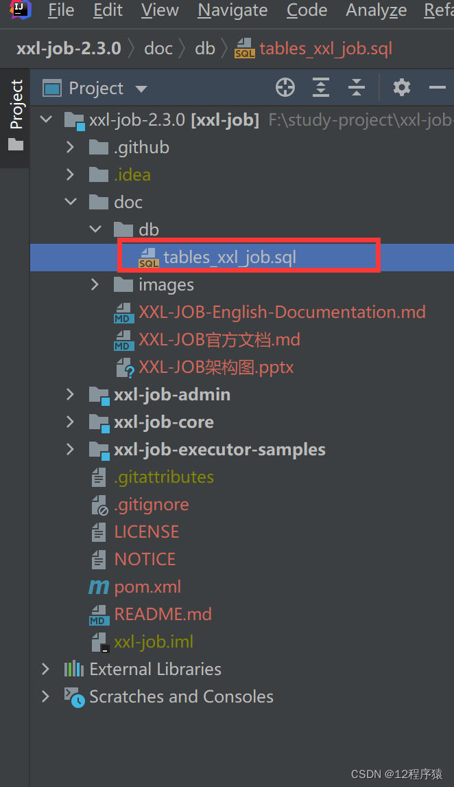

1. xxl_job_lock：任务调度锁表；
2. xxl_job_group：执行器信息表，维护任务执行器信息；
3. xxl_job_info：调度扩展信息表： 用于保存 XXL-JOB 调度任务的扩展信息，如任务分组、任务名、机器地址、执行器、执行入参和报警邮件等等；
4. xxl_job_log：调度日志表： 用于保存 XXL-JOB 任务调度的历史信息，如调度结果、执行结果、调度入参、调度机器和执行器等等；
5. xxl_job_logglue：任务 GLUE 日志：用于保存 GLUE 更新历史，用于支持 GLUE 的版本回溯功能；
6. xxl_job_registry：执行器注册表，维护在线的执行器和调度中心机器地址信息；
7. xxl_job_user：系统用户表； 

#### 修改配置信息
1. 修改 application.properties 的 mysql 和 mail 配置

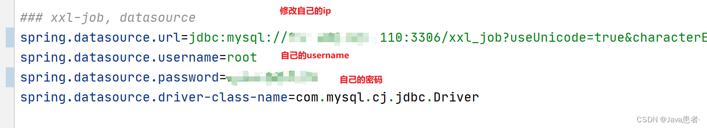

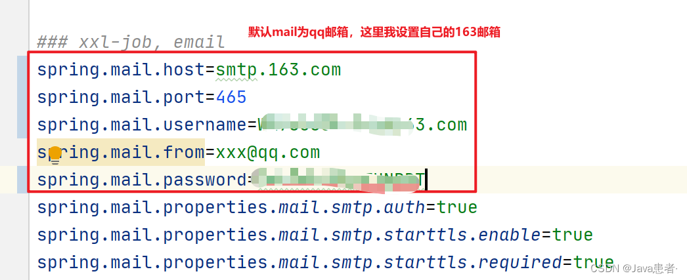

2. 修改 logback 的文件存储地址（要有读写权限）

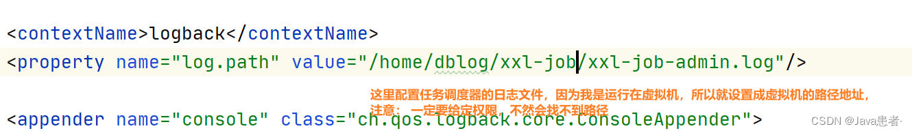

#### 访问后台
调度中心访问地址：[http://localhost: 8080/xxl-job-admin](http://localhost:8080/xxl-job-admin)

1. 用户名：admin
2. 密码：123456

### 添加执行器
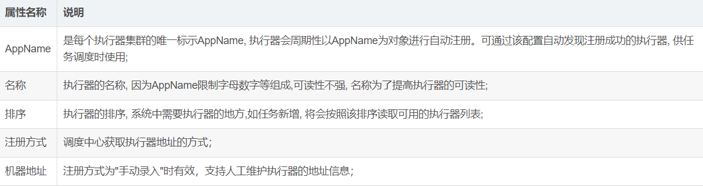

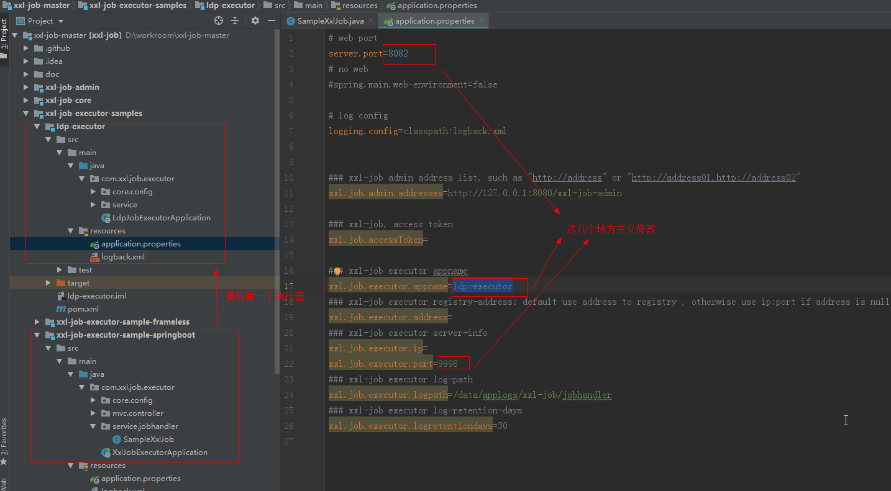 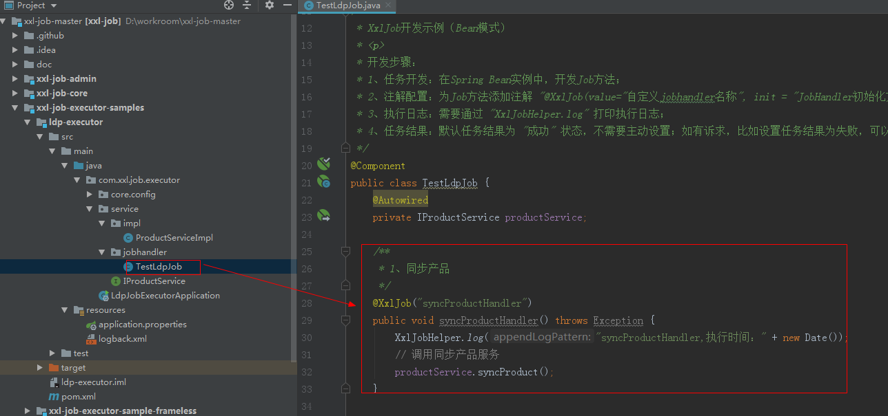 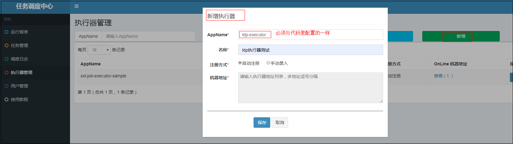

### 添加任务
```xml
<dependency>
    <groupId>com.xuxueli</groupId>
    <artifactId>xxl-job-core</artifactId>
    <version>2.3.0</version>
</dependency>
```

```yaml
xxl:
  job:
  	# 执行器通讯（选填）：非空时启用，与xxl-job-admin要一致
    accessToken:
    admin:
      # 调度中心地址（选填）：如调度中心集群部署存在多个地址则用逗号分隔。
    	# 执行器将会使用该地址进行"执行器心跳注册"和"任务结果回调"，为空则关闭自动注册
      addresses: http://127.0.0.1:8080/xxl-job-admin
    executor:
    	# 执行器（选填）：执行器心跳注册分组依据，为空则关闭自动注册
      appname: xxl-job-executor-sample
      # 默认为空表示自动获取，多网卡时可手动设置指定IP，该IP不会绑定Host仅作为通讯实用，
      # 地址信息用于 “执行器注册” 和“调度中心请求并触发任务”
      ip:
      # 执行器端口号（选填）：小于等于0则自动获取，默认端口为9999，单机部署多个执行器时，注意要配置不同执行器端口
      port: 9900
      # 执行器运行日志文件存储磁盘路径（选填）：需要对该路径拥有读写权限，为空则使用默认路径
      logpath: /var/log/hwariot/hwariot-mixing-station-data/xxl-job/jobhandler/
      # 执行器日志保存天数（选填）：值大于3时生效，启用执行器Log文件定期清理功能，否则不生效
      logretentiondays: -1
```

```java
@Configuration
public class XxlJobConfig {
    private Logger logger = LoggerFactory.getLogger(XxlJobConfig.class);

    @Value("${xxl.job.admin.addresses}")
    private String adminAddresses;

    @Value("${xxl.job.accessToken}")
    private String accessToken;

    @Value("${xxl.job.executor.appname}")
    private String appname;

    @Value("${xxl.job.executor.address}")
    private String address;

    @Value("${xxl.job.executor.ip}")
    private String ip;

    @Value("${xxl.job.executor.port}")
    private int port;

    @Value("${xxl.job.executor.logpath}")
    private String logPath;

    @Value("${xxl.job.executor.logretentiondays}")
    private int logRetentionDays;


    @Bean
    public XxlJobSpringExecutor xxlJobExecutor() {
        logger.info(">>>>>>>>>>> xxl-job config init.");
        XxlJobSpringExecutor xxlJobSpringExecutor = new XxlJobSpringExecutor();
        xxlJobSpringExecutor.setAdminAddresses(adminAddresses);
        xxlJobSpringExecutor.setAppname(appname);
        xxlJobSpringExecutor.setAddress(address);
        if (StringUtils.isBlank(ip)) {
            ip = inetUtils.findFirstNonLoopbackHostInfo().getIpAddress();
        }
        xxlJobSpringExecutor.setIp(ip);
        xxlJobSpringExecutor.setPort(port);
        xxlJobSpringExecutor.setAccessToken(accessToken);
        xxlJobSpringExecutor.setLogPath(logPath);
        xxlJobSpringExecutor.setLogRetentionDays(logRetentionDays);

        return xxlJobSpringExecutor;
    }
}
/**
 * 针对多网卡、容器内部署等情况，可借助 "spring-cloud-commons" 提供的 "InetUtils" 组件灵活定制注册 IP；
 *      1、引入依赖：
 *          <dependency>
 *             <groupId> org.springframework.cloud </groupId>
 *             <artifactId> spring-cloud-commons </artifactId>
 *             <version>${version}</version >
 *         </dependency>
 *
 *      2、配置文件，或者容器启动变量，指定默认 IP
 *          spring.cloud.inetutils.preferred-networks: 'xxx.xxx.xxx.'
 *
 *      3、获取 IP
 *          String ip_ = inetUtils.findFirstNonLoopbackHostInfo().getIpAddress();
 */
```

```java
/**
 * xxl-job 开发示例
 * 开发步骤：
 * 1、任务开发：在 Spring Bean 实例中，开发 Job 方法；
 * 2、注解配置：为 Job 方法添加注解 "@XxlJob(value =" 自定义 jobhandler 名称 ", init = " JobHandler 初始化方法 ", destroy = " JobHandler 销毁方法 ")"，注解 value 值对应的是调度中心新建任务的 JobHandler 属性的值。
 * 3、执行日志：需要通过 "XxlJobHelper.log" 打印执行日志；
 * 4、任务结果：默认任务结果为 "成功" 状态，不需要主动设置；如有诉求，比如设置任务结果为失败，可以通过 "XxlJobHelper.handleFail/handleSuccess" 自主设置任务结果；
 */
@Component
@Slf4j
public class TestHandler {

    @XxlJob(value = "TestHandler")
    public boolean demoJobHandler(){
        log.info("定时任务开始 job start");
        Long startTime  = System.currentTimeMillis();
        testHandler();
        Long endTime  = System.currentTimeMillis();
        log.info("定时任务开始 job end, cost: {} ms"+(endTime - startTime));
        return XxlJobHelper.handleSuccess();
    }

    /**
     * 定时任务要执行的业务逻辑
     */
    public void testHandler() {
        System.out.println("hello world");
    }
}
```

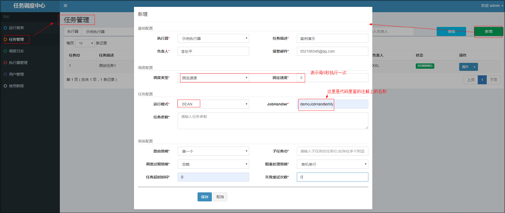

注意：

1. 在 xxl-job 中，获取 IP 是通过 ipUtils 类中的 getIp()获取的：首先获取的是 localhost，如果在本地没取到 IP，那么就会去获取所有网卡接口，依次遍历（localAddrs [] 总是获取的第一个，如果当前网卡存在 2 个，第一个 eth0 状态不可用，第二个 eth1 状态可用，那么他总是会取到不可用 IP，导致服务出现问题）
2. InetUtils 中的 findFirstNonLoopbackAddress()是先去获取了网卡接口，再遍历并且依次判断当前地址是否是开启的，然后判断了当前网卡接口是不是被配置了可忽略，然后获取到地址之后 address instanceof Inet4Address && ! address.isLoopbackAddress() && ! this.ignoreAddress(address)，如果符合条件赋值给 result，后续判断如果 result 不为 null，则直接返回，如果为空，再去 InetAddress.getLocalHost()

### GLUE 模式（Java）任务开发
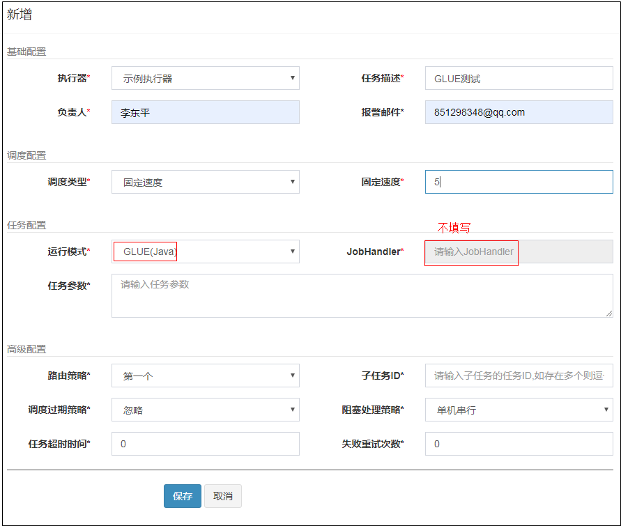

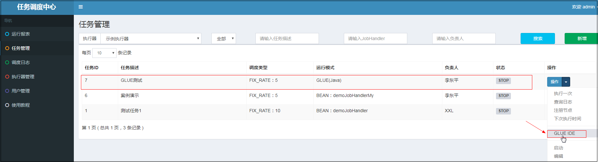

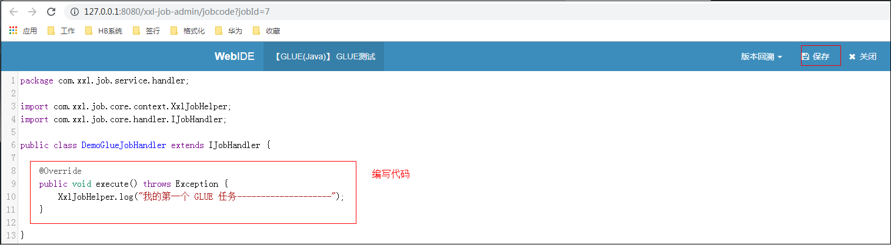

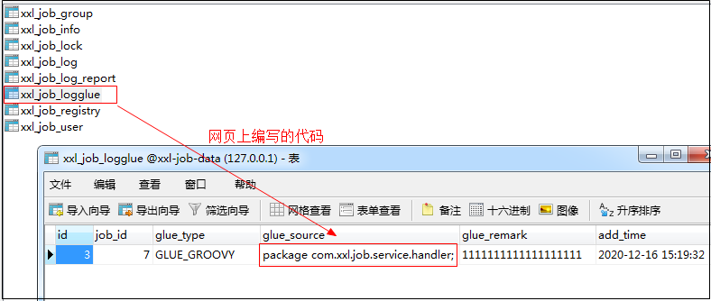

### 分片广播任务
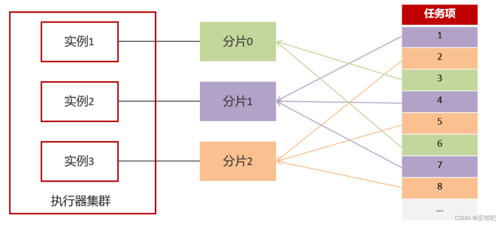

定时任务逻辑里，根据获取到的分片参数、执行任务节点数量，决策当前节点是否需要执行，分片查询数据并处理：

1. 如果 分片序号 > (执行任务节点数量 - 1)，则当前节点不执行任务，直接返回；
2. 否则，取 分片序号 和 执行任务节点数量 作为分片参数，查询数据并处理。

```java
@XxlJob("demoJobHandler")
public void execute() {
    String param = XxlJobHelper.getJobParam();
    if (StringUtils.isBlank(param)) {
        XxlJobHelper.log("任务参数为空");
        XxlJobHelper.handleFail();
        return;
    }

    // 执行任务节点数量
    int executeNodeNum = Integer.valueOf(param);
    // 分片序号
    int shardIndex = XxlJobHelper.getShardIndex();
    // 分片总数
    int shardTotal = XxlJobHelper.getShardTotal();
    if (executeNodeNum <= 0 || executeNodeNum > shardTotal) {
        XxlJobHelper.log("执行任务节点数量取值范围[1,节点总数]");
        XxlJobHelper.handleFail();
        return;
    }

    if (shardIndex > (executeNodeNum - 1)) {
        XxlJobHelper.log("当前分片 {} 无需执行", shardIndex);
        XxlJobHelper.handleSuccess();
        return;
    }
    // 业务逻辑处理
    // ......
    XxlJobHelper.handleSuccess();
}
```

### 自动创建任务
通过调用 xxl-job 提供的接口可以自动创建任务

注意：这些接口都是后台使用的，必须登录才行，否则会被拦截器拦截。通过@PermissionLimit(limit = false)注解可以跳过登录验证

```java
/*------------------自定义方法----------------------  */
@RequestMapping("/addJob")
@ResponseBody
@PermissionLimit(limit = false)
public ReturnT<String> addJobInfo(@RequestBody XxlJobInfo jobInfo) {
    return xxlJobService.add(jobInfo);
}

@RequestMapping("/updateJob")
@ResponseBody
@PermissionLimit(limit = false)
public ReturnT<String> updateJobCron(@RequestBody XxlJobInfo jobInfo) {
    return xxlJobService.updateCron(jobInfo);
}

@RequestMapping("/removeJob")
@ResponseBody
@PermissionLimit(limit = false)
public ReturnT<String> removeJob(@RequestBody XxlJobInfo jobInfo) {
    return xxlJobService.remove(jobInfo.getId());
}

@RequestMapping("/pauseJob")
@ResponseBody
@PermissionLimit(limit = false)
public ReturnT<String> pauseJob(@RequestBody XxlJobInfo jobInfo) {
    return xxlJobService.stop(jobInfo.getId());
}

@RequestMapping("/startJob")
@ResponseBody
@PermissionLimit(limit = false)
public ReturnT<String> startJob(@RequestBody XxlJobInfo jobInfo) {
    return xxlJobService.start(jobInfo.getId());
}

@RequestMapping("/addAndStart")
@ResponseBody
@PermissionLimit(limit = false)
public ReturnT<String> addAndStart(@RequestBody XxlJobInfo jobInfo) {
    ReturnT<String> result = xxlJobService.add(jobInfo);
    int id = Integer.valueOf(result.getContent());
    xxlJobService.start(id);
    return result;
}
```

