## 版本依赖

```xml
<dependency>
    <groupId>com.alibaba</groupId>
    <artifactId>easyexcel</artifactId>
    <version>3.3.3</version>
</dependency>
```

## 核心注解

### @ExcelProperty

`@ExcelProperty` 是 EasyExcel 中最核心的注解，用于指定字段与 Excel 列的映射关系。

**主要属性**

| 属性 | 类型 | 说明 | 优先级 |
|------|------|------|--------|
| `value` | String [] | 指定列头名称，支持多级表头 | 3 |
| `order` | int | 指定列的顺序，值越小越靠前 | 2 |
| `index` | int | 指定列的绝对位置（从 0 开始） | 1 |
| `converter` | Class | 指定数据类型转换器 | - |

> **优先级说明**：index > order > value > 默认配置

#### value - 指定列头

**基础用法**

指定当前字段对应 excel 中的那一列，可以根据名字或者 Index 去匹配，当然也可以不写。


```java
@Data
public class User {

    private Integer userId;

    private String name;

    private String phone;

    private String email;

    private Date createTime;
}
```

```java
@RestController
public class TestController {

    @GetMapping("/test1")
    public void test1(HttpServletResponse response) {
        try {
            response.setContentType("application/vnd.ms-excel");
            response.setCharacterEncoding("utf-8");
            String fileName = URLEncoder.encode("test1", "UTF-8").replaceAll("\\+", "%20");
            response.setHeader("Content-disposition", "attachment;filename" + fileName + ".xls");

            User user = new User();
            user.setUserId(123);
            user.setName("as");
            user.setPhone("15213");
            user.setEmail("5456");
            user.setCreateTime(13213L);
            EasyExcel.write(response.getOutputStream(), User.class)
                    .sheet("test")
                    .doWrite(Arrays.asList(user));
        } catch (Exception e) {
            e.printStackTrace();
        }
    }
}
```

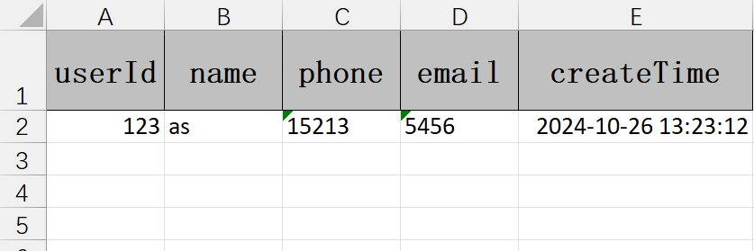

默认情况下，使用类的属性名作为 Excel 的列表，当然也可以使用 `@ExcelProperty` 注解来重新指定属性名称。


```java
@Data
public class User {
    @ExcelProperty(value = "用户Id")
    private Integer userId;
    
    @ExcelProperty(value = "姓名")
    private String name;
    
    @ExcelProperty(value = "手机")
    private String phone;
    
    @ExcelProperty(value = "邮箱")
    private String email;
    
    @ExcelProperty(value = "创建时间")
    private Date createTime;
}
```

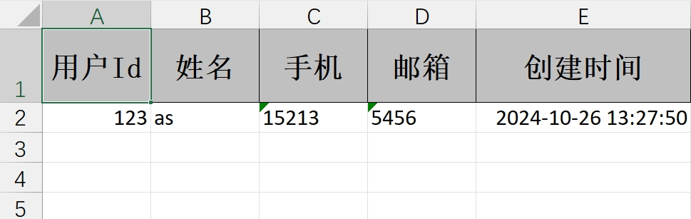

**多级表头（表头合并）**

```java
@Data
public class User {
    @ExcelProperty(value = "用户Id")
    private Integer userId;
    
    @ExcelProperty(value = {"用户基本信息", "姓名"})
    private String name;
    
    @ExcelProperty(value = {"用户基本信息", "手机"})
    private String phone;
    
    @ExcelProperty(value = {"用户基本信息", "邮箱"})
    private String email;
    
    @ExcelProperty(value = "创建时间")
    private Date createTime;
}
```

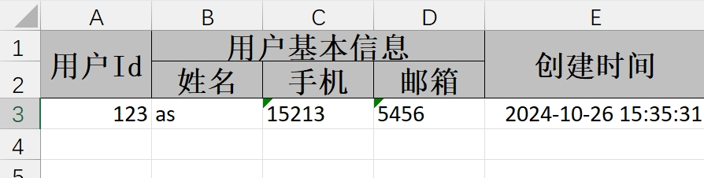

#### index - 指定绝对位置

`@ExcelProperty` 注解有两个属性 index 和 order，如果不指定则按照属性在类中的排列顺序来。index 是指定该属性在 Excel 中列的下标，下标从 0 开始

```java
@Data
public class User {
    @ExcelProperty(value = "用户Id", index = 2)
    private Integer userId;
    
    @ExcelProperty(value = "姓名", index = 1)
    private String name;
    
    @ExcelProperty(value = "手机")
    private String phone;
    
    @ExcelProperty(value = "邮箱")
    private String email;
    
    @ExcelProperty(value = "创建时间")
    private Date createTime;
}
```

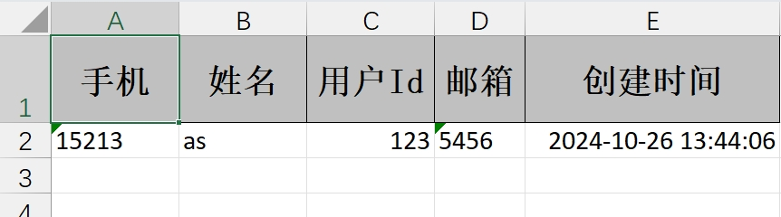

```java
@Data
public class User {
    @ExcelProperty(value = "用户Id", index = 2)
    private Integer userId;
    
    @ExcelProperty(value = "姓名", index = 1)
    private String name;
    
    @ExcelProperty(value = "手机", index = 10)
    private String phone;
    
    @ExcelProperty(value = "邮箱", index = 12)
    private String email;
    
    @ExcelProperty(value = "创建时间")
    private Date createTime;
}
```

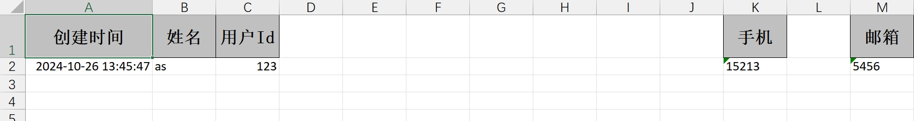

#### order - 指定相对顺序

order 的默认值为 Integer.MAX_VALUE，通过效果我们可以得出结论：order 值越小，越排在前面


```java
@Data
public class User {
    @ExcelProperty(value = "用户Id", index = 2)
    private Integer userId;
    
    @ExcelProperty(value = "姓名", index = 1)
    private String name;
    
    @ExcelProperty(value = "手机", index = 10)
    private String phone;
    
    @ExcelProperty(value = "邮箱", index = 12)
    private String email;
    
    @ExcelProperty(value = "创建时间")
    private Date createTime;
}
```

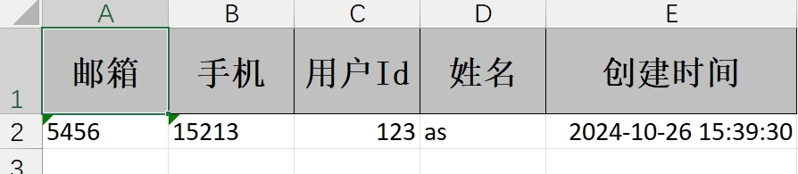

#### converter - 自定义转换器

**日期时间转换器**

在读写 EXCEL 时，有时候需要我们进行数据类型转换，例如我们这里的创建时间，在实体对象中是 Long 类型，但是这样直接导出到 Excel 中不太直观。我们需要转换成 yyyy-MM-dd HH: mm: ss 格式，此时我们就可以用到转换器。


```java
public class DateTimeConverter implements Converter<Long> {

    private final DateTimeFormatter dateTimeFormatter = DateTimeFormatter.ofPattern("yyyy-MM-dd HH:mm:ss");

    // 支持导入的Java类型
    @Override
    public Class<?> supportJavaTypeKey() {
        return Long.class;
    }

    // 支持导出的Excel类型
    @Override
    public CellDataTypeEnum supportExcelTypeKey() {
        return CellDataTypeEnum.STRING;
    }

    // 转换为Java
    @Override
    public Long convertToJavaData(ReadCellData<?> cellData, ExcelContentProperty contentProperty, GlobalConfiguration globalConfiguration) throws Exception {
        return null;
    }

    // 转换为Excel
    @Override
    public WriteCellData<?> convertToExcelData(Long value, ExcelContentProperty contentProperty, GlobalConfiguration globalConfiguration) throws Exception {
        if (value == null) {
            return new WriteCellData(CellDataTypeEnum.STRING, null);
        }
        LocalDateTime localDateTime = LocalDateTime.ofInstant(Instant.ofEpochMilli(value), ZoneId.systemDefault());
        String dateStr = localDateTime.format(dateTimeFormatter);
        return new WriteCellData(dateStr);
    }
}
```

```java
@Data
public class User {
    @ExcelProperty(value = "用户Id")
    private Integer userId;
    
    @ExcelProperty(value = "姓名")
    private String name;
    
    @ExcelProperty(value = "手机", order = 11)
    private String phone;
    
    @ExcelProperty(value = "邮箱", order = 10)
    private String email;
    
    @ExcelProperty(value = "创建时间", converter = DateTimeConverter.class)
    private Long createTime;
}
```

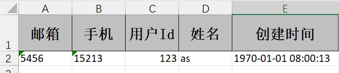

**枚举转换器**

```java
/**
 * Excel 性别转换器
 */
public class GenderConverter implements Converter<Integer> {
    @Override
    public Class<?> supportJavaTypeKey() {
        return Integer.class;
    }

    @Override
    public CellDataTypeEnum supportExcelTypeKey() {
        return CellDataTypeEnum.STRING;
    }

    @Override
    public Integer convertToJavaData(ReadConverterContext<?> context) {
        return GenderEnum.convert(context.getReadCellData().getStringValue()).getValue();
    }

    @Override
    public WriteCellData<?> convertToExcelData(WriteConverterContext<Integer> context) {
        return new WriteCellData<>(GenderEnum.convert(context.getValue()).getDescription());
    }
}
```

```java
/**
 * 性别枚举
 */
@Getter
@AllArgsConstructor
public enum GenderEnum {

    UNKNOWN(0, "未知"),
    MALE(1, "男性"),
    FEMALE(2, "女性");

    private final Integer value;

    private final String description;

    public static GenderEnum convert(Integer value) {
        return Stream.of(values())
                .filter(bean -> bean.value.equals(value))
                .findAny()
                .orElse(UNKNOWN);
    }

    public static GenderEnum convert(String description) {
        return Stream.of(values())
                .filter(bean -> bean.description.equals(description))
                .findAny()
                .orElse(UNKNOWN);
    }
}
```


### @ExcelIgnore

默认所有字段都会和 excel 去匹配，加了这个注解会忽略该字段，不参与 Excel 的读写操作。

```java
@Data
public class User {
    @ExcelProperty(value = "用户Id")
    private Integer userId;
    
    @ExcelProperty(value = "姓名")
    private String name;
    
    @ExcelProperty(value = "手机")
    private String phone;
    
    @ExcelProperty(value = "邮箱")
    @ExcelIgnore //忽略该字段
    private String email;
    
    @ExcelProperty(value = "创建时间", converter = DateTimeConverter.class)
    @ExcelIgnore //忽略该字段
    private Long createTime;
}
```

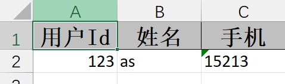

### @ExcelIgnoreUnannotated

类级别注解，只处理带有 `@ExcelProperty` 注解的字段。不标注该注解时，默认类中所有成员变量都会参与读写，无论是否在成员变量上加了 `@ExcelProperty` 的注解。标注该注解后，类中的成员变量如果没有标注 `@ExcelProperty` 注解将不会参与读写。

```java
@ExcelIgnoreUnannotated
@Data
public class User {
    @ExcelProperty(value = "用户Id")
    private Integer userId;

    @ExcelProperty(value = "姓名")
    private String name;

    @ExcelProperty(value = "手机")
    private String phone;

    // 以下字段将被忽略，因为没有 @ExcelProperty 注解
    private String email;
    private Long createTime;
}
```

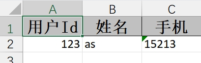

## 样式注解

### @ColumnWidth

设置列宽（单位：字符宽度）。

```java
@Data
public class User {

    @ColumnWidth(200)
    @ExcelProperty(value = "用户Id")
    private Integer userId;

    @ExcelProperty(value = "姓名")
    private String name;

    @ExcelProperty(value = "手机")
    private String phone;

    @ExcelProperty(value = "邮箱")
    private String email;

    @ExcelProperty(value = "创建时间", converter = DateTimeConverter.class)
    private Long createTime;
}
```

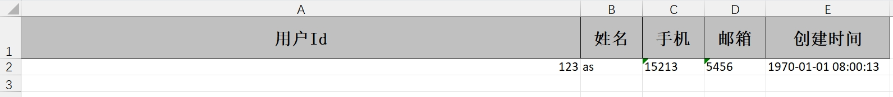

### @ContentRowHeight

标注在类上，设置内容行高（单位：像素）。

```java
@Data
@ContentRowHeight(value = 50)
public class User {

    @ExcelProperty(value = "用户Id")
    private Integer userId;

    @ExcelProperty(value = "姓名")
    private String name;

    @ExcelProperty(value = "手机")
    private String phone;

    @ExcelProperty(value = "邮箱")
    private String email;

    @ExcelProperty(value = "创建时间", converter = DateTimeConverter.class)
    private Long createTime;
}
```

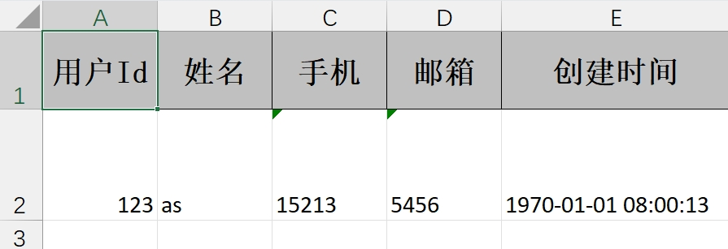

### @HeadRowHeight

标注在类上，设置表头行高（单位：像素）。

```java
@Data
@HeadRowHeight(80)
@ContentRowHeight(value = 50)
public class User {

    @ExcelProperty(value = "用户Id")
    private Integer userId;

    @ExcelProperty(value = "姓名")
    private String name;

    @ExcelProperty(value = "手机")
    private String phone;

    @ExcelProperty(value = "邮箱")
    private String email;

    @ExcelProperty(value = "创建时间", converter = DateTimeConverter.class)
    private Long createTime;
}
```

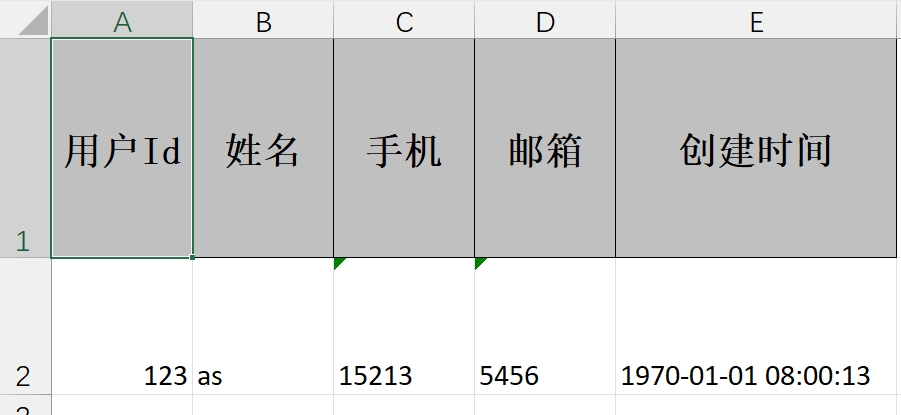

### @ContentStyle

用于设置单元格内容样式。

| 属性 | 类型 | 说明 |
|------|------|------|
| dataFormat | int | 日期格式 |
| hidden | boolean | 设置单元格使用此样式隐藏 |
| locked | boolean | 设置单元格使用此样式锁定 |
| quotePrefix | boolean | 在单元格前面增加`符号，数字或公式将以字符串形式展示 |
| horizontalAlignment | HorizontalAlignment | 设置是否水平居中 |
| wrapped | boolean | 设置文本是否应换行。将此标志设置为 true 通过在多行上显示使单元格中的所有内容可见 |
| verticalAlignment | VerticalAlignment | 设置是否垂直居中 |
| rotation | short | 设置单元格中文本旋转角度。03 版本的 Excel 旋转角度区间为-90°90°，07 版本的 Excel 旋转角度区间为 0°180° |
| indent | short | 设置单元格中缩进文本的空格数 |
| borderLeft | BorderStyle | 设置左边框的样式 |
| borderRight | BorderStyle | 设置右边框样式 |
| borderTop | BorderStyle | 设置上边框样式 |
| borderBottom | BorderStyle | 设置下边框样式 |
| leftBorderColor | short | 设置左边框颜色 |
| rightBorderColor | short | 设置右边框颜色 |
| topBorderColor | short | 设置上边框颜色 |
| bottomBorderColor | short | 设置下边框颜色 |
| fillPatternType | FillPatternType | 设置填充类型 |
| fillBackgroundColor | short | 设置背景色 |
| fillForegroundColor | short | 设置前景色 |
| shrinkToFit | boolean | 设置自动单元格自动大小 |


```java
@Data
public class User {
    @ExcelProperty(value = "用户ID")
    @ContentStyle(
        horizontalAlignment = HorizontalAlignment.CENTER,
        fillForegroundColor = 22,  // 浅灰色背景
        fillPatternType = FillPatternType.SOLID_FOREGROUND
    )
    private Integer userId;

    @ExcelProperty(value = "姓名")
    @ContentStyle(
        horizontalAlignment = HorizontalAlignment.LEFT,
        wrapped = true  // 自动换行
    )
    private String name;

    @ExcelProperty(value = "手机号")
    @ContentStyle(
        horizontalAlignment = HorizontalAlignment.CENTER
    )
    private String phone;

    @ExcelProperty(value = "邮箱")
    @ContentStyle(
        horizontalAlignment = HorizontalAlignment.LEFT,
        wrapped = true
    )
    private String email;

    @ExcelProperty(value = "创建时间", converter = DateTimeConverter.class)
    @ContentStyle(
        horizontalAlignment = HorizontalAlignment.CENTER,
        dataFormat = 22  // 日期格式
    )
    private Long createTime;
}
```

### @ContentFontStyle

用于设置单元格内容字体样式。

| 属性 | 类型 | 说明 |
|------|------|------|
| fontName | String | 字体名称 |
| fontHeightInPoints | short | 字体高度 |
| italic | boolean | 是否斜体 |
| strikeout | boolean | 是否设置删除水平线 |
| color | short | 字体颜色 |
| typeOffset | short | 偏移量 |
| underline | byte | 下划线 |
| bold | boolean | 是否加粗 |
| charset | int | 编码格式 |


```java
@Data
public class User {
    @ExcelProperty(value = "用户ID")
    @ContentFontStyle(
        fontName = "微软雅黑",
        fontHeightInPoints = 12,
        bold = true,
        color = IndexedColors.BLUE.getIndex()
    )
    private Integer userId;

    @ExcelProperty(value = "姓名")
    @ContentFontStyle(
        fontName = "宋体",
        fontHeightInPoints = 11
    )
    private String name;

    @ExcelProperty(value = "手机号")
    @ContentFontStyle(
        fontName = "微软雅黑",
        fontHeightInPoints = 11
    )
    private String phone;

    @ExcelProperty(value = "邮箱")
    @ContentFontStyle(
        fontName = "微软雅黑",
        fontHeightInPoints = 11,
        italic = true
    )
    private String email;

    @ExcelProperty(value = "创建时间", converter = DateTimeConverter.class)
    @ContentFontStyle(
        fontName = "微软雅黑",
        fontHeightInPoints = 11
    )
    private Long createTime;
}
```

### @HeadStyle

用于设置标题样式。

| 属性 | 类型 | 说明 |
|------|------|------|
| dataFormat | int | 日期格式 |
| hidden | boolean | 设置单元格使用此样式隐藏 |
| locked | boolean | 设置单元格使用此样式锁定 |
| quotePrefix | boolean | 在单元格前面增加`符号，数字或公式将以字符串形式展示 |
| horizontalAlignment | HorizontalAlignment | 设置是否水平居中 |
| wrapped | boolean | 设置文本是否应换行。将此标志设置为 true 通过在多行上显示使单元格中的所有内容可见 |
| verticalAlignment | VerticalAlignment | 设置是否垂直居中 |
| rotation | short | 设置单元格中文本旋转角度。03 版本的 Excel 旋转角度区间为-90°90°，07 版本的 Excel 旋转角度区间为 0°180° |
| indent | short | 设置单元格中缩进文本的空格数 |
| borderLeft | BorderStyle | 设置左边框的样式 |
| borderRight | BorderStyle | 设置右边框样式 |
| borderTop | BorderStyle | 设置上边框样式 |
| borderBottom | BorderStyle | 设置下边框样式 |
| leftBorderColor | short | 设置左边框颜色 |
| rightBorderColor | short | 设置右边框颜色 |
| topBorderColor | short | 设置上边框颜色 |
| bottomBorderColor | short | 设置下边框颜色 |
| fillPatternType | FillPatternType | 设置填充类型 |
| fillBackgroundColor | short | 设置背景色 |
| fillForegroundColor | short | 设置前景色 |
| shrinkToFit | boolean | 设置自动单元格自动大小 |


```java
@Data
public class User {
    @ExcelProperty(value = "用户ID")
    @HeadStyle(
        horizontalAlignment = HorizontalAlignment.CENTER,
        fillForegroundColor = 44,  // 深蓝色背景
        fillPatternType = FillPatternType.SOLID_FOREGROUND
    )
    private Integer userId;

    @ExcelProperty(value = "姓名")
    @HeadStyle(
        horizontalAlignment = HorizontalAlignment.CENTER,
        fillForegroundColor = 44,
        fillPatternType = FillPatternType.SOLID_FOREGROUND
    )
    private String name;

    @ExcelProperty(value = "手机号")
    @HeadStyle(
        horizontalAlignment = HorizontalAlignment.CENTER,
        fillForegroundColor = 44,
        fillPatternType = FillPatternType.SOLID_FOREGROUND
    )
    private String phone;

    @ExcelProperty(value = "邮箱")
    @HeadStyle(
        horizontalAlignment = HorizontalAlignment.CENTER,
        fillForegroundColor = 44,
        fillPatternType = FillPatternType.SOLID_FOREGROUND
    )
    private String email;

    @ExcelProperty(value = "创建时间", converter = DateTimeConverter.class)
    @HeadStyle(
        horizontalAlignment = HorizontalAlignment.CENTER,
        fillForegroundColor = 44,
        fillPatternType = FillPatternType.SOLID_FOREGROUND
    )
    private Long createTime;
}
```

### @HeadFontStyle

用于设置表头字体样式。

| 属性 | 类型 | 说明 |
|------|------|------|
| fontName | String | 设置字体名称 |
| fontHeightInPoints | short | 设置字体高度 |
| italic | boolean | 设置字体是否斜体 |
| strikeout | boolean | 是否设置删除线 |
| color | short | 设置字体颜色 |
| typeOffset | short | 设置偏移量 |
| underline | byte | 设置下划线 |
| charset | int | 设置字体编码 |
| bold | boolean | 设置字体是否加粗 |


```java
@Data
public class User {
    @ExcelProperty(value = "用户ID")
    @HeadFontStyle(
        fontName = "微软雅黑",
        fontHeightInPoints = 12,
        bold = true,
        color = IndexedColors.WHITE.getIndex()
    )
    private Integer userId;

    @ExcelProperty(value = "姓名")
    @HeadFontStyle(
        fontName = "微软雅黑",
        fontHeightInPoints = 12,
        bold = true,
        color = IndexedColors.WHITE.getIndex()
    )
    private String name;

    @ExcelProperty(value = "手机号")
    @HeadFontStyle(
        fontName = "微软雅黑",
        fontHeightInPoints = 12,
        bold = true,
        color = IndexedColors.WHITE.getIndex()
    )
    private String phone;

    @ExcelProperty(value = "邮箱")
    @HeadFontStyle(
        fontName = "微软雅黑",
        fontHeightInPoints = 12,
        bold = true,
        color = IndexedColors.WHITE.getIndex()
    )
    private String email;

    @ExcelProperty(value = "创建时间", converter = DateTimeConverter.class)
    @HeadFontStyle(
        fontName = "微软雅黑",
        fontHeightInPoints = 12,
        bold = true,
        color = IndexedColors.WHITE.getIndex()
    )
    private Long createTime;
}
```

## 合并单元格注解

### @ContentLoopMerge

循环合并单元格，作用于字段上。

| 属性 | 类型 | 说明 |
|------|------|------|
| eachRow | int | 合并列 |
| columnExtend | int | 合并行 |

```java
@Data
public class User {
    @ExcelProperty(value = "用户ID")
    @ContentLoopMerge(eachRow = 2)  // 每 2 行合并一次
    private Integer userId;

    @ExcelProperty(value = "姓名")
    private String name;

    @ExcelProperty(value = "手机号")
    private String phone;

    @ExcelProperty(value = "邮箱")
    private String email;

    @ExcelProperty(value = "创建时间", converter = DateTimeConverter.class)
    private Long createTime;
}
```

### @OnceAbsoluteMerge

绝对位置合并单元格，作用于类上。

| 属性 | 类型 | 说明 |
|------|------|------|
| firstRowIndex | int | 第一行下标 |
| lastRowIndex | int | 最后一行下标 |
| firstColumnIndex | int | 第一列下标 |
| lastColumnIndex | int | 最后一列下标 |

```java
@Data
@OnceAbsoluteMerge(firstRowIndex = 1, lastRowIndex = 3, firstColumnIndex = 0, lastColumnIndex = 0)
public class User {
    @ExcelProperty(value = "用户ID")
    private Integer userId;

    @ExcelProperty(value = "姓名")
    private String name;

    @ExcelProperty(value = "手机号")
    private String phone;

    @ExcelProperty(value = "邮箱")
    private String email;

    @ExcelProperty(value = "创建时间", converter = DateTimeConverter.class)
    private Long createTime;
}
```

## 格式转换注解

### @DateTimeFormat

日期格式转换，用于读取 Excel 文件时用 String 去接收 excel 日期格式的数据会调用这个注解，里面的 value 参照 java.text.SimpleDateFormat

```java
@Data
public class User {
    @ExcelProperty(value = "用户ID")
    private Integer userId;

    @ExcelProperty(value = "姓名")
    private String name;

    @ExcelProperty(value = "手机号")
    private String phone;

    @ExcelProperty(value = "邮箱")
    private String email;

    @DateTimeFormat("yyyy-MM-dd")
    @ExcelProperty(value = "创建时间")
    private Date createTime;
}
```

### @NumberFormat

数字格式转换，用于读取 Excel 文件时用 String 去接收 excel 数字格式的数据会调用这个注解，里面的 value 参照 java.text.DecimalFormat

```java
@Data
public class User {
    @ExcelProperty(value = "用户ID")
    private Integer userId;

    @ExcelProperty(value = "姓名")
    private String name;

    @ExcelProperty(value = "手机号")
    private String phone;

    @ExcelProperty(value = "邮箱")
    private String email;

    @NumberFormat("#.##%")
    @ExcelProperty(value = "完成率")
    private Double completionRate;
}
```
