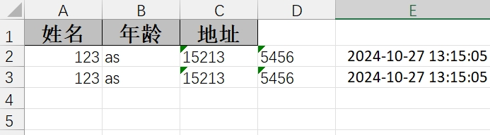
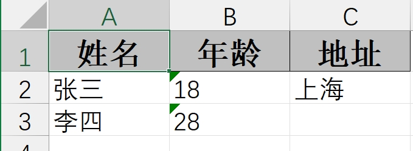
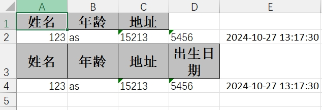
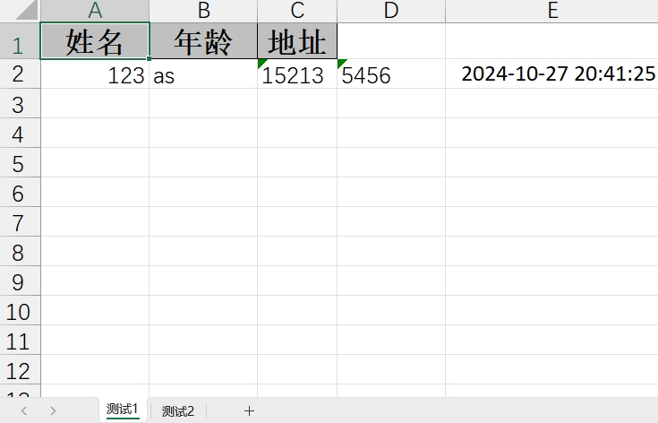

## 📋 目录

- [导出方式对比](#导出方式对比)
- [响应头设置](#响应头设置)
- [单Sheet导出](#单sheet导出)
  - [一次性写入数据](#一次性写入数据)
  - [分批写入数据](#分批写入数据)
  - [自定义表头](#自定义表头)
  - [自定义内容](#自定义内容)
  - [多表头写入](#多表头写入)
- [多Sheet导出](#多sheet导出)
- [高级功能](#高级功能)
  - [样式自定义](#样式自定义)
  - [列宽设置](#列宽设置)
  - [单元格合并](#单元格合并)

## 🔄 导出方式对比

| 导出方式 | 适用场景 | 优点 | 缺点 |
|----------|----------|------|------|
| **一次性写入** | 小数据量、简单导出 | 代码简单、易于理解 | 内存占用大、大数据量时性能差 |
| **分批写入** | 大数据量、复杂导出 | 内存占用小、性能好 | 代码复杂、需要手动管理流 |

## 🌐 响应头设置

通过设置文件导出的响应头，可以自定义文件导出的名字信息等，确保文件能够正确下载和显示。

### 标准响应头配置

```java
/**
 * 设置Excel文件下载响应头
 * @param response HTTP响应对象
 * @param fileName 文件名（不包含扩展名）
 * @throws Exception 异常
 */
public static void setExcelResponseHeaders(HttpServletResponse response, String fileName) 
        throws Exception {
    
    // 设置字符编码为UTF-8
    response.setCharacterEncoding("UTF-8");
    
    // 设置内容类型为Excel文件，让服务器告诉浏览器它发送的数据属于excel文件类型
    response.setContentType("application/vnd.ms-excel;charset=UTF-8");
    
    // 设置传输编码格式
    response.setHeader("Content-Transfer-Encoding", "binary");
    
    // 设置缓存控制，防止缓存
    // must-revalidate：强制页面不缓存，post-check=0, pre-check=0：0秒后，在显示给用户之前，该对象被选中进行更新过
    response.setHeader("Cache-Control", "must-revalidate, post-check=0, pre-check=0");
    
    // 设置Pragma头，表示响应可能是任何缓存的，即使它只是通常是非缓存或可缓存的仅在非共享缓存中
    response.setHeader("Pragma", "public");
    
    // 设置文件名，支持中文
    // 告诉浏览器这个文件的名字和类型，attachment：作为附件下载；inline：直接打开
    String encodedFileName = URLEncoder.encode(fileName, "UTF-8").replaceAll("\\+", "%20");
    response.setHeader("Content-Disposition", "attachment;filename=" + encodedFileName + ".xlsx");
}
```

### 响应头参数说明

| 参数 | 说明 | 示例 |
|------|------|------|
| `Content-Type` | 文件类型 | `application/vnd.ms-excel` |
| `Content-Disposition` | 下载方式 | `attachment;filename=xxx.xlsx` |
| `Cache-Control` | 缓存控制 | `must-revalidate, post-check=0, pre-check=0` |
| `Content-Transfer-Encoding` | 传输编码 | `binary` |

## 📊 单Sheet导出

### 一次性写入数据

指定导出内容所对应的对象信息，通过 `doWrite` 写入数据。

> ⚠️ **注意**：`doWrite` 方法必须传入的是集合，即使是单个对象也需要包装成集合。

**实体类定义**

```java
@Data
public class User {

    @ExcelProperty(value = "用户Id")
    private Integer userId;

    @ExcelProperty(value = "姓名")
    private String name;

    @ExcelProperty(value = "手机")
    private String phone;

    @ExcelProperty(value = "邮箱")
    private String email;

    @ExcelProperty(value = "创建时间")
    private Date createTime;
}
```

**控制器实现**

```java
@GetMapping("/download1")
public void download1(HttpServletResponse response) {
    try {
        response.setContentType("application/vnd.ms-excel");
        response.setCharacterEncoding("utf-8");
        // 这里URLEncoder.encode可以防止中文乱码 当然和easyexcel没有关系
        String fileName = URLEncoder.encode("测试", "UTF-8").replaceAll("\\+", "%20");
        response.setHeader("Content-disposition", "attachment;filename=" + fileName + ".xls");

        User user = new User();
        user.setUserId(123);
        user.setName("as");
        user.setPhone("15213");
        user.setEmail("5456");
        user.setCreateTime(new Date());
        EasyExcel.write(response.getOutputStream(), User.class)
                .sheet("模板")
                .doWrite(Arrays.asList(user));
    } catch (Exception e) {
        e.printStackTrace();
    }
}
```

### 分批写入数据

使用 `ExcelWriter` 和 `WriteSheet` 实现分批写入，适用于大数据量导出场景。

```java
@GetMapping("/download2")
public void download2(HttpServletResponse response) {
    ExcelWriter excelWriter = null;
    try {
        response.setContentType("application/vnd.ms-excel");
        response.setCharacterEncoding("utf-8");
        // 这里URLEncoder.encode可以防止中文乱码 当然和easyexcel没有关系
        String fileName = URLEncoder.encode("测试", "UTF-8").replaceAll("\\+", "%20");
        response.setHeader("Content-disposition", "attachment;filename=" + fileName + ".xls");

        User user = new User();
        user.setUserId(123);
        user.setName("as");
        user.setPhone("15213");
        user.setEmail("5456");
        user.setCreateTime(new Date());

        excelWriter = EasyExcel.write(response.getOutputStream(), User.class).build();
        WriteSheet writeSheet = EasyExcel.writerSheet("测试").build();

        // 业务逻辑处理，分页查询
        excelWriter.write(Arrays.asList(user), writeSheet);
        excelWriter.write(Arrays.asList(user), writeSheet);
    } catch (Exception e) {
        e.printStackTrace();
    } finally {
        if (excelWriter != null) {
            excelWriter.finish();
        }
    }
}
```

通过WriteSheet对象可以指定要写入的Sheet，通过上面方式我们可以手工控制流的关闭，这样我们就可以实现多次写。可以实现分页查询获取数据，然后将数据写入Excel中，避免一次性加载的数据过多，导致内存溢出

> 💡 **提示**：使用 `excelWriter.write` 方式时务必保证至少执行一次 `write`，这样是为了将 sheet 和表头写入 excel，否则打开 excel 时会报错。

### 自定义表头

使用注解的方式定义表头时不能动态控制，每次修改表头内容时只能重新修改代码，这时可以使用 `head()` 方法动态传参自定义表头，避免硬编码。

> ⚠️ **注意**：内容结构必须是 `List<List<T>>`，如果使用 `List<T>` 会出现问题。

```java
@GetMapping("/download3")
public void download3(HttpServletResponse response) {
    ExcelWriter excelWriter = null;
    try {
        response.setContentType("application/vnd.ms-excel");
        response.setCharacterEncoding("utf-8");
        // 这里URLEncoder.encode可以防止中文乱码 当然和easyexcel没有关系
        String fileName = URLEncoder.encode("测试", "UTF-8").replaceAll("\\+", "%20");
        response.setHeader("Content-disposition", "attachment;filename=" + fileName + ".xls");

        User user = new User();
        user.setUserId(123);
        user.setName("as");
        user.setPhone("15213");
        user.setEmail("5456");
        user.setCreateTime(new Date());

        List<List<String>> heads = new ArrayList<>();
        heads.add(Arrays.asList("姓名"));
        heads.add(Arrays.asList("年龄"));
        heads.add(Arrays.asList("地址"));
        excelWriter = EasyExcel.write(response.getOutputStream()).head(heads).build();
        WriteSheet writeSheet = EasyExcel.writerSheet("测试").build();
        excelWriter.write(Arrays.asList(user), writeSheet);
    } catch (Exception e) {
        e.printStackTrace();
    } finally {
        if (excelWriter != null) {
            excelWriter.finish();
        }
    }
}
```




### 自定义内容

当导出的内容不是某个固定的实体类时，希望导出不同的内容时可以通过 `List<List<String>>` 自定义要写入的内容。

```java
@GetMapping("/download5")
public void download5(HttpServletResponse response) {
    ExcelWriter excelWriter = null;
    try {
        response.setContentType("application/vnd.ms-excel");
        response.setCharacterEncoding("utf-8");
        // 这里URLEncoder.encode可以防止中文乱码 当然和easyexcel没有关系
        String fileName = URLEncoder.encode("测试", "UTF-8").replaceAll("\\+", "%20");
        response.setHeader("Content-disposition", "attachment;filename=" + fileName + ".xls");

        List<List<String>> heads = new ArrayList<>();
        heads.add(Arrays.asList("姓名"));
        heads.add(Arrays.asList("年龄"));
        heads.add(Arrays.asList("地址"));
        excelWriter = EasyExcel.write(response.getOutputStream()).head(heads).build();
        WriteSheet writeSheet = EasyExcel.writerSheet("测试").build();

        List<List<String>> dataList = new ArrayList<>();
        dataList.add(Arrays.asList("张三", "18", "上海"));
        dataList.add(Arrays.asList("李四", "28"));
        excelWriter.write(dataList, writeSheet);
    } catch (Exception e) {
        e.printStackTrace();
    } finally {
        if (excelWriter != null) {
            excelWriter.finish();
        }
    }
}
```




### 多表头写入

若业务需求要求在同一个 Sheet 中写多个表，就需要用到 `WriteTable`。只定义一个 `WriteSheet`，有几个表就定义几个 `WriteTable`。

```java
@GetMapping("/download4")
public void download4(HttpServletResponse response) {
    ExcelWriter excelWriter = null;
    try {
        response.setContentType("application/vnd.ms-excel");
        response.setCharacterEncoding("utf-8");
        // 这里URLEncoder.encode可以防止中文乱码 当然和easyexcel没有关系
        String fileName = URLEncoder.encode("测试", "UTF-8").replaceAll("\\+", "%20");
        response.setHeader("Content-disposition", "attachment;filename=" + fileName + ".xls");

        User user = new User();
        user.setUserId(123);
        user.setName("as");
        user.setPhone("15213");
        user.setEmail("5456");
        user.setCreateTime(new Date());

        excelWriter = EasyExcel.write(response.getOutputStream()).build();
        WriteSheet writeSheet = EasyExcel.writerSheet("测试").build();

        List<List<String>> heads1 = new ArrayList<>();
        heads1.add(Arrays.asList("姓名"));
        heads1.add(Arrays.asList("年龄"));
        heads1.add(Arrays.asList("地址"));
        WriteTable writeTable1 = EasyExcel.writerTable(1).head(heads1).needHead(true).build();

        List<List<String>> heads2 = new ArrayList<>();
        heads2.add(Arrays.asList("姓名"));
        heads2.add(Arrays.asList("年龄"));
        heads2.add(Arrays.asList("地址"));
        heads2.add(Arrays.asList("出生日期"));
        WriteTable writeTable2 = EasyExcel.writerTable(2).head(heads2).needHead(true).build();

        excelWriter.write(Arrays.asList(user), writeSheet, writeTable1);
        excelWriter.write(Arrays.asList(user), writeSheet, writeTable2);
    } catch (Exception e) {
        e.printStackTrace();
    } finally {
        if (excelWriter != null) {
            excelWriter.finish();
        }
    }
}
```




## 📑 多Sheet导出

通过 `EasyExcel.writerSheet` 创建对应的 sheet，然后在写入 sheet 时指定对应的 `WriteSheet` 即可，同时可指定每个 Sheet 对应的对象。

```java
@GetMapping("/download6")
public void download6(HttpServletResponse response) {
    ExcelWriter excelWriter = null;
    try {
        response.setContentType("application/vnd.ms-excel");
        response.setCharacterEncoding("utf-8");
        // 这里URLEncoder.encode可以防止中文乱码 当然和easyexcel没有关系
        String fileName = URLEncoder.encode("测试", "UTF-8").replaceAll("\\+", "%20");
        response.setHeader("Content-disposition", "attachment;filename=" + fileName + ".xls");

        List<List<String>> heads = new ArrayList<>();
        heads.add(Arrays.asList("姓名"));
        heads.add(Arrays.asList("年龄"));
        heads.add(Arrays.asList("地址"));
        excelWriter = EasyExcel.write(response.getOutputStream()).head(heads).build();

        WriteSheet writeSheet1 = EasyExcel.writerSheet(0, "测试1").build();
        WriteSheet writeSheet2 = EasyExcel.writerSheet(1, "测试2").build();
        User user = new User();
        user.setUserId(123);
        user.setName("as");
        user.setPhone("15213");
        user.setEmail("5456");
        user.setCreateTime(new Date());
        excelWriter.write(Arrays.asList(user), writeSheet1);
        excelWriter.write(Arrays.asList(user), writeSheet2);
    } catch (Exception e) {
        e.printStackTrace();
    } finally {
        if (excelWriter != null) {
            excelWriter.finish();
        }
    }
}
```




## 🎨 高级功能

### 样式自定义

EasyExcel 支持自定义单元格样式，包括字体、颜色、边框等。

```java
/**
 * 自定义样式导出
 */
@GetMapping("/download7")
public void download7(HttpServletResponse response) {
    try {
        // 设置响应头
        setExcelResponseHeaders(response, "自定义样式数据");
        
        // 创建样式策略
        WriteCellStyle headWriteCellStyle = new WriteCellStyle();
        // 设置表头背景色
        headWriteCellStyle.setFillForegroundColor(IndexedColors.GREY_25_PERCENT.getIndex());
        // 设置表头字体
        WriteFont headWriteFont = new WriteFont();
        headWriteFont.setFontHeightInPoints((short) 12);
        headWriteFont.setBold(true);
        headWriteCellStyle.setWriteFont(headWriteFont);
        
        // 创建内容样式
        WriteCellStyle contentWriteCellStyle = new WriteCellStyle();
        // 设置内容字体
        WriteFont contentWriteFont = new WriteFont();
        contentWriteFont.setFontHeightInPoints((short) 11);
        contentWriteCellStyle.setWriteFont(contentWriteFont);
        
        // 创建样式策略
        HorizontalCellStyleStrategy horizontalCellStyleStrategy = 
            new HorizontalCellStyleStrategy(headWriteCellStyle, contentWriteCellStyle);
        
        // 执行导出
        EasyExcel.write(response.getOutputStream(), UserExportVO.class)
                .registerWriteHandler(horizontalCellStyleStrategy)
                .sheet("自定义样式")
                .doWrite(prepareUserData());
                
    } catch (Exception e) {
        log.error("导出失败", e);
        throw new RuntimeException("导出失败: " + e.getMessage());
    }
}
```

### 列宽设置

可以通过 `ColumnWidthStyleStrategy` 设置列宽。

```java
/**
 * 自定义列宽导出
 */
@GetMapping("/download8")
public void download8(HttpServletResponse response) {
    try {
        // 设置响应头
        setExcelResponseHeaders(response, "自定义列宽数据");
        
        // 创建列宽策略
        ColumnWidthStyleStrategy columnWidthStyleStrategy = new ColumnWidthStyleStrategy();
        
        // 执行导出
        EasyExcel.write(response.getOutputStream(), UserExportVO.class)
                .registerWriteHandler(columnWidthStyleStrategy)
                .sheet("自定义列宽")
                .doWrite(prepareUserData());
    } catch (Exception e) {
        log.error("导出失败", e);
        throw new RuntimeException("导出失败: " + e.getMessage());
    }
}
```

### 单元格合并

支持单元格合并功能，适用于复杂报表导出。

```java
/**
 * 单元格合并导出
 */
@GetMapping("/download9")
public void download9(HttpServletResponse response) {
    ExcelWriter excelWriter = null;
    try {
        // 设置响应头
        setExcelResponseHeaders(response, "单元格合并数据");
        
        // 创建合并策略
        MergeStrategy mergeStrategy = new MergeStrategy();
        
        // 创建ExcelWriter
        excelWriter = EasyExcel.write(response.getOutputStream())
                .registerWriteHandler(mergeStrategy)
                .build();
        
        WriteSheet writeSheet = EasyExcel.writerSheet("合并单元格").build();
        
        // 准备数据
        List<List<String>> dataList = new ArrayList<>();
        dataList.add(Arrays.asList("部门A", "张三", "100"));
        dataList.add(Arrays.asList("部门A", "李四", "200"));
        dataList.add(Arrays.asList("部门B", "王五", "150"));
        dataList.add(Arrays.asList("部门B", "赵六", "180"));
        
        // 写入数据
        excelWriter.write(dataList, writeSheet);
    } catch (Exception e) {
        log.error("导出失败", e);
        throw new RuntimeException("导出失败: " + e.getMessage());
    } finally {
        if (excelWriter != null) {
            excelWriter.finish();
        }
    }
}

/**
 * 合并策略实现
 */
public class MergeStrategy implements CellWriteHandler {
    
    @Override
    public void afterCellDispose(WriteSheetHolder writeSheetHolder, WriteTableHolder writeTableHolder,
                                List<CellData> cellDataList, Cell cell, Head head, Integer relativeRowIndex, 
                                Boolean isHead) {
        // 实现合并逻辑
        // TODO: 根据业务需求实现具体的合并规则
    }
}
```