## 📋 目录

- [模板导出概述](#模板导出概述)
- [基础模板导出](#基础模板导出)
- [对象填充导出](#对象填充导出)
  - [单个对象填充](#单个对象填充)
  - [List对象填充](#list对象填充)
  - [嵌套对象填充](#嵌套对象填充)
  - [嵌套List填充](#嵌套list填充)
- [Map填充导出](#map填充导出)
  - [简单Map填充](#简单map填充)
  - [嵌套Map填充](#嵌套map填充)

## 🎯 模板导出概述

EasyExcel 的模板导出功能允许开发者使用预定义的 Excel 模板文件，通过占位符和数据填充的方式快速生成格式化的报表。相比直接写入数据，模板导出具有以下优势：

- **格式统一**：保持模板的样式和布局
- **开发效率高**：减少样式配置代码
- **维护简单**：模板和代码分离
- **功能强大**：支持复杂的数据结构填充

## 📄 基础模板导出

### 模板文件导出

获取 resources 目录下的模板文件，使用 `withTemplate` 方法获取文件流导出文件模板。

```java
/**
 * 基础模板文件导出
 */
@GetMapping("/download1")
public void download1(HttpServletResponse response) {
    try (InputStream in = new ClassPathResource("测试.xls").getInputStream()) {
        // 设置响应头
        response.setContentType("application/vnd.ms-excel");
        response.setCharacterEncoding("utf-8");
        String fileName = URLEncoder.encode("测试", "UTF-8").replaceAll("\\+", "%20");
        response.setHeader("Content-disposition", "attachment;filename=" + fileName + ".xls");

        // 执行模板导出
        EasyExcel.write(response.getOutputStream())
                .withTemplate(in)
                .sheet("sheet1")
                .doWrite(Collections.emptyList());
    } catch (Exception e) {
        log.error("模板导出失败", e);
        throw new RuntimeException("导出失败: " + e.getMessage());
    }
}
```

### Maven配置

> ⚠️ **重要**：获取 resources 目录下的文件需要在 maven 中添加以下配置，过滤对应的文件，防止编译生成后的 class 文件找不到对应的文件信息。

```xml
<plugin>
    <groupId>org.apache.maven.plugins</groupId>
    <artifactId>maven-resources-plugin</artifactId>
    <configuration>
        <encoding>UTF-8</encoding>
        <nonFilteredFileExtensions>
            <nonFilteredFileExtension>xls</nonFilteredFileExtension>
            <nonFilteredFileExtension>xlsx</nonFilteredFileExtension>
        </nonFilteredFileExtensions>
    </configuration>
</plugin>
```

## 📊 对象填充导出

### 单个对象填充

使用 `doFill` 方法填充单个对象数据到模板中。

**模板文件示例**

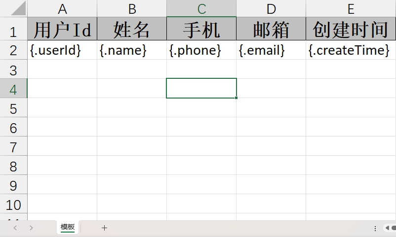

**实体类定义**

```java
@AllArgsConstructor
@NoArgsConstructor
@Data
public class User {

    @ExcelProperty(value = "用户Id")
    private Integer userId;

    @ExcelProperty(value = "姓名")
    private String name;

    @ExcelProperty(value = "手机")
    private String phone;

    @ExcelProperty(value = "邮箱")
    private String email;

    @ExcelProperty(value = "创建时间")
    private Date createTime;
}
```

**控制器实现**

```java
/**
 * 单个对象填充导出
 */
@GetMapping("/download5")
public void download5(HttpServletResponse response) {
    try (InputStream in = new ClassPathResource("测试3.xls").getInputStream()) {
        // 设置响应头
        response.setContentType("application/vnd.ms-excel");
        response.setCharacterEncoding("utf-8");
        String fileName = URLEncoder.encode("测试3", "UTF-8").replaceAll("\\+", "%20");
        response.setHeader("Content-disposition", "attachment;filename=" + fileName + ".xls");

        // 准备数据
        User user = new User(1, "张三", "12345678901", "zhangsan@qq.com", new Date());
        
        // 执行填充导出
        EasyExcel.write(response.getOutputStream(), User.class)
                .withTemplate(in)
                .sheet("模板")
                .doFill(user);
    } catch (Exception e) {
        log.error("对象填充导出失败", e);
        throw new RuntimeException("导出失败: " + e.getMessage());
    }
}
```

> 💡 **提示**：填充模板跟写文件使用的方法不一致，模板填充使用的方法是 `doFill`，而不是 `doWrite`。

**导出结果**

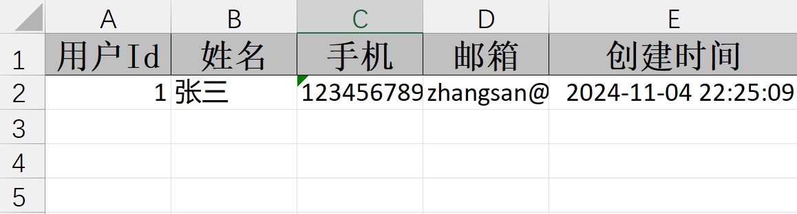

### List对象填充

使用 `doFill` 方法填充对象列表数据到模板中。

**控制器实现**

```java
/**
 * List对象填充导出
 */
@GetMapping("/download2")
public void download2(HttpServletResponse response) {
    try (InputStream in = new ClassPathResource("测试.xls").getInputStream()) {
        // 设置响应头
        response.setContentType("application/vnd.ms-excel");
        response.setCharacterEncoding("utf-8");
        String fileName = URLEncoder.encode("测试", "UTF-8").replaceAll("\\+", "%20");
        response.setHeader("Content-disposition", "attachment;filename=" + fileName + ".xls");

        // 准备数据列表
        List<User> userList = new ArrayList<>();
        userList.add(new User(1, "张三", "12345678901", "zhangsan@qq.com", new Date()));
        userList.add(new User(2, "李四", "12345678902", "lisi@qq.com", new Date()));
        
        // 执行填充导出
        EasyExcel.write(response.getOutputStream(), User.class)
                .withTemplate(in)
                .sheet("模板")
                .doFill(userList);
    } catch (Exception e) {
        log.error("List填充导出失败", e);
        throw new RuntimeException("导出失败: " + e.getMessage());
    }
}
```

**导出结果**

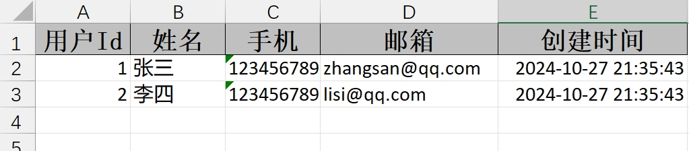

### 嵌套对象填充

EasyExcel 默认不支持对象嵌套对象的填充，需要进行特殊处理。

#### 问题分析

**模板文件示例**

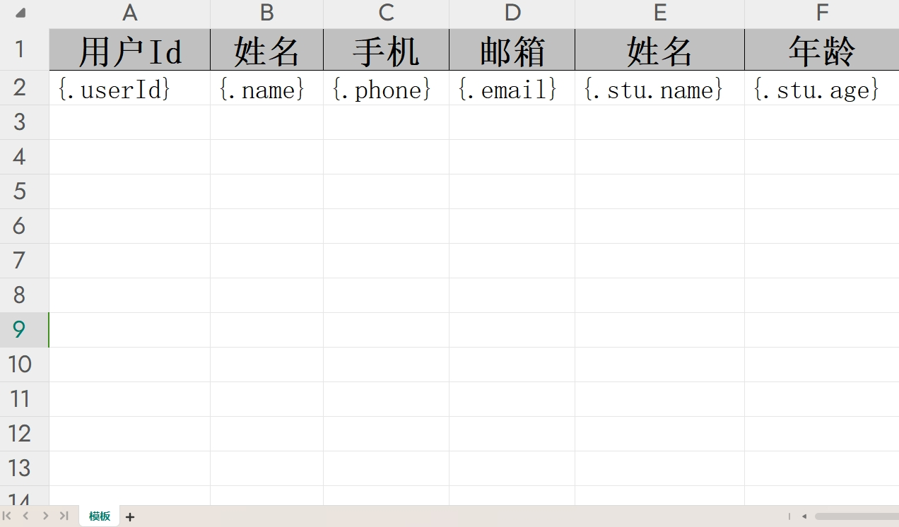

**实体类定义**

```java
@AllArgsConstructor
@NoArgsConstructor
@Data
public class User {

    @ExcelProperty(value = "用户Id")
    private Integer userId;

    @ExcelProperty(value = "姓名")
    private String name;

    @ExcelProperty(value = "手机")
    private String phone;

    @ExcelProperty(value = "邮箱")
    private String email;

    @ExcelProperty(value = "学生")
    private Student stu;

    @NoArgsConstructor
    @AllArgsConstructor
    @Data
    public static class Student {

        @ExcelProperty("姓名")
        private String name;

        @ExcelProperty("年龄")
        private Integer age;
    }
}
```

**控制器实现**

```java
/**
 * 嵌套对象填充导出（默认不支持）
 */
@GetMapping("/download3")
public void download3(HttpServletResponse response) {
    try (InputStream in = new ClassPathResource("测试2.xls").getInputStream()) {
        // 设置响应头
        response.setContentType("application/vnd.ms-excel");
        response.setCharacterEncoding("utf-8");
        String fileName = URLEncoder.encode("测试2", "UTF-8").replaceAll("\\+", "%20");
        response.setHeader("Content-disposition", "attachment;filename=" + fileName + ".xls");

        // 准备嵌套对象数据
        List<User> userList = new ArrayList<>();
        userList.add(new User(1, "张三", "12345678901", "zhangsan@qq.com", new User.Student("张三", 12)));
        userList.add(new User(2, "李四", "12345678902", "lisi@qq.com", new User.Student("李四", 13)));
        
        // 执行填充导出
        EasyExcel.write(response.getOutputStream(), User.class)
                .withTemplate(in)
                .sheet("模板")
                .doFill(userList);
    } catch (Exception e) {
        log.error("嵌套对象填充导出失败", e);
        throw new RuntimeException("导出失败: " + e.getMessage());
    }
}
```

**导出结果**

结果：Student 类的内容没有填充到模板文件中

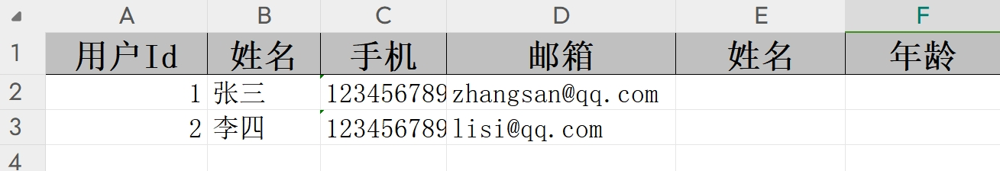

#### 源码分析

查看 `ExcelWriteFillExecutor` 源码可以发现，`dataKeySet` 集合中的数据只有 `stu`（没有 `stu.name` 和 `stu.age`），在 `!dataKeySet.contains(variable)` 方法中判断没有包含该字段信息，所以被过滤掉。

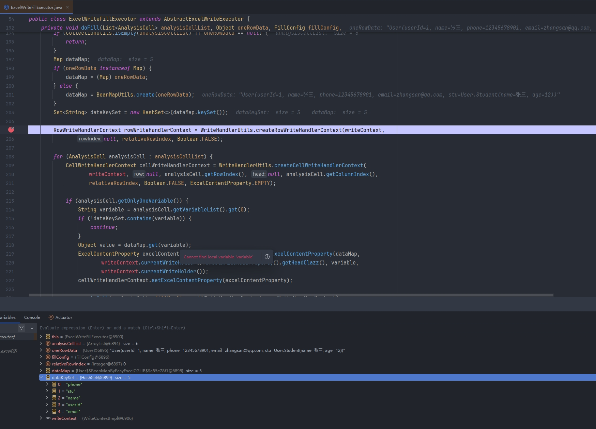

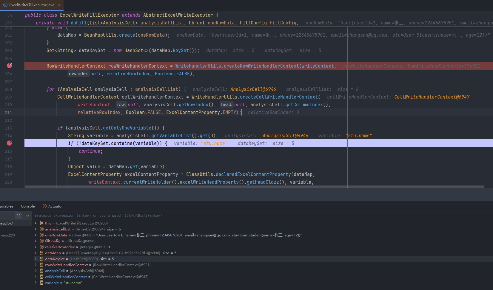

#### 源码扩展支持

在 `com.alibaba.excel.write.executor` 包下创建 `ExcelWriteFillExecutor` 类，跟源码中的类名称一致，尝试修改 `analysisCell.getOnlyOneVariable()` 方法中的逻辑以便支持嵌套对象。

**修改源码逻辑**

```java
if (analysisCell.getOnlyOneVariable()) {
    String variable = analysisCell.getVariableList().get(0);
    String[] split = variable.split("\\.");

    Map map = BeanUtil.copyProperties(dataMap, Map.class);
    Object value = null;
    if (split.length == 1) {
        value = map.get(variable);
    } else {
        int len = split.length - 1;
        for (int i = 0; i < len; i++) {
            Object o = map.get(split[i]);
            map = BeanMapUtils.create(o);
        }
        value = map.get(split[split.length - 1]);
    }

    ExcelContentProperty excelContentProperty = ClassUtils.declaredExcelContentProperty(map,
            writeContext.currentWriteHolder().excelWriteHeadProperty().getHeadClazz(), split[split.length - 1],
            writeContext.currentWriteHolder());
    cellWriteHandlerContext.setExcelContentProperty(excelContentProperty);

    createCell(analysisCell, fillConfig, cellWriteHandlerContext, rowWriteHandlerContext);
    cellWriteHandlerContext.setOriginalValue(value);
    cellWriteHandlerContext.setOriginalFieldClass(FieldUtils.getFieldClass(map, split[split.length - 1], value));

    converterAndSet(cellWriteHandlerContext);
    WriteCellData<?> cellData = cellWriteHandlerContext.getFirstCellData();

    // Restyle
    if (fillConfig.getAutoStyle()) {
        Optional.ofNullable(collectionFieldStyleCache.get(currentUniqueDataFlag))
                .map(collectionFieldStyleMap -> collectionFieldStyleMap.get(analysisCell))
                .ifPresent(cellData::setOriginCellStyle);
    }
}
```

**导出结果**

查看导出的文件内容，此时发现嵌套对象的内容可以导出了

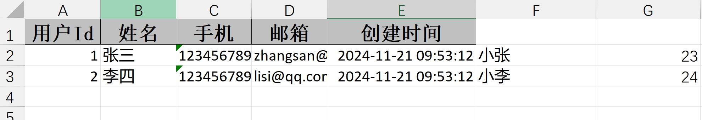

### 嵌套List填充

EasyExcel 默认不支持对象嵌套 List 的填充，需要通过自定义转换器的方式解决。

#### 问题分析

**模板文件示例**

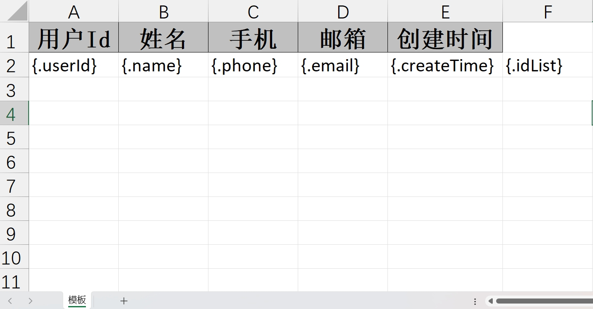

**实体类定义**

```java
@AllArgsConstructor
@NoArgsConstructor
@Data
public class User {

    @ExcelProperty(value = "用户Id")
    private Integer userId;

    @ExcelProperty(value = "姓名")
    private String name;

    @ExcelProperty(value = "手机")
    private String phone;

    @ExcelProperty(value = "邮箱")
    private String email;

    @ExcelProperty(value = "创建时间")
    private Date createTime;

    @ExcelProperty(value = "id列表")
    private List<String> idList;
}
```

**控制器实现**

```java
/**
 * 嵌套List填充导出（默认不支持）
 */
@GetMapping("/download4")
public void download4(HttpServletResponse response) {
    try (InputStream in = new ClassPathResource("测试2.xls").getInputStream()) {
        // 设置响应头
        response.setContentType("application/vnd.ms-excel");
        response.setCharacterEncoding("utf-8");
        String fileName = URLEncoder.encode("测试", "UTF-8").replaceAll("\\+", "%20");
        response.setHeader("Content-disposition", "attachment;filename=" + fileName + ".xls");

        // 准备嵌套List数据
        List<User> userList = new ArrayList<>();
        userList.add(new User(1, "张三", "12345678901", "zhangsan@qq.com", new Date(), Arrays.asList("234", "465")));
        userList.add(new User(2, "李四", "12345678902", "lisi@qq.com", new Date(), Arrays.asList("867", "465")));
        
        // 执行填充导出
        EasyExcel.write(response.getOutputStream(), User.class)
                .withTemplate(in)
                .sheet("模板")
                .doFill(userList);
    } catch (Exception e) {
        log.error("嵌套List填充导出失败", e);
        throw new RuntimeException("导出失败: " + e.getMessage());
    }
}
```

执行后会发现报错：`Can not find 'Converter' support class ArrayList.`

#### 自定义转换器

对于 EasyExcel 默认不支持的数据类型（如 List），可以通过自定义转换器的方式修改导出的内容。

**List转换器实现**

```java
/**
 * List类型自定义转换器
 */
public class ListConvert implements Converter<List> {

    @Override
    public WriteCellData<?> convertToExcelData(List value, ExcelContentProperty contentProperty, 
                                              GlobalConfiguration globalConfiguration) {
        if (value == null || value.isEmpty()) {
            return new WriteCellData<>("");
        }
        // 将List转换为逗号分隔的字符串
        String val = (String) value.stream().collect(Collectors.joining(","));
        return new WriteCellData<>(val);
    }

    @Override
    public List convertToJavaData(ReadCellData<?> cellData, ExcelContentProperty contentProperty, 
                                 GlobalConfiguration globalConfiguration) {
        if (cellData.getStringValue() == null || cellData.getStringValue().isEmpty()) {
            return new ArrayList<>();
        }
        // 将逗号分隔的字符串转换为List
        List list = new ArrayList();
        String[] items = cellData.getStringValue().split(",");
        Collections.addAll(list, items);
        return list;
    }
}
```

**使用自定义转换器**

```java
@AllArgsConstructor
@NoArgsConstructor
@Data
public class User {

    @ExcelProperty(value = "用户Id")
    private Integer userId;

    @ExcelProperty(value = "姓名")
    private String name;

    @ExcelProperty(value = "手机")
    private String phone;

    @ExcelProperty(value = "邮箱")
    private String email;

    @ExcelProperty(value = "创建时间")
    private Date createTime;

    @ExcelProperty(value = "id列表", converter = ListConvert.class)
    private List<String> idList;
}
```

**导出结果**

可以看到 List 列表的数据导出内容为 String 字符串，显示在一个单元格内

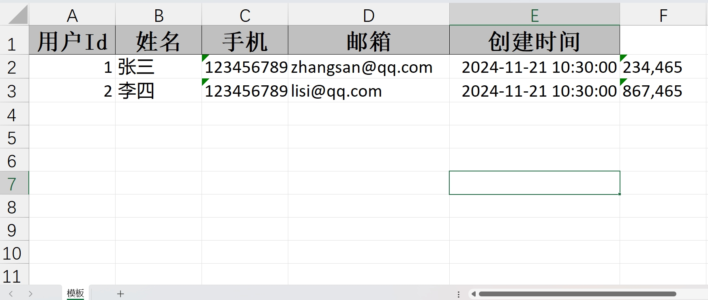


## 🗺️ Map填充导出

### 简单Map填充

使用 Map 对象填充模板数据，注意 Map 跟对象导出有所区别，最前面没有 `\.`。

**模板文件示例**

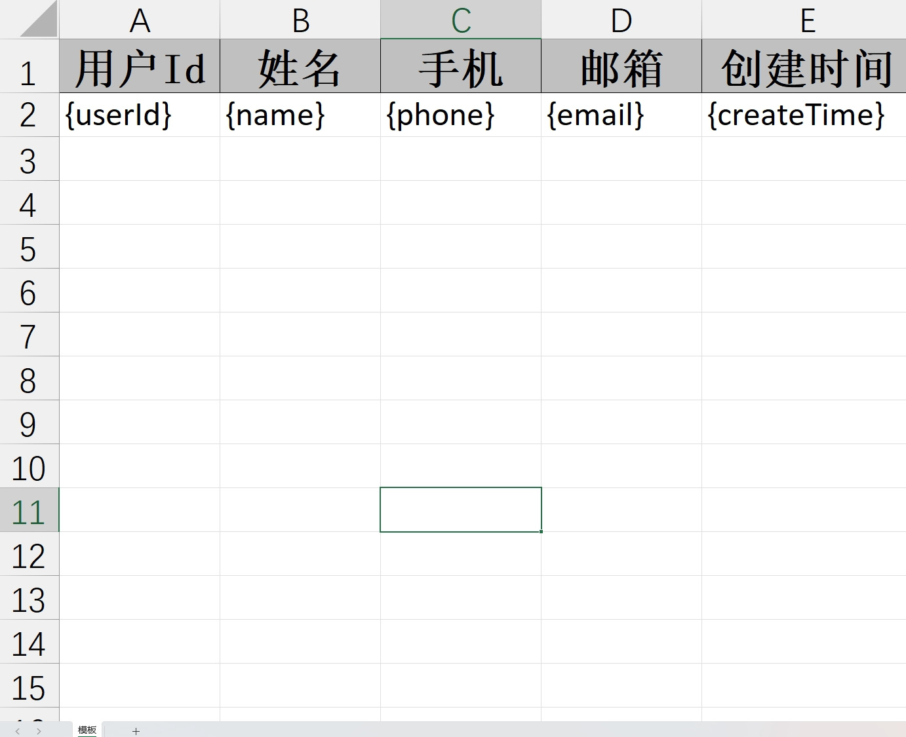

**控制器实现**

```java
/**
 * 简单Map填充导出
 */
@GetMapping("/download4")
public void download4(HttpServletResponse response) {
    try (InputStream in = new ClassPathResource("测试3.xls").getInputStream()) {
        // 设置响应头
        response.setContentType("application/vnd.ms-excel");
        response.setCharacterEncoding("utf-8");
        String fileName = URLEncoder.encode("测试", "UTF-8").replaceAll("\\+", "%20");
        response.setHeader("Content-disposition", "attachment;filename=" + fileName + ".xls");

        // 准备Map数据
        Map<String, String> map = new HashMap<>();
        map.put("userId", "123");
        map.put("name", "张三");
        map.put("phone", "12345678901");
        map.put("email", "zhangsan@qq.com");
        map.put("createTime", "2021-01-01");
        
        // 执行填充导出
        EasyExcel.write(response.getOutputStream(), User.class)
                .withTemplate(in)
                .sheet("模板")
                .doFill(map);
    } catch (Exception e) {
        log.error("Map填充导出失败", e);
        throw new RuntimeException("导出失败: " + e.getMessage());
    }
}
```

**导出结果**

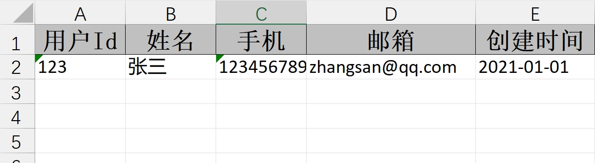

### 嵌套Map填充

EasyExcel 不支持嵌套 Map 的方式导出数据。

**模板文件示例**

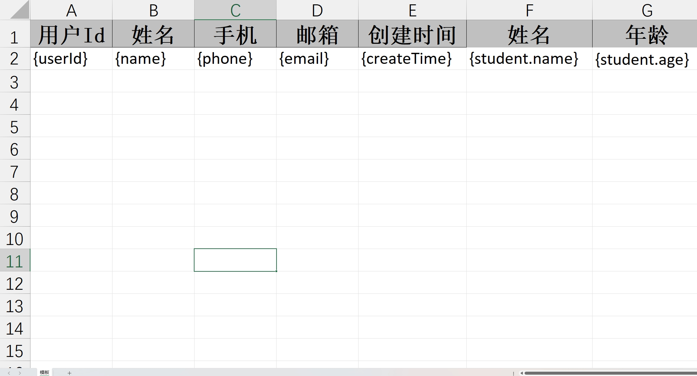

**控制器实现**

```java
/**
 * 嵌套Map填充导出（不支持）
 */
@GetMapping("/download4")
public void download4(HttpServletResponse response) {
    try (InputStream in = new ClassPathResource("测试3.xls").getInputStream()) {
        // 设置响应头
        response.setContentType("application/vnd.ms-excel");
        response.setCharacterEncoding("utf-8");
        String fileName = URLEncoder.encode("测试", "UTF-8").replaceAll("\\+", "%20");
        response.setHeader("Content-disposition", "attachment;filename=" + fileName + ".xls");

        // 准备嵌套Map数据
        Map<String, String> map = new HashMap<>();
        map.put("userId", "123");
        map.put("name", "张三");
        map.put("phone", "12345678901");
        map.put("email", "zhangsan@qq.com");
        map.put("createTime", "2021-01-01");
        map.put("student.name", "小张");
        map.put("student.age", "23");
        
        // 执行填充导出
        EasyExcel.write(response.getOutputStream(), User.class)
                .withTemplate(in)
                .sheet("模板")
                .doFill(map);
    } catch (Exception e) {
        log.error("嵌套Map填充导出失败", e);
        throw new RuntimeException("导出失败: " + e.getMessage());
    }
}
```

**导出结果**

注意：EasyExcel 不支持嵌套的方式导出数据

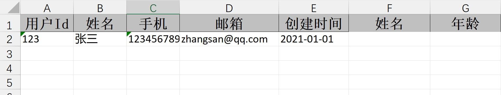