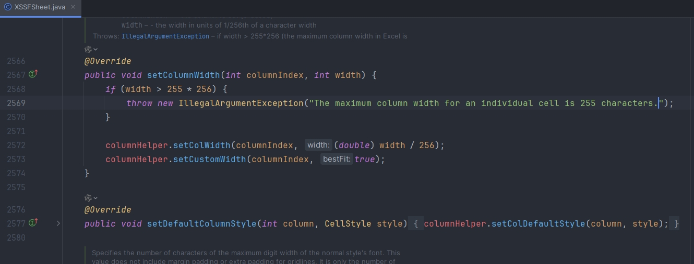
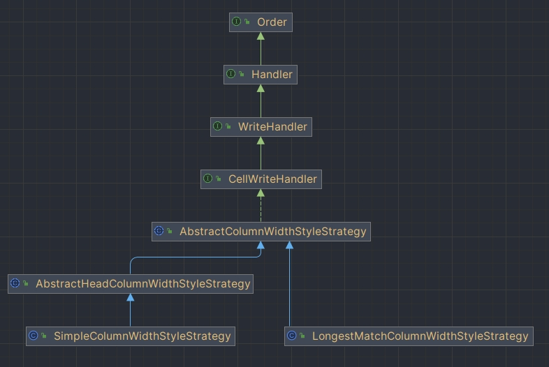
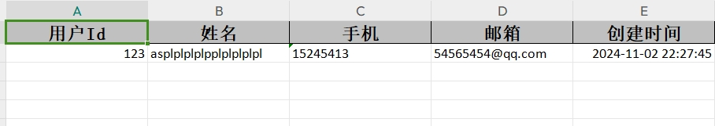
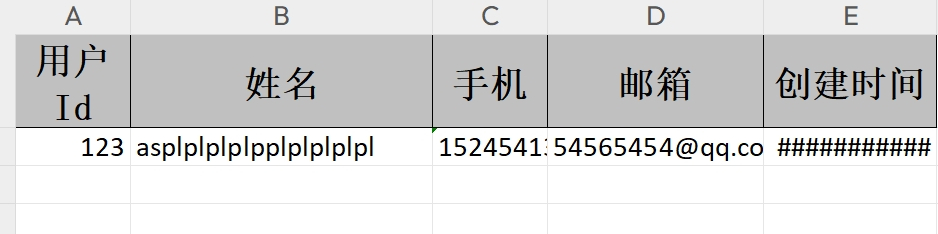
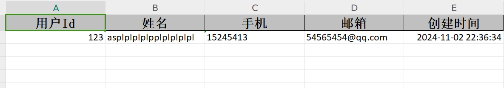
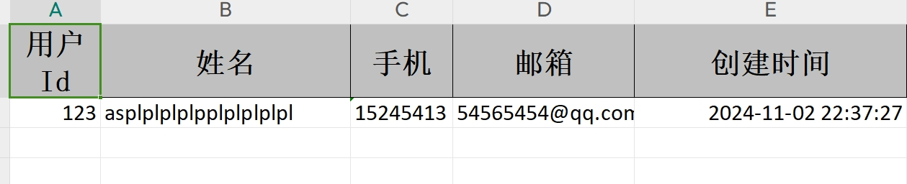

## 列宽设置概述

EasyExcel 提供了多种自定义列宽的方式，可以根据实际需求选择合适的策略：

- **注解方式**：使用 `@ColumnWidth` 注解固定设置列宽
- **策略方式**：使用不同的列宽策略类动态设置列宽
- **自定义策略**：继承抽象类实现自定义列宽逻辑

选择合适的列宽策略可以显著提升 Excel 文件的可读性和美观性，确保数据内容完整显示。

## 注解方式设置列宽

使用 `@ColumnWidth` 注解可以快速为指定字段设置固定列宽。

```java
@Data
public class WidthAndHeightData {
    
    @ExcelProperty("字符串标题")
    private String string;
    
    @ExcelProperty("日期标题")
    private Date date;

    @ColumnWidth(50)  // 设置该列宽度为50
    @ExcelProperty("数字标题")
    private Double doubleData;
}
```

**注意事项：**
- 注解方式只能固定设置列宽，无法动态调整，每次调整列宽需要重新修改代码
- `@ColumnWidth` 的最大值只能为 255，超过 255*256 长度时会报错

**查看XSSFSheet源码**



## 策略方式设置列宽

### 抽象基类




```java
public abstract class AbstractHeadColumnWidthStyleStrategy extends AbstractColumnWidthStyleStrategy {

    @Override
    protected void setColumnWidth(WriteSheetHolder writeSheetHolder, List<WriteCellData<?>> cellDataList, Cell cell, Head head,
        Integer relativeRowIndex, Boolean isHead) {
        // 判断是否满足条件：当前行索引不为空 && （当前是表头 || 当前行索引是首行）
        boolean needSetWidth = relativeRowIndex != null && (isHead || relativeRowIndex == 0);
        if (!needSetWidth) {
            return;
        }
        
        // 获取列宽并设置
        Integer width = columnWidth(head, cell.getColumnIndex());
        if (width != null) {
            width = width * 256;  // Excel列宽需要乘以256
            writeSheetHolder.getSheet().setColumnWidth(cell.getColumnIndex(), width);
        }
    }

    /**
     * 抽象方法，子类需要实现具体的列宽计算逻辑
     * @param head 表头信息
     * @param columnIndex 列索引
     * @return 列宽值
     */
    protected abstract Integer columnWidth(Head head, Integer columnIndex);
}
```

通过继承 `AbstractHeadColumnWidthStyleStrategy` 类，实现 `columnWidth` 方法来获取对应列的宽度。

### 固定宽度策略

#### SimpleColumnWidthStyleStrategy


```java
public class SimpleColumnWidthStyleStrategy extends AbstractHeadColumnWidthStyleStrategy {
    private final Integer columnWidth;

    public SimpleColumnWidthStyleStrategy(Integer columnWidth) {
        this.columnWidth = columnWidth;
    }

    @Override
    protected Integer columnWidth(Head head, Integer columnIndex) {
        return columnWidth;  // 返回固定的列宽值
    }
}
```

#### 使用示例

```java
@Data
public class User {
    @ExcelProperty(value = "用户Id")
    private Integer userId;

    @ExcelProperty(value = "姓名")
    private String name;

    @ExcelProperty(value = "手机")
    private String phone;

    @ExcelProperty(value = "邮箱")
    private String email;

    @ExcelProperty(value = "创建时间")
    private Date createTime;
}
```

```java
/**
 * 固定宽度策略导出
 */
@GetMapping("/download2")
public void download2(HttpServletResponse response) {
    try {
        // 设置响应头
        response.setContentType("application/vnd.ms-excel");
        response.setCharacterEncoding("utf-8");
        String fileName = URLEncoder.encode("测试", "UTF-8").replaceAll("\\+", "%20");
        response.setHeader("Content-disposition", "attachment;filename=" + fileName + ".xls");

        // 准备测试数据
        User user = new User();
        user.setUserId(123);
        user.setName("asplplplplpplplplplpl");
        user.setPhone("15245413");
        user.setEmail("54565454@qq.com");
        user.setCreateTime(new Date());
        
        // 使用固定宽度策略，设置所有列宽为20
        EasyExcel.write(response.getOutputStream(), User.class)
                .sheet("模板")
                .registerWriteHandler(new SimpleColumnWidthStyleStrategy(20))
                .doWrite(Arrays.asList(user));
    } catch (Exception e) {
        log.error("固定宽度策略导出失败", e);
        throw new RuntimeException("导出失败: " + e.getMessage());
    }
}
```

**效果展示：**



### 自适应宽度策略

#### LongestMatchColumnWidthStyleStrategy


```java
public class LongestMatchColumnWidthStyleStrategy extends AbstractColumnWidthStyleStrategy {

    private static final int MAX_COLUMN_WIDTH = 255;
    private final Map<Integer, Map<Integer, Integer>> cache = MapUtils.newHashMapWithExpectedSize(8);

    @Override
    protected void setColumnWidth(WriteSheetHolder writeSheetHolder, List<WriteCellData<?>> cellDataList, Cell cell,
        Head head, Integer relativeRowIndex, Boolean isHead) {
        // 判断是否需要设置宽度：表头或数据不为空
        boolean needSetWidth = isHead || !CollectionUtils.isEmpty(cellDataList);
        if (!needSetWidth) {
            return;
        }
        
        // 获取缓存中的最大列宽映射
        Map<Integer, Integer> maxColumnWidthMap = cache.computeIfAbsent(
            writeSheetHolder.getSheetNo(), key -> new HashMap<>(16));
        
        // 计算当前数据的宽度
        Integer columnWidth = dataLength(cellDataList, cell, isHead);
        if (columnWidth < 0) {
            return;
        }
        
        // 限制最大宽度为255
        if (columnWidth > MAX_COLUMN_WIDTH) {
            columnWidth = MAX_COLUMN_WIDTH;
        }
        
        // 比较并更新最大宽度
        Integer maxColumnWidth = maxColumnWidthMap.get(cell.getColumnIndex());
        if (maxColumnWidth == null || columnWidth > maxColumnWidth) {
            maxColumnWidthMap.put(cell.getColumnIndex(), columnWidth);
            writeSheetHolder.getSheet().setColumnWidth(cell.getColumnIndex(), columnWidth * 256);
        }
    }

    /**
     * 计算数据长度
     */
    private Integer dataLength(List<WriteCellData<?>> cellDataList, Cell cell, Boolean isHead) {
        if (isHead) {
            // 表头直接返回字节长度
            return cell.getStringCellValue().getBytes().length;
        } else {
            // 根据数据类型计算内容长度
            WriteCellData<?> cellData = cellDataList.get(0);
            CellDataTypeEnum type = cellData.getType();
            if (type == null) {
                return -1;
            }
            
            switch (type) {
                case STRING:
                    return cellData.getStringValue().getBytes().length;
                case BOOLEAN:
                    return cellData.getBooleanValue().toString().getBytes().length;
                case NUMBER:
                    return cellData.getNumberValue().toString().getBytes().length;
                default:
                    return -1;
            }
        }
    }
}
```

**特点说明：**
- 这是一个列宽自适应策略，会根据数据的实际长度自动调整列宽
- 遍历指定列的所有数据（包括表头），找出最长的数据来设定列宽
- 确保数据在单元格内不会被截断

**官方说明：**
> ⚠️ **注意**：这个策略目前不是很好用，比如有数字就会导致换行。而且长度也不是刚好和实际长度一致。所以需要精确到刚好列宽的慎用。

#### 使用示例

```java
/**
 * 自适应宽度策略导出
 */
@GetMapping("/download1")
public void download1(HttpServletResponse response) {
    try {
        // 设置响应头
        response.setContentType("application/vnd.ms-excel");
        response.setCharacterEncoding("utf-8");
        String fileName = URLEncoder.encode("测试", "UTF-8").replaceAll("\\+", "%20");
        response.setHeader("Content-disposition", "attachment;filename=" + fileName + ".xls");

        // 准备测试数据
        User user = new User();
        user.setUserId(123);
        user.setName("asplplplplpplplplplpl");
        user.setPhone("15245413");
        user.setEmail("54565454@qq.com");
        user.setCreateTime(new Date());
        
        // 使用自适应宽度策略
        EasyExcel.write(response.getOutputStream(), User.class)
                .sheet("模板")
                .registerWriteHandler(new LongestMatchColumnWidthStyleStrategy())
                .doWrite(Arrays.asList(user));
    } catch (Exception e) {
        log.error("自适应宽度策略导出失败", e);
        throw new RuntimeException("导出失败: " + e.getMessage());
    }
}
```

**效果展示：**



## 自定义列宽策略

### CustomWidthStyleStrategy 工具类

参考 `LongestMatchColumnWidthStyleStrategy` 源码，自定义了一个更灵活的列宽策略工具类：

```java
/**
 * 自定义列宽策略
 * 支持根据表头宽度或单元格内容长度来设置列宽
 */
public class CustomWidthStyleStrategy extends AbstractColumnWidthStyleStrategy {

    /**
     * 策略类型：1-根据表头宽度，2-根据单元格内容
     */
    private Integer type;
    
    /**
     * 缓存每个Sheet的最大列宽
     */
    private Map<Integer, Map<Integer, Integer>> cache = new HashMap<>();

    public CustomWidthStyleStrategy(Integer type) {
        this.type = type;
    }

    /**
     * 设置列宽
     *
     * @param writeSheetHolder 写入Sheet的持有者
     * @param cellDataList 当前列的单元格数据列表
     * @param cell 当前单元格
     * @param head 表头
     * @param relativeRowIndex 当前行的相对索引
     * @param isHead 是否为表头
     */
    @Override
    protected void setColumnWidth(WriteSheetHolder writeSheetHolder, List<WriteCellData<?>> cellDataList, 
                                 Cell cell, Head head, Integer relativeRowIndex, Boolean isHead) {
        
        if (type == 1) {
            // 策略1：根据表头宽度设置
            if (isHead) {
                int columnWidth = cell.getStringCellValue().length();
                columnWidth = Math.max(columnWidth * 2, 20);  // 最小宽度20
                if (columnWidth > 255) {
                    columnWidth = 255;  // 最大宽度255
                }
                writeSheetHolder.getSheet().setColumnWidth(cell.getColumnIndex(), columnWidth * 256);
            }
            return;
        }
        
        // 策略2：根据单元格内容设置
        boolean needSetWidth = isHead || !CollectionUtils.isEmpty(cellDataList);
        if (needSetWidth) {
            Map<Integer, Integer> maxColumnWidthMap = cache.get(writeSheetHolder.getSheetNo());
            if (maxColumnWidthMap == null) {
                maxColumnWidthMap = new HashMap<>();
                cache.put(writeSheetHolder.getSheetNo(), maxColumnWidthMap);
            }

            Integer columnWidth = this.dataLength(cellDataList, cell, isHead);
            if (columnWidth >= 0) {
                if (columnWidth > 255) {
                    columnWidth = 255;
                }
                Integer maxColumnWidth = maxColumnWidthMap.get(cell.getColumnIndex());
                if (maxColumnWidth == null || columnWidth > maxColumnWidth) {
                    maxColumnWidthMap.put(cell.getColumnIndex(), columnWidth);
                    writeSheetHolder.getSheet().setColumnWidth(cell.getColumnIndex(), columnWidth * 256);
                }
            }
        }
    }

    /**
     * 计算数据长度
     *
     * @param cellDataList 单元格数据列表
     * @param cell 单元格
     * @param isHead 是否为表头
     * @return 数据长度
     */
    private Integer dataLength(List<WriteCellData<?>> cellDataList, Cell cell, Boolean isHead) {
        if (isHead) {
            // 表头直接返回字节长度
            return cell.getStringCellValue().getBytes().length;
        } else {
            // 根据数据类型计算内容长度
            WriteCellData cellData = cellDataList.get(0);
            CellDataTypeEnum type = cellData.getType();
            if (type == null) {
                return -1;
            }
            
            switch (type) {
                case STRING:
                    return cellData.getStringValue().getBytes().length + 1;
                case BOOLEAN:
                    return cellData.getBooleanValue().toString().getBytes().length;
                case NUMBER:
                    return cellData.getNumberValue().toString().getBytes().length * 2;
                case DATE:
                    return cellData.getDateValue().toString().length() + 1;
                default:
                    return -1;
            }
        }
    }
}
```

### 使用示例

1. 根据表头宽度设置列宽

```java
/**
 * 自定义策略1：根据表头宽度设置列宽
 */
@GetMapping("/download3")
public void download3(HttpServletResponse response) {
    try {
        // 设置响应头
        response.setContentType("application/vnd.ms-excel");
        response.setCharacterEncoding("utf-8");
        String fileName = URLEncoder.encode("测试", "UTF-8").replaceAll("\\+", "%20");
        response.setHeader("Content-disposition", "attachment;filename=" + fileName + ".xls");

        // 准备测试数据
        User user = new User();
        user.setUserId(123);
        user.setName("asplplplplpplplplplpl");
        user.setPhone("15245413");
        user.setEmail("54565454@qq.com");
        user.setCreateTime(new Date());
        
        // 使用自定义策略1：根据表头宽度设置
        EasyExcel.write(response.getOutputStream(), User.class)
                .sheet("模板")
                .registerWriteHandler(new CustomWidthStyleStrategy(1))
                .doWrite(Arrays.asList(user));
    } catch (Exception e) {
        log.error("自定义策略1导出失败", e);
        throw new RuntimeException("导出失败: " + e.getMessage());
    }
}
```




2. 根据单元格内容设置列宽

```java
/**
 * 自定义策略2：根据单元格内容设置列宽
 */
@GetMapping("/download4")
public void download4(HttpServletResponse response) {
    try {
        // 设置响应头
        response.setContentType("application/vnd.ms-excel");
        response.setCharacterEncoding("utf-8");
        String fileName = URLEncoder.encode("测试", "UTF-8").replaceAll("\\+", "%20");
        response.setHeader("Content-disposition", "attachment;filename=" + fileName + ".xls");

        // 准备测试数据
        User user = new User();
        user.setUserId(123);
        user.setName("asplplplplpplplplplpl");
        user.setPhone("15245413");
        user.setEmail("54565454@qq.com");
        user.setCreateTime(new Date());
        
        // 使用自定义策略2：根据单元格内容设置
        EasyExcel.write(response.getOutputStream(), User.class)
                .sheet("模板")
                .registerWriteHandler(new CustomWidthStyleStrategy(2))
                .doWrite(Arrays.asList(user));
    } catch (Exception e) {
        log.error("自定义策略2导出失败", e);
        throw new RuntimeException("导出失败: " + e.getMessage());
    }
}
```

