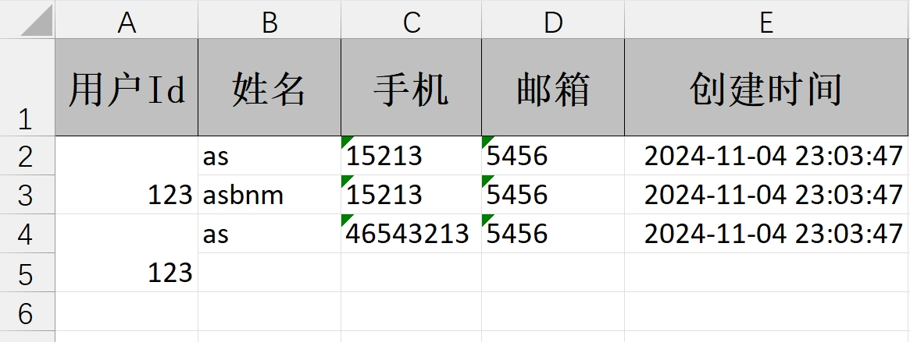
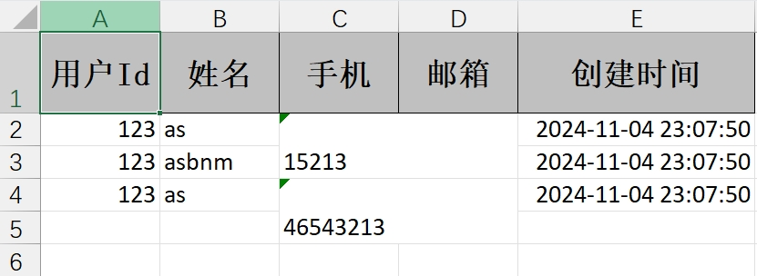
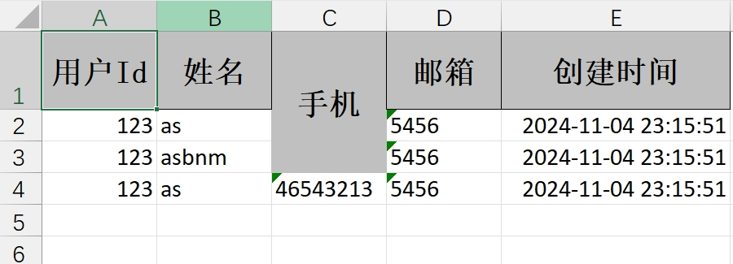
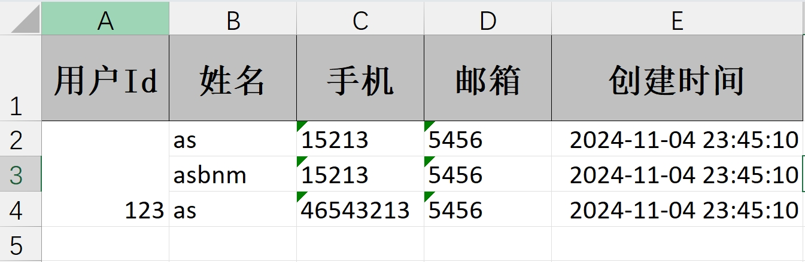
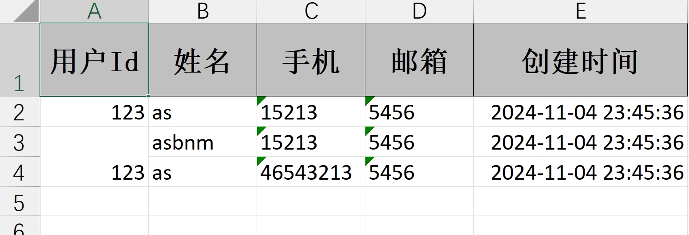
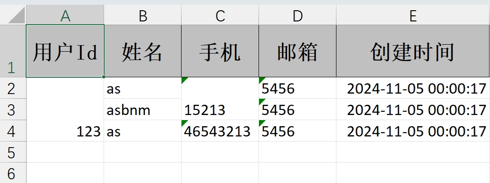

## 📋 目录

- [单元格合并概述](#单元格合并概述)
- [注解方式设置合并](#注解方式设置合并)
  - [@ContentLoopMerge 注解](#contentloopmerge-注解)
  - [@OnceAbsoluteMerge 注解](#onceabsolutemerge-注解)
- [策略方式设置合并](#策略方式设置合并)
  - [LoopMergeStrategy 循环合并策略](#loopmergestrategy-循环合并策略)
  - [OnceAbsoluteMergeStrategy 绝对位置合并策略](#onceabsolutemergestrategy-绝对位置合并策略)
- [自定义合并策略](#自定义合并策略)
  - [AbstractMergeStrategy 抽象合并策略](#abstractmergestrategy-抽象合并策略)
  - [CellWriteHandler 单元格写入处理器](#cellwritehandler-单元格写入处理器)

## 🎯 单元格合并概述

EasyExcel 提供了多种单元格合并的方式，可以根据实际需求选择合适的策略：

- **注解方式**：使用 `@ContentLoopMerge` 和 `@OnceAbsoluteMerge` 注解快速设置合并
- **策略方式**：使用不同的合并策略类实现复杂的合并逻辑
- **自定义策略**：继承抽象类或实现接口实现自定义合并逻辑

单元格合并功能可以显著提升 Excel 文件的可读性和组织性，特别适用于需要将相关信息整合在一起的场景。

## 📝 注解方式设置合并

### @ContentLoopMerge 注解

用于设置循环合并单元格的注解，作用于字段上。

**参数说明：**
- `eachRow`：每隔几行合并
- `columnExtend`：合并列的下标

```java
@AllArgsConstructor
@NoArgsConstructor
@Data
public class User {

    @ContentLoopMerge(eachRow = 2, columnExtend = 1)
    @ExcelProperty(value = "用户Id")
    private Integer userId;

    @ExcelProperty(value = "姓名")
    private String name;

    @ExcelProperty(value = "手机")
    private String phone;

    @ExcelProperty(value = "邮箱")
    private String email;

    @ExcelProperty(value = "创建时间")
    private Date createTime;
}
```

### @OnceAbsoluteMerge 注解

用于指定位置的单元格合并，作用于类上。

**参数说明：**
- `firstRowIndex`：第一行下标
- `lastRowIndex`：最后一行下标
- `firstColumnIndex`：第一列下标
- `lastColumnIndex`：最后一列下标

```java
@OnceAbsoluteMerge(firstColumnIndex = 0, lastColumnIndex = 0, firstRowIndex = 1, lastRowIndex = 2)
@AllArgsConstructor
@NoArgsConstructor
@Data
public class User {

    @ExcelProperty(value = "用户Id")
    private Integer userId;

    @ExcelProperty(value = "姓名")
    private String name;

    @ExcelProperty(value = "手机")
    private String phone;

    @ExcelProperty(value = "邮箱")
    private String email;

    @ExcelProperty(value = "创建时间")
    private Date createTime;
}
```

## 🔧 策略方式设置合并

### LoopMergeStrategy 循环合并策略

#### 源码分析

```java
public class LoopMergeStrategy implements RowWriteHandler {

    // 每隔几行合并
    private final int eachRow;

    // 合并几列
    private final int columnExtend;

    // 合并列
    private final int columnIndex;

    public LoopMergeStrategy(int eachRow, int columnIndex) {
        this(eachRow, 1, columnIndex);
    }

    public LoopMergeStrategy(int eachRow, int columnExtend, int columnIndex) {
        if (eachRow < 1) {
            throw new IllegalArgumentException("EachRows must be greater than 1");
        }
        if (columnExtend < 1) {
            throw new IllegalArgumentException("ColumnExtend must be greater than 1");
        }
        if (columnExtend == 1 && eachRow == 1) {
            throw new IllegalArgumentException("ColumnExtend or eachRows must be greater than 1");
        }
        if (columnIndex < 0) {
            throw new IllegalArgumentException("ColumnIndex must be greater than 0");
        }
        this.eachRow = eachRow;
        this.columnExtend = columnExtend;
        this.columnIndex = columnIndex;
    }

    public LoopMergeStrategy(LoopMergeProperty loopMergeProperty, Integer columnIndex) {
        this(loopMergeProperty.getEachRow(), loopMergeProperty.getColumnExtend(), columnIndex);
    }

    @Override
    public void afterRowDispose(RowWriteHandlerContext context) {
        // 判断是否为表头
        if (context.getHead() || context.getRelativeRowIndex() == null) {
            return;
        }
        // 循环进行单元格合并
        if (context.getRelativeRowIndex() % eachRow == 0) {
            CellRangeAddress cellRangeAddress = new CellRangeAddress(context.getRowIndex(),
                context.getRowIndex() + eachRow - 1,
                columnIndex, columnIndex + columnExtend - 1);
            context.getWriteSheetHolder().getSheet().addMergedRegionUnsafe(cellRangeAddress);
        }
    }
}
```

#### 使用示例

通过 `registerWriteHandler` 方法设置单元格合并策略，用于指定某几列每相差几行进行单元格合并。

1. 指定单列合并

```java
/**
 * 单列循环合并导出
 */
@GetMapping("/download1")
public void download1(HttpServletResponse response) {
    try {
        // 设置响应头
        response.setContentType("application/vnd.ms-excel");
        response.setCharacterEncoding("utf-8");
        String fileName = URLEncoder.encode("测试", "UTF-8").replaceAll("\\+", "%20");
        response.setHeader("Content-disposition", "attachment;filename=" + fileName + ".xls");

        // 准备测试数据
        User user1 = new User();
        user1.setUserId(123);
        user1.setName("as");
        user1.setPhone("15213");
        user1.setEmail("5456");
        user1.setCreateTime(new Date());

        User user2 = new User();
        user2.setUserId(123);
        user2.setName("asbnm");
        user2.setPhone("15213");
        user2.setEmail("5456");
        user2.setCreateTime(new Date());

        User user3 = new User();
        user3.setUserId(123);
        user3.setName("as");
        user3.setPhone("46543213");
        user3.setEmail("5456");
        user3.setCreateTime(new Date());
        
        // 第1列每隔2行合并一次
        LoopMergeStrategy loopMergeStrategy = new LoopMergeStrategy(2, 0);
        EasyExcel.write(response.getOutputStream(), User.class)
                .registerWriteHandler(loopMergeStrategy)
                .sheet("模板")
                .doWrite(Arrays.asList(user1, user2, user3));
    } catch (Exception e) {
        log.error("单列循环合并导出失败", e);
        throw new RuntimeException("导出失败: " + e.getMessage());
    }
}
```

**效果展示：**



2. 指定多列合并

```java
/**
 * 多列循环合并导出
 */
@GetMapping("/download1")
public void download1(HttpServletResponse response) {
    try {
        // 设置响应头
        response.setContentType("application/vnd.ms-excel");
        response.setCharacterEncoding("utf-8");
        String fileName = URLEncoder.encode("测试", "UTF-8").replaceAll("\\+", "%20");
        response.setHeader("Content-disposition", "attachment;filename=" + fileName + ".xls");

        // 准备测试数据
        User user1 = new User();
        user1.setUserId(123);
        user1.setName("as");
        user1.setPhone("15213");
        user1.setEmail("5456");
        user1.setCreateTime(new Date());

        User user2 = new User();
        user2.setUserId(123);
        user2.setName("asbnm");
        user2.setPhone("15213");
        user2.setEmail("5456");
        user2.setCreateTime(new Date());

        User user3 = new User();
        user3.setUserId(123);
        user3.setName("as");
        user3.setPhone("46543213");
        user3.setEmail("5456");
        user3.setCreateTime(new Date());
        
        // 第2列开始每隔2行合并一次，从第2列开始的两列进行合并
        LoopMergeStrategy loopMergeStrategy = new LoopMergeStrategy(2, 2, 2);
        EasyExcel.write(response.getOutputStream(), User.class)
                .registerWriteHandler(loopMergeStrategy)
                .sheet("模板")
                .doWrite(Arrays.asList(user1, user2, user3));
    } catch (Exception e) {
        log.error("多列循环合并导出失败", e);
        throw new RuntimeException("导出失败: " + e.getMessage());
    }
}
```

**效果展示：**



### OnceAbsoluteMergeStrategy 绝对位置合并策略

#### 源码分析

```java
public class OnceAbsoluteMergeStrategy implements SheetWriteHandler {

    // 第一行
    private final int firstRowIndex;

    // 最后一行
    private final int lastRowIndex;

    // 第一列
    private final int firstColumnIndex;

    // 最后一列
    private final int lastColumnIndex;

    public OnceAbsoluteMergeStrategy(int firstRowIndex, int lastRowIndex, int firstColumnIndex, int lastColumnIndex) {
        if (firstRowIndex < 0 || lastRowIndex < 0 || firstColumnIndex < 0 || lastColumnIndex < 0) {
            throw new IllegalArgumentException("All parameters must be greater than 0");
        }
        this.firstRowIndex = firstRowIndex;
        this.lastRowIndex = lastRowIndex;
        this.firstColumnIndex = firstColumnIndex;
        this.lastColumnIndex = lastColumnIndex;
    }

    public OnceAbsoluteMergeStrategy(OnceAbsoluteMergeProperty onceAbsoluteMergeProperty) {
        this(onceAbsoluteMergeProperty.getFirstRowIndex(), onceAbsoluteMergeProperty.getLastRowIndex(),
            onceAbsoluteMergeProperty.getFirstColumnIndex(), onceAbsoluteMergeProperty.getLastColumnIndex());
    }

    @Override
    public void afterSheetCreate(WriteWorkbookHolder writeWorkbookHolder, WriteSheetHolder writeSheetHolder) {
        CellRangeAddress cellRangeAddress =
            new CellRangeAddress(firstRowIndex, lastRowIndex, firstColumnIndex, lastColumnIndex);
        writeSheetHolder.getSheet().addMergedRegionUnsafe(cellRangeAddress);
    }
}
```

#### 使用示例

通过 `registerWriteHandler` 方法设置单元格合并策略，用于指定一个区域内的单元格进行合并。

```java
/**
 * 绝对位置合并导出
 */
@GetMapping("/download2")
public void download2(HttpServletResponse response) {
    try {
        // 设置响应头
        response.setContentType("application/vnd.ms-excel");
        response.setCharacterEncoding("utf-8");
        String fileName = URLEncoder.encode("测试", "UTF-8").replaceAll("\\+", "%20");
        response.setHeader("Content-disposition", "attachment;filename=" + fileName + ".xls");

        // 准备测试数据
        User user1 = new User();
        user1.setUserId(123);
        user1.setName("as");
        user1.setPhone("15213");
        user1.setEmail("5456");
        user1.setCreateTime(new Date());

        User user2 = new User();
        user2.setUserId(123);
        user2.setName("asbnm");
        user2.setPhone("15213");
        user2.setEmail("5456");
        user2.setCreateTime(new Date());

        User user3 = new User();
        user3.setUserId(123);
        user3.setName("as");
        user3.setPhone("46543213");
        user3.setEmail("5456");
        user3.setCreateTime(new Date());
        
        // 从第1行第3列合并到第3行第3列
        OnceAbsoluteMergeStrategy onceAbsoluteMergeStrategy = new OnceAbsoluteMergeStrategy(0, 2, 2, 2);
        EasyExcel.write(response.getOutputStream(), User.class)
                .registerWriteHandler(onceAbsoluteMergeStrategy)
                .sheet("模板")
                .doWrite(Arrays.asList(user1, user2, user3));
    } catch (Exception e) {
        log.error("绝对位置合并导出失败", e);
        throw new RuntimeException("导出失败: " + e.getMessage());
    }
}
```

**效果展示：**



## 🛠️ 自定义合并策略

### AbstractMergeStrategy 抽象合并策略

#### 基本思路

1. 继承 `AbstractMergeStrategy` 抽象合并策略，重写 `merge` 方法
2. 传入要合并的数据列表，循环判断上下行是否是相同的数据，如果是则为同一个组，否则为另一个组，使用 `List` 保存每个组的数量
3. 单元格渲染时，循环遍历每个组的值后，计算要合并的单元格的上下标

#### 实现示例

```java
/**
 * 自定义合并策略
 * 该类继承了AbstractMergeStrategy抽象合并策略，需要重写merge()方法
 */
public class CustomMergeStrategy extends AbstractMergeStrategy {

    /**
     * 分组，每几行合并一次
     */
    private List<Integer> exportFieldGroupCountList;

    /**
     * 目标合并列index
     */
    private Integer targetColumnIndex;

    /**
     * 需要开始合并单元格的首行index
     */
    private Integer rowIndex;

    public CustomMergeStrategy(List<String> exportDataList, Integer targetColumnIndex, Integer rowIndex) {
        this.exportFieldGroupCountList = getGroupCountList(exportDataList, rowIndex);
        this.targetColumnIndex = targetColumnIndex;
        this.rowIndex = rowIndex;
    }

    /**
     * 该方法将目标列根据值是否相同连续可合并，存储可合并的行数
     */
    private List<Integer> getGroupCountList(List<String> exportDataList, Integer rowIndex) {
        if (CollectionUtils.isEmpty(exportDataList)) {
            return new ArrayList<>();
        }

        List<Integer> groupCountList = new ArrayList<>();
        int count = 1;
        for (int i = rowIndex + 1, len = exportDataList.size(); i < len; i++) {
            // 判断上一列和当前列的值是否相同
            if (exportDataList.get(i).equals(exportDataList.get(i - 1))) {
                count++;
            } else {
                groupCountList.add(count);
                count = 1;
            }
        }
        // 处理完最后一条后
        groupCountList.add(count);
        return groupCountList;
    }

    @Override
    protected void merge(Sheet sheet, Cell cell, Head head, Integer relativeRowIndex) {
        if (null == rowIndex) {
            rowIndex = cell.getRowIndex();
        }
        // 仅从首行以及目标列的单元格开始合并，忽略其他
        if (cell.getRowIndex() == rowIndex + 1 && cell.getColumnIndex() == targetColumnIndex) {
            mergeGroupColumn(sheet);
        }
    }

    /**
     * 合并分组列
     */
    private void mergeGroupColumn(Sheet sheet) {
        int rowCount = rowIndex + 1;
        for (Integer count : exportFieldGroupCountList) {
            if (count == 1) {
                rowCount += count;
                continue;
            }
            // 合并单元格
            CellRangeAddress cellRangeAddress = new CellRangeAddress(rowCount, rowCount + count - 1, targetColumnIndex, targetColumnIndex);
            sheet.addMergedRegionUnsafe(cellRangeAddress);
            rowCount += count;
        }
    }
}
```


1. 从首行开始合并单元格

```java
/**
 * 自定义策略1：从首行开始合并
 */
@GetMapping("/download3")
public void download3(HttpServletResponse response) {
    try {
        // 设置响应头
        response.setContentType("application/vnd.ms-excel");
        response.setCharacterEncoding("utf-8");
        String fileName = URLEncoder.encode("测试", "UTF-8").replaceAll("\\+", "%20");
        response.setHeader("Content-disposition", "attachment;filename=" + fileName + ".xls");

        // 准备测试数据
        User user1 = new User();
        user1.setUserId(123);
        user1.setName("as");
        user1.setPhone("15213");
        user1.setEmail("5456");
        user1.setCreateTime(new Date());

        User user2 = new User();
        user2.setUserId(123);
        user2.setName("asbnm");
        user2.setPhone("15213");
        user2.setEmail("5456");
        user2.setCreateTime(new Date());

        User user3 = new User();
        user3.setUserId(123);
        user3.setName("as");
        user3.setPhone("46543213");
        user3.setEmail("5456");
        user3.setCreateTime(new Date());

        List<User> userList = Arrays.asList(user1, user2, user3);
        CustomMergeStrategy customMergeStrategy = new CustomMergeStrategy(userList.stream().map(e ->
                String.valueOf(e.getUserId())).collect(Collectors.toList()), 0, 0);
        EasyExcel.write(response.getOutputStream(), User.class)
                .registerWriteHandler(customMergeStrategy)
                .sheet("模板")
                .doWrite(userList);
    } catch (Exception e) {
        log.error("自定义策略1导出失败", e);
        throw new RuntimeException("导出失败: " + e.getMessage());
    }
}
```

**效果展示：**



2. 从指定行开始合并单元格

```java
/**
 * 自定义策略2：从指定行开始合并
 */
@GetMapping("/download3")
public void download3(HttpServletResponse response) {
    try {
        // 设置响应头
        response.setContentType("application/vnd.ms-excel");
        response.setCharacterEncoding("utf-8");
        String fileName = URLEncoder.encode("测试", "UTF-8").replaceAll("\\+", "%20");
        response.setHeader("Content-disposition", "attachment;filename=" + fileName + ".xls");

        // 准备测试数据
        User user1 = new User();
        user1.setUserId(123);
        user1.setName("as");
        user1.setPhone("15213");
        user1.setEmail("5456");
        user1.setCreateTime(new Date());

        User user2 = new User();
        user2.setUserId(123);
        user2.setName("asbnm");
        user2.setPhone("15213");
        user2.setEmail("5456");
        user2.setCreateTime(new Date());

        User user3 = new User();
        user3.setUserId(123);
        user3.setName("as");
        user3.setPhone("46543213");
        user3.setEmail("5456");
        user3.setCreateTime(new Date());

        List<User> userList = Arrays.asList(user1, user2, user3);
        CustomMergeStrategy customMergeStrategy = new CustomMergeStrategy(userList.stream().map(e ->
                String.valueOf(e.getUserId())).collect(Collectors.toList()), 0, 1);
        EasyExcel.write(response.getOutputStream(), User.class)
                .registerWriteHandler(customMergeStrategy)
                .sheet("模板")
                .doWrite(userList);
    } catch (Exception e) {
        log.error("自定义策略2导出失败", e);
        throw new RuntimeException("导出失败: " + e.getMessage());
    }
}
```

**效果展示：**



### CellWriteHandler 单元格写入处理器

#### 基本思路

1. 实现 `CellWriteHandler` 类的 `afterCellDispose` 方法，在每个单元格完全创建完之后执行合并单元格操作
2. 判断当前列是否为要合并的列，且当前行是否已经到达要操作的行数
3. 如果是，则判断上一行和当前行的数据是否一致，且序号是否一致
4. 如果是，则进行合并单元格操作，如果上一行已经被合并过了，则进行移除，然后再重新合并单元格

#### 实现示例

```java
/**
 * Excel合并单元格导出工具类
 */
public class EasyExcelUtil implements CellWriteHandler {

    /**
     * 需要合并的列
     */
    private int[] mergeColumnIndex;

    /**
     * 从哪一行开始合并
     */
    private int mergeRowIndex;

    public EasyExcelUtil() {
    }

    public EasyExcelUtil(int mergeRowIndex, int[] mergeColumnIndex) {
        this.mergeRowIndex = mergeRowIndex;
        this.mergeColumnIndex = mergeColumnIndex;
    }

    /**
     * 创建每个单元格之前执行
     */
    @Override
    public void beforeCellCreate(WriteSheetHolder writeSheetHolder, WriteTableHolder writeTableHolder, Row row,
                                 Head head, Integer columnIndex, Integer relativeRowIndex, Boolean isHead) {
        CellWriteHandler.super.beforeCellCreate(writeSheetHolder, writeTableHolder, row, head, columnIndex, relativeRowIndex, isHead);
    }

    /**
     * 每个单元格数据内容渲染之后执行
     */
    @Override
    public void afterCellDataConverted(WriteSheetHolder writeSheetHolder, WriteTableHolder writeTableHolder, WriteCellData<?> cellData,
                                       Cell cell, Head head, Integer relativeRowIndex, Boolean isHead) {
        CellWriteHandler.super.afterCellDataConverted(writeSheetHolder, writeTableHolder, cellData, cell, head, relativeRowIndex, isHead);
    }

    /**
     * 每个单元格完全创建完之后执行
     */
    @Override
    public void afterCellDispose(WriteSheetHolder writeSheetHolder, WriteTableHolder writeTableHolder, List<WriteCellData<?>> cellDataList,
                                 Cell cell, Head head, Integer relativeRowIndex, Boolean isHead) {
        // 当前行
        int curRowIndex = cell.getRowIndex();
        // 当前列
        int curColIndex = cell.getColumnIndex();
        // 判断当前行是否已经到达要合并的行数
        if (curRowIndex > mergeRowIndex) {
            // 判断是否是合并列
            for (int columnIndex : mergeColumnIndex) {
                if (curColIndex == columnIndex) {
                    mergeWithPrevRow(writeSheetHolder, cell, curRowIndex, curColIndex);
                    break;
                }
            }
        }
    }

    /**
     * 当前单元格向上合并
     *
     * @param writeSheetHolder 写入Sheet的持有者
     * @param cell 当前单元格
     * @param curRowIndex 当前行
     * @param curColIndex 当前列
     */
    private void mergeWithPrevRow(WriteSheetHolder writeSheetHolder, Cell cell, int curRowIndex, int curColIndex) {
        Cell cell1 = cell.getSheet().getRow(curRowIndex).getCell(0);
        Cell cell2 = cell.getSheet().getRow(curRowIndex - 1).getCell(0);
        if (cell1 == null || cell2 == null) {
            return;
        }
        // 获取当前单元格的数据
        Object curData = cell.getCellType() == CellType.STRING ? cell.getStringCellValue() : cell.getNumericCellValue();
        // 获取上一行单元格的数据
        Cell preCell = cell.getSheet().getRow(curRowIndex - 1).getCell(curColIndex);
        Object preData = preCell.getCellType() == CellType.STRING ? preCell.getStringCellValue() : preCell.getNumericCellValue();

        // 将当前单元格数据与上一个单元格数据比较，然后判断其序号是否相同
        Boolean dataBool = preData.equals(curData);
        Object val1 = cell1.getCellType() == CellType.STRING ? cell1.getStringCellValue() : cell1.getNumericCellValue();
        Object val2 = cell2.getCellType() == CellType.STRING ? cell2.getStringCellValue() : cell2.getNumericCellValue();
        Boolean bool = Objects.equals(val1, val2);
        if (dataBool && bool) {
            Sheet sheet = writeSheetHolder.getSheet();
            List<CellRangeAddress> mergeRegions = sheet.getMergedRegions();
            boolean isMerged = false;
            for (int i = 0, len = mergeRegions.size(); i < len && !isMerged; ++i) {
                CellRangeAddress cellRangeAddr = mergeRegions.get(i);
                // 若上一个单元格已经被合并，则先移出原有的合并单元，再重新添加合并单元
                if (cellRangeAddr.isInRange(curRowIndex - 1, curColIndex)) {
                    sheet.removeMergedRegion(i);
                    cellRangeAddr.setLastRow(curRowIndex);
                    sheet.addMergedRegion(cellRangeAddr);
                    isMerged = true;
                }
            }
            // 若上一个单元格未被合并，则新增合并单元
            if (!isMerged) {
                CellRangeAddress cellRangeAddress = new CellRangeAddress(curRowIndex - 1, curRowIndex, curColIndex, curColIndex);
                sheet.addMergedRegion(cellRangeAddress);
            }
        }
    }
}
```

```java
/**
 * CellWriteHandler合并策略导出
 */
@GetMapping("/download4")
public void download4(HttpServletResponse response) {
    try {
        // 设置响应头
        response.setContentType("application/vnd.ms-excel");
        response.setCharacterEncoding("utf-8");
        String fileName = URLEncoder.encode("测试", "UTF-8").replaceAll("\\+", "%20");
        response.setHeader("Content-disposition", "attachment;filename=" + fileName + ".xls");

        // 准备测试数据
        User user1 = new User();
        user1.setUserId(123);
        user1.setName("as");
        user1.setPhone("15213");
        user1.setEmail("5456");
        user1.setCreateTime(new Date());

        User user2 = new User();
        user2.setUserId(123);
        user2.setName("asbnm");
        user2.setPhone("15213");
        user2.setEmail("5456");
        user2.setCreateTime(new Date());

        User user3 = new User();
        user3.setUserId(123);
        user3.setName("as");
        user3.setPhone("46543213");
        user3.setEmail("5456");
        user3.setCreateTime(new Date());

        List<User> userList = Arrays.asList(user1, user2, user3);

        // 方式1：合并多个列
        // EasyExcel.write(response.getOutputStream(), User.class)
        //         .registerWriteHandler(new EasyExcelUtil(0, new int[]{0, 2}))
        //         .sheet("模板")
        //         .doWrite(userList);
        
        // 方式2：分别合并不同列
        EasyExcel.write(response.getOutputStream(), User.class)
                .registerWriteHandler(new EasyExcelUtil(0, new int[]{0}))
                .registerWriteHandler(new EasyExcelUtil(0, new int[]{2}))
                .sheet("模板")
                .doWrite(userList);
    } catch (Exception e) {
        log.error("CellWriteHandler合并策略导出失败", e);
        throw new RuntimeException("导出失败: " + e.getMessage());
    }
}
```

**效果展示：**


