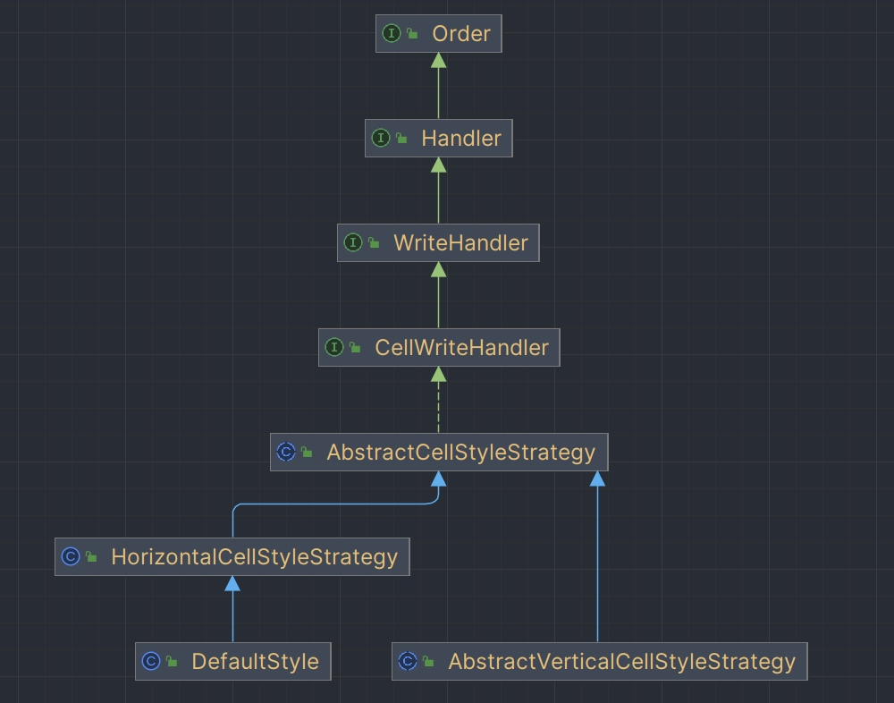
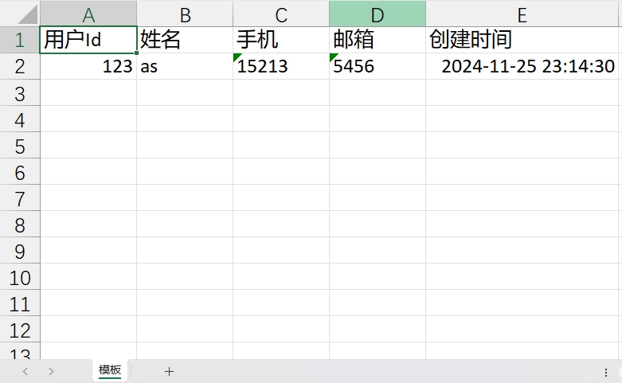
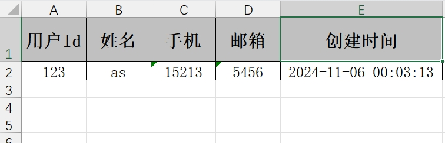

## 🎯 自定义样式概述

EasyExcel 提供了丰富的自定义样式功能，可以通过多种方式定制 Excel 表格的样式：

- **注解方式**：使用样式注解快速设置字段或类的样式
- **策略方式**：使用样式策略类实现复杂的样式逻辑
- **工具类方式**：使用工具类封装常用的样式配置

通过合理使用样式功能，可以显著提升 Excel 文件的美观性和可读性，让数据展示更加直观和专业。

## 🎨 样式注解

### @ContentStyle

用于设置内容格式注解，可作用于类和字段上。

**主要属性**

| 属性 | 类型 | 说明 |
|------|------|------|
| `dataFormat` | int | 日期格式 |
| `hidden` | boolean | 设置单元格使用此样式隐藏 |
| `locked` | boolean | 设置单元格使用此样式锁定 |
| `quotePrefix` | boolean | 在单元格前面增加`符号，数字或公式将以字符串形式展示 |
| `horizontalAlignment` | HorizontalAlignment | 设置是否水平居中 |
| `wrapped` | boolean | 设置文本是否应换行 |
| `verticalAlignment` | VerticalAlignment | 设置是否垂直居中 |
| `rotation` | short | 设置单元格中文本旋转角度 |
| `indent` | short | 设置单元格中缩进文本的空格数 |
| `borderLeft` | BorderStyle | 设置左边框的样式 |
| `borderRight` | BorderStyle | 设置右边框样式 |
| `borderTop` | BorderStyle | 设置上边框样式 |
| `borderBottom` | BorderStyle | 设置下边框样式 |
| `leftBorderColor` | short | 设置左边框颜色 |
| `rightBorderColor` | short | 设置右边框颜色 |
| `topBorderColor` | short | 设置上边框颜色 |
| `bottomBorderColor` | short | 设置下边框颜色 |
| `fillPatternType` | FillPatternType | 设置填充类型 |
| `fillBackgroundColor` | short | 设置背景色 |
| `fillForegroundColor` | short | 设置前景色 |
| `shrinkToFit` | boolean | 设置自动单元格自动大小 |

### @ContentFontStyle

用于设置单元格内容字体格式的注解，可作用于类和字段上。

**主要属性**

| 属性 | 类型 | 说明 |
|------|------|------|
| `fontName` | String | 字体名称 |
| `fontHeightInPoints` | short | 字体高度 |
| `italic` | boolean | 是否斜体 |
| `strikeout` | boolean | 是否设置删除水平线 |
| `color` | short | 字体颜色 |
| `typeOffset` | short | 偏移量 |
| `underline` | byte | 下划线 |
| `bold` | boolean | 是否加粗 |
| `charset` | int | 编码格式 |

### @HeadStyle

用于设置标题样式，可作用于类和字段上。

**主要属性**

| 属性 | 类型 | 说明 |
|------|------|------|
| `dataFormat` | int | 日期格式 |
| `hidden` | boolean | 设置单元格使用此样式隐藏 |
| `locked` | boolean | 设置单元格使用此样式锁定 |
| `quotePrefix` | boolean | 在单元格前面增加`符号，数字或公式将以字符串形式展示 |
| `horizontalAlignment` | HorizontalAlignment | 设置是否水平居中 |
| `wrapped` | boolean | 设置文本是否应换行 |
| `verticalAlignment` | VerticalAlignment | 设置是否垂直居中 |
| `rotation` | short | 设置单元格中文本旋转角度 |
| `indent` | short | 设置单元格中缩进文本的空格数 |
| `borderLeft` | BorderStyle | 设置左边框的样式 |
| `borderRight` | BorderStyle | 设置右边框样式 |
| `borderTop` | BorderStyle | 设置上边框样式 |
| `borderBottom` | BorderStyle | 设置下边框样式 |
| `leftBorderColor` | short | 设置左边框颜色 |
| `rightBorderColor` | short | 设置右边框颜色 |
| `topBorderColor` | short | 设置上边框颜色 |
| `bottomBorderColor` | short | 设置下边框颜色 |
| `fillPatternType` | FillPatternType | 设置填充类型 |
| `fillBackgroundColor` | short | 设置背景色 |
| `fillForegroundColor` | short | 设置前景色 |
| `shrinkToFit` | boolean | 设置自动单元格自动大小 |

### @HeadFontStyle

用于定制标题字体格式，可作用于类和字段上。

**主要属性**

| 属性 | 类型 | 说明 |
|------|------|------|
| `fontName` | String | 设置字体名称 |
| `fontHeightInPoints` | short | 设置字体高度 |
| `italic` | boolean | 设置字体是否斜体 |
| `strikeout` | boolean | 是否设置删除线 |
| `color` | short | 设置字体颜色 |
| `typeOffset` | short | 设置偏移量 |
| `underline` | byte | 设置下划线 |
| `charset` | int | 设置字体编码 |
| `bold` | boolean | 设置字体是否加粗 |

## 🔧 样式策略类




### AbstractCellStyleStrategy

通过继承 `AbstractCellStyleStrategy` 类，实现其 `setHeadCellStyle` 和 `setContentCellStyle` 方法可以自定义设置表头和单元格内容样式。

```java
public abstract class AbstractCellStyleStrategy implements CellWriteHandler {

    @Override
    public int order() {
        return OrderConstant.DEFINE_STYLE;
    }

    @Override
    public void afterCellDispose(CellWriteHandlerContext context) {
        if (context.getHead() == null) {
            return;
        }
        if (context.getHead()) {
            setHeadCellStyle(context);
        } else {
            setContentCellStyle(context);
        }
    }

    /**
     * 设置表头样式
     */
    protected void setHeadCellStyle(CellWriteHandlerContext context) {
        setHeadCellStyle(context.getCell(), context.getHeadData(), context.getRelativeRowIndex());
    }

    /**
     * 设置表头样式
     */
    protected void setHeadCellStyle(Cell cell, Head head, Integer relativeRowIndex) {
        throw new UnsupportedOperationException("Custom styles must override the setHeadCellStyle method.");
    }

    /**
     * 设置单元格内容样式
     */
    protected void setContentCellStyle(CellWriteHandlerContext context) {
        setContentCellStyle(context.getCell(), context.getHeadData(), context.getRelativeRowIndex());
    }

    /**
     * 设置单元格内容样式
     */
    protected void setContentCellStyle(Cell cell, Head head, Integer relativeRowIndex) {
        throw new UnsupportedOperationException("Custom styles must override the setContentCellStyle method.");
    }
}
```

### HorizontalCellStyleStrategy

`HorizontalCellStyleStrategy` 是提供的一个水平样式策略，只需实现 `CellWriteHandlerContext` 类自定义样式即可。通过设置构建这个策略对象基本上可以满足一般的要求，比如：设置表头和内容的边框、底色、对齐方式、文字字体、文字颜色、文字大小等。

```java
@Getter
@Setter
@EqualsAndHashCode
public class HorizontalCellStyleStrategy extends AbstractCellStyleStrategy {

    private WriteCellStyle headWriteCellStyle;
    private List<WriteCellStyle> contentWriteCellStyleList;

    public HorizontalCellStyleStrategy() {
    }

    public HorizontalCellStyleStrategy(WriteCellStyle headWriteCellStyle,
        List<WriteCellStyle> contentWriteCellStyleList) {
        this.headWriteCellStyle = headWriteCellStyle;
        this.contentWriteCellStyleList = contentWriteCellStyleList;
    }

    public HorizontalCellStyleStrategy(WriteCellStyle headWriteCellStyle, WriteCellStyle contentWriteCellStyle) {
        this.headWriteCellStyle = headWriteCellStyle;
        if (contentWriteCellStyle != null) {
            this.contentWriteCellStyleList = ListUtils.newArrayList(contentWriteCellStyle);
        }
    }

    /**
     * 设置表头样式
     */
    @Override
    protected void setHeadCellStyle(CellWriteHandlerContext context) {
        if (stopProcessing(context) || headWriteCellStyle == null) {
            return;
        }
        WriteCellData<?> cellData = context.getFirstCellData();
        WriteCellStyle.merge(headWriteCellStyle, cellData.getOrCreateStyle());
    }

    /**
     * 设置单元格内容样式
     */
    @Override
    protected void setContentCellStyle(CellWriteHandlerContext context) {
        if (stopProcessing(context) || CollectionUtils.isEmpty(contentWriteCellStyleList)) {
            return;
        }
        WriteCellData<?> cellData = context.getFirstCellData();
        if (context.getRelativeRowIndex() == null || context.getRelativeRowIndex() <= 0) {
            WriteCellStyle.merge(contentWriteCellStyleList.get(0), cellData.getOrCreateStyle());
        } else {
            WriteCellStyle.merge(
                contentWriteCellStyleList.get(context.getRelativeRowIndex() % contentWriteCellStyleList.size()),
                cellData.getOrCreateStyle());
        }
    }

    /**
     * 判断单元格是否为空
     */
    protected boolean stopProcessing(CellWriteHandlerContext context) {
        return context.getFirstCellData() == null;
    }
}
```

### DefaultStyle

EasyExcel 在导出文件内容时默认使用 `DefaultStyle` 类来设置表头和单元格样式。

```java
public class DefaultStyle extends HorizontalCellStyleStrategy {

    @Override
    public int order() {
        return OrderConstant.DEFAULT_DEFINE_STYLE;
    }

    public DefaultStyle() {
        super();
        WriteCellStyle headWriteCellStyle = new WriteCellStyle();
        headWriteCellStyle.setWrapped(true);
        headWriteCellStyle.setVerticalAlignment(VerticalAlignment.CENTER);
        headWriteCellStyle.setHorizontalAlignment(HorizontalAlignment.CENTER);
        headWriteCellStyle.setLocked(true);
        headWriteCellStyle.setFillPatternType(FillPatternType.SOLID_FOREGROUND);
        headWriteCellStyle.setFillForegroundColor(IndexedColors.GREY_25_PERCENT.getIndex());
        headWriteCellStyle.setBorderTop(BorderStyle.THIN);
        headWriteCellStyle.setBorderBottom(BorderStyle.THIN);
        headWriteCellStyle.setBorderLeft(BorderStyle.THIN);
        headWriteCellStyle.setBorderRight(BorderStyle.THIN);
        WriteFont headWriteFont = new WriteFont();
        headWriteFont.setFontName("宋体");
        headWriteFont.setFontHeightInPoints((short)14);
        headWriteFont.setBold(true);
        headWriteCellStyle.setWriteFont(headWriteFont);

        setHeadWriteCellStyle(headWriteCellStyle);
    }
}
```

**默认样式说明：**

EasyExcel 的默认风格是，对于表头会显示灰色背景，但是如果取消使用默认风格之后，表头的背景颜色就会恢复白色。

EasyExcel 控制是否开启默认风格的属性方法是：`useDefaultStyle(false)`

> ⚠️ **重要**：`useDefaultStyle` 方法一定要放在 `sheet` 方法前面，否则会失效（放在后面会因为在构造 `ExcelWriter` 类时获取不到 `useDefaultStyle` 的值，从而导致使用的是默认风格）

```java
/**
 * 禁用默认样式示例
 */
public void test01() {
    EasyExcel.write("test01.xlsx", DemoData.class)
            // 禁用默认风格
            .useDefaultStyle(false)
            .sheet("testSheet01")
            .doWrite(demoData);
}
```

**效果展示：**



## 🛠️ 样式工具类

### CustomExcelStyleUtil

```java
/**
 * EasyExcel 样式工具类
 */
public class CustomExcelStyleUtil {

    /**
     * 标题样式
     *
     * @return 表头样式
     */
    public static WriteCellStyle getHeadStyle() {
        // 头的策略
        WriteCellStyle headWriteCellStyle = new WriteCellStyle();
        
        // 背景颜色
        // headWriteCellStyle.setFillForegroundColor(IndexedColors.LIGHT_TURQUOISE1.getIndex());
        // headWriteCellStyle.setFillPatternType(FillPatternType.SOLID_FOREGROUND);

        // 字体
        WriteFont headWriteFont = new WriteFont();
        headWriteFont.setFontName("宋体"); // 设置字体名字
        headWriteFont.setFontHeightInPoints((short) 14); // 设置字体大小
        headWriteFont.setBold(true); // 字体加粗
        headWriteCellStyle.setWriteFont(headWriteFont); // 在样式用应用设置的字体

        // 样式
        headWriteCellStyle.setBorderBottom(BorderStyle.THIN); // 设置底边框
        headWriteCellStyle.setBottomBorderColor((short) 0); // 设置底边框颜色
        headWriteCellStyle.setBorderLeft(BorderStyle.THIN); // 设置左边框
        headWriteCellStyle.setLeftBorderColor((short) 0); // 设置左边框颜色
        headWriteCellStyle.setBorderRight(BorderStyle.THIN); // 设置右边框
        headWriteCellStyle.setRightBorderColor((short) 0); // 设置右边框颜色
        headWriteCellStyle.setBorderTop(BorderStyle.THIN); // 设置顶边框
        headWriteCellStyle.setTopBorderColor((short) 0); // 设置顶边框颜色

        headWriteCellStyle.setWrapped(true); // 设置自动换行
        headWriteCellStyle.setHorizontalAlignment(HorizontalAlignment.CENTER); // 设置水平对齐的样式为居中对齐
        headWriteCellStyle.setVerticalAlignment(VerticalAlignment.CENTER); // 设置垂直对齐的样式为居中对齐
        headWriteCellStyle.setShrinkToFit(true); // 设置文本收缩至合适

        return headWriteCellStyle;
    }

    /**
     * 内容样式
     *
     * @return 内容样式
     */
    public static WriteCellStyle getContentStyle() {
        // 内容的策略
        WriteCellStyle contentWriteCellStyle = new WriteCellStyle();

        // 背景颜色
        // 这里需要指定 FillPatternType 为FillPatternType.SOLID_FOREGROUND 不然无法显示背景颜色
        // contentWriteCellStyle.setFillForegroundColor(IndexedColors.PALE_BLUE.getIndex());
        // contentWriteCellStyle.setFillPatternType(FillPatternType.SOLID_FOREGROUND);

        // 设置字体
        WriteFont contentWriteFont = new WriteFont();
        contentWriteFont.setFontHeightInPoints((short) 12); // 设置字体大小
        contentWriteFont.setFontName("宋体"); // 设置字体名字
        contentWriteCellStyle.setWriteFont(contentWriteFont); // 在样式用应用设置的字体

        // 设置样式
        contentWriteCellStyle.setBorderBottom(BorderStyle.THIN); // 设置底边框
        contentWriteCellStyle.setBottomBorderColor((short) 0); // 设置底边框颜色
        contentWriteCellStyle.setBorderLeft(BorderStyle.THIN); // 设置左边框
        contentWriteCellStyle.setLeftBorderColor((short) 0); // 设置左边框颜色
        contentWriteCellStyle.setBorderRight(BorderStyle.THIN); // 设置右边框
        contentWriteCellStyle.setRightBorderColor((short) 0); // 设置右边框颜色
        contentWriteCellStyle.setBorderTop(BorderStyle.THIN); // 设置顶边框
        contentWriteCellStyle.setTopBorderColor((short) 0); // 设置顶边框颜色

        contentWriteCellStyle.setHorizontalAlignment(HorizontalAlignment.CENTER); // 水平居中
        contentWriteCellStyle.setVerticalAlignment(VerticalAlignment.CENTER); // 垂直居中
        contentWriteCellStyle.setWrapped(true); // 设置自动换行
        contentWriteCellStyle.setShrinkToFit(true); // 设置文本收缩至合适

        return contentWriteCellStyle;
    }
}
```

### 使用示例


```java
@Data
public class User {

    @ExcelProperty(value = "用户Id")
    private Integer userId;

    @ExcelProperty(value = "姓名")
    private String name;

    @ExcelProperty(value = "手机")
    private String phone;

    @ExcelProperty(value = "邮箱")
    private String email;

    @ExcelProperty(value = "创建时间")
    private Date createTime;
}
```


```java
/**
 * 自定义样式导出
 */
@GetMapping("/download1")
public void download1(HttpServletResponse response) {
    try {
        // 设置响应头
        response.setContentType("application/vnd.ms-excel");
        response.setCharacterEncoding("utf-8");
        String fileName = URLEncoder.encode("测试", "UTF-8").replaceAll("\\+", "%20");
        response.setHeader("Content-disposition", "attachment;filename=" + fileName + ".xls");

        // 准备测试数据
        User user = new User();
        user.setUserId(123);
        user.setName("as");
        user.setPhone("15213");
        user.setEmail("5456");
        user.setCreateTime(new Date());
        
        // 使用自定义样式策略
        EasyExcel.write(response.getOutputStream(), User.class)
                .sheet("模板")
                .registerWriteHandler(new HorizontalCellStyleStrategy(
                    CustomExcelStyleUtil.getHeadStyle(), 
                    CustomExcelStyleUtil.getContentStyle()))
                .doWrite(Arrays.asList(user));
    } catch (Exception e) {
        log.error("自定义样式导出失败", e);
        throw new RuntimeException("导出失败: " + e.getMessage());
    }
}
```

**效果展示：**

