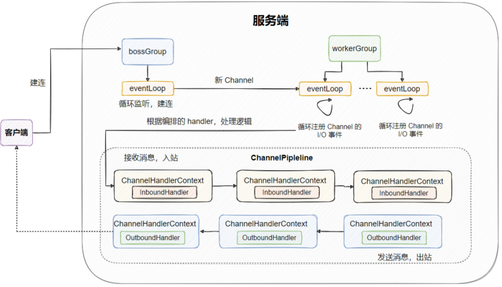
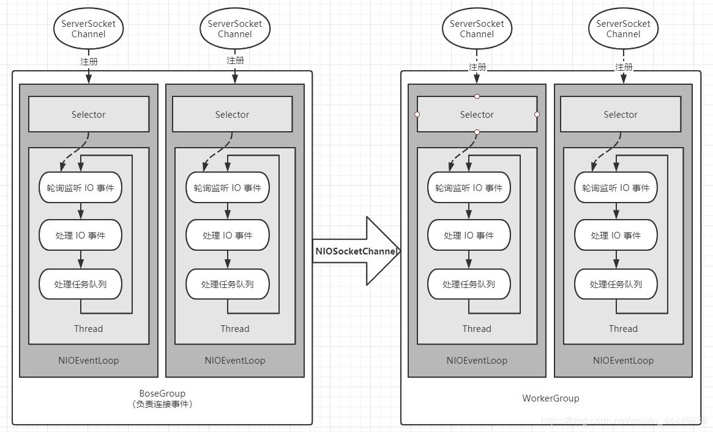
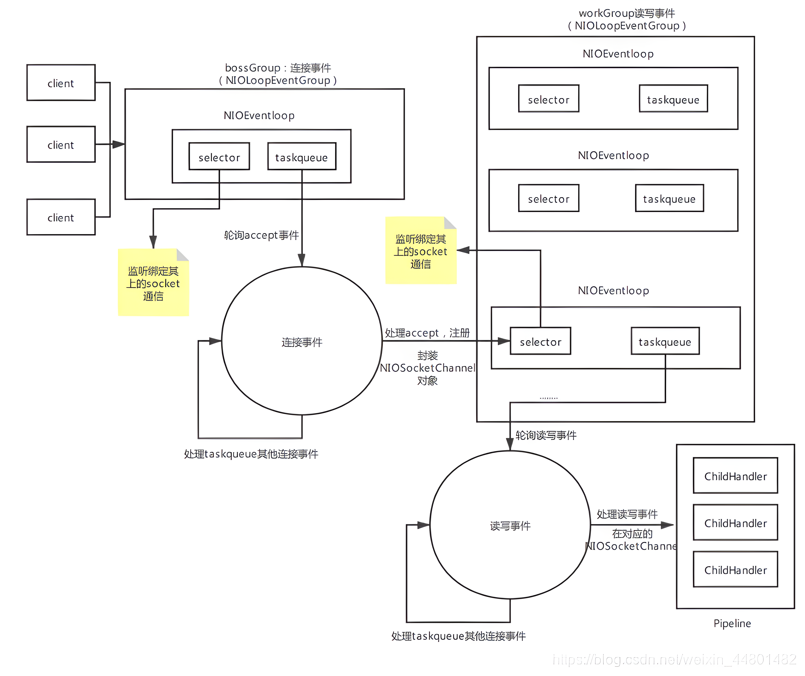
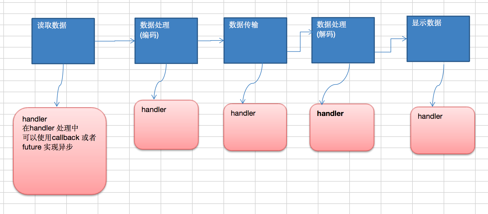
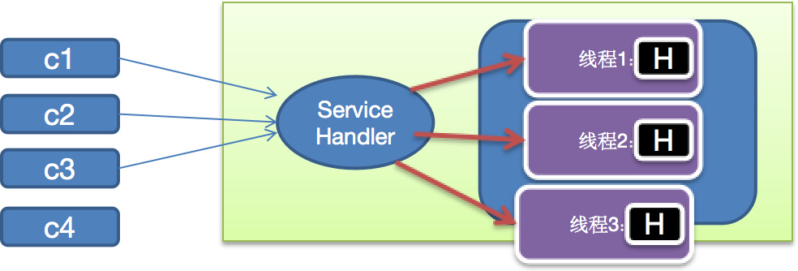
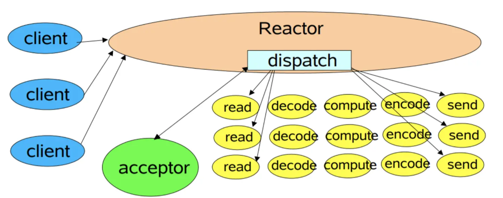
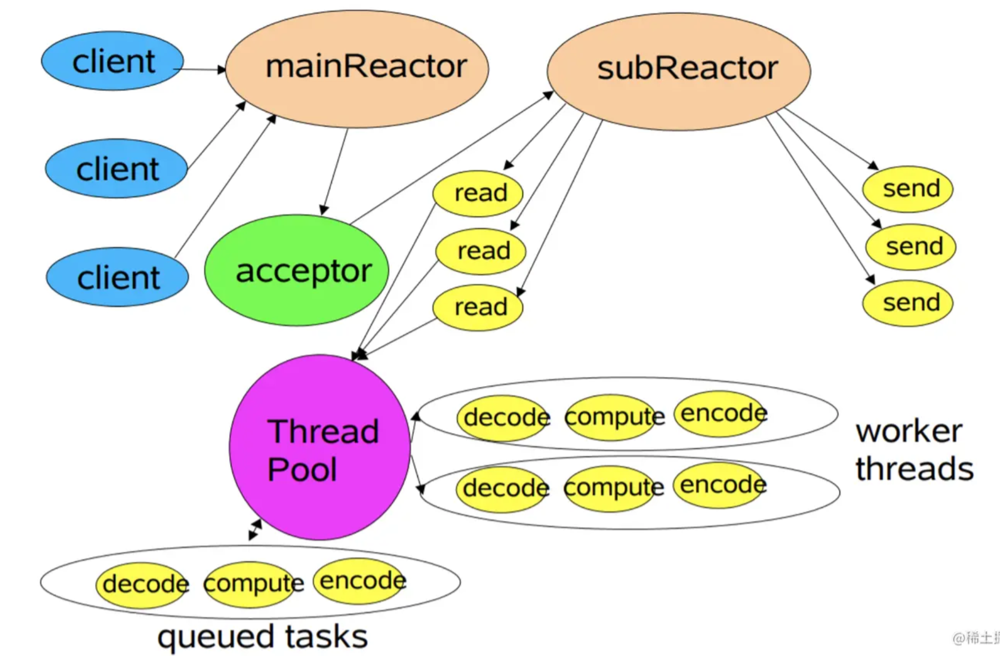

## 比较

1. BIO 方式适用于连接数目比较小且固定的架构，这种方式对服务器资源要求比较高，并发局限于应用中，JDK1.4 以前的唯一选择，但程序简单易理解。
2. NIO 方式适用于连接数目多且连接比较短（轻操作）的架构，比如聊天服务器，弹幕系统，服务器间通讯等。编程比较复杂，JDK1.4 开始支持。
3. AIO 方式使用于连接数目多且连接比较长（重操作）的架构，比如相册服务器，充分调用 OS 参与并发操作，编程比较复杂，JDK7 开始支持。

|          | **BIO**  | NIO | **AIO**    |
| -------- | -------- | ---------------------- | ---------- |
| IO 模型   | 同步阻塞 | 同步非阻塞（多路复用） | 异步非阻塞 |
| 编程难度 | 简单     | 复杂                   | 复杂       |
| 可靠性   | 差       | 好                     | 好         |
| 吞吐量   | 低       | 高                     | 高         |


1. 同步阻塞：到理发店理发，就一直等理发师，直到轮到自己理发。
2. 同步非阻塞：到理发店理发，发现前面有其它人理发，给理发师说下，先干其他事情，一会过来看是否轮到自己.
3. 异步非阻塞：给理发师打电话，让理发师上门服务，自己干其它事情，理发师自己来家给你理发

## Netty

### NIO 存在问题

1. NIO 的类库和 API 繁杂，使用麻烦：需要熟练掌握 Selector、ServerSocketChannel、SocketChannel、ByteBuffer 等。
2. 需要具备其他的额外技能：要熟悉 Java 多线程编程，因为 NIO 编程涉及到 Reactor 模式，你必须对多线程和网络编程非常熟悉，才能编写出高质量的 NIO 程序。
3. 开发工作量和难度都非常大：例如客户端面临断连重连、网络闪断、半包读写、失败缓存、网络拥塞和异常流的处理等等。
4. JDK NIO 的 Bug：例如臭名昭著的 Epoll Bug，它会导致 Selector 空轮询，最终导致 CPU100%。直到 JDK1.7 版本该问题仍旧存在，没有被根本解决

### 特点

1. 易用

对 Java 的 NIO 进行了封装，屏蔽了 NIO 使用的复杂性，简化了网络通信的开发。

且支持众多协议，不仅仅 HTTP、HTTP2、DNS、Redis 协议等等。

网络编程需要考虑粘包和拆包问题，连接的管理，编解码的处理，Netty 都为你定制好了，开箱即用。

还提供的内存泄漏检测，IP 过滤、流量整型等高级功能。

2. 性能

Netty 基于 Java NIO 封装实现了 I/O 多路复用，可由一个线程轮询多个底层 channel，减少了线程资源，也减少了多线程切换带来的开销，能更好的处理海量连接，提升系统的性能。

在 Linux 环境下也会用更优的 epoll 模型。

运用零拷贝技术。不仅利用操作系统提供的零拷贝，也基于堆外内存省了一次 JVM 堆内外之间的拷贝。

对象池技术，通过对象的复用，避免频繁创建和销毁带来的开销

3. 扩展性

基于事件驱动模型，将业务实现剥离成一个个 ChannelHandler ，利用责任链模式，可以很好的根据不同业务进行扩展，使用者只需要实现相关的 ChannelHandler 即可，框架与业务隔离。

可以根据情况配置线程模型，例如主从 Reactor ，主多从 Reactor 等等。

### Netty 与 Tomcat 区别

Netty 和 Tomcat 最大的区别就在于通信协议，Tomcat 是基于 Http 协议的，他的实质是一个基于 http 协议的 web 容器，但是 Netty 不一样，他能通过编程自定义各种协议，因为 netty 能够通过 codec 自己来编码/解码字节流，完成类似 redis 访问的功能，这就是 netty 和 tomcat 最大的不同。

### Netty 为什么传输快？

我们知道，Java 的内存有堆内存、栈内存和字符串常量池等等，其中堆内存是占用内存空间最大的一块，也是 Java 对象存放的地方，一般我们的数据如果需要从 IO 读取到堆内存，中间需要经过 Socket 缓冲区，也就是说一个数据会被拷贝两次才能到达他的的终点，如果数据量大，就会造成不必要的资源浪费。

Netty 针对这种情况，使用了 NIO 中的另一大特性——零拷贝，当他需要接收数据的时候，他会在堆内存之外开辟一块内存，数据就直接从 IO 读到了那块内存中去，在 netty 里面通过 ByteBuf 可以直接对这些数据进行直接操作，从而加快了传输速度。

### Netty 模型


1. BossGroup 线程维护 Selector，只关注 Accecpt，当接收到 Accept 事件，获取到对应的 SocketChannel，封装成 NIOScoketChannel 并注册到 WorkerGroup 线程（事件循环），并进行维护
2. WorkerGroup 线程监听到 Selector 中通道发生自己感兴趣的事件后，就进行处理（由 handler），注意 handler 已经加入到通道




1. bossGroup 会处理建立连接的请求，为新连接生成一个子 Channel，将其注册到 workerGroup 中的其中一个 EventLoop，于是这个 Channel 的整个生命周期都由这个 EventLoop 来处理，这个 EventLoop 会不断地循环此 Channel 是否有事件发生，有则处理之。
2. 而一个 EventLoop 只会与一个线程绑定，所以是线程安全的。不过，一个 EventLoop 可以与多个 Channel 绑定

+ 一个 Channel 对应一个连接
+ 一个 Channel 只会分配给一个 EvenLoop
+ 一个 EvenLoop 只会绑定一个线程
+ 一个 EvenLoopGroup 包含一个或多个 EvenLoop

### 处理流程



1. Netty 抽象出两组线程池 BossGroup 专门负责接收客户端的连接，WorkerGroup 专门负责网络的读写
2. BossGroup 和 WorkerGroup 类型都是 NioEventLoopGroup。NioEventLoopGroup 相当于一个事件循环组，这个组中含有多个事件循环，每一个事件循环是 NioEventLoop

+ NioEventLoopGroup 可以有多个线程，即可以含有多个 NioEventLoop
+ NioEventLoop 表示一个不断循环的执行处理任务的线程，每个 NioEventLoop 都有一个 Selector，用于监听绑定在其上的 socket 的网络通讯

3. 每个 BossNioEventLoop 循环执行的步骤有 3 步

+ 轮询 accept 事件
+ 处理 accept 事件，与 client 建立连接，生成 NioScocketChannel，并将其注册到某个 worker NIOEventLoop 上的 Selector
+ 处理任务队列的任务，即 runAllTasks

4. 每个 Worker NIOEventLoop 循环执行的步骤

+ 轮询 read，write 事件
+ 处理 I/O 事件，即 read，write 事件，在对应 NioScocketChannel 处理
+ 处理任务队列的任务，即 runAllTasks

5. 每个 Worker NIOEventLoop 处理业务时，会使用 pipeline（管道），pipeline 中包含了 channel，即通过 pipeline 可以获取到对应通道，管道中维护了很多的处理器



### 工作流程

启动时，一般有四个核心地方需要配置，分别为：线程模型、I/O 模型、读写逻辑(handler)、绑定端口。

1. 设置线程模型

线程模型可以配置两个线程组，分为：bossGroup 和 workerGroup。

bossGroup 用来接入新的连接，当接收到 Accept 事件，获取到对应的 SocketChannel，封装成 NIOScoketChannel 分配给 workerGroup，之后这个连接上的交互都由 workerGroup 处理。

2. 设置 NIO 模型

这也是 Netty 灵活的地方，如果想要替换 I/O 模型，只需要在 ServerBootstrap 修改下配置即可，比如：配置的 channel 是 NioServerSocketChannel.class，就是非阻塞 I/O，如果想配置 BIO，则改为 OioServerSocketChannel.class 即可

3. 读写逻辑（handler）

读写逻辑是调用 childHandler() 方法做的，创建一个 ChannelInitializer，然后在其中可以加入各种 ChannelHandler，这些个 Handler 就是各种事件的逻辑实现，Netty 可以让你灵活的组装各种 ChannelHandler 来满足不同的需求。

将业务抽象成一个个 ChannelHandler ，由使用者自行编排，由一个叫 ChannelPipeline 的玩意将编排的 ChannelHandler 串联起来。届时只要事件一来，直接遍历 ChannelPipeline ，逐个调用对应的 ChannelHandler 来进行事件的处理

不过实际上 ChannelPipeline 是一个双向链表，并且链的也不是 ChannelHandler ，而是 ChannelHandlerContext ，而 ChannelHandlerContext 里面包了个 ChannelHandler 。它是保存了 ChannelHandler 的上下文，并且把很多通用的逻辑抽象出来放在 ChannelHandlerContext ，这样就不用在每个 ChannelHandler 都实现那些同样的代码。

至于 ChannelPipeline 双向链表是因为 ChannelHandler 分为入站和出站两种类型，称为 ChannelInboundHandler 和 ChannelOutboundHandler 。入站是指接收到远程消息，出站指发送给远程消息，分两种类型分别实现不同的处理逻辑，比如入站需要解码，出站则需要编码等等，当然一个 hander 也可以同时是出站和入站的类型。

**总结**

1. 每个 channel 对应会有一个 ChannelPipeline
2. ChannelPipeline 内部会有多个 ChannelHandler ，且分为入站和出站两大类
3. channel 产生事件后，会根据事件类型在 ChannelPipeline 链接的 ChannelHandler 间传递处理，出站的消息在 outboundHandler 间处理传递，入站的消息在 inboundHandler 间处理传递
4. ChannelHandler 可被 channel  独享，也可被共享，具体可以看 @Sharable 注解，如果自定义实现的 handler 多线程间线程安全，则记得标注 @Sharable 注解
5. 一个 channel 对应一个 eventLoop，一个 eventLoop 绑定一个线程，而一个 channel 又对应一个 ChannelPipeline ，所以 ChannelPipeline 线程安全，而 ChannelHandler 可能会被多线程共享

### 异步模型

Netty 中的 I/O 操作是异步的，包括 Bind、Write、Connect 等操作会简单的返回一个 ChannelFuture。调用者并不能立刻获得结果，而是通过 Future-Listener 机制，用户可以方便的主动获取或者通过通知机制获得 IO 操作结果



**Future-Listener 机制**

当 Future 对象刚刚创建时，处于非完成状态，调用者可以通过返回的 ChannelFuture 来获取操作执行的状态，注册监听函数来执行完成后的操作。

1. 通过 isDone 方法来判断当前操作是否完成；
2. 通过 isSuccess 方法来判断已完成的当前操作是否成功；
3. 通过 getCause 方法来获取已完成的当前操作失败的原因；
4. 通过 isCancelled 方法来判断已完成的当前操作是否被取消；
5. 通过 addListener 方法来注册监听器，当操作已完成（isDone 方法返回完成），将会通知指定的监听器；如果 Future 对象已完成，则通知指定的监听器

```java
//绑定一个端口并且同步,生成了一个ChannelFuture对象
//启动服务器(并绑定端口)
ChannelFuture cf = bootstrap.bind(6668).sync();
//给cf注册监听器，监控我们关心的事件
cf.addListener(new ChannelFutureListener() {
   @Override
   public void operationComplete (ChannelFuture future) throws Exception {
      if (cf.isSuccess()) {
         System.out.println("监听端口6668成功");
      } else {
         System.out.println("监听端口6668失败");
      }
   }
});
```

## Reactor 模型

### 传统 I/O 模型

1. 基于 I/O 复用模型

多个连接共用一个阻塞对象，应用程序只需要在一个阻塞对象等待，无需阻塞等待所有连接。当某个连接有新的数据可以处理时，操作系统通知应用程序，线程从阻塞状态返回，开始进行业务处理 Reactor 对应的叫法：

+ 反应器模式
+ 分发者模式（Dispatcher）
+ 通知者模式（notifier）

2. 基于线程池复用线程资源

不必再为每个连接创建线程，将连接完成后的业务处理任务分配给线程进行处理，一个线程可以处理多个连接的业务。



### Reactor 模式核心组成


Reactor 模式（设计思想：I/O 复用结合线程池），通过一个或多个输入同时传递给服务处理器的模式（基于事件驱动）。服务器端程序处理传入的多个请求，并将它们同步分派到相应的处理线程，因此 Reactor（反应器）模式也叫 Dispatcher（分发者） 模式

Reactor 模式使用 IO 复用监听事件，收到事件后，分发给某个线程（进程）， 这点就是网络服务器高并发处理关键

Reactor 模式由 Reactor 线程、Handlers 处理器两大角色组成，两大角色的职责分别如下：

1. Reactor 线程：主要负责连接建立、监听 IO 事件、IO 事件读写以及将事件分发到 Handlers 处理器。（它就像公司的电话接线员，它接听来自客户的电话并将线路转移到适当的联系人）
2. Handlers 处理器：非阻塞的执行业务处理逻辑。

### 单线程模型



在 Reactor 单线程模型中，所有 I/O 操作（包括连接建立、数据读写、事件分发等）、业务处理，都是由一个线程完成的。单线程模型逻辑简单，缺陷也十分明显：

1. 一个线程支持处理的连接数非常有限，CPU 很容易打满，性能方面有明显瓶颈；
2. 当多个事件被同时触发时，只要有一个事件没有处理完，其他后面的事件就无法执行，这就会造成消息积压及请求超时；
3. 线程在处理 I/O 事件时，Select 无法同时处理连接建立、事件分发等操作；
4. 如果 I/O 线程一直处于满负荷状态，很可能造成服务端节点不可用。

在单线程 Reactor 模式中，Reactor 和 Handler 都在同一条线程中执行。这样，带来了一个问题：当其中某个 Handler 阻塞时，会导致其他所有的 Handler 都得不到执行。在这种场景下，被阻塞的 Handler 不仅仅负责输入和输出处理的传输处理器，还包括负责新连接监听的 Acceptor 处理器，可能导致服务器无响应。这是一个非常严重的缺陷，导致单线程反应器模型在生产场景中使用得比较少。

### 多线程模型


Reactor 多线程模型将业务逻辑交给多个线程进行处理。除此之外，多线程模型其他的操作与单线程模型是类似的，比如连接建立、IO 事件读写以及事件分发等都是由一个线程来完成。

当客户端有数据发送至服务端时，Select 会监听到可读事件，数据读取完毕后提交到业务线程池中并发处理。一般的请求中，耗时最长的一般是业务处理，所以用一个线程池（worker 线程池）来处理业务操作，在性能上的提升也是非常可观的。

当然，这种模型也有明显缺点，连接建立、IO 事件读取以及事件分发完全有单线程处理；比如当某个连接通过系统调用正在读取数据，此时相对于其他事件来说，完全是阻塞状态，新连接无法处理、其他连接的 IO 查询/IO 读写以及事件分发都无法完成。

对于像 Nginx、Netty 这种对高性能、高并发要求极高的网络框架，这种模式便显得有些吃力了。因为，无法及时处理新连接、就绪的 IO 事件以及事件转发等。

### 主从多线程模型



主从 Reactor 模式中，分为了主 Reactor 和 从 Reactor，分别处理 新建立的连接、IO 读写事件/事件分发。

1. 主 Reactor 可以解决同一时间大量新连接，将其注册到从 Reactor 上进行 IO 事件监听处理
2. IO 事件监听相对新连接处理更加耗时，此处我们可以考虑使用线程池来处理。这样能充分利用多核 CPU 的特性，能使更多就绪的 IO 事件及时处理。

简言之，主从多线程模型由多个 Reactor 线程组成，每个 Reactor 线程都有独立的 Selector 对象。MainReactor 仅负责处理客户端连接的 Accept 事件，连接建立成功后将新创建的连接对象注册至 SubReactor。再由 SubReactor 分配线程池中的 I/O 线程与其连接绑定，它将负责连接生命周期内所有的 I/O 事件。