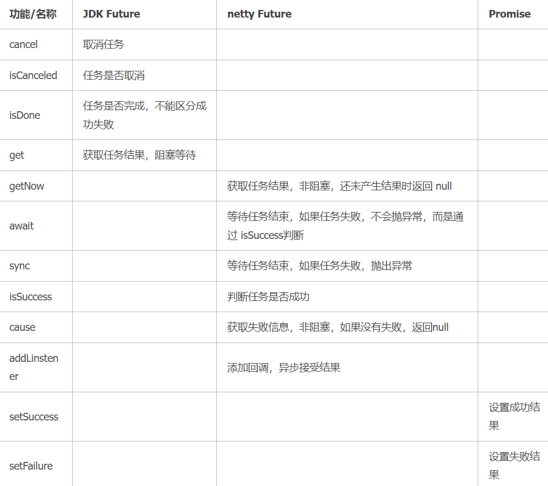
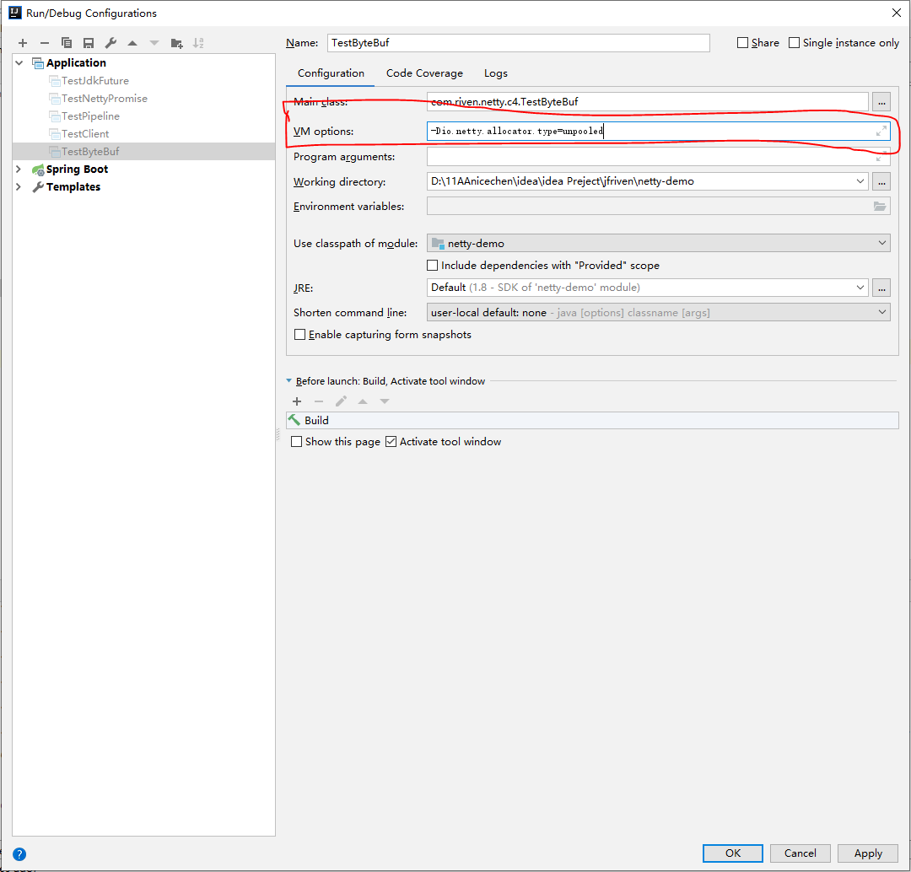

## 基本使用

###  依赖

```xml
<dependency>
    <groupId>io.netty</groupId>
    <artifactId>netty-all</artifactId>
</dependency>
```

### EventLoopGroup

```java
@Slf4j
public class TestEventLoop {
    public static void main(String[] args) {
        //1、创建事件循环组
        //能处理 io 事件、普通任务、定时任务，如果不传参数，默认有 8 个线程
        EventLoopGroup group = new NioEventLoopGroup(2); 
        //能处理 普通任务、定时任务，如果不传参数，默认有 8 个线程
        //EventLoopGroup eventExecutors = new DefaultEventLoopGroup();
        
        //2、获取下一个事件循环对象
        System.out.println(group.next());//第一个线程
        System.out.println(group.next());//第二个线程
        System.out.println(group.next());//第一个线程
        
        //3、执行普通任务
        group.next().submit(() -> {
            try {
                Thread.sleep(1000);
                log.info("普通任务");
            }catch (Exception e){
                e.printStackTrace();
            }
        });
        //4、执行定时任务
        //参数一：执行的任务
        //参数二：等待多久后后执行
        //参数三：每隔多久执行一次
        //参数四：时间单位
        group.next().scheduleAtFixedRate(() -> {
            log.info("定时任务");
        },3,5, TimeUnit.SECONDS);

        log.info("主线程");
    }
}
```

### ServerBootstrap

```java
public class NettyServer {
    public static void main(String[] args) {
        // 指定 mainReactor
        EventLoopGroup bossGroup = new NioEventLoopGroup(1);
        // 指定 subReactor
        EventLoopGroup workerGroup = new NioEventLoopGroup();
        // 用户自定义的 ThreadPool
        EventExecutorGroup threadPool = new ThreadPool();
        try {
            ServerBootstrap b = new ServerBootstrap();
            b.group(bossGroup, workerGroup)
             .channel(NioServerSocketChannel.class)
             .option(ChannelOption.SO_BACKLOG, 100) // 设置 TCP 参数
             .childHandler(new ChannelInitializer<SocketChannel>() {
                 @Override
                 public void initChannel(SocketChannel ch) throws Exception {
                     ChannelPipeline p = ch.pipeline();
                     p.addLast(threadPool,    
                        new DecoderHandler(),   // 解码处理器
                        new ComputeHandler());  // 计算处理器
                        new EncoderHandler(),   // 编码处理器
                 }
             });

            // 绑定到本地端口等待客户端连接
            ChannelFuture f = b.bind(PORT).sync();
            // 等待接受客户端连接的 Channel 被关闭
            f.channel().closeFuture().sync();
        } finally {
            // 关闭两个线程组
            bossGroup.shutdownGracefully();
            workerGroup.shutdownGracefully();
            threadPool.shutdown();
        }
    }
}
```

1. handler()：指定 mainReactor 的处理器，处理服务端启动中的逻辑

```java
serverBootstrap.handler(new ChannelInitializer<NioServerSocketChannel>() {
    protected void initChannel(NioServerSocketChannel ch) {
        System.out.println("服务端启动中");
    }
})
```

2. childHandler()：指定 subReactor 中的处理器，处理连接的读写逻辑
3. attr()：给服务端的 channel 指定一些自定义属性。然后通过 channel.attr()取出这个属性，其实就是给 channel 维护一个 map
4. childAttr()：作用和上面一样，这个是针对客户端的 channel。
5. option()：给服务端的 channel 设置属性，指定 TCP 相关的参数以及一些 Netty 自定义的参数

```java
serverBootstrap.option(ChannelOption.SO_BACKLOG, 1024)
// 用于临时存放已完成三次握手的请求的队列的最大长度，如果连接建立频繁，
// 服务器处理创建新连接较慢，可以适当调大这个参数
```

6. childOption()：这个是给每条客户端连接设置 TCP 相关的属性

```java
serverBootstrap
        //开启 TCP 底层心跳机制
        .childOption(ChannelOption.SO_KEEPALIVE, true)
        //开启 Nagle 算法，如果要求高实时性，有数据发送时就马上发送，就关闭，如果需要减少发送次数减少网络交互，就开启。
        .childOption(ChannelOption.TCP_NODELAY, true)
```

**自定义线程池**

不在 `addLast(Handler)` 方法中指定线程池，那么将使用默认的 subReacor 即 woker 线程池也即 IO 线程池执行处理器中的业务逻辑代码。

又比如，如开始的例子只让 IO 线程池处理 read，write 等 IO 事件会觉得有点大材小用，于是将 decode 和 encode 交给 IO 线程处理，如果此时的 compute 查询需要数据库中的数据，那么代码可改动为如下：

```java
b.childHandler(new ChannelInitializer<SocketChannel>() {
     @Override
     public void initChannel(SocketChannel ch) throws Exception {
         ChannelPipeline p = ch.pipeline();
         p.addLast(new DecoderHandler());   // 解码处理器
         p.addLast(new EncoderHandler());   // 编码处理器
         p.addLast(threadPool, new ComputeWithSqlHandler());   // 附带 SQL 查询的计算
     }
});
```

### Bootstrap

```java
public class NettyClient {
    public static void main(String[] args) {
        NioEventLoopGroup workerGroup = new NioEventLoopGroup();
        Bootstrap bootstrap = new Bootstrap();
        bootstrap
                // 1.指定线程模型
                .group(workerGroup)
                // 2.指定 IO 类型为 NIO
                .channel(NioSocketChannel.class)
                // 3.IO 处理逻辑
                .handler(new ChannelInitializer<SocketChannel>() {
                    @Override
                    public void initChannel(SocketChannel ch) {
                    }
                });
        // 4.建立连接
        bootstrap.connect("127.0.0.1", 8000).addListener(future -> {
            if (future.isSuccess()) {
                System.out.println("连接成功!");
            } else {
                System.err.println("连接失败!");
                //重新连接
            }
        });
    }
}
```

### 服务端和客户端

#### 数据通信

**客户端**

```java
.handler(new ChannelInitializer<SocketChannel>() {
    @Override
    public void initChannel(SocketChannel ch) {
        ch.pipeline().addLast(new FirstClientHandler());
    }
});
```

```java
public class FirstClientHandler extends ChannelInboundHandlerAdapter {
    @Override
    public void channelActive(ChannelHandlerContext ctx) {
        System.out.println("客户端发送消息...");
        // 1. 获取数据
        ByteBuf buffer = getByteBuf(ctx);
        // 2. 写数据
        ctx.channel().writeAndFlush(buffer);
    }
    
    private ByteBuf getByteBuf(ChannelHandlerContext ctx) {
        // 1. 获取二进制抽象 ByteBuf
        ByteBuf buffer = ctx.alloc().buffer();
        // 2. 准备数据，指定字符串的字符集为 utf-8
        byte[] bytes = ("【客户端】:这是客户端发送的消息："+new Date()).getBytes(Charset.forName("utf-8"));
        // 3. 填充数据到 ByteBuf
        buffer.writeBytes(bytes);
        return buffer;
    }
    
    @Override
    public void channelRead(ChannelHandlerContext ctx, Object msg) {
        ByteBuf byteBuf = (ByteBuf) msg;
        //接收服务端的消息并打印
        System.out.println(byteBuf.toString(Charset.forName("utf-8")));
    }
}
```

**服务端**

```java
.childHandler(new ChannelInitializer<NioSocketChannel>() {
    protected void initChannel(NioSocketChannel ch) {
        ch.pipeline().addLast(new FirstServerHandler());
    }
});
```

```java
public class FirstServerHandler extends ChannelInboundHandlerAdapter {
    @Override
    public void channelRead(ChannelHandlerContext ctx, Object msg) {
        ByteBuf byteBuf = (ByteBuf) msg;
        System.out.println(new Date() + ": 服务端读到数据 -> " + byteBuf.toString(Charset.forName("utf-8")));
        //接收到客户端的消息后我们再回复客户端
        ByteBuf out = getByteBuf(ctx);
        ctx.channel().writeAndFlush(out);
    }
    
    private ByteBuf getByteBuf(ChannelHandlerContext ctx) {
        byte[] bytes = "【服务器】:我是服务器，我收到你的消息了！".getBytes(Charset.forName("utf-8"));
        ByteBuf buffer = ctx.alloc().buffer();
        buffer.writeBytes(bytes);
        return buffer;
    }
}
```

#### 案例 1

1. 服务端

```java
public class HelloServer {
    public static void main(String[] args) {
        //1、ServerBootstrap：启动器，复制组装 netty 组件，启动服务器
        new ServerBootstrap()
                //2、一个 Netty 服务端启动时，通常会有两个 NioEventLoopGroup：一个是监听线程组，主要是监听客户端请求，
                //另一个是工作线程组，主要是处理与客户端的数据通讯。（这里只创建了一个线程组）
                //这里不断的循环，检查是否有新的事件
                .group(new NioEventLoopGroup())
                //3、选择服务器的 ServerSocketChannel 实现，还有 OIO（BIO）
                .channel(NioServerSocketChannel.class)
                //4、编写工作线程的具体业务代码
                .childHandler(
                    //5、Channel：代表和客户端进行数据读写的通道 Initializer：初始化，负责添加别的 handler
                    new ChannelInitializer<NioSocketChannel>() {
                        //6、添加具体的 handler
                        @Override
                        protected void initChannel(NioSocketChannel nioSocketChannel) throws Exception {
                            //将 ByteBuf 转换为字符串 （ByteBuf 与 ByteBuffer 差不多，ByteBuf 在 ByteBuffer 上做了增强）
                            nioSocketChannel.pipeline().addLast(new StringDecoder()); 
                            //自定义 handler
                            nioSocketChannel.pipeline().addLast(new ChannelInboundHandlerAdapter(){ 
                                //读事件触发后执行，也就是将 ByteBuf 转换为字符串后触发
                                @Override
                                public void channelRead(ChannelHandlerContext ctx, Object msg) throws Exception {
                                    // 打印上一步转换好的字符串
                                    System.out.println(msg);
                                }
                            });
                        }
                //7、绑定监听端口
                }).bind(8080);
    }
}
```

2. 客户端

```java
public class HelloClient {
    public static void main(String[] args) throws Exception{
        //1、启动类
        new Bootstrap()
            //2、添加 EventLoop
            .group(new NioEventLoopGroup())
            //3、选择客户端 channel 实现
            .channel(NioSocketChannel.class)
            //4、添加处理器
            .handler(new ChannelInitializer<NioSocketChannel>() {
                //载链接建立后被调用
                @Override
                protected void initChannel(NioSocketChannel nioSocketChannel) throws Exception {
                    //编码，将字符串转换为 ByteBuf
                    nioSocketChannel.pipeline().addLast(new StringEncoder());
                }
            })
            //5、连接到服务器
            .connect(new InetSocketAddress("localhost",8080))
            //阻塞方法，直到建立连接
            .sync()
            //代表连接对象
            .channel()
            //6、向服务端发送数据
            .writeAndFlush("hello,world");
    }
}
```

#### 案例 2

1. 服务端

```java
@Slf4j
public class EventLoopServer {
    public static void main(String[] args) {
        //默认为 8 个线程
        EventLoopGroup group = new DefaultEventLoopGroup();
        new ServerBootstrap()
                //线程组一（new NioEventLoopGroup()）：只负责 ServerSocketChannel 上的 accept 事件。没必要设置有多少个线程，不设置默认 8 个。
                //线程组二（new NioEventLoopGroup(2)）：只负责 SocketChannel 上的读写，可以设置有多少个线程，不设置默认为 8 个。
                .group(new NioEventLoopGroup(), new NioEventLoopGroup(2))
                .channel(NioServerSocketChannel.class)
                .childHandler(new ChannelInitializer<NioSocketChannel>() {
                    @Override
                    protected void initChannel(NioSocketChannel nioSocketChannel) throws Exception {
                        //参数一：handler 的名称
                        //参数二：触发事件后执行的业务逻辑
                        nioSocketChannel.pipeline().addLast("handler1",new ChannelInboundHandlerAdapter(){
                            @Override
                            public void channelRead(ChannelHandlerContext ctx, Object msg) throws Exception {
                                ByteBuf buf = (ByteBuf)msg;
                                log.info(buf.toString(Charset.forName("UTF-8")));
                                //让消息传递给下一个 handler, 如果不调用此方法，消息传到 handler1 就断了，不会将消息传到 handler2
                                ctx.fireChannelRead(msg);
                            }
                            //多创建一个 handler
                            //参数一：如果设置了，那么就不使用上面的 NioEventLoopGroup 线程组来处理读写，而是使用所设置的线程组（这里设置的是使用 DefaultEventLoopGroup 线程组）
                        }).addLast(group,"handler2",new ChannelInboundHandlerAdapter(){
                            @Override
                            public void channelRead(ChannelHandlerContext ctx, Object msg) throws Exception {
                                ByteBuf buf = (ByteBuf)msg;
                                log.info(buf.toString(Charset.forName("UTF-8")));
                            }
                        });
                    }
                })
                .bind(8080);
    }
}
```

2. 客户端

```java
public class EventLoopClient {
    public static void main(String[] args) throws Exception{
        String abc="hello,world";
        //1、启动类
        new Bootstrap()
                //2、添加 EventLoop
                .group(new NioEventLoopGroup())
                //3、选择客户端 channel 实现
                .channel(NioSocketChannel.class)
                //4、添加处理器
                .handler(new ChannelInitializer<NioSocketChannel>() {
                    //载链接建立后被调用
                    @Override 
                    protected void initChannel(NioSocketChannel nioSocketChannel) throws Exception {
                        //编码，将字符串转换为 ByteBuf
                        nioSocketChannel.pipeline().addLast(new StringEncoder());
                    }
                })
                //5、连接到服务器
                .connect(new InetSocketAddress("localhost", 8080))
                //阻塞方法，直到建立连接
                .sync()
                .channel()
                .writeAndFlush(abc);
    }
}
```

### Channel 优化

```java
public class EventLoopClient {
    
    public static void main(String[] args) throws Exception{
        //带有 Future、Promise 的类型都是和异步方法配套使用，用来处理结果
        ChannelFuture channelFuture = new Bootstrap()
                .group(new NioEventLoopGroup())
                .channel(NioSocketChannel.class)
                .handler(new ChannelInitializer<NioSocketChannel>() {
                    @Override
                    protected void initChannel(NioSocketChannel nioSocketChannel) throws Exception {
                        nioSocketChannel.pipeline().addLast(new StringEncoder());
                    }
                })
                //1、连接到服务器
                //这个是异步非阻塞的，它是由 NioEventLoopGroup 线程组去执行与服务端连接
                .connect(new InetSocketAddress("localhost", 8080));

        //2.1 使用 sycn 方法同步处理结果
        //如果不调用阻塞式的 sync()方法，那么客户端还没有与服务端建立起连接就调用 channel 此时的 channel 为空
        /*channelFuture.sync(); //阻塞，直到建立起连接
        Channel channel = channelFuture.channel();
        channel.writeAndFlush("hello, world");*/

        //2.2 使用 addListener（回调对象） 方法异步处理结果。（他把等待建立，建立成功，处理结果，全都交给另外一个线程干，addListener 作用是：将来连接成功后需要进行什么操作）
        channelFuture.addListener(new ChannelFutureListener() {
            @Override
            //在 nio 线程连接建立好之后，会调用 operationComplete(ChannelFuture channelFuture)
            //参数中的 channelFuture 对象就是上面调用 addListener 的 channelFuture 对象
            public void operationComplete(ChannelFuture channelFuture) throws Exception {
                Channel channel = channelFuture.channel();
                channel.writeAndFlush("hello world");
            }
        });
    }
}
```

优化后

```java
public class EventLoopClient {
    
    public static void main(String[] args) throws Exception{
        NioEventLoopGroup group = new NioEventLoopGroup();
        ChannelFuture channelFuture = new Bootstrap()
                //把 new NioEventLoopGroup() 放到外面创建，以便后续关闭线程
                .group(group)
                .channel(NioSocketChannel.class)
                .handler(new ChannelInitializer<NioSocketChannel>() {
                    @Override
                    protected void initChannel(NioSocketChannel nioSocketChannel) throws Exception {
                        nioSocketChannel.pipeline().addLast(new LoggingHandler(LogLevel.DEBUG));
                        nioSocketChannel.pipeline().addLast(new StringEncoder());
                    }
                })
                .connect(new InetSocketAddress("localhost", 8080));
        Channel channel = channelFuture.sync().channel();
        new Thread(() -> {
            while(true) {
                Scanner sc = new Scanner(System.in);
                String str = sc.nextLine();
                channel.writeAndFlush(str);
                if (str.equals("exit")) {
                    //close 是异步操作，也就是说 close() 还没执行完就往下面运行了。可以使用 CloseFuture 对象
                    channel.close(); 
                    log.info("通道已关闭");
                    break;
                }
            }
        }).start();

        //获取 CloseFuture 对象， 1） 同步处理关闭； 2） 异步处理关闭
        ChannelFuture closeFuture = channel.closeFuture();
        //1、同步
        /*closeFuture.sync(); //channel 阻塞到关闭后
        group.shutdownGracefully();
        System.out.println("channel 已经关闭");*/
        
        //2、异步
        closeFuture.addListener((ChannelFutureListener) -> {
            //channel 关闭后执行
            System.out.println("channel 已经关闭");
            //停止接受新的任务，把现有的任务运行完后关闭
            group.shutdownGracefully();
        });
    }
}
```

### ChannelPipeline

```java
@Slf4j
public class TestPipeline {
    
    public static void main(String[] args) {
        new ServerBootstrap()
                .group(new NioEventLoopGroup())
                .channel(NioServerSocketChannel.class)
                .childHandler(new ChannelInitializer<NioSocketChannel>() {
                    @Override
                    protected void initChannel(NioSocketChannel nioSocketChannel) throws Exception {
                        //1、通过 channel 拿到 pipeline
                        ChannelPipeline pipeline = nioSocketChannel.pipeline();
                        //2、添加处理器
                        //入站：h1、h2、h3   出战：h7、h4、h5、h6   执行顺序：h1 -> h2 -> h3 -> h6 -> h5 -> h4 -> h7 （入站按顺序，出站反序）
                        pipeline.addLast("h1",new ChannelInboundHandlerAdapter(){
                            @Override
                            public void channelRead(ChannelHandlerContext ctx, Object msg) throws Exception {
                                log.info("1");
                                ByteBuf buf = (ByteBuf)msg;
                                String name = buf.toString(Charset.defaultCharset());
                                //将数据传到下一个 Read 的 Handler
                                super.channelRead(ctx,name);
                            }
                        });

                        pipeline.addLast("h2",new ChannelInboundHandlerAdapter(){
                            @Override
                            public void channelRead(ChannelHandlerContext ctx, Object msg) throws Exception {
                                log.info("2");
                                Student student = new Student(msg.toString());
                                super.channelRead(ctx,student);
                            }
                        });
                        //出站
                        pipeline.addLast("h7", new ChannelOutboundHandlerAdapter() {
                            @Override
                            public void write(ChannelHandlerContext ctx, Object msg, ChannelPromise promise) throws Exception {
                                log.info("7");
                                super.write(ctx, msg, promise);
                            }
                        });

                        pipeline.addLast("h3",new ChannelInboundHandlerAdapter(){
                            @Override
                            public void channelRead(ChannelHandlerContext ctx, Object msg) throws Exception {
                                log.info("3");
                                log.info("msg:{}",msg);
                                //如果没有写出，只会触发读，不会触发写
                                // 也就是说只会触发入站，不会触发出战
                                //nioSocketChannel.writeAndFlush(ctx.alloc().buffer().writeBytes("server...".getBytes()));

                                //使用 ctx 调用 writeAndFlush 会往此方法上面找出站方法，所以执行顺序是：h1 -> h2 -> h3 -> h7
                                ctx.writeAndFlush(ctx.alloc().buffer().writeBytes("server ...".getBytes()));
                            }
                        });

                        pipeline.addLast("h4", new ChannelOutboundHandlerAdapter() {
                            @Override
                            public void write(ChannelHandlerContext ctx, Object msg, ChannelPromise promise) throws Exception {
                                log.info("4");
                                super.write(ctx, msg, promise);
                            }
                        });

                        pipeline.addLast("h5", new ChannelOutboundHandlerAdapter() {
                            @Override
                            public void write(ChannelHandlerContext ctx, Object msg, ChannelPromise promise) throws Exception {
                                log.info("5");
                                super.write(ctx, msg, promise);
                            }
                        });

                        pipeline.addLast("h6", new ChannelOutboundHandlerAdapter() {
                            @Override
                            public void write(ChannelHandlerContext ctx, Object msg, ChannelPromise promise) throws Exception {
                                log.info("6");
                                super.write(ctx, msg, promise);
                            }
                        });
                    }
                }).bind(8080);
    }
    
    @Data
    static class Student{
        public String name;

        public Student() {
        }

        public Student(String name) {
            this.name = name;
        }
    }
}
```

### ChannelHandler

ChannelHandler 并没有方法处理事件，而需要由子类处理：ChannelInboundHandler 拦截和处理入站事件，ChannelOutboundHandler 拦截和处理出站事件。我们已经明白，ChannelPipeline 中的事件不会自动流动，而我们一般需求事件自动流动，Netty 提供了两个 Adapter：ChannelInboundHandlerAdapter 和 ChannelOutboundHandlerAdapter 来满足这种需求。其中的实现类似如下：

```java
// inboud 事件默认处理过程
public void channelRegistered(ChannelHandlerContext ctx) throws Exception {
    ctx.fireChannelRegistered();    // 事件传播到下一个 Handler
}

// outboud 事件默认处理过程
public void bind(ChannelHandlerContext ctx, SocketAddress localAddress,
        ChannelPromise promise) throws Exception {
    ctx.bind(localAddress, promise);  // 事件传播到下一个 Handler
}
```

在 Adapter 中，事件默认自动传播到下一个 Handler，这样带来的另一个好处是：用户的 Handler 类可以继承 Adapter 且覆盖自己感兴趣的事件实现，其他事件使用默认实现，不用再实现 ChannelIn/outboudHandler 接口中所有方法，提高效率。

我们常常遇到这样的需求：在一个业务逻辑处理器中，需要写数据库、进行网络连接等耗时业务。Netty 的原则是不阻塞 I/O 线程，所以需指定 Handler 执行的线程池，可使用如下代码：

```java
static final EventExecutorGroup group = new DefaultEventExecutorGroup(16);
...
ChannelPipeline pipeline = ch.pipeline();
// 简单非阻塞业务，可以使用 I/O 线程执行
pipeline.addLast("decoder", new MyProtocolDecoder());
pipeline.addLast("encoder", new MyProtocolEncoder());
// 复杂耗时业务，使用新的线程池
pipeline.addLast(group, "handler", new MyBusinessLogicHandler());
```

ChannelHandler 中有一个 Sharable 注解，使用该注解后多个 ChannelPipeline 中的 Handler 对象实例只有一个，从而减少 Handler 对象实例的创建。代码示例如下：

```java
public class DataServerInitializer extends ChannelInitializer<Channel> {
   private static final DataServerHandler SHARED = new DataServerHandler();

   @Override
   public void initChannel(Channel channel) {
       channel.pipeline().addLast("handler", SHARED);
   }
}
```

Sharable 注解的使用是有限制的，多个 ChannelPipeline 只有一个实例，所以该 Handler 要求 **无状态**。上述示例中，DataServerHandler 的事件处理方法中，不能使用或改变本身的私有变量，因为 ChannelHandler 是 **非线程安全** 的，使用私有变量会造成线程竞争而产生错误结果。

### Unpooled

Netty 提供一个专门用来操作缓冲区（即 Netty 的数据容器）的工具类

```java
public class NettyByteBuf01 {

    public static void main(String[] args) {
        //创建一个 ByteBuf
        //1. 创建对象，该对象包含一个数组 arr, 是一个 byte [10]
        //2. 在 netty 的 buffer 中，不需要使用 flip 进行反转，底层维护了 readerindex 和 writerIndex
        //3. 通过 readerindex 和  writerIndex 和 capacity，将 buffer 分成三个区域
        // 0---readerindex 已经读取的区域
        // readerindex---writerIndex ，可读的区域
        // writerIndex---capacity, 可写的区域
        ByteBuf buffer = Unpooled.buffer(10);

        for (int i = 0; i < 10; i++) {
            buffer.writeByte(i);
        }

        System.out.println("capacity=" + buffer.capacity());//10
        //输出
//        for(int i = 0; i < buffer.capacity(); i++) {
//            System.out.println(buffer.getByte(i));
//        }
        for (int i = 0; i < buffer.capacity(); i++) {
            System.out.println(buffer.readByte());
        }
        System.out.println("执行完毕");
    }
}
```

```java
public class NettyByteBuf02 {
    
    public static void main(String[] args) {
        //创建 ByteBuf
        ByteBuf byteBuf = Unpooled.copiedBuffer("hello,world!", Charset.forName("utf-8"));
        //使用相关的方法
        if (byteBuf.hasArray()) { // true
            byte[] content = byteBuf.array();

            //将 content 转成字符串
            System.out.println(new String(content, Charset.forName("utf-8")));
            System.out.println("byteBuf=" + byteBuf);
            System.out.println(byteBuf.arrayOffset()); // 0
            System.out.println(byteBuf.readerIndex()); // 0
            System.out.println(byteBuf.writerIndex()); // 12
            System.out.println(byteBuf.capacity()); // 36

            //System.out.println(byteBuf.readByte()); //
            System.out.println(byteBuf.getByte(0)); // 104
            int len = byteBuf.readableBytes(); //可读的字节数  12
            System.out.println("len=" + len);
            //使用 for 取出各个字节
            for (int i = 0; i < len; i++) {
                System.out.println((char) byteBuf.getByte(i));
            }

            //按照某个范围读取
            System.out.println(byteBuf.getCharSequence(0, 4, Charset.forName("utf-8")));
            System.out.println(byteBuf.getCharSequence(4, 6, Charset.forName("utf-8")));
        }
    }
}
```

### Future

netty 中的 Future 与 jdk 中的 Future 同名，但是是两个接口，netty 的 Future 继承自 jdk 的 Future，而 Promise 又对 netty Future 进行了扩展。

1. jdk Future 只能同步等待任务结束（或成功、或失败）才能得到结果；
2. netty Future 可以同步等待任务结束得到结果，也可以异步方式得到结果，但都是要等任务结束；
3. netty Promise 不仅有 netty Future 的功能，而且脱离了任务独立存在，只作为两个线程间传递结果的容器



**JDK Future**

```java
@Slf4j
public class TestJdkFuture {
    public static void main(String[] args) throws Exception{
        //1、线程池
        ExecutorService service = Executors.newFixedThreadPool(2);
        //2、提交任务 非阻塞   execute 是使用 Runnable 五返回结果  submit 是使用 Callable 有返回结果
        Future<Integer> future = service.submit(new Callable<Integer>() {
            @Override
            public Integer call() throws Exception {
                log.info("正在执行");
                Thread.sleep(1000);
                return 50;
            }
        });
        //3、主线程通过 future 来获取结果 获取任务结果，阻塞等待
        log.info("执行完毕 {}",future.get());
    }
}
```

**Netty Future**

```java
@Slf4j
public class TestJdkFuture {
    public static void main(String[] args) throws Exception{
        //线程组，默认有 8 个线程
        NioEventLoopGroup group = new NioEventLoopGroup();
        //获取一个线程
        EventLoop eventLoop = group.next();
        Future<Integer> future = eventLoop.submit(new Callable<Integer>() {
            @Override
            public Integer call() throws Exception {
                log.info("执行计算");
                Thread.sleep(1000);
                return 50;
            }
        });
        //同步, 阻塞等待
        /*log.info("执行完毕 {}", future.get());
        group.shutdownGracefully();*/

        //异步
        future.addListener(new GenericFutureListener<Future<? super Integer>>() {
            @Override
            public void operationComplete(Future<? super Integer> future) throws Exception {
                log.info("接收结果：{}" , future.getNow());
                //执行任务完毕后关闭线程，关闭线程也需要时间
                group.shutdownGracefully();
            }
        });
    }
}
```

### Promise

Promise 是可写的 Future，Future 自身并没有写操作相关的接口， Netty 通过 Promise 对 Future 进行扩展，用于设置 IO 操作的结果

```java
@Slf4j
public class TestNettyPromise {
    public static void main(String[] args) {
        //1、准备 EventLoop 对象
        EventLoop eventLoop = new NioEventLoopGroup().next();
        //2、可以主动创建 promise 对象，他是一个结果容器
        DefaultPromise<Integer> promise = new DefaultPromise<>(eventLoop);
        new Thread(() -> {
            //3、任意一个线程执行计算，计算完毕后向 promise 填充结果
            System.out.println("开始计算");
            try{
                Thread.sleep(1000);
                int i = 10 / 0;
                //设置成功结果
                promise.setSuccess(80);
            }catch (Exception e){
                e.printStackTrace();
                //设置失败结果
                promise.setFailure(e);
            }
        }).start();

        //4、接收结果的线程
        log.info("等待结果....");
        try {
            //promise.get() 阻塞式
            log.info("结果是：{}", promise.get());
        }catch (Exception e){
            e.printStackTrace();
        }
    }
}
```

## 使用详解

### 服务端
```java
public class HttpServer {
    public static void main(String[] args) {
        //构造两个线程组
        EventLoopGroup bossrGroup = new NioEventLoopGroup();
        EventLoopGroup workerGroup = new NioEventLoopGroup();
        try {
            //服务端启动辅助类
            ServerBootstrap bootstrap = new ServerBootstrap();
            bootstrap.group(bossGroup, workerGroup)
                    .channel(NioServerSocketChannel.class)
                    .childHandler(new HttpServerInitializer());
 
            ChannelFuture future = bootstrap.bind(8080).sync();
            //等待服务端口关闭
            future.channel().closeFuture().sync();
        } catch (InterruptedException e) {
            e.printStackTrace();
        } finally {
            // 优雅退出，释放线程池资源
            bossGroup.shutdownGracefully();
            workerGroup.shutdownGracefully();
        }
    }
}
```

在编写 Netty 程序时，一开始都会生成 NioEventLoopGroup 的两个实例，分别是 bossGroup 和 workerGroup，也可以称为 parentGroup 和 childGroup。可以这么理解，bossGroup 和 workerGroup 是两个线程池，它们默认线程数为 CPU 核心数乘以 2，bossGroup 用于接收客户端传过来的请求，接收到请求后将后续操作交由 workerGroup 处理。

channel 方法用于指定服务器端监听套接字通道 NioServerSocketChannel，其内部管理了一个 Java NIO 中的 ServerSocketChannel 实例。channelHandler 方法用于设置业务职责链，它其实就是由一个个的 ChannelHandler 串联而形成的链式结构。

接着我们调用了 bootstrap 的 bind 方法将服务绑定到 8080 端口上，bind 方法内部会执行端口绑定等一系列操作，使得前面的配置都各就各位各司其职，sync 方法用于阻塞当前 Thread，一直到端口绑定操作完成

```java
public class HttpServerInitializer extends ChannelInitializer<SocketChannel> {
    protected void initChannel(SocketChannel sc) throws Exception {
        ChannelPipeline pipeline = sc.pipeline();
        //处理 http 消息的编解码
        pipeline.addLast("httpServerCodec", new HttpServerCodec());
        //等同于下面两个的结合
        //pipeline.addLast("httpResponseEndcoder", new HttpResponseEncoder());
        //pipeline.addLast("HttpRequestDecoder", new HttpRequestDecoder());
        
        //添加自定义的 ChannelHandler
        pipeline.addLast("httpServerHandler", new HttpServerChannelHandler0());
    }
}
```

ChannelInitializer 继承 ChannelInboundHandlerAdapter，用于初始化 Channel 的 ChannelPipeline。通过 initChannel 方法参数 sc 得到 ChannelPipeline 的一个实例。

当一个新的连接被接受时， 一个新的 Channel 将被创建，同时它会被自动地分配到它专属的 ChannelPipeline。

```java
public class HttpServerChannelHandler0 extends SimpleChannelInboundHandler<HttpObject> {
    private HttpRequest request;
 
    @Override
    protected void channelRead0(ChannelHandlerContext ctx, HttpObject msg) throws Exception {
        if (msg instanceof HttpRequest) {
            request = (HttpRequest) msg;
            request.method();
            String uri = request.uri();
            System.out.println("Uri:" + uri);
        }
        if (msg instanceof HttpContent) {
            HttpContent content = (HttpContent) msg;
            ByteBuf buf = content.content();
            System.out.println(buf.toString(io.netty.util.CharsetUtil.UTF_8));
 
            ByteBuf byteBuf = Unpooled.copiedBuffer("hello world", CharsetUtil.UTF_8);
            FullHttpResponse response = new DefaultFullHttpResponse(HttpVersion.HTTP_1_1, HttpResponseStatus.OK, byteBuf);
            response.headers().add(HttpHeaderNames.CONTENT_TYPE, "text/plain");
            response.headers().add(HttpHeaderNames.CONTENT_LENGTH, byteBuf.readableBytes());
 
            ctx.writeAndFlush(response);
        }
    }
}
```

#### HttpObject

Netty 的设计中把 Http 请求分为了 HttpRequest 和 HttpContent 两个部分，HttpRequest 主要包含请求头、请求方法等信息，HttpContent 主要包含请求体的信息。

在 HttpContent 部分，首先输出客户端传过来的字符，然后通过 Unpooled 提供的静态辅助方法来创建未池化的 ByteBuf 实例， Java NIO 提供了 ByteBuffer 作为它的字节容器，Netty 的 ByteBuffer 替代品是 ByteBuf。

接着构建一个 FullHttpResponse 的实例，并为它设置一些响应参数，最后通过 writeAndFlush 方法将它写回给客户端。

#### FullHttpRequest

上面这样获取请求和消息体则相当不方便，Netty 又提供了另一个类 FullHttpRequest，FullHttpRequest 包含请求的所有信息，它是一个接口，直接或者间接继承了 HttpRequest 和 HttpContent，它的实现类是 DefalutFullHttpRequest。因此我们可以修改自定义的 ChannelHandler 如下：

```java
public class HttpServerChannelHandler0 extends SimpleChannelInboundHandler<FullHttpRequest> {
 
    protected void channelRead0(ChannelHandlerContext ctx, FullHttpRequest msg) throws Exception {
        ctx.channel().remoteAddress();
 
        FullHttpRequest request = msg;
 
        System.out.println("请求方法名称:" + request.method().name());
        System.out.println("uri:" + request.uri());
        ByteBuf buf = request.content();
        System.out.print(buf.toString(CharsetUtil.UTF_8));
 
        ByteBuf byteBuf = Unpooled.copiedBuffer("hello world", CharsetUtil.UTF_8);
        FullHttpResponse response = new DefaultFullHttpResponse(HttpVersion.HTTP_1_1, HttpResponseStatus.OK, byteBuf);
        response.headers().add(HttpHeaderNames.CONTENT_TYPE, "text/plain");
        response.headers().add(HttpHeaderNames.CONTENT_LENGTH, byteBuf.readableBytes());
 
        ctx.writeAndFlush(response);
    }
}
```

#### HttpObjectAggregator

对于将请求合并为一个 FullRequest 是需要代码实现的，然而这里我们并不需要我们自己动手去实现，Netty 为我们提供了一个 HttpObjectAggregator 类，这个 ChannelHandler 作用就是将请求转换为单一的 FullHttpRequest。

核心功能：

- **聚合**：它监听流经它的 HTTP 消息碎片（`HttpRequest`, `HttpContent`, `LastHttpContent`）。
- **缓存**：它将所有这些碎片缓存起来，直到接收到 `LastHttpContent`。
- **生成**：一旦收到结束标记，它就将其组装成一个 **`FullHttpRequest`**（对于请求）或 **`FullHttpResponse`**（对于响应），并发送给管道中的下一个 Handler。
- **安全控制**：通过构造函数参数 `maxContentLength` 来限制最大聚合内容长度，防止内存耗尽攻击。

对应的参数信息是保存在 `message body` 中的，如果只是单纯的用 `HttpServerCodec` 是无法完全的解析 Http POST 请求的，因为 `HttpServerCodec` 只能获取 uri 中参数，所以需要加上 `HttpObjectAggregator`

在 HTTP 通信中，一个 HTTP 消息可能由多个部分组成，具体可能包括一个 `HttpRequest` 或 `HttpResponse`，跟随着一个或多个 `HttpContent` 对象，最后以一个 `LastHttpContent` 对象结束。如果希望以一个单一的对象来处理完整的 HTTP 消息，就需要用到 `HttpObjectAggregator`。

`HttpObjectAggregator` 是一个通道处理器，在 Netty 的管道中主要用于将分散的多个消息部分合并成一个完整的 HTTP 请求或响应对象（即 `FullHttpRequest` 或 `FullHttpResponse`），这样就能够确保你的业务处理器能够处理完整的 HTTP 消息。此外，`HttpObjectAggregator` 也能够处理 HTTP 消息的分块传输编码的聚合。

在许多场景下，`HttpObjectAggregator` 是必要的，尤其是当你需要处理的 HTTP 消息可能包含多个部分而不是一个单一流式消息时。正因为 `HttpObjectAggregator` 可将这些部分合并，我们才可以关心消息的整个负载，忽视掉消息的分块状态。

```java
public class HttpServerInitializer extends ChannelInitializer<SocketChannel> {
    
    protected void initChannel(SocketChannel sc) {
        ChannelPipeline pipeline = sc.pipeline();
        //处理 http 消息的编解码
        pipeline.addLast("httpServerCodec", new HttpServerCodec());
        //设置聚合内容的最大长度
        pipeline.addLast("aggregator", new HttpObjectAggregator(65536));
        //添加自定义的 ChannelHandler
        pipeline.addLast("httpServerHandler", new HttpServerChannelHandler0());
    }
}
```

#### HttpServerCodec

`HttpServerCodec` 是一个编解码器，用于将字节流转换为 HTTP 消息对象，或将 HTTP 消息对象转换为字节流。简言之，它结合了 `HttpRequestDecoder` 和 `HttpResponseEncoder` 的功能，是一个方便的工具，用于 HTTP 服务器端的通道管道中，能够处理 HTTP 请求和响应的编码和解码。

在 Netty 的管道中加入 `HttpServerCodec`，实际上就是加入了两个单独的处理器：一个用于请求解码，一个用于响应编码。这个编解码器会将接收到的字节流分解成 HTTP 请求的各部分，例如 `HttpRequest`、`HttpContent`，以及 `LastHttpContent` 这样的消息对象。同样地，在响应客户端时也能将 `HttpResponse` 对象序列化成能在网络上发送的字节流。

### 客户端

```java
public class HttpClient {

   public static void main(String[] args) throws Exception {
       String host = "127.0.0.1";
       int port = 8080;

       EventLoopGroup group = new NioEventLoopGroup();
       try {
           Bootstrap b = new Bootstrap();
           b.group(group)
               .channel(NioSocketChannel.class)
               .handler(new ChannelInitializer<SocketChannel>() {
                   @Override
                   public void initChannel(SocketChannel ch) throws Exception {
                       ChannelPipeline pipeline = ch.pipeline();
                       pipeline.addLast(new HttpClientCodec());
                       pipeline.addLast(new HttpObjectAggregator(65536));
                       pipeline.addLast(new HttpClientHandler());
                   }
               });

           // 启动客户端.
           ChannelFuture f = b.connect(host, port).sync();
           f.channel().closeFuture().sync();
       } finally {
           group.shutdownGracefully();
       }
   }
}
```

```java
public class HttpClientHandler extends SimpleChannelInboundHandler<FullHttpResponse> {
 
    @Override
    public void channelActive(ChannelHandlerContext ctx) throws Exception {
        URI uri = new URI("http://127.0.0.1:8080");
        String msg = "Are you ok?";
        FullHttpRequest request = new DefaultFullHttpRequest(HttpVersion.HTTP_1_1, HttpMethod.GET,
                uri.toASCIIString(), Unpooled.wrappedBuffer(msg.getBytes("UTF-8")));
 
        // 构建 http 请求
//        request.headers().set(HttpHeaderNames.HOST, "127.0.0.1");
//        request.headers().set(HttpHeaderNames.CONNECTION, HttpHeaderValues.KEEP_ALIVE);
        request.headers().set(HttpHeaderNames.CONTENT_LENGTH, request.content().readableBytes());
        // 发送 http 请求
        ctx.channel().writeAndFlush(request);
    }
 
    @Override
    public void channelRead0(ChannelHandlerContext ctx, FullHttpResponse msg) {
        FullHttpResponse response = msg;
        response.headers().get(HttpHeaderNames.CONTENT_TYPE);
        ByteBuf buf = response.content();
        System.out.println(buf.toString(io.netty.util.CharsetUtil.UTF_8));
    }
}
```

### 内置的 Http 请求报文类

1. FullHttpRequest：包含整个 Http 请求的信息，包含对 HttpRequest 首部和 HttpContent 请求体的结合。
2. HttpRequest：请求首部，主要包含对 Http 请求行和请求头的组合。
3. HttpContent：对 Http 请求体进行封装，本质上就是一个 ByteBuf 缓冲区实例。如果 ByteBuf 的长度是固定的，则请求体过大，可能包含多个 HttpContent。解码的时候，最后一个解码返回对象为 LastHttpContent（空的 HttpContent），表示对请求体的解码已经结束。
4. HttpMethod：主要是对 Http 报文请求头的封装及相关操作。
5. HttpVersion：对 Http 版本的封装。
6. HttpHeaders：包含对 http 报文请求头的封装及相关操作。

## ByteBuffer

### 分配空间

```java
public class TestByteBufferAllocate {
    public static void main(String[] args){
        System.out.println(ByteBuffer.allocate(16).getClass()); // -- class java.nio.HeapByteBuffer
        System.out.println(ByteBuffer.allocateDirect(16).getClass()); // -- class java.nio.DirectByteBuffer
        /**/
    }
}
```

### mark 和 reset

mark 做一个标记，记录 position 位置，reset 是将 position 重置到 mark 的位置

```java
public class TestByteBufferAllocate {
    public static void main(String[] args){
        Charset charset = Charset.forName("UTF-8");
        ByteBuffer byteBuffer = ByteBuffer.allocateDirect(1024);
        byteBuffer.put(new byte[]{'a','b','c','d','e','f'});
        byteBuffer.flip();
        System.out.println((char) byteBuffer.get()); // a
        System.out.println((char) byteBuffer.get()); // b
        byteBuffer.mark(); //加标记，索引 2 位置
        System.out.println((char) byteBuffer.get()); // c
        System.out.println((char) byteBuffer.get()); // d
        byteBuffer.reset(); //将 position 重置到索引 2
        System.out.println((char) byteBuffer.get()); // c
        System.out.println((char) byteBuffer.get()); // d
    }
}
```

### 存入/取出字符串 

```java
public class TestByteBufferAllocate {
    public static void main(String[] args){
        //将数据存入 ByteBuffer 中
        //1、使用 getBytes(), 不会自动调用 flip()方法
        ByteBuffer buffer1 = ByteBuffer.allocate(1024);
        buffer1.put("hello".getBytes());

        //2、使用 Charset, 不会自动调用 flip()方法
        Charset charset = Charset.forName("UTF-8");
        ByteBuffer buffer2 = ByteBuffer.allocate(1024);
        buffer2.put(charset.encode("hello"));

        //3、使用 StandardCharsets, 会自动调用 flip()方法
        ByteBuffer buffer3 = StandardCharsets.UTF_8.encode("hello");

        //4、使用 wrap, 会自动调用 flip()方法
        ByteBuffer buffer4 = ByteBuffer.wrap("hello".getBytes());

        //重 ByteBuffer 中读取数据
        //1、使用 StandardCharsets
        buffer1.flip();
        String str1 = StandardCharsets.UTF_8.decode(buffer1).toString();
        System.out.println(str1);

        //2、使用 Charset
        buffer2.flip();
        String msg = String.valueOf(charset.decode(buffer2));
        System.out.println(msg);
    }
}
```

### 文件传输

```java
public class TestByteBufferAllocate {
    public static void main(String[] args){
        try{
            FileChannel data = new FileInputStream("D:\\11AAnicechen\\idea\\idea Preject\\data.txt").getChannel();
            FileChannel file = new FileOutputStream("D:\\11AAnicechen\\idea\\idea Preject\\to.txt").getChannel();
            //效率高，底层会利用操作系统的零拷贝进行优化，但是只能传输 2g 的数据
            //data.transferTo(0, data.size(), file);


            //使用多次传输，解决传输大小问题
            long size = data.size();
            //left 遍历代表还剩余多少字节
            for(long left = size;left>0;){
                left -= data.transferTo((size - left),left,file);
            }
        }catch (Exception e){
            e.printStackTrace();
        }
    }
}
```

## ByteBuf

### 出现背景
NIO 中经常使用的 ByteBuffer，但它还有一些缺陷：

1. 长度固定。
2. 读写状态需要通过 filp()和 rewind()手动转换。
3. 功能有限。

所以 Netty 为了解决 ByteBuffer 的这些缺陷，设计了 ByteBuf。


1. 从 ByteBuf 中每读取一个字节，readerIndex 自增 1，ByteBuf 里面总共有 writerIndex-readerIndex 个字节可读，由此可以推论出当 readerIndex 与 writerIndex 相等的时候，ByteBuf 不可读。
2. 写数据是从 writerIndex 指向的部分开始写，每写一个字节，writerIndex 自增 1，直到增到 capacity，这个时候，表示 ByteBuf 已经不可写了。
3. ByteBuf 里面其实还有一个参数 maxCapacity，当向 ByteBuf 写数据的时候，如果容量不足，那么这个时候可以进行扩容，直到 capacity 扩容到 maxCapacity，超过 maxCapacity 就会报错。

### 直接内存和堆内存
```java
// 创建池化基于堆的 ByteBuf
ByteBuf buffer = ByteBufAllocator.DEFAULT.heapBuffer(10);

// 创建池化基于直接内存的 ByteBuf
ByteBuf buffer = ByteBufAllocator.DEFAULT.directBuffer(10);
```

1. 直接内存创建和销毁的代价昂贵，但读写性能高（少一次内存复制），适合配合池化更能一起用；
2. 直接内存堆 GC 压力小，因为这部分内存不受 JVM 垃圾回收的管理，但也要注意及时主动释放。

### 池化和非池化
池化的最大意义在于可以重用 ByteBuf，优点：

1. 没有池化，则每次都得创建新的 ByteBuf 实例，这个操作堆直接内存代价昂贵，就算是堆内存，也会增加 GC 压力；
2. 有了池化，则可以重用池中 ByteBuf 实例，并且采用了与 jemalloc 类似的内存分配算法提升分配效率；
3. 高并发时，池化功能更节约内存，减少内存溢出的可能

池化功能是否开启，可以通过下面的系统环境变量来设置 

```java
-Dio.netty.allocator.type={unpooled | pooled} （关闭 | 开启）
```

+ 4.1 以后，非 Android 平台默认启用池化实现，Android 平台启用非池化实现；
+ 4.1 之前，池化功能还不成熟，默认是非池化实现。

### 创建
1. 池化

```java
ByteBuf buf1 = ByteBufAllocator.DEFAULT.buffer(); //池化，直接内存
ByteBuf buf2 = ByteBufAllocator.DEFAULT.heapBuffer(); //池化，堆内存
```

2. 非池化：如果操作后，再创建



```java
ByteBuf buf1 = ByteBufAllocator.DEFAULT.buffer(); //非池化，直接内存
ByteBuf buf2 = ByteBufAllocator.DEFAULT.heapBuffer(); //非池化，堆内存
```

### 扩容
扩容规则：

1. 如果写入后数据大小未超过 512，则选择下一个 16 的整数倍，例如写入后大小为 12，则扩容后 capacity 是 16；
2. 如果写入后数据大小超过 512，则选择下一个 2^n ，例如写入后大小为 513，则扩容后 capacity 是 2^n = 1024；
3. 扩容不能超过 max capacity 会报错。

### 读取
```java
ByteBuf buf = ByteBufAllocator.DEFAULT.buffer(1024); //池化，直接内存
byte[] b= {1,2,3,4,'a'};
buf.writeBytes(b);
for (int i=0;i<b.length;i++){
    System.out.println(buf.readByte());
}
```

读过的内容就属于废弃部分，再度只能读那些尚未读取的部分，如果需要重复读取一个数据，可以再 read 前先做个标记 mark，这时要重复读取，重置到标记位置 reset

```java
ByteBuf buf = ByteBufAllocator.DEFAULT.buffer(1024); //池化，直接内存
byte[] b= {1,2,3,4,'a'};
buf.writeBytes(b);
buf.markReaderIndex();
System.out.println(buf.readByte()); // 1
buf.resetReaderIndex();
System.out.println(buf.readByte()); // 1
buf.resetReaderIndex();
System.out.println(buf.readByte()); // 1
```

### retain 和 release
由于 Netty 中有堆外内存的 ByteBuf 实现，堆外内存最好是手动来释放，而不是等 GC 垃圾回收。

1. UnpooledHeapByteBuf 使用的是 JVM 内存，只需等 GC 回收内存即可；
2. UnpooledDirectByteBuf 使用的就是直接内存了，需要特殊的方法来回收内存；
3. PooledByteBuf 和它的子类使用了池化机制，需要更复杂的规则来回收内存。

Netty 这里采用了引用计数法来控制回收内存，每个 ByteBuf 都实现了 ReferenceCounted 接口。

1. 每个 ByteBuf 对象的初始计数为 1；
2. 调用 release 方法技术减 1，如果计数为 0，ByteBuf 内存被回收；
3. 调用 retain 方法技术加 1，表示调用者没用完之前，其他 handler 即使调用了 release 也不会造成回收；
4. 当技术为 0 时，底层内存会被回收，这时即使 ByteBuf 对象还在，其各个方法均无法正常使用。

## 其他

### ChannelInboundHandlerAdapter

```java
@ChannelHandler.Sharable // 标识一个 channelHandler 可以被多个 channel 安全地调用。
public class NettyServerHandler extends ChannelInboundHandlerAdapter {
    @Override
    // 当有入站消息时该方法就会调用
    public void channelRead(ChannelHandlerContext ctx, Object msg) throws Exception {
        ByteBuf buffer = (ByteBuf)msg;
        System.out.println("服务器收到消息:" + buffer.toString(CharsetUtil.UTF_8));
        // 将接收到的消息写给发送者，而不冲刷出站消息。
        ctx.write(buffer);
    }

    @Override
    // channelRead 消费完读取的数据的时候被触发
    public void channelReadComplete(ChannelHandlerContext ctx) throws Exception {
        // 将未决消息冲刷到远程节点，并且关闭该 channel
        ChannelFuture channelFuture = ctx.writeAndFlush(Unpooled.EMPTY_BUFFER);
        channelFuture.addListener(ChannelFutureListener.CLOSE);
    }

    @Override
    // 在读操作时处理异常
    public void exceptionCaught(ChannelHandlerContext ctx, Throwable cause) throws Exception {
        // 打印异常栈，并关闭该 channel
        cause.printStackTrace();
        ctx.close();
    }
}
```

注意：netty 服务端 handler 的处理是采用责任链的形式。默认情况下，channelHandler 会把对它的方法调用转发给链中的下一个 channelHandler。如果 exceptionCaught()方法没有被该链中的某处实现，那么所接收的异常会被传递到 channelPipeline 的尾端并被记录。

- `channelRegistered(ChannelHandlerContext ctx)`：当 `Channel` 已经注册到它的 `EventLoop` 并且能够处理 I/O 时被调用。
- `channelUnregistered(ChannelHandlerContext ctx)`：当 `Channel` 从它的 `EventLoop` 注销并且无法处理任何 I/O 时被调用。
- `channelActive(ChannelHandlerContext ctx)`：当 `Channel` 处于活动状态（已经连接到它的远程节点）时被调用。
- `channelInactive(ChannelHandlerContext ctx)`：当 `Channel` 离开活动状态并且不再连接到它的远程节点时被调用。
- `channelRead(ChannelHandlerContext ctx, Object msg)`：当从 `Channel` 读取数据时被调用。
- `channelReadComplete(ChannelHandlerContext ctx)`：当 `Channel` 上的一个读操作完成时被调用。
- `userEventTriggered(ChannelHandlerContext ctx, Object evt)`：当 `Channel` 上的用户事件被触发时被调用。
- `channelWritabilityChanged(ChannelHandlerContext ctx)`：当 `Channel` 的可写状态发生改变时被调用。
- `exceptionCaught(ChannelHandlerContext ctx, Throwable cause)`：当处理过程中在 `ChannelPipeline` 中有错误产生时被调用。

###  SimpleChannelInboundHandler 

在 Netty 中，`SimpleChannelInboundHandler` 是一个抽象类，用于处理入站消息（Inbound Messages）。它是 `ChannelInboundHandlerAdapter` 的子类，为简化消息处理提供了方便的实现。

`SimpleChannelInboundHandler` 的主要作用是处理接收到的消息，并提供一种方便的方式来释放资源。它使用了泛型，可以指定处理的消息类型，并自动进行类型转换。当接收到符合指定消息类型的消息时，`SimpleChannelInboundHandler` 会自动调用 `channelRead0()` 方法来处理消息。

```java
public class ClientLoginHandler extends SimpleChannelInboundHandler<LoginResponsePacket>{
    @Override
    public void channelActive(ChannelHandlerContext ctx) {
        System.out.println("客户端开始登录....");
        // 创建登录对象
        LoginRequestPacket loginRequestPacket = new LoginRequestPacket();
        loginRequestPacket.setUserId(new Random().nextInt(10000));
        loginRequestPacket.setUsername("username");
        loginRequestPacket.setPassword("pwd");
        // 写数据
        ctx.channel().writeAndFlush(loginRequestPacket);
    }
    
    @Override
    protected void channelRead0(ChannelHandlerContext ctx, LoginResponsePacket loginResponsePacket) {
        if (loginResponsePacket.isSuccess()) {
            System.out.println(new Date() + ": 客户端登录成功");
        } else {
            System.out.println(new Date() + ": 客户端登录失败，原因：" + loginResponsePacket.getReason());
        }
    }
}
```

```java
public class ServerLoginHandler extends SimpleChannelInboundHandler<LoginRequestPacket> {
    @Override
    protected void channelRead0(ChannelHandlerContext ctx, LoginRequestPacket loginRequestPacket) {
        //服务端登录逻辑
        ctx.channel().writeAndFlush(login(loginRequestPacket));
    }
    
    private LoginResponsePacket login(LoginRequestPacket loginRequestPacket) {
        LoginResponsePacket loginResponsePacket = new LoginResponsePacket();
        loginResponsePacket.setVersion(loginRequestPacket.getVersion());
        // 登录校验(自行判断用户信息是否正确)
        if (true) {
            // 校验成功
            loginResponsePacket.setSuccess(true);
            System.out.println("客户端登录成功！");
            return loginResponsePacket;
        } else {
            // 校验失败
            loginResponsePacket.setReason("账号或密码错误");
            loginResponsePacket.setSuccess(false);
            System.out.println("客户端登录失败！");
            return loginResponsePacket;
        }
    }
}
```

Netty 会自动根据抽象类后面的泛型来区分它要调用哪个类，然后执行不同的逻辑。比如我们发送的是一个 SendMessage 类型的 Java 对象，它就会在继承了 SimpleChannelInboundHandler 的类中找到泛型为 SendMessage 的类去执行

### @ChannelHandler.Sharable 

当客户端连接到服务器时，Netty 新建一个 `ChannelPipeline` 处理其中的事件，而一个 `ChannelPipeline` 中含有若干 `ChannelHandler`。如果每个客户端连接都新建一个 `ChannelHandler` 实例，当有大量客户端时，服务器将保存大量的 `ChannelHandler` 实例。为此，Netty 提供了 `Sharable` 注解，如果一个 `ChannelHandler` 状态无关，那么可将其标注为 `Sharable`，如此，服务器只需保存一个实例就能处理所有客户端的事件。

其主要作用是：

- 表明一个 `ChannelHandler` 是线程安全的：通过添加该注解，开发者隐式声明此处理器可以安全地被多个 `Channel` 同时使用。
- 减少资源使用：通常每个 `Channel` 都需要单独创建一个处理器实例，但如果处理器是线程安全的，可以通过共享一个实例来减少内存和 CPU 开销。
- 简化代码逻辑：共享实例后，可以集中管理处理器逻辑，而不需要担心实例重复创建或生命周期管理。

```java
@ChannelHandler.Sharable
public class LoggingHandler extends ChannelInboundHandlerAdapter {
    
    @Override
    public void channelRead(ChannelHandlerContext ctx, Object msg) throws Exception {
        System.out.println("Received message: " + msg);
        super.channelRead(ctx, msg);
    }
}

// 全局共享一个 LoggingHandler 实例
LoggingHandler loggingHandler = new LoggingHandler();

bootstrap.childHandler(new ChannelInitializer<SocketChannel>() {
    @Override
    protected void initChannel(SocketChannel socketChannel) throws Exception {
        socketChannel.pipeline().addLast(loggingHandler);
    }
});
```

`@ChannelHandler.Sharable` 并不会自动保证你的代码是线程安全的，它只是表明：开发者有义务确保所有的逻辑不会因为共享实例而导致竞态条件或其他线程安全问题。

```java
@ChannelHandler.Sharable
public class UnsafeHandler extends ChannelInboundHandlerAdapter {
    private int counter = 0;

    @Override
    public void channelRead(ChannelHandlerContext ctx, Object msg) throws Exception {
        counter++;  // 非线程安全的递增操作
        System.out.println("Message count: " + counter);
        super.channelRead(ctx, msg);
    }
}
```

这里的 `counter` 是一个共享的实例变量，由于多个线程会并发访问同一个 `UnsafeHandler` 实例，`counter` 的值可能出现不一致。

解决方法：

- 避免使用非线程安全的实例变量。
- 如果必须使用，例如计数器，可以用线程安全类（如 `java.util.concurrent.atomic.AtomicInteger`）代替。

