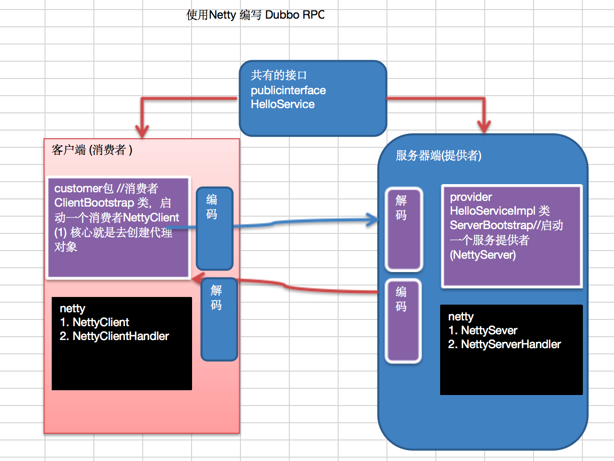

## HTTP 服务

### 案例 1

```java
@Slf4j
public class TestHttp {
    public static void main(String[] args) {
        NioEventLoopGroup group = new NioEventLoopGroup();
        NioEventLoopGroup group1 = new NioEventLoopGroup();
        try {
            ServerBootstrap serverBootstrap = new ServerBootstrap();
            serverBootstrap.channel(NioServerSocketChannel.class);
            serverBootstrap.group(group, group1);
            serverBootstrap.childHandler(new ChannelInitializer<SocketChannel>() {
                @Override
                protected void initChannel(SocketChannel socketChannel) throws Exception {
                    socketChannel.pipeline().addLast(new LoggingHandler(LogLevel.DEBUG));
                    //请求解码器，会把请求解析成两部分：HttpRequest（请求行，请求头）  HttpContent（请求体）
                    socketChannel.pipeline().addLast(new HttpServerCodec());
                    // 方式一
//                    socketChannel.pipeline().addLast(new ChannelInboundHandlerAdapter() {
//                        @Override
//                        public void channelRead(ChannelHandlerContext ctx, Object msg) throws Exception {
//                            log.info("{}", msg.getClass());
//                            if (msg instanceof HttpRequest) { //请求行，请求头
//                                log.info("HttpRequest {}", msg);
//                            } else if (msg instanceof HttpContent) { //请求体
//                                log.info("HttpContent {}", msg);
//                            }
//                        }
//                    });
                    //方式二：使用new SimpleChannelInboundHandler<HttpRequest>() 来接收指定的请求
                    socketChannel.pipeline().addLast(new SimpleChannelInboundHandler<HttpRequest>() {
                        @Override
                        protected void channelRead0(ChannelHandlerContext channelHandlerContext, HttpRequest httpRequest) throws Exception {
                            //获取请求
                            log.info("{}", httpRequest.uri());
                            //返回响应
                            // 参数一：协议的版本 参数二：响应状态码（HttpResponseStatus.OK 为200）
                            DefaultFullHttpResponse response =
                                    new DefaultFullHttpResponse(httpRequest.protocolVersion(), HttpResponseStatus.OK);
                            byte[] bytes = "<h1>Hello,World</h1>".getBytes();
                            //告诉响应头，传输的字节大小
                            response.headers().setInt(HttpHeaderNames.CONTENT_LENGTH, bytes.length);
                            //响应体
                            response.content().writeBytes(bytes);
                            //写回响应
                            channelHandlerContext.writeAndFlush(response);
                        }
                    });
                }
            });
            ChannelFuture channelFuture = serverBootstrap.bind(8888).sync();
            channelFuture.channel().closeFuture().sync();
        } catch (Exception e) {
            e.printStackTrace();
        } finally {
            group.shutdownGracefully();
            group1.shutdownGracefully();
        }
    }
}
```

### 案例 2

```java
public class TestServer {
    
    public static void main(String[] args) throws Exception {
        EventLoopGroup bossGroup = new NioEventLoopGroup(1);
        EventLoopGroup workerGroup = new NioEventLoopGroup();
        try {
            ServerBootstrap serverBootstrap = new ServerBootstrap();
            serverBootstrap.group(bossGroup, workerGroup)
                            .channel(NioServerSocketChannel.class)
                            .childHandler(new TestServerInitializer());

            ChannelFuture channelFuture = serverBootstrap.bind(6668).sync();
            channelFuture.channel().closeFuture().sync();
        } finally {
            bossGroup.shutdownGracefully();
            workerGroup.shutdownGracefully();
        }
    }
}
```

```java
public class TestServerInitializer extends ChannelInitializer<SocketChannel> {

    @Override
    protected void initChannel(SocketChannel ch) throws Exception {
        //向管道加入处理器
        //得到管道
        ChannelPipeline pipeline = ch.pipeline();

        //加入一个netty 提供的httpServerCodec codec =>[coder - decoder]
        //HttpServerCodec 说明
        //1. HttpServerCodec 是netty 提供的处理http的 编-解码器
        pipeline.addLast("MyHttpServerCodec", new HttpServerCodec());
        //2. 增加一个自定义的handler
        pipeline.addLast("MyTestHttpServerHandler", new TestHttpServerHandler());
        System.out.println("ok~~~~");
    }
}
```

```java
/**
 * 说明
 * 1. SimpleChannelInboundHandler 是 ChannelInboundHandlerAdapter
 * 2. HttpObject 客户端和服务器端相互通讯的数据被封装成 HttpObject
 */
public class TestHttpServerHandler extends SimpleChannelInboundHandler<HttpObject> {

    //channelRead0 读取客户端数据
    @Override
    protected void channelRead0(ChannelHandlerContext ctx, HttpObject msg) throws Exception {
        System.out.println("对应的channel=" + ctx.channel() + " pipeline=" + ctx
                .pipeline() + " 通过pipeline获取channel" + ctx.pipeline().channel());
        System.out.println("当前ctx的handler=" + ctx.handler());

        //判断 msg 是不是 httprequest请求
        if (msg instanceof HttpRequest) {
            System.out.println("ctx 类型=" + ctx.getClass());
            System.out.println("pipeline hashcode" + ctx.pipeline().hashCode() + " TestHttpServerHandler hash=" + this.hashCode());
            System.out.println("msg 类型=" + msg.getClass());
            System.out.println("客户端地址" + ctx.channel().remoteAddress());

            //获取到
            HttpRequest httpRequest = (HttpRequest) msg;
            //获取uri, 过滤指定的资源
            URI uri = new URI(httpRequest.uri());
            if ("/favicon.ico".equals(uri.getPath())) {
                System.out.println("请求了 favicon.ico, 不做响应");
                return;
            }
            //回复信息给浏览器 [http协议]
            ByteBuf content = Unpooled.copiedBuffer("hello, 我是服务器", CharsetUtil.UTF_8);
            
            //构造一个http的相应，即 httpresponse
            FullHttpResponse response = new DefaultFullHttpResponse(HttpVersion.HTTP_1_1, HttpResponseStatus.OK, content);
            response.headers().set(HttpHeaderNames.CONTENT_TYPE, "text/html;charset=UTF-8");
            response.headers().set(HttpHeaderNames.CONTENT_LENGTH, content.readableBytes());

            //将构建好 response返回
            ctx.writeAndFlush(response);
        }
    }
}
```

## TCP 服务

### 服务端

```java
public class NettyServer {
    
    public static void main(String[] args) throws Exception {
        //创建BossGroup 和 WorkerGroup
        //1. 创建两个线程组 bossGroup 和 workerGroup
        //2. bossGroup 只是处理连接请求 , 真正的和客户端业务处理，会交给 workerGroup完成
        //3. 两个都是无限循环
        //4. bossGroup 和 workerGroup 含有的子线程(NioEventLoop)的个数
        //   默认实际 cpu核数 * 2
        EventLoopGroup bossGroup = new NioEventLoopGroup(1);
        EventLoopGroup workerGroup = new NioEventLoopGroup(); //8
        try {
            //创建服务器端的启动对象，配置参数
            ServerBootstrap bootstrap = new ServerBootstrap();
            //使用链式编程来进行设置
            bootstrap.group(bossGroup, workerGroup) //设置两个线程组
                    .channel(NioServerSocketChannel.class) //使用NioSocketChannel 作为服务器的通道实现
                    .option(ChannelOption.SO_BACKLOG, 128) // 设置线程队列得到连接个数
                    .childOption(ChannelOption.SO_KEEPALIVE, true) //设置保持活动连接状态
            //          .handler(null) // 该 handler对应 bossGroup , childHandler 对应 workerGroup
                    .childHandler(new ChannelInitializer<SocketChannel>() {//创建一个通道初始化对象(匿名对象)
                        //给pipeline 设置处理器
                        @Override
                        protected void initChannel(SocketChannel ch) throws Exception {
                            System.out.println("客户socketchannel hashcode=" + ch.hashCode()); //可以使用一个集合管理 SocketChannel， 再推送消息时，可以将业务加入到各个channel 对应的 NIOEventLoop 的 taskQueue 或者 scheduleTaskQueue
                            ch.pipeline().addLast(new NettyServerHandler());
                        }
                    }); // 给我们的workerGroup 的 EventLoop 对应的管道设置处理器
            System.out.println(".....服务器 is ready...");

            //绑定一个端口并且同步, 生成了一个 ChannelFuture 对象
            //启动服务器(并绑定端口)
            ChannelFuture cf = bootstrap.bind(6668).sync();
            //给cf 注册监听器，监控我们关心的事件
            cf.addListener(new ChannelFutureListener() {
                @Override
                public void operationComplete(ChannelFuture future) throws Exception {
                    if (cf.isSuccess()) {
                        System.out.println("监听端口 6668 成功");
                    } else {
                        System.out.println("监听端口 6668 失败");
                    }
                }
            });
            //对关闭通道进行监听
            cf.channel().closeFuture().sync();
        }finally {
            bossGroup.shutdownGracefully();
            workerGroup.shutdownGracefully();
        }
    }
}
```

```java
/**
 * 说明
 * 1. 我们自定义一个Handler 需要继续netty 规定好的某个HandlerAdapter(规范)
 * 2. 这时我们自定义一个Handler , 才能称为一个handler
 */
public class NettyServerHandler extends ChannelInboundHandlerAdapter {

    //读取数据实际(这里我们可以读取客户端发送的消息)
    /**
     * 1. ChannelHandlerContext ctx:上下文对象, 含有 管道pipeline , 通道channel, 地址
     * 2. Object msg: 就是客户端发送的数据 默认Object
     */
    @Override
    public void channelRead(ChannelHandlerContext ctx, Object msg) throws Exception {
        System.out.println("服务器读取线程 " + Thread.currentThread().getName() + " channle =" + ctx.channel());
        System.out.println("server ctx =" + ctx);
        System.out.println("看看channel 和 pipeline的关系");
        Channel channel = ctx.channel();
        ChannelPipeline pipeline = ctx.pipeline(); //本质是一个双向链接, 出站入站
        
        //将 msg 转成一个 ByteBuf
        //ByteBuf 是 Netty 提供的，不是 NIO 的 ByteBuffer.
        ByteBuf buf = (ByteBuf) msg;
        System.out.println("客户端发送消息是:" + buf.toString(CharsetUtil.UTF_8));
        System.out.println("客户端地址:" + channel.remoteAddress());
    }

    //数据读取完毕
    @Override
    public void channelReadComplete(ChannelHandlerContext ctx) throws Exception {
        //writeAndFlush 是 write + flush
        //将数据写入到缓存，并刷新
        //一般讲，我们对这个发送的数据进行编码
        ctx.writeAndFlush(Unpooled.copiedBuffer("hello, 客户端~(>^ω^<)喵1", CharsetUtil.UTF_8));
    }
    
    //处理异常, 一般是需要关闭通道
    @Override
    public void exceptionCaught(ChannelHandlerContext ctx, Throwable cause) throws Exception {
        ctx.close();
    }
}
```

### 客户端

```java
public class NettyClient {
    
    public static void main(String[] args) throws Exception {
        //客户端需要一个事件循环组
        EventLoopGroup group = new NioEventLoopGroup();
        try {
            //创建客户端启动对象
            //注意客户端使用的不是 ServerBootstrap 而是 Bootstrap
            Bootstrap bootstrap = new Bootstrap();
            //设置相关参数
            bootstrap.group(group) //设置线程组
                    .channel(NioSocketChannel.class) // 设置客户端通道的实现类(反射)
                    .handler(new ChannelInitializer<SocketChannel>() {
                        @Override
                        protected void initChannel(SocketChannel ch) throws Exception {
                            ch.pipeline().addLast(new NettyClientHandler()); //加入自己的处理器
                        }
                    });
            
            System.out.println("客户端 ok..");
            //启动客户端去连接服务器端
            //关于 ChannelFuture 要分析，涉及到netty的异步模型
            ChannelFuture channelFuture = bootstrap.connect("127.0.0.1", 6668).sync();
            //给关闭通道进行监听
            channelFuture.channel().closeFuture().sync();
        } finally {
            group.shutdownGracefully();
        }
    }
}
```

```java
public class NettyClientHandler extends ChannelInboundHandlerAdapter {
    
    //当通道就绪就会触发该方法
    @Override
    public void channelActive(ChannelHandlerContext ctx) throws Exception {
        System.out.println("client " + ctx);
        ctx.writeAndFlush(Unpooled.copiedBuffer("hello, server: (>^ω^<)喵", CharsetUtil.UTF_8));
    }

    //当通道有读取事件时，会触发
    @Override
    public void channelRead(ChannelHandlerContext ctx, Object msg) throws Exception {
        ByteBuf buf = (ByteBuf) msg;
        System.out.println("服务器回复的消息:" + buf.toString(CharsetUtil.UTF_8));
        System.out.println("服务器的地址： " + ctx.channel().remoteAddress());
    }

    @Override
    public void exceptionCaught(ChannelHandlerContext ctx, Throwable cause) throws Exception {
        cause.printStackTrace();
        ctx.close();
    }
}
```

## 自定义协议

### 案例 1

1. 魔数，用来在第一时间判定是否是无效数据包
2. 版本号，可以支持协议的升级
3. 序列化算法，只要是指消息正文，消息正文到底采用哪种序列化反序列化方法，可以由此扩展，例如：json、protobuf、hessian、jdk
4. 指令类型，是登陆、注册、单聊、群聊...跟业务相关
5. 请求序号，为了双工通信，提供异步能力
6. 正文长度
7. 消息正文

```java
/*
 * 必须和 LengthFieldBasedFrameDecoder（处理黏包、半包） 一起使用，确保接到的 ByteBuf 消息是完整的
 */
@ChannelHandler.Sharable
@Slf4j
public class MessageCodec extends MessageToMessageCodec<ByteBuf, Message> {
    @Override
    protected void encode(ChannelHandlerContext channelHandlerContext, Message message, List<Object> list) throws Exception {
        ByteBuf byteBuf = channelHandlerContext.alloc().buffer();
        // 1、 4 字节的魔数
        byteBuf.writeBytes(new byte[]{1, 2, 3, 4});
        // 2、 1 字节的版本
        byteBuf.writeByte(1);
        // 3、 1字节的序列化方式 jdk 0 ，json 1
        byteBuf.writeByte(0);
        // 4、 1字节的指令类型
        byteBuf.writeByte(message.getMessageType());
        // 5、 设置请求序号 4个字节
        byteBuf.writeInt(4);
        // 6、 为了补齐为16个字节，填充1个字节的数据
        byteBuf.writeByte(0xff);

        // 序列化msg
        ByteArrayOutputStream bos = new ByteArrayOutputStream();
        ObjectOutputStream oos = new ObjectOutputStream(bos);
        oos.writeObject(message);
        byte[] bytes = bos.toByteArray();

        // 获得并设置正文长度 长度用4个字节标识
        byteBuf.writeInt(bytes.length);
        // 设置消息正文
        byteBuf.writeBytes(bytes);
        
        // 将编码后的ByteBuf添加到输出列表中
        list.add(byteBuf);
    }

    @Override
    protected void decode(ChannelHandlerContext channelHandlerContext, ByteBuf byteBuf, List<Object> list) throws Exception {
        // 获取魔数
        int magic = byteBuf.readInt();
        // 获取版本号
        byte version = byteBuf.readByte();
        // 获得序列化方式
        byte seqType = byteBuf.readByte();
        // 获得指令类型
        byte messageType = byteBuf.readByte();
        // 获得请求序号
        int sequenceId = byteBuf.readInt();
        // 移除补齐字节
        byteBuf.readByte();
        // 获得正文长度
        int length = byteBuf.readInt();
        // 获得正文
        byte[] bytes = new byte[length];
        byteBuf.readBytes(bytes, 0, length);
        //反序列化
        ObjectInputStream ois = new ObjectInputStream(new ByteArrayInputStream(bytes));
        Message message = (Message) ois.readObject();
        // 将信息放入List中，传递给下一个handler
        list.add(message);

        // 打印获得的信息正文
        System.out.println("===========魔数===========");
        System.out.println(magic);
        System.out.println("===========版本号===========");
        System.out.println(version);
        System.out.println("===========序列化方法===========");
        System.out.println(seqType);
        System.out.println("===========指令类型===========");
        System.out.println(messageType);
        System.out.println("===========请求序号===========");
        System.out.println(sequenceId);
        System.out.println("===========正文长度===========");
        System.out.println(length);
        System.out.println("===========正文===========");
        System.out.println(message);
    }
}
```

```java
public abstract class Message implements Serializable {

    public abstract int getMessageType();

    public static final int LoginRequestMessage = 0;
}
```

```java
public class Student extends Message{
    public Integer id;
    public String name;
    public String clazz;

    @Override
    public String toString() {
        return "Student{" +
                "id=" + id +
                ", name='" + name + '\'' +
                ", clazz='" + clazz + '\'' +
                '}';
    }

    public Integer getId() {
        return id;
    }

    public void setId(Integer id) {
        this.id = id;
    }

    public String getName() {
        return name;
    }

    public void setName(String name) {
        this.name = name;
    }

    public String getClazz() {
        return clazz;
    }

    public void setClazz(String clazz) {
        this.clazz = clazz;
    }

    public Student() {
    }

    public Student(Integer id, String name, String clazz) {
        this.id = id;
        this.name = name;
        this.clazz = clazz;
    }

    @Override
    public int getMessageType() {
        return 1;
    }
}
```

```java
@Slf4j
public class TestCodec {
    public static void main(String[] args) throws Exception {
        EmbeddedChannel channel = new EmbeddedChannel();
        
        // 添加解码器，避免粘包半包问题
        //channel.pipeline().addLast(new LengthFieldBasedFrameDecoder(1024, 12, 4, 0, 0));
        //channel.pipeline().addLast(new LoggingHandler(LogLevel.DEBUG));
        channel.pipeline().addLast(new MessageCodec());
        
        Student student = new Student(1, "zhangsan", "class3");

        // 正确的测试方式：通过EmbeddedChannel写入对象进行编码和解码
        System.out.println("写入Student对象进行编码和解码测试:");
        channel.writeOutbound(student); // 测试编码
        ByteBuf encoded = channel.readOutbound();
        System.out.println("编码后数据: " + encoded);
        channel.writeInbound(encoded); // 测试解码
        
        System.out.println("测试完成");
    }
}
```

### 案例 2

```java
public interface Command {
    //定义登录请求指令和响应指令为1和2，其他的指令同理如MESSAGE_REQUEST等
    Byte LOGIN_REQUEST = 1;
    Byte LOGIN_RESPONSE = 2;
}
```

```java
@Data
public abstract class Packet {
    //协议版本
    private Byte version = 1;
    //获取数据类型
    public abstract Byte getCommand();
}
```

```java
//这个是登录请求数据包的Java对象，所以调用的是上面接口的登录请求指令，其他类型的数据包同理
@Data
public class LoginRequestPacket extends Packet {
    //定义用户信息
    private Integer userId;
    private String username;
    private String password;
    
    @Override
    public Byte getCommand() {
        return LOGIN_REQUEST;
    }
}
```

```java
@Data
public class LoginResponsePacket extends Packet {
    //是否登录成功
    private boolean success;
    //如果失败，返回的信息
    private String reason;
    
    @Override
    public Byte getCommand() {
        return LOGIN_RESPONSE;
    }
}
```

```java
public interface SerializerAlgorithm {
    //json序列化标识，如果你有其他的序列化方式可以在这注明标识，类似上面的登录指令
    byte JSON = 1;
}
```

```java
//序列化接口
public interface Serializer {
    Serializer DEFAULT = new JSONSerializer();
    //序列化算法
    byte getSerializerAlogrithm();
    //java 对象转换成二进制
    byte[] serialize(Object object);
    //二进制转换成 java 对象
    <T> T deserialize(Class<T> clazz, byte[] bytes);
}
```

```java
//实现上面定义的序列化接口
public class JSONSerializer implements Serializer {
    @Override
    public byte getSerializerAlgorithm() {
        //获取上面的序列化标识
        return SerializerAlgorithm.JSON;
    } 
    
    @Override
    public byte[] serialize(Object object) {
        return JSON.toJSONBytes(object);
    }
    
    @Override
    public <T> T deserialize(Class<T> clazz, byte[] bytes) {
        return JSON.parseObject(bytes, clazz);
    }
}
```

```java
public class PacketCodeC {
    //自定义一个魔数
    private static final int MAGIC_NUMBER = 0x12345678;
    //创建一个静态实例供外部调用
    public static final PacketCodeC INSTANCE=new PacketCodeC();
    //创建两个map，一个存储数据类型，如：是登录数据还是普通消息等。第二个是存储序列化类型。
    //这样在解码时就可以把数据转换为对应的类型。如：这个byte数组是LOGIN_REQUEST类型，就把它转换成LoginRequestPacket类型的Java对象
    private final Map<Byte, Class<? extends Packet>> packetTypeMap;
    private final Map<Byte, Serializer> serializerMap;

    private PacketCodeC() {
        //初始化map并添加数据类型和序列化类型，如果有其他数据类型，记得在这里添加
        packetTypeMap = new HashMap<>();
        packetTypeMap.put(LOGIN_REQUEST, LoginRequestPacket.class);
        packetTypeMap.put(LOGIN_RESPONSE, LoginResponsePacket.class);
        serializerMap = new HashMap<>();
        Serializer serializer = new JSONSerializer();
        serializerMap.put(serializer.getSerializerAlogrithm(), serializer);
    }
    
    //编码
    public ByteBuf encode(ByteBufAllocator bufAllocator,Packet packet) {
        // 1. 创建 ByteBuf 对象
        ByteBuf byteBuf = bufAllocator.ioBuffer();
        // 2. 序列化 Java 对象
        byte[] bytes = Serializer.DEFAULT.serialize(packet);
        // 3. 实际编码过程，把通信协议几个部分，一一编码
        byteBuf.writeInt(MAGIC_NUMBER);
        byteBuf.writeByte(packet.getVersion());
        byteBuf.writeByte(Serializer.DEFAULT.getSerializerAlogrithm());
        byteBuf.writeByte(packet.getCommand());
        byteBuf.writeInt(bytes.length);
        byteBuf.writeBytes(bytes);
        return byteBuf;
    }
    
    //解码
    public Packet decode(ByteBuf byteBuf) {
        // 跳过魔数
        byteBuf.skipBytes(4);
        // 跳过版本号
        byteBuf.skipBytes(1);
        // 序列化算法标识
        byte serializeAlgorithm = byteBuf.readByte();
        // 指令
        byte command = byteBuf.readByte();
        // 数据包长度
        int length = byteBuf.readInt();
        byte[] bytes = new byte[length];
        byteBuf.readBytes(bytes);
        Class<? extends Packet> requestType = getRequestType(command);
        Serializer serializer = getSerializer(serializeAlgorithm);
        if (requestType != null && serializer != null) {
            return serializer.deserialize(requestType, bytes);
        }
        return null;
    }
    
    //获取序列化类型
    private Serializer getSerializer(byte serializeAlgorithm) {
        return serializerMap.get(serializeAlgorithm);
    }
    
    //获取数据类型
    private Class<? extends Packet> getRequestType(byte command) {
        return packetTypeMap.get(command);
    }
}
```

```java
.handler(new ChannelInitializer<SocketChannel>() {
            @Override
            public void initChannel(SocketChannel ch) {
                ch.pipeline().addLast(new ClientHandler());
            }
        });
```

```java
.childHandler(new ChannelInitializer<NioSocketChannel>() {
            protected void initChannel(NioSocketChannel ch) {
                ch.pipeline().addLast(new ServerHandler());
            }
        })
```

```java
public class ClientHandler extends ChannelInboundHandlerAdapter{
    @Override
    public void channelActive(ChannelHandlerContext ctx) {
        System.out.println(new Date() + ": 客户端开始登录");
        // 创建登录对象
        LoginRequestPacket loginRequestPacket = new LoginRequestPacket();
        loginRequestPacket.setUserId(new Random().nextInt(10000));
        loginRequestPacket.setUsername("username");
        loginRequestPacket.setPassword("pwd");
        // 编码
        ByteBuf buffer = PacketCodeC.INSTANCE.encode(ctx.alloc(), loginRequestPacket);
        // 写数据
        ctx.channel().writeAndFlush(buffer);
    }
    
    //接收服务端信息
    @Override
    public void channelRead(ChannelHandlerContext ctx, Object msg) {
        ByteBuf byteBuf = (ByteBuf) msg;
        Packet packet = PacketCodeC.INSTANCE.decode(byteBuf);
        //如果数据类型是登录，就进行登录判断
        //同理可以判断数据是否是普通消息，还是其他类型的数据
        if (packet instanceof LoginResponsePacket) {
            LoginResponsePacket loginResponsePacket = (LoginResponsePacket) packet;
            if (loginResponsePacket.isSuccess()) {
                System.out.println(new Date() + ": 客户端登录成功");
            } else {
                System.out.println(new Date() + ": 客户端登录失败，原因：" + loginResponsePacket.getReason());
            }
        }
    }
}
```

```java
public class ServerHandler extends ChannelInboundHandlerAdapter {
    @Override
    public void channelRead(ChannelHandlerContext ctx, Object msg) {
        ByteBuf requestByteBuf = (ByteBuf) msg;
        // 解码
        Packet packet = PacketCodeC.INSTANCE.decode(requestByteBuf);
        // 判断是否是登录请求数据包
        if (packet instanceof LoginRequestPacket) {
            LoginRequestPacket loginRequestPacket = (LoginRequestPacket) packet;
            LoginResponsePacket loginResponsePacket=new LoginResponsePacket();
            loginResponsePacket.setVersion(packet.getVersion());
            // 登录校验
            if (valid(loginRequestPacket)) {
                // 校验成功
                loginResponsePacket.setSuccess(true);
                System.out.println("客户端登录成功！");
            } else {
                // 校验失败
                loginResponsePacket.setReason("账号或密码错误");
                loginResponsePacket.setSuccess(false);
                System.out.println("客户端登录失败！");
            }
            // 编码，结果发送给客户端
            ByteBuf responseByteBuf = PacketCodeC.INSTANCE.encode(ctx.alloc(), loginResponsePacket);
            ctx.channel().writeAndFlush(responseByteBuf);
        }
    }
    
    private boolean valid(LoginRequestPacket loginRequestPacket) {
        //这里可以查询数据库，验证用户的账号密码是否正确
        return true;
    }
}
```

## 群聊系统

### 服务端

```java
public class GroupChatServer {

    private int port; //监听端口

    public GroupChatServer(int port) {
        this.port = port;
    }

    //编写run方法，处理客户端的请求
    public void run() throws Exception {
        //创建两个线程组
        EventLoopGroup bossGroup = new NioEventLoopGroup(1);
        EventLoopGroup workerGroup = new NioEventLoopGroup(); //8个NioEventLoop

        try {
            ServerBootstrap b = new ServerBootstrap();
            b.group(bossGroup, workerGroup)
                    .channel(NioServerSocketChannel.class)
                    .option(ChannelOption.SO_BACKLOG, 128)
                    .childOption(ChannelOption.SO_KEEPALIVE, true)
                    .childHandler(new ChannelInitializer<SocketChannel>() {
                        @Override
                        protected void initChannel(SocketChannel ch) throws Exception {
                            //获取到pipeline
                            ChannelPipeline pipeline = ch.pipeline();
                            //向pipeline加入解码器
                            pipeline.addLast("decoder", new StringDecoder());
                            //向pipeline加入编码器
                            pipeline.addLast("encoder", new StringEncoder());
                            //加入自己的业务处理handler
                            pipeline.addLast(new GroupChatServerHandler());
                        }
                    });
            System.out.println("netty 服务器启动");
            ChannelFuture channelFuture = b.bind(port).sync();

            //监听关闭
            channelFuture.channel().closeFuture().sync();
        } finally {
            bossGroup.shutdownGracefully();
            workerGroup.shutdownGracefully();
        }
    }

    public static void main(String[] args) throws Exception {
        new GroupChatServer(7000).run();
    }
}
```

```java
public class GroupChatServerHandler extends SimpleChannelInboundHandler<String> {

    //定义一个channle 组，管理所有的channel
    //GlobalEventExecutor.INSTANCE) 是全局的事件执行器，是一个单例
    private static ChannelGroup channelGroup = new DefaultChannelGroup(GlobalEventExecutor.INSTANCE);
    SimpleDateFormat sdf = new SimpleDateFormat("yyyy-MM-dd HH:mm:ss");

    //handlerAdded 表示连接建立，一旦连接，第一个被执行
    //将当前channel 加入到  channelGroup
    @Override
    public void handlerAdded(ChannelHandlerContext ctx) throws Exception {
        Channel channel = ctx.channel();
        //将该客户加入聊天的信息推送给其它在线的客户端
        /*
        该方法会将 channelGroup 中所有的channel 遍历，并发送 消息，
        我们不需要自己遍历
         */
        channelGroup.writeAndFlush("[客户端]" + channel.remoteAddress() + " 加入聊天" + sdf.format(new java.util.Date()) + " \n");
        channelGroup.add(channel);
    }

    //断开连接, 将xx客户离开信息推送给当前在线的客户
    @Override
    public void handlerRemoved(ChannelHandlerContext ctx) throws Exception {
        Channel channel = ctx.channel();
        channelGroup.writeAndFlush("[客户端]" + channel.remoteAddress() + " 离开了\n");
        System.out.println("channelGroup size" + channelGroup.size());
    }

    //表示channel 处于活动状态, 提示 xx上线
    @Override
    public void channelActive(ChannelHandlerContext ctx) throws Exception {
        System.out.println(ctx.channel().remoteAddress() + " 上线了~");
    }

    //表示channel 处于不活动状态, 提示 xx离线了
    @Override
    public void channelInactive(ChannelHandlerContext ctx) throws Exception {
        System.out.println(ctx.channel().remoteAddress() + " 离线了~");
    }

    //读取数据
    @Override
    protected void channelRead0(ChannelHandlerContext ctx, String msg) throws Exception {
        //获取到当前channel
        Channel channel = ctx.channel();
        //这时我们遍历channelGroup, 根据不同的情况，回送不同的消息

        channelGroup.forEach(ch -> {
            if (channel != ch) { //不是当前的channel,转发消息
                ch.writeAndFlush("[客户]" + channel.remoteAddress() + " 发送了消息" + msg + "\n");
            } else {//回显自己发送的消息给自己
                ch.writeAndFlush("[自己]发送了消息" + msg + "\n");
            }
        });
    }

    @Override
    public void exceptionCaught(ChannelHandlerContext ctx, Throwable cause) throws Exception {
        //关闭通道
        ctx.close();
    }
}
```

### 客户端

```java
public class GroupChatClient {
    
    //属性
    private final String host;
    private final int port;

    public GroupChatClient(String host, int port) {
        this.host = host;
        this.port = port;
    }

    public void run() throws Exception {
        EventLoopGroup group = new NioEventLoopGroup();

        try {
            Bootstrap bootstrap = new Bootstrap()
                    .group(group)
                    .channel(NioSocketChannel.class)
                    .handler(new ChannelInitializer<SocketChannel>() {
                        @Override
                        protected void initChannel(SocketChannel ch) throws Exception {
                            //得到pipeline
                            ChannelPipeline pipeline = ch.pipeline();
                            //加入相关handler
                            pipeline.addLast("decoder", new StringDecoder());
                            pipeline.addLast("encoder", new StringEncoder());
                            //加入自定义的handler
                            pipeline.addLast(new GroupChatClientHandler());
                        }
                    });

            ChannelFuture channelFuture = bootstrap.connect(host, port).sync();
            //得到channel
            Channel channel = channelFuture.channel();
            System.out.println("-------" + channel.localAddress() + "--------");
            //客户端需要输入信息，创建一个扫描器
            Scanner scanner = new Scanner(System.in);
            while (scanner.hasNextLine()) {
                String msg = scanner.nextLine();
                //通过channel 发送到服务器端
                channel.writeAndFlush(msg + "\r\n");
            }
        } finally {
            group.shutdownGracefully();
        }
    }

    public static void main(String[] args) throws Exception {
        new GroupChatClient("127.0.0.1", 7000).run();
    }
}
```

```java
public class GroupChatClientHandler extends SimpleChannelInboundHandler<String> {
    
    @Override
    protected void channelRead0(ChannelHandlerContext ctx, String msg) throws Exception {
        System.out.println(msg.trim());
    }
}
```

## 心跳空闲检测

网络应用程序普遍会遇到的一个问题就是连接假死。简单地说就是因为网络或其他问题导致某一端实际上(TCP)已经断开连接，但是应用程序没有检测到，以为还连接着。对服务端来说，这会浪费系统资源，导致性能下降。对于客户端来说，假死会造成数据发送超时，影响体验。

**如何解决这个问题？**

只需要客户端每隔一段时间打个招呼，表示它还活着就行了，就是所谓的心跳。Netty 自带的 IdleStateHandler 就可以实现这个功能。

### 案例 1

```java
public class MyServer {

    public static void main(String[] args) throws Exception {
        //创建两个线程组
        EventLoopGroup bossGroup = new NioEventLoopGroup(1);
        EventLoopGroup workerGroup = new NioEventLoopGroup(); //8个NioEventLoop
        try {
            ServerBootstrap serverBootstrap = new ServerBootstrap();

            serverBootstrap.group(bossGroup, workerGroup);
            serverBootstrap.channel(NioServerSocketChannel.class);
            serverBootstrap.handler(new LoggingHandler(LogLevel.INFO));
            serverBootstrap.childHandler(new ChannelInitializer<SocketChannel>() {
                @Override
                protected void initChannel(SocketChannel ch) throws Exception {
                    ChannelPipeline pipeline = ch.pipeline();
                    //加入一个netty 提供 IdleStateHandler
                    /*
                    说明
                    1. IdleStateHandler 是netty 提供的处理空闲状态的处理器
                    2. long readerIdleTime : 表示多长时间没有读, 就会发送一个心跳检测包检测是否连接
                    3. long writerIdleTime : 表示多长时间没有写, 就会发送一个心跳检测包检测是否连接
                    4. long allIdleTime : 表示多长时间没有读写, 就会发送一个心跳检测包检测是否连接

                    5. 文档说明
                    triggers an {@link IdleStateEvent} when a {@link Channel} has not performed
 * read, write, or both operation for a while.
 *                  6. 当 IdleStateEvent 触发后 , 就会传递给管道 的下一个handler去处理
 *                  通过调用(触发)下一个handler 的 userEventTiggered , 在该方法中去处理 IdleStateEvent(读空闲，写空闲，读写空闲)
                     */
                    pipeline.addLast(new IdleStateHandler(7000, 7000, 10, TimeUnit.SECONDS));
                    //加入一个对空闲检测进一步处理的handler(自定义)
                    pipeline.addLast(new MyServerHandler());
                }
            });

            //启动服务器
            ChannelFuture channelFuture = serverBootstrap.bind(7000).sync();
            channelFuture.channel().closeFuture().sync();
        } finally {
            bossGroup.shutdownGracefully();
            workerGroup.shutdownGracefully();
        }
    }
}
```

```java
public class MyServerHandler extends ChannelInboundHandlerAdapter {

    /**
     * @param ctx 上下文
     * @param evt 事件
     * @throws Exception
     */
    @Override
    public void userEventTriggered(ChannelHandlerContext ctx, Object evt) throws Exception {
        if (evt instanceof IdleStateEvent) {
            //将  evt 向下转型 IdleStateEvent
            IdleStateEvent event = (IdleStateEvent) evt;
            String eventType = null;
            switch (event.state()) {
                case READER_IDLE:
                    eventType = "读空闲";
                    break;
                case WRITER_IDLE:
                    eventType = "写空闲";
                    break;
                case ALL_IDLE:
                    eventType = "读写空闲";
                    break;
            }
            System.out.println(ctx.channel().remoteAddress() + "--超时时间--" + eventType);
            System.out.println("服务器做相应处理..");

            //如果发生空闲，我们关闭通道
            // ctx.channel().close();
        }
    }
}
```

### 案例 2

**服务端**

```java
//心跳检测类
public class IMIdleStateHandler extends IdleStateHandler {
    //读空闲时间，也就是多久没读到数据了
    private static final int READER_IDLE_TIME = 15;
   
    public IMIdleStateHandler() {
        //调用父类构造函数，四个参数分别为：
        //读空闲时间、写空闲时间、读写空闲时间、时间单位
        super(READER_IDLE_TIME, 0, 0, TimeUnit.SECONDS);
    }
    
    @Override
    protected void channelIdle(ChannelHandlerContext ctx, IdleStateEvent evt) {
        System.out.println(READER_IDLE_TIME + "秒内未读到数据，关闭连接");
        ctx.channel().close();
    }
}
```

```java
//回复客户端发送的心跳数据包
public class HeartBeatRequestHandler extends SimpleChannelInboundHandler<HeartBeatRequestPacket> {
    public static final HeartBeatRequestHandler INSTANCE = new HeartBeatRequestHandler();
    
    private HeartBeatRequestHandler() {
    }
    
    @Override
    protected void channelRead0(ChannelHandlerContext ctx, HeartBeatRequestPacket requestPacket) {
        ctx.writeAndFlush(new HeartBeatResponsePacket());
    }
}
```

```java
ch.pipeline().addLast(new IMIdleStateHandler());//添加到最前面
ch.pipeline().addLast(HeartBeatRequestHandler.INSTANCE);//添加到解码和登录请求之后
```

**客户端**

```java
public class HeartBeatTimerHandler extends ChannelInboundHandlerAdapter {
    //心跳数据包发送时间间隔，这里设为5秒，实际使用时建议服务端和客户端都设成分钟级别
    private static final int HEARTBEAT_INTERVAL = 5;
    
    @Override
    public void channelActive(ChannelHandlerContext ctx) throws Exception {
        scheduleSendHeartBeat(ctx);
        super.channelActive(ctx);
    }
    
    private void scheduleSendHeartBeat(ChannelHandlerContext ctx) {
        //schedule类似延时任务，每隔5秒发送心跳数据包
        ctx.executor().schedule(() -> {
            if (ctx.channel().isActive()) {
                ctx.writeAndFlush(new HeartBeatRequestPacket());
                scheduleSendHeartBeat(ctx);
            }
        }, HEARTBEAT_INTERVAL, TimeUnit.SECONDS);
    }
}
```

## 通过 WebSocket 实现长连接

### 服务端

```java
public class MyServer {
    
    public static void main(String[] args) throws Exception {
        //创建两个线程组
        EventLoopGroup bossGroup = new NioEventLoopGroup(1);
        EventLoopGroup workerGroup = new NioEventLoopGroup(); //8个NioEventLoop
        try {

            ServerBootstrap serverBootstrap = new ServerBootstrap();

            serverBootstrap.group(bossGroup, workerGroup);
            serverBootstrap.channel(NioServerSocketChannel.class);
            serverBootstrap.handler(new LoggingHandler(LogLevel.INFO));
            serverBootstrap.childHandler(new ChannelInitializer<SocketChannel>() {
                @Override
                protected void initChannel(SocketChannel ch) throws Exception {
                    ChannelPipeline pipeline = ch.pipeline();

                    //因为基于http协议，使用http的编码和解码器
                    pipeline.addLast(new HttpServerCodec());
                    //是以块方式写，添加ChunkedWriteHandler处理器
                    pipeline.addLast(new ChunkedWriteHandler());

                    /*
                    说明
                    1. http数据在传输过程中是分段, HttpObjectAggregator ，就是可以将多个段聚合
                    2. 这就就是为什么，当浏览器发送大量数据时，就会发出多次http请求
                     */
                    pipeline.addLast(new HttpObjectAggregator(8192));
                    /*
                    说明
                    1. 对应websocket ，它的数据是以 帧(frame) 形式传递
                    2. 可以看到WebSocketFrame 下面有六个子类
                    3. 浏览器请求时 ws://localhost:7000/hello 表示请求的uri
                    4. WebSocketServerProtocolHandler 核心功能是将 http协议升级为 ws协议 , 保持长连接
                    5. 是通过一个 状态码 101
                     */
                    pipeline.addLast(new WebSocketServerProtocolHandler("/hello2"));
                    //自定义的handler ，处理业务逻辑
                    pipeline.addLast(new MyTextWebSocketFrameHandler());
                }
            });
            //启动服务器
            ChannelFuture channelFuture = serverBootstrap.bind(7000).sync();
            channelFuture.channel().closeFuture().sync();
        } finally {
            bossGroup.shutdownGracefully();
            workerGroup.shutdownGracefully();
        }
    }
}
```

```java
//这里 TextWebSocketFrame 类型，表示一个文本帧(frame)
public class MyTextWebSocketFrameHandler extends SimpleChannelInboundHandler<TextWebSocketFrame> {

    @Override
    protected void channelRead0(ChannelHandlerContext ctx, TextWebSocketFrame msg) throws Exception {
        System.out.println("服务器收到消息 " + msg.text());
        //回复消息
        ctx.channel().writeAndFlush(new TextWebSocketFrame("服务器时间" + LocalDateTime.now() + " " + msg.text()));
    }

    //当web客户端连接后， 触发方法
    @Override
    public void handlerAdded(ChannelHandlerContext ctx) throws Exception {
        //id 表示唯一的值，LongText 是唯一的 ShortText 不是唯一
        System.out.println("handlerAdded 被调用" + ctx.channel().id().asLongText());
        System.out.println("handlerAdded 被调用" + ctx.channel().id().asShortText());
    }

    @Override
    public void handlerRemoved(ChannelHandlerContext ctx) throws Exception {
        System.out.println("handlerRemoved 被调用" + ctx.channel().id().asLongText());
    }

    @Override
    public void exceptionCaught(ChannelHandlerContext ctx, Throwable cause) throws Exception {
        System.out.println("异常发生 " + cause.getMessage());
        ctx.close(); //关闭连接
    }
}
```

### 客户端

```html
<!DOCTYPE html>
<html lang="en">
<head>
    <meta charset="UTF-8">
    <title>Title</title>
</head>
<body>
<script>
    var socket;
    //判断当前浏览器是否支持websocket
    if(window.WebSocket) {
        //go on
        socket = new WebSocket("ws://localhost:7000/hello2");
        //相当于channelReado, ev 收到服务器端回送的消息
        socket.onmessage = function (ev) {
            var rt = document.getElementById("responseText");
            rt.value = rt.value + "\n" + ev.data;
        }

        //相当于连接开启(感知到连接开启)
        socket.onopen = function (ev) {
            var rt = document.getElementById("responseText");
            rt.value = "连接开启了.."
        }

        //相当于连接关闭(感知到连接关闭)
        socket.onclose = function (ev) {
            var rt = document.getElementById("responseText");
            rt.value = rt.value + "\n" + "连接关闭了.."
        }
    } else {
        alert("当前浏览器不支持websocket")
    }

    //发送消息到服务器
    function send(message) {
        if(!window.socket) { //先判断socket是否创建好
            return;
        }
        if(socket.readyState == WebSocket.OPEN) {
            //通过socket 发送消息
            socket.send(message)
        } else {
            alert("连接没有开启");
        }
    }
</script>
    <form onsubmit="return false">
        <textarea name="message" style="height: 300px; width: 300px"></textarea>
        <input type="button" value="发生消息" onclick="send(this.form.message.value)">
        <textarea id="responseText" style="height: 300px; width: 300px"></textarea>
        <input type="button" value="清空内容" onclick="document.getElementById('responseText').value=''">
    </form>
</body>
</html>
```

## 任务队列 Task

1. 用户程序自定义的普通任务
2. 用户自定义定时任务
3. 非当前 Reactor 线程调用 Channel 的各种方法，例如在推送系统的业务线程里面，根据用户的标识，找到对应的 Channel 引用，然后调用 Write 类方法向该用户推送消息，就会进入到这种场景。最终的 Write 会提交到任务队列中后被异步消费

```java
/**
 * 说明
 * 1. 我们自定义一个Handler 需要继续netty 规定好的某个HandlerAdapter(规范)
 * 2. 这时我们自定义一个Handler , 才能称为一个handler
 */
public class NettyServerHandler extends ChannelInboundHandlerAdapter {

    //读取数据实际(这里我们可以读取客户端发送的消息)

    /**
     * 1. ChannelHandlerContext ctx:上下文对象, 含有 管道pipeline , 通道channel, 地址
     * 2. Object msg: 就是客户端发送的数据 默认Object
     */
    @Override
    public void channelRead(ChannelHandlerContext ctx, Object msg) throws Exception {
        // 比如这里我们有一个非常耗时长的业务-> 异步执行 -> 提交该channel 对应的 NIOEventLoop 的 taskQueue中

        // 解决方案1 用户程序自定义的普通任务
        ctx.channel().eventLoop().execute(new Runnable() {
            @Override
            public void run() {
                try {
                    Thread.sleep(5 * 1000);
                    ctx.writeAndFlush(Unpooled.copiedBuffer("hello, 客户端~(>^ω^<)喵2", CharsetUtil.UTF_8));
                    System.out.println("channel code=" + ctx.channel().hashCode());
                } catch (Exception ex) {
                    System.out.println("发生异常" + ex.getMessage());
                }
            }
        });

        ctx.channel().eventLoop().execute(new Runnable() {
            @Override
            public void run() {
                try {
                    Thread.sleep(5 * 1000);
                    ctx.writeAndFlush(Unpooled.copiedBuffer("hello, 客户端~(>^ω^<)喵3", CharsetUtil.UTF_8));
                    System.out.println("channel code=" + ctx.channel().hashCode());
                } catch (Exception ex) {
                    System.out.println("发生异常" + ex.getMessage());
                }
            }
        });

        //解决方案2 : 用户自定义定时任务 -》 该任务是提交到 scheduleTaskQueue中
        ctx.channel().eventLoop().schedule(new Runnable() {
            @Override
            public void run() {
                try {
                    Thread.sleep(5 * 1000);
                    ctx.writeAndFlush(Unpooled.copiedBuffer("hello, 客户端~(>^ω^<)喵4", CharsetUtil.UTF_8));
                    System.out.println("channel code=" + ctx.channel().hashCode());
                } catch (Exception ex) {
                    System.out.println("发生异常" + ex.getMessage());
                }
            }
        }, 5, TimeUnit.SECONDS);

        System.out.println("go on ...");

//        System.out.println("服务器读取线程 " + Thread.currentThread().getName() + " channle =" + ctx.channel());
//        System.out.println("server ctx =" + ctx);
//        System.out.println("看看channel 和 pipeline的关系");
//        Channel channel = ctx.channel();
//        ChannelPipeline pipeline = ctx.pipeline(); //本质是一个双向链接, 出站入站
//        
//        //将 msg 转成一个 ByteBuf
//        //ByteBuf 是 Netty 提供的，不是 NIO 的 ByteBuffer.
//        ByteBuf buf = (ByteBuf) msg;
//        System.out.println("客户端发送消息是:" + buf.toString(CharsetUtil.UTF_8));
//        System.out.println("客户端地址:" + channel.remoteAddress());
    }

    //数据读取完毕
    @Override
    public void channelReadComplete(ChannelHandlerContext ctx) throws Exception {
        //writeAndFlush 是 write + flush
        //将数据写入到缓存，并刷新
        //一般讲，我们对这个发送的数据进行编码
        ctx.writeAndFlush(Unpooled.copiedBuffer("hello, 客户端~(>^ω^<)喵1", CharsetUtil.UTF_8));
    }

    //处理异常, 一般是需要关闭通道
    @Override
    public void exceptionCaught(ChannelHandlerContext ctx, Throwable cause) throws Exception {
        ctx.close();
    }
}
```

1. Netty 抽象出两组线程池，BossGroup 专门负责接收客户端连接，WorkerGroup 专门负责网络读写操作。
2. NioEventLoop 表示一个不断循环执行处理任务的线程，每个 NioEventLoop 都有一个 Selector，用于监听绑定在其上的 socket 网络通道。
3. NioEventLoop 内部采用串行化设计，从消息的 读取-> 解码-> 处理-> 编码-> 发送，始终由 IO 线程 NioEventLoop 负责

注意：

+ NioEventLoopGroup 下包含多个 NioEventLoop
+ 每个 NioEventLoop 中包含有一个 Selector，一个 taskQueue
+ 每个 NioEventLoop 的 Selector 上可以注册监听多个 NioChannel，每个 NioChannel 只会绑定在唯一的 NioEventLoop 上
+ 每个 NioChannel 都绑定有一个自己的 ChannelPipeline

## 自定义 RPC

1. 创建一个接口，定义抽象方法。用于消费者和提供者之间的约定。
2. 创建一个提供者，该类需要监听消费者的请求，并按照约定返回数据。
3. 创建一个消费者，该类需要透明的调用自己不存在的方法，内部需要使用 Netty 请求提供者返回数据



```java
//这个是接口，是服务提供方和 服务消费方都需要
public interface HelloService {

    String hello(String mes);
}
```

```java
public class HelloServiceImpl implements HelloService {

    private static int count = 0;

    //当有消费方调用该方法时， 就返回一个结果
    @Override
    public String hello(String mes) {
        System.out.println("收到客户端消息=" + mes);
        //根据mes 返回不同的结果
        if (mes != null) {
            return "你好客户端, 我已经收到你的消息 [" + mes + "] 第" + (++count) + " 次";
        } else {
            return "你好客户端, 我已经收到你的消息 ";
        }
    }
}
```

### 服务端

```java
public class NettyServer {

    //编写一个方法，完成对NettyServer的初始化和启动
    private static void startServer(String hostname, int port) {
        EventLoopGroup bossGroup = new NioEventLoopGroup(1);
        EventLoopGroup workerGroup = new NioEventLoopGroup();
        try {
            ServerBootstrap serverBootstrap = new ServerBootstrap();
            serverBootstrap.group(bossGroup, workerGroup)
                    .channel(NioServerSocketChannel.class)
                    .childHandler(new ChannelInitializer<SocketChannel>() {
                                      @Override
                                      protected void initChannel(SocketChannel ch) throws Exception {
                                          ChannelPipeline pipeline = ch.pipeline();
                                          pipeline.addLast(new StringDecoder());
                                          pipeline.addLast(new StringEncoder());
                                          pipeline.addLast(new NettyServerHandler()); //业务处理器
                                      }
                                  }
                    );
            ChannelFuture channelFuture = serverBootstrap.bind(hostname, port).sync();
            System.out.println("服务提供方开始提供服务~~");
            channelFuture.channel().closeFuture().sync();
        } catch (Exception e) {
            e.printStackTrace();
        } finally {
            bossGroup.shutdownGracefully();
            workerGroup.shutdownGracefully();
        }
    }

    public static void main(String[] args) {
        startServer("127.0.0.1", 7000);
    }
}
```

```java
//服务器这边handler比较简单
public class NettyServerHandler extends ChannelInboundHandlerAdapter {

    @Override
    public void channelRead(ChannelHandlerContext ctx, Object msg) throws Exception {
        //获取客户端发送的消息，并调用服务
        System.out.println("msg=" + msg);
        //客户端在调用服务器的api 时，我们需要定义一个协议
        //比如我们要求 每次发消息是都必须以某个字符串开头 "HelloService#hello#你好"
        if (msg.toString().startsWith("HelloService")) {
            String result = new HelloServiceImpl().hello(msg.toString().substring(msg.toString().lastIndexOf("#") + 1));
            ctx.writeAndFlush(result);
        }
    }

    @Override
    public void exceptionCaught(ChannelHandlerContext ctx, Throwable cause) throws Exception {
        ctx.close();
    }
}
```

### 客户端

```java
public class NettyClient {

    //创建线程池
    private static ExecutorService executor = Executors.newFixedThreadPool(Runtime.getRuntime().availableProcessors());

    private static NettyClientHandler client;
    private int count = 0;

    //编写方法使用代理模式，获取一个代理对象
    public Object getBean(final Class<?> serivceClass, final String providerName) {
        return Proxy.newProxyInstance(Thread.currentThread().getContextClassLoader(),
                new Class<?>[]{serivceClass}, (proxy, method, args) -> {
                    System.out.println("(proxy, method, args) 进入...." + (++count) + " 次");
                    //{}  部分的代码，客户端每调用一次 hello, 就会进入到该代码
                    if (client == null) {
                        initClient();
                    }
                    //设置要发给服务器端的信息
                    //providerName 协议头 args[0] 就是客户端调用api hello(???), 参数
                    client.setPara(providerName + args[0]);
                    return executor.submit(client).get();
                });
    }

    //初始化客户端
    private static void initClient() {
        client = new NettyClientHandler();
        //创建EventLoopGroup
        NioEventLoopGroup group = new NioEventLoopGroup();
        Bootstrap bootstrap = new Bootstrap();
        bootstrap.group(group)
                .channel(NioSocketChannel.class)
                .option(ChannelOption.TCP_NODELAY, true)
                .handler(new ChannelInitializer<SocketChannel>() {
                            @Override
                            protected void initChannel(SocketChannel ch) throws Exception {
                                ChannelPipeline pipeline = ch.pipeline();
                                pipeline.addLast(new StringDecoder());
                                pipeline.addLast(new StringEncoder());
                                pipeline.addLast(client);
                            }
                        }
                );
        try {
            bootstrap.connect("127.0.0.1", 7000).sync();
        } catch (Exception e) {
            e.printStackTrace();
        }
    }
}
```

```java
public class NettyClientHandler extends ChannelInboundHandlerAdapter implements Callable {

    private ChannelHandlerContext context;//上下文
    private String result; //返回的结果
    private String para; //客户端调用方法时，传入的参数
    
    //与服务器的连接创建后，就会被调用, 这个方法是第一个被调用(1)
    @Override
    public void channelActive(ChannelHandlerContext ctx) throws Exception {
        System.out.println(" channelActive 被调用  ");
        context = ctx; //因为我们在其它方法会使用到 ctx
    }

    //收到服务器的数据后，调用方法 (4)
    @Override
    public synchronized void channelRead(ChannelHandlerContext ctx, Object msg) throws Exception {
        System.out.println(" channelRead 被调用  ");
        result = msg.toString();
        notify(); //唤醒等待的线程
    }

    @Override
    public void exceptionCaught(ChannelHandlerContext ctx, Throwable cause) throws Exception {
        ctx.close();
    }

    //被代理对象调用, 发送数据给服务器，-> wait -> 等待被唤醒(channelRead) -> 返回结果 (3)-》5
    @Override
    public synchronized Object call() throws Exception {
        System.out.println(" call1 被调用  ");
        context.writeAndFlush(para);
        //进行wait
        wait(); //等待channelRead 方法获取到服务器的结果后，唤醒
        System.out.println(" call2 被调用  ");
        return result; //服务方返回的结果

    }

    //(2)
    void setPara(String para) {
        System.out.println(" setPara  ");
        this.para = para;
    }
}
```

```java
public class ClientBootstrap {
    
    //这里定义协议头
    public static final String providerName = "HelloService#hello#";

    public static void main(String[] args) throws Exception {
        //创建一个消费者
        NettyClient customer = new NettyClient();
        //创建代理对象
        HelloService service = (HelloService) customer.getBean(HelloService.class, providerName);
        for (; ; ) {
            Thread.sleep(2 * 1000);
            //通过代理对象调用服务提供者的方法(服务)
            String res = service.hello("你好 dubbo~");
            System.out.println("调用的结果 res= " + res);
        }
    }
}
```

## TCP 粘包/拆包

### 基本概念

TCP 是面向连接的，面向流的，提供高可靠性服务。收发两端（客户端和服务器端）都要有一一成对的 socket，因此，发送端为了将多个发给接收端的包，更有效的发给对方，使用了优化方法（Nagle 算法），将多次间隔较小且数据量小的数据，合并成一个大的数据块，然后进行封包。这样做虽然提高了效率，但是接收端就难于分辨出完整的数据包了，因为面向流的通信是无消息保护边界的


假设客户端分别发送了两个数据包 D1 和 D2 给服务端，由于服务端一次读取到字节数是不确定的，故可能存在以下四种情况：

1. 服务端分两次读取到了两个独立的数据包，分别是 D1 和 D2，没有粘包和拆包
2. 服务端一次接受到了两个数据包，D1 和 D2 粘合在一起，称之为 TCP 粘包
3. 服务端分两次读取到了数据包，第一次读取到了完整的 D1 包和 D2 包的部分内容，第二次读取到了 D2 包的剩余内容，这称之为 TCP 拆包
4. 服务端分两次读取到了数据包，第一次读取到了 D1 包的部分内容 D1_1，第二次读取到了 D1 包的剩余部分内容 D1_2 和完整的 D2 包。

### 使用案例

在编写 Netty 程序时，如果没有做处理，就会发生粘包和拆包的问题

```java
public class MyClientHandler extends SimpleChannelInboundHandler<ByteBuf> {

    private int count;

    @Override
    public void channelActive(ChannelHandlerContext ctx) throws Exception {
        //使用客户端发送 10 条数据 hello, server 编号
        for (int i = 0; i < 10; ++i) {
            ByteBuf buffer = Unpooled.copiedBuffer("hello,server " + i, Charset.forName("utf-8"));
            ctx.writeAndFlush(buffer);
        }
    }

    @Override
    protected void channelRead0(ChannelHandlerContext ctx, ByteBuf msg) throws Exception {
        byte[] buffer = new byte[msg.readableBytes()];
        msg.readBytes(buffer);

        String message = new String(buffer, Charset.forName("utf-8"));
        System.out.println("客户端接收到消息=" + message);
        System.out.println("客户端接收消息数量=" + (++this.count));
    }

    @Override
    public void exceptionCaught(ChannelHandlerContext ctx, Throwable cause) throws Exception {
        cause.printStackTrace();
        ctx.close();
    }
}
```

```java
public class MyServerHandler extends SimpleChannelInboundHandler<ByteBuf> {
    
    private int count;

    @Override
    public void exceptionCaught(ChannelHandlerContext ctx, Throwable cause) throws Exception {
        //cause.printStackTrace();
        ctx.close();
    }

    @Override
    protected void channelRead0(ChannelHandlerContext ctx, ByteBuf msg) throws Exception {
        byte[] buffer = new byte[msg.readableBytes()];
        msg.readBytes(buffer);

        //将 buffer 转成字符串
        String message = new String(buffer, Charset.forName("utf-8"));

        System.out.println("服务器接收到数据 " + message);
        System.out.println("服务器接收到消息量=" + (++this.count));

        //服务器回送数据给客户端, 回送一个随机 id ,
        ByteBuf responseByteBuf = Unpooled.copiedBuffer(UUID.randomUUID().toString() + " ", Charset.forName("utf-8"));
        ctx.writeAndFlush(responseByteBuf);
    }
}
```

解决方法：

1. 使用自定义协议+编解码器来解决
2. 关键就是要解决服务器端每次读取数据长度的问题，这个问题解决，就不会出现服务器多读或少读数据的问题，从而避免的 TCP 粘包、拆包。

```java
//协议包
public class MessageProtocol {
    
    private int len; //关键
    
    private byte[] content;

    public int getLen() {
        return len;
    }

    public void setLen(int len) {
        this.len = len;
    }

    public byte[] getContent() {
        return content;
    }

    public void setContent(byte[] content) {
        this.content = content;
    }
}
```

**客户端**

```java
public class MyClientHandler extends SimpleChannelInboundHandler<MessageProtocol> {

    private int count;

    @Override
    public void channelActive(ChannelHandlerContext ctx) throws Exception {
        //使用客户端发送 10 条数据 "今天天气冷，吃火锅" 编号
        for (int i = 0; i < 5; i++) {
            String mes = "今天天气冷，吃火锅";
            byte[] content = mes.getBytes(Charset.forName("utf-8"));
            int length = mes.getBytes(Charset.forName("utf-8")).length;

            //创建协议包对象
            MessageProtocol messageProtocol = new MessageProtocol();
            messageProtocol.setLen(length);
            messageProtocol.setContent(content);
            ctx.writeAndFlush(messageProtocol);
        }
    }

    @Override
    protected void channelRead0(ChannelHandlerContext ctx, MessageProtocol msg) throws Exception {
        int len = msg.getLen();
        byte[] content = msg.getContent();

        System.out.println("客户端接收到消息如下");
        System.out.println("长度=" + len);
        System.out.println("内容=" + new String(content, Charset.forName("utf-8")));

        System.out.println("客户端接收消息数量=" + (++this.count));
    }

    @Override
    public void exceptionCaught(ChannelHandlerContext ctx, Throwable cause) throws Exception {
        System.out.println("异常消息=" + cause.getMessage());
        ctx.close();
    }
}
```

```java
public class MyMessageEncoder extends MessageToByteEncoder<MessageProtocol> {
    
    @Override
    protected void encode(ChannelHandlerContext ctx, MessageProtocol msg, ByteBuf out) throws Exception {
        System.out.println("MyMessageEncoder encode 方法被调用");
        out.writeInt(msg.getLen());
        out.writeBytes(msg.getContent());
    }
}
```

**服务端**

```java
public class MyMessageDecoder extends ReplayingDecoder<Void> {
    
    @Override
    protected void decode(ChannelHandlerContext ctx, ByteBuf in, List<Object> out) throws Exception {
        System.out.println("MyMessageDecoder decode 被调用");
        //需要将得到二进制字节码-> MessageProtocol 数据包(对象)
        int length = in.readInt();

        byte[] content = new byte[length];
        in.readBytes(content);

        //封装成 MessageProtocol 对象，放入 out， 传递下一个 handler 业务处理
        MessageProtocol messageProtocol = new MessageProtocol();
        messageProtocol.setLen(length);
        messageProtocol.setContent(content);
        out.add(messageProtocol);
    }
}
```

```java
//处理业务的 handler
public class MyServerHandler extends SimpleChannelInboundHandler<MessageProtocol> {
    
    private int count;

    @Override
    public void exceptionCaught(ChannelHandlerContext ctx, Throwable cause) throws Exception {
        //cause.printStackTrace();
        ctx.close();
    }

    @Override
    protected void channelRead0(ChannelHandlerContext ctx, MessageProtocol msg) throws Exception {
        //接收到数据，并处理
        int len = msg.getLen();
        byte[] content = msg.getContent();

        System.out.println("服务器接收到信息如下");
        System.out.println("长度=" + len);
        System.out.println("内容=" + new String(content, Charset.forName("utf-8")));

        System.out.println("服务器接收到消息包数量=" + (++this.count));

        //回复消息
        String responseContent = UUID.randomUUID().toString();
        int responseLen = responseContent.getBytes("utf-8").length;
        byte[] responseContent2 = responseContent.getBytes("utf-8");
        //构建一个协议包
        MessageProtocol messageProtocol = new MessageProtocol();
        messageProtocol.setLen(responseLen);
        messageProtocol.setContent(responseContent2);

        ctx.writeAndFlush(messageProtocol);
    }
}
```

## 定时重连

网络环境差的情况下，客户端第一次连接可能会失败，所以我们需要尝试重新连接。可以把连接 connect 上面的代码封装起来，然后传入一个 Bootstrap 类型的对象，通过这个对象循环连接。但是一般情况下，连接失败后不会马上重连，而是会通过一个指数退避的方式，比如每隔 1s、2s、4s、8s....重新连接。

```java
int MAX_RETRY=5;
connect(bootstrap, "127.0.0.1", 8000, MAX_RETRY);

private static void connect(Bootstrap bootstrap, String host, int port, int retry) {
    bootstrap.connect(host, port).addListener(future -> {
        if (future.isSuccess()) {
            System.out.println("连接成功!");
        } else if (retry == 0) {
            System.err.println("重试次数已用完，放弃连接！");
        } else {
            // 第几次重连
            int order = (MAX_RETRY - retry) + 1;
            // 本次重连的间隔，1<<order相当于1乘以2的order次方
            int delay = 1 << order;
            System.err.println(new Date() + ": 连接失败，第" + order + "次重连……");
            bootstrap.config().group().schedule(() -> connect(bootstrap, host, port, retry - 1), delay, TimeUnit.SECONDS);
        }
    });
}
```
