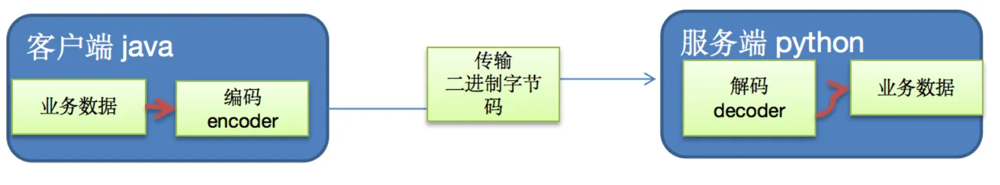
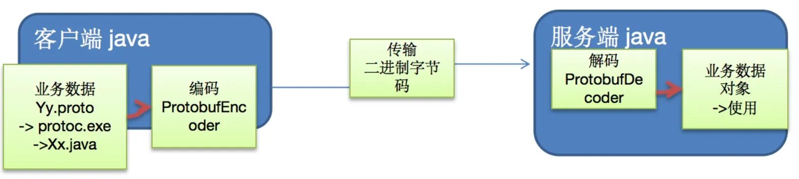

## 基本概念
编写网络应用程序时，因为数据在网络中传输的都是二进制字节码数据，在发送数据时就需要编码，接收数据时就需要解码 [示意图]

codec（编解码器）的组成部分有两个：decoder（解码器）和 encoder（编码器）。encoder 负责把业务数据转换成字节码数据，decoder 负责把字节码数据转换成业务数据



## Netty 编码解码机制
1. 当 Netty 发送或者接受一个消息的时候，就将会发生一次数据转换。入站消息会被解码：从字节转换为另一种格式（比如 java 对象）；如果是出站消息，它会被编码成字节。
2. Netty 提供一系列实用的编解码器，他们都实现了 ChannelInboundHadnler 或者 ChannelOutboundHandler 接口。在这些类中，channelRead 方法已经被重写了。以入站为例，对于每个从入站 Channel 读取的消息，这个方法会被调用。随后，它将调用由解码器所提供的 decode() 方法进行解码，并将已经解码的字节转发给 ChannelPipeline 中的下一个 ChannelInboundHandler。

### 编码器
#### MessageToByteEncoder 
MessageToByteEncoder 和  ByteToMessgaeDecoder 这两个类 Netty 会自动识别，从而自动编解码不需要我们去调用

```java
public class MyMessageToMessageDecoder extends MessageToMessageDecoder<String> {
    @Override
    protected void decode(ChannelHandlerContext ctx, String msg, List<Object> out) throws Exception {
        if(!StringUtil.isNullOrEmpty(msg)){
            out.add(String.format("[%s]", msg));
        }
    }
}
```

### 解码器
#### ByteToMessgaeDecoder
由于不可能知道远程节点是否会一次性发送一个完整的信息，tcp 有可能出现粘包拆包的问题，这个类会对入站数据进行缓冲，直到它准备好被处理


```java
public class MyByteToMessageDecoder extends ByteToMessageDecoder {
    private Integer length;

    public MessageEqualDecoder(Integer length) {
        this.length = length;
    }

    @Override
    protected void decode(ChannelHandlerContext ctx, ByteBuf in, List<Object> out) throws Exception {
        //当前的可读字节数
        int readableBytes = in.readableBytes();
        //当可读字节数超过预设数量的时候
        if(readableBytes >= length) {
            byte[] bytes = new byte[length];
            //读取出来
            in.readBytes(bytes);
            //转换成字符串 并添加进集合中
            out.add(new String(bytes, StandardCharsets.UTF_8));
        }
    }
}
```

#### ReplayingDecoder
```java
public class MyByteToLongDecoder2 extends ReplayingDecoder<Void> {
    
    @Override
    protected void decode(ChannelHandlerContext ctx, ByteBuf in, List<Object> out) throws Exception {
        System.out.println("MyByteToLongDecoder2 被调用");
        //在 ReplayingDecoder 不需要判断数据是否足够读取，内部会进行处理判断
        out.add(in.readLong());
    }
}
```

ReplayingDecoder 使用方便，但它也有一些局限性：并不是所有的 ByteBuf 操作都被支持，如果调用了一个不被支持的方法，将会抛出一个 UnsupportedOperationException。

ReplayingDecoder 在某些情况下可能稍慢于 ByteToMessageDecoder，例如网络缓慢并且消息格式复杂时，消息会被拆成了多个碎片，速度变慢

####  LineBasedFrameDecoder

这个类在 Netty 内部也有使用，它使用行尾控制字符（\n 或者\r\n）作为分隔符来解析数据。

LineBasedFrameDecoder 的构造器接受一个 int 类型的参数 `maxLength`，用来限制一次最大的解码长度。如果超过 `maxLength` 还没有检测到回车换行符，就会抛出 `TooLongFrameException`，可以说 `maxLength` 是对程序的一种保护措施。

```java
public class LineBasedFrameDecoderServer {
    public static void main(String[] args) {
        new ServerBootstrap()
                .group(new NioEventLoopGroup(), new NioEventLoopGroup())
                .channel(NioServerSocketChannel.class)
                .childHandler(new ChannelInitializer<SocketChannel>() {
                    @Override
                    protected void initChannel(SocketChannel ch) throws Exception {
                        ch.pipeline().addLast(new LineBasedFrameDecoder(12));
                        ch.pipeline().addLast(new LoggingHandler(LogLevel.DEBUG));
                        ch.pipeline().addLast(new ChannelInboundHandlerAdapter() {
                            @Override
                            public void channelRead(ChannelHandlerContext ctx, Object msg) throws Exception {
                                System.out.println("接收内容：" + ((ByteBuf) msg).toString(Charset.defaultCharset()));
                            }
                        });
                    }
                })
                .bind(8081);
    }
}
```

定义 `LineBasedFrameDecoder(12)`，即解码最大的长度为 12 byte，超过 12 byte 的数据都会丢弃。客户端发送内容为 `123\n45678\r90\r\nabcdf\n\rghijkmnopqrst\n`，服务端解析结果如下：

- 第一次：读取 3 个字节，内容为 `123`，所以 `\n` 可以解析。
- 第二次：读取 8 个字节，内容为 `45678.90，` 所以 `\r` 无法解析，`\r\n` 可以解析。
- 第三次：读取 5 个字节，内容为 `abcdf`
- 第四次：抛出 TooLongFrameException 异常，因为我们输入的内容为 14 个字节超过了 12 个字节。细心的小伙伴可能会发现 `ghijkmnopqrst` 不是只有 12 个字节么，怎么会是 14 呢？因为前面还有一个 `\r`

#### DelimiterBasedFrameDecoder

使用自定义的特殊字符作为消息的分隔符。

- **maxLength**

maxLength 为最大报文长度限制，与 LineBasedFrameDecoder 的 maxLength 属性意义一样：如果超过 maxLength 还没有检测到分割符，就会抛出 TooLongFrameException。

- **stripDelimiter**

用于判断解码后是否需要去掉分割符

- **failFast**

failFast 为是否快速失败开关。它与 maxLength 需要搭配使用，通过设置 failFast 可以控制抛出 TooLongFrameException 的时机。如果 failFast = true，那么就会立刻抛出 TooLongFrameException，不再继续解码。如果 failFast = false，那么会 等到解码出这个完整的消息后才会抛出 TooLongFrameException。

- **delimiters**

delimiters 指定分割符。我们可以指定一个或者多个分割符，如果指定多个，那么 DelimiterBasedFrameDecoder 在解码的时候会选择长度最短的分割符进行消息拆分。

```java
public class DelimiterBasedFrameDecoderServer {
    public static void main(String[] args) {
        new ServerBootstrap()
                .group(new NioEventLoopGroup(), new NioEventLoopGroup())
                .channel(NioServerSocketChannel.class)
                .childHandler(new ChannelInitializer<SocketChannel>() {
                    @Override
                    protected void initChannel(SocketChannel ch) throws Exception {
                        ByteBuf delimiter = Unpooled.copiedBuffer("|".getBytes());
                        ch.pipeline().addLast(new DelimiterBasedFrameDecoder(10, false, false, delimiter));

                        ch.pipeline().addLast(new LoggingHandler(LogLevel.DEBUG));
                        ch.pipeline().addLast(new ChannelInboundHandlerAdapter() {
                            @Override
                            public void channelRead(ChannelHandlerContext ctx, Object msg) throws Exception {
                                System.out.println("接收内容：" + ((ByteBuf) msg).toString(Charset.defaultCharset()));
                            }
                        });
                    }
                })
                .bind(8081);
    }
}
```

#### HttpObjectDecoder

一个 HTTP 数据的解码器

####  LengthFieldBasedFrameDecoder

通过指定长度来标识整包消息，这样就可以自动的处理黏包和半包消息。

LengthFieldBasedFrameDecoder 解码器：防止 TCP 黏包、半包，可以用 LengthFieldBasedFrameDecoder 解码器对发送消息进行解码

1. maxFrameLength： 发送的数据包最大长度
2. lengthFieldOffset： length 域的偏移，正常情况下读取数据从偏移为 0 处开始读取，如果有需要可以从其他偏移量处开始读取
3. lengthFieldLength： length 域占用的字节数
4. lengthAdjustment：在 length 域和 content 域中间是 否需要填充其他字节数
5. initialBytesToStrip：解码后跳过的字节数 （解码后把 length 占用的字节跳过，直接传数据包）

```java
@Slf4j
public class TestLengthFieldDecoder {
    public static void main(String[] args) {
        //用于测试很方便
        EmbeddedChannel channel = new EmbeddedChannel(
                //参数一：最大字节
                //参数二：偏移量
                //参数三：实际字节
                //参数四：调整 1 个字节
                //参数五：解析的结果后剥离 4 个字节（也就是说，再 ByteBuf 中没有被使用 4 个的字节被释放出来）
                new LengthFieldBasedFrameDecoder(1024,0,4,1,4),
                new LoggingHandler(LogLevel.DEBUG)
        );
        // 4 个字节的内容长度
        ByteBuf buf = ByteBufAllocator.DEFAULT.buffer();
        send(buf, "hello,world");
        send(buf, "hi!");
        //将消息写入 channel
        channel.writeInbound(buf);
    }

    public static void send(ByteBuf buf, String content) {
        byte[] bytes = content.getBytes(); //实际内容
        int length = bytes.length;
        //设置写入 12 个字节，再写入内容
        buf.writeInt(length);
        //再写入一个字节，此时如果不调整 1 个字节，会报错
        buf.writeByte(1);
        buf.writeBytes(bytes);
    }
}
```

#### FixedLengthFrameDecoder

FixedLengthFrameDecoder 为定长解码器，使用起来非常方便，只需要通过构造函数设定一个长度 frameLength 即可。无论发送方怎么发送数据，它都会严格按照设定的长度 frameLength 来解码。

```java
public class FixedLengthFrameServer {
    public static void main(String[] args) {
        new ServerBootstrap()
                .group(new NioEventLoopGroup(),new NioEventLoopGroup())
                .channel(NioServerSocketChannel.class)
                .childHandler(new ChannelInitializer<SocketChannel>() {
                    @Override
                    protected void initChannel(SocketChannel ch) throws Exception {
                        ch.pipeline().addLast(new FixedLengthFrameDecoder(8));
                        ch.pipeline().addLast(new LoggingHandler(LogLevel.DEBUG));
                        ch.pipeline().addLast(new ChannelInboundHandlerAdapter(){
                            @Override
                            public void channelRead(ChannelHandlerContext ctx, Object msg) throws Exception {
                                System.out.println("接收内容：" + ((ByteBuf)msg).toString(Charset.defaultCharset()));
                            }
                        });
                    }
                })
                .bind(8081);
    }
}
```

## Protobuf

Netty 自身提供了一些 codec(编解码器)：

1. Netty 提供的编码器 StringEncoder，对字符串数据进行编码 ObjectEncoder，对 Java 对象进行编码...
2. Netty 提供的解码器 StringDecoder，对字符串数据进行解码 ObjectDecoder，对 Java 对象进行解码...
3. Netty 本身自带的 ObjectDecoder 和 ObjectEncoder 可以用来实现 POJO 对象或各种业务对象的编码和解码，底层使用的仍是 Java 序列化技术, 而 Java 序列化技术本身效率就不高，存在如下问题
+ 无法跨语言
+ 序列化后的体积太大，是二进制编码的 5 倍多。
+ 序列化性能太低

因此产生了 Protobuf


