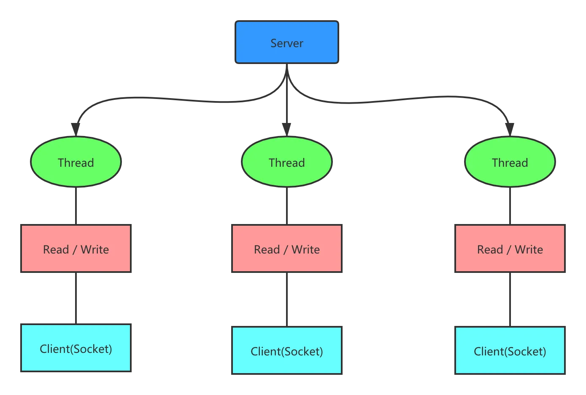

同步并阻塞（传统阻塞型），服务器实现模式为一个连接一个线程，即客户端有连接请求时服务器端就需要启动一个线程进行处理，如果这个连接不做任何事情会造成不必要的线程开销。

1. 服务器端启动一个 ServerSocket。
2. 客户端启动 Socket 对服务器进行通信，默认情况下服务器端需要对每个客户建立一个线程与之通讯。
3. 客户端发出请求后，先咨询服务器是否有线程响应，如果没有则会等待，或者被拒绝。
4. 如果有响应，客户端线程会等待请求结束后，在继续执行

Java BIO 问题分析

1. 每个请求都需要创建独立的线程，与对应的客户端进行数据 Read，业务处理，数据 Write。
2. 当并发数较大时，需要创建大量线程来处理连接，系统资源占用较大。
3. 连接建立后，如果当前线程暂时没有数据可读，则线程就阻塞在 Read 操作上，造成线程资源浪费。

## 基本使用

### 服务端

```java
public class BIOServer {

    public static void main(String[] args) throws Exception {
        //1. 创建一个线程池
        //2. 如果有客户端连接，就创建一个线程，与之通讯(单独写一个方法)
        ExecutorService newCachedThreadPool = Executors.newCachedThreadPool();
        //创建ServerSocket
        ServerSocket serverSocket = new ServerSocket(8080);
        System.out.println("服务器启动了");
        while (true) {
            //监听，等待客户端连接
            System.out.println("等待连接....");
            Socket socket = serverSocket.accept();
            System.out.println("连接到一个客户端");
            //就创建一个线程，与之通讯(单独写一个方法)
            newCachedThreadPool.execute(new Runnable() {
                public void run() {//我们重写
                    //可以和客户端通讯
                    handler(socket);
                }
            });
        }
    }

    //编写一个handler方法，和客户端通讯
    public static void handler(Socket socket) {
        try (InputStream inputStream = socket.getInputStream(); //通过socket获取输入流
        ) {
            byte[] bytes = new byte[1024];
            System.out.println("线程信息id = " + Thread.currentThread().getId() + "名字 = " + Thread.currentThread().getName());
            //循环的读取客户端发送的数据
            while (true) {
                System.out.println("read....");
                int read = inputStream.read(bytes);
                if (read != -1) {
                    System.out.println(new String(bytes, 0, read));//输出客户端发送的数据
                } else {
                    break;
                }
            }
        } catch (Exception e) {
            e.printStackTrace();
        } finally {
            try {
                socket.close();
            } catch (Exception e) {
                e.printStackTrace();
            }
        }
    }
}
```

### 客户端

```java
public class BIOClient {

    public static void main(String[] args) {
        String serverIpAddress = "127.0.0.1"; // 服务器的IP地址
        int serverPort = 8080; // 服务器的端口号
        try (Socket socket = new Socket(serverIpAddress, serverPort); // 建立Socket连接
             BufferedReader reader = new BufferedReader(new InputStreamReader(socket.getInputStream())); // 创建输入流和输出流
             PrintWriter writer = new PrintWriter(socket.getOutputStream(), true);) {

            // 发送数据
            writer.println("Hello, server!");
            // 接收数据
            String response = reader.readLine();
            System.out.println("Server response: " + response);
        } catch (IOException e) {
            e.printStackTrace();
        }
    }
}
```

## 群聊系统

### 服务端

```java
public class ChatServer {
    /**
     * 创建一个Map存储在线用户的信息。这个map可以统计在线用户、针对这些用户可以转发其他用户发送的消息
     * 因为会有多个线程操作这个map，所以为了安全起见用ConcurrentHashMap
     * 在这里key就是客户端的端口号，但在实际中肯定不会用端口号区分用户，如果是web的话一般用session。
     * value是IO的Writer，用以存储客户端发送的消息
     */
    private Map<Integer, Writer> map = new ConcurrentHashMap<>();
    /**
     * 创建线程池，线程上限为10个，如果第11个客户端请求进来，服务器会接收但是不会去分配线程处理它。
     * 前10个客户端的聊天记录，它看不见。当有一个客户端下线时，这第11个客户端就会被分配线程，服务器显示在线
     * 大家可以把10再设置小一点，测试看看
     */
    private ExecutorService executorService = Executors.newFixedThreadPool(10);

    //客户端连接时往map添加客户端
    public void addClient(Socket socket) throws IOException {
        if (socket != null) {
            BufferedWriter writer = new BufferedWriter(new OutputStreamWriter(socket.getOutputStream()));
            map.put(socket.getPort(), writer);
            System.out.println("Client[" + socket.getPort() + "]:Online");
        }
    }

    //断开连接时map里移除客户端
    public void removeClient(Socket socket) throws Exception {
        if (socket != null) {
            if (map.containsKey(socket.getPort())) {
                map.get(socket.getPort()).close();
                map.remove(socket.getPort());
            }
            System.out.println("Client[" + socket.getPort() + "]Offline");
        }
    }

    //转发客户端消息，这个方法就是把消息发送给在线的其他的所有客户端
    public void sendMessage(Socket socket, String msg) throws IOException {
        //遍历在线客户端
        for (Integer port : map.keySet()) {
            //发送给在线的其他客户端
            if (port != socket.getPort()) {
                Writer writer = map.get(port);
                writer.write(msg);
                writer.flush();
            }
        }
    }

    //接收客户端请求，并分配Handler去处理请求
    public void start() {
        int DEFAULT_PORT = 8888;
        try (ServerSocket serverSocket = new ServerSocket(DEFAULT_PORT)) {
            System.out.println("Server Start,The Port is:" + DEFAULT_PORT);
            while (true) {
                //等待客户端连接
                Socket socket = serverSocket.accept();
                //为客户端分配一个ChatHandler线程
                executorService.execute(new ChatHandler(this, socket));
            }
        } catch (IOException e) {
            e.printStackTrace();
        }
    }

    public static void main(String[] args) {
        ChatServer server = new ChatServer();
        server.start();
    }
}
```

```java
public class ChatHandler implements Runnable {
    private ChatServer server;
    private Socket socket;

    //构造函数，ChatServer通过这个分配Handler线程
    public ChatHandler(ChatServer server, Socket socket) {
        this.server = server;
        this.socket = socket;
    }

    @Override
    public void run() {
        //读取这个客户端发送的消息
        try (BufferedReader reader = new BufferedReader(new InputStreamReader(socket.getInputStream()));) {
            //往map里添加这个客户端
            server.addClient(socket);
            String msg = null;
            while ((msg = reader.readLine()) != null) {
                //这样拼接是为了让其他客户端也能看清是谁发送的消息
                String sendmsg = "Client[" + socket.getPort() + "]:" + msg;
                //服务器打印这个消息
                System.out.println(sendmsg);
                //将收到的消息转发给其他在线客户端
                server.sendMessage(socket, sendmsg + "\n");
                if (msg.equals("quit")) {
                    break;
                }
            }
        } catch (IOException e) {
            e.printStackTrace();
        } finally {
            //如果用户退出或者发生异常，就在map中移除该客户端
            try {
                server.removeClient(socket);
            } catch (Exception e) {
                e.printStackTrace();
            }
        }
    }
}
```

### 客户端

```java
public class ChatClient {
    private BufferedReader reader;
    private BufferedWriter writer;
    private Socket socket;

    //发送消息给服务器
    public void sendToServer(String msg) throws IOException {
        //发送之前，判断socket的输出流是否关闭
        if (!socket.isOutputShutdown()) {
            //如果没有关闭就把用户键入的消息放到writer里面
            writer.write(msg + "\n");
            writer.flush();
        }
    }

    //从服务器接收消息
    public String receive() throws IOException {
        String msg = null;
        //判断socket的输入流是否关闭
        if (!socket.isInputShutdown()) {
            //没有关闭的话就可以通过reader读取服务器发送来的消息。注意：如果没有读取到消息线程会阻塞在这里
            msg = reader.readLine();
        }
        return msg;
    }

    public void start() {
        //和服务创建连接
        try {
            socket = new Socket("127.0.0.1", 8888);
            reader = new BufferedReader(new InputStreamReader(socket.getInputStream()));
            writer = new BufferedWriter(new OutputStreamWriter(socket.getOutputStream()));
            //新建一个线程去监听用户输入的消息
            new Thread(new UserInputHandler(this)).start();
            /**
             * 不停的读取服务器转发的其他客户端的信息
             * 记录一下之前踩过的小坑：
             * 这里一定要创建一个msg接收信息，如果直接用receive()方法判断和输出receive()的话会造成有的消息不会显示
             * 因为receive()获取时，在返回之前是阻塞的，一旦接收到消息才会返回，也就是while这里是阻塞的，一旦有消息就会进入到while里面
             * 这时候如果输出的是receive(),那么上次获取的信息就会丢失，然后阻塞在System.out.println
             * */
            String msg = null;
            while ((msg = receive()) != null) {
                System.out.println(msg);
            }
        } catch (IOException e) {
            e.printStackTrace();
        } finally {
            try {
                if (writer != null) {
                    writer.close();
                }
                if (reader != null) {
                    reader.close();
                }
                if (socket != null) {
                    socket.close();
                }
            } catch (IOException e) {
                e.printStackTrace();
            }
        }
    }

    public static void main(String[] args) {
        new ChatClient().start();
    }
}
```

```java
public class UserInputHandler implements Runnable {
    private ChatClient client;

    public UserInputHandler(ChatClient client) {
        this.client = client;
    }

    @Override
    public void run() {
        //接收用户输入的消息
        try (BufferedReader reader = new BufferedReader(new InputStreamReader(System.in));) {
            //不停的获取reader中的System.in，实现了等待用户输入的效果
            String input = null;
            while ((input = reader.readLine()) != null) {
                //向服务器发送消息
                client.sendToServer(input);
                if (input.equals("quit"))
                    break;
            }
        } catch (IOException e) {
            e.printStackTrace();
        }
    }
}
```

