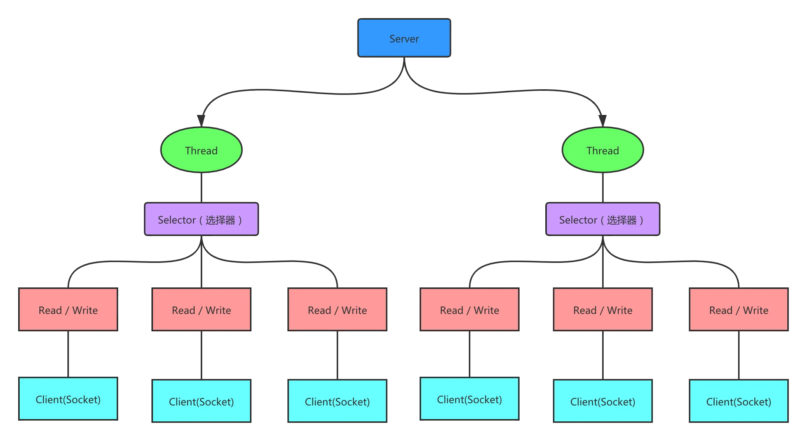
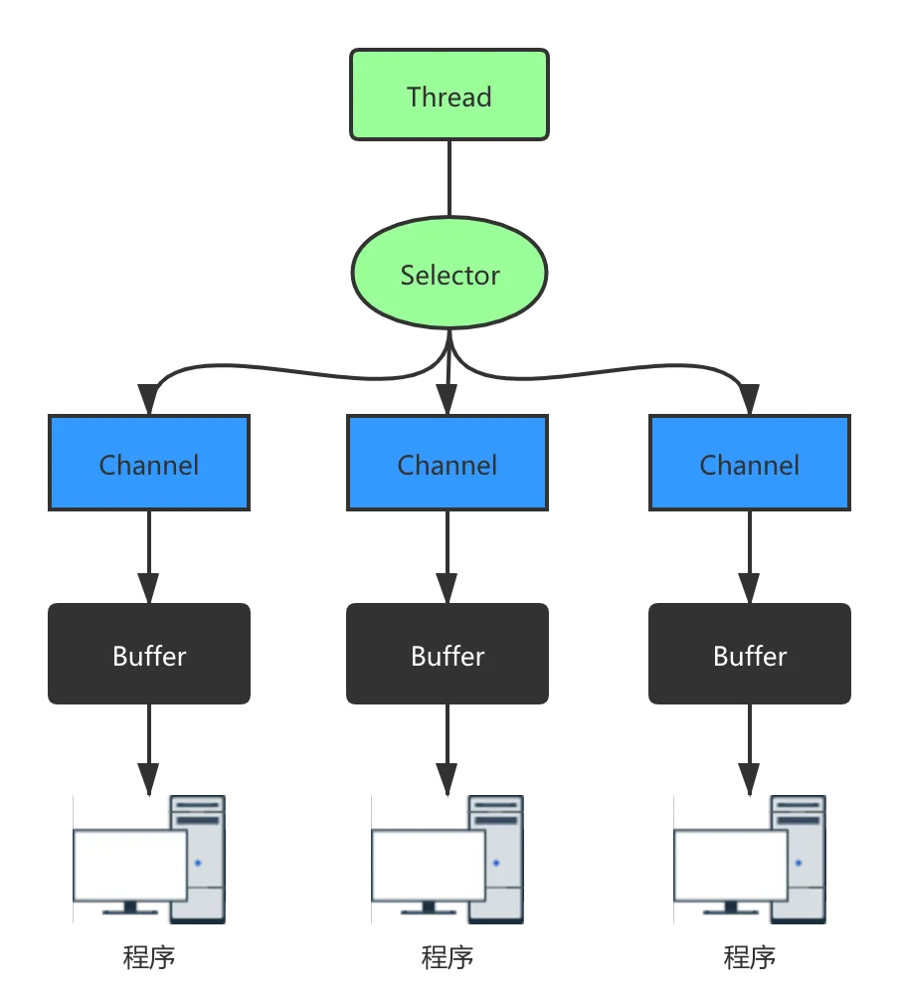

同步非阻塞，服务器实现模式为一个线程处理多个请求（连接），即客户端发送的连接请求都会注册到多路复用器上，多路复用器轮询到连接有 I/O 请求就进行处理。

## Buffer

### 读取写入

```java
public class BasicBuffer {

    public static void main(String[] args) {
        //创建一个 Buffer，大小为 5，即可以存放 5 个 int
        IntBuffer intBuffer = IntBuffer.allocate(5);
        //向buffer存放数据
        for (int i = 0; i < intBuffer.capacity(); i++) {
            intBuffer.put(i * 2);
        }
        //如何从 buffer 读取数据
        //将 buffer 转换，读写切换(!!!)
        intBuffer.flip();
        while (intBuffer.hasRemaining()) {
            System.out.println(intBuffer.get());
        }
    }
}
```

注意：ByteBuffer 支持类型化的 put 和 get，put 放入的是什么数据类型，get 就应该使用相应的数据类型来取出，否则可能有 BufferUnderflowException 异常

```java
public class NIOByteBufferPutGet {

    public static void main(String[] args) {
        //创建一个 Buffer
        ByteBuffer buffer = ByteBuffer.allocate(64);

        //类型化方式放入数据
        buffer.putInt(100);
        buffer.putLong(9);
        buffer.putChar('尚');
        buffer.putShort((short) 4);

        //取出
        buffer.flip();
        System.out.println();
        System.out.println(buffer.getInt());
        System.out.println(buffer.getLong());
        System.out.println(buffer.getChar());
        System.out.println(buffer.getShort());
    }
}
```

### 只读 buffer

将一个普通 Buffer 转成只读 Buffer

```java
public class ReadOnlyBuffer {

    public static void main(String[] args) {
        //创建一个 buffer
        ByteBuffer buffer = ByteBuffer.allocate(64);
        for (int i = 0; i < 64; i++) {
            buffer.put((byte) i);
        }

        //读取
        buffer.flip();
        //得到一个只读的 Buffer
        ByteBuffer readOnlyBuffer = buffer.asReadOnlyBuffer();
        System.out.println(readOnlyBuffer.getClass());
        //读取
        while (readOnlyBuffer.hasRemaining()) {
            System.out.println(readOnlyBuffer.get());
        }
        readOnlyBuffer.put((byte) 100); //ReadOnlyBufferException
    }
}
```

### MappedByteBuffer

MappedByteBuffer 可以让文件直接在内存（堆外的内存）中进行修改，操作系统不需要拷贝一次

```java
public class MappedByteBufferTest {

    public static void main(String[] args) throws Exception {
        RandomAccessFile randomAccessFile = new RandomAccessFile("1.txt", "rw");
        //获取对应的通道
        FileChannel channel = randomAccessFile.getChannel();
        /**
         * 参数 1: FileChannel.MapMode.READ_WRITE 使用的读写模式
         * 参数 2：0是可以直接修改的起始位置
         * 参数 3: 5是映射到内存的大小（不是索引位置），即将 1.txt 的多少个字节映射到内存
         * 可以直接修改的范围就是 0-4
         * 实际类型 DirectByteBuffer
         */
        MappedByteBuffer mappedByteBuffer = channel.map(FileChannel.MapMode.READ_WRITE, 0, 5);

        mappedByteBuffer.put(0, (byte) 'H');
        mappedByteBuffer.put(3, (byte) '9');
        mappedByteBuffer.put(5, (byte) 'Y');//IndexOutOfBoundsException

        randomAccessFile.close();
        System.out.println("修改成功~~");
    }
}
```

### 多个 Buffer 完成读写

```java
/**
 * Scattering：将数据写入到 buffer 时，可以采用 buffer 数组，依次写入 [分散]
 * Gathering：从 buffer 读取数据时，可以采用 buffer 数组，依次读
 */
public class ScatteringAndGatheringTest {

    public static void main(String[] args) throws Exception {
        //使用 ServerSocketChannel 和 SocketChannel 网络
        ServerSocketChannel serverSocketChannel = ServerSocketChannel.open();
        InetSocketAddress inetSocketAddress = new InetSocketAddress(7000);

        //绑定端口到 socket，并启动
        serverSocketChannel.socket().bind(inetSocketAddress);

        //创建 buffer 数组
        ByteBuffer[] byteBuffers = new ByteBuffer[2];
        byteBuffers[0] = ByteBuffer.allocate(5);
        byteBuffers[1] = ByteBuffer.allocate(3);

        //等客户端连接 (telnet)
        SocketChannel socketChannel = serverSocketChannel.accept();

        int messageLength = 8; //假定从客户端接收 8 个字节
        //循环的读取
        while (true) {
            int byteRead = 0;
            while (byteRead < messageLength) {
                long l = socketChannel.read(byteBuffers);
                byteRead += l; //累计读取的字节数
                System.out.println("byteRead = " + byteRead);
                //使用流打印,看看当前的这个 buffer 的 position 和 limit
                Arrays.asList(byteBuffers).stream()
                .map(buffer -> "position = " + buffer.position() + ", limit = " + buffer.limit())
                .forEach(System.out::println);
            }

            //将所有的 buffer 进行 flip
            Arrays.asList(byteBuffers).forEach(buffer -> buffer.flip());
            //将数据读出显示到客户端
            long byteWirte = 0;
            while (byteWirte < messageLength) {
                long l = socketChannel.write(byteBuffers);//
                byteWirte += l;
            }
            
            //将所有的buffer进行clear
            Arrays.asList(byteBuffers).forEach(buffer -> {
                buffer.clear();
            });
            System.out.println("byteRead = " + byteRead + ", byteWrite = " + byteWirte + ", messagelength = " + messageLength);
        }
    }
}
```

## Channel

### 本地文件写数据

```java
public class NIOFileChannel01 {

    public static void main(String[] args) throws Exception {
        String str = "hello,尚硅谷";
        //创建一个输出流 -> channel
        FileOutputStream fileOutputStream = new FileOutputStream("d:\\file01.txt");
        //通过 fileOutputStream 获取对应的 FileChannel
        //这个 fileChannel 真实类型是 FileChannelImpl
        FileChannel fileChannel = fileOutputStream.getChannel();

        //创建一个缓冲区 ByteBuffer
        ByteBuffer byteBuffer = ByteBuffer.allocate(1024);
        //将 str 放入 byteBuffer
        byteBuffer.put(str.getBytes());
        //对 byteBuffer 进行 flip
        byteBuffer.flip();

        //将 byteBuffer 数据写入到 fileChannel
        fileChannel.write(byteBuffer);
        fileOutputStream.close();
    }
}
```

### 本地文件读数据

```java
public class NIOFileChannel02 {

    public static void main(String[] args) throws Exception {
        //创建文件的输入流
        File file = new File("d:\\file01.txt");
        FileInputStream fileInputStream = new FileInputStream(file);
        //通过 fileInputStream 获取对应的 FileChannel -> 实际类型 FileChannelImpl
        FileChannel fileChannel = fileInputStream.getChannel();
        
        //创建缓冲区
        ByteBuffer byteBuffer = ByteBuffer.allocate((int)file.length());
        //将通道的数据读入到 Buffer
        fileChannel.read(byteBuffer);
        
        //将 byteBuffer 的字节数据转成 String
        System.out.println(new String(byteBuffer.array()));
        fileInputStream.close();
    }
}
```

### 文件读取、写入


```java
public class NIOFileChannel03 {

    public static void main(String[] args) throws Exception {
        FileInputStream fileInputStream = new FileInputStream("1.txt");
        FileChannel fileChannel01 = fileInputStream.getChannel();
        FileOutputStream fileOutputStream = new FileOutputStream("2.txt");
        FileChannel fileChannel02 = fileOutputStream.getChannel();

        ByteBuffer byteBuffer = ByteBuffer.allocate(512);
        while (true) { //循环读取
            //这里有一个重要的操作，一定不要忘了
            byteBuffer.clear(); //清空 buffer
            int read = fileChannel01.read(byteBuffer);
            System.out.println("read = " + read);
            if (read == -1) { //表示读完
                break;
            }

            //将 buffer 中的数据写入到 fileChannel02--2.txt
            byteBuffer.flip();
            fileChannel02.write(byteBuffer);
        }
        //关闭相关的流
        fileInputStream.close();
        fileOutputStream.close();
    }
}
```

### 拷贝文件

```java
public class NIOFileChannel04 {

    public static void main(String[] args) throws Exception {
        //创建相关流
        FileInputStream fileInputStream = new FileInputStream("d:\\a.jpg");
        FileOutputStream fileOutputStream = new FileOutputStream("d:\\a2.jpg");
        
        //获取各个流对应的 FileChannel
        FileChannel sourceCh = fileInputStream.getChannel();
        FileChannel destCh = fileOutputStream.getChannel();

        //使用 transferForm 完成拷贝
        destCh.transferFrom(sourceCh, 0, sourceCh.size());

        //关闭相关通道和流
        sourceCh.close();
        destCh.close();
        fileInputStream.close();
        fileOutputStream.close();
    }
}
```

## Selector

```java
selector.select()//阻塞
selector.select(1000);//阻塞1000毫秒，在1000毫秒后返回
selector.wakeup();//唤醒
selector.selectNow();//不阻塞，立马返还
```

```java
public class NIOEventDrivenServer {
    
    public static void main(String[] args) {
        int serverPort = 8080; // 服务器端口号
        try {
            // 创建ServerSocketChannel，并将其绑定到指定端口
            ServerSocketChannel serverSocketChannel = ServerSocketChannel.open();
            serverSocketChannel.bind(new InetSocketAddress(serverPort));
            System.out.println("Server listening on port " + serverPort);

            // 设置为非阻塞模式
            serverSocketChannel.configureBlocking(false);
            // 创建Selector
            Selector selector = Selector.open();
            // 将ServerSocketChannel注册到Selector，并监听接收连接事件
            serverSocketChannel.register(selector, SelectionKey.OP_ACCEPT);
            while (true) {
                // 等待事件发生
                if (selector.select() <= 0) {
                    continue;
                }
                // 处理事件
                Iterator<SelectionKey> iterator = selector.selectedKeys().iterator();
                while (iterator.hasNext()) {
                    SelectionKey key = iterator.next();
                    iterator.remove();
                    if (key.isAcceptable()) {
                        // 处理接收连接请求
                        ServerSocketChannel serverChannel = (ServerSocketChannel) key.channel();
                        SocketChannel clientChannel = serverChannel.accept();
                        System.out.println("Client connected: " + clientChannel.getRemoteAddress());
                        clientChannel.configureBlocking(false);
                        // 将客户端的SocketChannel注册到Selector，并监听读取数据事件
                        clientChannel.register(selector, SelectionKey.OP_READ);
                    } else if (key.isReadable()) {
                        // 处理读取数据请求
                        SocketChannel clientChannel = (SocketChannel) key.channel();
                        ByteBuffer buffer = ByteBuffer.allocate(1024);
                        int bytesRead = clientChannel.read(buffer);
                        if (bytesRead > 0) {
                            buffer.flip();
                            String clientData = new String(buffer.array()).trim();
                            System.out.println("Client sent: " + clientData);

                            // 响应客户端
                            String response = "Hello, client!";
                            ByteBuffer responseBuffer = ByteBuffer.wrap(response.getBytes());
                            clientChannel.write(responseBuffer);
                            buffer.clear();
                        } else if (bytesRead == -1) {
                            // 客户端断开连接
                            clientChannel.close();
                            System.out.println("Client disconnected");
                        }
                    }
                }
            }
        } catch (IOException e) {
            e.printStackTrace();
        }
    }
}
```

### SelectionKey

SelectionKey，表示 Selector 和网络通道的注册关系，共四种：

1. int OP_ACCEPT：有新的网络连接可以 accept，值为 16
2. int OP_CONNECT：代表连接已经建立，值为 8
3. int OP_READ：代表读操作，值为 1
4. int OP_WRITE：代表写操作，值为 4

### ServerSocketChannel

ServerSocketChannel 在服务器端监听新的客户端 Socket 连接

### SocketChannel

SocketChannel，网络 IO 通道，具体负责进行读写操作。NIO 把缓冲区的数据写入通道，或者把通道里的数据读到缓冲区

## 零拷贝

1. DMA：direct memory access 直接内存拷贝（不使用 CPU）
2. mmap 优化：mmap 通过内存映射，将文件映射到内核缓冲区，同时，用户空间可以共享内核空间的数据。这样，在进行网络传输时，就可以减少内核空间到用户空间的拷贝次数。
3. sendFlie 优化

- Linux2.1 版本： 数据根本不经过用户态，直接从内核缓冲区进入到 SocketBuffer，同时，由于和用户态完全无关，就减少了一次上下文切换

- Linux2.4 版本：避免了从内核缓冲区拷贝到 Socketbuffer 的操作，直接拷贝到协议栈，从而再一次减少了数据拷贝。

**mmap 和 sendFile 的区别**

1. mmap 适合小数据量读写，sendFile 适合大文件传输。
2. mmap 需要 4 次上下文切换，3 次数据拷贝；sendFile 需要 3 次上下文切换，最少 2 次数据拷贝。
3. sendFile 可以利用 DMA 方式，减少 CPU 拷贝，mmap 则不能（必须从内核拷贝到 Socket 缓冲区）。

**使用案例**

使用传统的 IO 方法传递一个大文件

使用 NIO 零拷贝方式传递（transferTo）一个大文件

```java
//服务器
public class NewIOServer {

    public static void main(String[] args) throws Exception {
        InetSocketAddress address = new InetSocketAddress(7001);
        ServerSocketChannel serverSocketChannel = ServerSocketChannel.open();
        ServerSocket serverSocket = serverSocketChannel.socket();
        serverSocket.bind(address);

        //创建buffer
        ByteBuffer byteBuffer = ByteBuffer.allocate(4096);

        while (true) {
            SocketChannel socketChannel = serverSocketChannel.accept();
            int readcount = 0;
            while (-1 != readcount) {
                try {
                    readcount = socketChannel.read(byteBuffer);
                } catch (Exception ex) {
                    // ex.printStackTrace();
                    break;
                }
                //
                byteBuffer.rewind(); //倒带 position = 0 mark 作废
            }
        }
    }
}
```

```java
public class NewIOClient {

    public static void main(String[] args) throws Exception {
        SocketChannel socketChannel = SocketChannel.open();
        socketChannel.connect(new InetSocketAddress("localhost", 7001));
        String filename = "protoc-3.6.1-win32.zip";
        //得到一个文件channel
        FileChannel fileChannel = new FileInputStream(filename).getChannel();
        //准备发送
        long startTime = System.currentTimeMillis();
        //在 linux 下一个 transferTo 方法就可以完成传输
        //在 windows 下一次调用 transferTo 只能发送 8m, 就需要分段传输文件,而且要主要
        //传输时的位置=》课后思考...
        //transferTo 底层使用到零拷贝
        long transferCount = fileChannel.transferTo(0, fileChannel.size(), socketChannel);
        System.out.println("发送的总的字节数 = " + transferCount + " 耗时: " + (System.currentTimeMillis() - startTime));

        //关闭
        fileChannel.close();
    }
}
```

## 基本使用

### 服务端

```java
public class GroupChatServer {

    //定义属性
    private Selector selector;
    private ServerSocketChannel listenChannel;

    private static final int PORT = 6667;

    //构造器
    //初始化工作
    public GroupChatServer() {
        try {
            //得到选择器
            selector = Selector.open();
            //ServerSocketChannel
            listenChannel = ServerSocketChannel.open();
            //绑定端口
            listenChannel.socket().bind(new InetSocketAddress(PORT));
            //设置非阻塞模式
            listenChannel.configureBlocking(false);
            //将该 listenChannel 注册到 selector
            listenChannel.register(selector, SelectionKey.OP_ACCEPT);
        } catch (IOException e) {
            e.printStackTrace();
        }
    }

    public void listen() {
        try {
            //循环处理
            while (true) {
                int count = selector.select();
                if (count > 0) { //有事件处理
                    // 遍历得到 selectionKey 集合
                    Iterator<SelectionKey> iterator = selector.selectedKeys().iterator();
                    while (iterator.hasNext()) {
                        //取出 selectionkey
                        SelectionKey key = iterator.next();
                        //监听到 accept
                        if (key.isAcceptable()) {
                            SocketChannel sc = listenChannel.accept();
                            sc.configureBlocking(false);
                            //将该 sc 注册到 selector
                            sc.register(selector, SelectionKey.OP_READ);
                            //提示
                            System.out.println(sc.getRemoteAddress() + " 上线 ");
                        }
                        if (key.isReadable()) {//通道发送read事件，即通道是可读的状态
                            // 处理读(专门写方法..)
                            readData(key);
                        }
                        //当前的 key 删除，防止重复处理
                        iterator.remove();
                    }
                }
            }
        } catch (Exception e) {
            e.printStackTrace();
        } finally {
            //发生异常处理....

        }
    }

    //读取客户端消息
    public void readData(SelectionKey key) {
        SocketChannel channel = null;
        try {
            //得到 channel
            channel = (SocketChannel) key.channel();
            //创建 buffer
            ByteBuffer buffer = ByteBuffer.allocate(1024);
            int count = channel.read(buffer);
            //根据 count 的值做处理
            if (count > 0) {
                //把缓存区的数据转成字符串
                String msg = new String(buffer.array(), 0, count);
                //输出该消息
                System.out.println("form客户端:" + msg);
                //向其它的客户端转发消息(去掉自己),专门写一个方法来处理
                sendInfoToOtherClients(msg, channel);
            }
        } catch (IOException e) {
            try {
                System.out.println(channel.getRemoteAddress() + "离线了..");
                //取消注册
                key.cancel();
                //关闭通道
                channel.close();
            } catch (IOException e2) {
                e2.printStackTrace();
            }
        }
    }

    //转发消息给其它客户(通道)
    private void sendInfoToOtherClients(String msg, SocketChannel self) throws IOException {
        System.out.println("服务器转发消息中...");
        //遍历所有注册到 selector 上的 SocketChannel,并排除 self
        for (SelectionKey key : selector.keys()) {
            //通过 key 取出对应的 SocketChannel
            Channel targetChannel = key.channel();
            //排除自己
            if (targetChannel instanceof SocketChannel && targetChannel != self) {
                //转型
                SocketChannel dest = (SocketChannel) targetChannel;
                //将 msg 存储到 buffer
                ByteBuffer buffer = ByteBuffer.wrap(msg.getBytes(StandardCharsets.UTF_8));
                //将 buffer 的数据写入通道
                dest.write(buffer);
            }
        }
    }

    public static void main(String[] args) {
        //创建服务器对象
        GroupChatServer groupChatServer = new GroupChatServer();
        groupChatServer.listen();
    }
}
```

### 客户端

```java
public class GroupChatClient {

    //定义相关的属性
    private final String HOST = "127.0.0.1";//服务器的ip
    private final int PORT = 6667;//服务器端口
    private Selector selector;
    private SocketChannel socketChannel;
    private String username;

    //构造器,完成初始化工作
    public GroupChatClient() throws IOException {
        selector = Selector.open();
        //连接服务器
        socketChannel = SocketChannel.open(new InetSocketAddress(HOST, PORT));
        //设置非阻塞
        socketChannel.configureBlocking(false);
        //将 channel 注册到selector
        socketChannel.register(selector, SelectionKey.OP_READ);
        //得到 username
        username = socketChannel.getLocalAddress().toString().substring(1);
        System.out.println(username + " is ok...");
    }

    //向服务器发送消息
    public void sendInfo(String info) {
        info = username + " 说：" + info;
        try {
            socketChannel.write(ByteBuffer.wrap(info.getBytes(StandardCharsets.UTF_8)));
        } catch (IOException e) {
            e.printStackTrace();
        }
    }

    //读取从服务器端回复的消息
    public void readInfo() {
        try {
            int readChannels = selector.select();
            if (readChannels > 0) {//有可以用的通道
                Iterator<SelectionKey> iterator = selector.selectedKeys().iterator();
                while (iterator.hasNext()) {
                    SelectionKey key = iterator.next();
                    if (key.isReadable()) {
                        //得到相关的通道
                        SocketChannel sc = (SocketChannel) key.channel();
                        //得到一个 Buffer
                        ByteBuffer buffer = ByteBuffer.allocate(1024);
                        //读取
                        int count = sc.read(buffer);
                        if (count > 0) {
                            //把读到的缓冲区的数据转成字符串
                            String msg = new String(buffer.array(), 0, count);
                            System.out.println(msg.trim());
                        }
                    }
                    iterator.remove(); //删除当前的 selectionKey,防止重复操作
                }
            }
        } catch (Exception e) {
            e.printStackTrace();
        }
    }

    public static void main(String[] args) throws Exception {
        //启动我们客户端
        GroupChatClient chatClient = new GroupChatClient();
        //启动一个线程,每个 3 秒，读取从服务器发送数据
        new Thread() {
            public void run() {
                while (true) {
                    chatClient.readInfo();
                    try {
                        Thread.currentThread().sleep(3000);
                    } catch (InterruptedException e) {
                        e.printStackTrace();
                    }
                }
            }
        }.start();

        //发送数据给服务器端
        Scanner scanner = new Scanner(System.in);
        while (scanner.hasNextLine()) {
            String s = scanner.nextLine();
            chatClient.sendInfo(s);
        }
    }
}
```

## 群聊系统

### 服务端

```java
public class ChatServer {
    //设置缓冲区的大小，这里设置为1024个字节
    private static final int BUFFER = 1024;

    //Channel都要配合缓冲区进行读写，所以这里创建一个读缓冲区和一个写缓冲区
    //allocate()静态方法就是设置缓存区大小的方法
    private ByteBuffer read_buffer = ByteBuffer.allocate(BUFFER);
    private ByteBuffer write_buffer = ByteBuffer.allocate(BUFFER);

    //编码方式设置为utf-8，下面字符和字符串互转时用得到
    private Charset charset = Charset.forName("UTF-8");

    //为了监听端口更灵活，再不写死了，用一个构造函数设置需要监听的端口号
    private int port;

    public ChatServer(int port) {
        this.port = port;
    }

    private void start() {
        //创建ServerSocketChannel和Selector并打开
        try (ServerSocketChannel server = ServerSocketChannel.open();
             Selector selector = Selector.open()) {
            //【重点,实现NIO编程模型的关键】configureBlocking设置ServerSocketChannel为非阻塞式调用,Channel默认的是阻塞的调用方式
            server.configureBlocking(false);
            //绑定监听端口,这里不是给ServerSocketChannel绑定，而是给ServerSocket绑定，socket()就是获取通道原生的ServerSocket或Socket
            server.socket().bind(new InetSocketAddress(port));

            //把server注册到Selector并监听Accept事件
            server.register(selector, SelectionKey.OP_ACCEPT);
            System.out.println("启动服务器，监听端口:" + port);

            while (true) {
                //select()会返回此时触发了多少个Selector监听的事件
                if (selector.select() > 0) {
                    //获取这些已经触发的事件,selectedKeys()返回的是触发事件的所有信息
                    Set<SelectionKey> selectionKeys = selector.selectedKeys();
                    //循环处理这些事件
                    for (SelectionKey key : selectionKeys) {
                        handles(key, selector);
                    }
                    //处理完后清空selectedKeys，避免重复处理
                    selectionKeys.clear();
                }
            }
        } catch (IOException e) {
            e.printStackTrace();
        }
    }

    //处理事件的方法
    private void handles(SelectionKey key, Selector selector) throws IOException {
        //当触发了Accept事件，也就是有客户端请求进来
        if (key.isAcceptable()) {
            //获取ServerSocketChannel
            ServerSocketChannel server = (ServerSocketChannel) key.channel();
            //然后通过accept()方法接收客户端的请求，这个方法会返回客户端的SocketChannel，这一步和原生的ServerSocket类似
            SocketChannel client = server.accept();
            client.configureBlocking(false);

            //把客户端的SocketChannel注册到Selector，并监听Read事件
            client.register(selector, SelectionKey.OP_READ);
            System.out.println("客户端[" + client.socket().getPort() + "]上线啦！");
        }
        //当触发了Read事件，也就是客户端发来了消息
        if (key.isReadable()) {
            SocketChannel client = (SocketChannel) key.channel();
            //获取消息
            String msg = receive(client);
            System.out.println("客户端[" + client.socket().getPort() + "]:" + msg);
            //把消息转发给其他客户端
            sendMessage(client, msg, selector);
            //判断用户是否退出
            if (msg.equals("quit")) {
                //解除该事件的监听
                key.cancel();
                //更新Selector
                selector.wakeup();
                System.out.println("客户端[" + client.socket().getPort() + "]下线了！");
            }
        }
    }


    //接收消息的方法
    private String receive(SocketChannel client) throws IOException {
        //用缓冲区之前先清空一下,避免之前的信息残留
        read_buffer.clear();
        //把通道里的信息读取到缓冲区，用while循环一直读取，直到读完所有消息。因为没有明确的类似\n这样的结尾，所以要一直读到没有字节为止
        while (client.read(read_buffer) > 0) ;
        //把消息读取到缓冲区后，需要转换buffer的读写状态，不明白的看看前面的Buffer的讲解
        read_buffer.flip();
        return String.valueOf(charset.decode(read_buffer));
    }

    //转发消息的方法
    private void sendMessage(SocketChannel client, String msg, Selector selector) throws IOException {
        msg = "客户端[" + client.socket().getPort() + "]:" + msg;
        //获取所有客户端,keys()与前面的selectedKeys不同，这个是获取所有已经注册的信息，而selectedKeys获取的是触发了的事件的信息
        for (SelectionKey key : selector.keys()) {
            //排除服务器和本客户端并且保证key是有效的，isValid()会判断Selector监听是否正常、对应的通道是保持连接的状态等
            if (!(key.channel() instanceof ServerSocketChannel) && !client.equals(key.channel()) && key.isValid()) {
                SocketChannel otherClient = (SocketChannel) key.channel();
                write_buffer.clear();
                write_buffer.put(charset.encode(msg));
                write_buffer.flip();
                //把消息写入到缓冲区后，再把缓冲区的内容写到客户端对应的通道中
                while (write_buffer.hasRemaining()) {
                    otherClient.write(write_buffer);
                }
            }
        }
    }

    public static void main(String[] args) {
        new ChatServer(8888).start();
    }
}
```

### 客户端

```java
public class ChatClient {
    private static final int BUFFER = 1024;
    private ByteBuffer read_buffer = ByteBuffer.allocate(BUFFER);
    private ByteBuffer write_buffer = ByteBuffer.allocate(BUFFER);
    //声明成全局变量是为了方便下面一些工具方法的调用，就不用try with resource了
    private SocketChannel client;
    private Selector selector;

    private Charset charset = Charset.forName("UTF-8");

    private void start() {
        try {
            client = SocketChannel.open();
            selector = Selector.open();
            client.configureBlocking(false);
            //注册channel，并监听SocketChannel的Connect事件
            client.register(selector, SelectionKey.OP_CONNECT);
            //请求服务器建立连接
            client.connect(new InetSocketAddress("127.0.0.1", 8888));
            //和服务器一样，不停的获取触发事件，并做相应的处理
            while (true) {
                if (selector.select() > 0) {
                    Set<SelectionKey> selectionKeys = selector.selectedKeys();
                    for (SelectionKey key : selectionKeys) {
                        handle(key);
                    }
                    selectionKeys.clear();
                }
            }
        } catch (IOException e) {
            e.printStackTrace();
        } catch (ClosedSelectorException e) {
            //当用户输入quit时，在send()方法中，selector会被关闭，而在上面的无限while循环中，可能会使用到已经关闭了的selector。
            //所以这里捕捉一下异常，做正常退出处理就行了。不会对服务器造成影响
        }
    }

    private void handle(SelectionKey key) throws IOException {
        //当触发connect事件，也就是服务器和客户端建立连接
        if (key.isConnectable()) {
            SocketChannel client = (SocketChannel) key.channel();
            //finishConnect()返回true，说明和服务器已经建立连接。如果是false，说明还在连接中，还没完全连接完成
            if (client.finishConnect()) {
                //新建一个新线程去等待用户输入
                new Thread(new UserInputHandler(this)).start();
            }
            //连接建立完成后，注册read事件，开始监听服务器转发的消息
            client.register(selector, SelectionKey.OP_READ);
        }
        //当触发read事件，也就是获取到服务器的转发消息
        if (key.isReadable()) {
            SocketChannel client = (SocketChannel) key.channel();
            //获取消息
            String msg = receive(client);
            System.out.println(msg);
            //判断用户是否退出
            if (msg.equals("quit")) {
                //解除该事件的监听
                key.cancel();
                //更新Selector
                selector.wakeup();
            }
        }
    }

    //获取消息
    private String receive(SocketChannel client) throws IOException {
        read_buffer.clear();
        while (client.read(read_buffer) > 0) ;
        read_buffer.flip();
        return String.valueOf(charset.decode(read_buffer));
    }

    //发送消息
    public void send(String msg) throws IOException {
        if (!msg.isEmpty()) {
            write_buffer.clear();
            write_buffer.put(charset.encode(msg));
            write_buffer.flip();
            while (write_buffer.hasRemaining()) {
                client.write(write_buffer);
            }
            if (msg.equals("quit")) {
                selector.close();
            }
        }
    }

    public static void main(String[] args) {
        new ChatClient().start();
    }
}
```

```java
public class UserInputHandler implements Runnable {
    ChatClient client;

    public UserInputHandler(ChatClient chatClient) {
        this.client = chatClient;
    }

    @Override
    public void run() {
        BufferedReader read = new BufferedReader(new InputStreamReader(System.in));
        while (true) {
            try {
                String input = read.readLine();
                client.send(input);
                if (input.equals("quit"))
                    break;
            } catch (IOException e) {
                e.printStackTrace();
            }
        }
    }
}
```

