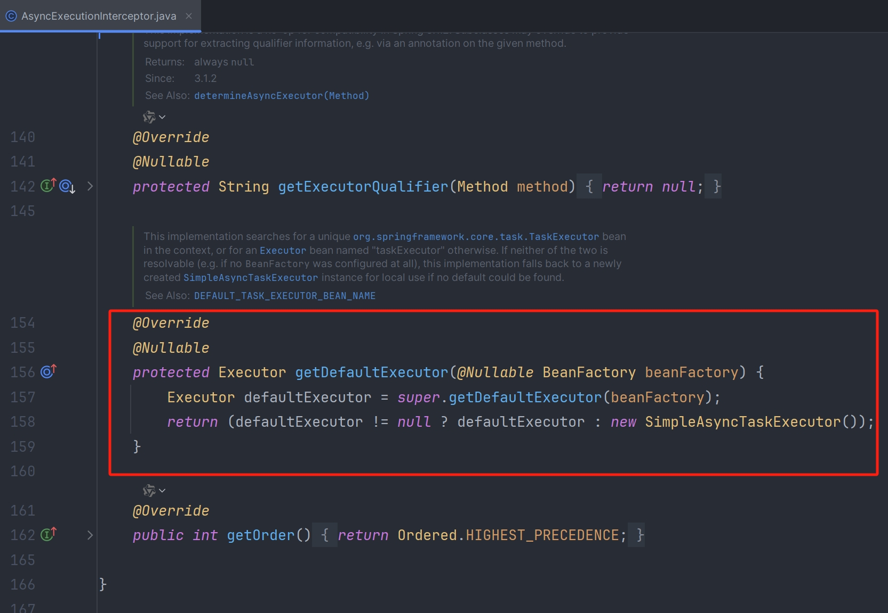
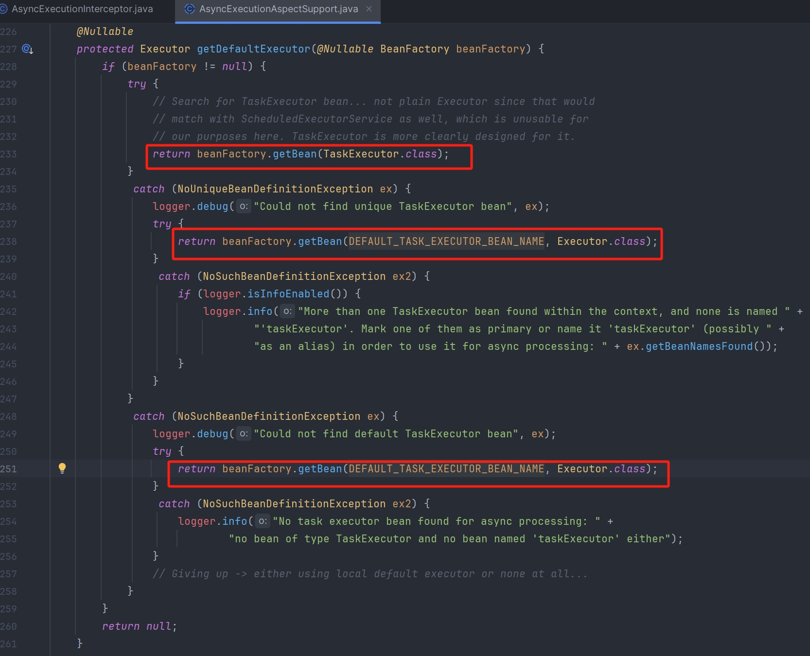
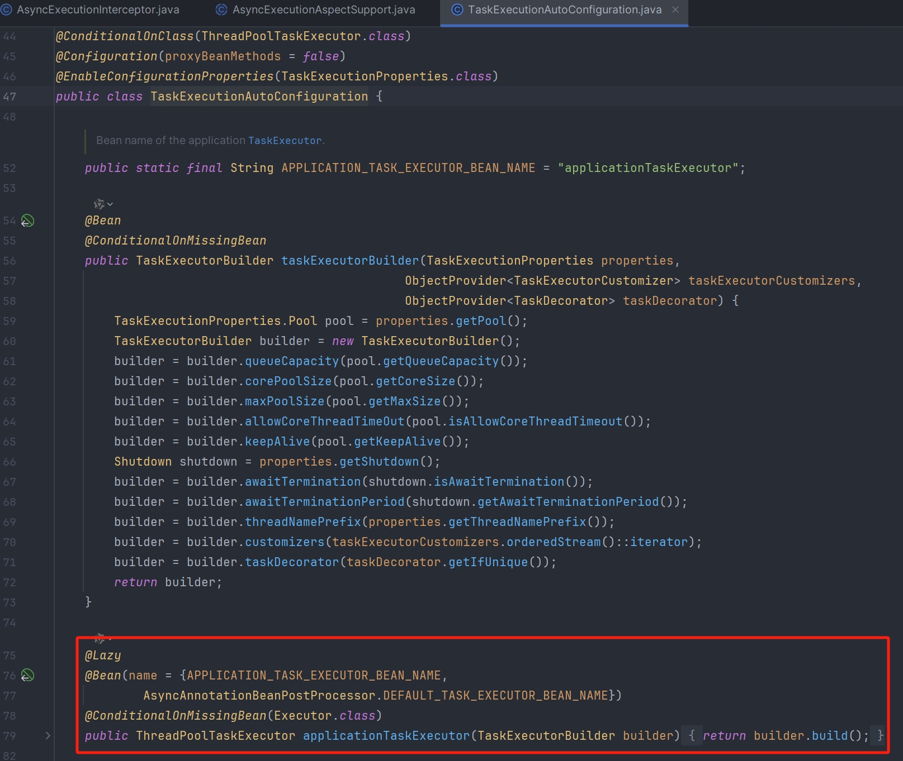
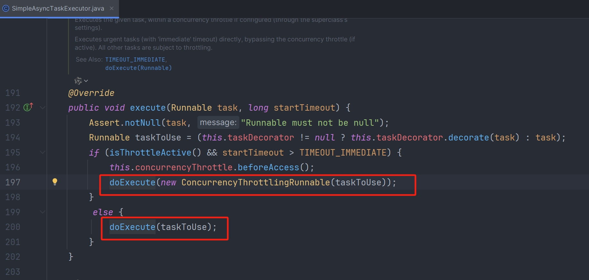
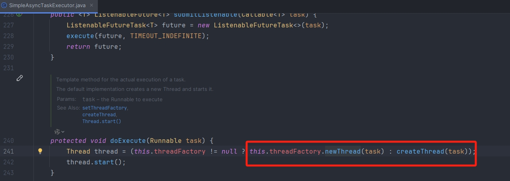
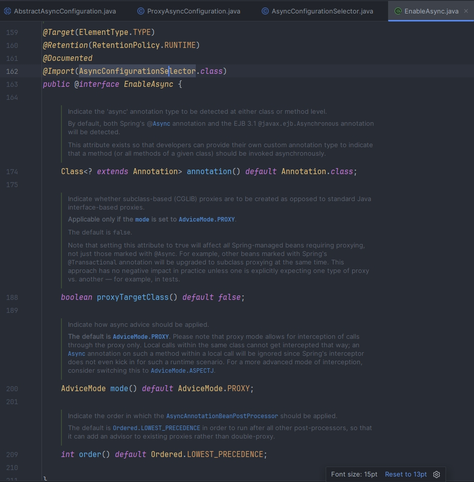
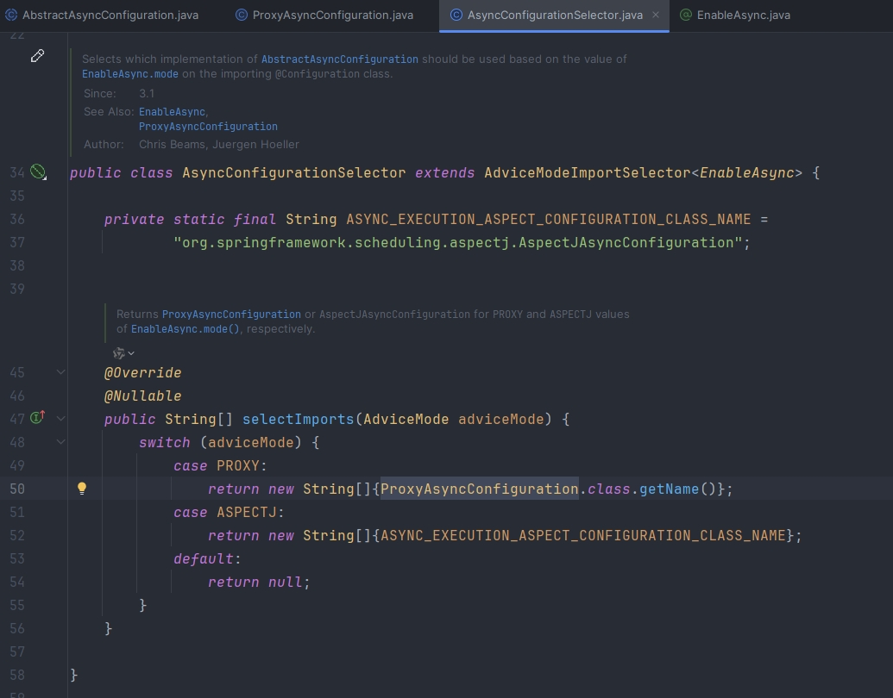
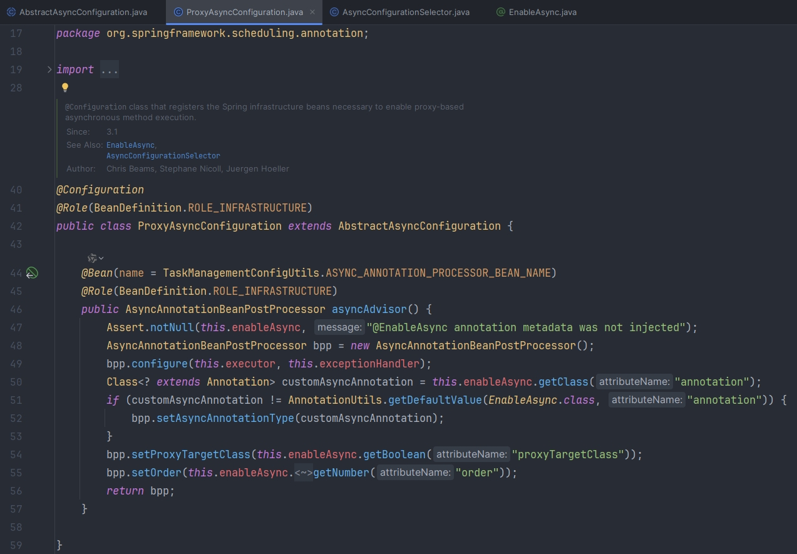
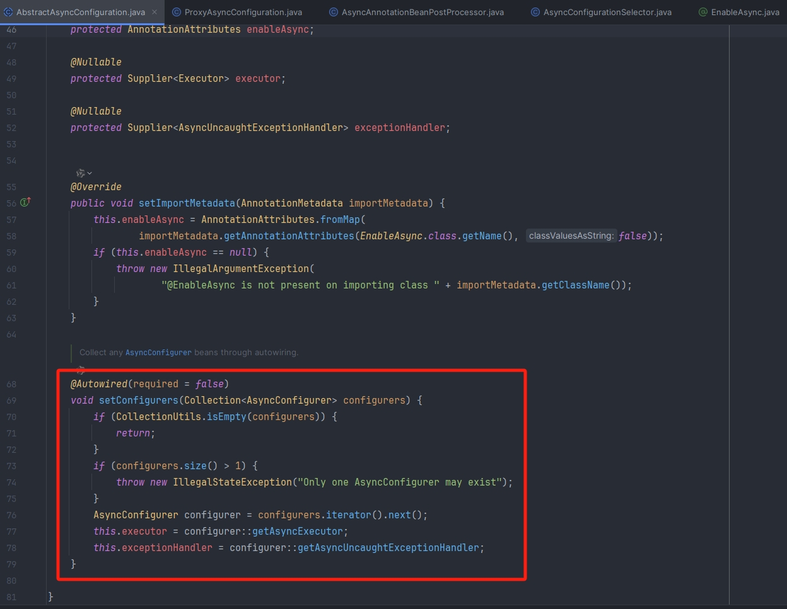
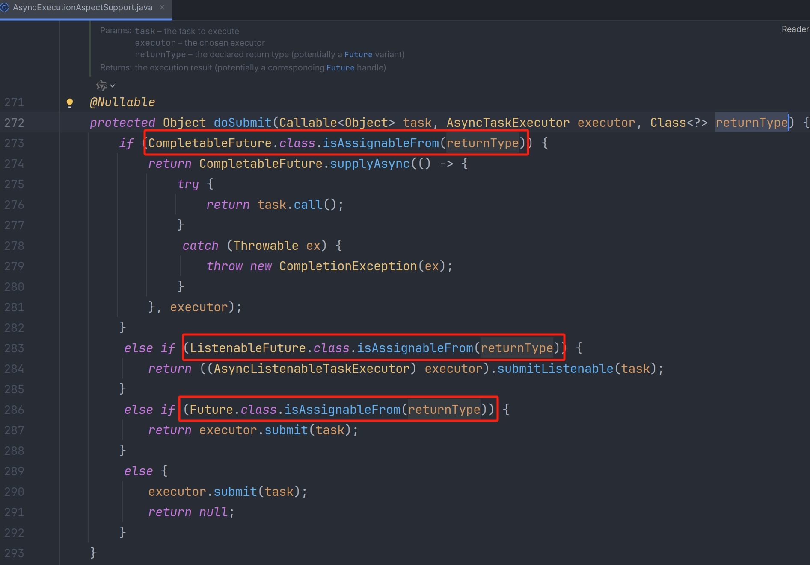

## 基本使用

### 异步调用

在使用@Async 之前，我们需要确保已经启用了 Spring 的异步任务执行功能，这通常通过在配置类上添加@EnableAsync 注解来完成

```java
@SpringBootApplication
// 开启异步调用
@EnableAsync
public class Async01Application {
    public static void main(String[] args) {
        SpringApplication.run(Async01Application.class, args);
    }
}
```

1. 未使用@Async

```java
@Component
public class Task1 {
    public static Random random = new Random();

    public void doTaskOne() throws InterruptedException {
        System.out.println("start 任务1....");
        long start = System.currentTimeMillis();
        Thread.sleep(random.nextInt(10000));
        long end = System.currentTimeMillis();
        System.out.println("任务1耗时：" + (end - start));
    }

    public void doTaskTwo() throws InterruptedException {
        System.out.println("start 任务2....");
        long start = System.currentTimeMillis();
        Thread.sleep(random.nextInt(10000));
        long end = System.currentTimeMillis();
        System.out.println("任务2耗时：" + (end - start));
    }

    public void doTaskThree() throws InterruptedException {
        System.out.println("start 任务3....");
        long start = System.currentTimeMillis();
        Thread.sleep(random.nextInt(10000));
        long end = System.currentTimeMillis();
        System.out.println("任务3耗时：" + (end - start));
    }
}
```

2. 使用@Async

```java
@Component
public class Task2 {
    public static Random random = new Random();

    @Async
    public void doTaskOne() throws InterruptedException {
        System.out.println("start 任务1...");
        long start = System.currentTimeMillis();
        Thread.sleep(random.nextInt(10000));
        long end = System.currentTimeMillis();
        System.out.println("任务1，耗时" + (end - start));
    }

    @Async
    public void doTaskTwo() throws InterruptedException {
        System.out.println("start 任务2...");
        long start = System.currentTimeMillis();
        Thread.sleep(random.nextInt(10000));
        long end = System.currentTimeMillis();
        System.out.println("任务2，耗时" + (end - start));
    }

    @Async
    public void doTaskThree() throws InterruptedException {
        System.out.println("start 任务3...");
        long start = System.currentTimeMillis();
        Thread.sleep(random.nextInt(10000));
        long end = System.currentTimeMillis();
        System.out.println("任务3，耗时" + (end - start));
    }
}
```

**使用两个方法进行比较**

```java
@SpringBootTest
class Async01ApplicationTests {

    @Autowired
    private Task1 task1;
    
    @Autowired
    private Task2 task2;
    
    @Test
    void test1() throws InterruptedException {
        task1.doTaskOne();
        task1.doTaskTwo();
        task1.doTaskThree();
    }
    
    @Test
    void test2() throws InterruptedException {
        task2.doTaskOne();
        task2.doTaskTwo();
        task2.doTaskThree();
        TimeUnit.SECONDS.sleep(10);
    }
}
```

1. 未使用@Async 执行结果

```java
start 任务1....
任务1耗时：1498
start 任务2....
任务2耗时：1967
start 任务3....
任务3耗时：9994
```

2. 使用@Async 执行结果

```java
start 任务1...
start 任务3...
start 任务2...
任务2，耗时664
任务1，耗时2378
任务3，耗时4973
```

可以看出，未使用@Async 时所有任务是串行执行的，只能等上一个任务执行完毕才能执行下一个，而使用@Async 后任务是并发执行的

### 异步返回结果

注意：被@Async 标注的方法必须是 void 类型的，且不能有返回值，除非返回类型是 Future，这样可以通过 Future 获取异步操作的结果

```java
@Component
public class AsyncTask {
    
    @Async
    public Future<String> asyncTask2() {
        System.out.println("asyncTask2 start.....");
        return new AsyncResult<String>("hello world");
    }
}
```

```java
@Autowired
private AsyncTask asyncTask;

@Test
void test3() throws ExecutionException, InterruptedException {
    Future<String> future = asyncTask.asyncTask2();
    while (true){
        //判断是否执行完毕
        if (future.isDone()) {
            System.out.println(future.get());
            break;
        }
    }
}
```

### 异常处理

```java
@Component
public class AsyncExceptionHandler implements AsyncUncaughtExceptionHandler {
    private final Logger logger = LoggerFactory.getLogger(AsyncExceptionHandler.class);

    // 异常捕获
    @Override
    public void handleUncaughtException(Throwable ex, Method method, Object... params) {
        logger.error("@Async调用异常，出现异常的方法：{}，参数：{}，异常信息：{}", method.getDeclaringClass().getName() + "."
                + method.getName(), JSON.toJSONString(params), ex.getMessage());
    }
}
```

```java
@Configuration
public class AsyncConfig extends AsyncConfigurerSupport {
    @Autowired
    private AsyncExceptionHandler asyncExceptionHandler;

    // 将异常处理类注入容器
    @Override
    public AsyncUncaughtExceptionHandler getAsyncUncaughtExceptionHandler() {
        return asyncExceptionHandler;
    }
}
```

```java
@Component
public class Task3 {
    public static Random random = new Random();

    @Async
    public void doTaskOne() throws InterruptedException {
        System.out.println("start 任务1...");
        int i = 1 / 0;
        long start = System.currentTimeMillis();
        Thread.sleep(random.nextInt(10000));
        long end = System.currentTimeMillis();
        System.out.println("任务1，耗时" + (end - start));
    }
}
```

```java
@Autowired
private Task3 task3;

@Test
void test4() throws InterruptedException {
    task3.doTaskOne();
    TimeUnit.SECONDS.sleep(10);
}
```

```java
// 执行结果：
start 任务1...
2024-11-22 09:12:45.828 ERROR 20716 --- [         task-1] c.e.a.d.config.AsyncExceptionHandler     : @Async调用异常，出现异常的方法：com.example.async.demos.config.Task3.doTaskOne，参数：[]，异常信息：/ by zero
```

## 线程池配置

### 默认线程池

SpringBoot 从 2.1 开始使用的是 ThreadPoolTaskExecutor 线程池，之前使用的是 SimpleAsyncTaskExecutor，查看 AsyncExecutionInterceptor 源码中的 getDefaultExecutor 方法，会先去找名称为 taskExecutor 的 Bean，如果找不到才使用 SimpleAsyncTaskExecutor

注意：名称为 taskExecutor 的 Bean 在 TaskExecutionAutoConfiguration 会被实例化







1. ThreadPoolTaskExecutor

此线程池的默认参数（由 SpringBoot 配置 TaskExecutionProperties），核心线程数 8，队列容量不限，最大线程数不限。如果业务逻辑需要执行的时间比较长，或者由于代码缺陷导致核心线程不能被释放，那么队列中的任务会越来越多且不会被执行。因此使用@Async 必须配置自定义线程池，或者修改默认线程池参数

2. SimpleAsyncTaskExecutor

此线程池会一直创建新的线程，失去了线程池的优势，不推荐使用，若系统中不断地创建线程，最终会导致系统占用内存过高，引发 OutOfMemoryError 错误。

针对线程创建问题，SimpleAsyncTaskExecutor 提供了限流机制，查看 ConcurrencyThrottleSupport 源码中的 beforeAccess 方法，通过 concurrencyLimit 属性来控制开关，当 concurrencyLimit >= 0 时开启限流机制，默认关闭限流机制即 concurrencyLimit =-1，当关闭情况下，会不断创建新的线程来处理任务。基于默认配置，SimpleAsyncTaskExecutor 并不是严格意义的线程池，达不到线程复用的功能





### 线程池修改

#### 配置文件修改

```properties
#核心线程数
spring.task.execution.pool.core-size=200
#最大线程数
spring.task.execution.pool.max-size=1000
#空闲线程保留时间
spring.task.execution.pool.keep-alive=3s
#队列容量
spring.task.execution.pool.queue-capacity=1000
#线程名称前缀
spring.task.execution.thread-name-prefix=test-thread-
```

@Async 异步方法默认使用 Spring 创建 ThreadPoolTaskExecutor（参考 TaskExecutionAutoConfiguration）

1. 默认核心线程数：8
2. 最大线程数：Integet.MAX_VALUE
3. 队列使用：LinkedBlockingQueue
4. 容量是：Integet.MAX_VALUE
5. 空闲线程保留时间：60s
6. 线程池拒绝策略：AbortPolicy

#### 自定义线程池

```properties
task.pool.corePoolSize=20
task.pool.maxPoolSize=40
task.pool.keepAliveSeconds=300
task.pool.queueCapacity=50
```

```java
@SpringBootApplication
@EnableAsync
public class Async02Application {
    public static void main(String[] args) {
        SpringApplication.run(Async02Application.class, args);
    }
}
```

```java
@Component
@ConfigurationProperties(prefix = "task.pool")
@Data
public class TaskThreadPoolConfig {
    private int corePoolSize;
    
    private int maxPoolSize;
    
    private int keepAliveSeconds;
    
    private int queueCapacity;
}
```

```java
@Configuration
public class TaskExecutePool {
    
    @Autowired
    private TaskThreadPoolConfig config;
    
    @Bean
    public Executor myTaskAsyncPool() {
        ThreadPoolTaskExecutor executor = new ThreadPoolTaskExecutor();
        //核心线程池大小
        executor.setCorePoolSize(config.getCorePoolSize());
        //最大线程数
        executor.setMaxPoolSize(config.getMaxPoolSize());
        //队列容量
        executor.setQueueCapacity(config.getQueueCapacity());
        //活跃时间
        executor.setKeepAliveSeconds(config.getKeepAliveSeconds());
        //线程名字前缀
        executor.setThreadNamePrefix("myExecutor-");
        //setRejectedExecutionHandler：当 pool 已经达到 max size 的时候，如何处理新任务
        //CallerRunsPolicy: 不在新线程中执行任务，而是由调用者所在的线程来执行
        executor.setRejectedExecutionHandler(new ThreadPoolExecutor.CallerRunsPolicy());
        
        //用来设置线程池关闭的时候等待所有任务都完成再继续销毁其他的 Bean，这样这些异步任务的销毁就会先于 Redis 线程池的销毁
        executor.setWaitForTasksToCompleteOnShutdown(true);
        //用来设置线程池中任务的等待时间，如果超过这个时间还没有销毁就强制销毁，以确保应用最后能够被关闭，而不是阻塞住
        executor.setAwaitTerminationSeconds(60);
        //线程初始化
        executor.initialize();
        return executor;
    }
}
```

通过指定@Async 中的值去找对应的 Bean，从而获取自定义的线程池

```java
@Component
public class AsyncTask {
    private final Logger logger = LoggerFactory.getLogger(AsyncTask.class);

    //myTaskAsynPool 即配置线程池的方法名，此处如果不写自定义线程池的方法名，会使用默认的线程池
    @Async("myTaskAsyncPool")
    public void doTask1(int i) {
        logger.info("task:" + i + " start");
    }
}
```

```java
@SpringBootTest
class Async02ApplicationTests {
    
    @Autowired
    private AsyncTask asyncTask;
    
    @Test
    void contextLoads() {
        for (int i = 0; i < 100; i++) {
            asyncTask.doTask1(i);
        }
    }
}
```

#### 实现接口 AsyncConfigurer

AsyncConfigurer 接口是 Spring 框架用于全局配置异步执行器（即线程池）的核心接口。当我们的 Spring 应用需要统一管理所有异步任务的执行环境时，可以选择实现此接口

使用@EnableAsync 后会导入 AsyncConfigurationSelector 类，根据代理类型返回对应的类（默认为 PROXY，即 ProxyAsyncConfiguration 类），ProxyAsyncConfiguration 会实例化 AsyncAnnotationBeanPostProcessor，并注入对应的实现 AsyncConfigurer 接口的类









```java
public interface AsyncConfigurer {
    @Nullable
    default Executor getAsyncExecutor() {
        return null;
    }

    @Nullable
    default AsyncUncaughtExceptionHandler getAsyncUncaughtExceptionHandler() {
        return null;
    }
}
```

1. getAsyncExecutor()：用于实现自定义线程池，控制并发数
+ 在 getAsyncExecutor()中创建线程池的时候，必须使用 executor.initialize()，不然在调用时会报线程池未初始化的异常
+ 如果使用 threadPoolTaskExecutor()来定义 bean，则不需要初始化
2. getAsyncUncaughtExceptionHandler()：用于处理异步方法的异常

```java
@Configuration
@Slf4j
public class NativeAsyncTaskExecutePool implements AsyncConfigurer {
    
    @Autowired
    private TaskThreadPoolConfig config;

    @Override
    public Executor getAsyncExecutor() {
        ThreadPoolTaskExecutor executor = new ThreadPoolTaskExecutor();
        //核心线程池大小
        executor.setCorePoolSize(config.getCorePoolSize());
        //最大线程数
        executor.setMaxPoolSize(config.getMaxPoolSize());
        //队列容量
        executor.setQueueCapacity(config.getQueueCapacity());
        //活跃时间
        executor.setKeepAliveSeconds(config.getKeepAliveSeconds());
        //线程名字前缀
        executor.setThreadNamePrefix("MyExecutor-");
        //CallerRunsPolicy：不在新线程中执行任务，而是由调用者所在的线程来执行
        executor.setRejectedExecutionHandler(new ThreadPoolExecutor.CallerRunsPolicy());
        //线程初始化
        executor.initialize();
        return executor;
    }

//    @Bean
//    public ThreadPoolTaskExecutor threadPoolTaskExecutor(){
//        ThreadPoolTaskExecutor executor = new ThreadPoolTaskExecutor();
//        executor.setCorePoolSize(10);
//        executor.setMaxPoolSize(100);
//        executor.setQueueCapacity(100);
//        return executor;
//    }

    /**
     * 异步任务中异常处理
     * @return
     */
    @Override
    public AsyncUncaughtExceptionHandler getAsyncUncaughtExceptionHandler() {
        return new AsyncUncaughtExceptionHandler() {
            @Override
            public void handleUncaughtException(Throwable ex, Method method, Object... params) {
                log.error("@Async调用异常，出现异常的方法：{}，参数：{}，异常信息：{}", method.getDeclaringClass().getName() + "."
                        + method.getName(), JSON.toJSONString(params), ex.getMessage());
            }
        };
    }
}
```

#### 继承 AsyncConfigurerSupport

```java
public class AsyncConfigurerSupport implements AsyncConfigurer {
    public AsyncConfigurerSupport() {
    }

    public Executor getAsyncExecutor() {
        return null;
    }

    @Nullable
    public AsyncUncaughtExceptionHandler getAsyncUncaughtExceptionHandler() {
        return null;
    }
}
```

## @Async 注意点
### 失效情况
1. 异步方法使用 static 修饰

```java
@Slf4j
@Service
public class UserService {

    @Async
    public static void async(String value) {
        log.info("async:{}", value);
    }
}
```

这时@Async 的异步功能会失效，因为这种情况 idea 会直接报错：`Methods annotated with '@Async' must be overridable` 。
使用@Async 注解声明的方法，必须是能被重写的，很显然 static 修饰的方法，是类的静态方法，是不允许被重写的。因此这种情况下，@Async 注解的异步功能会失效。

2. 方法用 final 修饰

在 Java 种 final 关键字，是一个非常特别的存在。

- 用 final 修饰的类，没法被继承。
- 用 final 修饰的方法，没法被重写。
- 用 final 修饰的变量，没法被修改。

如果 final 使用不当，也会导致@Async 注解的异步功能失效，例如：

```java
@Slf4j
@Service
public class UserService {

    public void test() {
        async("test");
    }

    @Async
    public final void async(String value) {
        log.info("async:{}", value);
    }
}
```

这种情况下 idea 也会直接报错：`Methods annotated with '@Async' must be overridable` 。

因为使用 final 关键字修饰的方法，是没法被子类重写的。因此这种情况下，@Async 注解的异步功能会失效。

3. 异步类没有使用@Component 注解导致 Spring 无法扫描到异步类

4. 需要在启动类上添加@EnableAsync 注解

```java
@EnableAsync
@SpringBootApplication
public class Application {

    public static void main(String[] args) {
        SpringApplication.run(Application.class, args);
    }
}
```

5. 异步方法在同一个类中调用

```java
@Slf4j
@Service
public class UserService {

    public void test() {
        async("test");
    }

    @Async
    public void async(String value) {
        log.info("async:{}", value);
    }
}
```

6. 方法不是 public

private 修饰的方法，只能在 UserService 类的对象中使用。而@Async 注解的异步功能，需要使用 Spring 的 AOP 生成 UserService 类的代理对象，该代理对象没法访问 UserService 类的 private 方法，因此会出现@Async 注解失效的问题。

```java
@Slf4j
@Service
public class UserService {

    @Async
    private void async(String value) {
        log.info("async:{}", value);
    }
}
```

7. 方法返回值错误

```java
@Service
public class UserService {

    @Async
    public String async(String value) {
        log.info("async:{}", value);
        return value;
    }
}
```

在 AsyncExecutionInterceptor 类的 invoke()方法，会调用它的父类 AsyncExecutionAspectSupport 中的 doSubmit 方法，该方法时异步功能的核心代码，如下：



从上面看出，@Async 注解的异步方法的返回值，要么是 Future，要么是 null。
因此，在实际项目中，如果想要使用 `@Async` 注解的异步功能，相关方法的返回值必须是 void 或者 Future

### 事务使用

在 Async 方法上标注@Transactional 是没用的，在 Async 方法中调用的方法上添加@Transactional 有效

```java
/**
 * 无效事务方法
 */
@Transactional(rollbackFor = Exception.class)
@Async
public void  doTaskOne2() {
    System.out.println("start 任务1...");
    System.out.println("任务1结束");
}
```

### 异常情况

1. 异步方法中抛出的异常不能直接捕获，因为调用者将无法获取到异常。建议使用 Future 或 CompletableFuture 来捕获异步方法的异常并进行处理
2. 异步方法的执行是非阻塞的，它们可能以任意顺序完成。如果需要按照特定的顺序处理结果，可以使用 CompletableFuture 的 thenApply 方法或者使用@Async 的 order 属性来指定顺序

