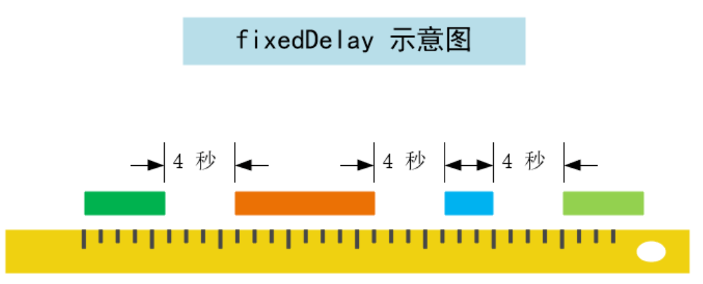
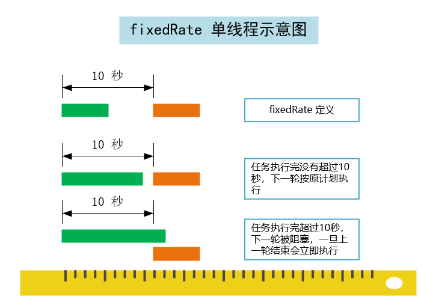
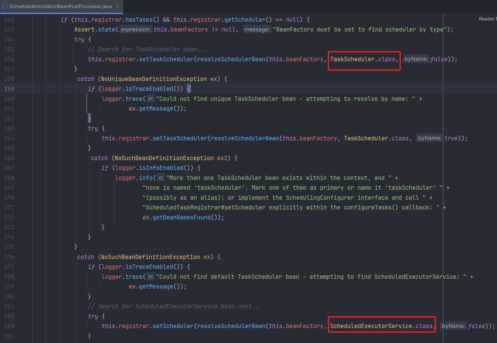
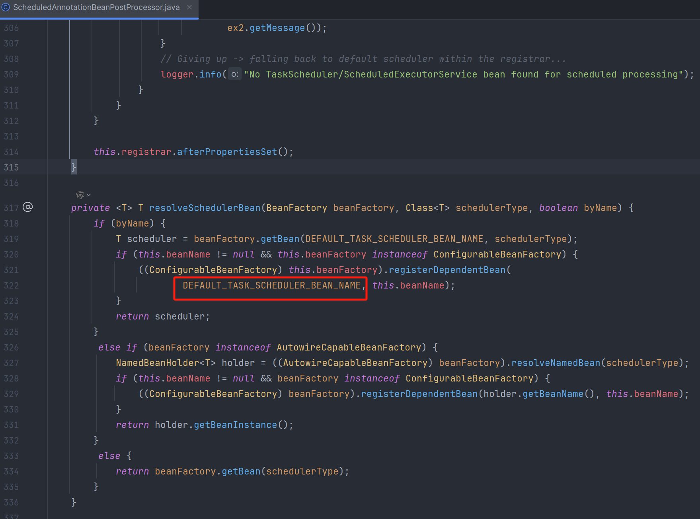

## 参数详解

```java
@Target({ElementType.METHOD, ElementType.ANNOTATION_TYPE})
@Retention(RetentionPolicy.RUNTIME)
@Documented
@Repeatable(Schedules.class)
public @interface Scheduled {
    String CRON_DISABLED = "-";
    
    String cron() default "";
    
    String zone() default "";
    
    long fixedDelay() default -1;
    
    String fixedDelayString() default "";
    
    long fixedRate() default -1;
    
    String fixedRateString() default "";
    
    long initialDelay() default -1;
    
    String initialDelayString() default "";
}
```

### fixedDelay
它的间隔时间是根据上次任务结束的时候开始计时的，只要盯紧上一次任务执行结束的时间即可，跟任务逻辑的执行时间无关，两个任务的间隔时间是固定的



### fixedDelayString

与 `fixedDelay` 一样，不同的是使用的是 `String` 字符串，支持占位符方式

```java
@Scheduled(fixedDelayString = "${time.fixedDelay}")
public void test() {
    System.out.println("Execute at " + System.currentTimeMillis());
}
```

### fixedRate

在理想情况下，下一次开始和上一次开始之间的时间间隔是一定的，但是默认情况下 SpringBoot 定时任务是单线程执行的。当下一轮的任务满足时间策略后任务就会加入队列，即当本次任务开始执行时下一次任务的时间就已经确定了，由于本次任务的“超时”执行，下一次任务的等待时间就会被压缩甚至阻塞



### fixedRateString

与 `fixedRate` 一样，不同的是使用的是 `String` 字符串，支持占位符方式

### initialDelay

这个参数只能配合 `fixedDelay` 或 `fixedRate` 使用。如：`@Scheduled(initialDelay = 10000, fixedRate = 15000)`，意思是在容器启动后，延迟 10 秒再执行一次定时器，以后每 15 秒再执行一次该定时器

### initialDelayString

与 `initialDelay` 一样，不同的是使用的是 `String` 字符串，支持占位符方式

### cron 表达式
语法格式：

1. 秒 分 小时 月份中的日期 月份 星期中的日期 年份

2. 秒 分 小时 月份中的日期 月份 星期中的日期 

| 字段               | 值                           | 特殊字符        |
| ------------------ | ---------------------------- | --------------- |
| 秒（Seconds）      | 0~59 的整数                   | , - * /         |
| 分（Minutes）      | 0~59 的整数                   | , - * /         |
| 小时（Hours）      | 0~23 的整数                   | , - * /         |
| 日期（DayofMonth） | 1~31 的整数（需要看月的天数） | , - * ? / L W C |
| 月份（Month）      | 1~12 的整数                   | , - * /         |
| 星期（DayOfWeek）  | 1~7 的整数                    | , - * ? / L W C |
| 年（Year）（可选） | 1970~2099                    | , - * /         |

1. \*：表示匹配该域的任意值。

   例如：在 Minutes 域使用*，即表示每分钟都会触发事件

2. ?：只能用在 DayofMonth 和 DayofWeek 两个域，它也匹配域的任意值，但实际不会，因为 DayofMonth 和 DayofWeek 会相互影响。

   例如：在每月的 20 日触发任务，不管 20 日是星期几，只能使用如下写法：13 13 15 20 * ?，其中最后一位只能用?，而不能使用*，如果使用*表示不管星期几都会触发

3. -：表示范围。

   例如：在 Minutes 域使用 5-20，表示从 5 到 20 分钟每分钟触发一次

4. /：表示起始时间开始触发，然后每隔固定时间触发一次。

   例如：在 Minutes 域使用 5/20，则意味着从第 5 分钟开始，每隔 20 分钟触发一次

5. ,：表示列出枚举值。

   例如：在 Minutes 域使用 5,20，则意味着在 5 和 20 分都会触发一次

6. L：表示最后，只能出现在 DayofWeek 和 DayofMonth 域。

   例如：在 DayofWeek 域使用 5L，意味着在最后的一个星期四触发

7. W：表示有效工作日（周一到周五），只能出现在 DayofMonth 域，系统将在离指定日期的最近的有效工作日触发事件。

   例如：在 DayofMonth 使用 5W，如果 5 日是星期六，则将在最近的工作日（星期五，即 4 日触发）；如果 5 日是星期天，则在 6 日（星期一）触发；如果 5 日在星期一到星期五中的一天，则就在 5 日触发。注意：W 的最近寻找不会跨过月份

8. LW：这两个字符可以连用，表示在某个月最后一个工作日，即最后一个星期五

9. #：用于确定每个月第 n 个星期 x（x#n），只能出现在 DayofMonth 域。

   例如：4#2 表示第 2 个星期三

**常用表达式参考**

```java
"*/5 * * * * ?"       # 每隔5秒执行一次
"0 */1 * * * ?"       # 每隔1分钟执行一次
"0 0 23 * * ?"        # 每天23点执行一次
"0 0 1 * * ?"         # 每天凌晨1点执行一次
"0 0 1 1 * ?"         # 每月1号凌晨1点执行一次
"0 0 23 L * ?"        # 每月最后一天23点执行一次
"0 0 1 ? * L"         # 每周星期天凌晨1点执行一次：
"0 26,29,33 * * * ?"  # 在26分、29分、33分执行一次
"0 0 0,3,8,21 * * ?"  # 每天的0点、3点、8点、21点执行一次
"0 0 10,14,16 * * ?"  # 每天上午10点，下午2点，4点
"0 0/30 9-17 * * ?"   # 朝九晚五工作时间内每半小时
"0 0 12 ? * WED"      # 表示每个星期三中午12点
"0 0 12 * * ?"        # 每天中午12点触发
"0 15 10 ? * *"       # 每天上午10:15触发
"0 15 10 * * ?"       # 每天上午10:15触发
"0 15 10 * * ? *"     # 每天上午10:15触发
"0 15 10 * * ? 2005"  # 2005年的每天上午10:15触发
"0 * 14 * * ?"        # 在每天下午2点到下午2:59期间的每1分钟触发
"0 0/5 14 * * ?"      # 在每天下午2点到下午2:55期间的每5分钟触发
"0 0/5 14,18 * * ?"   # 在每天下午2点到2:55期间和下午6点到6:55期间的每5分钟触发
"0 0-5 14 * * ?"      # 在每天下午2点到下午2:05期间的每1分钟触发
"0 10,44 14 ? 3 WED"  # 每年三月的星期三的下午2:10和2:44触发
"0 15 10 ? * MON-FRI" # 周一至周五的上午10:15触发
"0 15 10 15 * ?"      # 每月15日上午10:15触发
"0 15 10 L * ?"       # 每月最后一日的上午10:15触发
"0 15 10 ? * 6L"      # 每月的最后一个星期五上午10:15触发
"0 15 10 ? * 6#3"     # 每月的第三个星期五上午10:15触发
"0 15 10 ? * 6L 2002-2005" # 2002年至2005年的每月的最后一个星期五上午10:15触发
```

## 基本使用

### 基本方法

```xml
<dependency>
    <groupId>org.springframework.boot</groupId>
    <artifactId>spring-boot-starter-web</artifactId>
	<version>2.3.12.RELEASE</version>
</dependency>
```

```java
@SpringBootApplication
// 开启定时任务开关
@EnableScheduling
public class SpringtaskApplication {

    public static void main(String[] args) {
        SpringApplication.run(SpringtaskApplication.class, args);
    }
}
```

```java
@Component
public class TaskService01 {
    
    @Scheduled(fixedDelay = 1000)
    public void task01(){
        System.out.println("fixedDelay....");
    }
    
    @Scheduled(fixedRate = 1000)
    public void task02(){
        System.out.println("fixedRate....");
    }
    
    @Scheduled(initialDelay = 10000,fixedDelay = 1000)
    public void task03(){
        System.out.println("initialDelay");
    }
    
    @Scheduled(cron = "1 * * * * *")
    public void task04(){
        System.out.println("cron");
    }
}
```

### 定时任务开/关

通过配置文件控制 Bean 的实例化，根据需要进行开启/关闭定时任务

```java
@Component
@Slf4j
@RefreshScope
@ConditionalOnProperty(prefix = "test.job", name = "enable", havingValue = "true", matchIfMissing = true)
public class TestJob {
    
    @Scheduled(cron = "1 * * * * *")
    public void task04(){
        System.out.println("cron");
    }
}
```

## 定时任务配置

`@EnableScheduling` 注解引入了 `ScheduledAnnotationBeanPostProcessor` 其 `setScheduler(Object scheduler)` 有以下的注释：

如果 `TaskScheduler` 或者 `ScheduledExecutorService` 没有定义为该方法的参数，该方法将在 Spring IoC 中寻找唯一的 `TaskScheduler` 或者名称为 `taskScheduler` 的 Bean 作为参数，当然你按照查找 `TaskScheduler` 的方法找一个 `ScheduledExecutorService` 也可以。要是都找不到那么只能使用本地单线程调度器了





### 执行器

Spring Boot 内默认自动配置 `TaskExecutor` 任务执行器线程池，主要用于执行单次任务

#### 自动配置条件

1. 当类路径下存在 `ThreadPoolTaskExecutor` 类
2. 当 Spring 容器中不存在 `Executor` 的 bean

```java
// 仅在类 ThreadPoolTaskExecutor 存在于 classpath 时才应用
@ConditionalOnClass(ThreadPoolTaskExecutor.class)
@Configuration(proxyBeanMethods = false)
@EnableConfigurationProperties(TaskExecutionProperties.class)
public class TaskExecutionAutoConfiguration {

    public static final String APPLICATION_TASK_EXECUTOR_BEAN_NAME = "applicationTaskExecutor";

    @Bean
    @ConditionalOnMissingBean
    public TaskExecutorBuilder taskExecutorBuilder(TaskExecutionProperties properties,
            ObjectProvider<TaskExecutorCustomizer> taskExecutorCustomizers,
            ObjectProvider<TaskDecorator> taskDecorator) {
        TaskExecutionProperties.Pool pool = properties.getPool();
        TaskExecutorBuilder builder = new TaskExecutorBuilder();
        builder = builder.queueCapacity(pool.getQueueCapacity());
        builder = builder.corePoolSize(pool.getCoreSize());
        builder = builder.maxPoolSize(pool.getMaxSize());
        builder = builder.allowCoreThreadTimeOut(pool.isAllowCoreThreadTimeout());
        builder = builder.keepAlive(pool.getKeepAlive());
        Shutdown shutdown = properties.getShutdown();
        builder = builder.awaitTermination(shutdown.isAwaitTermination());
        builder = builder.awaitTerminationPeriod(shutdown.getAwaitTerminationPeriod());
        builder = builder.threadNamePrefix(properties.getThreadNamePrefix());
        builder = builder.customizers(taskExecutorCustomizers.orderedStream()::iterator);
        builder = builder.taskDecorator(taskDecorator.getIfUnique());
        return builder;
    }

    @Lazy
    @Bean(name = { APPLICATION_TASK_EXECUTOR_BEAN_NAME,
            AsyncAnnotationBeanPostProcessor.DEFAULT_TASK_EXECUTOR_BEAN_NAME })
    @ConditionalOnMissingBean(Executor.class)
    public ThreadPoolTaskExecutor applicationTaskExecutor(TaskExecutorBuilder builder) {
        return builder.build();
    }
}
```

#### 线程池配置

`TaskExecutionProperties` 默认值：

1. 线程名称前缀：threadNamePrefix = “task-”
2. 核心线程数：coreSize = 8
3. 最大线程数：maxSize = Integer.MAX_VALUE
4. 非核心线程存活时长：keepAlive = Duration.ofSeconds(60)

### 调度器

Spring Boot 内默认自动配置 `TaskScheduler` 任务调度器线程池，主要用于执行周期性任务

#### 自动配置条件

1. 当类路径下存在 `ThreadPoolTaskScheduler` 类
2. 当 Spring 容器中不存在 `SchedulingConfigurer`、`TaskScheduler`、`ScheduledExecutorService` 的 bean

```java
@ConditionalOnClass(ThreadPoolTaskScheduler.class)
@Configuration(proxyBeanMethods = false)
@EnableConfigurationProperties(TaskSchedulingProperties.class)
@AutoConfigureAfter(TaskExecutionAutoConfiguration.class)
public class TaskSchedulingAutoConfiguration {

    @Bean
    @ConditionalOnBean(name = TaskManagementConfigUtils.SCHEDULED_ANNOTATION_PROCESSOR_BEAN_NAME)
    @ConditionalOnMissingBean({ SchedulingConfigurer.class, TaskScheduler.class, ScheduledExecutorService.class })
    public ThreadPoolTaskScheduler taskScheduler(TaskSchedulerBuilder builder) {
        return builder.build();
    }

    @Bean
    @ConditionalOnMissingBean
    public TaskSchedulerBuilder taskSchedulerBuilder(TaskSchedulingProperties properties,
            ObjectProvider<TaskSchedulerCustomizer> taskSchedulerCustomizers) {
        TaskSchedulerBuilder builder = new TaskSchedulerBuilder();
        builder = builder.poolSize(properties.getPool().getSize());
        Shutdown shutdown = properties.getShutdown();
        builder = builder.awaitTermination(shutdown.isAwaitTermination());
        builder = builder.awaitTerminationPeriod(shutdown.getAwaitTerminationPeriod());
        builder = builder.threadNamePrefix(properties.getThreadNamePrefix());
        builder = builder.customizers(taskSchedulerCustomizers);
        return builder;
    }
}
```

3. 当 Spring 容器中存在名字叫 `org.springframework.context.annotation.internalScheduledAnnotationProcessor`（需要配置 `@EnableScheduling` 注解将会注入这个名字的 bean）

```java
@Target(ElementType.TYPE)
@Retention(RetentionPolicy.RUNTIME)
@Import(SchedulingConfiguration.class)
@Documented
public @interface EnableScheduling {
}
```

```java
@Configuration
@Role(BeanDefinition.ROLE_INFRASTRUCTURE)
public class SchedulingConfiguration {

    @Bean(name = TaskManagementConfigUtils.SCHEDULED_ANNOTATION_PROCESSOR_BEAN_NAME)
    @Role(BeanDefinition.ROLE_INFRASTRUCTURE)
    public ScheduledAnnotationBeanPostProcessor scheduledAnnotationProcessor() {
        return new ScheduledAnnotationBeanPostProcessor();
    }
}
```

#### 线程池配置

`TaskSchedulingProperties` 默认配置值：

1. 线程名称前缀：threadNamePrefix = “scheduling-”
2. 线程数：size = 1

该配置的自定义配置以 `spring.task.scheduling` 开头。同时它需要在任务执行器配置 `TaskExecutionAutoConfiguration` 配置后才生效。我们只需要在中对其配置属性 `spring.task.execution` 相关属性配置即可。

注意：定义任务默认用的是 `TaskSchedulingAutoConfiguration` 实例化的 Bean（`applicationTaskExecutor`、`taskScheduler`）

### Properties 配置

```properties
######任务调度线程池######
# 任务调度线程池大小 默认 1 建议根据任务加大
spring.task.scheduling.pool.size=1
# 调度线程名称前缀 默认 scheduling-
spring.task.scheduling.thread-name-prefix=scheduling-
# 线程池关闭时等待所有任务完成
spring.task.scheduling.shutdown.await-termination=true
# 调度线程关闭前最大等待时间，确保最后一定关闭
spring.task.scheduling.shutdown.await-termination-period=60


######任务执行线程池配置######
# 是否允许核心线程超时。这样可以动态增加和缩小线程池
spring.task.execution.pool.allow-core-thread-timeout=true
#  核心线程池大小 默认 8
spring.task.execution.pool.core-size=8
# 线程空闲等待时间 默认 60s
spring.task.execution.pool.keep-alive=60s
# 线程池最大数  根据任务定制
spring.task.execution.pool.max-size=16
#  线程池 队列容量大小
spring.task.execution.pool.queue-capacity=10
# 线程池关闭时等待所有任务完成
spring.task.execution.shutdown.await-termination=true
# 执行线程关闭前最大等待时间，确保最后一定关闭
spring.task.execution.shutdown.await-termination-period=60
# 线程名称前缀
spring.task.execution.thread-name-prefix=task-
```

#### TaskSchedulingAutoConfiguration 源码

当 Spring Boot 应用程序中没有定义自定义的线程池 bean 时，Spring Boot 应用程序会根据自动配置类注入一个名为 `applicationTaskExecutor` 或 `taskExecutor` 的线程池对象，它的配置是在 `TaskExecutionProperties` 类中完成的，这个类使用 `spring.task.execution` 前缀进行配置，包含了很多线程池相关细节的配置选项，当我们容器中存在自定义线程池时，`applicationTaskExecutor` 或 `taskExecutor` 的线程池对象是不会被创建的。

#### @Async 注解相关配置

使用 `@Async` 注解没有指定 `value` 属性时，项目启动的时候会有这样的提示：“在上下文中找到多个 `TaskExecutor` bean，并且没有一个名为 `taskExecutor`。将其中一个标记为 `primary` 或将其命名为 `taskExecutor`（可能作为别名），以便将其用于异步处理”

```java
// 标记为 Primary，即主要的线程
@Bean
@Primary
public ThreadPoolTaskExecutor threadPoolTaskExecutor() {
    ThreadPoolTaskExecutor executor = new ThreadPoolTaskExecutor();
    executor.setThreadNamePrefix("my-free-style-");
    executor.setMaxPoolSize(maxPoolSize);
    executor.setCorePoolSize(corePoolSize);
    executor.setQueueCapacity(queueCapacity);
    executor.setKeepAliveSeconds(keepAliveSeconds);
    // 线程池对拒绝任务(无线程可用)的处理策略
    executor.setRejectedExecutionHandler(new ThreadPoolExecutor.CallerRunsPolicy());
    return executor;
}
 
// 直接起别名为 taskExecutor
@Bean(name = "taskExecutor")
public ThreadPoolTaskExecutor threadPoolTaskExecutor() {
    ThreadPoolTaskExecutor executor = new ThreadPoolTaskExecutor();
    executor.setThreadNamePrefix("my-free-style-");
    executor.setMaxPoolSize(maxPoolSize);
    executor.setCorePoolSize(corePoolSize);
    executor.setQueueCapacity(queueCapacity);
    executor.setKeepAliveSeconds(keepAliveSeconds);
    // 线程池对拒绝任务(无线程可用)的处理策略
    executor.setRejectedExecutionHandler(new ThreadPoolExecutor.CallerRunsPolicy());
    return executor;
}
```

## 任务阻塞

### 出现原因

Spring 中 `@EnableScheduling` 和 `@Scheduled` 标注的定时任务默认单线程同步执行，多个任务时，一个任务执行完毕以后才能执行下一个任务，可能会有阻塞现象发生（如果希望并发运行，需要配置线程池）

```java
@SpringBootApplication
@EnableScheduling
public class SpringbootTaskApplication {

    public static void main(String[] args) {
        SpringApplication.run(SpringbootTaskApplication.class, args);
    }
}
```

```java
@Component
@Slf4j
public class ScheduleTask1 {

    @Scheduled(cron = "*/2 * * * * ?")
    public void task1() throws InterruptedException {
        log.info("我是task1，我需要执行 10s 钟的时间，我的线程的 id == > {}，时间 == >{}", Thread.currentThread().getId(), new Date());
        Thread.sleep(10000);
        log.info("我是task1 ending ,我的线程的 id == > {} , 时间 == > {}", Thread.currentThread().getId(), new Date());
    }

    @Scheduled(cron = "*/4 * * * * ?")
    public void task2() throws InterruptedException {
        log.info("我是task2，我需要执行 2s 钟的时间，我的线程的 id == > {}，时间 == >{}", Thread.currentThread().getId(), new Date());
        Thread.sleep(2000);
        log.info("我是task2 ending ,我的线程的 id == > {} , 时间 == > {}",Thread.currentThread().getId(), new Date());
    }
}
```

```java
// 运行结果
我是task1，我需要执行 10s 钟的时间，我的线程的 id == > 95，时间 == >Fri Feb 01 15:16:52 CST 2019
我是task1 ending ,我的线程的 id == > 95 , 时间 == > Fri Feb 01 15:17:02 CST 2019
我是task2，我需要执行 2s 钟的时间，我的线程的 id == > 95，时间 == >Fri Feb 01 15:17:02 CST 2019
task2 ending ,我的线程的 id == > 95 , 时间 == > Fri Feb 01 15:17:04 CST 2019
我是task1，我需要执行 10s 钟的时间，我的线程的 id == > 95，时间 == >Fri Feb 01 15:17:04 CST 2019
task1 ending ,我的线程的 id == > 95 , 时间 == > Fri Feb 01 15:17:14 CST 2019
```

可以看出，从 task1 任务运行时，等到 4s 时，task2 任务没有执行，而是等到 task1 任务执行结束后才执行

### 解决方法

#### 使用@Async 异步执行任务

```java
@SpringBootApplication
@EnableScheduling
@EnableAsync
public class SpringbootTaskApplication {

    public static void main(String[] args) {
        SpringApplication.run(SpringbootTaskApplication.class, args);
    }
}
```

1. 使用默认线程池配置

@Async 默认的线程池配置是 Bean 名称为 taskExecutor 的类

```java
@Component
@Slf4j
public class ScheduleTask2 {

    @Async
    @Scheduled(cron = "*/2 * * * * ?")
    public void task1() throws InterruptedException {
        log.info("我是task1，我需要执行 10s 钟的时间，我的线程的 id == > {}，时间 == >{}", Thread.currentThread().getId(), new Date());
        Thread.sleep(10000);
        log.info("我是task1 ending ,我的线程的 id == > {} , 时间 == > {}", Thread.currentThread().getId(), new Date());
    }

    @Async
    @Scheduled(cron = "*/4 * * * * ?")
    public void task2() throws InterruptedException {
        log.info("我是task2，我需要执行 2s 钟的时间，我的线程的 id == > {}，时间 == >{}", Thread.currentThread().getId(), new Date());
        Thread.sleep(2000);
        log.info("我是task2 ending ,我的线程的 id == > {} , 时间 == > {}",Thread.currentThread().getId(), new Date());
    }
}
```

2. 自定义线程池配置

通过指定 Bean 名称来决定使用哪个线程池，用户可以自定义线程池配置

```java
@Component
@Slf4j
public class ScheduleTask3 {

    @Async("myPoolTaskExecutor")
    @Scheduled(cron = "*/2 * * * * ?")
    public void task1() throws InterruptedException {
        log.info("我是task1，我需要执行 10s 钟的时间，我的线程的 id == > {}，时间 == >{}", Thread.currentThread().getId(), new Date());
        Thread.sleep(10000);
        log.info("我是task1 ending ,我的线程的 id == > {} , 时间 == > {}", Thread.currentThread().getId(), new Date());
    }

    @Async("myPoolTaskExecutor")
    @Scheduled(cron = "*/4 * * * * ?")
    public void task2() throws InterruptedException {
        log.info("我是task2，我需要执行 2s 钟的时间，我的线程的 id == > {}，时间 == >{}", Thread.currentThread().getId(), new Date());
        Thread.sleep(2000);
        log.info("我是task2 ending ,我的线程的 id == > {} , 时间 == > {}",Thread.currentThread().getId(), new Date());
    }

    /**
    * 创建自定义线程池，提供异步调用时使用
    **/
    @Bean(name = "myPoolTaskExecutor")
    public ThreadPoolTaskExecutor getMyPoolTaskExecutor() {
        ThreadPoolTaskExecutor taskExecutor = new ThreadPoolTaskExecutor();
        //核心线程数
        taskExecutor.setCorePoolSize(10);
        //线程池维护线程的最大数量, 只有在缓冲队列满了之后才会申请超过核心线程数的线程
        taskExecutor.setMaxPoolSize(100);
        //缓存队列
        taskExecutor.setQueueCapacity(50);
        //许的空闲时间, 当超过了核心线程出之外的线程在空闲时间到达之后会被销毁
        taskExecutor.setKeepAliveSeconds(200);
        //异步方法内部线程名称
        taskExecutor.setThreadNamePrefix("poolTestThread-");
        /**
         * 当线程池的任务缓存队列已满并且线程池中的线程数目达到 maximumPoolSize，如果还有任务到来就会采取任务拒绝策略
         * 通常有以下四种策略：
         * ThreadPoolExecutor.AbortPolicy: 丢弃任务并抛出 RejectedExecutionException 异常。
         * ThreadPoolExecutor.DiscardPolicy：也是丢弃任务，但是不抛出异常。
         * ThreadPoolExecutor.DiscardOldestPolicy：丢弃队列最前面的任务，然后重新尝试执行任务（重复此过程）
         * ThreadPoolExecutor.CallerRunsPolicy：重试添加当前的任务，自动重复调用 execute() 方法，直到成功
         */
        // 拒绝策略
        taskExecutor.setRejectedExecutionHandler(new ThreadPoolExecutor.CallerRunsPolicy());
        taskExecutor.initialize();

        System.out.println("@Async 业务处理线程配置成功，核心线程池：[{}]，最大线程池：[{}]，队列容量：[{}]，线程名称前缀：[{}]");
        return taskExecutor;
    }
}
```

**执行结果**

```java
//运行结果：
我是task2，我需要执行 2s 钟的时间，我的线程的 id == > 116，时间 == >Fri Feb 01 16:19:32 CST 2019
我是task1，我需要执行 10s 钟的时间，我的线程的 id == > 117，时间 == >Fri Feb 01 16:19:32 CST 2019
我是task1，我需要执行 10s 钟的时间，我的线程的 id == > 124，时间 == >Fri Feb 01 16:19:34 CST 2019
task2 ending ,我的线程的 id == > 116 , 时间 == > Fri Feb 01 16:19:34 CST 2019
我是task1，我需要执行 10s 钟的时间，我的线程的 id == > 125，时间 == >Fri Feb 01 16:19:36 CST 2019
我是task2，我需要执行 2s 钟的时间，我的线程的 id == > 126，时间 == >Fri Feb 01 16:19:36 CST 2019
我是task1，我需要执行 10s 钟的时间，我的线程的 id == > 127，时间 == >Fri Feb 01 16:19:38 CST 2019
task2 ending ,我的线程的 id == > 126 , 时间 == > Fri Feb 01 16:19:38 CST 2019
我是task2，我需要执行 2s 钟的时间，我的线程的 id == > 128，时间 == >Fri Feb 01 16:19:40 CST 2019
我是task1，我需要执行 10s 钟的时间，我的线程的 id == > 129，时间 == >Fri Feb 01 16:19:40 CST 2019
```

从日志可知：task1 和 task2 的确是并行执行的，因为开始的时间节点是一样的。

存在问题：当 task1 第一次任务执行时间过长时，此时 task1 又到了其第二次执行任务的调度时间，这时会并行执行两个任务

#### 实现 SchedulingConfigurer 接口

使用 `@Async` 会导致第一次任务执行时间过长，从而第二次任务和第一次任务并发执行

解决方法：实现 `SchedulingConfigurer` 接口，这样自动装配中 `TaskSchedulingAutoConfiguration` 的 `taskScheduler` 就不会被实例化，替换原来的线程池配置

```java
@Configuration
@Slf4j
public class ScheduleConfig implements SchedulingConfigurer {

    @Override
    public void configureTasks(ScheduledTaskRegistrar taskRegistrar) {
        taskRegistrar.setScheduler(taskExecutor());
    }

     @Bean
     public Executor taskExecutor(){
         return Executors.newScheduledThreadPool(10);
     }
}
```

```java
@Component
@Slf4j
public class ScheduleTask4 {

    @Scheduled(cron = "*/2 * * * * ?")
    public void task1() throws InterruptedException {
        log.info("我是task1，我需要执行 10s 钟的时间，我的线程的 id == > {}，时间 == >{}", Thread.currentThread().getId(), new Date());
        Thread.sleep(10000);
        log.info("我是task1 ending ,我的线程的 id == > {} , 时间 == > {}", Thread.currentThread().getId(), new Date());
    }

    @Scheduled(cron = "*/4 * * * * ?")
    public void task2() throws InterruptedException {
        log.info("我是task2，我需要执行 2s 钟的时间，我的线程的 id == > {}，时间 == >{}", Thread.currentThread().getId(), new Date());
        Thread.sleep(2000);
        log.info("我是task2 ending ,我的线程的 id == > {} , 时间 == > {}",Thread.currentThread().getId(), new Date());
    }
}
```

**执行结果**

```java
//执行结果：
我是task2，我需要执行 2s 钟的时间，我的线程的 id == > 95，时间 == >Fri Feb 01 16:28:16 CST 2019
我是task1，我需要执行 10s 钟的时间，我的线程的 id == > 96，时间 == >Fri Feb 01 16:28:16 CST 2019
task2 ending ,我的线程的 id == > 95 , 时间 == > Fri Feb 01 16:28:18 CST 2019
我是task2，我需要执行 2s 钟的时间，我的线程的 id == > 95，时间 == >Fri Feb 01 16:28:20 CST 2019
task2 ending ,我的线程的 id == > 95 , 时间 == > Fri Feb 01 16:28:22 CST 2019
我是task2，我需要执行 2s 钟的时间，我的线程的 id == > 121，时间 == >Fri Feb 01 16:28:24 CST 2019
task1 ending ,我的线程的 id == > 96 , 时间 == > Fri Feb 01 16:28:26 CST 2019
task2 ending ,我的线程的 id == > 121 , 时间 == > Fri Feb 01 16:28:26 CST 2019
我是task1，我需要执行 10s 钟的时间，我的线程的 id == > 95，时间 == >Fri Feb 01 16:28:28 CST 2019
我是task2，我需要执行 2s 钟的时间，我的线程的 id == > 122，时间 == >Fri Feb 01 16:28:28 CST 2019
```

注意：此时每次定时任务执行的 traceId 是一致的，无法很好地追踪每次定时任务的情况，修改如下

```java
@Configuration
@Slf4j
public class ScheduleConfig implements SchedulingConfigurer {
    
    @Override
    public void configureTasks(ScheduledTaskRegistrar taskRegistrar) {
        // taskRegistrar.setScheduler(taskExecutor());  
        ThreadPoolTaskScheduler taskScheduler = new ThreadPoolTaskScheduler();
		taskScheduler.setPoolSize(10);
		taskScheduler.initialize();
        taskRegistrar.setScheduler(taskScheduler);
    }

    // 缺点：可能每次定时任务产生的 traceId 是一致的
    // @Bean
    // public Executor taskExecutor(){
    //     return Executors.newScheduledThreadPool(10);
    // }
}
```

#### Properties 配置

修改默认的线程池配置，适当将调度线程池的配置修改，支持多任务并发执行

```properties
######任务调度线程池######
# 任务调度线程池大小 默认 1 建议根据任务加大
spring.task.scheduling.pool.size=10
# 调度线程名称前缀 默认 scheduling-
spring.task.scheduling.thread-name-prefix=scheduling-
# 线程池关闭时等待所有任务完成
spring.task.scheduling.shutdown.await-termination=true
# 调度线程关闭前最大等待时间，确保最后一定关闭
spring.task.scheduling.shutdown.await-termination-period=60


######任务执行线程池配置######
# 是否允许核心线程超时。这样可以动态增加和缩小线程池
spring.task.execution.pool.allow-core-thread-timeout=true
# 核心线程池大小 默认 8
spring.task.execution.pool.core-size=8
# 线程空闲等待时间 默认 60s
spring.task.execution.pool.keep-alive=60s
# 线程池最大数 根据任务定制
spring.task.execution.pool.max-size=16
# 线程池队列容量大小
spring.task.execution.pool.queue-capacity=10
# 线程池关闭时等待所有任务完成
spring.task.execution.shutdown.await-termination=true
# 执行线程关闭前最大等待时间，确保最后一定关闭
spring.task.execution.shutdown.await-termination-period=60
# 线程名称前缀
spring.task.execution.thread-name-prefix=task-
```

## 缺点

1. 不支持集群配置，在分布式环境下会出现多个任务并发执行的情况

解决方法：通过分布式锁的方式预防任务并发执行的情况

2. 不支持指定的时间范围执行任务（例如在 9 点到 11 点间执行任务，其他时间段不执行）
3. 不支持分片执行任务

## 动态定时任务实现

### 出现问题

用实现 Spring Boot + `@Scheduled` 实现了定时任务。但是也存在很多问题：

通常，`@Scheduled` 注解的所有属性只在 Spring Context 启动时解析和初始化一次。因此，当在 Spring 中使用 `@Scheduled` 注解时，无法在运行时更改 `fixedDelay` 或 `fixedRate` 值。

1. 在一个线程内执行，那么任务多了就可能被阻塞，导致任务延迟执行。
2. 每次修改执行频率都要改代码，重启服务。
3. 无法提供定时任务的启用、暂停、修改接口。

实现方法：参考 `ScheduledTaskRegistrar` 源码提供的方法

### 简单案例

```mysql
CREATE TABLE `sys_task` (
  `id` bigint(21) NOT NULL AUTO_INCREMENT COMMENT '主键',
  `task_uuid` varchar(50) DEFAULT NULL COMMENT '任务UUID',
  `task_name` varchar(50) DEFAULT NULL COMMENT '任务名称',
  `task_cron` varchar(50) DEFAULT NULL COMMENT '任务定时表达式',
  `class_name` varchar(100) DEFAULT NULL COMMENT '任务类',
  `method_name` varchar(100) DEFAULT NULL COMMENT '任务方法',
  `task_type` int(1) DEFAULT NULL COMMENT '任务类型',
  `remark` varchar(250) DEFAULT NULL,
  `del_flag` int(1) DEFAULT '1',
  `create_user` varchar(50) DEFAULT NULL,
  `create_time` timestamp NULL DEFAULT CURRENT_TIMESTAMP,
  `update_user` varchar(50) DEFAULT NULL,
  `update_time` timestamp NULL DEFAULT CURRENT_TIMESTAMP,
  PRIMARY KEY (`id`)
) ENGINE=InnoDB AUTO_INCREMENT=2 DEFAULT CHARSET=utf8
```

```java
@Configuration
public class ScheduledConfig {

    @Bean
    public ScheduledTaskRegistrar taskRegistrar() {
        return new ScheduledTaskRegistrar();
    }
}
```

```java
@Slf4j
public class ScheduleTask5 {

    public void task1() throws InterruptedException {
        log.info("我是task1，我的线程的 id == > {}，时间 == >{}", Thread.currentThread().getId(), new Date());
        Thread.sleep(4000);
        log.info("我是task1 ending ,我的线程的 id == > {} , 时间 == > {}", Thread.currentThread().getId(), new Date());
    }
}
```

```java
@Data
public class SysTask {
    /**
    * 主键
    */
    private Long id;

    /**
    * 任务 UUID
    */
    private String taskUuid;

    /**
    * 任务名称
    */
    private String taskName;

    /**
    * 任务定时表达式
    */
    private String taskCron;

    /**
    * 任务类
    */
    private String className;

    /**
    * 任务方法
    */
    private String methodName;

    /**
    * 任务类型
    */
    private Integer taskType;

    /**
     * 备注
     */
    private String remark;

    /**
     * 删除标识
     */
    private Integer delFlag;

    /**
     * 创建人
     */
    private String createUser;

    /**
     * 创建时间
     */
    private Date createTime;

    /**
     * 修改人
     */
    private String updateUser;

    /**
     * 修改时间
     */
    private Date updateTime;
}
```

```java
@Service
@Slf4j
public class CronServiceImpl implements CronService {

    private static Map<String, ScheduledTask> scheduledTaskMap = new HashMap<>();
    @Resource
    private ScheduledTaskRegistrar taskRegistrar;

    @Override
    public void add(SysTask sysTask) {
        CronTask cronTask = new CronTask(getRunnable(sysTask), sysTask.getTaskCron());
        ScheduledTask scheduledTask = taskRegistrar.scheduleCronTask(cronTask);
        String uuid = UUID.randomUUID().toString();
        scheduledTaskMap.put(uuid, scheduledTask);
        log.info("添加任务成功, uuid == > {}, 任务名称 == > {}, 任务表达式 == > {}", uuid, sysTask.getTaskName(), sysTask.getTaskCron());
    }

    private Runnable getRunnable(SysTask sysTask) {
        return () -> {
            try {
                Class<?> aClass = Class.forName(sysTask.getClassName());
                Constructor<?> constructor = aClass.getConstructor();
                Object o = constructor.newInstance();
                Method method = aClass.getMethod(sysTask.getMethodName());
                method.invoke(o);
            } catch (Exception e) {
                e.printStackTrace();
            }
        };
    }

    @Override
    public void delete(String uuid) {
        try {
            ScheduledTask scheduledTask = scheduledTaskMap.get(uuid);
            scheduledTask.cancel();
            scheduledTaskMap.remove(uuid);
        } catch (Exception e) {
            e.printStackTrace();
        }
    }

    @Override
    public void update(SysTask sysTask) {
        this.delete(sysTask.getTaskUuid());
        this.add(sysTask);
    }
}
```

```java
@RestController
@RequestMapping("/cron")
public class CronController {

    @Resource
    private CronService cronService;

    @PostMapping("/add")
    public String add(@RequestBody SysTask sysTask) {
        cronService.add(sysTask);
        return "success";
    }

    @PostMapping("/delete")
    public String delete(String uuid) {
        cronService.delete(uuid);
        return "success";
    }

    @PostMapping("/update")
    public String update(@RequestBody SysTask sysTask) {
        cronService.update(sysTask);
        return "success";
    }
}
```

