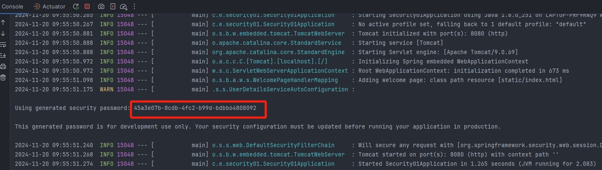
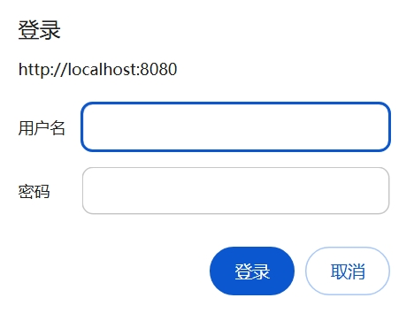

## 依赖

```xml
<dependency>
    <groupId>org.springframework.boot</groupId>
    <artifactId>spring-boot-starter-security</artifactId>
    <version>2.3.12.RELEASE</version>
</dependency>
<dependency>
    <groupId>org.springframework.boot</groupId>
    <artifactId>spring-boot-starter-web</artifactId>
    <version>2.3.12.RELEASE</version>
</dependency>
```

## 登录认证

```java
@Controller
public class UserController {

    @GetMapping("/test")
    @ResponseBody
    public String test(){
        return "hello";
    }
}
```

注意：导入依赖之后，访问 localhost: 8080/test 请求地址会自动跳转到 localhost: 8080/test 中，出现一个表单，需要登录后才能访问

用户名默认为 user，密码在控制台出现




## 将表单请求转换为弹出框请求

**WebSecurityConfigurerAdapter**

```java
/**
 * 定制用户认证管理器来实现用户认证
 *  1. 提供用户认证所需信息（用户名、密码、当前用户的资源权）
 *  2. 可采用内存存储方式，也可能采用数据库方式
 */
void configure(AuthenticationManagerBuilder auth);

/**
 * 定制基于 HTTP 请求的用户访问控制
 *  1. 配置拦截的哪一些资源
 *  2. 配置资源所对应的角色权限
 *  3. 定义认证方式：HttpBasic、HttpForm
 *  4. 定制登录页面、登录请求地址、错误处理方式
 *  5. 自定义 Spring Security 过滤器等
 */
void configure(HttpSecurity http);

/**
 * 定制一些全局性的安全配置，例如：不拦截静态资源的访问
 */
void configure(WebSecurity web);
```

**使用案例**

1. 创建配置类继承 WebSecurityConfigurerAdapter 类，实现 http 的 configure 方法

```java
@Configuration
public class WebSecurityConfig extends WebSecurityConfigurerAdapter {

    @Override
    protected void configure(HttpSecurity http) throws Exception {
        /**
         * fromLogin()：表单认证
         * httpBasic()：弹出框认证
         * authorizeRequests()：身份认证请求
         * anyRequest()：所有请求
         * authenticated()：身份认证
         */
        http.httpBasic()
                .and()
                .authorizeRequests()
                // 其它任何请求访问都需要先通过认证
                .anyRequest()
                .authenticated();
    }
}
```

2. 访问地址：localhost: 8080/test，此时发现表单请求转换为弹出框请求



## @EnableWebSecurity

在非 Springboot 的 Spring Web MVC 应用中，该注解@EnableWebSecurity 需要开发人员自己引入以启用 Web 安全。

在基于 Springboot 的 Spring Web MVC 应用中，开发人员没有必要再次引用该注解，Springboot 的自动配置机制 WebSecurityEnablerConfiguration 已经引入了该注解

```java
// 省略 imports 行
@Configuration
// 仅在存在 WebSecurityConfigurerAdapter bean 时该注解才有可能生效
// (最终生效与否要结合其他条件综合考虑)
@ConditionalOnBean(WebSecurityConfigurerAdapter.class)
// 仅在不存在 springSecurityFilterChain 时该注解才有可能生效
// (最终生效与否要结合其他条件综合考虑)
@ConditionalOnMissingBean(name = BeanIds.SPRING_SECURITY_FILTER_CHAIN)
// 仅在 Servlet 环境下该注解才有可能生效
// (最终生效与否要结合其他条件综合考虑)
@ConditionalOnWebApplication(type = ConditionalOnWebApplication.Type.SERVLET)
@EnableWebSecurity // <====== 这里启用了 Web 安全
public class WebSecurityEnablerConfiguration {
 
}
```

## 路径匹配器

### MvcRequestMatcher

#### 匹配规则

1. /a：仅匹配路径/a
2. /a/\*：操作符\* 会替换一个路径名。在这种情况下，它将匹配/a/b 或/a/c，而不是/a/b/c
3. /a/\*\*：操作符\*\* 会替换多个路径名。在这种情况下，/a 以及/a/b 和/a/b/c 都是这个表达式的匹配项
4. /a/{param}：这个表达式适用于具有给定路径参数的路径/a
5. /a/{param: regex}：只有当参数的值与给定正则表达式匹配时，此表达式才应用于具有给定路径参数的路径/a

#### 使用案例

1. 单个请求无请求方法匹配

```java
http.authorizeRequests() 
    .mvcMatchers("/hello_user").hasRole("USER") 
    .mvcMatchers("/hello_admin").hasRole("ADMIN");
```

如果使用角色为“USER”的用户来访问“/hello_admin”端点，那么会出现禁止访问的情况，因为“/hello_admin”端点只有角色为“ADMIN”的用户才能访问

注意：没有被 MVC 匹配器所匹配的端点，其访问不受任何的限制，效果相当于如下所示的配置

```java
http.authorizeRequests() 
    .mvcMatchers("/hello_user").hasRole("USER") 
    .mvcMatchers("/hello_admin").hasRole("ADMIN");
    .anyRequest().permitAll();
```

2. 单个请求有请求方法匹配

如果一个 Controller 中存在两个路径完全一样的 HTTP 端点，可以把 HTTP 方法作为一个访问的维度进行控制

```java
http.authorizeRequests() 
    .mvcMatchers(HttpMethod.POST, "/hello").authenticated() 
    .mvcMatchers(HttpMethod.GET, "/hello").permitAll() 
    .anyRequest().denyAll();
```

3. 多个路径匹配

```java
http.authorizeRequests() 
	.mvcMatchers("/test/xiao","/test/giao","/test/a","/test/a/b").hasRole("ADMIN");
//可以简化为以下方式
http.authorizeRequests() 
	.mvcMatchers("/test/**").hasRole("ADMIN");
```

4. 带有路径变量匹配

```java
@GetMapping("/product/{code}")
public String productCode(@PathVariable String code){
    return code;
}
```

```java
http.authorizeRequests() 
	.mvcMatchers("/product/{code:^[0-9]*$}").permitAll();
```

此时调用端点，假设 code = 1234a，不符合全部都是数字，报 401；然后再次调用端点，code = 12345，发现调用通过

### AntPathRequestMatcher

Ant 匹配器的表现形式和使用方法与前面介绍的 MVC 匹配器非常相似

使用方法：

1. antMatchers(String patterns)
2. antMatchers(HttpMethod method)
3. antMatchers(HttpMethod method, String patterns)

**mvc 与 ant 匹配器的区别**

1. antMatchers("/secured")仅仅匹配 /secured 
2. mvcMatchers("/secured")匹配 /secured 之余还匹配 /secured/，/secured.html，/secured.xyz

因此 mvcMatcher 更加通用且容错性更高

### RegexRequestMatcher

使用方法：

1. regexMatchers(HttpMethod method, String regex)
2. regexMatchers(String regex)

使用这一匹配器的主要优势在于它能够基于复杂的正则表达式对请求地址进行匹配，这是 MVC 匹配器和 Ant 匹配器无法实现的

```java
http.authorizeRequests() 
	//只有输入的请求是一个合法的邮箱地址才能允许访问
	.regexMatchers("/email/{email:.*(.+@.+\\.com)}")
```

