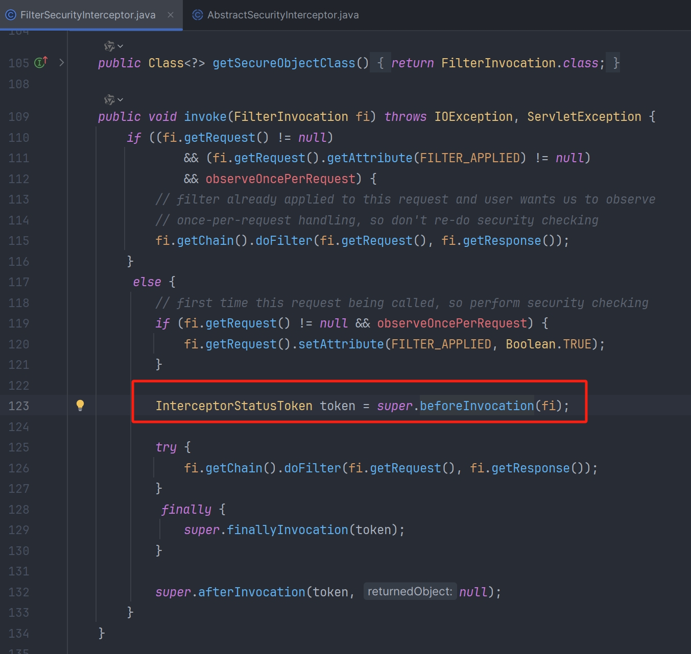
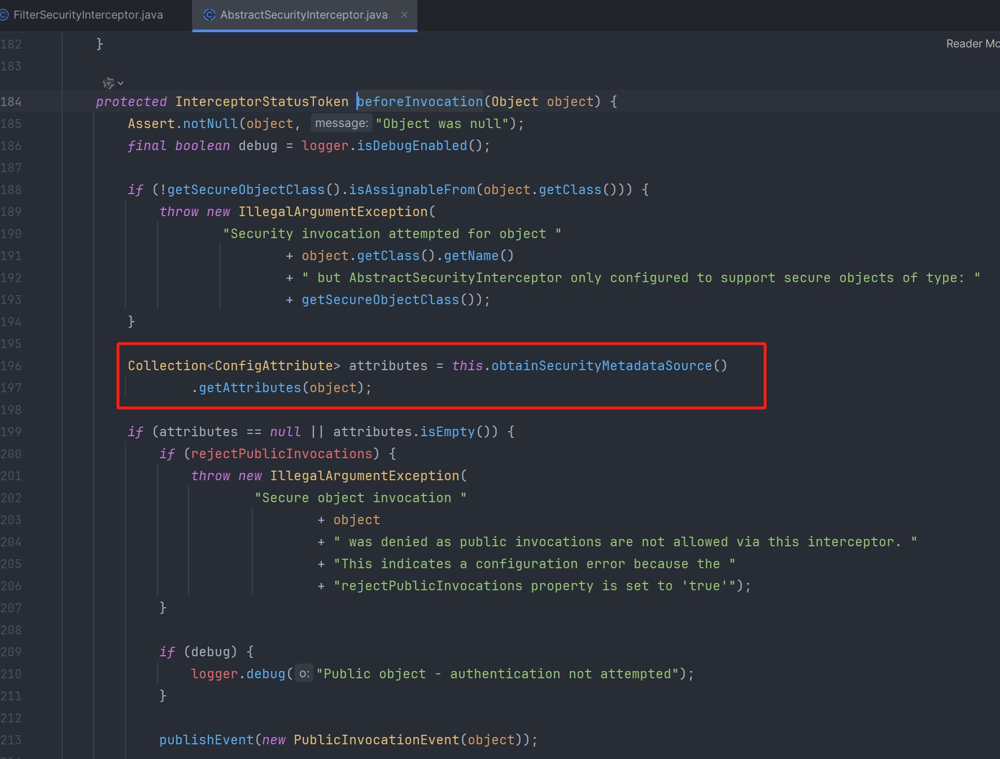
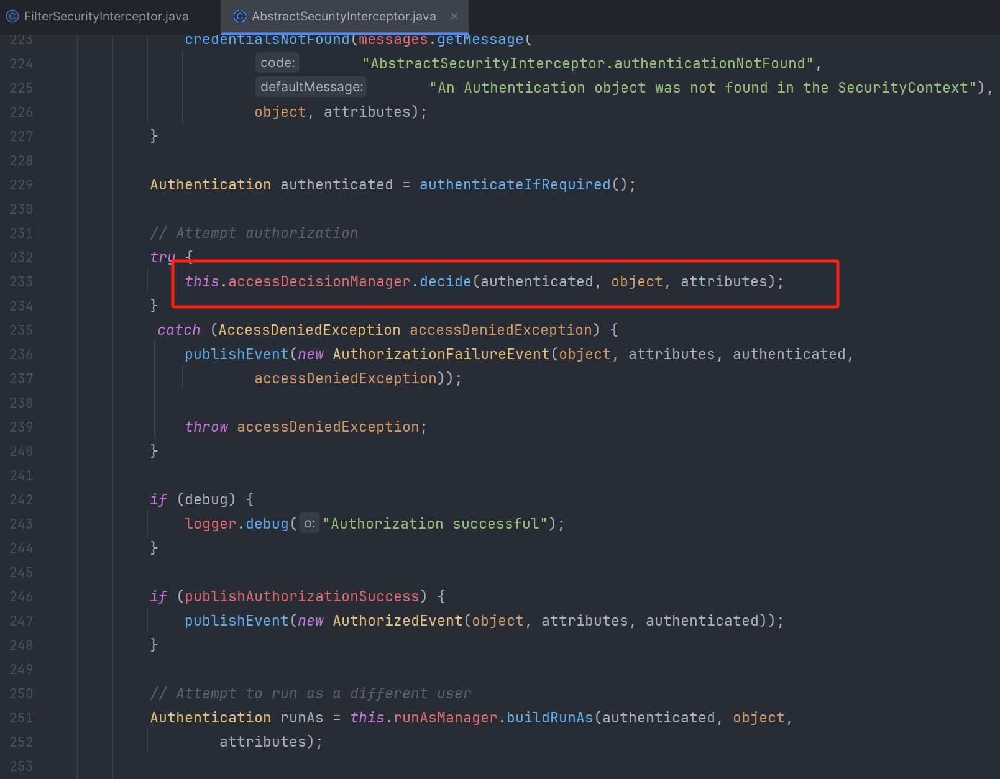

## 授权流程


 SpringSecurity 的授权流程如下：

1. 拦截请求，已认证用户访问受保护的 web 资源将被 SecurityFilterChain 中的 FilterSecurityInterceptor 的子类拦截。
2. 获取资源访问策略，FilterSecurityInterceptor 会从 SecurityMetadataSource 的子类 DefaultFilterInvocationSecurityMetadataSource 获取要访问当前资源所需要的权限 Collection \< ConfigAttribute >。SecurityMetadataSource 其实就是读取访问策略的抽象，而读取的内容其实就是我们配置的访问规则， 读取访问策略如下：

```java
http.authorizeRequests()
	.antMatchers("/r/r1").hasAuthority("p1")
	.antMatchers("/r/r2").hasAuthority("p2")
	...
```

3. FilterSecurityInterceptor 会调用 AccessDecisionManager 进行授权决策，若决策通过，则允许访问资源，否则将禁止访问







## 相关组件

### 权限资源

要实现动态的权限验证，首先要有对应的访问权限资源，Spring Security 是通过 SecurityMetadataSource 来加载访问时所需要的具体权限

```java
public interface SecurityMetadataSource extends AopInfrastructureBean {
    //根据提供的受保护对象的信息（URI），获取该 URI 配置的所有角色
    Collection<ConfigAttribute> getAttributes(Object var1) throws IllegalArgumentException;
    
    //获取全部角色，如果返回了所有定义的权限资源，Spring Security 会在启动时
    //校验每个 ConfigAttribute 是否配置正确，不需要校验直接返回 null
    Collection<ConfigAttribute> getAllConfigAttributes();
    
    //对特定的安全对象是否提供 ConfigAttribute 支持
    //web 项目一般使用 FilterInvocation 来判断，或者直接返回 true
    boolean supports(Class<?> var1);
}
```

SecurityMetadataSource 是一个接口，同时还有一个接口 FilterInvocationSecurityMetadataSource 继承于它，但其只是一个标识接口，对应于 FilterInvocation，本身并无任何内容

```java
public interface FilterInvocationSecurityMetadataSource extends SecurityMetadataSource {
}
```

### 权限决策管理器

有了权限资源，知道了当前访问的 url 需要的具体权限，接下来就是决策当前的访问是否能通过权限验证了，AccessDecisionManager 中包含的一系列 AccessDecisionVoter 将会被用来对 Authentication 是否有权访问受保护对象进行投票，AccessDecisionManager 根据投票结果做出最终决策

```java
public interface AccessDecisionManager {
    // 决策主要通过其持有的 AccessDecisionVoter 来进行投票决策
    void decide(Authentication authentication, Object object, Collection<ConfigAttribute> configAttributes) throws AccessDeniedException, InsufficientAuthenticationException;
    
    // 以确定 AccessDecisionManager 是否可以处理传递的 ConfigAttribute
    boolean supports(ConfigAttribute var1);
	
    // 以确保配置的 AccessDecisionManager 支持安全拦截器将呈现的安全 object 类型。
    boolean supports(Class<?> var1);
}
```

1. authentication：要访问资源的访问者的身份
2. object：要访问的受保护资源，web 请求对应的 FilterInvocation
3. configAttributes：受保护资源的访问策略，通过 SecurityMetadataSource 获取

Spring Security 内置了三个基于投票的 AccessDecisionManager 实现类如下，它们分别是 AffirmativeBased、ConsensusBased 和 UnanimousBased

#### AffirmativeBased

基于肯定的决策器，用户持有一个同意访问的角色就能通过

1. 只要有 AccessDecisionVoter 的投票为 ACCESS_GRANTED 则同意用户进行访问；
2. 如果全部弃权也表示通过；
3. 如果没有一个人投赞成票，但是有人投反对票，则将抛出 AccessDeniedException。 Spring Security 默认使用的是 AffirmativeBased

#### ConsensusBased

基于共识的决策器，用户持有同意的角色数量多于禁止的角色数量

1. 如果赞成票多于反对票则表示通过；如果反对票多于赞成票则将抛出 AccessDeniedException
2. 如果赞成票与反对票相同且不等于 0，并且属性 allowIfEqualGrantedDeniedDecisions 的值为 true（默认为 true），则表示通过，否则将抛出异常 AccessDeniedException
3. 如果所有的 AccessDecisionVoter 都弃权了，则将视参数 allowIfAllAbstainDecisions 的值而定（默认为 false），如果该值为 true 则表示通过，否则将抛出异常 AccessDeniedException

#### UnanimousBased

基于一致的决策器，用户持有的所有角色都同意访问才能放行

1. 如果受保护对象配置的某一个 ConfigAttribute 被任意的 AccessDecisionVoter 反对了，则将抛出 AccessDeniedException。
2. 如果没有反对票，但是有赞成票，则表示通过。
3. 如果全部弃权了，则将视参数 allowIfAllAbstainDecisions 的值而定，true 则通过，false 则抛出 AccessDeniedException。

### 权限决策投票器

```java
public interface AccessDecisionVoter<S> {
    // 赞成
    int ACCESS_GRANTED = 1; 
    // 弃权
    int ACCESS_ABSTAIN = 0;
    // 否决
    int ACCESS_DENIED = -1;
    // 用于判断对于当前 ConfigAttribute 访问规则是否支持
    boolean supports(ConfigAttribute attribute);
    // 用于判断该类是否支持
    boolean supports(Class<?> clazz);
    // 如果支持的情况下，vote 方法对其进行判断投票返回对应的授权结果
    int vote(Authentication authentication, S object, Collection<ConfigAttribute> attributes);
}
```

#### WebExpressionVoter

最常用的，也是 SpringSecurity 中默认的 FilterSecurityInterceptor 实例中 AccessDecisionManager 默认的投票器，它其实就是 http.authorizeRequests()基于 Spring-EL 进行控制权限的授权决策类。

#### AuthenticatedVoter

AuthenticatedVoter 针对的是 ConfigAttribute#getAttribute() 中配置为 IS_AUTHENTICATED_FULLY 、IS_AUTHENTICATED_REMEMBERED、IS_AUTHENTICATED_ANONYMOUSLY 权限标识时的授权决策。因此，其投票策略比较简单

#### PreInvocationAuthorizationAdviceVoter

用于处理基于注解 @PreFilter 和 @PreAuthorize 生成的 PreInvocationAuthorizationAdvice，来处理授权决策的实现

#### RoleVoter

角色投票器。用于 ConfigAttribute#getAttribute() 中配置为角色的授权决策。其默认前缀为 ROLE_，可以自定义，也可以设置为空，直接使用角色标识进行判断。这就意味着，任何属性都可以使用该投票器投票，也就偏离了该投票器的本意，是不可取的。

#### RoleHierarchyVoter

基于 RoleVoter，唯一的不同就是该投票器中的角色是附带上下级关系的。也就是说，角色 A 包含角色 B，角色 B 包含 角色 C，此时，如果用户拥有角色 A，那么理论上可以同时拥有角色 B、角色 C 的全部资源访问权限.

## 自定义动态权限控制

### 实现逻辑

1. 自定义 FilterSecurityInterceptor，可仿写 FilterSecurityInterceptor，实现抽象类 AbstractSecurityInterceptor 以及 Filter 接口，其主要的是把自定义的 SecurityMetadataSource 与自定义 accessDecisionManager 配置到自定义 FilterSecurityInterceptor 的拦截器中
2. 自定义 SecurityMetadataSource，实现接口 FilterInvocationSecurityMetadataSource，实现从数据库或者其他数据源中加载 ConfigAttribute（即是从数据库或者其他数据源中加载资源权限）
3. 自定义 AccessDecisionManager，可使用基于 AccessDecisionVoter 实现权限认证的官方 UnanimousBased
4. 自定义 AccessDecisionVoter
5. 自定义 MyFilterSecurityInterceptor

+ 加载自定义的 SecurityMetadataSource 到自定义的 FilterSecurityInterceptor 中；
+ 加载自定义的 AccessDecisionManager 到自定义的 FilterSecurityInterceptor 中；
+ 重写 invoke 方法

### 基于用户的权限控制
```java
@Service
public class UmsAdminServiceImpl implements UserDetailsService {
    
    @Override
    public UserDetails loadUserByUsername(String username){
        // 数据库获取用户信息
        UmsAdmin admin = getAdminByUsername(username);
        if (admin != null) {
            // 获取用户权限
            List<UmsPermission> permissionList = getPermissionList(admin.getId());
            return new AdminUserDetails(admin,permissionList);
        }
        throw new UsernameNotFoundException("用户名或密码错误");
    }
}
```

Spring Security 把用户拥有的权限值和接口上注解定义的权限值进行比对，如果包含则可以访问，反之就不可以访问；但是这样做会带来一些问题，我们需要在每个接口上都定义好访问该接口的权限值，而且只能挨个控制接口的权限，无法批量控制

### 基于路径的动态权限控制

#### 动态权限数据源

```java
/**
 * 动态权限相关业务类
 */
public interface DynamicSecurityService {
    /**
     * 加载资源 ANT 通配符和资源对应 MAP
     */
    Map<String, ConfigAttribute> loadDataSource();
}
```

```java
@Configuration
@EnableGlobalMethodSecurity(prePostEnabled = true)
public class MallSecurityConfig {

    // 后台获取资源服务类（自定义）
    @Autowired
    private UmsResourceService resourceService;

    @Bean
    public DynamicSecurityService dynamicSecurityService() {
        return new DynamicSecurityService() {
            @Override
            public Map<String, ConfigAttribute> loadDataSource() {
                Map<String, ConfigAttribute> map = new ConcurrentHashMap<>();
                List<UmsResource> resourceList = resourceService.listAll();
                for (UmsResource resource : resourceList) {
                    map.put(resource.getUrl(), new org.springframework.security.access.SecurityConfig(resource.getName()));
                }
                return map;
            }
        };
    }
}
```

```java
/**
 * 动态权限数据源，用于获取动态权限规则
 */
public class DynamicSecurityMetadataSource implements FilterInvocationSecurityMetadataSource {
    
    private static Map<String, ConfigAttribute> configAttributeMap = null;
    @Autowired
    private DynamicSecurityService dynamicSecurityService;

    @PostConstruct
    public void loadDataSource() {
        configAttributeMap = dynamicSecurityService.loadDataSource();
    }

    public void clearDataSource() {
        configAttributeMap.clear();
        configAttributeMap = null;
    }

    @Override
    public Collection<ConfigAttribute> getAttributes(Object o) throws IllegalArgumentException {
        if (configAttributeMap == null) {
            this.loadDataSource();
        }
        List<ConfigAttribute> configAttributes = new ArrayList<>();
        //获取当前访问的路径
        String url = ((FilterInvocation) o).getRequestUrl();
        String path = URLUtil.getPath(url);
        PathMatcher pathMatcher = new AntPathMatcher();
        Iterator<String> iterator = configAttributeMap.keySet().iterator();
        //获取访问该路径所需资源
        while (iterator.hasNext()) {
            String pattern = iterator.next();
            if (pathMatcher.match(pattern, path)) {
                configAttributes.add(configAttributeMap.get(pattern));
            }
        }
        // 未设置操作请求权限，返回空集合
        return configAttributes;
    }

    @Override
    public Collection<ConfigAttribute> getAllConfigAttributes() {
        return null;
    }

    @Override
    public boolean supports(Class<?> aClass) {
        return true;
    }
}
```

流程如下：

1. 从数据库中查询出来所有的菜单，然后再过滤找到满足当前请求 URL 的，只要满足前面匹配的都需要权限控制
2. 由于我们的后台资源规则被缓存在了一个 Map 对象之中，所以当后台资源发生变化时，我们需要清空缓存的数据，然后下次查询时就会被重新加载进来，需要调用 clearDataSource 方法来清空缓存的数据
3. 之后我们需要实现 AccessDecisionManager 接口来实现权限校验，对于没有配置资源的接口我们直接允许访问，对于配置了资源的接口，我们把访问所需资源和用户拥有的资源进行比对，如果匹配则允许访问

注意：菜单权限是每次都要全量查询数据库，如果数据多的话，可能会影响性能，这里改造读取缓存，但是新增修改菜单时，记得更新缓存数据

#### 动态权限决策管理器

```java
/**
 * 动态权限决策管理器，用于判断用户是否有访问权限
 */
public class DynamicAccessDecisionManager implements AccessDecisionManager {

    @Override
    public void decide(Authentication authentication, Object object,
                       Collection<ConfigAttribute> configAttributes) throws AccessDeniedException, InsufficientAuthenticationException {
        // 当接口未被配置资源时直接放行
        if (CollUtil.isEmpty(configAttributes)) {
            return;
        }
        Iterator<ConfigAttribute> iterator = configAttributes.iterator();
        while (iterator.hasNext()) {
            ConfigAttribute configAttribute = iterator.next();
            //将访问所需资源或用户拥有资源进行比对
            String needAuthority = configAttribute.getAttribute();
            for (GrantedAuthority grantedAuthority : authentication.getAuthorities()) {
                if (needAuthority.trim().equals(grantedAuthority.getAuthority())) {
                    return;
                }
            }
        }
        throw new AccessDeniedException("抱歉，您没有访问权限");
    }

    @Override
    public boolean supports(ConfigAttribute configAttribute) {
        return true;
    }

    @Override
    public boolean supports(Class<?> aClass) {
        return true;
    }
}
```

#### JWT 登录授权

```java
/**
 * JWT 登录授权过滤器
 */
public class JwtAuthenticationTokenFilter extends OncePerRequestFilter {
    private static final Logger LOGGER = LoggerFactory.getLogger(JwtAuthenticationTokenFilter.class);
    @Autowired
    private UserDetailsService userDetailsService;
    @Autowired
    private JwtTokenUtil jwtTokenUtil;
    @Value("${jwt.tokenHeader}")
    private String tokenHeader;
    @Value("${jwt.tokenHead}")
    private String tokenHead;

    @Override
    protected void doFilterInternal(HttpServletRequest request,
                                    HttpServletResponse response,
                                    FilterChain chain) throws ServletException, IOException {
        String authHeader = request.getHeader(this.tokenHeader);
        if (authHeader != null && authHeader.startsWith(this.tokenHead)) {
            String authToken = authHeader.substring(this.tokenHead.length());// The part after "Bearer "
            String username = jwtTokenUtil.getUserNameFromToken(authToken);
            LOGGER.info("checking username:{}", username);
            if (username != null && SecurityContextHolder.getContext().getAuthentication() == null) {
                UserDetails userDetails = this.userDetailsService.loadUserByUsername(username);
                if (jwtTokenUtil.validateToken(authToken, userDetails)) {
                    UsernamePasswordAuthenticationToken authentication = new UsernamePasswordAuthenticationToken(userDetails, null, userDetails.getAuthorities());
                    authentication.setDetails(new WebAuthenticationDetailsSource().buildDetails(request));
                    LOGGER.info("authenticated user:{}", username);
                    SecurityContextHolder.getContext().setAuthentication(authentication);
                }
            }
        }
        chain.doFilter(request, response);
    }
}
```

```java
public class JwtTokenUtil {
    private static final Logger LOGGER = LoggerFactory.getLogger(JwtTokenUtil.class);
    private static final String CLAIM_KEY_USERNAME = "sub";
    private static final String CLAIM_KEY_CREATED = "created";
    @Value("${jwt.secret}")
    private String secret;
    @Value("${jwt.expiration}")
    private Long expiration;
    @Value("${jwt.tokenHead}")
    private String tokenHead;

    /**
     * 根据负责生成 JWT 的 token
     */
    private String generateToken(Map<String, Object> claims) {
        return Jwts.builder()
                .setClaims(claims)
                .setExpiration(generateExpirationDate())
                .signWith(SignatureAlgorithm.HS512, secret)
                .compact();
    }

    /**
     * 从 token 中获取 JWT 中的负载
     */
    private Claims getClaimsFromToken(String token) {
        Claims claims = null;
        try {
            claims = Jwts.parser()
                    .setSigningKey(secret)
                    .parseClaimsJws(token)
                    .getBody();
        } catch (Exception e) {
            LOGGER.info("JWT格式验证失败:{}", token);
        }
        return claims;
    }

    /**
     * 生成 token 的过期时间
     */
    private Date generateExpirationDate() {
        return new Date(System.currentTimeMillis() + expiration * 1000);
    }

    /**
     * 从 token 中获取登录用户名
     */
    public String getUserNameFromToken(String token) {
        String username;
        try {
            Claims claims = getClaimsFromToken(token);
            username = claims.getSubject();
        } catch (Exception e) {
            username = null;
        }
        return username;
    }

    /**
     * 验证 token 是否还有效
     *
     * @param token       客户端传入的 token
     * @param userDetails 从数据库中查询出来的用户信息
     */
    public boolean validateToken(String token, UserDetails userDetails) {
        String username = getUserNameFromToken(token);
        return username.equals(userDetails.getUsername()) && !isTokenExpired(token);
    }

    /**
     * 判断 token 是否已经失效
     */
    private boolean isTokenExpired(String token) {
        Date expiredDate = getExpiredDateFromToken(token);
        return expiredDate.before(new Date());
    }

    /**
     * 从 token 中获取过期时间
     */
    private Date getExpiredDateFromToken(String token) {
        Claims claims = getClaimsFromToken(token);
        return claims.getExpiration();
    }

    /**
     * 根据用户信息生成 token
     */
    public String generateToken(UserDetails userDetails) {
        Map<String, Object> claims = new HashMap<>();
        claims.put(CLAIM_KEY_USERNAME, userDetails.getUsername());
        claims.put(CLAIM_KEY_CREATED, new Date());
        return generateToken(claims);
    }

    /**
     * 当原来的 token 没过期时是可以刷新的
     *
     * @param oldToken 带 tokenHead 的 token
     */
    public String refreshHeadToken(String oldToken) {
        if(StrUtil.isEmpty(oldToken)){
            return null;
        }
        String token = oldToken.substring(tokenHead.length());
        if(StrUtil.isEmpty(token)){
            return null;
        }
        //token 校验不通过
        Claims claims = getClaimsFromToken(token);
        if(claims==null){
            return null;
        }
        //如果 token 已经过期，不支持刷新
        if(isTokenExpired(token)){
            return null;
        }
        //如果 token 在 30 分钟之内刚刷新过，返回原 token
        if(tokenRefreshJustBefore(token,30*60)){
            return token;
        }else{
            claims.put(CLAIM_KEY_CREATED, new Date());
            return generateToken(claims);
        }
    }

    /**
     * 判断 token 在指定时间内是否刚刚刷新过
     * @param token 原 token
     * @param time 指定时间（秒）
     */
    private boolean tokenRefreshJustBefore(String token, int time) {
        Claims claims = getClaimsFromToken(token);
        Date created = claims.get(CLAIM_KEY_CREATED, Date.class);
        Date refreshDate = new Date();
        //刷新时间在创建时间的指定时间内
        if(refreshDate.after(created)&&refreshDate.before(DateUtil.offsetSecond(created,time))){
            return true;
        }
        return false;
    }
}
```

#### 动态权限过滤器

```java
/**
 * 动态权限过滤器，用于实现基于路径的动态权限过滤
 */
public class DynamicSecurityFilter extends AbstractSecurityInterceptor implements Filter {

    @Autowired
    private DynamicSecurityMetadataSource dynamicSecurityMetadataSource;
    @Autowired
    private IgnoreUrlsConfig ignoreUrlsConfig;
    @Autowired
    private DynamicAccessDecisionManager dynamicAccessDecisionManager;

    @Autowired
    public void setMyAccessDecisionManager() {
        super.setAccessDecisionManager(dynamicAccessDecisionManager);
    }

    @Override
    public void init(FilterConfig filterConfig) throws ServletException {
    }

    @Override
    public void doFilter(ServletRequest servletRequest, ServletResponse servletResponse, FilterChain filterChain) throws IOException, ServletException {
        HttpServletRequest request = (HttpServletRequest) servletRequest;
        FilterInvocation fi = new FilterInvocation(servletRequest, servletResponse, filterChain);
        //OPTIONS 请求直接放行
        if(request.getMethod().equals(HttpMethod.OPTIONS.toString())){
            fi.getChain().doFilter(fi.getRequest(), fi.getResponse());
            return;
        }
        //白名单请求直接放行
        PathMatcher pathMatcher = new AntPathMatcher();
        for (String path : ignoreUrlsConfig.getUrls()) {
            if(pathMatcher.match(path,request.getRequestURI())){
                fi.getChain().doFilter(fi.getRequest(), fi.getResponse());
                return;
            }
        }
        //此处会调用 AccessDecisionManager 中的 decide 方法进行鉴权操作
        InterceptorStatusToken token = super.beforeInvocation(fi);
        try {
            fi.getChain().doFilter(fi.getRequest(), fi.getResponse());
        } finally {
            super.afterInvocation(token, null);
        }
    }

    @Override
    public void destroy() {
    }

    @Override
    public Class<?> getSecureObjectClass() {
        return FilterInvocation.class;
    }

    @Override
    public SecurityMetadataSource obtainSecurityMetadataSource() {
        return dynamicSecurityMetadataSource;
    }
}
```

#### 自定义登录处理器

```java
/**
 * 自定义返回结果：未登录或登录过期
 */
public class RestAuthenticationEntryPoint implements AuthenticationEntryPoint {
    @Override
    public void commence(HttpServletRequest request, HttpServletResponse response, AuthenticationException authException) throws IOException, ServletException {
        response.setHeader("Access-Control-Allow-Origin", "*");
        response.setHeader("Cache-Control","no-cache");
        response.setCharacterEncoding("UTF-8");
        response.setContentType("application/json");
        response.getWriter().println(JSONUtil.parse(CommonResult.unauthorized(authException.getMessage())));
        response.getWriter().flush();
    }
}
```

当前端跨域访问没有权限的接口时，会出现跨域问题，只需要在没有权限访问的处理类 RestfulAccessDeniedHandler 中添加允许跨域访问的响应头即可

```java
/**
 * 自定义返回结果：没有权限访问时
 */
public class RestfulAccessDeniedHandler implements AccessDeniedHandler{
    @Override
    public void handle(HttpServletRequest request,
                       HttpServletResponse response,
                       AccessDeniedException e) throws IOException, ServletException {
        response.setHeader("Access-Control-Allow-Origin", "*");
        response.setHeader("Cache-Control","no-cache");
        response.setCharacterEncoding("UTF-8");
        response.setContentType("application/json");
        response.getWriter().println(JSONUtil.parse(CommonResult.forbidden(e.getMessage())));
        response.getWriter().flush();
    }
}
```

#### 配置类

```java
/**
 * 用于配置白名单资源路径
 */
@Getter
@Setter
@ConfigurationProperties(prefix = "secure.ignored")
public class IgnoreUrlsConfig {

    private List<String> urls = new ArrayList<>();
}
```

```java
/**
 * SpringSecurity 通用配置
 * 包括通用 Bean、Security 通用 Bean 及动态权限通用 Bean
 */
@Configuration
public class CommonSecurityConfig {

    @Bean
    public PasswordEncoder passwordEncoder() {
        return new BCryptPasswordEncoder();
    }

    @Bean
    public IgnoreUrlsConfig ignoreUrlsConfig() {
        return new IgnoreUrlsConfig();
    }

    @Bean
    public JwtTokenUtil jwtTokenUtil() {
        return new JwtTokenUtil();
    }

    @Bean
    public RestfulAccessDeniedHandler restfulAccessDeniedHandler() {
        return new RestfulAccessDeniedHandler();
    }

    @Bean
    public RestAuthenticationEntryPoint restAuthenticationEntryPoint() {
        return new RestAuthenticationEntryPoint();
    }

    @Bean
    public JwtAuthenticationTokenFilter jwtAuthenticationTokenFilter(){
        return new JwtAuthenticationTokenFilter();
    }

    @Bean
    public DynamicAccessDecisionManager dynamicAccessDecisionManager() {
        return new DynamicAccessDecisionManager();
    }

    @Bean
    public DynamicSecurityMetadataSource dynamicSecurityMetadataSource() {
        return new DynamicSecurityMetadataSource();
    }

    @Bean
    public DynamicSecurityFilter dynamicSecurityFilter(){
        return new DynamicSecurityFilter();
    }
}
```

```java
@Configuration
public class SecurityConfig extends WebSecurityConfigurerAdapter {

    @Autowired
    private IgnoreUrlsConfig ignoreUrlsConfig;
    @Autowired
    private RestfulAccessDeniedHandler restfulAccessDeniedHandler;
    @Autowired
    private RestAuthenticationEntryPoint restAuthenticationEntryPoint;
    @Autowired
    private JwtAuthenticationTokenFilter jwtAuthenticationTokenFilter;
    @Autowired
    private DynamicSecurityService dynamicSecurityService;
    @Autowired
    private DynamicSecurityFilter dynamicSecurityFilter;

    @Override
    protected void configure(HttpSecurity httpSecurity) throws Exception {
        ExpressionUrlAuthorizationConfigurer<HttpSecurity>.ExpressionInterceptUrlRegistry registry = httpSecurity.authorizeRequests();
        // 不需要保护的资源路径允许访问
        for (String url : ignoreUrlsConfig().getUrls()) {
            registry.antMatchers(url).permitAll();
        }
        // 允许跨域的 OPTIONS 请求
        registry.antMatchers(HttpMethod.OPTIONS)
                .permitAll();
        // 其他任何请求都需要身份认证
        registry.and()
                .authorizeRequests()
                .anyRequest()
                .authenticated()
                // 关闭跨站请求防护及不使用 session
                .and()
                .csrf()
                .disable()
                .sessionManagement()
                .sessionCreationPolicy(SessionCreationPolicy.STATELESS)
                // 自定义权限拒绝处理类
                .and()
                .exceptionHandling()
                .accessDeniedHandler(restfulAccessDeniedHandler)
                .authenticationEntryPoint(restAuthenticationEntryPoint)
                // 自定义权限拦截器 JWT 过滤器
                .and()
                .addFilterBefore(jwtAuthenticationTokenFilter, UsernamePasswordAuthenticationFilter.class);
        //有动态权限配置时添加动态权限校验过滤器
        if(dynamicSecurityService!=null){
            registry.and().addFilterBefore(dynamicSecurityFilter, FilterSecurityInterceptor.class);
        }
    }
}
```

