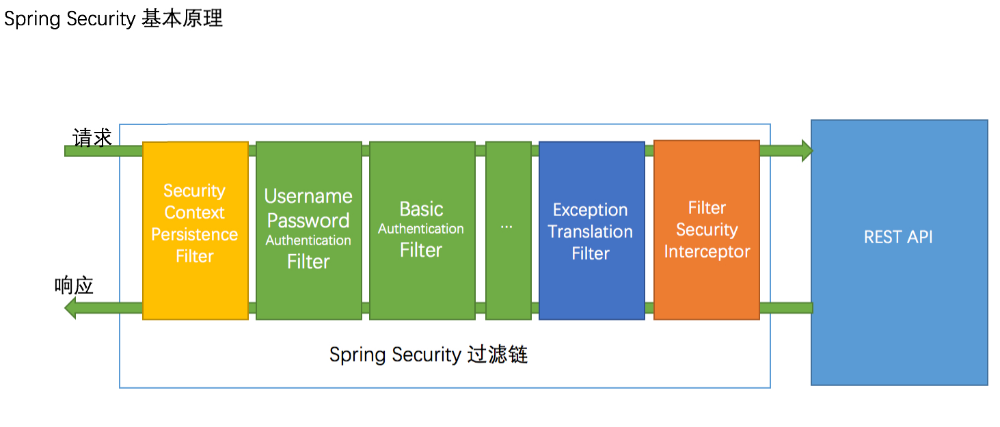
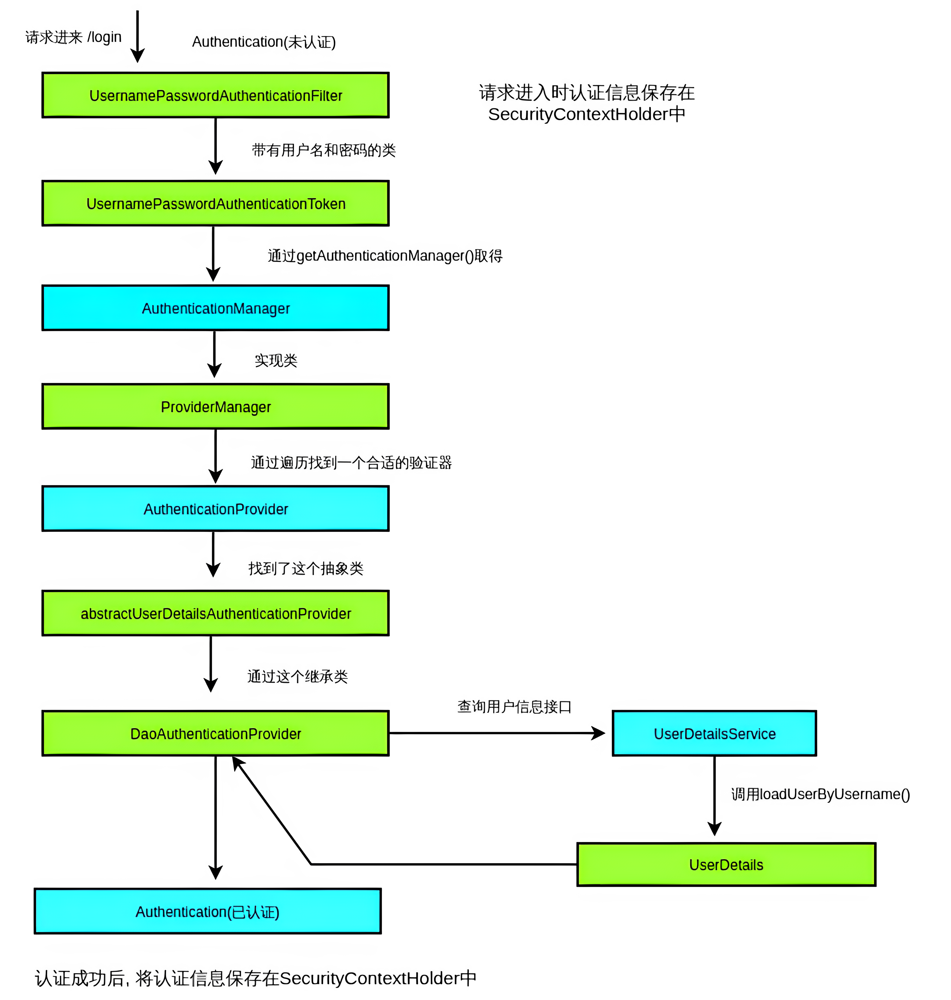

## SecurityContextHolder
SecurityContextHolder 持有的是安全上下文的信息，当前操作的用户是谁，用户是否已经被认证，他拥有哪些角色权限等，这些都被保存在 SecurityContextHolder 中。SecurityContextHolder 默认使用 ThreadLocal 策略来存储认证信息，在 web 环境下，SpringSecurity 在用户登录时自动绑定认证信息到当前线程，在用户退出时，自动清除当前线程的认证信息

```java
public class SecurityContextHolder {

    // 三种工作模式的定义，每种工作模式对应一种策略
    public static final String MODE_THREADLOCAL = "MODE_THREADLOCAL";
    public static final String MODE_INHERITABLETHREADLOCAL = "MODE_INHERITABLETHREADLOCAL";
    public static final String MODE_GLOBAL = "MODE_GLOBAL";

    // 类加载时首先尝试从环境属性中获取所指定的工作模式
    public static final String SYSTEM_PROPERTY = "spring.security.strategy";	
    private static String strategyName = System.getProperty(SYSTEM_PROPERTY);
    private static SecurityContextHolderStrategy strategy;

    // 初始化计数器, 初始为 0,
    // 1. 类加载过程中会被初始化一次，此值变为 1
    // 2. 此后每次调用 setStrategyName 会对新的策略对象执行一次初始化，相应的该值会增 1
    private static int initializeCount = 0;

    static {
        initialize();
    }

    /**
     * 清除上下文
     */
    public static void clearContext() {
        strategy.clearContext();
    }

    /**
     * 获取上下文
     */
    public static SecurityContext getContext() {
        return strategy.getContext();
    }

    /**
     * 获取计数器的值
     */
    public static int getInitializeCount() {
        return initializeCount;
    }

    private static void initialize() {
        if (!StringUtils.hasText(strategyName)) {
            // Set default, 设置缺省工作模式/策略 MODE_THREADLOCAL
            strategyName = MODE_THREADLOCAL;
        }

        if (strategyName.equals(MODE_THREADLOCAL)) {
            strategy = new ThreadLocalSecurityContextHolderStrategy();
        } else if (strategyName.equals(MODE_INHERITABLETHREADLOCAL)) {
            strategy = new InheritableThreadLocalSecurityContextHolderStrategy();
        } else if (strategyName.equals(MODE_GLOBAL)) {
            strategy = new GlobalSecurityContextHolderStrategy();
        } else {
            // Try to load a custom strategy
            try {
                Class<?> clazz = Class.forName(strategyName);
                Constructor<?> customStrategy = clazz.getConstructor();
                strategy = (SecurityContextHolderStrategy) customStrategy.newInstance();
            }
            catch (Exception ex) {
                ReflectionUtils.handleReflectionException(ex);
            }
        }
        initializeCount++;
    }

    /**
     * 设置上下文
     */
    public static void setContext(SecurityContext context) {
        strategy.setContext(context);
    }

    /**
     * 设置工作模式
     */
    public static void setStrategyName(String strategyName) {
        SecurityContextHolder.strategyName = strategyName;
        initialize();
    }

    /**
     * 获取对应工作模式的策略
     */
    public static SecurityContextHolderStrategy getContextHolderStrategy() {
        return strategy;
    }

    /**
     * 创建空的上下文信息
     */
    public static SecurityContext createEmptyContext() {
        return strategy.createEmptyContext();
    }

    public String toString() {
        return "SecurityContextHolder[strategy='" + strategyName + "'; initializeCount="
                + initializeCount + "]";
    }
}
```

## SecurityContext
安全上下文，主要持有 Authentication 对象，如果用户未鉴权，那么 Authentication 对象将会是空的

```java
public interface SecurityContext extends Serializable {
    /**
     * 获取当前经过身份验证的主体，或身份验证请求令牌
     */
    Authentication getAuthentication();

    /**
     * 更改当前经过身份验证的主体，或删除身份验证信息
     */
    void setAuthentication(Authentication authentication);
}
```

## Authentication
鉴权对象，该对象主要包含了用户的详细信息（UserDetails）和用户鉴权所需要的信息，如用户提交的用户名密码、Remember-me Token 或 digest hash 值等，按不同鉴权方式使用不同的 Authentication 实现

```java
public interface Authentication extends Principal, Serializable {
    //用来获取用户的权限。
    Collection<? extends GrantedAuthority> getAuthorities();
    //用来获取用户凭证，一般来说就是密码。
    Object getCredentials();
    //用来获取用户携带的详细信息，可能是当前请求之类的东西。
    Object getDetails();
    //用来获取当前用户，可能是一个用户名，也可能是一个用户对象。
    Object getPrincipal();
    //判断当前用户是否认证成功。
    boolean isAuthenticated();
	//设置用户是否认证成功
    void setAuthenticated(boolean var1) throws IllegalArgumentException;
}
```

## GrantedAuthority
表示了当前用户所拥有的权限（或角色）信息，这些信息由授权负责对象 AccessDecisionManager 来使用，并决定最终用户是否可以访问某资源（URL 或方法调用或域对象），鉴权使并不会使用到该对象

```java
public interface GrantedAuthority extends Serializable {
    //获取当前用户所拥有的权限（或角色）信息
    String getAuthority();
}
```

## UserDetailsService
提供一个接口 loadUserByUsername(String username)，一般通过扩展该接口显式获取我们的用户信息，用户登陆时传递的用户名和密码也是通过这里查找出来的用户名和密码进行校验，真正的校验由 AuthenticationManager 和 AuthenticationProvider 负责的。如果用户不存在时应返回 NULL，而是抛出异常 UsernameNotFoundException

```java
public interface UserDetailsService {
    UserDetails loadUserByUsername(String var1) throws UsernameNotFoundException;
}
```

## UserDetails
规范了用户详细信息所拥有的字段，如用户名、密码、账号是否过期、是否锁定等，在 SpringSecurity 中，获取当前登录的用户的信息，一般情况是需要在该接口上面进行扩展

```java
public interface UserDetails extends Serializable {
    // 返回权限集合
    Collection<? extends GrantedAuthority> getAuthorities();
    // 获取密码
    String getPassword();
    // 获取用户名
    String getUsername();
    // 判断用户是否未过期
    boolean isAccountNonExpired();
    // 判断账户是否未锁定
    boolean isAccountNonLocked();
    // 判断用户凭证是否没过期，即密码是否未过期
    boolean isCredentialsNonExpired();
    // 判断用户是否可用
    boolean isEnabled();
}
```

## 获取用户信息

```java
// 获取安全上下文对象，就是那个保存在 ThreadLocal 里面的安全上下文对象
// 总是不为 null(如果不存在，则创建一个 authentication 属性为 null 的 empty 安全上下文对象)
SecurityContext securityContext = SecurityContextHolder.getContext();

// 获取当前认证了的 principal(当事人), 或者 request token (令牌)
// 如果没有认证，会是 null, 该例子是认证之后的情况
Authentication authentication = securityContext.getAuthentication()

// 获取当事人信息对象，返回结果是 Object 类型，但实际上可以是应用程序自定义的带有更多应用相关信息的某个类型。
// 很多情况下，该对象是 Spring Security 核心接口 UserDetails 的一个实现类，你可以把 UserDetails 想像
// 成我们数据库中保存的一个用户信息到 SecurityContextHolder 中 Spring Security 需要的用户信息格式的
// 一个适配器。
Object principal = authentication.getPrincipal();
if (principal instanceof UserDetails) {
	String username = ((UserDetails)principal).getUsername();
} else {
	String username = principal.toString();
}
```

## 安全身份认证流程

### 过滤器链


当初始化 Spring Security 时，在 org.springframework.security.config.annotation.web.configuration.WebSecurityConfiguration 中会往 Spring 容器中注入一个名为 SpringSecurityFilterChain 的 Servlet 过滤器，类型为 org.springframework.security.web.FilterChainProxy。它实现了 javax.servlet.Filter，因此外部的请求都会经过这个类，而 FilterChainProxy 是一个代理，真正起作用的是 FilterChainProxy 中 SecurityFilterChain 所包含的各个 Filter

1. SecurityContextPersistenceFilter

这个 Filter 是整个拦截过程的入口和出口（也就是第一个和最后一个拦截器），会在请求开始时从配置好的 SecurityContextRepository 中获取 SecurityContext，然后把它设置给 SecurityContextHolder。在请求完成后将 SecurityContextHolder 持有的 SecurityContext 再保存到配置好的 SecurityContextRepository，同时清除 securityContextHolder 所持有的 SecurityContext

2. UsernamePasswordAuthenticationFilter

用于处理来自表单提交的认证。该表单必须提供对应的用户名和密码，其内部还有登录成功或失败后进行处理的 AuthenticationSuccessHandler 和 AuthenticationFailureHandler，这些都可以根据需求做相关改变

3. FilterSecurityInterceptor

是用于保护 web 资源的，使用 AccessDecisionManager 对当前用户进行授权访问

4. ExceptionTranslationFilter

能够捕获来自 FilterChain 所有的异常，并进行处理。但是它只会处理两类异常：AuthenticationException 和 AccessDeniedException，其它的异常它会继续抛出

### 认证流程




1. Spring Security 定义了一个过滤器链，当认证请求到达这个链时，该请求将会穿过这个链条用于认证和授权，这个链上可以定义 1~N 个过滤器，过滤器的用途是获取请求中的认证信息，根据认证方法进行路由，把认证信息传递给对应的认证处理程序进行处理，不同的过滤器处理不同的认证信息
+ HTTP Basic 认证通过过滤器链，到达 BasicAuthenticationFilter
+ HTTP Digest 认证被 DigestAuthenticationFilter 识别，拦截并处理
+ 表单登录认证被 UsernamePasswordAuthenticationFilter 识别，拦截并处理
2. 基于用户凭证创建 AuthenticationToken

如：用户在登录表单中输入用户名和密码，并点击确定，浏览器提交 POST 请求到服务器，穿过过滤器链，被 UsernamePasswordAuthenticationFilter 识别，UsernamePasswordAuthenticationFilter 提取请求中的用户名和密码来创建 UsernamePasswordAuthenticationToken 对象

3. 把组装好的 AuthenticationToken 传递给 AuthenticationManager

如：组装好的 UsernamePasswordAuthenticationToken 对象被传递给 AuthenticationManager 的 authenticate 方法进行认证决策，AuthenticationManager 只是一个接口，实际的实现是 ProviderManager

4. ProviderManager 委托给 AuthenticationProvider 进行认证处理

AuthenticationProvider 提供了不同的实现类，ProviderManager 会把收到的 UsernamePasswordAuthenticationToken 对象传递给列表中的每一个 AuthenticationProvider 进行认证，那 UsernamePasswordAuthenticationToken 会被哪一个接收和处理呢？是由 supports 方法来决定的

5. UserDetailsService 获取用户信息

例如：DaoAuthenticationProvider 通过 UserDetailsService 查找对应的用户信息

6. 认证结果处理

例如：如果认证成功（用户名和密码完全正确），AuthenticationProvider 将会返回一个完全有效的 Authentication 对象（UsernamePasswordAuthenticationToken），否则抛出 AuthenticationException 异常

认证完成后，AuthenticationManager 将会返回该认证对象（UsernamePasswordAuthenticationToken）返回给过滤器

7. 存储认证对象

相关的过滤器获得一个认证对象后，把他存储在安全上下文中（SecurityContext）用于后续的授权判断

