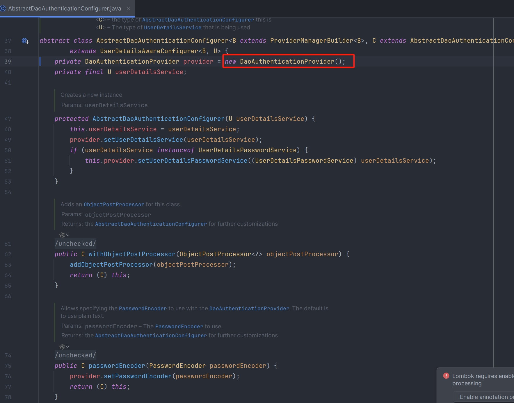
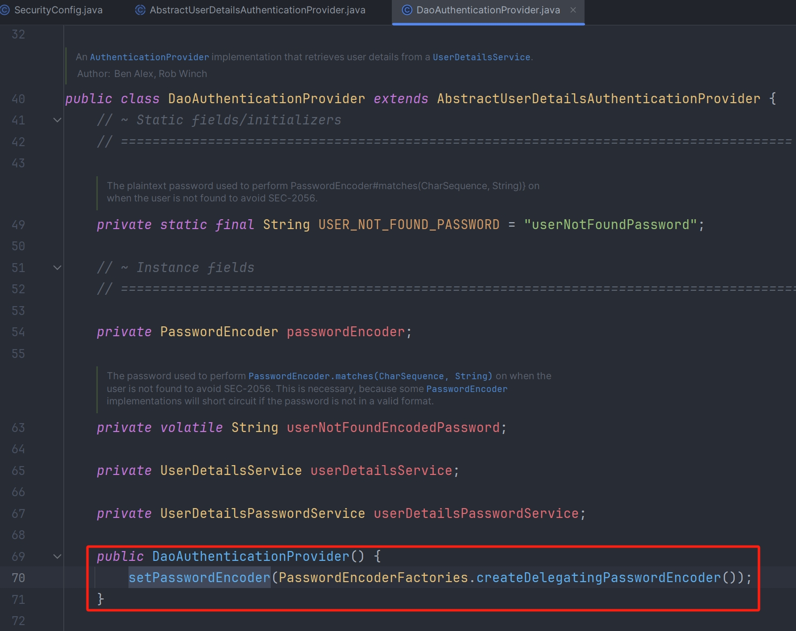
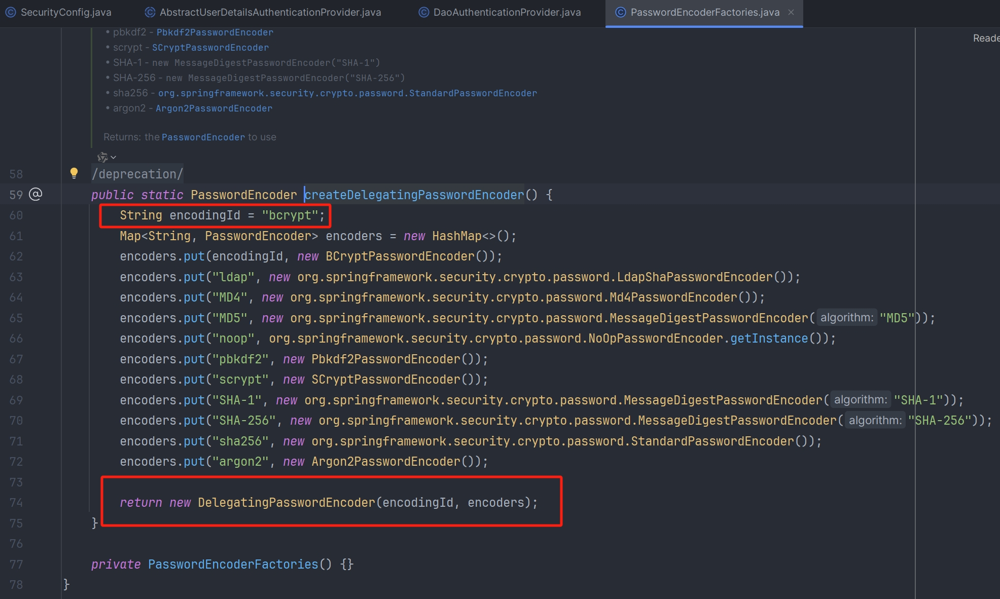
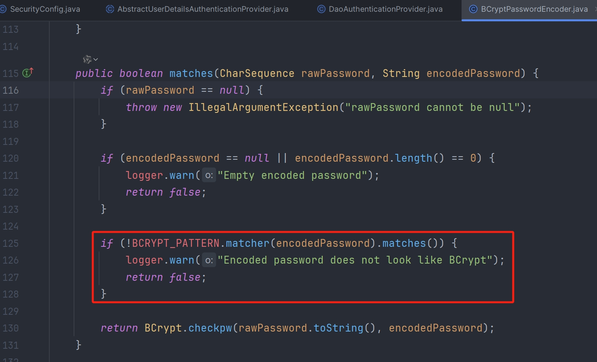

## 配置文件自定义用户名和密码

```yaml
spring:
  security:
    user:
      name: root    #通过配置文件，设置静态用户名
      password: root    #配置文件，设置静态登录密码
```

### SecurityProperties

```java
@ConfigurationProperties(prefix = "spring.security")
public class SecurityProperties {

    public static final int BASIC_AUTH_ORDER = Ordered.LOWEST_PRECEDENCE - 5;

    public static final int IGNORED_ORDER = Ordered.HIGHEST_PRECEDENCE;

    public static final int DEFAULT_FILTER_ORDER = OrderedFilter.REQUEST_WRAPPER_FILTER_MAX_ORDER - 100;

    private final Filter filter = new Filter();

    private User user = new User();

    public User getUser() {
        return this.user;
    }

    public Filter getFilter() {
        return this.filter;
    }

    public static class Filter {

        private int order = DEFAULT_FILTER_ORDER;

        private Set<DispatcherType> dispatcherTypes = new HashSet<>(
                Arrays.asList(DispatcherType.ASYNC, DispatcherType.ERROR, DispatcherType.REQUEST));

        public int getOrder() {
            return this.order;
        }

        public void setOrder(int order) {
            this.order = order;
        }

        public Set<DispatcherType> getDispatcherTypes() {
            return this.dispatcherTypes;
        }

        public void setDispatcherTypes(Set<DispatcherType> dispatcherTypes) {
            this.dispatcherTypes = dispatcherTypes;
        }
    }

    public static class User {

        private String name = "user";

        private String password = UUID.randomUUID().toString();

        private List<String> roles = new ArrayList<>();

        private boolean passwordGenerated = true;

        public String getName() {
            return this.name;
        }

        public void setName(String name) {
            this.name = name;
        }

        public String getPassword() {
            return this.password;
        }

        public void setPassword(String password) {
            if (!StringUtils.hasLength(password)) {
                return;
            }
            this.passwordGenerated = false;
            this.password = password;
        }

        public List<String> getRoles() {
            return this.roles;
        }

        public void setRoles(List<String> roles) {
            this.roles = new ArrayList<>(roles);
        }

        public boolean isPasswordGenerated() {
            return this.passwordGenerated;
        }
    }
}
```

SecuityProperties 会获取配置文件中的信息，UserDetailsServiceAutoConfiguration 在自动装配时获取 SecuityProperties 的属性信息

### UserDetailsServiceAutoConfiguration

```java
@Configuration(proxyBeanMethods = false)
@ConditionalOnClass(AuthenticationManager.class)
@ConditionalOnBean(ObjectPostProcessor.class)
@ConditionalOnMissingBean(
    value = { AuthenticationManager.class, AuthenticationProvider.class, UserDetailsService.class },
    type = { "org.springframework.security.oauth2.jwt.JwtDecoder", "org.springframework.security.oauth2.server.resource.introspection.OpaqueTokenIntrospector" })
public class UserDetailsServiceAutoConfiguration {

    private static final String NOOP_PASSWORD_PREFIX = "{noop}";

    private static final Pattern PASSWORD_ALGORITHM_PATTERN = Pattern.compile("^\\{.+}.*$");

    private static final Log logger = LogFactory.getLog(UserDetailsServiceAutoConfiguration.class);

    @Bean
    @ConditionalOnMissingBean(
            type = "org.springframework.security.oauth2.client.registration.ClientRegistrationRepository")
    @Lazy
    public InMemoryUserDetailsManager inMemoryUserDetailsManager(SecurityProperties properties,
            ObjectProvider<PasswordEncoder> passwordEncoder) {
        SecurityProperties.User user = properties.getUser();
        List<String> roles = user.getRoles();
        return new InMemoryUserDetailsManager(
                User.withUsername(user.getName()).password(getOrDeducePassword(user, passwordEncoder.getIfAvailable()))
                        .roles(StringUtils.toStringArray(roles)).build());
    }

    private String getOrDeducePassword(SecurityProperties.User user, PasswordEncoder encoder) {
        String password = user.getPassword();
        if (user.isPasswordGenerated()) {
            logger.info(String.format("%n%nUsing generated security password: %s%n", user.getPassword()));
        }	
        if (encoder != null || PASSWORD_ALGORITHM_PATTERN.matcher(password).matches()) {
            return password;
        }
        return NOOP_PASSWORD_PREFIX + password;
    }
}
```

当容器中没有 AuthenticationManager、AuthenticationProvider、UserDetailsService 对应的实例类，且没有 org.springframework.security.oauth2.client.registration.ClientRegistrationRepository 时，会实例化 InMemoryUserDetailsManager 从而获取 SecurityProperties 的配置信息，加载用户信息在内存中

## 基于内存存储认证信息

1. 在 Spring Security 5.0 版本前，加密的 PasswordEncoder 接口默认实现类为 NoOpPasswordEncoder ，这个是可以不用加密的，直接使用明文密码存储。当前已经标注过时了。
2. 在 Spring Security 5.0 版本后 ，默认实现类改为了 DelegatingPasswordEncoder，这个实现类要求我们必须对加密后存储，如果不加密处理则会报错。

### 基本使用

```java
@Configuration
@Slf4j
public class WebSecurityConfig extends WebSecurityConfigurerAdapter {

    /**
     * 密码编码器，密码不能明文存储
     */
    @Bean
    public PasswordEncoder passwordEncoder() {
        // 设置默认的加密方式，使用 BCryptPasswordEncoder 密码编码器，
        // 该编码器会将随机产生的 salt 混入最终生成的密文中
        return new BCryptPasswordEncoder();
    }
    
    /**
     * 定制基于 HTTP 请求的用户访问控制
     */
    @Override
    protected void configure(HttpSecurity http) throws Exception {
        /**
         * fromLogin()：表单认证
         * httpBasic()：弹出框认证
         * authorizeRequests()：身份认证请求
         * anyRequest()：所有请求
         * authenticated()：身份认证
         */
        http.httpBasic()
                .and()
                .authorizeRequests()
                // 其它任何请求访问都需要先通过认证
                .anyRequest()
                .authenticated();
    }

    /**
    * 认证管理器：
    * 1、认证信息提供方式（用户名、密码、当前用户的资源权限）
    * 2、可采用内存存储方式，也可能采用数据库方式等
    */
    @Override
    protected void configure(AuthenticationManagerBuilder auth) throws Exception {
        // 用户信息存储在内存中
        String password = passwordEncoder().encode("1234");
        log.info("加密之后存储的密码：" + password);
        auth.inMemoryAuthentication()
            .withUser("admin")
            .password(password)
            .authorities("ADMIN");
    }
    
    /**
     * 定制一些全局性的安全配置，例如：不拦截静态资源的访问
     */
    @Override
    public void configure(WebSecurity web) throws Exception {
        // 静态资源的访问不需要拦截，直接放行
        web.ignoring().antMatchers("/**/*.css", "/**/*.js", "/**/*.png", "/**/*.jpg", "/**/*.jpeg");
    }
}
```

### 加密处理分析









## UserDetailsService 自定义登录请求

在实际开发中，Spring Security 应该动态的从数据库中获取信息进行自定义身份认证，采用数据库方式进行身份认证一般需要实现两个核心接口 UserDetailsService 和 UserDetails

### UserDetailService 接口

该接口只有一个方法 loadUserByUsername()，用于定义从数据库中获取指定用户信息的逻辑。如果未获取到用户信息，则需要手动抛出 UsernameNotFoundException 异常；如果获取到用户信息，则将该用户信息封装到 UserDetails 接口的实现类中并返回

```java
public interface UserDetailsService {
    // 输入参数 username 是前端传入的用户名
    UserDetails loadUserByUsername(String username) throws UsernameNotFoundException;
}
```

### UserDetails 接口

UserDetails 接口定义了用于描述用户信息的方法

```java
public interface UserDetails extends Serializable {
    // 返回用户权限集合
    Collection<? extends GrantedAuthority> getAuthorities();

    // 返回用户的密码
    String getPassword();

    // 返回用户的用户名
    String getUsername();

    // 账户是否未过期（true 未过期, false 过期）
    boolean isAccountNonExpired();

    // 账户是否未锁定（true 未锁定, false 锁定）
    // 用户账户可能会被封锁，达到一定要求可恢复
    boolean isAccountNonLocked();

    // 密码是否未过期（true 未过期, false 过期）
    // 一些安全级别高的系统，可能要求 30 天更换一次密码
    boolean isCredentialsNonExpired();

    // 账户是否可用（true 可用, false 不可用）
    // 系统一般不会真正的删除用户信息，而是假删除，通过一个状态码标志用户是否被删除
    boolean isEnabled();
}
```

### 用户登录逻辑处理

```java
@Slf4j
@Component
public class UserDetailServiceImpl implements UserDetailsService {

    /**
     * Spring Security 接收 login 请求调用 UserDetailService 这个接口中的 loadUserByUsername
     * loadUserByUsername 根据传进来的用户名进行校验工作，
     * 最后将查询到的用户信息封装到 UserDetails 这个接口的实现类中
     */
    @Override
    public UserDetails loadUserByUsername(String s) throws UsernameNotFoundException {
        log.info("登录用户名：{}",s);
        //根据用户名查询用户数据
        return new User(s,"123456", AuthorityUtils.commaSeparatedStringToAuthorityList("admin"));
    }
}
```

在使用了 Spring Security5.x 版本，需要手动提供一个 PasswordEncoder 实现类，进行密码校验，PasswordEncoder 是 SpringSecurity 的密码解析器，用户密码校验、加密，自定义登录逻辑时要求必须给容器注入 PasswordEncoder 的 bean 对象

```java
@Component
public class PasswordEncoderImpl implements PasswordEncoder {

    @Override
    public String encode(CharSequence charSequence) {
        return charSequence.toString();
    }

    @Override
    public boolean matches(CharSequence charSequence, String s) {
        return s.equals(charSequence.toString());
    }
}
```

```java
@Configuration
@Slf4j
public class WebSecurityConfig extends WebSecurityConfigurerAdapter {

    @Resource
    private PasswordEncoder passwordEncoder;
    @Resource
    private UserDetailsService userDetailsService;
    
    /**
     * 定制基于 HTTP 请求的用户访问控制
     */
    @Override
    protected void configure(HttpSecurity http) throws Exception {
        /**
         * fromLogin()：表单认证
         * httpBasic()：弹出框认证
         * authorizeRequests()：身份认证请求
         * anyRequest()：所有请求
         * authenticated()：身份认证
         */
        http.httpBasic()
                .and()
                .authorizeRequests()
            	// 其它任何请求访问都需要先通过认证
                .anyRequest()
                .authenticated();
    }

    /**
    * 认证管理器：
    * 1、认证信息提供方式（用户名、密码、当前用户的资源权限）
    * 2、可采用内存存储方式，也可能采用数据库方式等
    */
    @Override
    protected void configure(AuthenticationManagerBuilder auth) throws Exception {
        // 不再使用内存方式存储用户认证信息，而是动态从数据库中获取
        auth.userDetailsService(userDetailsService).passwordEncoder(passwordEncoder);
    }
    
    /**
     * 定制一些全局性的安全配置，例如：不拦截静态资源的访问
     */
    @Override
    public void configure(WebSecurity web) throws Exception {
        // 静态资源的访问不需要拦截，直接放行
        web.ignoring().antMatchers("/**/*.css", "/**/*.js", "/**/*.png", "/**/*.jpg", "/**/*.jpeg");
    }
}
```

**注意**

上面自定义的密码解析器密码加密后与原来的一致，如果使用其他的密码解析器密码加密后与原来的不一致时，采用以下方式：

```java
/**
 * 密码编码器，密码不能明文存储
 */
@Bean
public BCryptPasswordEncoder passwordEncoder() {
    // 使用 BCryptPasswordEncoder 密码编码器，该编码器会将随机产生的 salt 混入最终生成的密文中
    return new BCryptPasswordEncoder();
}


@Override
protected void configure(AuthenticationManagerBuilder auth) throws Exception {
    auth.userDetailsService(userDetailService).passwordEncoder(passwordEncoder());
}
```

```java
@Slf4j
@Component
public class UserDetailServiceImpl implements UserDetailsService {

    @Resource
    private PasswordEncoder passwordEncoder;

    /**
     * Spring Security 接收 login 请求调用 UserDetailService 这个接口中的 loadUserByUsername
     * loadUserByUsername 根据传进来的用户名进行校验工作，
     * 最后将查询到的用户信息封装到 UserDetails 这个接口的实现类中
     */
    @Override
    public UserDetails loadUserByUsername(String s) throws UsernameNotFoundException {
        log.info("登录用户名：{}",s);
        //根据用户名查询用户数据
        return new User(s, passwordEncoder.encode("123456"), AuthorityUtils.commaSeparatedStringToAuthorityList("admin"));
    }
}
```

## 自定义返回 UserDetails 信息

```java
public class AccountUser implements UserDetails {

    private Long userId;

    private static final long serialVersionUID = 540L;
    private static final Log logger = LogFactory.getLog(User.class);
    private String password;
    private final String username;
    private final Collection<? extends GrantedAuthority> authorities;
    private final boolean accountNonExpired;
    private final boolean accountNonLocked;
    private final boolean credentialsNonExpired;
    private final boolean enabled;

    public AccountUser(Long userId, String username, String password, Collection<? extends GrantedAuthority> authorities) {
        this(userId, username, password, true, true, true, true, authorities);
    }

    public AccountUser(Long userId, String username, String password, boolean enabled, boolean accountNonExpired, boolean credentialsNonExpired, boolean accountNonLocked, Collection<? extends GrantedAuthority> authorities) {
        Assert.isTrue(username != null && !"".equals(username) && password != null, "Cannot pass null or empty values to constructor");
        this.userId = userId;
        this.username = username;
        this.password = password;
        this.enabled = enabled;
        this.accountNonExpired = accountNonExpired;
        this.credentialsNonExpired = credentialsNonExpired;
        this.accountNonLocked = accountNonLocked;
        this.authorities = authorities;
    }

    @Override
    public Collection<? extends GrantedAuthority> getAuthorities() {
        return this.authorities;
    }

    @Override
    public String getPassword() {
        return this.password;
    }

    @Override
    public String getUsername() {
        return this.username;
    }

    @Override
    public boolean isAccountNonExpired() {
        return this.accountNonExpired;
    }

    @Override
    public boolean isAccountNonLocked() {
        return this.accountNonLocked;
    }

    @Override
    public boolean isCredentialsNonExpired() {
        return this.credentialsNonExpired;
    }

    @Override
    public boolean isEnabled() {
        return this.enabled;
    }
}
```

```java
@Component
public class UserDetailServiceImpl implements UserDetailsService {

    @Resource
    private PasswordEncoder passwordEncoder;

    @Override
    public UserDetails loadUserByUsername(String username) throws UsernameNotFoundException {
        if ("admin".equals(username)) {
            return new AccountUser(12L, "admin", passwordEncoder.encode("123"), AuthorityUtils.NO_AUTHORITIES);
        }
        return null;
    }
}
```

```java
@Configuration
public class SecurityConfig extends WebSecurityConfigurerAdapter {

    @Resource
    private UserDetailServiceImpl userDetailService;

    @Override
    protected void configure(HttpSecurity http) throws Exception {
        http.formLogin()
                .and()
                .authorizeRequests()
                .anyRequest()
                .authenticated();
    }

    @Override
    protected void configure(AuthenticationManagerBuilder auth) throws Exception {
        auth.userDetailsService(userDetailService);
    }

    @Bean
    public PasswordEncoder passwordEncoder() {
        return new BCryptPasswordEncoder();
    }
}
```
