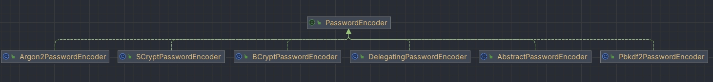
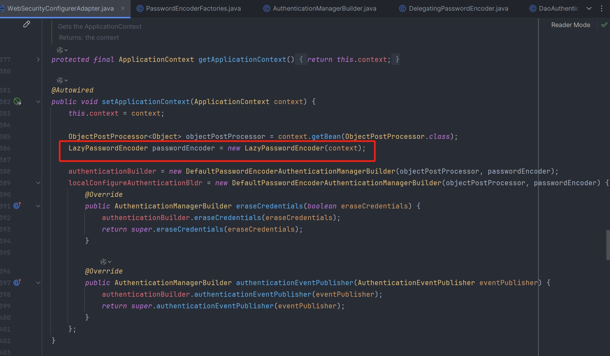
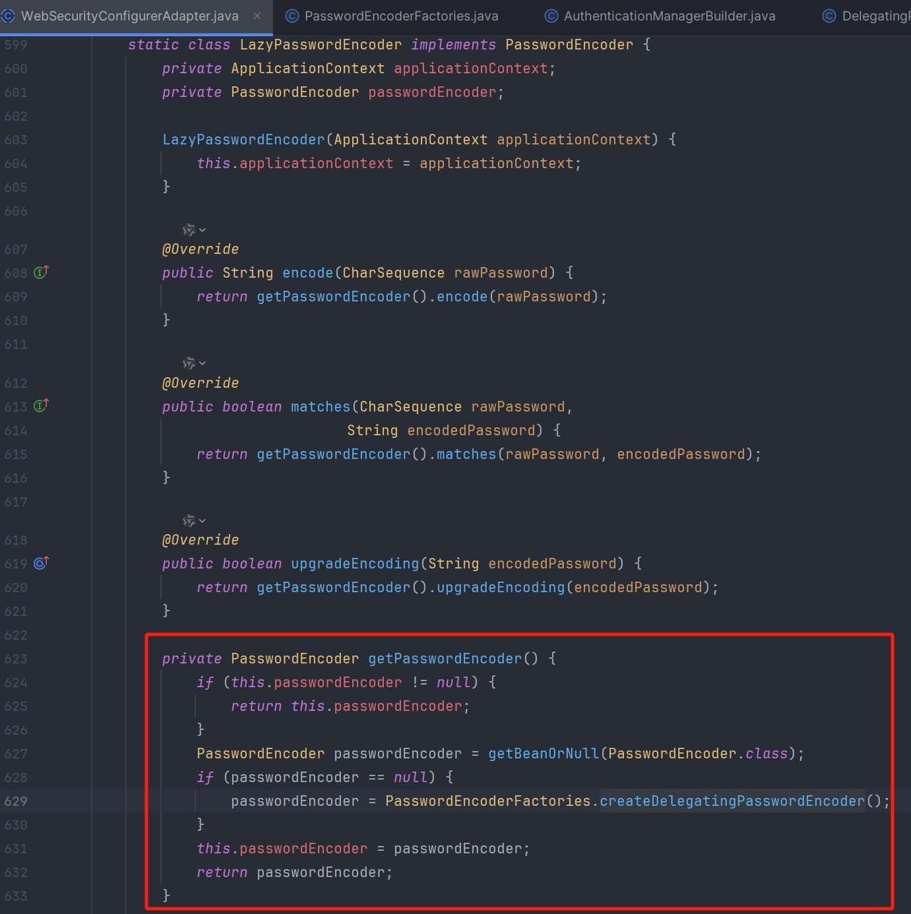
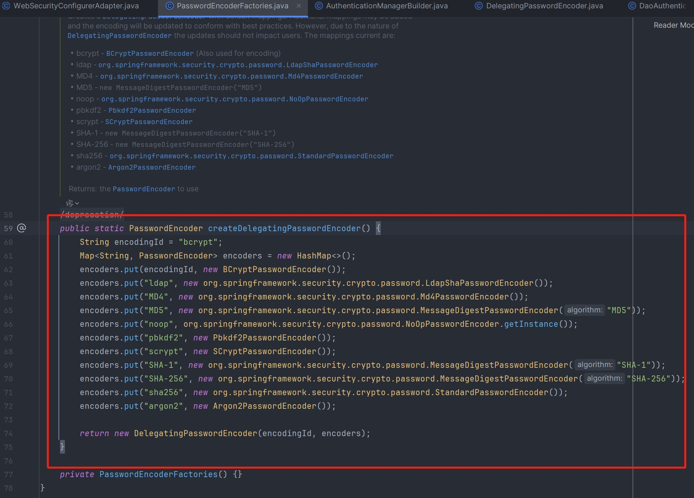

## PasswordEncoder

```java
public interface PasswordEncoder {
    //加密
    String encode(CharSequence var1);
	//比较密码
    boolean matches(CharSequence var1, String var2);
	
    default boolean upgradeEncoding(String encodedPassword) {
        return false;
    }
}
```



## 工作流程

WebSecurityConfigurerAdapter 初始化密码解析器时，如果没有自定义 Bean 的话，会默认初始化 DelegatingPasswordEncoder







DaoAuthenticationProvider 在 additionalAuthenticationChecks 方法中会获取 Spring 容器中的 PasswordEncoder 来对用户输入的密码进行比较

**BCryptPasswordEncoder 密码匹配流程**

```java
public class BCryptPasswordEncoder implements PasswordEncoder {
	private Pattern BCRYPT_PATTERN = Pattern
			.compile("\\A\\$2(a|y|b)?\\$(\\d\\d)\\$[./0-9A-Za-z]{53}");
	private final Log logger = LogFactory.getLog(getClass());

	private final int strength;
	private final BCryptVersion version;

	private final SecureRandom random;
    
    /**
     * 参数：原密码
     */
    public String encode(CharSequence rawPassword) {
        if (rawPassword == null) {
            throw new IllegalArgumentException("rawPassword cannot be null");
        }

        String salt;
        if (random != null) {
            salt = BCrypt.gensalt(version.getVersion(), strength, random);
        } else {
            salt = BCrypt.gensalt(version.getVersion(), strength);
        }
        return BCrypt.hashpw(rawPassword.toString(), salt);
    }


    /**
     * 参数一：原密码，
     * 参数二：加密后保存在数据库的密码
     */
    public boolean matches(CharSequence rawPassword, String encodedPassword) {
        if (encodedPassword == null || encodedPassword.length() == 0) {
            logger.warn("Empty encoded password");
            return false;
        }

        if (!BCRYPT_PATTERN.matcher(encodedPassword).matches()) {
            logger.warn("Encoded password does not look like BCrypt");
            return false;
        }

        return BCrypt.checkpw(rawPassword.toString(), encodedPassword);
    }
}
```

从数据库得到的“密码”（参数： salt ）进行一系列校验（长度校验等）并截取“密码”中相应的密码盐，利用这个密码盐进行同样的一系列计算 Hash 操作和 Base64 编码拼接一些标识符生成所谓的“密码”，最后 equalsNoEarlyReturn 方法对同一个密码盐生成的两个“密码”进行匹配

1. 每次使用 BCryptPasswordEncoder 编码同一个密码都是不一样的，因为用到的随机密码盐每次都是不一样的，同一个密码和不同的密码盐组合计算出来的 Hash 值不一样
2. BCryptPasswordEncoder 编码同一个密码后结果都不一样，怎么进行匹配？因为密码盐是随机生成的，但是可以根据数据库查询出来的“密码”拿到密码盐，同一个密码盐+原密码计算 Hash 结果值是能匹配的

```java
public class BCrypt {
    
    public static String hashpw(String password, String salt) {
        byte passwordb[];
        passwordb = password.getBytes(StandardCharsets.UTF_8);
        return hashpw(passwordb, salt);
    }
    
    public static String hashpw(byte passwordb[], String salt) {
        BCrypt B;
        String real_salt;
        byte saltb[], hashed[];
        char minor = (char) 0;
        int rounds, off;
        StringBuilder rs = new StringBuilder();
        if (salt == null) {
            throw new IllegalArgumentException("salt cannot be null");
        }
        int saltLength = salt.length();
        if (saltLength < 28) {
            throw new IllegalArgumentException("Invalid salt");
        }
        if (salt.charAt(0) != '$' || salt.charAt(1) != '2')
            throw new IllegalArgumentException ("Invalid salt version");
        if (salt.charAt(2) == '$')
            off = 3;
        else {
            minor = salt.charAt(2);
            if ((minor != 'a' && minor != 'x' && minor != 'y' && minor != 'b')
                    || salt.charAt(3) != '$')
                throw new IllegalArgumentException ("Invalid salt revision");
            off = 4;
        }
        // Extract number of rounds
        if (salt.charAt(off + 2) > '$')
            throw new IllegalArgumentException ("Missing salt rounds");

        if (off == 4 && saltLength < 29) {
            throw new IllegalArgumentException("Invalid salt");
        }
        rounds = Integer.parseInt(salt.substring(off, off + 2));

        real_salt = salt.substring(off + 3, off + 25);
        saltb = decode_base64(real_salt, BCRYPT_SALT_LEN);

        if (minor >= 'a') // add null terminator
            passwordb = Arrays.copyOf(passwordb, passwordb.length + 1);

        B = new BCrypt();
        hashed = B.crypt_raw(passwordb, saltb, rounds, minor == 'x', minor == 'a' ? 0x10000 : 0);
        rs.append("$2");
        if (minor >= 'a')
            rs.append(minor);
        rs.append("$");
        if (rounds < 10)
            rs.append("0");
        rs.append(rounds);
        rs.append("$");
        encode_base64(saltb, saltb.length, rs);
        encode_base64(hashed, bf_crypt_ciphertext.length * 4 - 1, rs);
        return rs.toString();
    }

    public static boolean checkpw(String plaintext, String hashed) {
        return equalsNoEarlyReturn(hashed, hashpw(plaintext, hashed));
    }

    public static boolean equalsNoEarlyReturn(String a, String b) {
        return MessageDigest.isEqual(a.getBytes(StandardCharsets.UTF_8), b.getBytes(StandardCharsets.UTF_8));
    }
    
    // ......
}
```

## 自定义密码解析器

```java
public class MyMD5PasswordEncoder implements PasswordEncoder {

    /**
     * 加密
     * @param charSequence  明文字符串
     */
    @Override
    public String encode(CharSequence charSequence) {
        try {
            MessageDigest digest = MessageDigest.getInstance("MD5");
            return toHexString(digest.digest(charSequence.toString().getBytes()));
        } catch (NoSuchAlgorithmException e) {
            e.printStackTrace();
            return "";
        }
    }

    /**
     * 密码校验
     * @param charSequence 明文，页面收集密码
     * @param s 密文 ，数据库中存放密码
     */
    @Override
    public boolean matches(CharSequence charSequence, String s) {
        return s.equals(encode(charSequence));
    }

    /**
     * @param tmp 转 16 进制字节数组
     * @return 饭回 16 进制字符串
     */
    private String toHexString(byte [] tmp){
        StringBuilder builder = new StringBuilder();
        for (byte b :tmp){
            String s = Integer.toHexString(b & 0xFF);
            if (s.length()==1){
                builder.append("0");
            }
            builder.append(s);
        }
        return builder.toString();
    }
}
```

```java
@Configuration
public class WebSecurityConfig extends WebSecurityConfigurerAdapter {

    @Bean
    public PasswordEncoder passwordEncoder(){
        //return new BCryptPasswordEncoder(); //自带的
        return new MyMD5PasswordEncoder();
    }
}
```

```java
@Slf4j
@Component
public class UserDetailServiceImpl implements UserDetailsService {

    @Autowired
    private PasswordEncoder passwordEncoder;

    @Override
    public UserDetails loadUserByUsername(String s) throws UsernameNotFoundException {
        String password = passwordEncoder.encode("123");
        log.info("登录用户：{}，密码：{}", s, password);
        return new User(s, password, AuthorityUtils.commaSeparatedStringToAuthorityList("admin"));
    }
}
```
