## 记住我原理

### 登录流程


Remember-Me 功能的开启需要在 configure(HttpSecurity http)方法中通过 http.rememberMe()配置，该配置主要会在过滤器链中添加 RememberMeAuthenticationFilter 过滤器，通过该过滤器实现自动登录。该过滤器的位置在其它认证过滤器之后，其它认证过滤器没有进行认证处理时，该过滤器尝试工作

Remember-Me 功能工作流程如下：

1. 当用户成功登录认证后，浏览器中存在两个 Cookie，一个是 remember-me，另一个是 JSESSIONID。用户再次请求访问时，请求首先被 SecurityContextPersistenceFilter 过滤器拦截，该过滤器会根据 JSESSIONID 获取对应 Session 中存储的 SecurityContext 对象。如果获取到的 SecurityContext 对象中存储了认证用户信息对象 Authentiacaion，也就是说线程可以直接获得认证用户信息，那么后续的认证过滤器不需要对该请求进行拦截，remember-me 不起作用。
2. 当 JSESSIONID 过期后，浏览器中只存在 remember-me 的 Cookie。用户再次请求访问时，由于请求没有携带 JSESSIONID，SecurityContextPersistenceFilter 过滤器无法获取 Session 中的 SecurityContext 对象，也就没法获得认证用户信息，后续需要进行登录认证。如果没有 remember-me 的 Cookie，浏览器会重定向到登录页面进行表单登录认证；但是 remember-me 的 Cookie 存在，RememberMeAuthenticationFilter 过滤器会将请求进行拦截，根据 remember-me 存储的 Token 值实现自动登录，并将成功登录后的认证用户信息对象 Authentiacaion 存储到 SecurityContext 中。当响应返回时，SecurityContextPersistenceFilter 过滤器会将 SecurityContext 存储在 Session 中，下次请求又通过 JSEESIONID 获取认证用户信息。

总结：remember-me 只有在 JSESSIONID 失效和前面的过滤器认证失败或者未进行认证时才发挥作用。此时，只要 remember-me 的 Cookie 不过期，我们就不需要填写登录表单，就能实现再次登录，并且 remember-me 自动登录成功之后，会生成新的 Token 替换旧的 Token，相应 Cookie 的 Max-Age 也会重置。

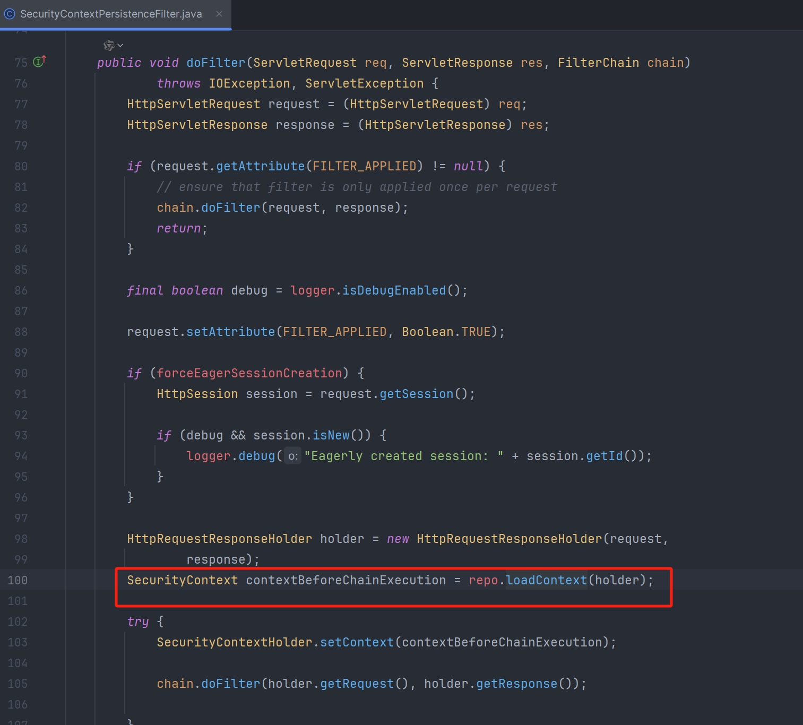

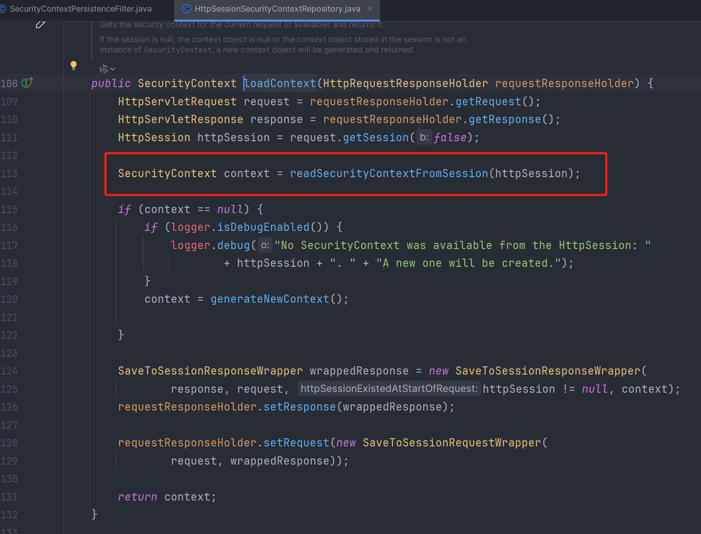

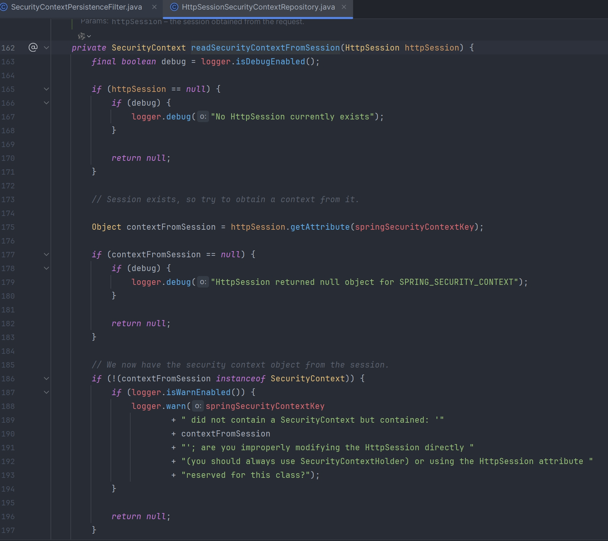

### 首次登录
在用户选择“记住我”登录并成功认证后，Spring Security 将默认会生成一个名为 remember-me 的 Cookie 存储 Token 并发送给浏览器；用户注销登录后，该 Cookie 的 Max-Age 会被设置为 0，即删除该 Cookie。Token 值由下列方式组合而成

```plain
base64(username + ":" + expirationTime + ":" + md5Hex(username + ":" + expirationTime + ":" + password + ":" + key))
```

1. username 代表用户名；
2. password 代表用户密码；
3. expirationTime 表示记住我的 Token 的失效日期，以毫秒为单位；
4. key 表示防止修改 Token 的标识，默认是一个随机的 UUID 值

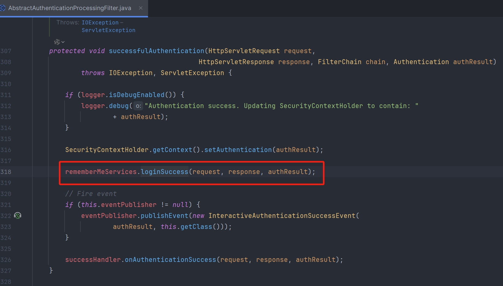

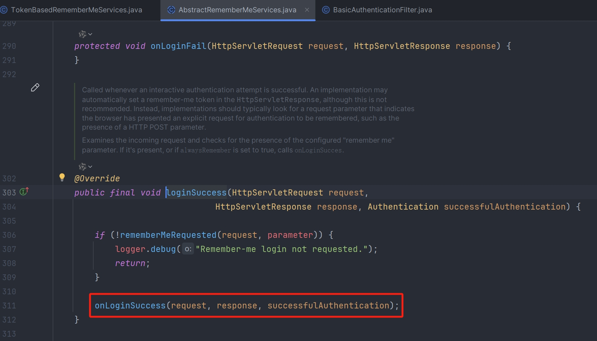

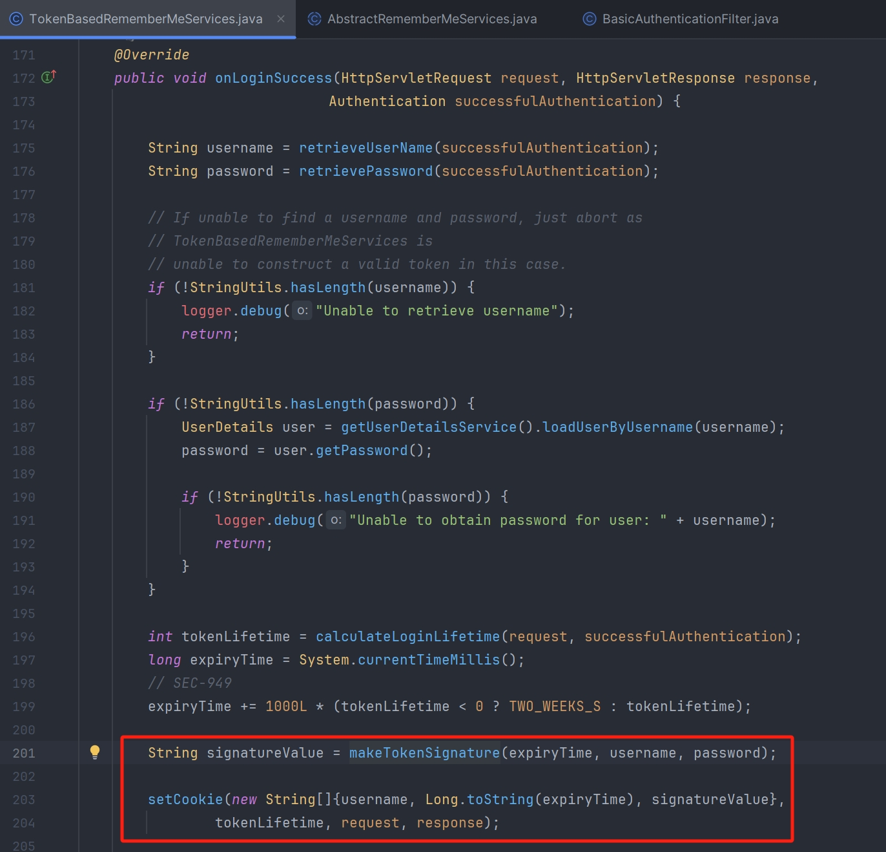

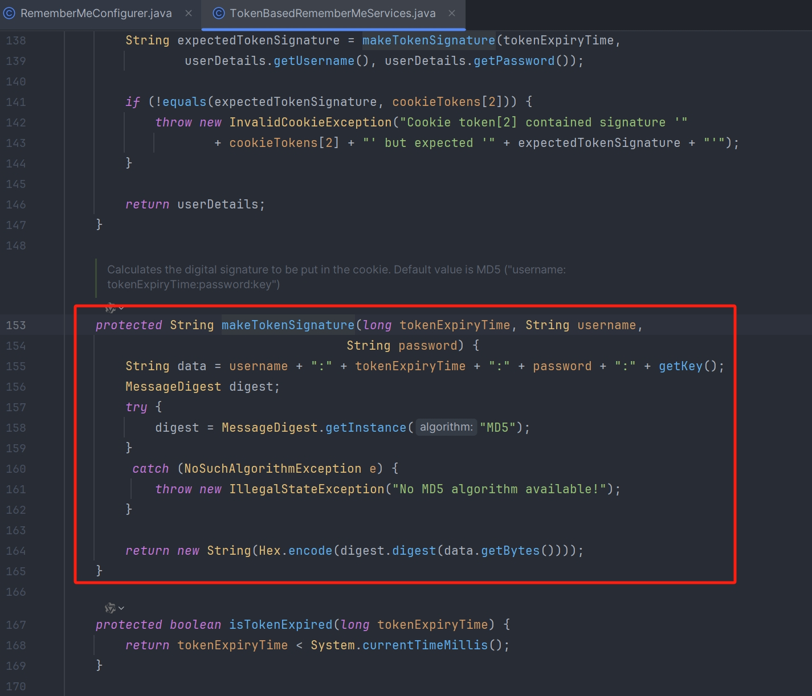

### 二次登录

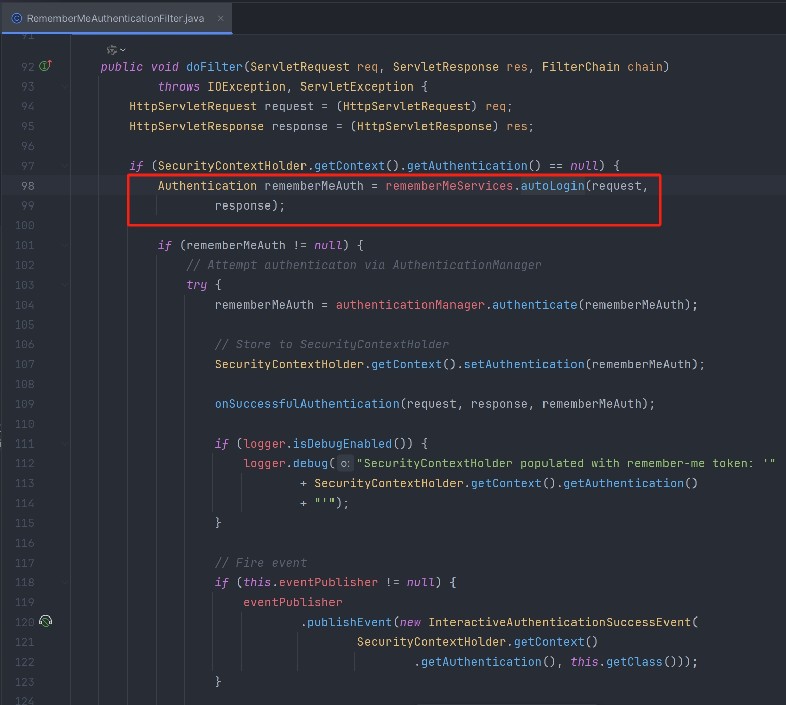

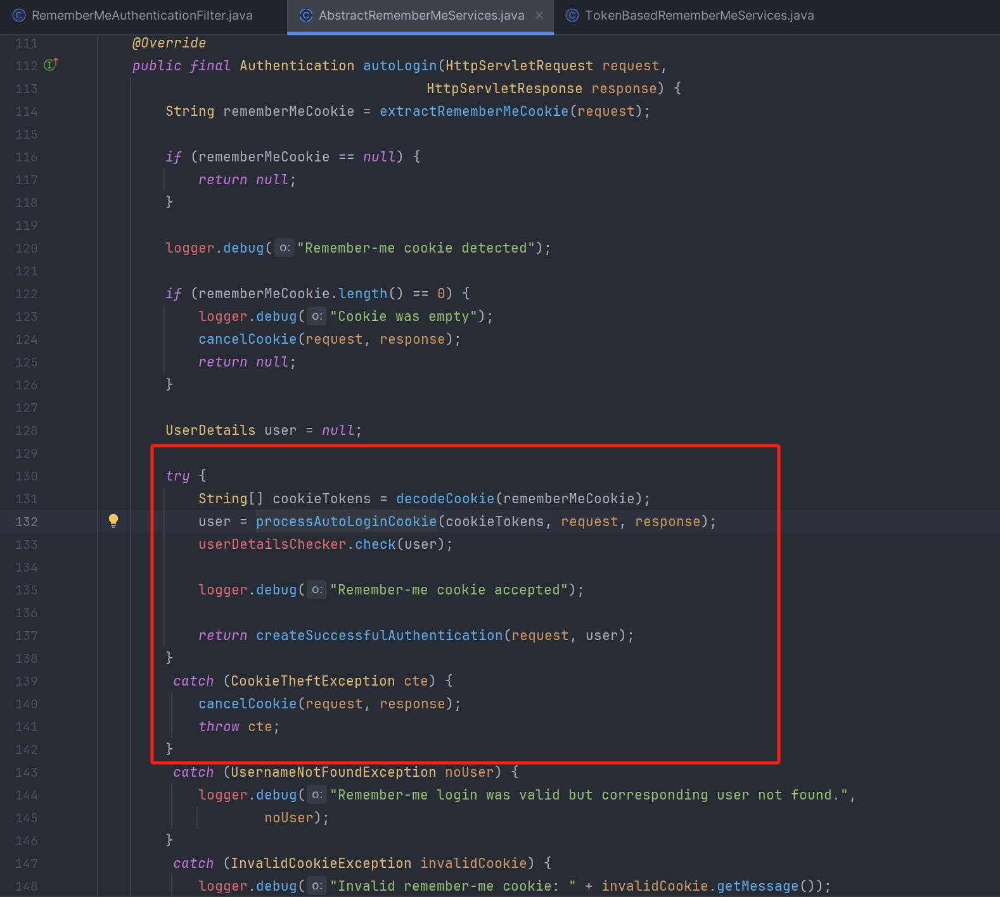

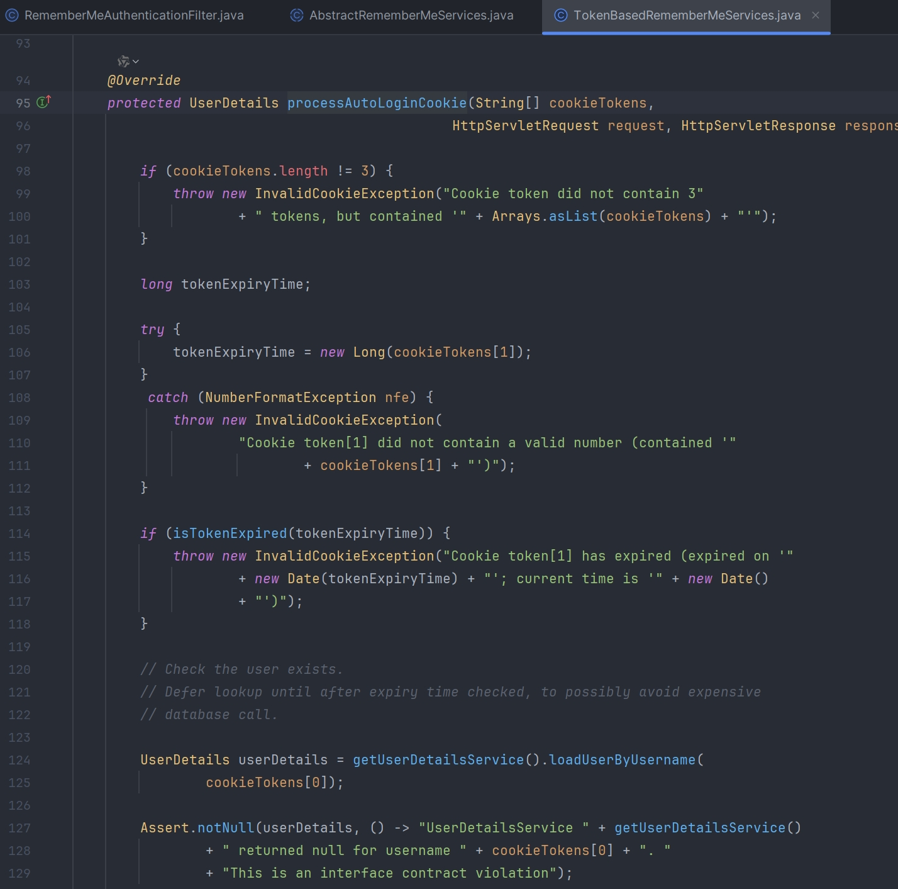

### 数据库存储

Token 与用户的对应关系是在内存中存储的，当我们重启应用之后所有的 Token 都将消失，即：所有的用户必须重新登陆。为此，Spring Security 还给我们提供了一种将 Token 存储到数据库中的方式，重启应用也不受影响


1. 用户选择“记住我”功能成功登录认证后，SpringSecurity 会把用户名 username、序列号 series、令牌值 token 和最后一次使用自动登录的时间 last_used 作为一条 Token 记录存入数据库表中，同时生成一个名为 remember-me 的 Cookie 存储 series: token 的 base64 编码，该编码为发送给浏览器的 Token。
2. 当用户需要再次登录时，RememberMeAuthenticationFilter 过滤器首先会检查请求是否有 remember-me 的 Cookie。如果存在，则检查其 Token 值中的 series 和 token 字段是否与数据库中的相关记录一致，一致则通过验证，并且系统重新生成一个新 token 值替换数据库中对应记录的旧 token，该记录的序列号 series 保持不变，认证时间 last_used 更新，同时重新生成新的 Token（旧 series : 新 token）通过 Cookie 发送给浏览器，remember-me 的 Cookie 的 Max-Age 也因此重置。
3. 上述验证通过后，获取数据库中对应 Token 记录的 username 字段，调用 UserDetailsService 获取用户信息。之后进行登录认证，认证成功后将认证用户信息 Authentication 对象存入 SecurityContext。
4. 如果对应的 Cookie 值包含的 token 字段与数据库中对应 Token 记录的 token 字段不匹配，则有可能是用户的 Cookie 被盗用，这时将会删除数据库中与当前用户相关的所有 Token 记录，用户需要重新进行表单登录。
5. 如果对应的 Cookie 不存在，或者其值包含的 series 和 token 字段与数据库中的记录不匹配，则用户需要重新进行表单登录。如果用户退出登录，则删除数据库中对应的 Token 记录，并将相应的 Cookie 的 Max-Age 设置为 0。

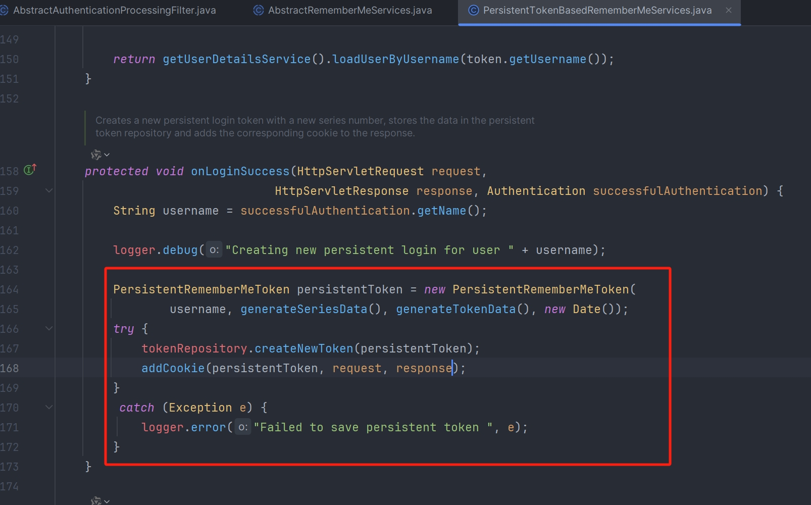

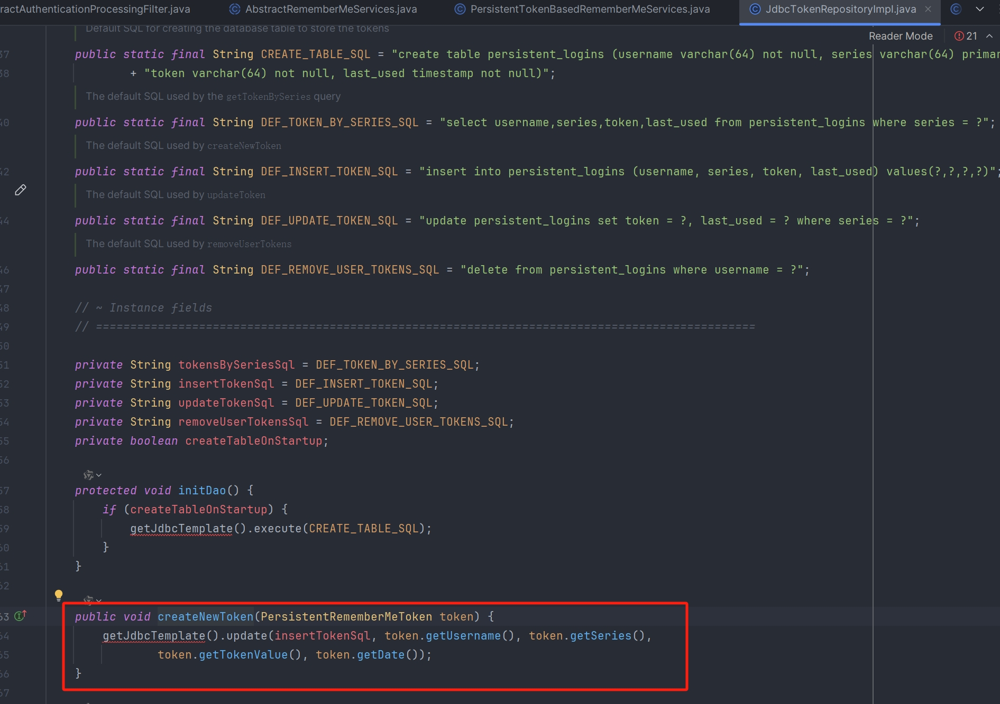

## 使用案例

### 本地存储

**http.remember()**

1. rememberMeParameter(String rememberMeParameter)：指定在登录时“记住我”的 HTTP 参数，默认为 remember-me。
2. key(String key)：“记住我”的 Token 中的标识字段，默认是一个随机的 UUID 值。
3. tokenValiditySeconds(int tokenValiditySeconds)：“记住我” 的 Token 令牌有效期，单位为秒，即对应的 cookie 的 Max-Age 值，默认时间为 2 周。
4. userDetailsService(UserDetailsService userDetailsService)：指定 Remember-Me 功能自动登录过程使用的 UserDetailsService 对象，默认使用 Spring 容器中的 UserDetailsService 对象.
5. tokenRepository(PersistentTokenRepository tokenRepository)：指定 TokenRepository 对象，用来配置持久化 Token。
6. alwaysRemember(boolean alwaysRemember)：是否应该始终创建记住我的 Token，默认为 false。
7. useSecureCookie(boolean useSecureCookie)：是否设置 Cookie 为安全，如果设置为 true，则必须通过 https 进行连接请求。

```xml
<dependency>
    <groupId>org.springframework.boot</groupId>
    <artifactId>spring-boot-starter-web</artifactId>\
    <version>2.3.12.RELEASE</version>
</dependency>
<dependency>
    <groupId>org.springframework.boot</groupId>
    <artifactId>spring-boot-starter-security</artifactId>
    <version>2.3.12.RELEASE</version>
</dependency>
<dependency>
    <groupId>mysql</groupId>
    <artifactId>mysql-connector-java</artifactId>
</dependency>
<dependency>
    <groupId>com.baomidou</groupId>
    <artifactId>mybatis-plus-boot-starter</artifactId>
    <version>3.4.3.4</version>
</dependency>
```

```java
@Component
public class UserDetailServiceImpl implements UserDetailsService {

    @Resource
    private PasswordEncoder passwordEncoder;

    @Override
    public UserDetails loadUserByUsername(String username) throws UsernameNotFoundException {
        return new User(username, passwordEncoder.encode("123"), AuthorityUtils.NO_AUTHORITIES);
    }
}
```

```java
@Configuration
public class SecurityConfig extends WebSecurityConfigurerAdapter {

    @Resource
    private UserDetailsService userDetailsService;

    @Bean
    public PasswordEncoder passwordEncoder() {
        return new BCryptPasswordEncoder();
    }

    @Override
    protected void configure(HttpSecurity http) throws Exception {
        http.formLogin()
            .and()
            .rememberMe()
            // 指定在登录时“记住我”的 HTTP 参数，默认为 remember-me
            .rememberMeCookieName("remember-me")
            // 设置 Token 有效期为 15s，（默认是 2 周内免登录）
            .tokenValiditySeconds(15)
            .tokenRepository(new InMemoryTokenRepositoryImpl())
            // 指定 UserDetailsService 对象
            .userDetailsService(userDetailsService)
            .and()
            .authorizeRequests()
            .anyRequest()
            .authenticated();
    }
}
```

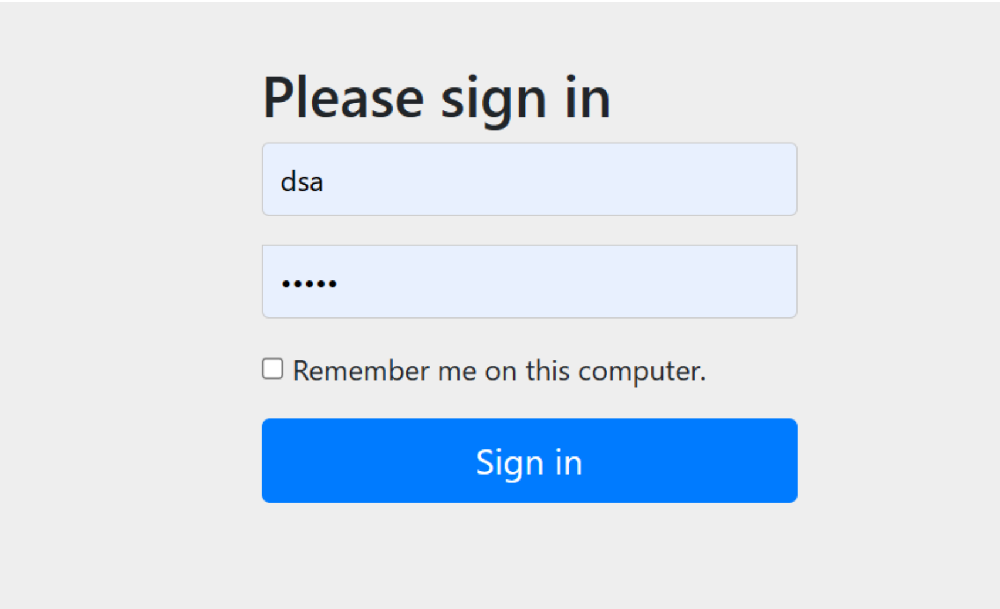

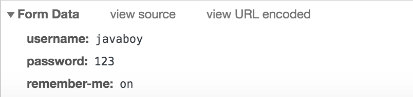

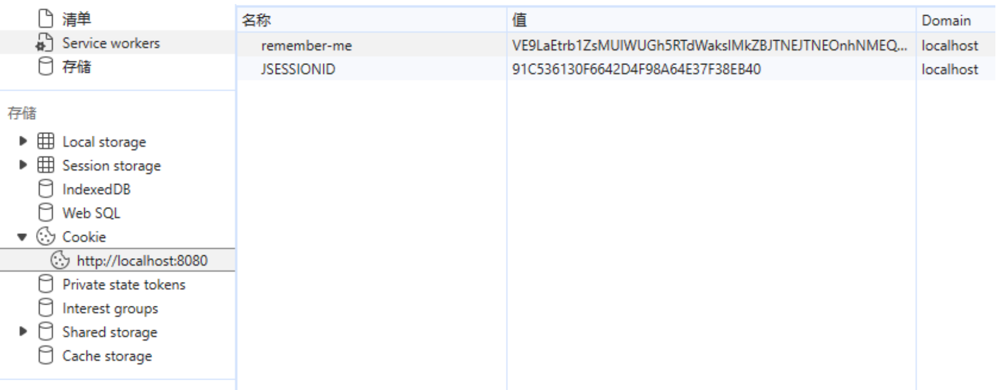

此时登录页中会出现 "记住我" 按钮，且提交表单后也有对应的参数信息，登录成功后会在浏览器中存储对应的 cookie 信息

### 数据库存储
```yaml
spring:
  datasource:
    driver-class-name: com.mysql.cj.jdbc.Driver
    url: jdbc:mysql://localhost:3306/security?useUnicode=true&characterEncoding=utf-8&serverTimezone=Asia/Shanghai
    username: root
    password: 123456
```

```java
@Configuration
public class SecurityConfig extends WebSecurityConfigurerAdapter {

    @Autowired
    private UserDetailsService userDetailsService;
    @Autowired
    private DataSource dataSource;
    
    @Override
    protected void configure(HttpSecurity http) throws Exception {
        //配置记住密码
        http.csrf().disable()
            .formLogin()
            .loginPage("/toLogin")
            .loginProcessingUrl("/login")
            .and()
            .rememberMe()
            // 修改请求参数名。 默认是 remember-me
            .rememberMeParameter("remember-me")
            // 设置记住我有效时间。单位是秒。默认是 14 天
            .tokenValiditySeconds(14*24*60*60) 
            // 修改 remember me 的 cookie 名称。默认是 remember-me
            .rememberMeCookieName("remember-me") 
            // 配置用户登录标记的持久化工具对象。
            .tokenRepository(persistentTokenRepository) 
            // 配置自定义的 UserDetailsService 接口实现类对象
            .userDetailsService(userDetailsService) 
            .and()
            .authorizeRequests()
            .antMatchers("/toLogin").permitAll()
            .anyRequest()
            .authenticated();
    }
    
    @Bean
    public PersistentTokenRepository persistentTokenRepository(DataSource dataSource){
        JdbcTokenRepositoryImpl jdbcTokenRepository = new JdbcTokenRepositoryImpl();
        // 设置数据库
        jdbcTokenRepository.setDataSource(dataSource);
        // 是否启动项目时创建保存 token 信息的数据表
        jdbcTokenRepository.setCreateTableOnStartup(false);
        return jdbcTokenRepository;
    }
}
```

注意：JdbcTokenRepositoryImpl 中有建表语句

在 cookie 未失效之前，无论是重开浏览器或者重启项目，用户都无需再次登录就可以访问系统资源了

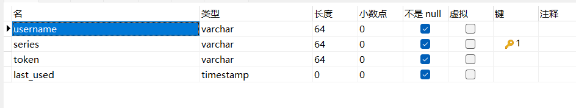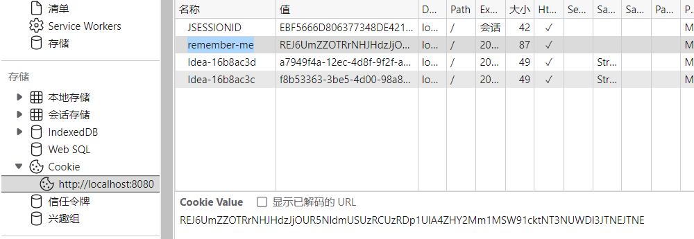

### 注销登录

**http.logout()**

1. logoutUrl(String outUrl)：指定用户注销登录时请求访问的地址，默认为 POST 方式的/logout。
2. logoutSuccessUrl(String logoutSuccessUrl)：指定用户成功注销登录后的重定向地址，默认为/登录页面 url?logout。
3. logoutSuccessHandler(LogoutSuccessHandler logoutSuccessHandler)：指定用户成功注销登录后使用的处理器。
4. deleteCookies(String ...cookieNamesToClear)：指定用户注销登录后删除的 Cookie。
5. invalidateHttpSession(boolean invalidateHttpSession)：指定用户注销登录后是否立即清除用户的 Session，默认为 true。
6. clearAuthentication(boolean clearAuthentication)：指定用户退出登录后是否立即清除用户认证信息对象 Authentication，默认为 true。
7. addLogoutHandler(LogoutHandler logoutHandler)：指定用户注销登录时使用的处理器。

**注意**

Spring Security 默认以 POST 方式请求访问/logout 注销登录，以 POST 方式请求的原因是为了防止 csrf（跨站请求伪造），如果想使用 GET 方式的请求，则需要关闭 csrf 防护。

```java
/**
 * 继承 SimpleUrlLogoutSuccessHandler 处理器，该类是 logoutSuccessUrl() 方法使用的成功注销登录处理器
 */
@Component
public class CustomLogoutSuccessHandler extends SimpleUrlLogoutSuccessHandler {

    @Override
    public void onLogoutSuccess(HttpServletRequest request, HttpServletResponse response, Authentication authentication) throws ServletException, IOException {
        String xRequestedWith = request.getHeader("x-requested-with");
        // 判断前端的请求是否为 ajax 请求
        if ("XMLHttpRequest".equals(xRequestedWith)) {
            // 成功注销登录，响应 JSON 数据
            response.setContentType("application/json;charset=utf-8");
            response.getWriter().write("注销登录成功");
        }else {
            // 以下配置等同于在 http.logout() 后配置 logoutSuccessUrl("/login/page?logout")
            
            // 设置默认的重定向路径
            super.setDefaultTargetUrl("/login/page?logout");
            // 调用父类的 onLogoutSuccess() 方法
            super.onLogoutSuccess(request, response, authentication);
        }
    }
}
```

```java
@Configuration
public class SpringSecurityConfig extends WebSecurityConfigurerAdapter {
    
    //...
    @Autowired
    private CustomLogoutSuccessHandler logoutSuccessHandler;  // 自定义成功注销登录处理器
    
    //...
    /**
     * 定制基于 HTTP 请求的用户访问控制
     */
    @Override
    protected void configure(HttpSecurity http) throws Exception {
        //...
        // 开启注销登录功能
        http.logout()
            // 用户注销登录时访问的 url，默认为 /logout
            .logoutUrl("/logout")
            // 用户成功注销登录后重定向的地址，默认为 loginPage() + ?logout
            //.logoutSuccessUrl("/login/page?logout")
            // 不再使用 logoutSuccessUrl() 方法，使用自定义的成功注销登录处理器
            .logoutSuccessHandler(logoutSuccessHandler)
            // 指定用户注销登录时删除的 Cookie
            .deleteCookies("JSESSIONID")
            // 用户注销登录时是否立即清除用户的 Session，默认为 true
            .invalidateHttpSession(true)
            // 用户注销登录时是否立即清除用户认证信息 Authentication，默认为 true
            .clearAuthentication(true);        
    }
    //...
}
```

