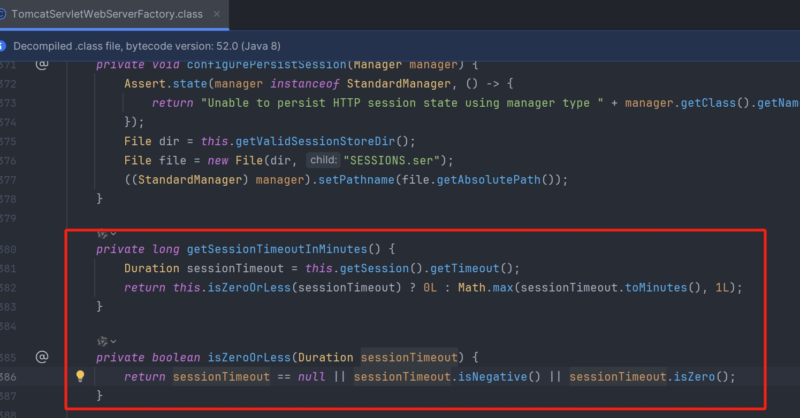
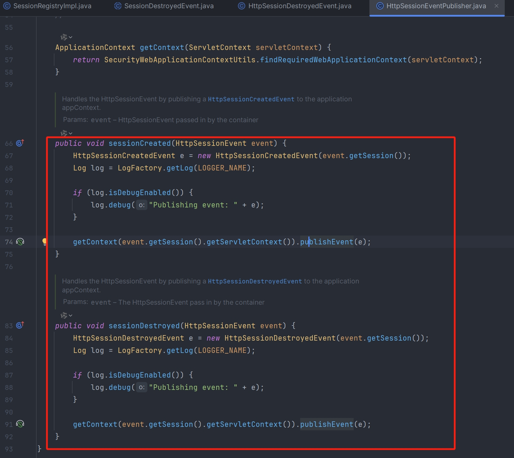
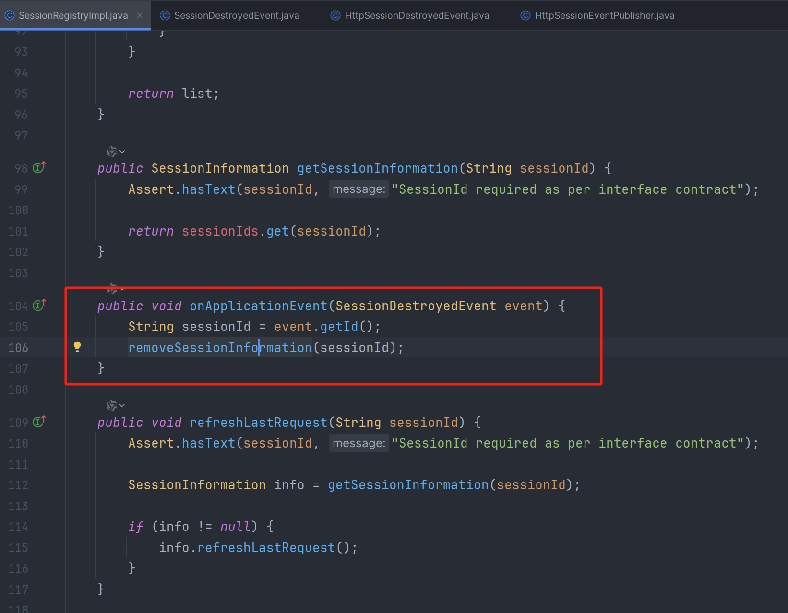
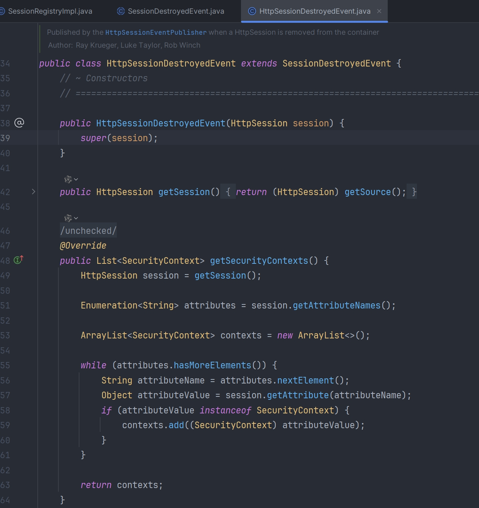

## 会话管理

**http.sessionManagement()**

1. invalidSessionUrl(String invalidSessionUrl)：指定会话失效时（请求携带无效的 JSESSIONID 访问系统）重定向的 URL，默认重定向到登录页面。
2. invalidSessionStrategy(InvalidSessionStrategy invalidSessionStrategy)：指定会话失效时（请求携带无效的 JSESSIONID 访问系统）的处理策略。
3. maximumSessions(int maximumSessions)：指定每个用户的最大并发会话数量，-1 表示不限数量。
4. maxSessionsPreventsLogin(boolean maxSessionsPreventsLogin)：如果设置为 true，表示某用户达到最大会话并发数后，新会话请求会被拒绝登录；如果设置为 false，表示某用户达到最大会话并发数后，新会话请求访问时，其最老会话会在下一次请求时失效并根据 expiredUrl() 或者 expiredSessionStrategy() 方法配置的会话失效策略进行处理，默认值为 false。
5. expiredUrl(String expiredUrl)：如果某用户达到最大会话并发数后，新会话请求访问时，其最老会话会在下一次请求时失效并重定向到 expiredUrl。
6. expiredSessionStrategy(SessionInformationExpiredStrategy expiredSessionStrategy)：如果某用户达到最大会话并发数后，新会话请求访问时，其最老会话会在下一次请求中失效并按照该策略处理请求。注意如果本方法与 expiredUrl() 同时使用，优先使用 expiredUrl() 的配置。
7. sessionRegistry(SessionRegistry sessionRegistry)：设置所要使用的 sessionRegistry，默认配置的是 SessionRegistryImpl 实现类
8. sessionCreationPolicy：控制如何管理 Session
+ SessionCreationPolicy.ALWAYS：总是创建 HttpSession
+ SessionCreationPolicy.IF_REQUIRED：SpringSecurity 只会在需要时创建一个 HttpSession
+ SessionCreationPolicy.NEVER：SpringSecurity 不会创建 HttpSession，但如果他已经存在，将可以使用 HttpSession
+ SessionCreationPolicy.STATELESS：SpringSecurity 永远不会创建 HttpSession，他不会使用 HttpSession 来获取 SecurityContext

### invalidSessionUrl
```java
@Configuration
public class SpringSecurityConfig extends WebSecurityConfigurerAdapter {

    /**
     * 定制基于 HTTP 请求的用户访问控制
     */
    @Override
    protected void configure(HttpSecurity http) throws Exception {
        http.formLogin()
            .and()
            .authorizeRequests()
            .anyRequest()
            .authenticated();
        
        // 开启 Session 会话管理配置
        http.sessionManagement()
            // 设置 Session 会话失效时重定向路径，默认为 loginPage()
            .invalidSessionUrl("/login/page");        
    }
}
```

```properties
# session 失效时间，单位是秒，默认为 30min
server.servlet.session.timeout=30m
# JSESSIONID (Cookie)的生命周期，单位是秒，默认为 -1
server.servlet.session.cookie.max-age=-1
```

注意：Session 的失效时间至少要 1 分钟，少于 1 分钟按照 1 分钟配置



### invalidSessionStrategy
```java
/**
 * 用户请求携带无效的 JSESSIONID 访问时的处理策略，即对应的 Session 会话失效
 */
@Component
public class CustomInvalidSessionStrategy implements InvalidSessionStrategy {

    private final RedirectStrategy redirectStrategy = new DefaultRedirectStrategy();

    @Override
    public void onInvalidSessionDetected(HttpServletRequest request, HttpServletResponse response) throws IOException {
        // 清除浏览器中的无效的 JSESSIONID
        Cookie cookie = new Cookie("JSESSIONID", null);
        cookie.setPath(getCookiePath(request));
        cookie.setMaxAge(0);
        response.addCookie(cookie);

        String xRequestedWith = request.getHeader("x-requested-with");
        // 判断前端的请求是否为 ajax 请求
        if ("XMLHttpRequest".equals(xRequestedWith)) {
            // 响应 JSON 数据
            response.setContentType("application/json;charset=utf-8");
            response.getWriter().write("SESSION 失效，请重新登录！");
        }else {
            // 重定向到登录页面
            redirectStrategy.sendRedirect(request, response, "/login/page");
        }
    }

    private String getCookiePath(HttpServletRequest request) {
        String contextPath = request.getContextPath();
        return contextPath.length() > 0 ? contextPath : "/";
    }
}
```

```java
@Configuration
public class SpringSecurityConfig extends WebSecurityConfigurerAdapter {

    // 自定义 Session 会话失效策略
    @Autowired
    private CustomInvalidSessionStrategy invalidSessionStrategy;  

    /**
     * 定制基于 HTTP 请求的用户访问控制
     */
    @Override
    protected void configure(HttpSecurity http) throws Exception {
        http.formLogin()
            .and()
            .authorizeRequests()
            .anyRequest()
            .authenticated();
        
        // 开启 Session 会话管理配置
        http.sessionManagement()
            // 设置 Session 会话失效时重定向路径，默认为 loginPage()
            // .invalidSessionUrl("/login/page")
            // 配置使用自定义的 Session 会话失效处理策略
            .invalidSessionStrategy(invalidSessionStrategy);       
    }
}
```

## 会话并发控制
会话并发管理是指在当前系统中，同一个用户可以同时创建多少个会话，如果一台设备对应一个会话，也可以理解为同一个用户可以同时在多少个设备上进行登录。

在 Spring Security 中默认情况下，同一个用户在多少个设备上登录并没有限制，但是我们可以自己设置。

### 会话销毁监听
Spring Security 中通过一个 Map 集合来维护当前 HttpSession 记录，进而实现会话的并发管理，当用户登录成功后，就向集合添加一条 HttpSession 记录。

Map 的 key 是当前用户对象，value 是一个集合，这个集合中保存着这个用户的所有会话 session（这里存储的 session 是包装后的 session），每次登录后就能够去 Map 里面拿出来这个用户的所有会话然后判断一下（set）就知道该不该登录了，当用户注销登录的时候，用户的 session 会被自动销毁，但是 Map 中的 List 集合中的 session 并不会自动移除，所以就导致每次登录的时候都会判断为 session 已经登录，所以我们应当在用户注销登录的时候，将 list 集合中把用户对应的会话 session 移除掉

HttpSessionEventPublisher 实现了 HttpSessionListener 接口，可以监听到 HttpSession 的创建和销毁事件，并将 HttpSession 的创建和销毁事件发布出去，这样当有 HttpSession 销毁时，Spring Security 就可以感知到该事件了

```java
/**
 * 这个可以监听到 HttpSession 的销毁操作，当有 HttpSession 销毁的时候，就将这个销毁的事件广播出去
 * @return
 */
@Bean
public HttpSessionEventPublisher sessionEventPublisher() {
    return new HttpSessionEventPublisher();
}
```





Spring Security 是通过监听 HttpSession 对象的销毁事件来触发会话信息集合 principals 和 sessionIds 的清理工作，但是默认情况下是没有注册过相关的监听器，这会导致 Spring Security 无法正常清理过期或已注销的会话



### 限制用户二次登录

如果同一个用户在第二个地方登录，则不允许他二次登录

不建议使用该配置，因为用户一旦被盗号，那真正的用户后续就无法登录，只能通过联系管理员解决，所以如果只能一个用户 Session 登录，一般是新会话登录并将老会话踢下线

```java
@Configuration
public class SpringSecurityConfig extends WebSecurityConfigurerAdapter {
    
    // 自定义 Session 会话失效策略
    @Autowired
    private CustomInvalidSessionStrategy invalidSessionStrategy;  

    /**
     * 定制基于 HTTP 请求的用户访问控制
     */
    @Override
    protected void configure(HttpSecurity http) throws Exception {
        http.formLogin()
            .and()
            .authorizeRequests()
            .anyRequest()
            .authenticated();
        
        // 开启 Session 会话管理配置
        http.sessionManagement()
            // 配置使用自定义的 Session 会话失效处理策略
            .invalidSessionStrategy(invalidSessionStrategy)
            // 设置单用户的 Session 最大并发会话数量，-1 表示不受限制
            .maximumSessions(1)
            // 设置为 true，表示某用户达到最大会话并发数后，新会话请求会被拒绝登录
            .maxSessionsPreventsLogin(true);      
            // 设置所要使用的 sessionRegistry，默认为 SessionRegistryImpl 实现类
            .sessionRegistry(sessionRegistry());
    }
    
    /**
     * 注册 SessionRegistry，该 Bean 用于管理 Session 会话并发控制
     */
    @Bean
    public SessionRegistry sessionRegistry() {
        return new SessionRegistryImpl();
    }
    
    /**
     * 配置 Session 的监听器（注意：如果使用并发 Sessoion 控制，一般都需要配置该监听器）
     * 解决 Session 失效后, SessionRegistry 中 SessionInformation 没有同步失效的问题
     */
    @Bean
    public HttpSessionEventPublisher httpSessionEventPublisher() {
        return new HttpSessionEventPublisher();
    }
}
```

### 踢人下线
如果同一个用户在第二个地方登录，则将第一个踢下线

```java
/**
 * 前提：Session 并发处理的配置为 maxSessionsPreventsLogin(false)
 * 用户的并发 Session 会话数量达到上限，新会话登录后，最老会话会在下一次请求中失效，并执行此策略
 */
@Component
public class CustomSessionInformationExpiredStrategy implements SessionInformationExpiredStrategy {

    private final RedirectStrategy redirectStrategy = new DefaultRedirectStrategy();

    @Override
    public void onExpiredSessionDetected(SessionInformationExpiredEvent event) throws IOException {
        HttpServletRequest request = event.getRequest();
        HttpServletResponse response = event.getResponse();

        // 最老会话被踢下线时显示的信息
        UserDetails userDetails = (UserDetails) event.getSessionInformation().getPrincipal();
        String msg = String.format("用户[%s]在另外一台机器登录，您已下线！", userDetails.getUsername());

        String xRequestedWith = event.getRequest().getHeader("x-requested-with");
        // 判断前端的请求是否为 ajax 请求
        if ("XMLHttpRequest".equals(xRequestedWith)) {
            // 认证成功，响应 JSON 数据
            response.setContentType("application/json;charset=utf-8");
            response.getWriter().write(msg);
        }else {
            // 返回到登录页面显示信息
            AuthenticationException e = new AuthenticationServiceException(msg);
            request.getSession().setAttribute("SPRING_SECURITY_LAST_EXCEPTION", e);
            redirectStrategy.sendRedirect(request, response, "/login/page?error");
        }
    }
}
```

```java
@Configuration
public class SpringSecurityConfig extends WebSecurityConfigurerAdapter {

    // 自定义 Session 会话失效策略
    @Autowired
    private CustomInvalidSessionStrategy invalidSessionStrategy;  
    // 自定义最老会话失效策略
    @Autowired
    private CustomSessionInformationExpiredStrategy sessionInformationExpiredStrategy;

    /**
     * 定制基于 HTTP 请求的用户访问控制
     */
    @Override
    protected void configure(HttpSecurity http) throws Exception {
        // 开启 Session 会话管理配置
        http.sessionManagement()
            // 配置使用自定义的 Session 会话失效处理策略
            .invalidSessionStrategy(invalidSessionStrategy)
            // 设置单用户的 Session 最大并发会话数量，-1 表示不受限制
            .maximumSessions(1)
            // 设置为 true，表示某用户达到最大会话并发数后，新会话请求会被拒绝登录；
            // 设置为 false，表示某用户达到最大会话并发数后，新会话请求访问时，其最老会话会在下一次请求时失效
            .maxSessionsPreventsLogin(false)
            // 设置所要使用的 sessionRegistry，默认为 SessionRegistryImpl 实现类
            .sessionRegistry(sessionRegistry())
            // 最老会话在下一次请求时失效，并重定向到 /login/page
            //.expiredUrl("/login/page");
            // 最老会话在下一次请求时失效，并按照自定义策略处理
            .expiredSessionStrategy(sessionInformationExpiredStrategy);
    }

    /**
     * 注册 SessionRegistry，该 Bean 用于管理 Session 会话并发控制
     */
    @Bean
    public SessionRegistry sessionRegistry() {
        return new SessionRegistryImpl();
    }
     
    /**
     * 配置 Session 的监听器（如果使用并发 Sessoion 控制，一般都需要配置）
     * 解决 Session 失效后, SessionRegistry 中 SessionInformation 没有同步失效问题
     */
    @Bean
    public HttpSessionEventPublisher httpSessionEventPublisher() {
        return new HttpSessionEventPublisher();
    }   
}
```

### 实现原理

1. AbstractAuthenticationProcessingFilter 的 doFilter()

```java
public abstract class AbstractAuthenticationProcessingFilter extends GenericFilterBean implements ApplicationEventPublisherAware, MessageSourceAware {
    private SessionAuthenticationStrategy sessionStrategy = new NullAuthenticatedSessionStrategy();
    
    //...
    public void doFilter(ServletRequest req, ServletResponse res, FilterChain chain) throws IOException, ServletException {
        HttpServletRequest request = (HttpServletRequest)req;
        HttpServletResponse response = (HttpServletResponse)res;
        if (!this.requiresAuthentication(request, response)) {
            //(1) 判断该请求是否为 POST 方式的登录表单提交请求，如果不是则直接放行，进入下一个过滤器
            chain.doFilter(request, response);
        } else {
            if (this.logger.isDebugEnabled()) {
                this.logger.debug("Request is to process authentication");
            }
            // Authentication 是用来存储用户认证信息的类，后续会进行详细介绍
            Authentication authResult;
            try {
                //(2) 调用子类 UsernamePasswordAuthenticationFilter 重写的方法进行身份认证，
                // 返回的 authResult 对象封装认证后的用户信息
                authResult = this.attemptAuthentication(request, response);
                if (authResult == null) {
                    return;
                }
                //(3) Session 策略处理（如果配置了用户 Session 最大并发数，就是在此处进行判断并处理）
                // 默认使用的是新创建的 NullAuthenticatedSessionStrategy 实例，而 UsernamePasswordAuthenticationFilter 过滤器使用的是 CompositeSessionAuthenticationStrategy 实例
                this.sessionStrategy.onAuthentication(authResult, request, response);
            } catch (InternalAuthenticationServiceException var8) {
                this.logger.error("An internal error occurred while trying to authenticate the user.", var8);
                //(4) 认证失败，调用认证失败的处理器
                this.unsuccessfulAuthentication(request, response, var8);
                return;
            } catch (AuthenticationException var9) {
                this.unsuccessfulAuthentication(request, response, var9);
                return;
            }

            //(4) 认证成功的处理
            if (this.continueChainBeforeSuccessfulAuthentication) {
                // 默认的 continueChainBeforeSuccessfulAuthentication 为 false，所以认证成功之后不进入下一个过滤器
                chain.doFilter(request, response);
            }
            // 调用认证成功的处理器
            this.successfulAuthentication(request, response, chain, authResult);
        }
    }
    
    //...
    public void setSessionAuthenticationStrategy(SessionAuthenticationStrategy sessionStrategy) {
        this.sessionStrategy = sessionStrategy;
    }    
}
```

2. CompositeSessionAuthenticationStrategy 的 onAuthentication()

```java
public class CompositeSessionAuthenticationStrategy implements SessionAuthenticationStrategy {
    //...
    private final List<SessionAuthenticationStrategy> delegateStrategies;

    public void onAuthentication(Authentication authentication, HttpServletRequest request, HttpServletResponse response) throws SessionAuthenticationException {
        SessionAuthenticationStrategy delegate;
        // delegateStrategies 是 Session 处理策略集合，会调用这些策略的 onAuthentication() 方法
        // 包括处理 Session 并发数的策略 ConcurrentSessionControlAuthenticationStrategy
        for(Iterator var4 = this.delegateStrategies.iterator(); var4.hasNext(); delegate.onAuthentication(authentication, request, response)) {
            delegate = (SessionAuthenticationStrategy)var4.next();
            if (this.logger.isDebugEnabled()) {
                this.logger.debug("Delegating to " + delegate);
            }
        }
    }
    //...
}
```

3. ConcurrentSessionControlAuthenticationStrategy 的 onAuthentication()

```java
public class ConcurrentSessionControlAuthenticationStrategy implements MessageSourceAware, SessionAuthenticationStrategy {
    //...
    public void onAuthentication(Authentication authentication, HttpServletRequest request, HttpServletResponse response) {
        //(1) 获取用户在系统中的 Session 列表，元素类型为 SessionInformation，该类后续会介绍
        List<SessionInformation> sessions = this.sessionRegistry.getAllSessions(authentication.getPrincipal(), false);
        //(2) 获取用户在系统的并发 Session 数量
        int sessionCount = sessions.size();
        //(3) 获取用户能够允许的最大并发 Session 数量
        int allowedSessions = this.getMaximumSessionsForThisUser(authentication);
        //(4) 判断当前用户的并发 Session 数量是否达到上限
        if (sessionCount >= allowedSessions) {
            // allowedSessions 为 -1，表示并发 Session 数量不受限制
            if (allowedSessions != -1) {
                //(5) 当已存在的 Session 数量等于最大并发 Session 数量时
                if (sessionCount == allowedSessions) 
                    HttpSession session = request.getSession(false);
                    if (session != null) {
                        Iterator var8 = sessions.iterator();

                        while(var8.hasNext()) {
                            SessionInformation si = (SessionInformation)var8.next();
                            //(6) 当前验证的会话如果并非新的会话，则不做任何处理
                            if (si.getSessionId().equals(session.getId())) {
                                return;
                            }
                        }
                    }
                }
                //(5) 否则，进行策略判断
                this.allowableSessionsExceeded(sessions, allowedSessions, this.sessionRegistry);
            }
        }
    }

    protected void allowableSessionsExceeded(List<SessionInformation> sessions, int allowableSessions, SessionRegistry registry) throws SessionAuthenticationException {
        //(1) exceptionIfMaximumExceeded 就是配置类中 maxSessionsPreventsLogin() 方法参数
        if (!this.exceptionIfMaximumExceeded && sessions != null) {
            // 当配置 maxSessionsPreventsLogin(false) 时，才运行此处代码
            //(2) 将用户的 SessionInformation 列表按照最后一次访问时间进行排序
            sessions.sort(Comparator.comparing(SessionInformation::getLastRequest));
            //(3) 获取需要踢下线的 SessionInformation 列表（最老会话列表）
            int maximumSessionsExceededBy = sessions.size() - allowableSessions + 1;
            List<SessionInformation> sessionsToBeExpired = sessions.subList(0, maximumSessionsExceededBy);
            Iterator var6 = sessionsToBeExpired.iterator();

            while(var6.hasNext()) {
                //(4) 将用户最老会话列表中的所有 SessionInformation 对象记为过期
                // 注意这里只是标记，而不是真正的将 HttpSession 对象过期，
                // 只有最老会话再次请求或者达到过期时间，HttpSession 对象才会真正失效
                SessionInformation session = (SessionInformation)var6.next();
                session.expireNow();
            }
        } else {
            // 当配置 maxSessionsPreventsLogin(true) 时，运行此处代码
            //(2) 当前（最新）会话的请求访问抛出异常，返回信息（超出最大并发 Session 数量）
            throw new SessionAuthenticationException(this.messages.getMessage("ConcurrentSessionControlAuthenticationStrategy.exceededAllowed", new Object[]{allowableSessions}, "Maximum sessions of {0} for this principal exceeded"));
        }
    }    
    //...
}
```

## 其他

### 统计未过期的 Session 数量

```java
@Controller
public class TestController {
    //...
    @Autowired
    private SessionRegistry sessionRegistry;

    //...
    @GetMapping("/test4")
    @ResponseBody
    public Object getOnlineSession() {
        // 统计当前用户未过期的并发 Session 数量
        UserDetails user = (UserDetails) SecurityContextHolder.getContext().getAuthentication().getDetails();
        List<SessionInformation> sessions = this.sessionRegistry.getAllSessions(user, false);
        return new ResultData<>(sessions.size());
    }
}
```

### 统计所有在线用户
```java
@Controller
public class TestController {
    //...
    @Autowired
    private SessionRegistry sessionRegistry;

    //...
    @GetMapping("/test5")
    @ResponseBody
    public Object getOnlineUsers() {
        // 统计所有在线用户
        List<String> userList = sessionRegistry.getAllPrincipals().stream()
                .map(user -> ((UserDetails) user).getUsername())
                .collect(Collectors.toList());
        return new ResultData<>(userList);
    }    
}
```

### 安全会话 Cookie

<font style="color:rgb(37, 41, 51);"> 可以使用 httpOnly 和 secure 标签来保护我们的会话 cookie：</font>

1. httpOnly：如果为 true，那么浏览器脚本将无法访问 cookie 
2. secure：如果为 true，则 cookie 将仅通过 HTTPS 连接发送

```properties
server.servlet.session.cookie.http‐only=true
server.servlet.session.cookie.secure=true
```

## 会话集群控制

```xml
<!-- redis 依赖启动器 -->
<dependency>
    <groupId>org.springframework.boot</groupId>
    <artifactId>spring-boot-starter-data-redis</artifactId>
</dependency>
<!-- redis 数据源 -->
<dependency>
    <groupId>org.apache.commons</groupId>
    <artifactId>commons-pool2</artifactId>
    <version>2.8.0</version>
</dependency>
<!-- 使用 Redis 管理 session -->
<dependency>
    <groupId>org.springframework.session</groupId>
    <artifactId>spring-session-data-redis</artifactId>
</dependency>
```

```properties
# Redis 服务器地址
spring.redis.host=localhost
# Redis 服务器连接端口
spring.redis.port=6379
# Redis 服务器连接密码（默认无）
spring.redis.password=
# Redis数据库索引（默认为0）
spring.redis.database=1
# 连接池最大连接数（使用负值表示没有限制），默认 8
spring.redis.lettuce.pool.max-active=100
# 连接池大阻塞等待时间（使用负值表示没有限制），默认 -1
spring.redis.lettuce.pool.max-wait=PT10S
# 连接池中的大空闲连接 默认 8
spring.redis.lettuce.pool.max-idle=10
# 连接池中的小空闲连接 默认 0
spring.redis.lettuce.pool.min-idle=1
# 连接超时时间
spring.redis.timeout=PT10S

# 使用 Redis 存储 Session，默认为 none（使用内存存储）
spring.session.store-type=redis
# 指定存储 SessionId 的 Cookie 名（使用 Redis 存储 Session 后，Cookie 名默认会变为 SESSION）
server.servlet.session.cookie.name=JSESSIONID
```

Redis 存储 Session 默认的序列化方式为 JdkSerializationRedisSerializer，所以存入 Session 的对象都要实现 Serializable 接口
