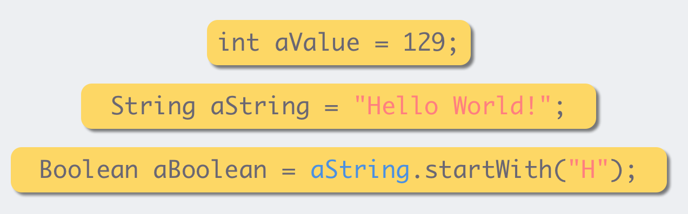
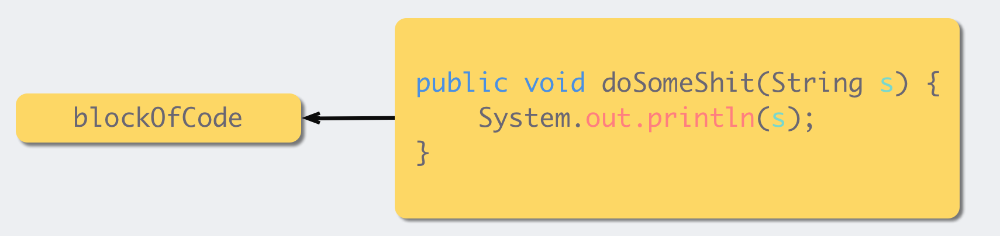
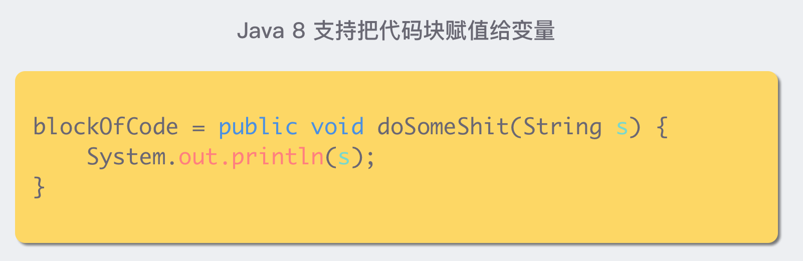
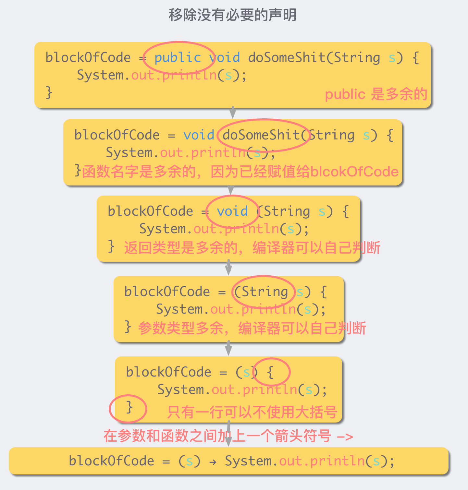
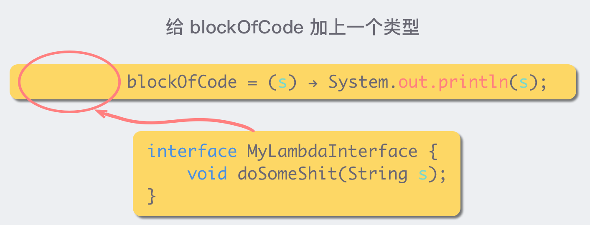
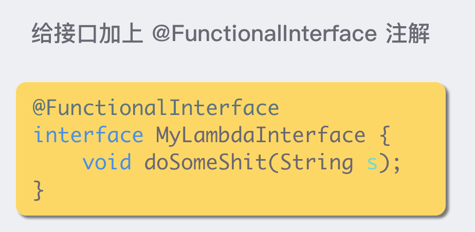
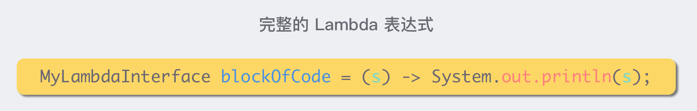

## Lambda 表达式

### 什么是 Lambda 表达式？

我们知道，对于一个 Java 变量，我们可以赋给一个值。



如果你想把一块代码赋给一个 Java 变量，应该怎么做呢？比如，我想把右边的代码块，赋值给一个叫做 blockOfCode 的 Java 变量



在 Java 8 之前这个是做不到的，但是 Java 8 问世之后，利用 Lambda 特性就可以做到了。



当然，这个并不是一个很简洁的写法，所以为了让这个赋值操作变得更加优雅，我们可以移除一些没有必要的声明。



这样，我们就非常优雅地把一块代码赋给了一个变量，而这块代码或者说这个被赋给一个变量的函数，就是一个 Lambda 表达式。但是这里仍然有一个问题，就是变量 blockOfCode 的类型应该是什么？

在 Java 8 里面，所有的 Lambda 的类型都是一个接口，而 Lambda 表达式本身，也就是那段代码，需要是这个接口的实现。这是理解 Lambda 的一个关键所在，简而言之就是，Lambda 表达式本身就是一个接口的实现。我们给上面的 blockOfCode 加上一个类型：



这种只有一个接口函数需要被实现的接口类型，我们叫它函数式接口。为了避免后来的人在这个接口中增加接口函数导致其有多个接口函数需要被实现，变成非函数接口，我们可以在这个上面加上一个声明 @FunctionalInterface，这样别人就无法在里面添加新的接口函数了



这样，我们就得到了一个完整的 Lambda 表达式声明：



### 使用方法

1. ()：里面没有内容，可以看成是方法形式参数为空
2. ->：用箭头指向后面要做的事情
3. {}：包含一段代码，可以看成是方法体的内容

格式：(形式参数) -> {代码块}

```java
public static void main(String[] args) {
    /* new Thread(new Runnable() {
        @Override
        public void run() {
            System.out.println("123");
        }
    }).start();*/
    new Thread(() -> {
        System.out.println("123");
    }).start();
}
```

使用前提：有一个接口，且接口中有且仅有一个抽象方法

注意：

1. 参数的类型可以省略，但是有多个参数的情况下，不能只省略一个
2. 如果参数有且仅有一个，那么小括号可以省略
3. 如果代码块的语句只有一条，可以省略大括号和分号。如果有 return，return 也可以省略

```java
public interface Inter {
    void show();
}
```

```java
public static void main(String[] args) {
    Runnable r = ()-> System.out.println("123");
    new Thread(r).start();
    new Thread(()-> System.out.println("456")).start();
}

private static void use(Inter inter){
    inter.show();
}
```

**Lambda 表达式与匿名内部类的区别**

1. 匿名内部类：

* 编译之后，产生一个单独的.class 字节码文件
* 可以是接口，也可以是抽象类，还可以是具体类

2. Lambda 表达式：

* 编译之后，没有一个单独的.class 字节码文件，对应的字节码文件会在运行时动态生成
* 只能是接口

### 使用案例

**Eatable**

```java
public interface Eatable {
    void eat();
}

public class EatDemo implements Eatable{
    @Override
    public void eat() {
        System.out.println("123");
    }
}
```

```java
public static void main(String[] args) {
    Eatable eatable = new EatDemo();
    use(eatable);
    use(new Eatable() {
        @Override
        public void eat() {
            System.out.println("456");
        }
    });
    use( () -> {
        System.out.println("123");
    });
}

private static void use(Eatable eatable){
    eatable.eat();
}
```

**Add**

```java
public interface Add {
    int add(int a,int b);
}
```

```java
public static void main(String[] args) {
     use( (int x,int y) -> {
         //return x+y;
         return x-y;
     });
}

private static void use(Add add){
    System.out.println(add.add(10,20));
}
```

## 方法引用

方法引用是用来直接访问类或者实例的已经存在的方法或者构造方法。方法引用提供了一种引用而不执行方法的方式，它需要由兼容的函数式接口构成的目标类型上下文。计算时，方法引用会创建函数式接口的一个实例。当 Lambda 表达式中只是执行一个方法调用时，不用 Lambda 表达式，直接通过方法引用的形式可读性更高一些。方法引用是一种更简洁易懂的 Lambda 表达式。

### 引用类方法

类名:: 静态方法

```java
public interface Test3 {
    int show(String i);
}
```

```java
public static void main(String[] args) {
    use(s-> Integer.parseInt(s));
    use(Integer::parseInt);
}

private static void use(Test3 test3){
    int num= test3.show("123");
    System.out.println(num);
}
```

### 引用对象实例方法

对象:: 成员方法

```java
public interface Test4 {
    void show(String s);
}
```

```java
public class Exp6 {
    public static void main(String[] args) {
        use(s-> System.out.println(s.toUpperCase()));
        Exp6 exp6 = new Exp6();
        use(exp6::Upper);
	}
    
    public void Upper(String s){
        System.out.println(s.toUpperCase());
    }
    
    private static void use(Test4 test4){
    	test4.show("dasf");
	}
}
```

### 引用类实例方法

类名:: 成员方法

Lambda 表达式被类的实例方法替代的时候：第一个参数作为调用者，后面的参数全部传递给该方法作为参数

```java
public interface Test5 {
    String mySubstring(String s,int a,int b);
}
```

```java
public static void main(String[] args) {
    use((s,a,b) -> s.substring(a,b));
    use(String::substring);
}

private static void use(Test5 test5){
    String s = test5.mySubstring("123456789", 2, 6);
    System.out.println(s);
}
```

### 引用构造器

类名:: new

```java
public interface Test {
    Student build(String name,int age);
}
```

```java
public class Student {
    private String name;
    private int age;
    
    public Student(String name, int age) {
        this.name = name;
        this.age = age;
    }
    public String getName() {
        return name;
    }
    public void setName(String name) {
        this.name = name;
    }
    public int getAge() {
        return age;
    }
    public void setAge(int age) {
        this.age = age;
    }
    
    
    public static void main(String[] args) {
        use( (name, age) -> new Student(name,age));
        use(Student::new);
    }
    private static void use(Test test){
        Student da = test.build("da", 13);
        System.out.println(da.getName()+" "+ da.getAge());
    }
}
```

