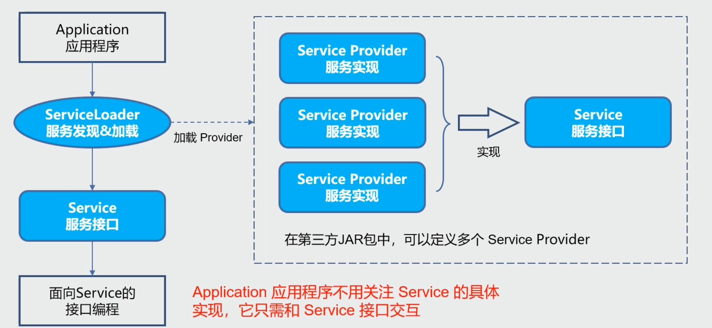
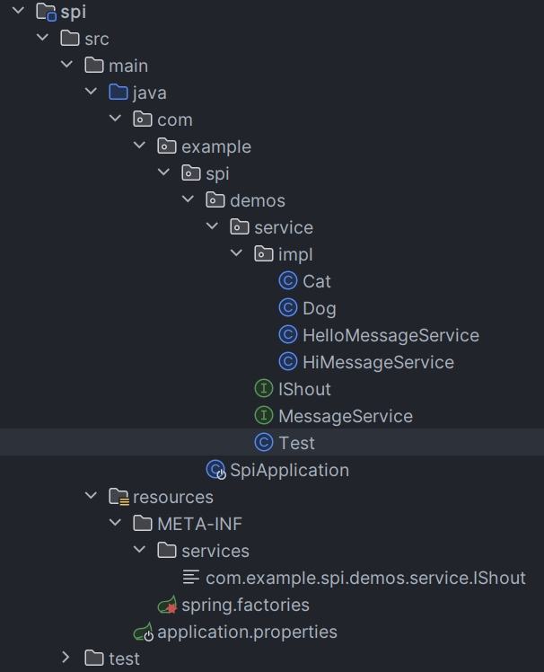

## 什么是 SPI 机制？

在面向的对象的设计里，一般推荐模块之间基于接口编程，模块之间不对实现类进行硬编码。一旦代码里涉及具体的实现类，就违反了可拔插的原则，如果需要替换一种实现，就需要修改代码。为了实现在模块装配的时候能不在程序里动态指明，这就需要一种服务发现机制。

SPI （Service Provider Interface）是专门提供给服务提供者或者扩展框架功能的开发者去使用的一个接口，SPI 将服务接口和具体的服务实现分离开来，将服务调用方和服务实现者解耦，能够提升程序的扩展性、可维护性。修改或者替换服务实现并不需要修改调用方。




## API 与 SPI 区别


| 区别     | API                                                          | SPI                                                          |
| -------- | ------------------------------------------------------------ | ------------------------------------------------------------ |
| 存在位置 | API 依赖的接口位于实现者的包中                               | SPI 依赖的接口在调用方的包中                                 |
| 针对对象 | API 通常是面向最终用户或外部系统的，提供了可直接使用的功能   | SPI 更多是面向系统开发者，为他们提供一种将新服务或插件加入系统的方式 |
| 目的     | API 的主要目的是提供接口供外界访问和使用特定的功能或数据     | SPI 则是为了提供一个标准，允许第三方开发者实现并插入新的服务 |
| 定义方式 | API 是由开发者主动编写并公开给其他开发者使用的               | SPI 是由框架或库提供方定义的接口，供第三方开发者实现         |
| 调用方式 | API 是通过直接调用接口的方法来使用功能                       | SPI 是通过配置文件来指定具体的实现类，然后由框架或库自动加载和调用 |
| 灵活性   | API 的实现类必须在编译时就确定，无法动态替换                 | SPI 的实现类可以在运行时根据配置文件的内容进行动态加载和替换 |
| 依赖关系 | API 是被调用方依赖的，即应用程序需要引入 API 所在的库才能使用其功能 | SPI 是调用方依赖的，即框架或库需要引入第三方实现类的库才能加载和调用 |

## SPI 优缺点

**优点**

使用 Java SPI 机制的优势是实现解耦，使得第三方服务模块的装配控制的逻辑与调用者的业务代码分离，而不是耦合在一起。应用程序可以根据实际业务情况启用框架扩展或替换框架组件。

**缺点**

1. 不能按需加载，需要遍历所有的实现类并实例化，然后在循环中才能找到我们需要的实现类。如果不想用某些实现类，或者某些类实例化很耗时，它也被载入并实例化了，这就造成了浪费。
2. 获取某个实现类的方式不够灵活，只能通过 Iterator 形式获取，不能根据某个参数来获取对应的实现类。（Spring 的 BeanFactory，ApplicationContext 就要高级一些了。）
3. 多个并发多线程使用 ServiceLoader 类的实例是不安全的。

## SPI 使用场景

1. 数据库驱动加载接口实现类的加载：JDBC 加载不同类型数据库的驱动
2. 日志门面接口实现类加载：SLF4J 加载不同提供商的日志实现类
3. Spring 中大量使用了 SPI：对 servlet3.0 规范对 ServletContainerInitializer 的实现、自动类型转换 Type Conversion SPI（Converter SPI、Formatter SPI）等
4. Dubbo：Dubbo 中也大量使用 SPI 的方式实现框架的扩展, 不过它对 Java 提供的原生 SPI 做了封装，允许用户扩展实现 Filter 接口

## SPI 基本使用

### 使用方法

1. 当服务提供者提供了接口的一种具体实现后，在 jar 包的 META-INF/services 目录下创建一个以“接口全限定名”为命名的文件，内容为实现类的全限定名；
2. 接口实现按行配置，可以是多个。如果包含#号，每一行只取第一个#号前的内容。
3. 接口实现类所在的 jar 包放在主程序的 classpath 中；
4. 主程序通过 java.util.ServiceLoder 动态装载实现模块，它通过扫描 META-INF/services 目录下的配置文件找到实现类的全限定名，把类加载到 JVM；

### 使用案例

1. 包结构


2. 接口和方法定义

```java
public interface IShout {

    void shout();
}
```

```java
public class Cat implements IShout {

    @Override
    public void shout() {
        System.out.println("miao miao");
    }
}
```

```java
public class Dog implements IShout {

    @Override
    public void shout() {
        System.out.println("wang wang");
    }
}
```

3. 在项目 META-INF/services 创建一个文本文件：名称为接口的“全限定名”，内容为实现类的全限定名

**com.example.spi.demos.service.IShout**

```tex
com.example.spi.demos.service.impl.Cat
com.example.spi.demos.service.impl.Dog
```

4. 测试

```java
public class Test {

    public static void main(String[] args) {
        ServiceLoader<IShout> shouts = ServiceLoader.load(IShout.class);
        for (IShout s : shouts) {
            s.shout();
        }
    }
}

// 运行结果：
miao miao
wang wang
```

### ServiceLoader 分析


```java
public final class ServiceLoader<S> implements Iterable<S> {
    // 配置文件的路径
    private static final String PREFIX = "META-INF/services/";
	// 待加载的类或接口
    private final Class<S> service;
	// 类加载器
    private final ClassLoader loader;
	// 访问控制器
    private final AccessControlContext acc;
	// 缓存已经加载的实例
    private LinkedHashMap<String,S> providers = new LinkedHashMap<>();
	// 内部类，加载服务类（懒加载）
    private LazyIterator lookupIterator;
    
    // .....
    
	public static <S> ServiceLoader<S> load(Class<S> service) {
        ClassLoader cl = Thread.currentThread().getContextClassLoader();
        return ServiceLoader.load(service, cl);
    }

    public static <S> ServiceLoader<S> load(Class<S> service,
                                            ClassLoader loader) {
        return new ServiceLoader<>(service, loader);
    }

    private ServiceLoader(Class<S> svc, ClassLoader cl) {
        service = Objects.requireNonNull(svc, "Service interface cannot be null");
        loader = (cl == null) ? ClassLoader.getSystemClassLoader() : cl;
        acc = (System.getSecurityManager() != null) ? AccessController.getContext() : null;
        reload();
    }

    public void reload() {
        providers.clear();
        lookupIterator = new LazyIterator(service, loader);
    }
    
    // ........
}
```

1. 应用程序调用 ServiceLoader.load 方法

ServiceLoader.load(Class \< S > service) 方法内先创建一个新的 ServiceLoader，并实例化该类中的成员变量，包括：

- loader（ClassLoader 类型，类加载器）
- acc（AccessControlContext 类型，访问控制器）
- providers（LinkedHashMap <String,S> 类型，用于缓存加载成功的类）
- lookupIterator（实现迭代器功能）

2. ServiceLoader 的构造方法内会调用 reload 方法，来清理缓存，初始化 LazyIterator，注意此处是 Lazy，也就懒加载，此时并不会去加载文件下的内容

3. 当遍历器被遍历时，才会去读取配置文件，应用程序通过迭代器接口获取对象实例

ServiceLoader 先判断成员变量 providers 对象中（LinkedHashMap <String,S> 类型）是否有缓存实例对象，如果有缓存，直接返回。如果没有缓存，执行类的装载

```java
public Iterator<S> iterator() {
    return new Iterator<S>() {
        Iterator<Map.Entry<String, S>> knownProviders = providers.entrySet().iterator();

        public boolean hasNext() {
            if (knownProviders.hasNext())
                return true;
            return lookupIterator.hasNext(); // 调用 LazyIterator
        }

        public S next() {
            if (knownProviders.hasNext())
                return knownProviders.next().getValue();
            return lookupIterator.next(); // 调用 LazyIterator
        }

        public void remove() {
            throw new UnsupportedOperationException();
        }
    };
}
```

4. 读取 META-INF/services 下的配置文件，获得所有能被实例化的类的名称，ServiceLoader 可以跨越 jar 包获取 META-INF 下的配置文件

核心代码如下（即 ServiceLoader 扫描了所有 jar 包下的配置文件。然后通过解析全限定名获得，并在遍历时通过 Class.forName 进行实例化）

```java
private class LazyIterator implements Iterator<S> {

    Class<S> service;
    ClassLoader loader;
    Enumeration<URL> configs = null;
    Iterator<String> pending = null;
    String nextName = null;

    private LazyIterator(Class<S> service, ClassLoader loader) {
        this.service = service;
        this.loader = loader;
    }

    private boolean hasNextService() {
        if (nextName != null) {
            return true;
        }
        if (configs == null) {
            try {
                // 通过PREFIX（META-INF/services/）和类名获取对应的配置文件，得到具体的实现类
                String fullName = PREFIX + service.getName();
                if (loader == null)
                    configs = ClassLoader.getSystemResources(fullName);
                else
                    // 加载配置文件
                    configs = loader.getResources(fullName);
            } catch (IOException x) {
                fail(service, "Error locating configuration files", x);
            }
        }
        // 配置文件解析，获取接口对应的实现类，可以是多个
        while ((pending == null) || !pending.hasNext()) {
            if (!configs.hasMoreElements()) {
                return false;
            }
            pending = parse(service, configs.nextElement());
        }
        nextName = pending.next();
        return true;
    }

    private S nextService() {
        if (!hasNextService())
            throw new NoSuchElementException();
        String cn = nextName;
        nextName = null;
        Class<?> c = null;
        try {
            c = Class.forName(cn, false, loader);
        } catch (ClassNotFoundException x) {
            fail(service,"Provider " + cn + " not found");
        }
        if (!service.isAssignableFrom(c)) {
            fail(service,"Provider " + cn  + " not a subtype");
        }
        try {
            // 实例化并缓存
            S p = service.cast(c.newInstance());
            providers.put(cn, p);
            return p;
        } catch (Throwable x) {
            fail(service,"Provider " + cn + " could not be instantiated",x);
        }
        throw new Error();          // This cannot happen
    }

    public boolean hasNext() {
        if (acc == null) {
            return hasNextService();
        } else {
            PrivilegedAction<Boolean> action = new PrivilegedAction<Boolean>() {
                public Boolean run() { return hasNextService(); }
            };
            return AccessController.doPrivileged(action, acc);
        }
    }

    public S next() {
        if (acc == null) {
            return nextService();
        } else {
            PrivilegedAction<S> action = new PrivilegedAction<S>() {
                public S run() { return nextService(); }
            };
            return AccessController.doPrivileged(action, acc);
        }
    }

    public void remove() {
        throw new UnsupportedOperationException();
    }
}
```

### 自定义 ServiceLoader

```java
public class MyServiceLoader<S> {

    // 对应的接口 Class 模板
    private final Class<S> service;

    // 对应实现类的 可以有多个，用 List 进行封装
    private final List<S> providers = new ArrayList<>();

    // 类加载器
    private final ClassLoader classLoader;

    // 暴露给外部使用的方法，通过调用这个方法可以开始加载自己定制的实现流程。
    public static <S> MyServiceLoader<S> load(Class<S> service) {
        return new MyServiceLoader<>(service);
    }

    // 构造方法私有化
    private MyServiceLoader(Class<S> service) {
        this.service = service;
        this.classLoader = Thread.currentThread().getContextClassLoader();
        doLoad();
    }

    // 关键方法，加载具体实现类的逻辑
    private void doLoad() {
        try {
            // 读取所有 jar 包里面 META-INF/services 包下面的文件，这个文件名就是接口名，然后文件里面的内容就是具体的实现类的路径加全类名
            Enumeration<URL> urls = classLoader.getResources("META-INF/services/" + service.getName());
            // 挨个遍历取到的文件
            while (urls.hasMoreElements()) {
                // 取出当前的文件
                URL url = urls.nextElement();
                System.out.println("File = " + url.getPath());
                // 建立链接
                URLConnection urlConnection = url.openConnection();
                urlConnection.setUseCaches(false);
                // 获取文件输入流
                InputStream inputStream = urlConnection.getInputStream();
                // 从文件输入流获取缓存
                BufferedReader bufferedReader = new BufferedReader(new InputStreamReader(inputStream));
                // 从文件内容里面得到实现类的全类名
                String className = bufferedReader.readLine();

                while (className != null) {
                    // 通过反射拿到实现类的实例
                    Class<?> clazz = Class.forName(className, false, classLoader);
                    // 如果声明的接口跟这个具体的实现类是属于同一类型，（可以理解为Java的一种多态，接口跟实现类、父类和子类等等这种关系。）则构造实例
                    if (service.isAssignableFrom(clazz)) {
                        Constructor<? extends S> constructor = (Constructor<? extends S>) clazz.getConstructor();
                        S instance = constructor.newInstance();
                        // 把当前构造的实例对象添加到 Provider的列表里面
                        providers.add(instance);
                    }
                    // 继续读取下一行的实现类，可以有多个实现类，只需要换行就可以了。
                    className = bufferedReader.readLine();
                }
            }
        } catch (Exception e) {
            System.out.println("读取文件异常。。。");
        }
    }

    // 返回spi接口对应的具体实现类列表
    public List<S> getProviders() {
        return providers;
    }
}
```

1. 通过 URL 工具类从 jar 包的 /META-INF/services 目录下面找到对应的文件，
2. 读取这个文件的名称找到对应的 spi 接口，
3. 通过 InputStream 流将文件里面的具体实现类的全类名读取出来，
4. 根据获取到的全类名，先判断跟 spi 接口是否为同一类型，如果是的，那么就通过反射的机制构造对应的实例对象，
5. 将构造出来的实例对象添加到 Providers 的列表中。

```java
public static void main(String[] args) {
    MyServiceLoader<IShout> shouts = MyServiceLoader.load(IShout.class);
    for (IShout s : shouts.getProviders()) {
        s.shout();
    }
}
```

## SpringBoot 使用 SPI

### 使用方法

Spring Boot 有一个与 SPI 相似的机制，但它并不完全等同于 Java 标准 SPI。

Spring Boot 的自动配置机制主要依赖于 spring.factories 文件。这个文件可以在多个 jar 中存在，并且 Spring Boot 会加载所有可见的 spring.factories 文件。我们可以在这个文件中声明一系列的自动配置类，这样当满足某些条件时，这些配置类会自动被 Spring Boot 应用。

spring.factories 文件中的条目键和值之间不能有换行，即 key = value 形式的结构必须在同一行开始。但是，如果有多个值需要列出（如多个实现类），并且这些值是逗号分隔的，那么可以使用反斜杠（\）来换行。spring.factories 的名称是约定俗成的。如果试图使用一个不同的文件名，那么 Spring Boot 的自动配置机制将不会识别它。

### 使用案例

1. 包结构



2. 接口和方法定义

```java
public interface MessageService {
    String getMessage();
}
```

```java
public class HelloMessageService implements MessageService {

    @Override
    public String getMessage() {
        return "Hello from HelloMessageService!";
    }
}
```

```java
public class HiMessageService implements MessageService {

    @Override
    public String getMessage() {
        return "Hi from HiMessageService!";
    }
}
```

3. 在项目 META-INF 创建一个 spring.factories 文件

```properties
com.example.spi.demos.service.MessageService=com.example.spi.demos.service.impl.HelloMessageService,\
  com.example.spi.demos.service.impl.HiMessageService
```

4. 测试

```java
public class Test {

    public static void main(String[] args) {
        List<MessageService> services = SpringFactoriesLoader.loadFactories(MessageService.class, null);
        for (MessageService service : services) {
            System.out.println(service.getMessage());
        }
    }
}

//运行结果：
Hello from HelloMessageService!
Hi from HiMessageService!
```

### SpringFactoriesLoader 分析

```java
public final class SpringFactoriesLoader {
    // 加载器所需要加载的路径
    public static final String FACTORIES_RESOURCE_LOCATION = "META-INF/spring.factories";

    private static final Log logger = LogFactory.getLog(SpringFactoriesLoader.class);

    private static final Map<ClassLoader, MultiValueMap<String, String>> cache = new ConcurrentReferenceHashMap<>();


    private static Map<String, List<String>> loadSpringFactories(@Nullable ClassLoader classLoader) {
        MultiValueMap<String, String> result = cache.get(classLoader);
        if (result != null) {
            return result;
        }
        try {
            // 根据路径去录取各个包下的文件
            Enumeration<URL> urls = (classLoader != null ?
                classLoader.getResources(FACTORIES_RESOURCE_LOCATION) :
                ClassLoader.getSystemResources(FACTORIES_RESOURCE_LOCATION));
            result = new LinkedMultiValueMap<>();
            // 获取后进行循环遍历，因为不止一个包有spring.factories文件
            while (urls.hasMoreElements()) {
                URL url = urls.nextElement();
                UrlResource resource = new UrlResource(url);
                Properties properties = PropertiesLoaderUtils.loadProperties(resource);
                // 获取到了key和value对应关系
                for (Map.Entry<?, ?> entry : properties.entrySet()) {
                String factoryClassName = ((String) entry.getKey()).trim();
                // 循环获取配置文件的value，并放进result集合中
                for (String factoryName : StringUtils.commaDelimitedListToStringArray((String) entry.getValue())) {
                        result.add(factoryClassName, factoryName.trim());
                	}
                }
            }
            // 并缓存起来，以便后续直接获取
            cache.put(classLoader, result);
            return result;
        } catch (IOException ex) {
            throw new IllegalArgumentException("Unable to load factories from location [" +
                    FACTORIES_RESOURCE_LOCATION + "]", ex);
        }
    }
}
```
