## 概述

MySQL索引是提升数据库查询性能的关键技术，其底层实现依赖于各种高效的数据结构。不同的数据结构适用于不同的查询场景，理解这些数据结构的特点有助于我们选择合适的索引策略和进行性能优化。

## 使用原理

传统的查询方法，是按照表的顺序遍历的，不论查询几条数据，MySQL 需要将表的数据从头到尾遍历一遍。

在我们添加完索引之后，MySQL 一般通过 B树算法生成一个索引文件，在查询数据库时，找到索引文件进行遍历，使用能够大幅地查询的效率的折半查找的方式，找到相应的键从而获取数据。

索引的出现是为了提高数据的查询效率，就像书的目录。但是，创建索引和维护索引需要耗费时间，创建索引是会产生索引文件的，占用磁盘空间。索引文件是一个二叉树类型的文件，DML 操作同样也会对索引文件进行修改，所以性能会相应的有所下降。

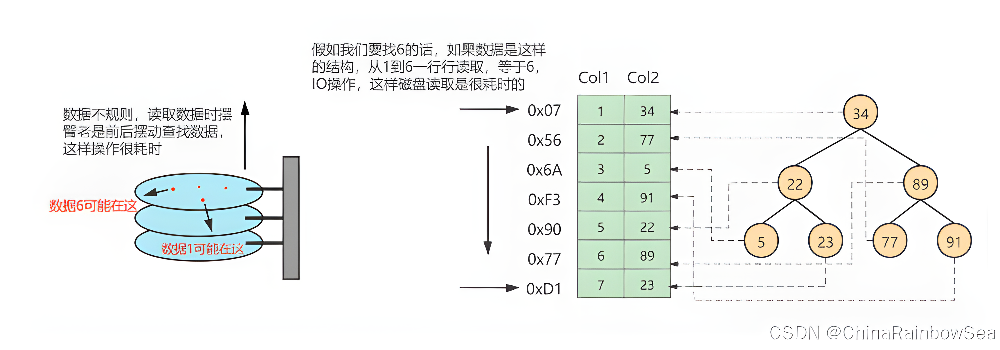

数据库没有索引的情况下，数据分布在硬盘不同的位置上面，读取数据时，摆臂需要前后摆动查询数据，这样操作非常消耗时间。如果数据顺序摆放，那么也需要从1到6行按顺序读取，这样就相当于进行了6次IO操作，依旧非常耗时。如果我们不借助任何索引结构帮助我们快速定位数据的话，我们查找 Col 2 = 89 这条记录，就要逐行去查找、去比较。从Col 2 = 34 开始，进行比较，发现不是，继续下一行。我们当前的表只有不到10行数据，但如果表很大的话，有上千万条数据，就意味着要做很多很多次硬盘I/0才能找到。现在要查找 Col 2 = 89 这条记录。CPU必须先去磁盘查找这条记录，找到之后加载到内存，再对数据进行处理。这个过程最耗时间就是磁盘I/O（涉及到磁盘的旋转时间（速度较快），磁头的寻道时间(速度慢、费时)）

假如给数据使用 二叉树 这样的数据结构进行存储，对字段 Col 2 添加了索引，就相当于在硬盘上为 Col 2 维护了一个索引的数据结构，即这个 二叉搜索树。二叉搜索树的每个结点存储的是 (K, V) 结构，key 是 Col 2，value 是该 key 所在行的文件指针（地址）。比如：该二叉搜索树的根节点就是：(34, 0x07)。现在对 Col 2 添加了索引，这时再去查找 Col 2 = 89 这条记录的时候会先去查找该二叉搜索树（二叉树的遍历查找）。读 34 到内存，89 > 34; 继续右侧数据，读 89 到内存，89==89；找到数据返回。找到之后就根据当前结点的 value 快速定位到要查找的记录对应的地址。我们可以发现，只需要 查找两次 就可以定位到记录的地址，查询速度就提高了。

## 索引分类

1. 从物理存储角度

+ 聚簇索引
+ 非聚簇索引

2. 从数据结构角度

+ 树索引：在 InnoDB 引擎中使用的索引是 B+树，相较于二叉树，B+树这种多叉树更加矮宽，更适合存储在磁盘中
+ Hash 索引：通过 hash 算法快速定位数据，但不适合范围查询，因为每个 key 都要进行一次 hash

3. 从逻辑角度

+ 普通索引：MySQL 中的基本索引类型，允许在定义索引的列中插入重复值和空值
+ 唯一索引：要求索引列的值必须唯一，但允许有空值。如果是组合索引，则列值的组合必须唯一
+ 主键索引：特殊的唯一索引，不允许有空值
+ 组合索引：指在表的多个字段组合上创建的索引，只有在查询条件中使用了这些字段的左边字段时，索引才会被使用，使用组合索引时遵循最左前缀集合
+ 全文索引：全文索引类型为 FULLTEXT，在定义索引的列上支持值的全文查找，允许在这些索引列中插入重复值和空值。全文索引可以在 CHAR、VARCHAR 或者 TEXT 类型的列上创建。MySQL 中只有 MyISAM 存储引擎支持全文索引

## 数据结构对比

### 哈希表

哈希表是一种以键-值（key-value）存储数据的结构，我们只要输入待查找的值即 key，就可以找到其对应的值即 Value。

思路：把值放在数组里，用一个哈希函数把 key 换算成一个确定的位置，然后把 value 放在数组的这个位置。

缺点：多个 key 值经过哈希函数的换算，会出现同一个值的情况。处理这种情况的一种方法是：`链表`。

注意：哈希表后的链表并不是有序的，区间查询的话需要扫描链表，所以哈希表这种结构适用于只有等值查询的场景

### 有序数组

如果仅仅看查询效率，有序数组是非常棒的数据结构。但是在需要更新数据的时候就麻烦了，往中间插入一个记录就必须得挪动后面所有的记录，成本太高。所以有序数组索引只适用于静态存储引擎，比如：你要保存的是 2017 年某个城市的所有人口信息，这类不会再修改的数据。

### 二叉查找树

二叉树具有以下性质：
1. 左子树的键值小于根的键值
2. 右子树的键值大于根的键值

在这种比较平衡的状态下查找时间复杂度是 O(log(n))。

缺点：在某些极端情况下会退化成链表（例如有序数字：2,3,4,6,7,8），这个时候二叉查找树查找的时间复杂度就和链表一样是 O(n)。

### 平衡二叉树（AVL）

AVL Trees (Balanced binary search trees) 平衡二叉树的定义：对于任意一个子树而言，左右子树深度差绝对值不能超过 1。

既然平衡二叉树能通过左旋和右旋保持平衡，不会退化，那么我们用平衡二叉树存储索引可以吗？——可以的。

当我们用树的结构来存储索引的时候，访问一个节点就要跟磁盘之间发生一次 IO。 InnoDB 操作磁盘的最小的单位是一页（或者叫一个磁盘块）。与主存不同，磁盘 I/O 存在机械运动耗费，因此磁盘 I/O 的时间消耗是巨大的。

所以如果每个节点存储的数据太少，从索引中找到我们需要的数据，就要访问更多的节点，意味着跟磁盘交互次数就会过多。那么解决方案是什么？

1. 让每个节点存储更多的数据。
2. 让节点上有更多的关键字。

节点上的关键字的数量越多，我们的指针数也越多，也就是意味着可以有更多的分叉（我们把它叫做“路数”）。因为分叉数越多，树的深度就会减少(根节点是 0)。 这样，树就从瘦高变成了矮胖。这个时候，我们的树就不再是二叉了，而是多叉（或者叫做多路）。

### 多路平衡查找树（B-Tree）

B 树是一种多叉平衡查找树，主要特点：

1. B 树的节点中存储着多个元素，每个内节点有多个分叉。
2. 节点中的元素包含键值和数据，节点中的键值从大到小排列。也就是说，在所有的节点都储存数据。
3. 父节点当中的元素不会出现在子节点中。
4. 所有的叶子结点都位于同一层，叶节点具有相同的深度，叶节点之间没有指针连接。

注意：

1. B 树不支持范围查询的快速查找，如果我们想要查找 10 和 35 之间的数据，查找到 15 之后，需要回到根节点重新遍历查找，需要从根节点进行多次遍历，查询效率有待提高。
2. 如果 data 存储的是行记录，行的大小随着列数的增多，所占空间会变大。这时，一个页中可存储的数据量就会变少，树相应就会变高，磁盘 IO 次数就会变大

### 加强版多路平衡查找树(B+Tree)

B+树，作为 B 树的升级版，MySQL 在 B 树的基础上继续改造，使用 B+树构建索引。B+树和 B 树最主要的区别在于非叶子节点是否存储数据的问题

1. B 树：非叶子节点和叶子节点都会存储数据。
2. B+树：只有叶子节点才会存储数据，非叶子节点只存储键值。叶子节点之间使用双向指针连接，最底层的叶子节点形成了一个双向有序链表。

特点：

1. B+Tree 的磁盘读写能力相对于 B Tree 来说更强（根节点和枝节点不保存数据区，所以一个节点可以保存更多的关键字，一次磁盘加载的关键字更多）
2. 排序能力更强（因为叶子节点上有下一个数据区的指针，数据形成了链表）
3. 效率更加稳定（B+Tree 永远是在叶子节点拿到数据，所以 IO 次数是稳定的）

### 总结

1. B+Tree vs B Tree

B+Tree 只在叶子节点存储数据，而 B 树 的非叶子节点也要存储数据，所以 B+Tree 的单个节点的数据量更小，在相同的磁盘 I/O 次数下，就能查询更多的节点。

B+Tree 叶子节点采用的是双链表连接，适合 MySQL 中常见的基于范围的顺序查找，而 B 树无法做到这一点。

2. B+Tree vs 二叉树

对于有 N 个叶子节点的 B+Tree，其搜索复杂度为 O(logdN)，其中 d 表示节点允许的最大子节点个数为 d 个。在实际的应用当中， d 值是大于 100 的，这样就保证了，即使数据达到千万级别时，B+Tree 的高度依然维持在 3~4 层左右，也就是说一次数据查询操作只需要做 3~4 次的磁盘 I/O 操作就能查询到目标数据。

而二叉树的每个父节点的儿子节点个数只能是 2 个，意味着其搜索复杂度为 O(logN)，这已经比 B+Tree 高出不少，因此二叉树检索到目标数据所经历的磁盘 I/O 次数要更多。

3. B+Tree vs Hash

- 在查询速度上，如果是等值查询，那么 Hash 索引只需要经过一次 Hash 算法即可找到相应的键值，复杂度为 O(1)，这个前提是键值都是唯一的。如果键值不是唯一的（或存在 Hash 冲突），就需要先找到该键所在位置，然后再根据链表往后扫描，直到找到相应的数据，这时候复杂度会变成 O(n)，降低了 Hash 索引的查找效率，所以 Hash 索引通常不会用到重复值多的列上，比如性别、年龄
- Hash 索引是无序的，如果是范围查询检索，这时候 Hash 索引就无法起到作用，即使原先是有序的键值，经过 Hash 算法后也会变成不连续的了。B+tree 索引的叶子节点形成有序链表，便于范围查询
- Hash 索引无法做 like 'xxx%'这样的部分模糊查询，因为需要对完整 key 进行 Hash 运算定位 bucket。而 B+tree 索引具有最左前缀匹配，可以进行部分模糊查询
- Hash 索引中存放的是经过 Hash 计算之后的 Hash 值，而且 Hash 值的大小关系并不一定和 Hash 运算前的键值完全一样，所以数据库无法利用索引的数据来避免任何排序运算。B+tree 索引的叶子节点形成有序链表，可用于排序
- Hash 索引不支持多列联合索引，对于联合索引来说，Hash 索引在计算 Hash 值的时候是将索引键合并后再一起计算 Hash 值，不会针对每个索引单独计算 Hash 值。因此如果用到联合索引的一个或者几个索引时，联合索引将无法使用


## InnoDB中索引的推演

### 索引之前的查找

```sql
SELECT [列名列表] FROM 表名 WHERE 列名 = xxx;
```

1. 在一个页中的查找

假设目前表中的记录比较少，所有的记录都可以被存放到一个页中，在查找记录的时候可以根据搜索条件的不同分为两种情况：

- 以主键为搜索条件

可以在页目录中使用 二分法 快速定位到对应的槽，然后再遍历该槽对用分组中的记录即可快速找到指定记录。

- 以其他列作为搜索条件

因为在数据页中并没有对非主键列简历所谓的页目录，所以我们无法通过二分法快速定位相应的槽。这种情况下只能从 最小记录 开始 依次遍历单链表中的每条记录， 然后对比每条记录是不是符合搜索条件。很显然，这种查找的效率是非常低的。

2. 在很多页中查找

在很多页中查找记录的活动可以分为两个步骤：

- 定位到记录所在的页。
- 从所在的页内中查找相应的记录。

在没有索引的情况下，不论是根据主键列或者其他列的值进行查找，由于我们并不能快速的定位到记录所在的页，所以只能 从第一个页沿着双向链表 一直往下找，在每一个页中根据我们上面的查找方式去查 找指定的记录。因为要遍历所有的数据页，所以这种方式显然是 超级耗时 的。如果一个表有一亿条记录呢？此时 索引 应运而生。

### 设计索引

```sql
mysql> CREATE TABLE index_demo(
-> c1 INT,
-> c2 INT,
-> c3 CHAR(1),
-> PRIMARY KEY(c1)
-> ) ROW_FORMAT = Compact;
```

这个新建的 index_demo 表中有2个INT类型的列，1个CHAR(1)类型的列，而且我们规定了c1列为主键， 这个表使用 Compact 行格式来实际存储记录的。这里我们简化了index_demo表的行格式示意图：

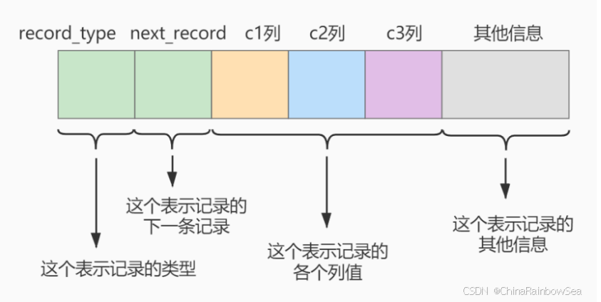

我们只在示意图里展示记录的这几个部分：

- record_type ：记录头信息的一项属性，表示记录的类型， 0 表示普通记录、 2 表示最小记 录、 3 表示最大记录、 1 暂时还没用过，下面讲。
- next_record ：记录头信息的一项属性，表示下一条地址相对于本条记录的地址偏移量，我们用 箭头来表明下一条记录是谁。
- 各个列的值 ：这里只记录在 index_demo 表中的三个列，分别是 c1 、 c2 和 c3 。
- 其他信息 ：除了上述3种信息以外的所有信息，包括其他隐藏列的值以及记录的额外信息。

将记录格式示意图的其他信息项暂时去掉并把它竖起来的效果就是这样：

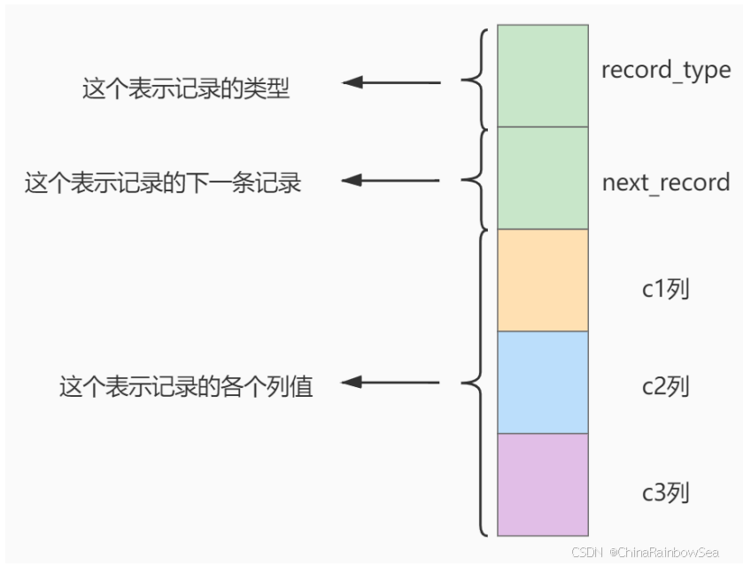

把一些记录放到页里的示意图就是：

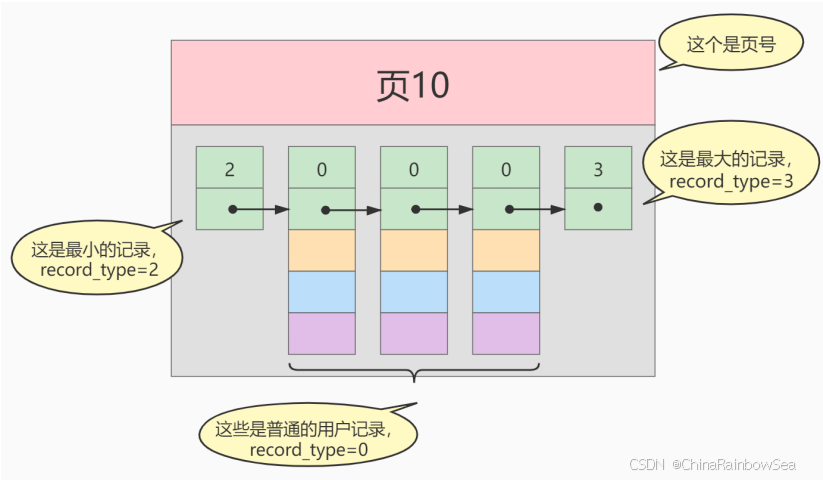

#### 一个简单的索引设计方案

我们在根据某个搜索条件查找一些记录时为什么要遍历所有的数据页呢？因为各个页中的记录并没有规律，我们并不知道我们的搜索条件匹配哪些页中的记录，所以不得不依次遍历所有的数据页。所以如果我们 想快速的定位到需要查找的记录在哪些数据页 中该咋办？我们可以为快速定位记录所在的数据页而建立一个目录 ，建这个目录必须完成下边这些事：

下一个数据页中用户记录的主键值必须大于上一个页中用户记录的主键值。

假设：每个数据结构最多能存放3条记录（实际上一个数据页非常大，可以存放下好多记录）。

```sql
INSERT INTO index_demo VALUES(1, 4, 'u'), (3, 9, 'd'), (5, 3, 'y');
```

那么这些记录以及按照主键值的大小串联成一个单向链表了，如图所示：

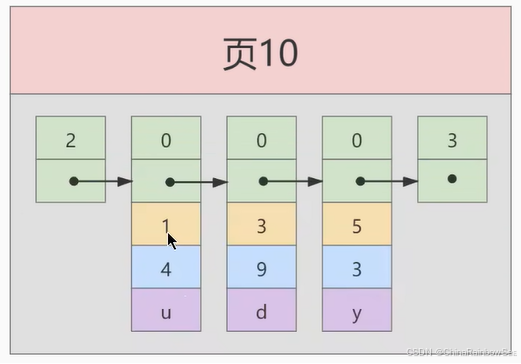

从图中可以看出来， index_demo 表中的3条记录都被插入到了编号为10的数据页中了。此时我们再来插入一条记录

```sql
INSERT INTO index_demo VALUES(4, 4, 'a');
```

因为 页10 最多只能放3条记录，所以我们不得不再分配一个新页：

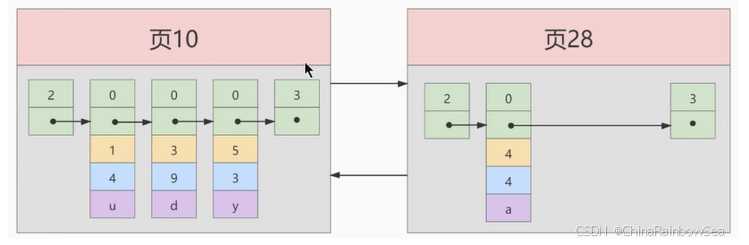

注意：新分配的 数据页编号可能并不是连续的。它们只是通过维护者上一个页和下一个页的编号而建立了 链表 关系。另外，页10中用户记录最大的主键值是5，而页28中有一条记录的主键值是4，因为5>4，所以这就不符合下一个数据页中用户记录的主键值必须大于上一个页中用户记录的主键值的要求，所以在插入主键值为4的记录的时候需要伴随着一次 记录移动，也就是把主键值为5的记录移动到页28中，然后再把主键值为4的记录插入到页10中，这个过程的示意图如下：

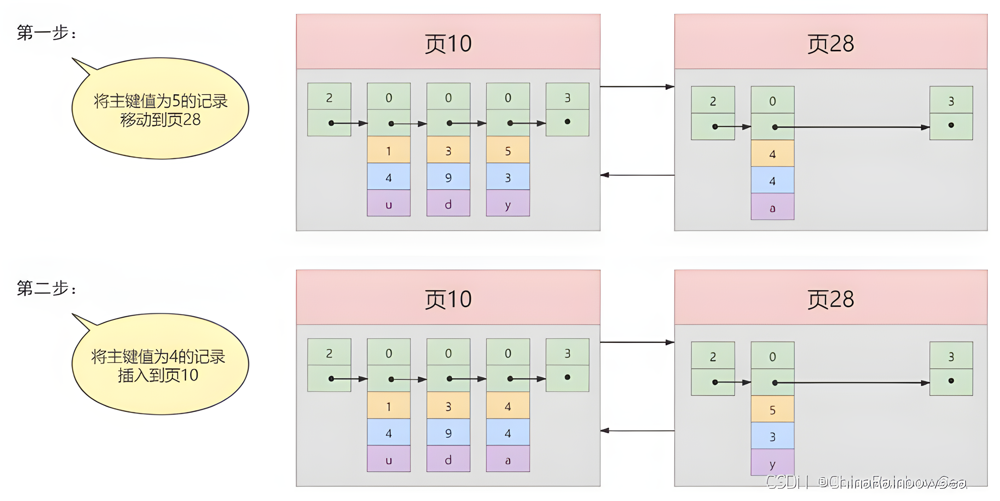

这个过程表明了在对页中的记录进行增删改查操作的过程中，我们必须通过一些诸如 记录移动 的操作来始终保证这个状态一直成立：下一个数据页中用户记录的主键值必须大于上一个页中用户记录的主键值。这个过程称为 页分裂。

#### 给所有的页建立一个目录项

由于数据页的 编号可能是不连续 的，所以在向 index_demo 表中插入许多条记录后，可能是这样的效果：

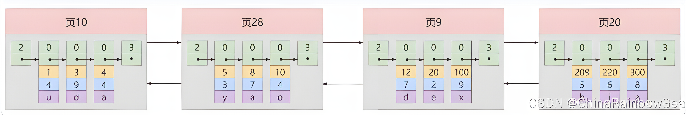

我们需要给它们做个 目录，每个页对应一个目录项，每个目录项包括下边两个部分：

- 页的用户记录中最小的主键值，我们用 key 来表示。
- 页号，我们用 page_on 表示。

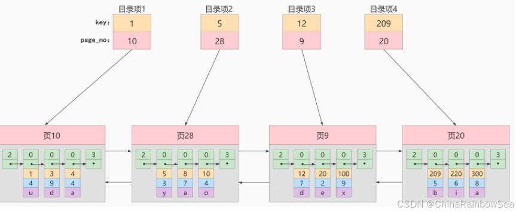

以 页28 为例，它对应 目录项2 ，这个目录项中包含着该页的页号 28 以及该页中用户记录的最小主 键值 5 。我们只需要把几个目录项在物理存储器上连续存储（比如：数组），就可以实现根据主键 值快速查找某条记录的功能了。比如：查找主键值为 20 的记录，具体查找过程分两步：

- 先从目录项中根据 二分法 快速确定出主键值为 20 的记录在 目录项3 中（因为 12 < 20 < 209 ），它对应的页是 页9 。
- 再根据前边说的在页中查找记录的方式去 页9 中定位具体的记录。

至此，针对数据页做的简易目录就搞定了。这个目录有一个别名，称为 索引 。

#### InnoDB中的索引方案

**迭代1次：目录项纪录的页**

InnoDB怎么区分一条记录是普通的 用户记录 还是 目录项记录 呢？使用记录头信息里的 record_type 属性，它的各自取值代表的意思如下：

- 0：普通的用户记录
- 1：目录项记录
- 2：最小记录
- 3：最大记录

我们把前边使用到的目录项放到数据页中的样子就是这样：

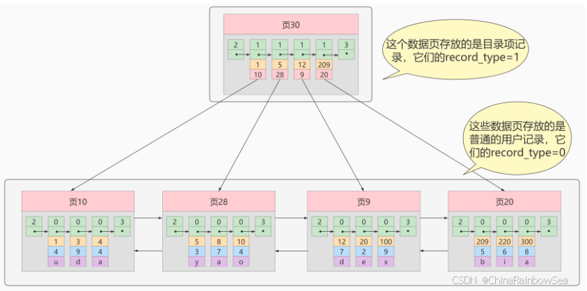

从图中可以看出来，我们新分配了一个编号为30的页来专门存储目录项记录。这里再次强调 目录项记录 和普通的 用户记录 的不同点：

- 目录项记录 的 record_type 值是1，而 普通用户记录 的 record_type 值是0。
- 目录项记录只有 主键值和页的编号 两个列，而普通的用户记录的列是用户自己定义的，可能包含 很多列 ，另外还有InnoDB自己添加的隐藏列。

了解：记录头信息里还有一个叫 min_rec_mask 的属性，只有在存储 目录项记录 的页中的主键值最小的 目录项记录 的 min_rec_mask 值为 1 ，其他别的记录的 min_rec_mask 值都是 0 。

相同点：两者用的是一样的数据页，都会为主键值生成 Page Directory （页目录），从而在按照主键值进行查找时可以使用 二分法 来加快查询速度。

现在以查找主键为 20 的记录为例，根据某个主键值去查找记录的步骤就可以大致拆分成下边两步：

- 先到存储 目录项记录 的页，也就是页30中通过 二分法 快速定位到对应目录项，因为 12 < 20 < 209 ，所以定位到对应的记录所在的页就是页9。
- 再到存储用户记录的页9中根据 二分法 快速定位到主键值为 20 的用户记录。

**迭代2次：多个目录项纪录的页**

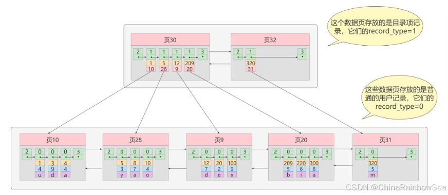

从图中可以看出，我们插入了一条主键值为320的用户记录之后需要两个新的数据页：

- 为存储该用户记录而新生成了 页31 。
- 因为原先存储目录项记录的 页30的容量已满 （我们前边假设只能存储4条目录项记录），所以不得 不需要一个新的 页32 来存放 页31 对应的目录项。

现在因为存储目录项记录的页不止一个，所以如果我们想根据主键值查找一条用户记录大致需要3个步骤，以查找主键值为 20 的记录为例：

- 确定 目录项记录页 我们现在的存储目录项记录的页有两个，即 页30 和 页32 ，又因为页30表示的目录项的主键值的 范围是 [1, 320) ，页32表示的目录项的主键值不小于 320 ，所以主键值为 20 的记录对应的目 录项记录在 页30 中。
- 通过目录项记录页 确定用户记录真实所在的页 。 在一个存储 目录项记录 的页中通过主键值定位一条目录项记录的方式说过了。
在真实存储用户记录的页中定位到具体的记录。

**迭代3次：目录项记录页的目录页**

如果我们表中的数据非常多则会产生很多存储目录项记录的页，那我们怎么根据主键值快速定位一个存储目录项记录的页呢？那就为这些存储目录项记录的页再生成一个更高级的目录，就像是一个多级目录一样，大目录里嵌套小目录，小目录里才是实际的数据，所以现在各个页的示意图就是这样子：

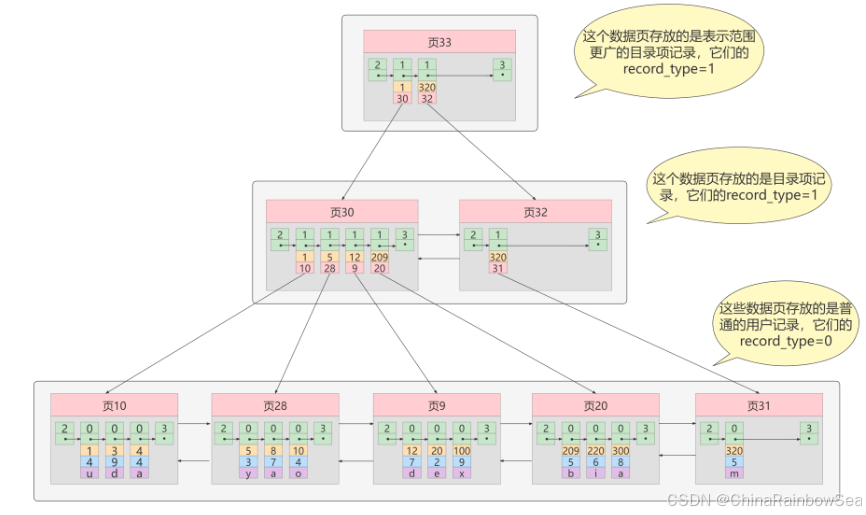

如图，我们生成了一个存储更高级目录项的 页33 ，这个页中的两条记录分别代表页30和页32，如果用 户记录的主键值在 [1, 320) 之间，则到页30中查找更详细的目录项记录，如果主键值 不小于320 的 话，就到页32中查找更详细的目录项记录。

我们可以用下边这个图来描述它：

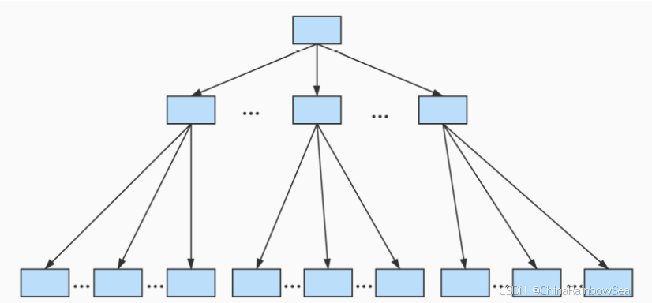

### B+Tree

一个B+树的节点其实可以分成好多层，规定最下边的那层，也就是存放我们用户记录的那层为第 0 层， 之后依次往上加。之前我们做了一个非常极端的假设：存放用户记录的页 最多存放3条记录 ，存放目录项 记录的页 最多存放4条记录 。其实真实环境中一个页存放的记录数量是非常大的，假设所有存放用户记录 的叶子节点代表的数据页可以存放 100条用户记录 ，所有存放目录项记录的内节点代表的数据页可以存 放 1000条目录项记录 ，那么：

- 如果B+树只有1层，也就是只有1个用于存放用户记录的节点，最多能存放 100 条记录。
- 如果B+树有2层，最多能存放 1000×100=10,0000 条记录。
- 如果B+树有3层，最多能存放 1000×1000×100=1,0000,0000 条记录。
- 如果B+树有4层，最多能存放 1000×1000×1000×100=1000,0000,0000 条记录。相当多的记录！

你的表里能存放 100000000000 条记录吗？所以一般情况下，我们用到的 B+树都不会超过4层 ，那我们通过主键值去查找某条记录最多只需要做4个页面内的查找（查找3个目录项页和一个用户记录页），又因为在每个页面内有所谓的 Page Directory （页目录），所以在页面内也可以通过 二分法 实现快速 定位记录。

## 建立索引的原则

适合创建的情况：

1. 在最频繁使用的、用以缩小查询范围的字段上建立索引
2. 经常 GROUP BY 和 ORDER BY 的字段上建立索引
3. 定义有外键的数据列一定要创建索引
4. 使用最频繁的列放到联合索引的左侧，这样也可以较少的建立一些索引。同时，由于"最左前缀原则"，可以增加联合索引的使用率。
5. 在多个字段都要创建索引的情况下，联合索引优于单值索引
6. 字段的数值有唯一性的限制，业务上具有唯一特性的字段，即使是组合字段，也必须建成唯一索引
7. 多表 JOIN 连接操作时，对 WHERE 条件创建索引，对用于连接的字段创建索引，并且该字段在多张表中的 类型必须一致
8. 使用字符串前缀创建索引

不适合创建的情况：

1. 在查询中很少使用或者参考的列不要创建索引。由于这些列很少使用到，增加索引反而会降低系统的维护速度和增大空间需求
2. 只有很少数据值的列也不应该增加索引。由于这些列的取值很少，区分度太小，例如：人事表中的性别，在查询时，需要在表中搜索的数据行的比例很大。增加索引，并不能明显加快检索速度
3. 定义为 text、image 和 bit 数据类型的列不应该增加索引。因为这些列的数据量要么相当大，要么取值很少
4. 当修改性能远远大于检索性能时，不应该创建索引。因为二者是相互矛盾的，当增加索引时，会提高检索性能，但是会降低修改性能
5. 数据量小的表最好不要使用索引，在数据表中的数据行数比较少的情况下，比如不到 1000 行，是不需要创建索引的。

## 索引失效的情况

### 常用场景

1. 索引列参与表达式计算

```sql
-- 不走索引
select 'sname' from 'stu' where 'age'+10=30; 
-- 走索引
select 'sname' from 'stu' where 'age'=30-10;
```

2. 索引列使用函数运算

```sql
select 'sname' from 'stu' where left('date',4)<1990;
```

3. 通配符%开头

```sql
-- 走索引
select * from 'manong' where 'uname' like '码农%';
-- 不走索引
select * from 'manong' where 'uname' like '%码农';
-- 不走索引
select * from 'manong' where 'uname' like '%码农%';
```

4. 查询条件中有 or，即使其中有条件带索引也不会使用，换言之，就是要是使用的所有字段，都必须建立索引

```sql
select * from dept where dname='xxx' or loc='xx'
```

5. 字符串与数字比较不走索引，如果列类型是字符串，那在查询条件中需要将数据用引号引用起来，否则不走索引（可能发生了索引列的隐式转换）

```sql
select * from tb1 where name=12;
```

6. 反向查询!=、<>、NOT IN、IS NOT NULL 不走索引（IN 是走索引的，不等操作是不走索引的）
7. 使用联合索引查询时，不满足最左前缀原则
8. 正则表达式不使用索引
9. MySQL 内部优化器会对 SQL 语句进行优化，如果优化器估计使用全表扫描要比使用索引快，则不使用索引（例如：查询返回数据超过了表的 30%）

### 最左前缀原则

建立（a, b, c）联合索引时

1. 完全匹配左边的列

```sql
WHERE A = ? AND B = ? AND C = ?;
-- 能使用索引。因为完全匹配了索引的所有三列，能够充分利用联合索引。
WHERE A = ? AND B = ?;
-- 能使用索引。匹配了索引的前两列 A 和 B，因此可以走索引。
WHERE A = ?;
-- 能使用索引。只匹配了索引的第一列 A，仍然可以走索引。
```

2. 跳过中间的列

```sql 
WHERE B = ?;
-- 不能使用索引。因为跳过了索引的第一列 A，违反了最左前缀法则。
WHERE A = ? AND C = ?;
-- 能部分使用索引。MySQL 可以利用联合索引的第一列 A，但无法利用 C 列。也就是说，索引只会在 A 上起作用，C 则需要额外扫描。
```

3. 前缀匹配（范围查询）

```sql
WHERE A = ? AND B > ?;
-- 能使用索引。因为范围查询 B > ? 仍然符合最左前缀法则，因此索引可以被使用，但索引只能用于 A 和 B，无法用于 C。
WHERE A = ? AND B = ? AND C > ?;
-- 能使用索引。完全匹配了 A 和 B，且 C 是范围查询，因此可以走索引，且能利用 C。
```

4. LIKE 模糊查询

```sql
WHERE A = ? AND B LIKE 'abc%';
-- 能使用索引。因为 LIKE 前面部分是常量，不是以通配符开头，所以索引可以用。
WHERE A = ? AND B LIKE '%abc';
-- 不能使用索引。因为 LIKE 以 % 开头，无法使用索引。
```

5. 只查询部分列

```sql
WHERE C = ?;
-- 不能使用索引。因为跳过了前面的 A 和 B 列，违反了最左前缀法则。
```

B+树的数据项是复合的数据结构，比如：（name, age, sex）的时候，B+树是按照从左到右的顺序来建立搜索树的，当（小明,22, 男）这样的数据来检索的时候，B+树会优先比较 name 来确定下一步的搜索方向，如果 name 相同再依次比较 age 和 sex，最后得到检索的数据。但当（22, 男）这样没有 name 数据的时候，B+树就不知道第一步该查哪个节点，因为建立搜索树的时候 name 就是第一个比较因子，必须要先根据 name 来搜索才能知道下一步去哪里查询。

**注意**

1. = 和 in 可以乱序

比如：a = 1 and b = 2 and c = 3 建立（a, b, c）索引可以任意顺序，MySQL 的优化器会优化成索引可以识别的形式

2. 最左前缀匹配原则会一直向右匹配直到遇到范围查询（>、<、between、like %）就停止匹配

比如：a = 1 and b = 2 and c > 3 and d = 4，如果建立（a, b, c, d）顺序的索引，d 是用不到索引的。如果建立（a, b, d, c）的索引则都可以用到，a、b、d 的顺序可以任意调整

### 使用案例

1. \> 和 <（select * from t_table where a > 1 and b = 2）

由于联合索引（二级索引）是先按照 a 字段的值排序的，所以符合 a > 1 条件的二级索引记录肯定是相邻，于是在进行索引扫描的时候，可以定位到符合 a > 1 条件的第一条记录，然后沿着记录所在的链表向后扫描，直到某条记录不符合 a > 1 条件位置。所以 a 字段可以在联合索引的 B+Tree 中进行索引查询。但是在符合 a > 1 条件的二级索引记录的范围里，b 字段的值是无序的。因此，我们不能根据查询条件 b = 2 来进一步减少需要扫描的记录数量

因此这条查询语句只有 a 字段用到了联合索引进行索引查询，而 b 字段并没有使用到联合索引。

2. \>= 和 <=（select * from t_table where a > = 1 and b = 2）

虽然在符合 a >= 1 条件的二级索引记录的范围里，b 字段的值是「无序」的，但是对于符合 a = 1 的二级索引记录的范围里，b 字段的值是「有序」的（因为对于联合索引，是先按照 a 字段的值排序，然后在 a 字段的值相同的情况下，再按照 b 字段的值进行排序）

所以这条查询语句 a 和 b 字段都用到了联合索引进行索引查询。

3. between（select * from t_table where a between 2 and 8 and b = 2）

查询条件中 a between 2 and 8 的意思是查询 a 字段的值在 2 和 8 之间的记录。不同的数据库对 BETWEEN ... AND 处理方式是有差异的。在 MySQL 中，BETWEEN 包含了 value1 和 value2 边界值，类似于 >= and = <。而有的数据库则不包含 value1 和 value2 边界值（类似于 > and <）

因此这条查询语句 a 和 b 字段都用到了联合索引进行索引查询。

4. like（select * from t_user where name like 'j%' and age = 22）

由于联合索引（二级索引）是先按照 name 字段的值排序的，所以前缀为 ‘j’ 的 name 字段的二级索引记录都是相邻的， 于是在进行索引扫描的时候，可以定位到符合前缀为 ‘j’ 的 name 字段的第一条记录，然后沿着记录所在的链表向后扫描，直到某条记录的 name 前缀不为 ‘j’ 为止。

虽然在符合前缀为 ‘j’ 的 name 字段的二级索引记录的范围里，age 字段的值是「无序」的，但是对于符合 name = j 的二级索引记录的范围里，age 字段的值是「有序」的（因为对于联合索引，是先按照 name 字段的值排序，然后在 name 字段的值相同的情况下，再按照 age 字段的值进行排序）

所以这条查询语句 a 和 b 字段都用到了联合索引进行索引查询。

### 模糊查询

在 MySQL 中模糊查询 mobile like '%8765'，这种情况是不能使用索引的，我们可以加入冗余列（MySQL5.7 之后加入了虚拟列，使用虚拟列更合适），如 mobile 为 123456，则 mobile_reverse 存储 654321，为 mobile_reverse 列建立索引，查询中使用语句 mobile_reverse like reverse('%456')即可。reverse 是 MySQL 中的反转函数，这种语句是可以使用索引的

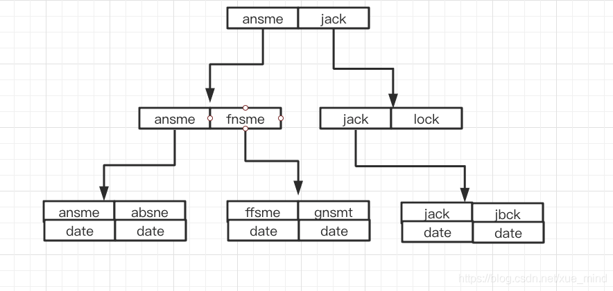

**%在前面索引为什么会失效？**

索引的排序顺序是根据比较字符串的首字母排序的，如果首字母相同，就根据比较第二个字母进行排序，以此类推。在进行模糊查询的时候，如果把%放在了前面，最左的 n 个字母是模糊不定的，无法根据索引的有序性准确地定位到某一个索引，只能进行全表扫描，找出符合条件的数据。