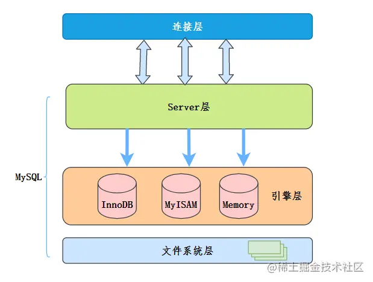
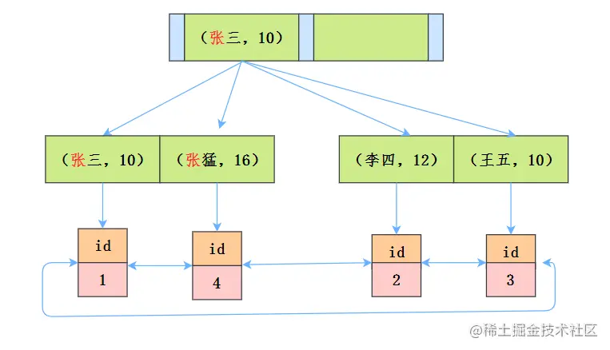
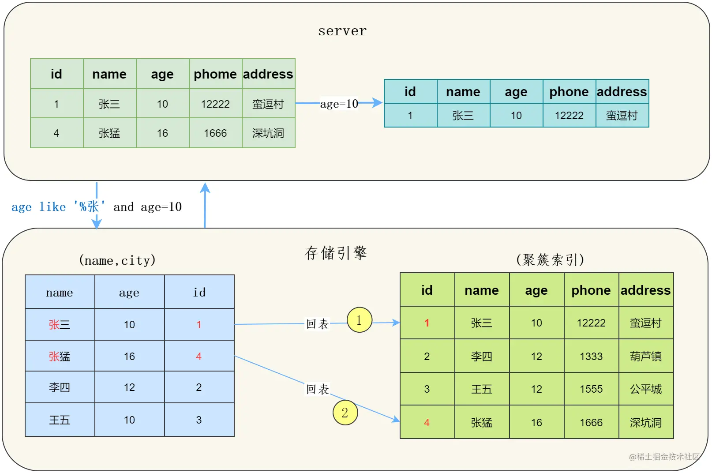
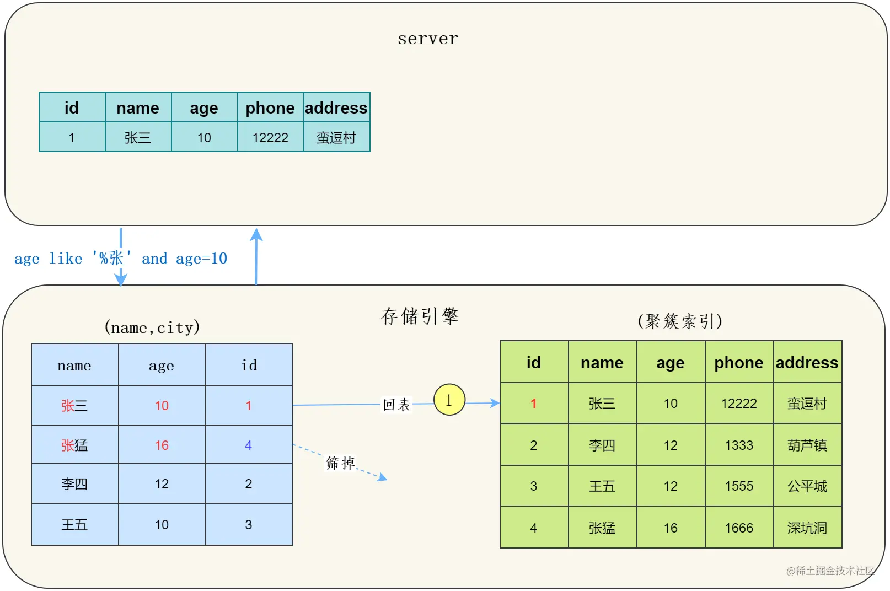

## 回表查询

如果索引的列在 select 所需获取的列中（因为在 mysql 中索引是根据索引列的值进行排序的，所以索引节点存在该列中的部分值）或者根据一次索引查询就能获得记录就不需要回表，如果 select 所需获得列中有大量的非索引列，索引就需要到表中找到相应的列的信息，这就叫回表

**产生场景**

1. 查询字段不全：当查询的字段不完全包含在索引中时，MySQL需要通过主键或唯一键，从表中取出其他字段。
2. 复合索引未覆盖所有查询字段：如果查询条件包含组合索引的一部分字段，但没有包含所有字段，MySQL也需要回表查询。

**使用案例**

```sql
create table xttblog(
    id int primary key, 
    k int not null, 
    name varchar(16),
    index (k)
)engine = InnoDB;
```

```sql
select * from xttblog where ID = 2;
-- 这条 SQL 语句就不需要回表。原因是根据主键的查询方式，则只需要搜索 ID 这棵 B+ 树。主键是唯一的，根据这个唯一的索引，MySQL 就能确定搜索的记录。

select * from xttblog where k = 2;
-- 通过 k 这个普通索引查询方式，则需要先搜索 k 索引树，然后得到主键 ID 的值为 1，再到 ID 索引树搜索一次。这个过程虽然用了索引，但实际上底层进行了两次索引查询，这个过程就称为回表。
```

**注意**

1. 基于非主键索引的查询需要多扫描一颗索引树
2. 使用聚集索引（主键或第一个唯一索引）就不会回表，普通索引可能会回表

## 索引覆盖

1. 索引覆盖：只需要在一颗索引树上就能获取 SQL 所需的所有列数据，无需回表，速度更快
2. 查看触发情况：explain 的输出结果 Extra 字段为 Using index 时即触发索引覆盖
3. 实现索引覆盖的方法：将被查询的字段，建立到索引里去

**使用案例**

```sql
CREATE TABLE users (
    id INT PRIMARY KEY,         -- 主键
    name VARCHAR(50),           -- 用户名
    email VARCHAR(50),          -- 邮箱
    age INT,                    -- 年龄
    INDEX idx_name_email (name, email) -- 联合索引
);
```

1. 索引覆盖的情况

```sql
SELECT name, email FROM users WHERE name = 'Alice';
-- 索引 idx_name_email 包含 name 和 email，查询的字段完全被索引覆盖。
-- MySQL 可以直接从索引中返回结果，无需访问实际表数据。
```

2. 索引不覆盖的情况

```sql
SELECT name, email, age FROM users WHERE name = 'Alice';
-- 索引 idx_name_email 包含了 name 和 email，但不包含 age。
-- 查询时，MySQL 会从索引中找到符合 name = 'Alice' 的记录，然后通过主键回表查找 age 字段。
```

3. 索引部分使用的情况

```sql
SELECT email FROM users WHERE name = 'Alice';
-- 查询使用索引 idx_name_email 的 name 列作为过滤条件，并获取email 列。这依然属于索引覆盖查询，因为所需的字段都在索引中。
```

## 索引下推（ICP）



索引下推（Index Condition Pushdown，简称 ICP）：指将部分上层（服务层）负责的事情，交给了下层（引擎层）去处理，它能减少回表查询次数，提高查询效率。

**使用原理**

1. 在没有使用 ICP 的情况下

+ 存储引擎读取索引记录
+ 根据索引中的主键值，定位并读取完整的行记录
+ 存储引擎把记录交给 Server 层去检测该记录是否满足 WHERE 条件

2. 使用 ICP 的情况下

+ 存储引擎读取索引记录（不是完整的行记录）
+ 判断 WHERE 条件部分能否用索引中的列来做检查。条件不满足，则处理下一行索引记录；
+ 条件满足，使用索引中的主键去定位并读取完整的行记录（回表）
+ 存储引擎把记录交给 Server 层，Server 层检测该记录是否满足除 WHERE 条件的其他部分

**使用条件**

1. 只能用于 range、ref、eq_ref、ref_or_null 访问方法；
2. 只能用于 InnoDB 和 MyISAM 存储引擎及其分区表；
3. 对 InnoDB 存储引擎来说，索引下推只适用于二级索引（也叫辅助索引）; 对于 InnoDB 的聚簇索引来说，数据和索引是在一起的，不存在回表这一说。
4. 引用了子查询的条件不能下推；
5. 引用了存储函数的条件不能下推，因为存储引擎无法调用存储函数。

**使用案例**

```sql
-- 检索出表中名字第一个字是张，而且年龄是 10 岁的所有用户
select * from tuser where name like '张%' and age=10;
```



1. 没有使用 ICP

在 MySQL5.6 之前，存储引擎根据通过联合索引找到 name like '张%'的主键 id（1、4），逐一进行回表扫描，去聚簇索引找到完整的行记录，server 层再对数据 age = 10 进行筛选。可以看到需要回表两次，浪费了字段 age



2. 使用 ICP

MySQL5.6 以后，存储引擎根据（name，age）联合索引，找到 name like '张%'，由于联合索引中包含 age 列，所以存储引擎直接在联合索引里按照 age = 10 过滤，按照过滤后的数据再一一进行回表扫描，只回表了一次，使用 explain 查询，Extra 列中有 Using index condition

