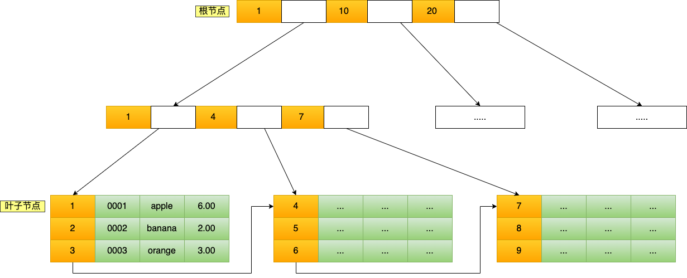
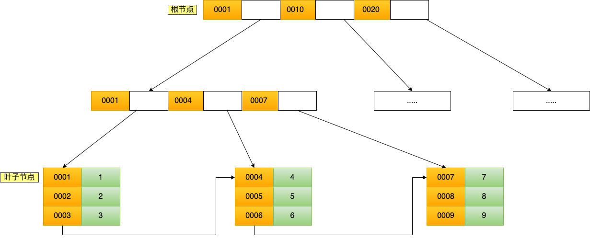

## 前缀索引

指使用字段的前部分字符建立索引，而不是在整个字段上建立索引

1. 优点：可以节省索引的空间，提高索引效率
2. 缺点：降低索引的选择性（不重复数量/总数量），覆盖索引失效，order by 上不能使用前缀索引
3. 使用场景：字段的前部分内容区分度高，后部分区分度低，如：邮箱地址-zhangsan@qq.com

**前缀索引对覆盖索引的影响**

```sql
select id,email from User where email='zhangsan@xx.com';
select id,name,email from User where email='zhangsan@xx.com';
-- 第一句SQL相比于第二条SQL，只返回了id和email。如果使用email整个字符串作为索引的话，可以利用覆盖索引，从index1查到结果直接返回，不需要回表。但是如果使用前缀索引的话，是需要回表进行判断的。
```

## 自适应哈希索引（AHI）

自适应哈希索引是 Innodb 引擎的一个特殊功能，当它注意到某些索引值使用的非常频繁，发现建立哈希索引（又称散列索引）可以带来速度的提升，Innodb 就会在自己的内存缓冲区（Buffer Pool）里，开辟一块区域，建立自适应哈希索引（Adaptive Hash Index，AHI），以便加速查询。

InnoDB 会进行自调优，如果判定建立哈希索引能够提升查询效率，InnoDB 自己会在内存中建立相关哈希索引（所以这就是 Adaptive——“自适应”的由来），不需要人工手动干预，InnoDB 会根据所需自己创建自适应哈希索引。AHI 是通过缓冲池的 B+树页构造而来，因此建立的速度很快，而且不需要对整张表构建哈希索引。

AHI 有一个要求，即对这个页的连续访问模式必须是一样的，例如：对于(a, b)这样的联合索引页，其访问模式可以是：

1. where a = xxx
2. where a = xxx and b = xxx

访问模式一样指的是查询的条件一样，若交替进行上述两种查询，那么 InnoDB 存储引擎不会对该页造成 AHI

## 底层数据结构

MySQL 的数据是持久化的，意味着数据（索引+记录）是保存到磁盘上的，因为这样即使设备断电了，数据也不会丢失。

内存的访问速度是纳秒级别的，而磁盘访问的速度是毫秒级别的，也就是说读取同样大小的数据，磁盘中读取的速度比从内存中读取的速度要慢上万倍，甚至几十万倍。

磁盘读写的最小单位是扇区，扇区的大小只有 512B 大小，操作系统一次会读写多个扇区，所以操作系统的最小读写单位是块（Block）。Linux 中的块大小为 4KB，也就是一次磁盘 I/O 操作会直接读写 8 个扇区。

由于数据库的索引是保存到磁盘上的，因此当我们通过索引查找某行数据的时候，就需要先从磁盘读取索引到内存，再通过索引从磁盘中找到某行数据，然后读入到内存，也就是说查询过程中会发生多次磁盘 I/O，而磁盘 I/O 次数越多，所消耗的时间也就越大。所以，我们希望索引的数据结构能在尽可能少的磁盘的 I/O 操作中完成查询工作，因为磁盘 I/O 操作越少，所消耗的时间也就越小。

### 树的高度

索引的数据结构和具体存储引擎的实现有关，在 MySQL 中使用较多的索引有 Hash 索引、B+树索引等，经常使用的 InnoDB 存储引擎的默认索引实现为 B+树索引

**增加 B+树的路数可以降低树的高度，那么无限增加树的路数是不是可以有最优的查找效率？**

不可以，因为这样会形成一个有序数组，文件系统和数据库的索引都是存在硬盘上的，并且如果数据量大的话，不一定能一次性加载到内存中。有序数组没法一次性加载进内存，这时 B+树的多路存储威力就出来了，可以每次加载 B+树的一个结点，然后一步步往下找

### 聚簇索引（InnoDB）

聚集索引表记录的排序顺序和索引的排列顺序一致，所以查询速度快，对应的缺点就是修改慢，因为为了保证表中记录的物理和索引顺序一致，在记录插入的时候，会对数据页重新排序（因为在真实物理存储器的存储顺序只能有一种，而插入新数据必然会导致主键索引树的变化，主键索引树的顺序发生了改变，叶子节点中存储的行数据也要随之进行改变，就会发生大量的数据移动操作，所以效率会慢），因为在物理内存中的顺序只能有一种，所以聚集索引在一个表中只能有一个

聚簇索引是对磁盘上实际数据重新组织以按指定的一个或多个列的值排序的算法。他的数据行只存放在索引（B+树）的叶子中，内部节点不存放数据，找到了索引也就找到了数据



特点：

1. 存储数据的顺序和索引顺序一致，一般情况下主键会默认创建聚簇索引，且一张表只允许存在一个聚簇索引。
2. 如果表中没有定义主键，InnoDB 会选择一个唯一的非空索引代替；
3. 如果表中没有这样的索引，InnoDB 会隐式定义一个主键来作为聚簇索引

注意：

1. 数据库的索引和数据都是存储在硬盘的，我们可以把读取一个节点当作一次磁盘 I/O 操作。那么上面的整个查询过程一共经历了 3 个节点，也就是进行了 3 次 I/O 操作。
2. B+Tree 存储千万级的数据只需要 3-4 层高度就可以满足，这意味着从千万级的表查询目标数据最多需要 3-4 次磁盘 I/O，所以 B+Tree 相比于 B 树和二叉树来说，最大的优势在于查询效率很高，因为即使在数据量很大的情况，查询一个数据的磁盘 I/O 依然维持在 3-4 次。

### 非聚簇索引（MyISAM）

非聚簇索引指 B+树的叶子节点上的 data，并不是数据本身，而是主键值，主要用在 MyISAM 存储引擎中。访问数据总是需要二次查找，第一次找到主键值，第二次根据主键值找到行数据



会先检查二级索引中的 B+Tree 的索引值，找到对应的叶子节点，然后获取主键值，然后再通过主键索引中的 B+Tree 树查询到对应的叶子节点，然后获取整行数据。这个过程叫回表，也就是说要查两个 B+Tree 才能查到数据。

当查询的数据是能在二级索引的 B+Tree 的叶子节点里查询到，这时就不用再查主键索引查。这种在二级索引的 B+Tree 就能查询到结果的过程就叫作覆盖索引，也就是只需要查一个 B+Tree 就能找到数据

### 聚簇 VS 非聚簇索引

1. 聚簇索引的叶子节点存储索引值和行数据；非聚簇索引的叶子节点存储索引值和主键值
2. 聚簇索引一个表只能有一个；而非聚簇索引一个表可以存在多个
3. 聚集索引存储记录是物理上连续存在；而非聚集索引是逻辑上的连续，物理存储并不连续
4. 聚集索引的物理存储按照索引排序，是一种索引组织形式，索引的键值逻辑顺序决定了数据行的物理存储顺序；非聚集索引的物理存储不按照索引排序，是普通索引，仅仅是对数据列创建相应的索引，不影响整个表的物理存储顺序


## 文件排序（FileSort）

当对 sql 进行 order by 排序的时候，需要尽可能地使用索引排序，如果无法使用索引排序，mysql 就会使用文件排序

1. 双路排序：先根据相应的条件取出相应的排序字段和可以直接定位行数的行 ID，然后在 sort buffer 中进行排序，排序完后再次取回其他需要的字段
2. 单路排序：一次性取出满足条件行的所有字段，然后在 sort buffer 中进行排序

```sql
select * from user where name="hello" order by age
```

### 双路排序过程

1. 从索引 name 找到第一个满足 name = "hello" 的主键 id
2. 根据主键 id 取出整行，把排序字段 age 和主键 id 这两个字段放在 sort buffer（排序缓存）中
3. 从索引 name 取下一个满足 name = "hello" 的主键 id
4. 重复 3、4，直到不满足 name = "hello"
5. 对 sort buffer 中的字段 age 和主键 id 按照 age 进行排序
6. 遍历排序好的 id 和字段 age，按照 id 的值回到原表中取出所有字段的值返回给客户端

### 单路排序过程

1. 从索引 name 找到第一个满足 name = "hello" 条件的主键 id
2. 根据主键 id 取出整行，取出所有字段的值，存入 sort buffer 中
3. 从索引 name 找到下一个满足 name = "hello" 条件的主键 id
4. 重复 2、3，直到不满足 name = "hello"
5. 对 sort buffer 中的数据按照字段 age 进行排序
6. 返回结果给客户端

### 结论

1. 单路排序会一次性取出满足条件行的所有字段，然后在 sort buffer 中进行排序；
2. 双路排序（又叫回表排序模式）是首先取出相应的排序字段和可以直接定位行数据的行 ID，然后在 sort buffer 中进行排序，排序完后需要再次取回其它需要的字段；

**using index 和 using filesort**

1. using index 是用到了二级索引树，按照索引树的顺序去排序的；
2. using filesort 是没有用到二级索引树的，而是用到了主键索引，他是把整张表的数据加载到内存，去进行一个排序；

因为 using filesort 是拿的主键索引（整张表的数据），而 using index 拿的是二级索引比主键索引相对小太多，所以 using index 效率会快很多。

### 排序选择

MySQL 通过比较系统变量 max_length_for_sort_data（默认 1024 字节）的大小和需要查询的字段总大小来判断使用哪种排序模式。

1. 如果字段的总长度小于 max_length_for_sort_data，那么使用单路排序模式；
2. 如果字段的总长度大于 max_length_for_sort_data，那么使用双路排序模式。

### 内存不足怎么处理的？

```sql
-- 使用临时文件的个数，这个值如果为0代表全部使用的sort_buffer内存排序，否则使用的磁盘文件排序
"number_of_tmp_files": 3,                
```

如果为 0，则使用排序缓存区；不为 0，则使用磁盘文件排序；

### 出现的条件

1. order by 字段不是索引字段
2. order by 字段是索引字段，但是 select 中没有使用覆盖索引，如：select * from user order by age asc;
3. order by 中同时存在 ASC 和 DESC 排序，如：select a, b from user order by a asc, b desc
4. order by 多个字段排序时，不是按照索引顺序进行 order by，即不是按照最左前缀法则
5. order by 语句中索引列使用了表达式，包括函数表达式

## 索引重构

### 什么时候需要重建索引呢？

1. 表上频繁发生 update，delete 操作
2. 表上发生了 alter table...move 操作（move 操作导致了 rowid 变化）

### 怎么判断索引是否应该重建？

1. 一般看索引是否倾斜的严重，是否浪费了空间，对索引进行结构分析：

analyze index  index_name validate structure;

2. 在相同的 session 中查询 index_stats 表：

select height, DEL_LF_ROWS/LF_ROWS from index_stats;

当查询的 height >= 4（索引的深度，即从根到叶节点的高度）或 DEL_IF_ROWS/LF_ROWS > 0.2 的情况下，就应该考虑重建该索引

### 如何重建索引？

1. drop 原索引，然后再创建索引（这种方式相当耗时，一般不建议使用）

```sql
drop index index_name;
create index index_name on table_name (index_column);
```

2. 直接重建索引（方法较快，建议使用）

```sql
alter index indexname rebuild;
alter index indexname rebuild online;
```

rebuild 是快速重建索引的一种有效的办法，因为它是一种使用现有索引项来重建索引项的方法，如果重建索引时有其他用户在对这个表操作，尽量使用带 online 参数来最大限度的减少索引重建时将会出现的任何加锁问题。由于新旧索引在建立时同时存在，因此，使用这种重建方法需要有额外的磁盘空间可供临时使用，当索引建完后把老索引删除，如果没有成功，也不影响原来的索引，利用这种办法可以用来将一个索引移到新的表空间

### 重建索引的过程

1. Rebuild 以 index fast full scan 或 table full scan（采用哪种方式取决于 cost）读取原索引中的数据来构建一个新的索引，重建过程中有排序操作，rebuild online 执行表扫描获取数据，重建过程中有排序的操作
2. Rebuild 会阻塞 DML 操作，rebuild online 不会阻塞 DML 操作
3. rebuild online 时系统会产生一个 SYS_JOURNAL_xxx 的 IOT 类型的系统临时日志表，所有 rebuild online 时索引的变化都记录在这个表中，当新的索引创建完成后，把这个表的记录维护到新的索引中去，然后 drop 掉旧的索引，rebuild online 就完成了

### 注意事项

1. 执行 rebuild 操作时，需要检查表空间是否足够
2. 虽然说 rebuild online 操作允许 DML 操作，但还是建议在业务不繁忙时段进行
3. Rebuild 操作会产生大量 Redo Log

## 索引长度限制

1. 对于 MyISAM 表，组合索引的长度跟各个列总和长度有关

+ 字符编码为 utf8，组合索引长度和不能超过 333，超过则创建失败。单列索引不能超过 333，如果字符超过 333，则最终创建的是前缀索引（即取前 333 个字节）
+ 字符编码为 latin1，组合索引长度和不能超过 1000，超过则创建失败。单列索引不能超过 1000，超过则最终创建的是前缀索引（即取前 1000 个字节）

2. 对于 InnoDB 表，组合索引的长度跟各列的长度和无关，跟单列的长度有关，且能创建成功

+ 字符编码为 utf8，组合索引长度最大为列数*255，单列索引长度最大为 255
+ 字符编码为 latin1，组合索引长度最大为列数*767，单列索引长度最大为 767

注意：索引的长度跟数据引擎有关，还和字符编码有关
