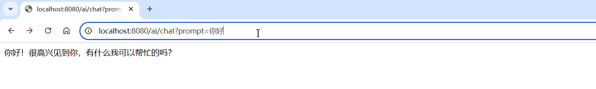
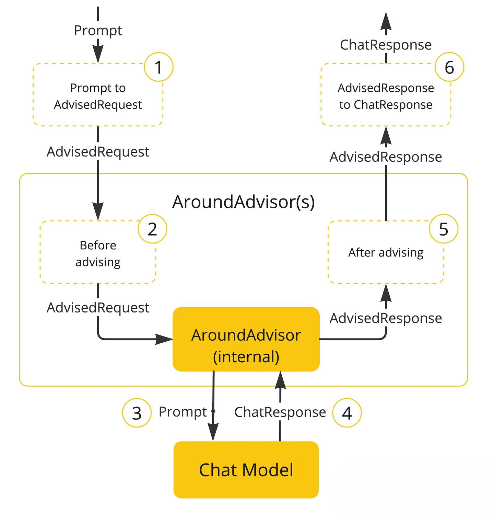

## 依赖及配置

```xml
<dependency>
    <groupId>org.springframework.boot</groupId>
    <artifactId>spring-boot-starter-web</artifactId>
</dependency>

<dependency>
    <groupId>org.springframework.ai</groupId>
    <artifactId>spring-ai-starter-model-openai</artifactId>
    <version>1.1.0</version>
</dependency>

<dependencyManagement>
    <dependencies>
        <dependency>
            <groupId>org.springframework.boot</groupId>
            <artifactId>spring-boot-dependencies</artifactId>
            <version>3.3.0</version>
            <type>pom</type>
            <scope>import</scope>
        </dependency>
        <dependency>
            <groupId>org.springframework.ai</groupId>
            <artifactId>spring-ai-bom</artifactId>
            <version>1.1.0</version>
        </dependency>
    </dependencies>
</dependencyManagement>
```

```yaml
spring:
  ai:
    # OpenAI 相关配置
    openai:
      # API基础URL，这里配置的是阿里云百炼平台的兼容模式地址
      base-url: https://dashscope.aliyuncs.com/compatible-mode
      # API密钥，用于身份验证
      api-key: 
      # 聊天模型相关配置
      chat:
        options:
          # 指定使用的模型为qwen3-max（通义千问大模型）
          model: qwen3-max
          # 设置温度参数为0.75，控制输出的随机性，值越高结果越随机
          temperature: 0.75
```

## 消息类型介绍

Spring AI 中提供了四种消息角色：

1. System Role（系统角色）：指导 AI 的行为和响应风格，设定 AI 解释和回复输入的参数或规则。这类似于在开始对话之前向 AI 提供指示。
2. User Role（用户角色）：表示用户输入的内容，用于描述对 AI 的提问、命令或陈述信息。该角色构成了 AI 回应的基础。
3. Assistant Role（助理角色）：AI 对用户输入的响应。它不仅仅是一个答案或反应，它对于维持对话流是至关重要的。通过跟踪 AI 之前的响应，系统确保了连贯性和上下文相关的互动性。该消息也可能包含函数工具调用请求信息，当需要执行特定功能（如计算、获取数据或其他超出单纯对话的任务）时使用。
4. Tool（Function）Role（工具角色）： 该侧重于返回响应函数调用的信息。

源码中对消息角色的定义：

```java
public enum MessageType {
	USER("user"),
	ASSISTANT("assistant"),
	SYSTEM("system"),
	TOOL("tool");
}
```

## 调用

### 同步调用

```java
@RestController
public class ChatModelController {

    @Resource
    private ChatModel chatModel;
 
    @RequestMapping("/chat")
    public String chat(@RequestParam(defaultValue = "讲个笑话") String prompt) {
        return chatModel.call(msg);
    }
}
```

注意：基于 call() 方法的调用属于同步调用，需要所有响应结果全部返回后才能返回给前端。

### 流式调用

同步调用需要等待很长时间页面才能看到结果，用户体验不好。为了解决这个问题，我们可以改进调用方式为流式调用。

在 SpringAI 中使用了 WebFlux 技术实现流式调用。

```java
@RestController
public class ChatModelController {

    @Resource
    private ChatModel chatModel;
 
    // 注意看返回值，是Flux<String>，也就是流式结果，另外需要设定响应类型和编码，不然前端会乱码
    @RequestMapping(value = "/stream", produces = "text/html;charset=utf-8")
    public Flux<String> stream(@RequestParam("msg") String msg) {
        return chatModel.stream(msg);
    }
}
```



## 发送消息

### ChatModel

```java
@RestController
public class ChatModelController {

    @Resource
    private ChatModel chatModel;

    /**
     * call()参数使用 String
     */
    @RequestMapping("/call")
    public String call(@RequestParam("msg") String msg) {
        return chatModel.call(msg);
    }

    /**
     * call()参数使用 Prompt
     */
    @RequestMapping("/callV2")
    public String callV2(@RequestParam("msg") String msg) {
        // 创建提示词对象
        Prompt prompt = new Prompt(msg);
        // 如果参数是Prompt对象，返回值类型为ChatResponse
        ChatResponse call = chatModel.call(prompt);
        String text = call.getResult().getOutput().getText();
        return text;
    }

    /**
     * call()参数使用 Message
     */
    @RequestMapping("/callV3")
    public String callV3(@RequestParam("msg") String msg) {
        // 创建用户消息对象
        Message userMessage = new UserMessage(msg);
        return chatModel.call(userMessage);
    }

    /**
     * 使用 PromptTemplate
     */
    @RequestMapping("/callV4")
    public String callV4(@RequestParam("msg") String msg) {
        // PromptTemplate是针对用户信息的模版，类似的还有SystemPromptTemplate，AssistantPromptTemplate
        // {question}相当于占位符，{}中的占位符名称可以随便定义。在创建消息时，需要对占位符设置替换的内容
        PromptTemplate promptTemplate = new PromptTemplate("针对用户提出的问题:{question},尽量回答的言简意赅");
        // 设置占位符对应的内容
        Message userMessage = promptTemplate.createMessage(Map.of("question", msg));
        return chatModel.call(userMessage);
    }
    
    // 注意看返回值，是Flux<String>，也就是流式结果，另外需要设定响应类型和编码，不然前端会乱码
    @RequestMapping(value = "/stream", produces = "text/html;charset=utf-8")
    public Flux<String> stream(@RequestParam("msg") String msg) {
        return chatModel.stream(msg);
    }

    @RequestMapping(value = "/streamV2", produces = "text/html;charset=utf-8")
    public Flux<String> streamV2(@RequestParam("msg") String msg) {
        // 创建提示词对象
        Prompt prompt = new Prompt(msg);
        return chatModel.stream(prompt).mapNotNull(chatResponse -> chatResponse.getResult().getOutput().getText());
    }

    @RequestMapping(value = "/streamV3", produces = "text/html;charset=utf-8")
    public Flux<String> streamV3(@RequestParam("msg") String msg) {
        // 创建用户消息对象
        Message userMessage = new UserMessage(msg);
        return chatModel.stream(userMessage);
    }
}
```

提示词模板主要用于结构化提示的创建，然后将这些提示发送到 AI 模型进行处理。

### ChatClient

```java
@Configuration
public class ChatClientConfig {

    @Bean
    public ChatClient chatClient(ChatModel chatModel) {
        return ChatClient.builder(chatModel)
                .build();
    }
}
```

```java
@RestController
public class ChatClientController {

    @Resource
    private ChatClient chatClient;

    /**
     * prompt()参数使用 String
     */
    @RequestMapping("/chat")
    public String chat(@RequestParam("msg") String msg) {
        return chatClient.prompt(msg).call().content();
    }

    /**
     * prompt()参数使用 Prompt
     */
    @RequestMapping("/chatV2")
    public String chatV2(@RequestParam("msg") String msg) {
        Prompt prompt = new Prompt(msg);
        return chatClient.prompt(prompt).call().content();
    }

    /**
     * 不带参数的 prompt()
     */
    @RequestMapping("/chatV3")
    public String chatV3(@RequestParam("msg") String msg) {
        return chatClient.prompt().user(msg).call().content();
    }

    /**
     * 使用提示词模版
     */
    @RequestMapping("/chatV4")
    public String chatV4(@RequestParam("msg") String msg) {
        // 可以通过 PromptTemplate 设置，也可以通过 user()或者 system()方法设置。
        return chatClient.prompt()
                .user(item -> item.text("针对用户的问题：{question}，尽量回答的简略")
                        .param("question", msg))
                .call().content();
    }
    
    @RequestMapping("/chatStream")
    public Flux<String> chatStream(@RequestParam("msg") String msg) {
        return chatClient.prompt(msg).stream().content();
    }
}
```

默认情况下，模板变量由 `{}` 语法标识。如果您打算在提示中包含 JSON，您可能需要使用不同的语法来避免与 JSON 语法冲突。例如，您可以使用 `<` 和 `>` 分隔符。

```java
String answer = ChatClient.create(chatModel).prompt()
    .user(u -> u
            .text("composed by <composer>")
            .param("composer", "John Williams"))
    .templateRenderer(StTemplateRenderer.builder()
                      .startDelimiterToken('<')
                      .endDelimiterToken('>')
                      .build())
    .call()
    .content();
```

## ChatClient 配置

### 模型配置

```java
@Configuration
public class CommonConfiguration {
 
    // 注意参数中的model就是使用的模型
    @Bean
    public ChatClient chatClient(OpenAiChatModel model) {
        return ChatClient.builder(model) // 创建ChatClient工厂
                .build(); // 构建ChatClient实例
    }
}
```

ChatClient.builder： 会得到一个 ChatClient.Builder 工厂对象，利用它可以自由选择模型、添加各种自定义配置。

### System 设定

#### 默认系统文本

可以发现，当我们询问 AI ”你是谁“的时候，它回答自己是 DeepSeek-R1，这是大模型底层的设定。如果我们希望 AI 按照新的设定工作，就需要给它设置 System 背景信息。

在 SpringAI 中，设置 System 信息非常方便，不需要在每次发送时封装到 Message，而是创建 ChatClient 时指定即可：

```java
@Bean
public ChatClient chatClient(OllamaChatModel model) {
    return ChatClient.builder(model) // 创建ChatClient工厂实例
            .defaultSystem("你的名字叫小板。请以友好、乐于助人和愉快的方式解答学生的各种问题。")
            .build(); // 构建ChatClient实例
}
```

#### 带参数的默认系统文本

```java
@Bean
public ChatClient chatClient(OllamaChatModel model) {
    return ChatClient.builder(model) // 创建ChatClient工厂实例
            .defaultSystem("你的名字叫{name}。请以友好、乐于助人和愉快的方式解答学生的各种问题。")
            .build(); // 构建ChatClient实例
}
```

```java
String answer = ChatClient.create(chatModel).prompt()
    .system(sp -> sp.param("name", name))
    .user("你是谁")
    .call()
    .content();
```

### 日志配置

默认情况下，应用于 AI 的交互是不记录日志的，我们无法得知 SpringAI 组织的提示词到底长什么样，有没有问题。这样不方便我们调试。

SpringAI 基于 AOP 机制实现与大模型对话过程的增强、拦截、修改等功能，所有的增强通知都需要实现 Advisor 接口。



Spring 提供了一些 Advisor 的默认实现，来实现一些基本的增强功能：

1. SimpleLoggerAdvisor：日志记录

2. MessageChatMemoryAdvisor：会话记忆

3. QuestionAnswerAdvisor：实现 RAG 
4. SafeGuardAdvisor：敏感词校验

只需要在配置 ChatClient  添加日志记录 Advisor

```java
@Bean
public ChatClient chatClient(OllamaChatModel model) {
    return ChatClient.builder(model) // 创建ChatClient工厂实例
            .defaultSystem("你是一个热心、可爱的智能助手")
            .defaultAdvisors(new SimpleLoggerAdvisor()) // 添加默认的Advisor,记录日志
            .build(); // 构建ChatClient实例
}
```

```yaml
# 修改日志级别
logging:
  level:
    org.springframework.ai: debug # AI对话的日志级别
```

