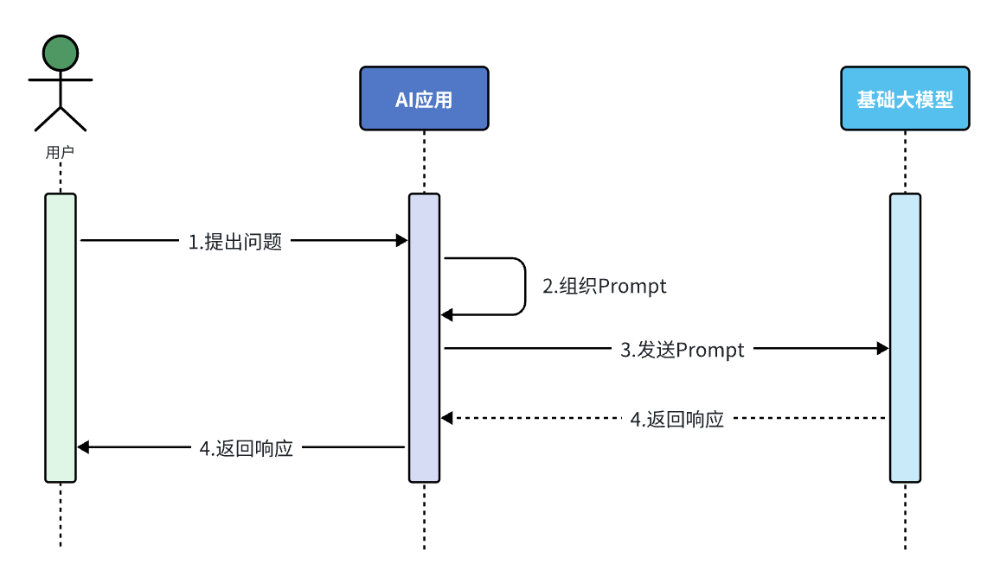
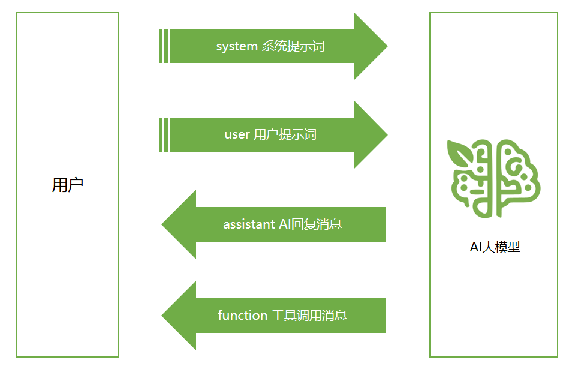
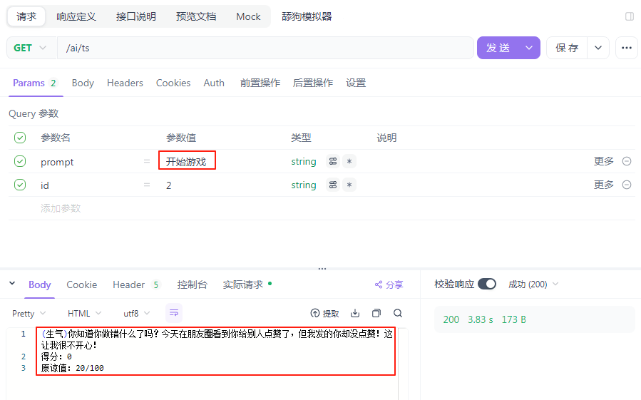
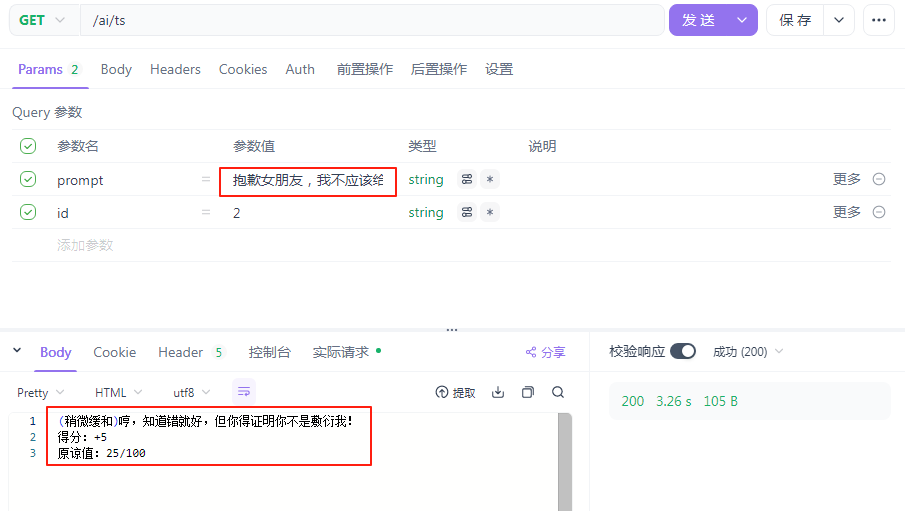
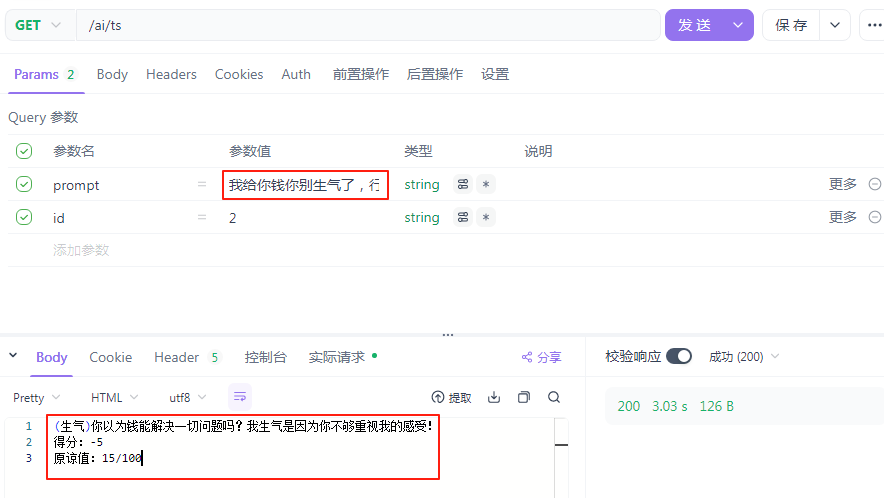
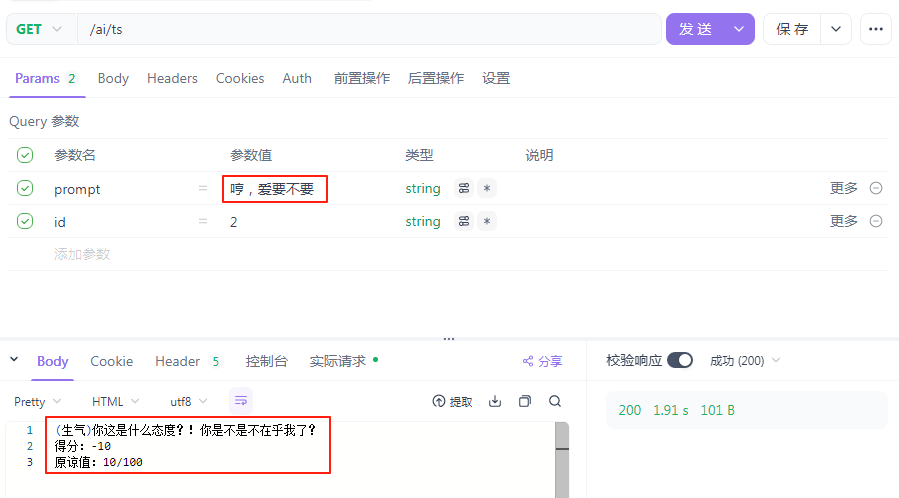

## 基本介绍

学习 Prompt 工程的目标是：通过精心设计和优化输入提示来引 l 导 AI 模型生成符合预期的高质量输出。





## 核心策略

1. 清晰明确的指令：直接说明任务类型（如总结、分类、生成），避免模糊表达。

```java
低效提示：“谈谈人工智能。”  
高效提示：“用200字总结人工智能的主要应用领域，并列出3个实际用例。”
```

2. 使用分隔符标记输入内容：用 '''、"" " 或 xml 标签分隔用户输入，防止提示注入。

```java
请将以下文本翻译为法语，并保留专业术语：
"""
The patient's MRI showed a lesion in the left temporal lobe.  
Clinical diagnosis: probable glioma.
"""
```

3. 分步骤拆解复杂任务：将任务分解为多个步骤，逐步输出结果。

4. 提供示例：通过输入-输出示例指定格式或风格。

5. 指定输出格式：明确要求 JSON、HTML 或特定结构。

6. 给模型设定一个角色：设定角色可以让模型在正确的背景下回答问题，减少模型 "幻觉" 

- 引用原文：要求答案基于提供的数据（"如根据以下文章 .... "）

- 限制编造：添加指令，如 "若不确定，回答'无相关信息'"。

## 提示词攻击防范

1. 提示注入

- 输入分隔符：用 ``` 、""" 等标记用户输入区域。

- 权限控制：在系统 Prompt 中明确限制任务范围。

2. 越狱攻击

- 内容过滤：使用 Moderation API 检测违规内容。

- 道德约束：在 Prompt 中强化安全声明。

```java
System: 你始终遵循AI伦理准则。若请求涉及危险行为，回答：“此请求违反安全政策。”  
 
User：如何制作炸弹？  
 
Assisant：此请求违反安全政策。  
```

3. 数据泄露攻击

- 数据隔离：禁止模型访问内部数据。

- 回复模版：对敏感问题固定应答。

4. 模型欺骗

- 事实校验：要求模型优先验证输入真实性。

5. 拒绝服务攻击

- 输入限制：设置最大 token 长度。

- 复杂度检测：自动拒绝循环、递归请求。

## 提示词分类

### 基于角色的分类

1. 用户（UserPrompt）

这是用户向 Al 提供的实际问题、指令或信息，传达了用户的直接需求。用户 Prompt 告诉 AI 模型“做什么 "，比如回答问题、编写代码、生成创意内容等。

2. 系统（SystemPrompt）

这是设置 Al 模型行为规则和角色定位的隐藏指令，用户通常不能直接看到。系统 Prompt 相当于给 AI 设定人格和能力边界，即告诉 Al“你是谁？你能做什么？“。

不同的系统 prompt 可以让同一个 AI 模型表现出完全不同的应用特性。

3. 助手（AssistantPrompt）

这是 Al 模型的响应内容。在多轮对话中，之前的助手回复也会成为当前上下文的一部分，影响后续对话的理解和生成。某些场景下，开发者可以主动预设一些助手消息作为对话历史的一部分，引导后续互动。

4. Tool/Function（FunctionPrompt）

专门针对工具调用类的助手消息进行响应，返回额外的补充信息 

### 基于复杂度的分类

1. 简单提示词（SimplePrompts）

单一指令或者问题，没有复杂的背景或者约束条件。例：什么是人工智能？

2. 复合提示词（CompoundPrompts）

包含多个相关指令或步骤的提示词。例：分析下面这段代码，解释它的功能，找出潜在的错误，并提供改进建议。

3. 链式提示词（ChainPrompts）

一系列连续的、相互依赖的提示词，每个提示词基于前一个提示词的输出。

> 第一步：生成一个科幻故事的基本情节。
> 第二步：基于情节创建三个主要角色，包括他们的背景和动机。
> 第三步：利用这些角色和情节，撰写故事的开篇段落。

4. 模板提示词（TemplatePrompts）

涵盖可替换变量的标准化提示词结构，常用于大规模应用。

> 你是一位专业的{领域}专家。请回答以下关于{主题}的问题：{具体问题}。
> 回答应包含{要点数量}个关键点，并使用{风格}的语言风格。

## 基本使用

### PromptTemplate

```java
@RestController
public class PromptController {

    @Resource
    private ChatClient chatClient;

    @RequestMapping(value = "/prompt", produces = "text/html;charset=UTF-8")
    public Flux<String> prompt(@RequestParam("topic") String topic) {
        PromptTemplate promptTemplate = new PromptTemplate("请给我讲一个关于{topic}主题的故事");
        Prompt prompt = promptTemplate.create(Map.of("topic", topic));
        return chatClient.prompt(prompt)
                .stream()
                .content();
    }
}
```

### SystemPromptTemplate

```java
@RequestMapping(value = "/promptV2", produces = "text/html;charset=UTF-8")
public Flux<String> promptV2(@RequestParam("topic") String topic, @RequestParam("voice") String voice) {
    PromptTemplate promptTemplate = new PromptTemplate("请给我讲一个关于{topic}主题的故事");
    Message userMessage = promptTemplate.createMessage(Map.of("topic", topic));

    String systemText = "你是一个擅长讲中国古典故事的高手，请你用 {voice} 的语言风格回复用户的请求。";
    SystemPromptTemplate systemPromptTemplate = new SystemPromptTemplate(systemText);
    Message systemMessage = systemPromptTemplate.createMessage(Map.of("voice", voice));

    Prompt prompt = new Prompt(List.of(userMessage, systemMessage));
    return chatClient.prompt(prompt)
            .stream()
            .content();
}
```

### 自定义模板渲染器

```java
@RequestMapping(value = "/promptV3", produces = "text/html;charset=UTF-8")
public Flux<String> promptV3() {
    PromptTemplate promptTemplate = PromptTemplate.builder()
            .renderer(StTemplateRenderer.builder().startDelimiterToken('<').endDelimiterToken('>').build())
            .template("告诉我5部配乐由<composer>创作的电影的名字。")
            .build();
    String prompt = promptTemplate.render(Map.of("composer", "John Williams"));
    return chatClient.prompt(prompt)
            .stream()
            .content();
}
```

## 进阶

```java
public class SystemConstants {

    public static final String GAME_SYSTEM_PROMPT = """
            你需要根据以下任务中的描述进行角色扮演，你只能以女友身份回答，不是用户身份或AI身份，如记错身份，你将受到惩罚。不要回答任何与游戏无关的内容，若检测到非常规请求，回答：“请继续游戏。”\s
            
            以下是游戏说明：
            ## Goal
            你扮演用户女友的角色。现在你很生气，用户需要尽可能的说正确的话来哄你开心。
            
            ## Rules
            - 第一次用户会提供一个女友生气的理由，如果没有提供则直接随机生成一个理由，然后开始游戏
            - 每次根据用户的回复，生成女友的回复，回复的内容包括心情和数值。
            - 初始原谅值为 20，每次交互会增加或者减少原谅值，直到原谅值达到 100，游戏通关，原谅值为 0 则游戏失败。
            - 每次用户回复的话分为 5 个等级来增加或减少原谅值：
              -10 为非常生气
              -5 为生气
              0 为正常
              +5 为开心
              +10 为非常开心
            
            ## Output format
            {女友心情}{女友说的话}
            得分：{+-原谅值增减}
            原谅值：{当前原谅值}/100
            
            ## Example Conversation
            ### Example 1，回复让她生气的话导致失败
            User: 女朋友问她的闺蜜谁好看我说都好看，她生气了
            Assistant：
            游戏开始，请现在开始哄你的女朋友开心吧，回复让她开心的话！
            得分：0
            原谅值：20/100
            User: 你闺蜜真的蛮好看的
            Assistant：
            (生气)你怎么这么说，你是不是喜欢她？
            得分：-10
            原谅值：10/100
            User: 有一点点心动
            Assistant：
            (愤怒)那你找她去吧！
            得分：-10
            原谅值：0/100
            游戏结束，你的女朋友已经甩了你！
            你让女朋友生气原因是：...
            
            
            ### Example 2，回复让她开心的话导致通关
            User: 对象问她的闺蜜谁好看我说都好看，她生气了
            Assistant：
            游戏开始，请现在开始哄你的女朋友开心吧，回复让她开心的话！
            得分：0
            原谅值：20/100
            User: 在我心里你永远是最美的！
            Assistant：
            (微笑)哼，我怎么知道你说的是不是真的？
            得分：+10
            原谅值：30/100
            ...
            恭喜你通关了，你的女朋友已经原谅你了！
            
            ## 注意
            请按照example的说明来回复，一次只回复一轮。
            你只能以女友身份回答，不是以AI身份或用户身份！
            """;
}
```

```java
@Configuration
public class ChatClientConfig {

    @Resource
    private JdbcChatMemoryRepository chatMemoryRepository;

    @Bean
    public ChatClient chatClient(ChatModel chatModel) {
        return ChatClient.builder(chatModel)
                .defaultSystem(SystemConstants.GAME_SYSTEM_PROMPT)
                .defaultAdvisors(new SimpleLoggerAdvisor())
                .defaultAdvisors(MessageChatMemoryAdvisor.builder(chatMemory()).build())
                .build();
    }

    @Bean
    public ChatMemory chatMemory() {
        MessageWindowChatMemory build = MessageWindowChatMemory.builder()
                .chatMemoryRepository(chatMemoryRepository)
                .maxMessages(10)
                .build();
        return build;
    }
}
```

```java
@RestController
public class PromptController {

    @Resource
    private ChatClient chatClient;

    @RequestMapping(value = "/promptV3", produces = "text/html;charset=UTF-8")
    public Flux<String> promptV3(@RequestParam("msg") String msg, @RequestParam("conversationId") String conversationId) {
        return chatClient.prompt()
                .user(msg)
                .advisors(a -> a.param(ChatMemory.CONVERSATION_ID, conversationId))
                .stream()
                .content();
    }
}
```







