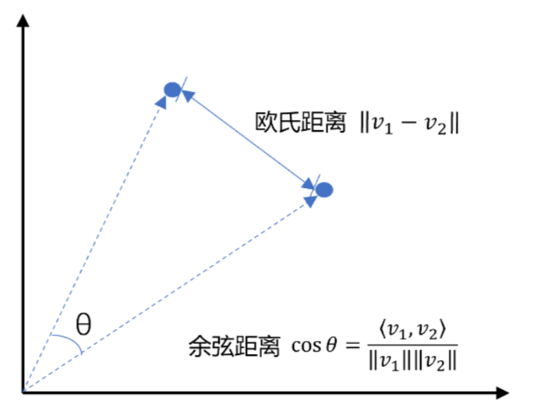
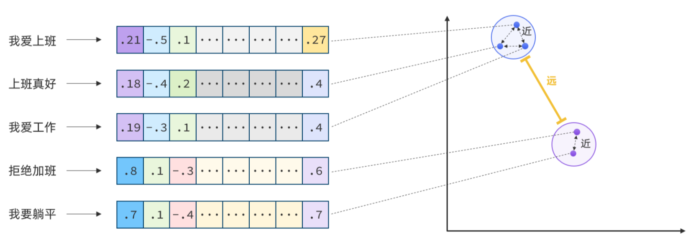
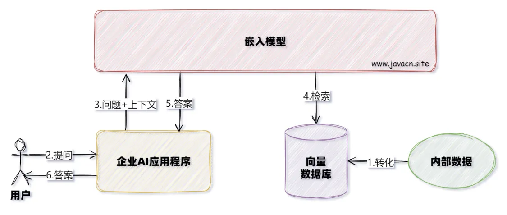

## 向量介绍

向量是空间中有方向和长度的量，空间可以是二维，也可以是多维



通常，两个向量之间欧式距离越近，我们认为两个向量的相似度越高。（余弦距离相反，越大相似度越高）

所以，如果我们能把文本转为向量，就可以通过向量距离来判断文本的相似度了。现在，有不少的专门的向量模型，就可以实现将文本向量化。一个好的向量模型，就是要尽可能让文本含义相似的向量，在空间中距离更近

## 嵌入介绍

嵌入是文本、图像或视频的数值表示，用于捕获输入之间的关系。

嵌入的工作原理是将文本、图像和视频转换为浮点数数组，称为向量。这些向量旨在捕获文本、图像和视频的含义。嵌入数组的长度称为向量的维度。通过计算两个文本向量表示之间的数值距离，应用程序可以确定用于生成嵌入向量的对象之间的相似性。



## 基本使用

EmbeddingModel 接口旨在轻松集成 AI 和机器学习中的嵌入模型。其主要功能是将文本转换为数值向量，通常称为嵌入。这些嵌入对于各种任务至关重要，例如语义分析和文本分类。

```yaml
spring:
  # Spring AI 相关配置
  ai:
    # OpenAI 相关配置
    openai:
      base-url: https://api.chatanywhere.tech
      api-key: 
      # 聊天模型相关配置
      chat:
        options:
          model: gpt-3.5-turbo
          # 设置温度参数为0.75，控制输出的随机性，值越高结果越随机
          temperature: 0.75
      embedding:
        options:
          model: text-embedding-3-small
          dimensions: 1024
    # 聊天记忆相关配置
    chat:
      # 配置聊天记忆存储库
      memory:
        repository:
          # JDBC存储库配置
          jdbc:
            # 初始化数据库表结构，always表示总是初始化（如果不存在则创建）
            initialize-schema: never

  datasource:
    driver-class-name: com.mysql.cj.jdbc.Driver
    url: jdbc:mysql://localhost:3306/springai?serverTimezone=Asia/Shanghai
    username: root
    password: 123456
  data:
    redis:
      host: localhost
      port: 6379
      database: 0

# 日志配置
logging:
  level:
    # 设置Spring AI相关组件的日志级别为debug，便于调试
    org.springframework.ai: debug # AI对话的日志级别
```

```java
@RestController
@RequestMapping("/embeding")
public class EmbedingController {
 
    @Resource
    private EmbeddingModel embeddingModel;
 
    @GetMapping("/embed")
    public String embed() {
        // 返回响应对象
        EmbeddingResponse embeddingResponse = embeddingModel.embedForResponse(List.of("今天天气不错"));
        // Map<String, EmbeddingResponse> embedding = Map.of("embedding", embeddingResponse);
        System.out.println(Arrays.toString(embeddingResponse.getResult().getOutput()));
 
        // 直接返回向量化后的数据
        float[] embed = embeddingModel.embed("挺风和日丽的");
        System.out.println(Arrays.toString(embed));
        return "success";
    }
}
```

## 文档转化及写入

### DocumentReader

由于知识库太大，是需要拆分成文档片段，然后再做向量化的。而且 SpringAI 中向量库接收的是 Document 类型的文档，也就是说，我们处理还要转成 Document 格式。

实际开发中，我们可以直接使用 Spring Al 内置的多种 DocumentReader 实现类，用于处理不同类型的数据源：

1. JsonReader：处理 JSON 文档
2. TextReader：处理纯文本文档
3. JsoupDocumentReader：使用 JSoup 库处理 HTML 文档
4. MarkdownDocumentReader：处理 Markdown 文档
7. Pdf 文件处理

- PagePdfDocumentReader：按照分页读取 PDF（推荐使用）

- ParagraphPdfDocumentReader：使用 PDF 目录（例如 TOC）信息将输入 PDF 拆分为文本段落，并为每个段落输出一个单独的 Document（不推荐，因为很多 PDF 不规范，没有章节标签）

6. TikaDocumentReader：使用 Apache Tika 从各种文档格式（例如 PDF、DOC/DOCX、PPT/PPTX 和 HTML）中提取文本

#### TextReader

```java
@RestController
public class EmbedingController {
    
    // 加载指定的资源文件
    @Value("classpath:医院.txt")
    private org.springframework.core.io.Resource resource;

    @GetMapping("/embed2")
    public String embed2() {
        // 读取文本文件
        TextReader textReader = new TextReader(this.resource);
        // 元数据中增加文件名
        textReader.getCustomMetadata().put("filename", "医院.txt");
        // 获取Document对象
        List<Document> docList = textReader.read();
        // 向量化处理
        float[] embed = embeddingModel.embed(docList.get(0));
        // 打印向量化后的数据
        System.out.println(Arrays.toString(embed));
        // 打印Document中的原始文本数据
        System.out.println(docList.get(0).getText());
        return "success";
    }
}
```

#### PDF 处理

```xml
<!-- 主要针对PDF文件的分割，支持以目录，页面进行分割 -->
<dependency>
    <groupId>org.springframework.ai</groupId>
    <artifactId>spring-ai-pdf-document-reader</artifactId>
    <version>1.1.2</version>
</dependency>
```

1. PagePdfDocumentReader

```java
@RestController
public class EmbedingController {

    @Value("classpath:LESS简明教程.pdf")
    private org.springframework.core.io.Resource resource;

    @RequestMapping("/embedV4")
    public String embedV4() {
        // 1.创建PDF的读取器
        PagePdfDocumentReader reader = new PagePdfDocumentReader(
                resource, // 文件源
                PdfDocumentReaderConfig.builder()
                        .withPageExtractedTextFormatter(ExtractedTextFormatter.defaults())
                        .withPagesPerDocument(1) // 每1页PDF作为一个Document
                        .build()
        );
        // 2.读取PDF文档，拆分为Document
        List<Document> documents = reader.read();
        for (Document document : documents) {
            System.out.println(document.getText());
        }
        return "success";
    }
}
```

2. ParagraphPdfDocumentReader

```java
@RequestMapping("/embedV5")
public String embedV5() {
    ParagraphPdfDocumentReader paragraphPdfDocumentReader = new ParagraphPdfDocumentReader(resource);
    List<Document> documents = paragraphPdfDocumentReader.read();
    for (Document document : documents) {
        System.out.println(document.getText());
    }
    return "success";
}
```

#### MarkdownDocumentReader

```xml
<dependency>
    <groupId>org.springframework.ai</groupId>
    <artifactId>spring-ai-markdown-document-reader</artifactId>
    <version>1.1.2</version>
</dependency>
```

#### TikaDocumentReader

```xml
<!-- 支持各种文本文件的分割，包括：PDF、doc、excel、txt、md等等 -->
<dependency>
    <groupId>org.springframework.ai</groupId>
    <artifactId>spring-ai-tika-document-reader</artifactId>
    <version>1.1.2</version>
</dependency>
```

### DocumentTransformer

作用：对文档进行批量转换处理

上个例子，我们对文档进行了转换，但是默认一个文档转为一个 Document 对象，如果文档太长，以后进行检索时，那么聊天上下文占用的 token 就会很大，为了解决该问题，我们可以对文档进行拆分处理。

#### TokenTextSplitter

TokenTextSplitter（文本分割器） 是 TextSplitter 的一个实现，而 TextSpliter 继承了 DocumentTransformer 接口，它使用 CL100K_BASE 编码，根据 token 计数将文本分割成块。

```java
public TokenTextSplitter() {
    this(800, 350, 5, 10000, true);
}

public TokenTextSplitter(boolean keepSeparator) {
    this(800, 350, 5, 10000, keepSeparator);
}

public TokenTextSplitter(int chunkSize, int minChunkSizeChars, int minChunkLengthToEmbed, int maxNumChunks, boolean keepSeparator) {
	......
}
```

1. defaultChunkSize：每个文本块以 token 为单位的目标大小。
2. minChunkSizeChars：每个文本块以字符为单位的最小大小。
3. minChunkLengthToEmbed：文本块去除空白字符或者处理分隔符后，用于嵌入处理的文本的最小长度。
4. maxNumChunks：从文本生成的最大块数。
5. keepSeparator：是否在块中保留分隔符（例如换行符）。

**TokenTextSplitter 拆分文档的逻辑**

1. 使用 CL100K_BASE 编码将输入文本编码为 token

2. 根据 defaultChunkSize 对编码后的 token 进行分块

3. 对于分块：

- 将块再解码为文本字符串
- 尝试从后向前找到一个合适的截断点（句号、问号、感叹号或换行符）。
- 如果找到合适的截断点，并且截断点所在的 index 大于 minChunkSizeChars，则将在该点截断该块
- 对分块去除两边的空白字符，并根据 keepSeparator 设置，可选地移除换行符
- 如果处理后的分块长度大于 minChunkLengthToEmbed，则将其添加到分块列表中

4. 持续执行第 2 步和第 3 步，直到所有 token 都被处理完或达到 maxNumChunks

5. 如果还有剩余的 token 没有处理，并且剩余的 token 进行编码和转换处理后，长度大于 minChunkLengthToEmbed，则将其作为最终块添加

```java
@GetMapping("/embed3")
public String embed3() {
    // 读取文本文件
    TextReader textReader = new TextReader(this.resource);
    // 元数据中增加文件名
    textReader.getCustomMetadata().put("filename", "医院.txt");
    // 获取Document对象
    List<Document> docList = textReader.read();
    // 文档分割
    TokenTextSplitter splitter = new TokenTextSplitter();
    List<Document> splitDocuments = splitter.apply(docList);
    // 向量化处理
    float[] embed = embeddingModel.embed(splitDocuments.get(0));
    // 打印向量化后的数据
    System.out.println(Arrays.toString(embed));
    // 打印Document中的原始文本数据
    System.out.println(splitDocuments.get(0).getText());
    return "success";
}
```

#### ContentFormatTransformer

确保所有文档的内容格式统一。

#### 元数据增强器

元数据增强器的作用是为文档补充更多的元信息，便于后续检索，而不是改变文档本身的切分规则。包括

- KeywordMetadataEnricher：使用 AI 提取关键词并添加到元数据

- SummaryMetadataEnricher：使用 AI 生成文档摘要并添加到元数据。不仅可以为当前文档生成摘要，还能关联前一个和后一个相邻的文档，让摘要更完整

### DocumentWriter

Spring Al 提供了 2 种内置的 DocumentWriter 实现：

1. FileDocumentWriter：将文档写入到文件系统
2. VectorStoreWriter：将文档写入到向量数据库

## 向量数据库

### 基本介绍

向量数据库的主要作用有两个：

1. 存储向量数据

2. 基于相似度检索数据



以下是 VectorStore 中声明的方法：

```java
public interface VectorStore extends DocumentWriter {
 
    default String getName() {
        return this.getClass().getSimpleName();
    }
    
    // 保存文档到向量库
    void add(List<Document> documents);
    
    // 根据文档id删除文档
    void delete(List<String> idList);
 
    void delete(Filter.Expression filterExpression);
 
    default void delete(String filterExpression) { 
        ... 
    };
    
    // 根据条件检索文档
    List<Document> similaritySearch(String query);
    
    // 根据条件检索文档
    List<Document> similaritySearch(SearchRequest request);
 
    default <T> Optional<T> getNativeClient() {
        return Optional.empty();
    }
}
```

### SimpleVectorStore

SimpleVectorStore 将向量数据存储在内存中。

```xml
<dependency>
    <groupId>org.springframework.ai</groupId>
    <artifactId>spring-ai-vector-store</artifactId>
</dependency>
```

```java
@Bean
public SimpleVectorStore vectorStore() {
    return SimpleVectorStore.builder(embeddingModel).build();
}
```

#### 数据存储

向 SimpleVectorStore 对象中写入测试数据，本例中，创建 Document 对象时，三个参数分别为：文档 id，文档内容，文档的元数据。

```java
@PostConstruct
public void init() {
    List<Document> documents = List.of(
            new Document("1", "今天天气不错", Map.of("country", "郑州", "date", "2025-05-13")),
            new Document("2", "天气不错，适合旅游", Map.of("country", "开封", "date", "2025-05-15")),
            new Document("3", "去哪里旅游好呢", Map.of("country", "洛阳", "date", "2025-05-15")));
    // 存储数据
    simpleVectorStore.add(documents);
}
```

#### 相似度搜索

1. 根据字符串内容进行搜索

```java
@GetMapping("/store")
public String store(String message) {
    // 相似度检索
    List<Document> list= simpleVectorStore.similaritySearch("旅游");
    System.out.println(list.size());
    return list.get(0).getText();
}
```

2. 根据元数据过滤器进行搜索

**使用字符串设置搜索条件**

例如：

- `"country == 'BG'"`
- `"genre == 'drama' && year >= 2020"`
- `"genre in ['comedy', 'documentary', 'drama']"`

```java
@RequestMapping("/storeV2")
public String storeV2() {
    // 示例：搜索包含"World"关键词且国家为'Bulgaria'的文档
    SearchRequest request = SearchRequest.builder()
            // 搜索关键词
            .query("World")
            // 过滤表达式，只返回country字段等于'Bulgaria'的文档
            .filterExpression("country == 'Bulgaria'")
            .build();

    // 执行相似性搜索
    List<Document> list = simpleVectorStore.similaritySearch(request);
    System.out.println(list.size());
    return list.get(0).getText();
}
```

**使用 Filter.Expression 设置搜索条件**

可以使用 `FilterExpressionBuilder` 创建 `Filter.Expression` 的实例。

```java
@RequestMapping("/storeV3")
public String storeV3() {
    // 创建过滤器对象
    FilterExpressionBuilder b = new FilterExpressionBuilder();
    Filter.Expression filter = b.eq("country", "郑州").build();
    // Filter.Expression filter = b.and(b.eq("country", "郑州"), b.gte("date", "2025-05-15")).build();

    // 创建搜索对象
    SearchRequest request = SearchRequest.builder()
            .query("旅游") // 搜索内容
            .filterExpression(filter) // 指定过滤器对象
            .build();

    List<Document> list = simpleVectorStore.similaritySearch(request);
    System.out.println(list.size());
    return list.get(0).getText();
}
```

#### 删除数据

```java
@GetMapping("/store2")
public String store2(String message) {
    // 删除数据
    simpleVectorStore.delete(List.of("3"));
    return "success";
}
```

#### 向量存储聊天历史

```java
@Configuration
public class ChatClientConfig {

    @Resource
    private ChatModel chatModel;
    @Resource
    private EmbeddingModel embeddingModel;

    @Bean
    public ChatClient chatClient() {
        return ChatClient.builder(chatModel)
                .defaultAdvisors(new SimpleLoggerAdvisor())
                .defaultAdvisors(vectorStoreChatMemoryAdvisor())
                .build();
    }

    @Bean
    public SimpleVectorStore vectorStore() {
        return SimpleVectorStore.builder(embeddingModel).build();
    }

    @Bean
    public VectorStoreChatMemoryAdvisor vectorStoreChatMemoryAdvisor() {
        return VectorStoreChatMemoryAdvisor.builder(vectorStore())
                .defaultTopK(10) // TopK
                .build();
    }
}
```

## Milvus 进行向量存储（TODO）

```xml
<dependency>
	<groupId>org.springframework.ai</groupId>
	<artifactId>spring-ai-starter-vector-store-milvus</artifactId>
</dependency>
```

```yaml
spring:
  ai:
    vectorstore:
      milvus:
        client:
          host: "localhost"
          port: 19530
        databaseName: "myai"
        collectionName: "vector_store"
        embeddingDimension: 768
        indexType: IVF_FLAT
        metricType: COSINE
```

### 通过 attu 创建 collection


注意：collection 中的字段名称使用的是上面属性中的默认名称：

spring.ai.vectorstore.milvus.id-field-name = doc_id

spring.ai.vectorstore.milvus.content-field-name = content

spring.ai.vectorstore.milvus.metadata-field-name = metadata

spring.ai.vectorstore.milvus.embedding-field-name = embedding

```java
@Resource
private MilvusVectorStore milvusVectorStore;

@PostConstruct
public void init() {
    List<Document> documents = List.of(
            new Document("今天天气不错", Map.of("country", "郑州", "date", "2025-05-13")),
            new Document("天气不错，适合旅游", Map.of("country", "开封", "date", "2025-05-15")),
            new Document("去哪里旅游好呢", Map.of("country", "洛阳", "date", "2025-05-15")));

    // 存储数据
    milvusVectorStore.add(documents);
}
```

### 相似度搜索

```java
@GetMapping("/search")
public String search(String message) {
    // 相似度检索
    List<Document> list = milvusVectorStore.similaritySearch("旅游");

    System.out.println(list.size());
    System.out.println(list.get(0).getText());
    return "success";
}

@GetMapping("/search5")
public String search5(String message) {
    MilvusSearchRequest request = MilvusSearchRequest.milvusBuilder()
            .query("旅游")
            .topK(5)
            .similarityThreshold(0.7)
            .filterExpression("date == '2025-05-15'") // Ignored if nativeExpression is set
            //.searchParamsJson("{\"nprobe\":128}")
            .build();
    // 相似度检索
    List<Document> list = milvusVectorStore.similaritySearch(request);

    System.out.println(list.size());
    System.out.println(list.get(0).getText());
    return "success";
}
```

top_k： 表示根据 token 排名，只考虑前 k 个 token

similarity threshold：相似度的阈值