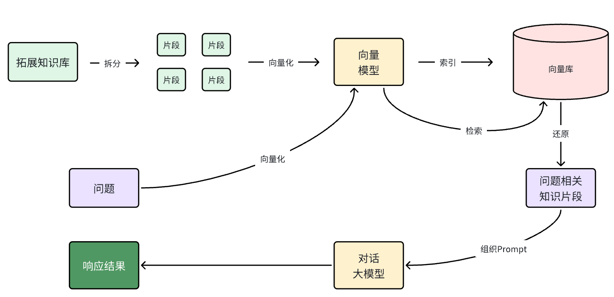

## 基本介绍

RAG 叫做检索增强生成。简单来说就是把信息检索技术和大模型结合的方案。大模型从知识角度存在很多限制：

1. 时效性查：大模型训练比较耗时，其训练数据都是旧数据，无法实时更新。

2. 缺少专业领域知识：大模型训练数据都是采集的通用数据，缺少专业数据。

检索增强生成（RAG），用于解决将相关数据纳入提示词中以获得准确 AI 模型响应的挑战。

该方法采用批处理式编程模型，从指定的文档中读取非结构化数据，进行转换，然后写入向量数据库。从高层次来看，这是一个 ETL（提取、转换和加载）管道。向量数据库用于 RAG 技术的检索部分。

在将非结构化数据加载到向量数据库时，最重要的转换之一是将原始文档分割成更小的片段。将原始文档分割成更小片段的过程有两个重要步骤：

在保持内容语义边界的同时将文档分割成部分。例如，对于包含段落和表格的文档，应避免在段落或表格中间分割文档。对于代码，避免在方法的实现中间分割代码。

将文档的部分进一步分割成大小占 AI 模型词元限制很小百分比的部分。

RAG 的下一阶段是处理用户输入。当需要 AI 模型回答用户的提问时，该问题以及所有“相似”的文档片段都会被放入发送给 AI 模型的提示词中。这就是使用向量数据库的原因。它非常善于查找相似的内容。

**RAG 原理**

要解决大模型的知识限制问题，其实并不复杂。

解决的思路就是给大模型外挂一个知识库，可以是专业领域知识，也可以是企业私有的数据。

不过，知识库不能简单的直接拼接在提示词中。因为通常知识库数据量都是非常大的，而大模型的上下文是有大小限制的，早期的 GPT 上下文不能超过 2000token，现在也不到 200k token，因此知识库不能直接写在提示词中。

怎么办？思路很简单，庞大的知识库中与用户问题相关的其实并不多。所以，我们需要想办法从庞大的知识库中找到与用户问题相关的一小部分，组装成提示词，发送给大模型就可以了。

那么问题来了，我们该如何从知识库中找到与用户问题相关的内容呢？可能有朋友会想到全文检索，但是在这里是不合适的，因为全文检索是文字匹配，这里我们要求的是内容上的相似度。而要从内容相似度来判断，这就不得不提到向量模型的知识了。



## QuestionAnswerAdvisor

```xml
<dependency>
   <groupId>org.springframework.ai</groupId>
   <artifactId>spring-ai-advisors-vector-store</artifactId>
</dependency>
```

```java
@Configuration
public class ChatClientConfig {

    @Resource
    private ChatModel chatModel;
    @Resource
    private EmbeddingModel embeddingModel;

    @Bean
    public ChatClient chatClient() {
        return ChatClient.builder(chatModel)
                .defaultAdvisors(new SimpleLoggerAdvisor())
                .defaultAdvisors(MessageChatMemoryAdvisor.builder(chatMemory()).build())
                .build();
    }

    @Bean
    public ChatMemory chatMemory() {
        MessageWindowChatMemory build = MessageWindowChatMemory.builder()
                .chatMemoryRepository(new InMemoryChatMemoryRepository())
                .maxMessages(10)
                .build();
        return build;
    }

    @Bean
    public SimpleVectorStore vectorStore() {
        return SimpleVectorStore.builder(embeddingModel).build();
    }
}
```

```java
@RestController
public class RagController {

    @Resource
    private SimpleVectorStore simpleVectorStore;
    @Resource
    private ChatClient chatClient;

    @PostConstruct
    public void init() {
        List<Document> documents = List.of(
                // 创建带有元数据的文档，包含地点和日期信息
                new Document("1", "今天天气不错", Map.of("country", "郑州", "date", "2025-05-13")),
                new Document("2", "天气不错，适合旅游", Map.of("country", "开封", "date", "2025-05-15")),
                new Document("3", "去哪里旅游好呢", Map.of("country", "洛阳", "date", "2025-05-15")));
        // 将文档存储到向量存储器中，用于后续的相似性搜索
        simpleVectorStore.add(documents);
    }

    @RequestMapping("/chatRag")
    public String chatRag(@RequestParam("msg") String msg) {
        // 定义提示词模版
        PromptTemplate customPromptTemplate = PromptTemplate.builder()
                .renderer(StTemplateRenderer.builder().startDelimiterToken('<').endDelimiterToken('>').build())
                .template("""
                    <query>
                    上下文信息如下：
                    ---------------------
                    <question_answer_context>
                    ---------------------
                    根据上下文信息回答查询。
                    遵循以下规则：
                    1. 如果答案不在上下文中，只需说你不知道。
                    2. 避免使用“根据上下文...”或“提供的信息...”这样的表述。
                    3. 回答问题尽量精简
                             """)
                .build();

        QuestionAnswerAdvisor qaAdvisor = QuestionAnswerAdvisor.builder(simpleVectorStore)
                // 设置提示词模版对象，如果不设置，使用默认的模版
                .promptTemplate(customPromptTemplate)
                // 指定进行向量搜索时的基本条件
                .searchRequest(SearchRequest.builder().topK(3).similarityThreshold(0.5).build())
                .build();

        return chatClient.prompt()
                .advisors(qaAdvisor)
                .user(msg)
                .call()
                .content();
    }
}
```

当用户问题发送到 AI 模型时，QuestionAnswerAdvisor 查询向量数据库以获取与用户问题相关的文档。向量数据库的响应被附加到用户文本中，为 AI 模型生成响应提供上下文。

注意，如果用户没有提供 promptTempalte，则采用默认的 DEFAULT_PROMPT_TEMPLATE，代码如下：

```java
private static final PromptTemplate DEFAULT_PROMPT_TEMPLATE = new PromptTemplate(
    "{query}\n\nContext information is below, surrounded by ---------------------\n\n" +
    "---------------------\n" +
    "{question_answer_context}" +
    "\n---------------------\n\n" +
    "Given the context and provided history information and not prior knowledge,\n" +
    "reply to the user comment. If the answer is not in the context, inform\n" +
    "the user that you can't answer the question.\n");
```

本例使用 <> 表示占位符

1. \< query > 表示用户提出的问题
2. <question_answer_context> 表示检索的内容

发送的提示词如下：

```java
'开封的天气怎么样
上下文信息如下：
---------------------
天气不错，适合旅游
---------------------
根据上下文信息回答查询。
遵循以下规则：
1. 如果答案不在上下文中，只需说你不知道。
2. 避免使用“根据上下文...”或“提供的信息...”这样的表述。
3. 回答问题尽量精简
'
```

从提示词中看出，在向大模型发送消息前，先通过向量数据库，搜索对应的信息。然后按照提示词模版，生成最新的提示词信息，然后将用户的提问和提示词模版生成的提示词信息一并发送给大模型。

## RetrievalAugmentationAdvisor

QuestionAnswerAdvisor 主要作用是对向量数据库中的所有文档执行相似性搜索。

RetrievalAugmentationAdvisor 可以更好的体现检索增强。

```xml
<dependency>
    <groupId>org.springframework.ai</groupId>
    <artifactId>spring-ai-rag</artifactId>
</dependency>
```

```java
@RestController
public class RagController {

    @Resource
    private SimpleVectorStore simpleVectorStore;
    @Resource
    private ChatClient chatClient;

    @PostConstruct
    public void init() {
        List<Document> documents = List.of(
                // 创建带有元数据的文档，包含地点和日期信息
                new Document("1", "今天天气不错", Map.of("country", "郑州", "date", "2025-05-13")),
                new Document("2", "天气不错，适合旅游", Map.of("country", "开封", "date", "2025-05-15")),
                new Document("3", "去哪里旅游好呢", Map.of("country", "洛阳", "date", "2025-05-15")));
        // 将文档存储到向量存储器中，用于后续的相似性搜索
        simpleVectorStore.add(documents);
    }

    @RequestMapping("/chatRagV2")
    public String chatRagV2(@RequestParam("msg") String msg) {
        // 创建RetrievalAugmentationAdvisor对象
        // 通过documentRetriever指定使用的向量数据库
        Advisor retrievalAugmentationAdvisor = RetrievalAugmentationAdvisor.builder()
                .documentRetriever(VectorStoreDocumentRetriever.builder()
                        .similarityThreshold(0.50)
                        .topK(3)
                        .vectorStore(simpleVectorStore)
                        .build())
                .build();

        return chatClient.prompt()
                // 设置检索增强对象
                .advisors(retrievalAugmentationAdvisor)
                .user(msg)
                .call()
                .content();
    }
}
```

VectorStoreDocumentRetriever 从向量数据库检索与输入查询语义相似的文档，支持基于元数据过滤、相似度阈值和 top-k 结果数量控制。 

默认情况下，RetrievalAugmentationAdvisor 不允许检索到的上下文为空。此时它会指示模型不回答用户查询。

## ContextualQueryAugmenter

RetrievalAugmentationAdvisor 不允许检索到的上下文为空。如果解决该问题可以使用 ContextualQueryAugmenter，利用所提供文档的内容上下文数据增强用户查询。

```java
@RequestMapping("/chatRagV3")
public String chatRagV3(@RequestParam("msg") String msg) {
    // 创建RetrievalAugmentationAdvisor对象
    // 通过documentRetriever指定使用的向量数据库
    Advisor retrievalAugmentationAdvisor = RetrievalAugmentationAdvisor.builder()
            .documentRetriever(VectorStoreDocumentRetriever.builder()
                    .similarityThreshold(0.50)
                    .topK(3)
                    .vectorStore(simpleVectorStore)
                    .build())
            .queryAugmenter(ContextualQueryAugmenter.builder()
                    .allowEmptyContext(true)
                    .build())
            .build();

    return chatClient.prompt()
            // 设置检索增强对象
            .advisors(retrievalAugmentationAdvisor)
            .user(msg)
            .call()
            .content();
}
```

查询时，默认的提示词模版信息是英文的，那么如何指定我们的自定义提示词模版呢？

只需要设置 ContextualQueryAugmenter 的 queryTemplate 属性即可。

```java
@RequestMapping("/chatRagV4")
public String chatRagV4(@RequestParam("msg") String msg) {
    // 定义提示词模版
    PromptTemplate customPromptTemplate = PromptTemplate.builder()
            .renderer(StTemplateRenderer.builder().startDelimiterToken('<').endDelimiterToken('>').build())
            .template("""
                <query>
                上下文信息如下：
                ---------------------
                <context>
                ---------------------
                根据上下文信息回答查询。
                遵循以下规则：
                1. 如果答案不在上下文中，只需说你不知道。
                2. 避免使用“根据上下文...”或“提供的信息...”这样的表述。
                3. 回答问题尽量精简
                         """)
            .build();
    Advisor retrievalAugmentationAdvisor = RetrievalAugmentationAdvisor.builder()
            .documentRetriever(VectorStoreDocumentRetriever.builder()
                    .similarityThreshold(0.50)
                    .topK(3)
                    .vectorStore(simpleVectorStore)
                    .build())
            .queryAugmenter(ContextualQueryAugmenter.builder()
                    .allowEmptyContext(true)
                    .promptTemplate(customPromptTemplate)
                    .build())
            .build();

    return chatClient.prompt()
            // 设置检索增强对象
            .advisors(retrievalAugmentationAdvisor)
            .user(msg)
            .call()
            .content();
}
```

## RewriteQueryTransformer

RewriteQueryTransformer 利用大语言模型重写用户查询，从而在查询向量数据库或搜索引擎等目标系统时获得更好结果。

当用户查询冗长、含歧义或包含可能影响搜索结果质量的无关信息时，该转换器（Transformer）特别有效

```java
@RequestMapping("/chatRagV5")
public String chatRagV5(@RequestParam("msg") String msg) {
    // 定义提示词模版
    PromptTemplate customPromptTemplate = PromptTemplate.builder()
            .renderer(StTemplateRenderer.builder().startDelimiterToken('<').endDelimiterToken('>').build())
            .template("""
                <query>
                上下文信息如下：
                ---------------------
                <context>
                ---------------------
                根据上下文信息回答查询。
                遵循以下规则：
                1. 如果答案不在上下文中，只需说你不知道。
                2. 避免使用“根据上下文...”或“提供的信息...”这样的表述。
                3. 回答问题尽量精简
                         """)
            .build();
    Advisor retrievalAugmentationAdvisor = RetrievalAugmentationAdvisor.builder()
            .documentRetriever(VectorStoreDocumentRetriever.builder()
                    .similarityThreshold(0.50)
                    .topK(3)
                    .vectorStore(simpleVectorStore)
                    .build())
            .queryAugmenter(ContextualQueryAugmenter.builder()
                    .allowEmptyContext(true)
                    .promptTemplate(customPromptTemplate)
                    .build())
            .queryTransformers(RewriteQueryTransformer.builder()
                    .chatClientBuilder(chatClient.mutate())
                    .build())
            .build();

    return chatClient.prompt()
            // 设置检索增强对象
            .advisors(retrievalAugmentationAdvisor)
            .user(msg)
            .call()
            .content();
}
```

通过调试 RewriteQueryTransformer 源码，可以看到源码的 transform()方法，将我们的提问先发给大模型，大模型根据提问内容返回重写的查询信息，根据重写后的内容再次向大模型发送提问。

## 文本分块优化

RAG 时，检索效果的优劣，和文本的分块的情况有很大关系。SpringAI 中通过 TokenTextSplitter 对文本分块。

```java
public void init2() {
    // 读取文本文件
    TextReader textReader = new TextReader(this.resource);
    // 元数据中增加文件名
    textReader.getCustomMetadata().put("filename", "医院.txt");
    // 获取Document对象,只有一个记录
    List<Document> docList = textReader.read();
    // 指定分割符
    List<String> splitList = Arrays.asList("。", "！", "？", System.lineSeparator());
    MyTextSplit splitter = new MyTextSplit(300, 100, 5, 10000, true, splitList);
    List<Document> splitDocuments = splitter.apply(docList);
    System.out.println(splitDocuments);
}
```
