## 相关概念
可以将 BPMN 的绘制类比于我们常规意义上的流程图，例如：开始和结束节点、节点之间的连接线（有向箭头）、处理框、决策判断框，如下是一个简易的常规流程图

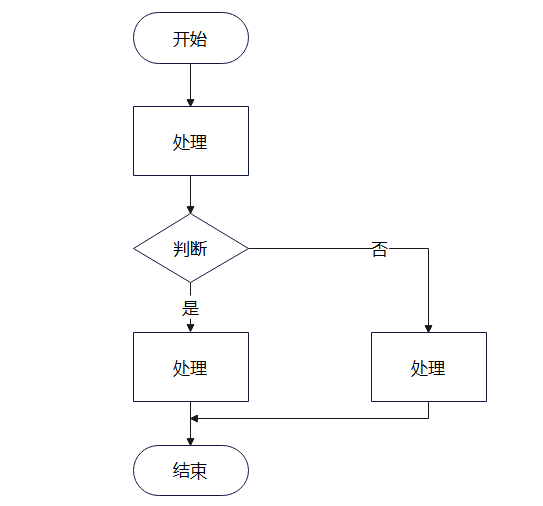

下面将 BPMN 中的概念和上述常规的流程图类比，方便理解，如下给一个和上面流程图对应的 bpmn 图，如下：

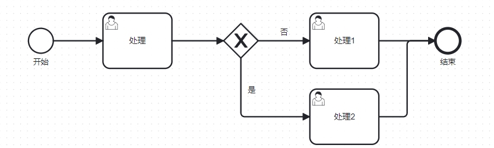

### 顺序流（Sequence flow）
顺序流其实就是类比于上面的有向箭头，表示从一个节点流向另一个节点。如下图红框下的箭头线段表示顺序流，从开始节点流向用户任务节点。

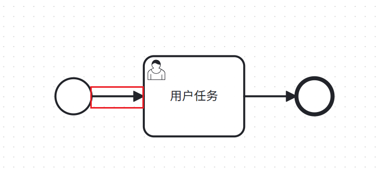

在 bpmn 文件中，顺序流有唯一标识，sourceRef 记录了源节点，targetRef 记录了目的节点，如下图：

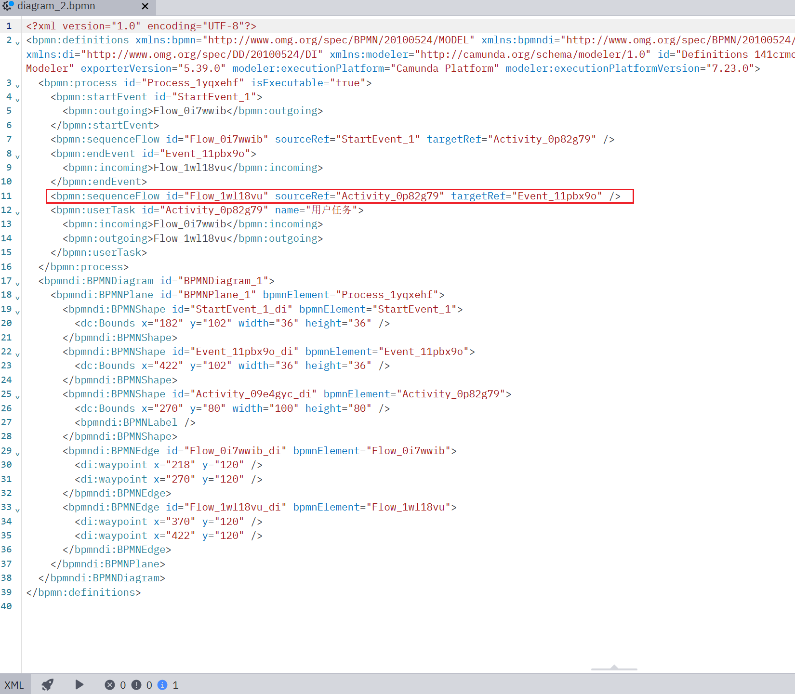

### 用户任务（User task）
用户任务顾名思义是需要人来参与完成的任务，当一个流程到达一个用户任务，将会创建一个用户任务实例，流程将在此停止，当用户处理完成该任务，流程才会继续向下进行。

在 Modeler 画布上拖拽一个任务控件，可以选择该任务的类型，User task 表示用户任务，如下图：

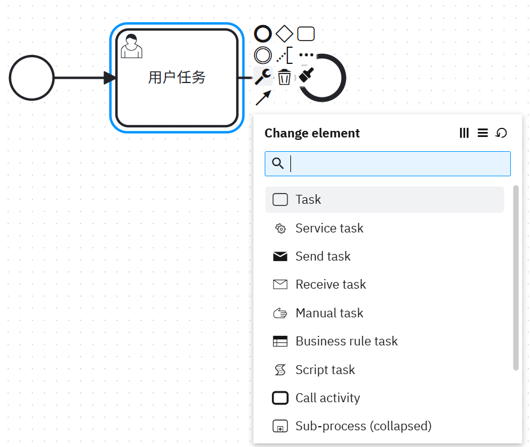

在 bpmn 文件中，每一个用户任务存在一个唯一 id，camunda 中可以指定任务处理人（assignee）, 其中 incoming 表示流入的顺序流（流入的箭头），outgoing 表示流出的顺序流（流出的箭头），如下图：

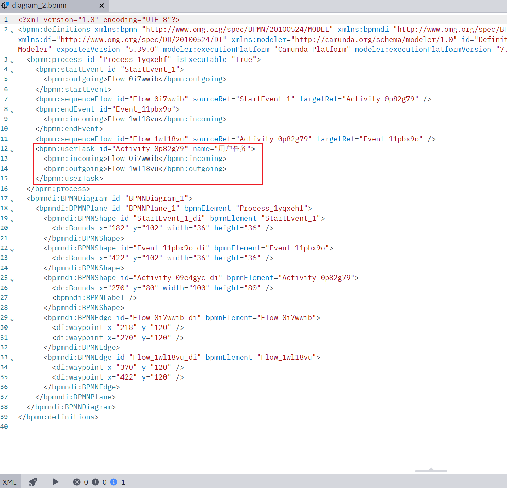

### 服务任务（Service task）
服务任务不需要人员来进行处理，例如利用服务节点来做统计或者其他可以由程序处理的任务，流程到达服务任务后会在此停止，等待服务任务绑定的作业处理完成。

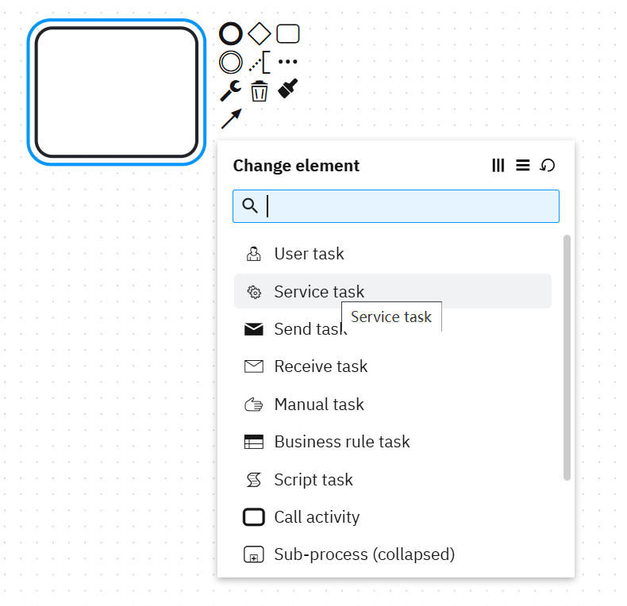

可以在右侧的 Implementation 配置对应实现作业逻辑的实现类或者方法，如下：

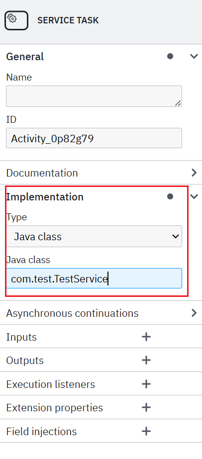

在 bpmn 文件中，每一个服务任务存在一个唯一 id，camunda: class 表示任务的实现方式，其中 incoming 表示流入的顺序流（流入的箭头），outgoing 表示流出的顺序流（流出的箭头），如下图：

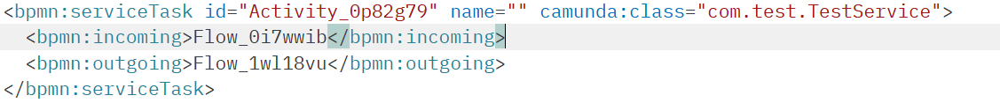

### 启动事件（Start event）
如常规流程图中的开始节点一样，bpmn 中一般需要一个启动事件，作为流程的起始，事件分为很多类，如：空白启动事件、结束事件、消息启动事件等等

如果是需要手动点击表单按钮的方式发起流程，一般都需要一个空白的启动事件（None start events），空白启动事件在一个流程中最多只能存在一个。

在 Modeler 画布上拖拽一个事件控件，可以选择该事件的类型，Start event 表示空白启动事件，如下图：

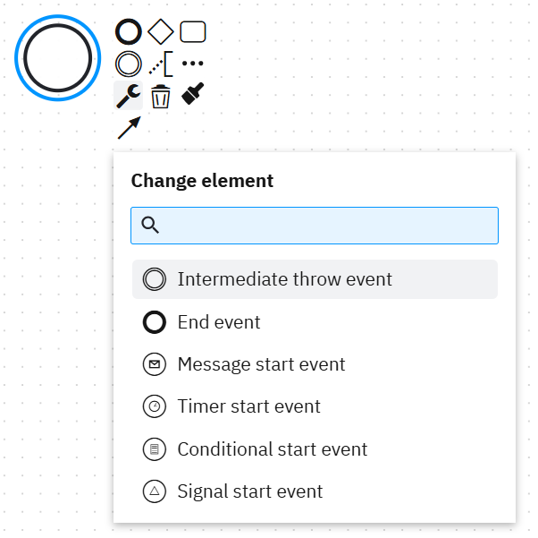

bnpm 文件中，启动事件存在唯一 id，outgoing 表示流出的顺序流，如下：

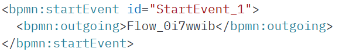

### 结束事件（End event）
流程图绘制有开始有结束，但是结束事件在一个流程中不是必须的，同时一个流程或者子流程可以有多个结束事件。

当不存在结束事件时，当前的执行路径结束，则流程完成，如下是一个存在结束事件的流程和不存在结束事件的流程：

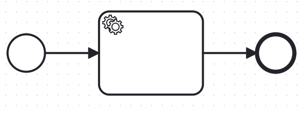

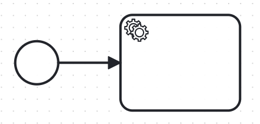

bnpm 文件中，结束事件存在唯一 id，incoming 表示流入的顺序流，一个节点可以存在多条流入的顺序流和流出的顺序流，如下：

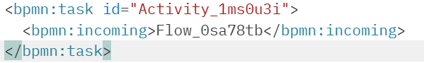

### 互斥网关（Exclusive gateway）
BPMN 中的网关存在多种类型，例如：并行网关、包含网关、复杂网关和基于事件的网关。

并行网关允许将流分为多条流同时进行，也可以将多条流汇合，直到接收到所有并行流的处理结果，流程才会往下进行；包含网关可以将一条流分为多条流，每条分开的流都需要指定流入条件，满足条件则流入。

常规流程图中的判断条件就相当于 BPMN 中的互斥网关，就是根据判断条件选择一条分支进行，分支之间彼此互斥，下面以互斥网关进行举例。

如下是 bpmn 图中的互斥网关，判断条件于网关流出的顺序流上配置，选择条件类型，然后编写条件表达式，如下：

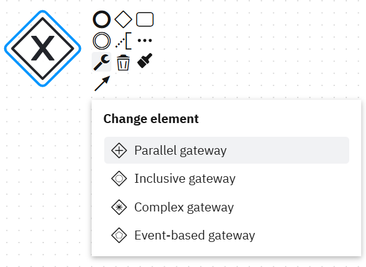  

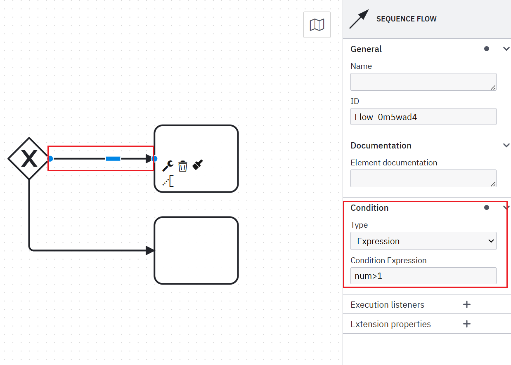

这样在流程达到网关时，会从流程变量获取表达式中的参数值，结合表达式进行判断，满足条件则进入分支路径。

## 配置说明
下面主要是针对上一节的各个元素，右侧的配置项作说明，有一些配置是大部分元素都拥有的，有一些是特定元素才有的配置。

如下的配置项基本是大部分元素都有的配置。

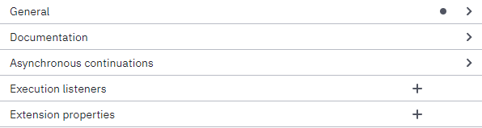

### 通用信息
所有的元素都有这个通用信息的配置，就是名称和 ID，ID 用于在 BPMN 文件中，唯一标识该元素，一般自动生成，也可以自行修改。

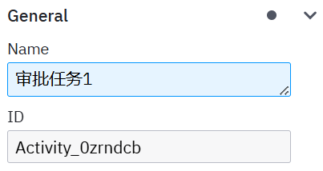

### 执行监听器
如下是执行监听器的配置，除了顺序流节点的 event Type 是 take，其他节点(事件、任务、网关等等)都有 start 和 end 两种事件类型，对应的就是执行前、执行后，如果在节点执行前后，期望做一些操作，则可以使用执行监听器。

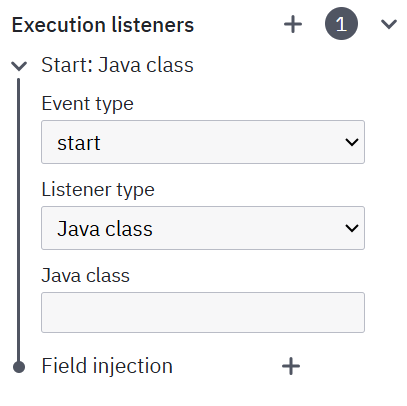

监听器支持的实现方式有多种，比如：Java 类、EL 表达式、委托表达式和外部脚本等，和下面的用户任务监听器的实现方式一样。

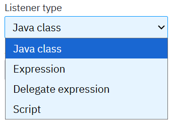

### 用户任务
用户任务元素有两个特有的配置，分别是任务监听器（Task Listenners）和任务处理人（User assignment）

#### 任务处理人
用户任务肯定需要用户处理，这一项就是配置和任务处理人相关的参数，如下：

1. Assignee：配置任务的处理人

2. Candidate groups：配置任务的候选处理用户组，camunda 里面，用户是可以属于用户组的

3. candidate users：配置任务的候选处理人列表，即可以配置多个候选处理用户，用逗号隔开。可以用于任务由多个用户抢占式处理，即候选用户都可以领取这个任务，谁领取了谁处理，其他人就看到了。

4. Due date：任务到期日期，支持设置流程变量和固定格式的日期字符串，如下面图的参数说明。

5. Follow up date：任务跟进日期，设置同 Due date。日期参数内部 API 支持通过参数筛选过滤用户任务，可以做一些类似于任务提醒的事情。

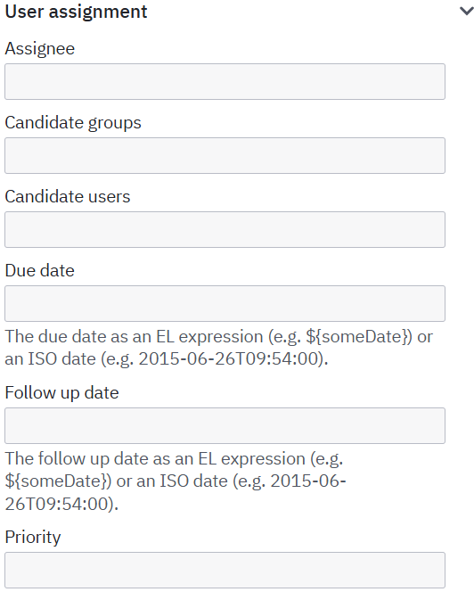

#### 任务监听器
用户任务独有的任务监听器，有更丰富的事件类型，有：创建任务、设置处理人、完成任务、删除任务、更新任务、任务处理超时，可以更灵活的进行围绕用户任务的自定义处理，例如通知、记录等等操作，其和服务任务一样支持多种监听器类型。

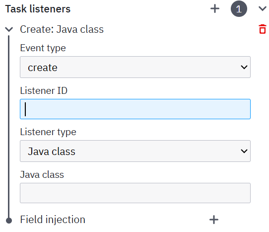

### 服务任务
服务任务有一个特有的配置，就是服务任务的实现，如下：

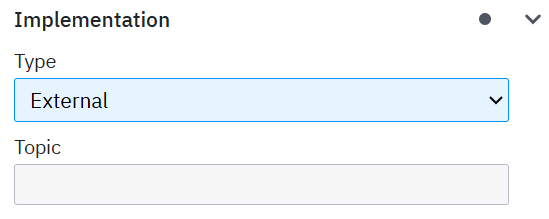

其 type 支持多种选项，例如外部任务、Java 类、EL 表达式、委托表达式和连接器，特别说明一下 External（外部任务）和 Connector（连接器），两者和其余的几种不一样，Java 类、EL 表达式、委托表达式都是在和 camunda 引擎同一个服务下编写代码。

External（外部任务）：有另外一个外部服务主动调用 camunda 接口，其定时的查询 camunda 引擎指定 topic 下的任务，处理完成后，调用引擎接口告知已完成。

Connector（连接器）：camunda 主动调用外部服务的接口，但是这种接口可以通过 camunda 引擎内置的连接器插件处理，例如 http connector，通过配置外部 http 接口的 url 和 method 以及参数，调用接口，并支持通过表达式处理接口的返回值，属于非代码实现。

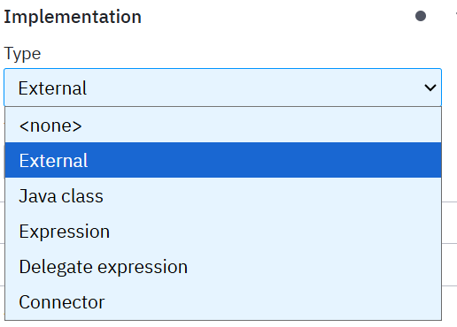

### 表单配置（TODO）
所有和用户处理相关的元素都可以用到表单配置，配置表单的目的就是为了和用户操作，例如空白启动事件和用户任务就支持配置表单。如下就是一个表单配置，使用 camunda 的 web 页面处理用户任务时，就可以看到配置的表单，Label 就是显示给用户看的文字，type 表示用户的这输入值是什么类型。

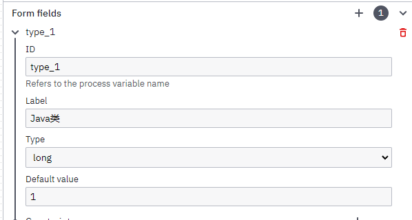

用户处理任务时，看到的页面如下：

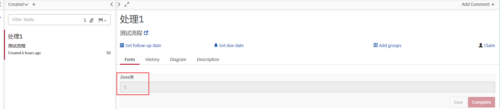

### 输入/输出参数
一般只有任务才会有输入和输出两个参数，例如上面的服务任务和用户任务，这个参数和下面的扩展属性类似，配置的参数可以在流程任务变量中获取到，区别在于这里配置的参数是任务的局部属性，只允许当前任务本身进行访问，可以与流程中同名的变量名同时存在，相互之间不受影响。

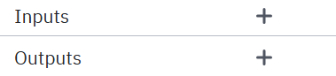

### 扩展属性
这里配置的就是流程变量，可以在整个流程中被所有节点获取和修改，可以在其中配置一些固定值，标识当前节点的属性，或者传入一下需要的值，或者流程中可能会用到的值

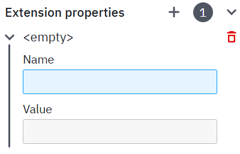

