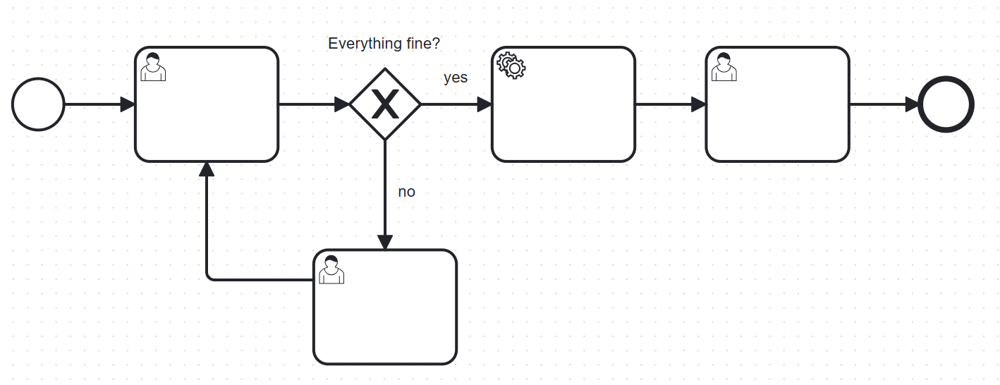
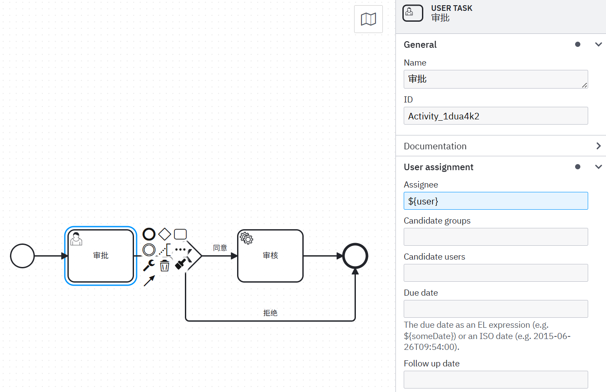
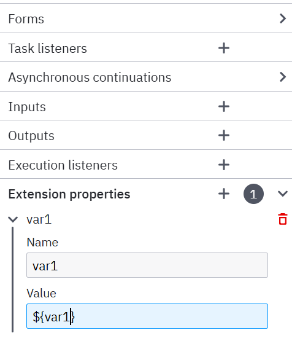

## 依赖及配置

```xml
<!-- 流程引擎-->
<dependency>
    <groupId>org.camunda.bpm.springboot</groupId>
    <artifactId>camunda-bpm-spring-boot-starter</artifactId>
    <version>7.18.0</version>
</dependency>
<!-- rest api操作接口包-->
<dependency>
    <groupId>org.camunda.bpm.springboot</groupId>
    <artifactId>camunda-bpm-spring-boot-starter-rest</artifactId>
    <version>7.18.0</version>
</dependency>
<!-- Web管理平台-->
<dependency>
    <groupId>org.camunda.bpm.springboot</groupId>
    <artifactId>camunda-bpm-spring-boot-starter-webapp</artifactId>
    <version>7.18.0</version>
</dependency>
<dependency>
    <groupId>mysql</groupId>
    <artifactId>mysql-connector-java</artifactId>
</dependency>
<dependency>
    <groupId>com.baomidou</groupId>
    <artifactId>mybatis-plus-boot-starter</artifactId>
    <version>3.5.6</version>
</dependency>
```

1. camunda-bpm-spring-boot-starter

这个依赖包是 Camunda 与 Spring Boot 集成的基础，包含了启动 Camunda BPM 引擎所需的基本组件，如 Camunda BPM Engine、Spring Integration 以及 Spring Boot 自动配置。它使开发者能够快速启动 Camunda BPM 引擎，并提供默认配置选项。

2. camunda-bpm-spring-boot-starter-rest

此依赖包提供了 Camunda REST API 的支持，允许通过 HTTP 请求访问 Camunda BPM 引擎的功能，如启动流程实例、查询状态、管理任务及部署定义。这使得前端应用或其他服务可以通过 RESTful 方式与 Camunda 交互。

3. camunda-bpm-spring-boot-starter-webapp

这个依赖包用于创建集成 Camunda Web 客户端（如 Cockpit）和任务列表（Tasklist）的 Web 应用程序，方便在浏览器中管理和监控 Camunda 流程。这提高了开发和运维的效率。

```yaml
camunda:
  bpm:
    # 配置账户密码来访问Camunda自带的管理界面
    # 创建具有提供的密码和名字的管理员用户 demo/demo
    admin-user:
      id: demo
      password: demo
      first-name: demo
    filter:
      create: All tasks
    database:
      # 指定数据库类型
      type: mysql
      # 是否自动建表，但我测试为true时，创建表会出现，因此还是改成false由手工建表。
      schema-update: true
    # 禁止自动部署resources下面的bpmn文件
    auto-deployment-enabled: true
    # 禁止index跳转到Camunda自带的管理界面，默认true
#    webapp:
#      index-redirect-enabled: false

spring:
  datasource:
    driver-class-name: com.mysql.cj.jdbc.Driver
    url: jdbc:mysql://localhost:3306/camunda?serverTimezone=Asia/Shanghai&useUnicode=true&characterEncoding=utf-8&allowMultiQueries=true&useSSL=false
    username: root
    password: 123456
```

resources 下新建 BPMN 文件夹用于存放流程文件

注意：Camunda 需要数据库的隔离级别为 READ COMMITTED，需要对数据库进行修改

```sql
-- 查看当前隔离级别
SELECT @@transaction_isolation;
-- 设置全局隔离级别
SET GLOBAL TRANSACTION ISOLATION LEVEL READ COMMITTED;
```

项目启动后，会自动配置好数据库和生成对应表，浏览器输入 localhost: 8080


## 监听器

在 Camunda 中大多数节点元素都可以设置执行监听器（Execution listeners），例如事件、顺序流、用户任务、服务任务和网关。其中用户任务除了可以设置执行监听器，还可以设置独有的用户任务监听器（Task listeners），相比于执行监听器，用户任务监听器可以设置更加细粒度的事件类型。

监听器需要实现以下接口：

1. 用户任务（UserTask）的监听器为 TaskListener
2. 服务任务（ServiceTask）的监听器为 JavaDelegate
3. 其他任务的监听器为 ExecutionListener

```java
public class ExampleExecutionListener implements ExecutionListener {
    
    public void notify(DelegateExecution execution) throws Exception {
        execution.setVariable("variableSetInExecutionListener", "firstValue");
        execution.setVariable("eventReceived", execution.getEventName());
    }
}
```

### 执行监听器（Execution listeners）

执行监听器支持的 Listener type 如下，有 Java class、Expression、Delegate expression 和 Script，下面针对这几种的配置和代码实现进行说明


#### Java class

Java class 配置完整的包名和类名，并选择 Event type 是开始或结束事件类型，对应节点执行前和执行后。


新增一个 java 类，实现 JavaDelegate 接口，并重写 execute 方法，利用 @Component 注解注入 bean，配置当前类的完整路径即可。根据 eventName 区分是什么事件，在里面实现对应的逻辑，代码示例如下：

```java
@Component
@Slf4j
public class ExecutionListener01 implements ExecutionListener {

    @Override
    public void notify(DelegateExecution execution) throws Exception {
        String eventName = execution.getEventName();
        String currentActivityName = execution.getCurrentActivityName();
        if (ExecutionListener.EVENTNAME_END.equals(eventName)) {

        } else if (ExecutionListener.EVENTNAME_START.equals(eventName)) {

        } else if (ExecutionListener.EVENTNAME_TAKE.equals(eventName)) {

        }
        log.info("ExecutionListener01 execute,taskName={},eventName={}", currentActivityName, eventName);
    }
}
```

#### Expression

针对自定义的 java 类和方法，支持通过表达式的方式配置，配置如下：


EL 表达式不需要实现 JavaDelegate 接口，直接使用 Spring Bean 的名称和方法名称即可，根据 eventName 区分是 start 事件还是 end 事件，在里面实现自己的逻辑。

注：camunda 内置了一部分上下文参数，可以在表达式中直接使用

代码示例如下：

```java
@Component("executionListener02")
@Slf4j
public class ExecutionListener02 {

    public void expression(DelegateExecution execution) {
        String eventName = execution.getEventName();
        String currentActivityName = execution.getCurrentActivityName();
        log.info("ExecutionListener02 execute,taskName={},eventName={}", currentActivityName, eventName);
    }
}
```

#### Delegate expression

委托表达式配置如下：


DelegateExpression 和 Expression 类似，区别在于需要实现 JavaDelegate 接口，此时只需要传入 bean 的名称即可，不需要指定方法名和参数。

示例代码如下：

```java
@Component("executionListener03")
@Slf4j
public class ExecutionListener03 implements ExecutionListener {

    @Override
    public void notify(DelegateExecution execution) throws Exception {
        String eventName = execution.getEventName();
        String currentActivityName = execution.getCurrentActivityName();
        if (ExecutionListener.EVENTNAME_END.equals(eventName)) {

        } else if (ExecutionListener.EVENTNAME_START.equals(eventName)) {

        } else if (ExecutionListener.EVENTNAME_TAKE.equals(eventName)) {

        }
        log.info("ExecutionListener03 execute,taskName={},eventName={}", currentActivityName, eventName);
    }
}
```

#### Script

camunda 支持在执行监听器中编写脚本进行处理，如下可以在 Script 框中编写脚本，没有使用过，不进行详细说明，感兴趣可以自行研究


### 用户任务监听器（Task listeners）

任务监听器是独属于用户任务的，其支持的事件类型和监听器类型分别如下所示：


从上面可以看到，与执行监听器相比，任务监听器支持的事件类型更加丰富，意味这个可以在用户任务的各个阶段处理我们自定义的逻辑；其监听器类型和 Execution listeners 一样，同样支持四种方式。

#### Java class

用户任务监听器和执行监听器的 Java class 配置和代码实现类似，区别在于实现的接口不同，eventName 的种类更多，示例配置如下所示：


新增一个 java 类，实现 TaskListener 接口，并重写 notify 方法，利用 @Component 注解注入 bean，最后配置当前类的完整路径即可。

代码示例如下：

```java
@Component
@Slf4j
public class UserListener01 implements TaskListener {

    @Override
    public void notify(DelegateTask delegateTask) {
        String eventName = delegateTask.getEventName();
        String name = delegateTask.getName();
        if (TaskListener.EVENTNAME_CREATE.equals(eventName)) {

        } else if (TaskListener.EVENTNAME_ASSIGNMENT.equals(eventName)) {

        } else if (TaskListener.EVENTNAME_COMPLETE.equals(eventName)) {

        } else if (TaskListener.EVENTNAME_DELETE.equals(eventName)) {

        } else if (TaskListener.EVENTNAME_TIMEOUT.equals(eventName)) {

        } else if (TaskListener.EVENTNAME_UPDATE.equals(eventName)) {

        }
        log.info("UserListener01 execute,userTaskName={},eventName={}", name, eventName);
    }
}
```

#### Delegate expression

其在委托表达式的配置示例如下所示：只需要实现 TaskListener 接口，利用 @Component 注解，传入设置的 Bean 的名称即可。


代码示例如下：

```java
@Component("userListener02")
@Slf4j
public class UserListener02 implements TaskListener {

    @Override
    public void notify(DelegateTask delegateTask) {
        String eventName = delegateTask.getEventName();
        String name = delegateTask.getName();
        if (TaskListener.EVENTNAME_CREATE.equals(eventName)) {

        } else if (TaskListener.EVENTNAME_ASSIGNMENT.equals(eventName)) {

        } else if (TaskListener.EVENTNAME_COMPLETE.equals(eventName)) {

        } else if (TaskListener.EVENTNAME_DELETE.equals(eventName)) {

        } else if (TaskListener.EVENTNAME_TIMEOUT.equals(eventName)) {

        } else if (TaskListener.EVENTNAME_UPDATE.equals(eventName)) {

        }
        log.info("UserListener02 execute,userTaskName={},eventName={}", name, eventName);
    }
}
```

#### Expression

用户任务监听器的表达式写法和上面执行监听器的表达式写法一样，区别在于其用到的上下文参数不一样，执行监听器用到的方法参数是 `DelegateExecution execution`，用户任务监听器用到的方法参数是 `DelegateTask task`，详细见上面的 Camunda 内置的上下文参数，其示例配置如下：


示例代码如下：

```java
@Component("userListener03")
@Slf4j
public class UserListener03 {
    
    public void expression(DelegateTask task) {
        String eventName = task.getEventName();
        String name = task.getName();
        //根据 eventName 来进行自定义逻辑
        log.info("userListener03 execute,userTaskName={},eventName={}", name, eventName);
    }
}
```

#### Script

和上面的执行监听器类似，不再赘述。

## 服务任务


接入方式：

1. External（外部服务）：外部服务订阅消息，服务需加@ExternalTaskSubscription(“topicName”)注解，一般用于复杂的外部系统

2. Java class（类）：执行 java 代码，如：com.lt.camunda.ClassName

3. Expression（表达式）：执行 EL 表达式 ，可直接调用 JavaBean 的方法

4. Delegate Expression：基本使用和 Expression 使用方式类似，支持 EL 表达式，也可以直接使用 Bean 名称

5. HTTP Connector（连接器）：用于与外部系统或服务交互（HTTP Client），一般用于简单的接口请求，该方式需要 Camunda8 支持

### Java Class


配置 java 类名，需要实现 JavaDelegate 接口，注意是全路径名，不可以使用 Spring 的 bean 配置

```java
@Component
@Slf4j
public class ServiceTask01 implements JavaDelegate {

    @Override
    public void execute(DelegateExecution execution) throws Exception {
        String taskId = execution.getId();
        String instanceId = execution.getProcessInstanceId();
        Map<String, Object> variables = execution.getVariables();
        log.info("ServiceTask01 execute,taskId={},instanceId={},variables={}", taskId, instanceId, variables);
    }
}
```

### Delegate Expression


在系统任务中，因为是自动执行，所以实际应用中需要嵌入各种业务逻辑，可以在流程图设计中，按照下面方式调用 java 代码执行，在 spring 中配置同名的 bean

```java
@Component("serviceTask03")
@Slf4j
public class ServiceTask03 implements JavaDelegate {

    @Override
    public void execute(DelegateExecution execution) throws Exception {
        String taskId = execution.getId();
        String instanceId = execution.getProcessInstanceId();
        Map<String, Object> variables = execution.getVariables();
        log.info("ServiceTask03 execute,taskId={},instanceId={},variables={}", taskId, instanceId, variables);
    }
}
```

### Expression


EL 表达式，调用 java 类的方法 

```java
@Component("serviceTask02")
@Slf4j
public class ServiceTask02 {

    public void execution(DelegateExecution execution){
        String processInstanceId = execution.getProcessInstanceId();
        String taskId = execution.getId();
        Map<String, Object> variables = execution.getVariables();
        log.info("ServiceTask02 execute,taskId={},processInstanceId={},variables={}", taskId, processInstanceId, variables);
    }
}
```

## 创建流程图

### 填写审批人

  

### 设置同意分支


${approve} 这个就是我们需要传递的参数

### 设置拒绝分支


${! approve} 代表取反，上面是通过，这里设置不通过

### 配置回调


配置一个回调 Java 方法，打印信息（可以作为逻辑处理节点）

```java
@Component("serviceTask")
@Slf4j
public class ServiceTask implements JavaDelegate {

    @Override
    public void execute(DelegateExecution execution) throws Exception {
        System.out.println("审核流程 - SERVICE TASK - 回调");
        Object approved=execution.getVariable("approve");
        System.out.println("审批结果："+ approved);
        System.out.println("===========================");
    }
}
```

### 发布

点击左下角的火箭，开启一个进程


进入 taskList 页面，点击右上角的 Start process，选择刚才的流程

  

### 开始流程


点击 Add a variable，新增一个 approve 参数，这里就是个${approve} 传参，选择 Boolean，Value 选中代表 True（同意）

### 监听器回调

监听审批节点的事件

```yaml
camunda:
  bpm:
    #开启监听
    eventing:
      execution: true
      history: true
      task: true
```

```java
@Component
public class AuditListener {

    @EventListener(condition = "#delegateTask.eventName=='create' && #delegateTask.name=='审批'")
    public void notify(DelegateTask delegateTask) {
        System.out.println("审核流程 - USER TASK - " + delegateTask.getEventName());
        Object assignee = delegateTask.getAssignee();
        System.out.println("审批人：" + assignee);
        Object approve = delegateTask.getVariable("approve");
        System.out.println("审批结果：" + approve);
        System.out.println("===========================");
    }
}
```

### 代码生成流程图

```java
@RestController
public class TestController {

    /**
     * 动态生成流程图
     */
    @GetMapping("/generateBPMN")
    public void autoGenerateBPMN() throws IOException {
        BpmnModelInstance instance = Bpmn.createProcess()
                .startEvent()
                .userTask()
                .id("question")
                .exclusiveGateway()
                .name("Everything fine?")
                .condition("yes", "#{fine}")
                .serviceTask()
                .userTask()
                .endEvent()
                .moveToLastGateway()
                .condition("no", "#{!fine}")
                .userTask()
                .connectTo("question")
                .done();
        Bpmn.validateModel(instance);
        File file = File.createTempFile("bpmn-model-api-", ".bpmn");
        Bpmn.writeModelToFile(file, instance);
    }
}
```



## 常用方法

| 类名 (Class)         | 作用 (功能描述)          |
| -------------------- | ------------------------ |
| RepositoryService    | 操作流程定义             |
| RuntimeService       | 操作流程实例             |
| TaskService          | 操作任务                 |
| IdentityService      | 操作用户、租户或者组     |
| HistoryService       | 查询历史表相关数据       |
| AuthorizationService | 授权相关服务             |
| FormService          | 操作流程表单             |
| ManagementService    | 执行 cmd 以及 job 相关服务   |
| CaseService          | CMMN（案例管理）相关操作 |
| FilterService        | 过滤相关服务             |
| ExternalTaskService  | 外部任务相关服务         |
| DecisionService      | DMN（决策引擎）相关服务  |

### RepositoryService

**简介**：RepositoryService 是你与 Camunda 引擎交互的第一个切入点。它主要用于管理流程定义的部署，包括上传流程定义文件（如 BPMN 文件）到引擎中。

**主要功能**：

- 部署和管理流程定义。
- 查询已部署的流程定义和部署信息。
- 挂起和激活流程定义，控制其是否可以被启动。
- 检索流程定义中的文件和流程图。

#### 部署对象

```java
// 创建部署对象
Deployment deploy = repositoryService.createDeployment()
        .addClasspathResource(requestParam.getResourcePath()) // 添加资源路径
        .name(requestParam.getBpmnName()) // 设置部署名称
        .deploy(); // 部署流程定义
```

#### 删除部署对象

```java
// 删除部署，默认情况下不会级联删除流程实例和Job
repositoryService.deleteDeployment(deploymentId);// deploymentId = deploy.getId()
```

#### 获取流程实例

```java
@Override
public String getBpmnModelInstance(String processDefinitionId) {
    // 获取流程模型实例
    BpmnModelInstance bpmnModelInstance = repositoryService.getBpmnModelInstance(processDefinitionId);
    if (ObjectUtil.isNotNull(bpmnModelInstance)) {
        // 获取模型中的所有用户任务
        Collection<UserTask> userTasks = bpmnModelInstance.getModelElementsByType(UserTask.class);
        // 获取模型定义
        Definitions definitions = bpmnModelInstance.getDefinitions();
        // 日志输出
        log.info("获取到流程模型实例：{}", bpmnModelInstance);
    }
    return null; // 返回提示信息，这里暂时返回null
}
```

### RuntimeService

**简介**：RuntimeService 是用于在流程执行期间与引擎交互的服务。它允许启动流程实例，并且可以查询正在执行的流程实例状态。

**主要功能**：

- 启动流程实例。
- 存储和检索流程实例的变量。
- 查询正在执行的流程实例和执行实例（指向流程实例当前位置的“令牌”）。
- 处理流程实例的外部触发。

####  创建/启动流程实例

```java
ProcessInstance instance = runtimeService.startProcessInstanceByKey(processKey, params);
runtimeService.startProcessInstanceByKey("key");
// 会同时创建第一个任务
```

```java
Map<String, Object> paramMap = request.getVariables();

// businessKey用于查询用户对应业务的待办任务
ProcessInstance processInstance = runtimeService.startProcessInstanceByKey(processDefinitionKey, request.getBusinessKey(), paramMap);
```

使用 `RuntimeService` 来启动一个新的流程实例，并传递业务键（`businessKey`）和流程变量（`paramMap`）

#### 拒绝流程实例

```java
@Override
public String rejectProcessInstance(RejectInstanceRequest request) {
    String processInstanceId = request.getProcessInstanceId();
    ActivityInstance activity = runtimeService.getActivityInstance(processInstanceId);
    
    runtimeService.createProcessInstanceModification(processInstanceId)
            .cancelActivityInstance(activity.getId())
            .setAnnotation("驳回")
            .startBeforeActivity(request.getTargetNodeId())
            .execute();
    return "驳回成功";
}
```

使用 `RuntimeService` 来拒绝（即回退）一个流程实例，并将流程重定向到指定的活动节点。

- `.cancelActivityInstance(activity.getId())`：取消当前活动实例。
- `.setAnnotation("驳回")`：设置注释，用于标记此次操作的原因。
- `.startBeforeActivity(request.getTargetNodeId())`：将流程实例重定向到指定的目标节点。
- `.execute()`：执行流程实例修改操作。

#### 挂起/暂停实例

```java
@Override
public String suspendProcessDefinitionById(String processDefinitionId) {
    // 挂起流程定义
    repositoryService.suspendProcessDefinitionById(processDefinitionId); //也可以通过processDefinitionKey来挂起实例
    return "挂起成功";
}
```

挂起流程实例是指暂停特定流程实例的执行，使其不能继续前进。你可以选择挂起单个流程实例，也可以挂起一组符合特定条件的流程实例。

```java
// 流程暂停后，再执行相关任务会报错，需要先重新激活任务
runtimeService.suspendProcessInstanceById(instance.getId());
```

#### 删除流程实例

```java
// 会同时删除任务
runtimeService.deleteProcessInstance(instance.getId(), "手动删除");
```

#### 重新激活流程实例

```java
runtimeService.activateProcessInstanceById(instance.getId());
```

### TaskService

**简介**：TaskService 专注于管理流程中的任务，特别是那些需要人为干预的任务。

**主要功能**：

- 查询分配给用户的任务。
- 创建新的任务，这些任务可以独立于任何流程实例。
- 分配任务给用户或组。
- 认领和完成任务。

基于 service 的查询类，都可先构建一个 query，然后在附上查询条件，实例几个

```java
List<ProcessDefinition> list = repositoryService.createProcessDefinitionQuery().list();
List<Task> list = taskService.createTaskQuery().taskAssignee("zhangsan").list();
List<ProcessInstance> instances = runtimeService.createProcessInstanceQuery().listPage(1, 10);
```

#### 查询任务列表

```java
@Override
public List<Task> queryTasks(TaskQueryRequest request) {
    // 获取查询参数
    String assignee = request.getAssignee();
    String candidateGroup = request.getCandidateGroup();
    
    // 创建任务查询对象
    TaskQuery taskQuery = taskService.createTaskQuery()
        .taskAssignee(assignee) // 指定任务的分配者
    
    // 执行查询并返回任务列表
    List<Task> tasks = taskQuery.list();
    return tasks;
}
```

#### 完成任务/同意审批

```java
@Override
public String completeTask(CompleteTaskRequest request) {
    // 获取任务ID和任务变量
    String taskId = request.getTaskId();
    Map<String, Object> taskVariables = request.getVariables();
    
    // 完成任务，并传递任务变量
    taskService.complete(taskId, taskVariables);
    return "任务完成";
}
```

```java
Task task = taskService.createTaskQuery().singleResult();
String comment = "同意";
taskService.createComment(task.getId(), task.getProcessInstanceId(), comment);
taskService.complete(task.getId());
```

#### 查询历史任务

```java
List<HistoricProcessInstance> list = historyService.createHistoricProcessInstanceQuery().list();
```

#### 查询当前任务/分页

```java
List<Task> list = taskService.createTaskQuery().orderByTaskCreateTime().desc().list();
List<Task> list = taskService.createTaskQuery().orderByTaskCreateTime().desc().listPage(1,10);
```

#### 任务回退

从当前审批任务，退回到已审批的一个或多个任务节点。退回后，已审批节点重新生成审批任务

大体思路是拿到当前的任务，及当前任务的上一个历史任务，然后重启

```java
Task activeTask = taskService.createTaskQuery()
                .taskId(taskId)
                .active()
                .singleResult();
List<HistoricTaskInstance> historicTaskInstance = historyService.createHistoricTaskInstanceQuery()
        .processInstanceId(instanceId)
        .orderByHistoricActivityInstanceStartTime()
        .desc()
        .list();

List<HistoricTaskInstance> historicTaskInstances = historicTaskInstance.stream().filter(v -> !v.getTaskDefinitionKey().equals(activeTask.getTaskDefinitionKey())).toList();

Assert.notEmpty(historicTaskInstances, "当前已是初始任务！");
HistoricTaskInstance curr = historicTaskInstances.get(0);

runtimeService.createProcessInstanceModification(instanceId)
        .cancelAllForActivity(activeTask.getTaskDefinitionKey())
        .setAnnotation("重新执行")
        .startBeforeActivity(curr.getTaskDefinitionKey())
        .execute();
```

#### 任务执行人及发起人设置

```java
//根据任务id设置执行人
taskService.setAssignee(task.getId(), UserUtil.getUserId().toString());
```

### IdentityService

**简介**：IdentityService 提供了管理用户和组的功能，但请注意，核心引擎并不会在运行时验证用户身份。

**主要功能**：

- 创建、更新、删除和查询用户和组。
- 尽管可以将任务分配给任何用户，但实际的身份验证和授权需在应用层实现。

### FormService

**简介**：FormService 是可选的，它支持流程中的表单功能，比如启动流程前展示的表单或任务完成时所需的表单。

**主要功能**：

- 管理和渲染开始表单和任务表单。
- 表单数据与流程变量的交互。

### HistoryService

**简介**：HistoryService 提供了访问流程执行历史记录的功能。

**主要功能**：

- 查询流程实例的历史数据，如开始时间、执行用户、任务耗时等。
- 数据持久化级别可配置。

### ManagementService

**简介**：ManagementService 提供了对数据库表元数据的访问，并支持作业的查询和管理。

**主要功能**：

- 检索数据库表和元数据信息。
- 管理和查询作业，例如计时器作业。

### FilterService

**简介**：FilterService 允许创建和管理过滤器，用于简化常见的查询需求。

**主要功能**：

- 创建存储的查询，如任务查询。
- Tasklist 应用使用过滤器来筛选任务。

### ExternalTaskService

**简介**：ExternalTaskService 专门处理外部任务，即在流程引擎之外执行的工作项。

**主要功能**：

- 提供对流程外部任务的访问和管理。
- 支持异步处理模式下的任务领取和完成。

## 流程变量

包括流程中产生的变量信息，包括控制流程流转的变量，网关、业务表单中填写的流程需要用到的变量等

### 变量传递



变量最终会存在 act_ru_variable 这个表里面

在绘制流程图的时候，如果是用户任务（userService） 可以设置变量，比如执行人，写法有这么几种方式

1. 具体名字，就比如 zhangsan
2. 表达式，比如上面写的 ${user}，启动参数的时候传入参数，可选值为一个 Map < String, Object >，之后的流程可查看参数，上面写的是 user， 所以 map 里面的 key 需要带着 user，不然会报错。

关于扩展变量，可在流程图绘制这么设定，传递方式还是一样，流程图里面在下面写：



```java
ProcessInstance instance = runtimeService.startProcessInstanceByKey(key, new HashMap<>());
```

### 变量设置

```java
runtimeService.setVariable(instance.getId(), Constants.PATIENT_ID, relatedId);

// 设置表单属性
ProcessInstance instance = runtimeService.startProcessInstanceByKey(key, new HashMap<>());
runtimeService.setVariable(instance.getId(), "key", "value");
```

### 变量查询

```java
 Object variable = runtimeService.getVariable(instance.getId(), Constants.GENERAL_ID);
```

### 历史变量查询

```java
HistoricVariableInstance variableInstance = historyService.createHistoricVariableInstanceQuery().processInstanceId(bo.getId().toString()).
            variableName(Constants.PATIENT_ID).singleResult();
//变量值
variableInstance.getValue();
//变量名称
variableInstance.getName();
```

## rest 接口

查看流程定义：http://{host}:{port}/{contextPath}/process-definition

流程发起：http://{host}:{port}/{contextPath}/process-definition/key/{processDefinitionKey}/start

获取进程实例：http://{host}:{port}/{contextPath}/process-instance/{processInstanceId}

查询待办任务：http://{host}:{port}/{contextPath}/task

查看具体任务（processInstanceId）：http://{host}:{port}/{contextPath}/task?processInstanceId ={processInstanceId}

获取待办任务 （某人）：http://{host}:{port}/{contextPath}/task?assignee ={assignee}

获取待办任务 （BusinessKey）：http://{host}:{port}/{contextPath}/task?processInstanceBusinessKey ={BusinessKey}

完成待办提交：http://{host}:{port}/{contextPath}/task/{taskId}/complete

## 工作流基础变量名词

### processDefinitionKey（默认流程 Key）

**解释**： `processDefinitionKey` 是一个用来唯一标识某个流程定义的字符串。当你使用 Camunda Modeler 设计并保存一个流程图时，这个流程图会有一个对应的 `processDefinitionKey`，它实际上就是流程定义文件中的 `<process>` 标签的 `id` 属性。

**用途**： 当你需要在代码中启动一个流程实例时，就需要使用 `processDefinitionKey` 来告诉 Camunda BPM 引擎你想启动哪一个流程定义。例如，如果你想启动名为 `orderApproval` 的流程，就会使用 `orderApproval` 作为 `processDefinitionKey`。

### processInstanceId（流程实例 ID）

**解释**： 当你启动一个流程定义时，Camunda BPM 引擎会为这个特定的流程实例生成一个唯一的 `processInstanceId`。这个 ID 用来唯一标识一个具体的流程实例，即使使用同一个流程定义启动多次，每次启动都会生成不同的 `processInstanceId`。

**用途**： 使用 `processInstanceId` 可以查询特定流程实例的状态，查看流程实例的历史记录，或者继续处理流程实例中的下一步。

### nodeId（节点 ID）

**解释**： 在 BPMN 流程定义中，流程由一系列的活动（节点）组成，如开始事件、任务、网关等。每个活动都有一个唯一的标识符，即 `nodeId`。

**用途**： `nodeId` 用于标识流程中的各个活动。在流程执行过程中，可以用来追踪流程当前所处的位置，或者记录流程执行的历史轨迹。

### taskId（任务 ID）

**解释**： 在流程定义中有许多任务需要用户完成，如审核任务、填写表单等。每个这样的任务都有一个唯一的 `taskId`。

**用途**： `taskId` 用于标识特定的任务实例，用户可以通过 `taskId` 来查找和执行分配给他们的任务。

### Assignee（受理人）

**解释**： 在流程定义中，有些任务需要指定的用户来完成。`Assignee` 是指定给某个任务的执行者，即谁负责完成这项任务。

**用途**： `Assignee` 用于指派任务给具体的用户。只有被指派的用户才能看到任务并在任务列表中执行它。

### BusinessKey（业务 Key）

**解释**： `BusinessKey` 是用来关联业务对象与流程实例的标识符。它可以用来存储业务相关的信息，以便于后续的流程处理。

**用途**： 使用 `BusinessKey` 可以将业务数据关联到流程实例上，这样在流程执行过程中，可以方便地获取到业务相关的数据。比如说一个考勤流程，有人要申请考勤，那么就可以将这个人的唯一工作号码作为 BusinessKey，方便查询和定位这个人的申请流程。

## 其他

### 历史数据存储级别

1. full：所有历史数据都会保存，包括变量的更新

2. audit（建议）：只有历史的流程实例、活动实例、表单数据会被保存

3. auto：默认 audit

4. none：不存储历史数据

### 异步任务

当一个流程中需要处理的任务很多且可并行处理时候，这时候就可以引入异步任务，以提高系统的吞吐量和可伸缩性，实现流程：

1. 配置异步处理方式

使用异步服务任务时，需要在服务任务的配置中设置“asynchronousBefore” 和 “exclusive” 属性。其中，”asynchronousBefore”属性用于指定在服务任务执行之前是否启动异步处理，而 “exclusive” 属性用于控制任务的并发性。设置 “exclusive” 属性为 false 时，可以允许多个任务并发执行。

2. 配置异步处理器

异步任务执行完成后，需要通过异步处理器来处理任务的结果。在 Camunda 中，异步处理器使用 Job Executor 来实现。Job Executor 是一个定时任务调度器，用于定时扫描任务队列，并执行异步任务。

3. 配置任务重试机制

在异步任务执行过程中，可能会发生各种异常，例如网络故障、超时等。为了保证任务的可靠性和稳定性，通常需要配置任务重试机制。在 Camunda 中，可以配置重试次数、重试间隔、重试策略等参数，以满足不同的业务需求。

4. 配置异步任务监听器

在异步任务执行过程中，可能需要监听任务的执行状态，例如任务执行成功或者失败等。可以在任务节点上配置任务监听器，监听任务的执行状态，并进行相应的处理。

### 多租户

Camunda 提供以下方式隔离租户：所有租户的数据都存储在一个表中，通过存储在列中的租户标识符（tenant_id）提供隔离

Camunda 提供了 IdentityService 用于租户、用户、组的数据隔离

```java
identityService.saveTenant(); //创建租户
identityService.saveUser(); //创建用户
identityService.saveGroup(); //创建组
```

查询和插入数据时需要传入 tenantId，Camunda 目前没有提供类似 mp 的拦截器

```java
runtimeService.createEventSubscriptionQuery()
                .tenantIdIn("1")
                .activityId("Event_18iv48j")
                .singleResult();
```

### 流程权限及创建人设置

IdentityService 为鉴权相关服务，但是我们实际开发中，一般会用到我们自己的鉴权系统，所以可以使用 camunda 提供的 api 来设置，具体可以看 IdentityServiceImpl 这个类，其中也是使用了 ThreadLocal 来保存鉴权信息 ，代码在下面

```java
private ThreadLocal<Authentication> currentAuthentication = new ThreadLocal<Authentication>();
```

```java
// Userutil是我们自己封装的用户工具类
identityService.setAuthenticatedUserId(UserUtil.getUserId().toString());
 
//获取
Authentication authentication = identityService.getCurrentAuthentication();
```

他内置很多比如开启流程时候，会默认找当前登录的人，这个类 DefaultHistoryEventProducer

```java
// set super process instance id
ExecutionEntity superExecution = executionEntity.getSuperExecution();
if (superExecution != null) {
	evt.setSuperProcessInstanceId(superExecution.getProcessInstanceId());
}

//state
evt.setState(HistoricProcessInstance.STATE_ACTIVE);

// set start user Id
evt.setStartUserId(Context.getCommandContext().getAuthenticatedUserId());
```

